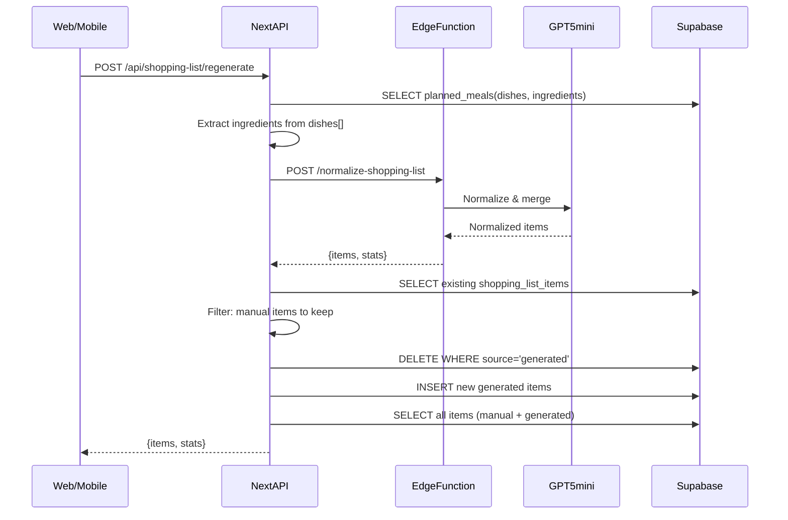

# 買い物リスト「献立から再生成」完全設計（LLM正規化対応）

## 背景と問題点

### 現状の問題

1. **旧データモデル前提**: `planned_meals.ingredients`（text[]）のみ参照。v2/v3/v4は`dishes`（jsonb）に材料が入るため材料が空になる
2. **表記ゆれ**: 「鶏むね肉」「鶏胸肉」「とりむね」が別々にリストアップされる
3. **数量の混在**: 「200g」「1枚」「2個」が入り混じり、同じ材料でも合算されない
4. **手動追加が消える**: 全削除→再作成のため手動追加した項目も消える
5. **エラーが分からない**: Web側で失敗しても無反応

### 現状の問題コード

```17:55:src/app/api/shopping-list/regenerate/route.ts
    const { data: mealPlan, error: planError } = await supabase
      .from('meal_plans')
      .select(`
        id,
        meal_plan_days (
          id,
          planned_meals (
            id,
            ingredients  // ← v2/v3/v4はdishesに材料が入るので空
          )
        )
      `)
      .eq('id', mealPlanId)
      .eq('user_id', user.id)
      .single();

    // ... 

    // Delete existing shopping list items
    await supabase
      .from('shopping_list_items')
      .delete()
      .eq('meal_plan_id', mealPlanId);  // ← 手動追加も消える
```

## ゴール

1. **v2/v3/v4対応**: `planned_meals.dishes[].ingredients[]` から材料を抽出
2. **LLM正規化**: GPT-5-miniで表記ゆれ吸収・数量正規化・重複マージ
3. **手動保持**: `source` カラムで生成/手動を区別し、生成分だけ差し替え
4. **UIでの識別**: バッジ表示で生成/手動を視覚的に区別
5. **ローディングUX**: 既存のAIローディングパターンに合わせたスピナー表示
6. **可観測性**: `app_logs` で再生成の開始/結果/失敗を記録

---

## 設計詳細

### 1. DBスキーマ拡張

```sql
-- マイグレーション: 20260107_add_shopping_list_source.sql

ALTER TABLE shopping_list_items 
  ADD COLUMN IF NOT EXISTS source TEXT NOT NULL DEFAULT 'manual';
  -- 'manual' = 手動追加, 'generated' = 献立から生成

ALTER TABLE shopping_list_items 
  ADD COLUMN IF NOT EXISTS normalized_name TEXT;
  -- LLMが正規化した材料名（表記ゆれ吸収用）

ALTER TABLE shopping_list_items 
  ADD COLUMN IF NOT EXISTS quantity_variants JSONB DEFAULT '[]'::jsonb;
  -- 数量バリエーション（タップで切り替え可能）
  -- 原則: 同じ必要量の「別表現」（例: 500g ⇄ 2枚(約500g)）
  -- 例: [{"display": "500g", "unit": "g", "value": 500}, {"display": "2枚(約500g)", "unit": "枚", "value": 2}]

ALTER TABLE shopping_list_items 
  ADD COLUMN IF NOT EXISTS selected_variant_index INTEGER DEFAULT 0;
  -- 現在選択中のバリエーションインデックス

CREATE INDEX IF NOT EXISTS idx_shopping_list_items_source 
  ON shopping_list_items(meal_plan_id, source);

COMMENT ON COLUMN shopping_list_items.source IS 
  'manual=手動追加, generated=献立から自動生成';
COMMENT ON COLUMN shopping_list_items.quantity_variants IS 
  '数量バリエーション配列。タップで切り替え可能。';
```

### 2. Edge Function: normalize-shopping-list

**目的**: LLM（GPT-5-mini）で材料リストを正規化・マージ

**入力**:

```typescript
interface NormalizeInput {
  ingredients: Array<{
    name: string;           // 元の材料名
    amount?: string | null; // 元の数量（"200g", "1枚", "2個" など）
    count: number;          // 出現回数
  }>;
}
```

**出力**:

```typescript
interface NormalizeOutput {
  items: Array<{
    itemName: string;       // 正規化後の材料名
    normalizedName: string; // 検索/マージ用の正規化名
    quantityVariants: Array<{  // 数量のバリエーション（タップで切り替え）
      display: string;      // 表示用（"500g", "2枚" など）
      unit: string;         // 単位（"g", "枚", "個" など）
      value: number | null; // 数値（パース可能な場合）
    }>;
    category: string;       // カテゴリ（野菜, 肉, 魚, 調味料, ...）
  }>;
  stats: {
    inputCount: number;
    outputCount: number;
    mergedCount: number;
  };
}
```

**LLMプロンプト**:

```typescript
const prompt = `あなたは買い物リストの最適化AIです。

以下の材料リストを整理してください：
${JSON.stringify(ingredients, null, 2)}

【タスク】
1. **表記ゆれの統一**: 同じ材料の異なる表記を統一
                                                                                                                                                                                                                                                   - 例: 「鶏むね肉」「鶏胸肉」「とりむね」→「鶏むね肉」
                                                                                                                                                                                                                                                   - 例: 「玉ねぎ」「たまねぎ」「玉葱」→「玉ねぎ」

2. **数量の整理**: 同じ材料の数量をまとめる
                                                                                                                                                                                                                                                   - 同じ単位なら合算: 「200g」+「300g」→「500g」
                                                                                                                                                                                                                                                   - **異なる単位は可能な限り換算して合算**し、quantityVariants は「同じ必要量の別表現」として保持（ユーザーがタップで切り替え可能）
                                                                                                                                                                                                                                                   - 換算が難しい場合は「約」や注記を付ける（例: "2枚(約500g)" / "2枚(換算不可)"）
                                                                                                                                                                                                                                                   - 「適量」「少々」は無視して数値のある方を優先

3. **カテゴリ分類**: 野菜/肉/魚/乳製品/調味料/乾物/豆腐・大豆/卵/麺・米/その他

【出力形式】JSON
{
  "items": [
    {
      "itemName": "鶏むね肉",
      "normalizedName": "鶏むね肉",
      "quantityVariants": [
        {"display": "500g", "unit": "g", "value": 500},
        {"display": "2枚(約500g)", "unit": "枚", "value": 2}
      ],
      "category": "肉"
    },
    {
      "itemName": "玉ねぎ",
      "normalizedName": "玉ねぎ",
      "quantityVariants": [
        {"display": "3個", "unit": "個", "value": 3}
      ],
      "category": "野菜"
    }
  ]
}

【重要ルール】
- quantityVariants は単位ごとに1エントリ（同単位は合算済み）
- 数値がない場合（「適量」等）は value: null、display: "適量"
- 入力にない材料を追加しない（ハルシネーション禁止）。入力材料はまとめるだけで、勝手に増やさない
- JSONのみ出力（説明文不要）`;
```

**実装パターン**: 既存の `ingredient-matcher.ts` を参考に:

```typescript
// supabase/functions/normalize-shopping-list/index.ts
import "jsr:@supabase/functions-js/edge-runtime.d.ts";
import { corsHeaders } from "../_shared/cors.ts";
import { createDbLogger } from "../_shared/db-logger.ts";

Deno.serve(async (req: Request) => {
  if (req.method === "OPTIONS") {
    return new Response("ok", { headers: corsHeaders });
  }

  const log = createDbLogger("normalize-shopping-list");
  const apiKey = Deno.env.get("OPENAI_API_KEY");
  if (!apiKey) {
    return new Response(JSON.stringify({ error: "Missing API key" }), { 
      status: 500, headers: { ...corsHeaders, "Content-Type": "application/json" } 
    });
  }

  try {
    const { ingredients } = await req.json();
    log.info("Starting normalization", { count: ingredients.length });

    const res = await fetch("https://api.openai.com/v1/chat/completions", {
      method: "POST",
      headers: {
        "Content-Type": "application/json",
        "Authorization": `Bearer ${apiKey}`,
      },
      body: JSON.stringify({
        model: "gpt-5-mini",
        messages: [{ role: "user", content: buildPrompt(ingredients) }],
        temperature: 0,
        max_tokens: 2000,
        response_format: { type: "json_object" },
      }),
    });

    if (!res.ok) {
      const err = await res.text();
      throw new Error(`OpenAI API error: ${err}`);
    }

    const data = await res.json();
    const content = data.choices?.[0]?.message?.content ?? "[]";
    const items = JSON.parse(content);

    log.info("Normalization complete", { 
      inputCount: ingredients.length, 
      outputCount: items.length 
    });

    return new Response(JSON.stringify({ 
      items, 
      stats: { 
        inputCount: ingredients.length, 
        outputCount: items.length,
        mergedCount: ingredients.length - items.length 
      } 
    }), {
      headers: { ...corsHeaders, "Content-Type": "application/json" },
    });
  } catch (e: any) {
    log.error("Normalization failed", e);
    return new Response(JSON.stringify({ error: e.message }), { 
      status: 500, headers: { ...corsHeaders, "Content-Type": "application/json" } 
    });
  }
});
```

### 3. API: /api/shopping-list/regenerate の更新

**処理フロー**:



**材料抽出ロジック（v2/v3/v4対応）**:

```typescript
function extractIngredients(mealPlan: any): Map<string, { name: string; amount: string | null; count: number }> {
  const map = new Map<string, { name: string; amount: string | null; count: number }>();

  mealPlan.meal_plan_days?.forEach((day: any) => {
    day.planned_meals?.forEach((meal: any) => {
      // 優先: dishes[].ingredients[]（v2/v3/v4）
      if (meal.dishes && Array.isArray(meal.dishes)) {
        meal.dishes.forEach((dish: any) => {
          if (dish.ingredients && Array.isArray(dish.ingredients)) {
            dish.ingredients.forEach((ing: any) => {
              const name = typeof ing === 'string' ? ing : ing.name;
              const amount = typeof ing === 'string' ? null : (ing.amount || ing.amount_g?.toString() + 'g' || null);
              if (name?.trim()) {
                const key = name.trim();
                const existing = map.get(key);
                if (existing) {
                  existing.count++;
                  // 数量がある場合は上書き（後で合算はLLMに任せる）
                  if (amount && !existing.amount) existing.amount = amount;
                } else {
                  map.set(key, { name: key, amount, count: 1 });
                }
              }
            });
          }
        });
      }

      // フォールバック: ingredients（旧形式）
      if (meal.ingredients && Array.isArray(meal.ingredients)) {
        meal.ingredients.forEach((ing: string) => {
          const trimmed = ing.trim();
          if (trimmed) {
            const existing = map.get(trimmed);
            if (existing) {
              existing.count++;
            } else {
              map.set(trimmed, { name: trimmed, amount: null, count: 1 });
            }
          }
        });
      }
    });
  });

  return map;
}
```

**手動保持ロジック**:

```typescript
// 既存の手動追加アイテムを取得
const { data: existingItems } = await supabase
  .from('shopping_list_items')
  .select('*')
  .eq('meal_plan_id', mealPlanId);

// 手動追加の材料名を集合化
const manualNames = new Set(
  existingItems
    ?.filter(item => item.source !== 'generated')
    .map(item => item.normalized_name || item.item_name)
);

// 以前のgenerated項目のis_checked状態を保持
const prevCheckedMap = new Map(
  existingItems
    ?.filter(item => item.source === 'generated')
    .map(item => [item.normalized_name || item.item_name, item.is_checked])
);

// 以前のgenerated項目の「選択中単位」を保持（再生成後も同じ単位があれば引き継ぐ）
const prevSelectedUnitMap = new Map(
  existingItems
    ?.filter(item => item.source === 'generated')
    .map(item => {
      const variants = item.quantity_variants || [];
      const idx = item.selected_variant_index || 0;
      const unit = variants[idx]?.unit || null;
      return [item.normalized_name || item.item_name, unit];
    })
);

// 手動と重複するgeneratedは除外
const newItems = normalizedItems
  .filter(item => !manualNames.has(item.normalizedName))
  .map(item => ({
    meal_plan_id: mealPlanId,
    item_name: item.itemName,
    normalized_name: item.normalizedName,
    // 以前選択していた unit があれば、それに合わせて初期インデックスを決める
    selected_variant_index: (() => {
      const prevUnit = prevSelectedUnitMap.get(item.normalizedName);
      if (!prevUnit) return 0;
      const idx = item.quantityVariants.findIndex(v => v.unit === prevUnit);
      return idx >= 0 ? idx : 0;
    })(),
    quantity: (() => {
      const idx = (() => {
        const prevUnit = prevSelectedUnitMap.get(item.normalizedName);
        if (!prevUnit) return 0;
        const i = item.quantityVariants.findIndex(v => v.unit === prevUnit);
        return i >= 0 ? i : 0;
      })();
      return item.quantityVariants[idx]?.display || item.quantityVariants[0]?.display || null;
    })(), // 後方互換: 現在選択中の表示をquantityにも反映
    quantity_variants: item.quantityVariants,
    category: item.category,
    source: 'generated',
    is_checked: prevCheckedMap.get(item.normalizedName) || false,
  }));

// generated分だけ削除→挿入
await supabase.from('shopping_list_items').delete()
  .eq('meal_plan_id', mealPlanId)
  .eq('source', 'generated');

if (newItems.length > 0) {
  await supabase.from('shopping_list_items').insert(newItems);
}

// 全件取得して返す
const { data: allItems } = await supabase
  .from('shopping_list_items')
  .select('*')
  .eq('meal_plan_id', mealPlanId)
  .order('category')
  .order('created_at');
```

### 4. Web UI: ローディング状態（既存パターン準拠）

既存の `isRegenerating` パターンに合わせる:

```tsx
// page.tsx
const [isRegeneratingShoppingList, setIsRegeneratingShoppingList] = useState(false);

const regenerateShoppingList = async () => {
  if (!currentPlan || isRegeneratingShoppingList) return;
  
  setIsRegeneratingShoppingList(true);
  try {
    const res = await fetch(`/api/shopping-list/regenerate`, {
      method: 'POST',
      headers: { 'Content-Type': 'application/json' },
      body: JSON.stringify({ mealPlanId: currentPlan.id })
    });
    
    if (!res.ok) {
      const err = await res.json();
      throw new Error(err.error || '再生成に失敗しました');
    }
    
    const { items, stats } = await res.json();
    setShoppingList(items);
    setSuccessMessage({ 
      title: '買い物リストを更新しました ✓', 
      message: `${stats.outputCount}件の材料（${stats.mergedCount}件を統合）` 
    });
  } catch (e: any) {
    alert(e.message || '再生成に失敗しました');
  } finally {
    setIsRegeneratingShoppingList(false);
  }
};

// ボタン部分
<button 
  onClick={regenerateShoppingList} 
  disabled={isRegeneratingShoppingList}
  className="flex-[2] p-3 rounded-xl flex items-center justify-center gap-1.5" 
  style={{ background: colors.accent, opacity: isRegeneratingShoppingList ? 0.7 : 1 }}
>
  {isRegeneratingShoppingList ? (
    <>
      <div className="w-4 h-4 border-2 border-white border-t-transparent rounded-full animate-spin" />
      <span style={{ fontSize: 13, fontWeight: 600, color: '#fff' }}>AIが整理中...</span>
    </>
  ) : (
    <>
      <RefreshCw size={14} color="#fff" />
      <span style={{ fontSize: 13, fontWeight: 600, color: '#fff' }}>献立から再生成</span>
    </>
  )}
</button>
```

### 5. Web UI: 数量タップ切り替え + 生成/手動バッジ

**数量切り替えコンポーネント**:

```tsx
// QuantityToggle: タップで数量バリエーションを切り替え
const QuantityToggle = ({ 
  item, 
  onToggle 
}: { 
  item: ShoppingListItem; 
  onToggle: (itemId: string, newIndex: number) => void;
}) => {
  const variants = item.quantityVariants || [];
  const currentIndex = item.selectedVariantIndex || 0;
  const currentVariant = variants[currentIndex];
  
  // バリエーションが1つ以下なら単純表示
  if (variants.length <= 1) {
    return (
      <span style={{ fontSize: 12, color: colors.textMuted }}>
        {currentVariant?.display || item.quantity || ''}
      </span>
    );
  }
  
  // 複数バリエーションならタップで切り替え
  const handleTap = () => {
    const nextIndex = (currentIndex + 1) % variants.length;
    onToggle(item.id, nextIndex);
  };
  
  return (
    <button 
      onClick={handleTap}
      className="flex items-center gap-1 px-2 py-1 rounded-lg transition-colors"
      style={{ 
        background: colors.bg, 
        border: `1px solid ${colors.border}` 
      }}
      title={`タップで切り替え（${variants.length}種類）`}
    >
      <span style={{ fontSize: 12, color: colors.text, fontWeight: 500 }}>
        {currentVariant?.display}
      </span>
      {/* 切り替え可能インジケーター */}
      <ChevronRight size={10} color={colors.textMuted} />
    </button>
  );
};

// API: バリエーション切り替え
const toggleQuantityVariant = async (itemId: string, newIndex: number) => {
  // 楽観的更新
  setShoppingList(prev => 
    prev.map(i => i.id === itemId ? { ...i, selectedVariantIndex: newIndex } : i)
  );
  
  try {
    await fetch(`/api/shopping-list/${itemId}`, {
      method: 'PATCH',
      headers: { 'Content-Type': 'application/json' },
      body: JSON.stringify({ selectedVariantIndex: newIndex }),
    });
  } catch (e) {
    // 失敗したら元に戻す
    setShoppingList(prev => 
      prev.map(i => i.id === itemId ? { ...i, selectedVariantIndex: (newIndex === 0 ? 1 : 0) } : i)
    );
  }
};
```

**買い物リストアイテム表示**:

```tsx
{shoppingList.map(item => (
  <div key={item.id} className="flex items-center gap-2.5 p-3 rounded-[10px] mb-1.5" ...>
    {/* チェックボックス */}
    <button onClick={() => toggleShoppingItem(item.id, item.isChecked)} ...>
      {item.isChecked && <Check size={12} color="#fff" />}
    </button>
    
    {/* 材料名 */}
    <span className="flex-1" ...>{item.itemName}</span>
    
    {/* 数量（タップで切り替え） */}
    <QuantityToggle item={item} onToggle={toggleQuantityVariant} />
    
    {/* カテゴリ */}
    <span className="px-1.5 py-0.5 rounded text-[10px]" ...>
      {item.category || '食材'}
    </span>
    
    {/* 生成/手動バッジ */}
    <span 
      className="px-1.5 py-0.5 rounded text-[10px]" 
      style={{ 
        background: item.source === 'generated' ? '#E8F5E9' : '#FFF3E0',
        color: item.source === 'generated' ? '#2E7D32' : '#E65100'
      }}
    >
      {item.source === 'generated' ? 'AI' : '手動'}
    </span>
    
    {/* 削除ボタン */}
    <button onClick={() => deleteShoppingItem(item.id)} ...>
      <Trash2 size={12} color={colors.textMuted} />
    </button>
  </div>
))}
```

### 6. Mobile UI: 更新

```tsx
// apps/mobile/app/shopping-list/index.tsx

const [isRegenerating, setIsRegenerating] = useState(false);

async function regenerate() {
  if (!mealPlanId || isRegenerating) return;
  Alert.alert(
    "献立から再生成", 
    "AIが材料を整理します。手動追加した項目は残ります。", 
    [
      { text: "キャンセル", style: "cancel" },
      {
        text: "再生成",
        onPress: async () => {
          setIsRegenerating(true);
          try {
            const api = getApi();
            const { items, stats } = await api.post("/api/shopping-list/regenerate", { mealPlanId });
            setItems(items);
            Alert.alert("完了", `${stats.outputCount}件の材料を整理しました`);
          } catch (e: any) {
            Alert.alert("再生成失敗", e?.message ?? "再生成に失敗しました。");
          } finally {
            setIsRegenerating(false);
          }
        },
      },
    ]
  );
}

// ボタン部分
<Pressable 
  onPress={regenerate} 
  disabled={isRegenerating}
  style={{ 
    paddingVertical: 8, 
    paddingHorizontal: 10, 
    borderRadius: 10, 
    backgroundColor: isRegenerating ? "#999" : "#333",
    flexDirection: 'row',
    alignItems: 'center',
    gap: 4
  }}
>
  {isRegenerating && <ActivityIndicator size="small" color="white" />}
  <Text style={{ color: "white", fontWeight: "900" }}>
    {isRegenerating ? "整理中..." : "再生成"}
  </Text>
</Pressable>

// バッジ表示
<View style={{ flexDirection: 'row', gap: 4 }}>
  <View style={{ 
    paddingHorizontal: 6, 
    paddingVertical: 2, 
    borderRadius: 4, 
    backgroundColor: it.source === 'generated' ? '#E8F5E9' : '#FFF3E0' 
  }}>
    <Text style={{ 
      fontSize: 10, 
      color: it.source === 'generated' ? '#2E7D32' : '#E65100' 
    }}>
      {it.source === 'generated' ? 'AI' : '手動'}
    </Text>
  </View>
</View>
```

---

## 検証手順

1. **材料抽出テスト**:

                                                                                                                                                                                                                                                                                                                                                                                                                                                                                                                                                                                                                                                                                                                                                                                                                                                                                                                                                                                                                                                                                                                                                                                                                                                                                                                                                                                                                                                                                                                                                                                                                                                                                                                                                                                                                                                                                                                                                                                                                                                                                                                                                                                                                                                                                                                                                                                                                                                                                                                                                                                                                                                                                                                                                                                                                                                                                                                                                                                                                                                                                                                                                                                                - v2/v3/v4で生成した献立の再生成が成功すること
                                                                                                                                                                                                                                                                                                                                                                                                                                                                                                                                                                                                                                                                                                                                                                                                                                                                                                                                                                                                                                                                                                                                                                                                                                                                                                                                                                                                                                                                                                                                                                                                                                                                                                                                                                                                                                                                                                                                                                                                                                                                                                                                                                                                                                                                                                                                                                                                                                                                                                                                                                                                                                                                                                                                                                                                                                                                                                                                                                                                                                                                                                                                                                                                - `dishes[].ingredients[]` から材料が抽出されること

2. **LLM正規化テスト**:

                                                                                                                                                                                                                                                                                                                                                                                                                                                                                                                                                                                                                                                                                                                                                                                                                                                                                                                                                                                                                                                                                                                                                                                                                                                                                                                                                                                                                                                                                                                                                                                                                                                                                                                                                                                                                                                                                                                                                                                                                                                                                                                                                                                                                                                                                                                                                                                                                                                                                                                                                                                                                                                                                                                                                                                                                                                                                                                                                                                                                                                                                                                                                                                                - 「鶏むね肉」「鶏胸肉」が1つにマージされること
                                                                                                                                                                                                                                                                                                                                                                                                                                                                                                                                                                                                                                                                                                                                                                                                                                                                                                                                                                                                                                                                                                                                                                                                                                                                                                                                                                                                                                                                                                                                                                                                                                                                                                                                                                                                                                                                                                                                                                                                                                                                                                                                                                                                                                                                                                                                                                                                                                                                                                                                                                                                                                                                                                                                                                                                                                                                                                                                                                                                                                                                                                                                                                                                - 「200g」+「300g」が「500g」に合算されること
                                                                                                                                                                                                                                                                                                                                                                                                                                                                                                                                                                                                                                                                                                                                                                                                                                                                                                                                                                                                                                                                                                                                                                                                                                                                                                                                                                                                                                                                                                                                                                                                                                                                                                                                                                                                                                                                                                                                                                                                                                                                                                                                                                                                                                                                                                                                                                                                                                                                                                                                                                                                                                                                                                                                                                                                                                                                                                                                                                                                                                                                                                                                                                                                - 「少々」「適量」が無視されること

3. **手動保持テスト**:

                                                                                                                                                                                                                                                                                                                                                                                                                                                                                                                                                                                                                                                                                                                                                                                                                                                                                                                                                                                                                                                                                                                                                                                                                                                                                                                                                                                                                                                                                                                                                                                                                                                                                                                                                                                                                                                                                                                                                                                                                                                                                                                                                                                                                                                                                                                                                                                                                                                                                                                                                                                                                                                                                                                                                                                                                                                                                                                                                                                                                                                                                                                                                                                                - 手動で2件追加 → 再生成 → 手動2件が残ること
                                                                                                                                                                                                                                                                                                                                                                                                                                                                                                                                                                                                                                                                                                                                                                                                                                                                                                                                                                                                                                                                                                                                                                                                                                                                                                                                                                                                                                                                                                                                                                                                                                                                                                                                                                                                                                                                                                                                                                                                                                                                                                                                                                                                                                                                                                                                                                                                                                                                                                                                                                                                                                                                                                                                                                                                                                                                                                                                                                                                                                                                                                                                                                                                - 手動と同名の材料はgeneratedから除外されること

4. **UI/UXテスト**:

                                                                                                                                                                                                                                                                                                                                                                                                                                                                                                                                                                                                                                                                                                                                                                                                                                                                                                                                                                                                                                                                                                                                                                                                                                                                                                                                                                                                                                                                                                                                                                                                                                                                                                                                                                                                                                                                                                                                                                                                                                                                                                                                                                                                                                                                                                                                                                                                                                                                                                                                                                                                                                                                                                                                                                                                                                                                                                                                                                                                                                                                                                                                                                                                - ローディング中はスピナーが表示されること
                                                                                                                                                                                                                                                                                                                                                                                                                                                                                                                                                                                                                                                                                                                                                                                                                                                                                                                                                                                                                                                                                                                                                                                                                                                                                                                                                                                                                                                                                                                                                                                                                                                                                                                                                                                                                                                                                                                                                                                                                                                                                                                                                                                                                                                                                                                                                                                                                                                                                                                                                                                                                                                                                                                                                                                                                                                                                                                                                                                                                                                                                                                                                                                                - 生成/手動のバッジが正しく表示されること
                                                                                                                                                                                                                                                                                                                                                                                                                                                                                                                                                                                                                                                                                                                                                                                                                                                                                                                                                                                                                                                                                                                                                                                                                                                                                                                                                                                                                                                                                                                                                                                                                                                                                                                                                                                                                                                                                                                                                                                                                                                                                                                                                                                                                                                                                                                                                                                                                                                                                                                                                                                                                                                                                                                                                                                                                                                                                                                                                                                                                                                                                                                                                                                                - エラー時にメッセージが表示されること

5. **ログテスト**:

                                                                                                                                                                                                                                                                                                                                                                                                                                                                                                                                                                                                                                                                                                                                                                                                                                                                                                                                                                                                                                                                                                                                                                                                                                                                                                                                                                                                                                                                                                                                                                                                                                                                                                                                                                                                                                                                                                                                                                                                                                                                                                                                                                                                                                                                                                                                                                                                                                                                                                                                                                                                                                                                                                                                                                                                                                                                                                                                                                                                                                                                                                                                                                                                - `app_logs` に再生成の開始/結果/エラーが記録されること

---

## 次フェーズ（任意）

- フィルタ機能（生成のみ/手動のみ表示）
- 材料の並び替え（カテゴリ順/追加順）
- 冷蔵庫在庫との突合せ表示