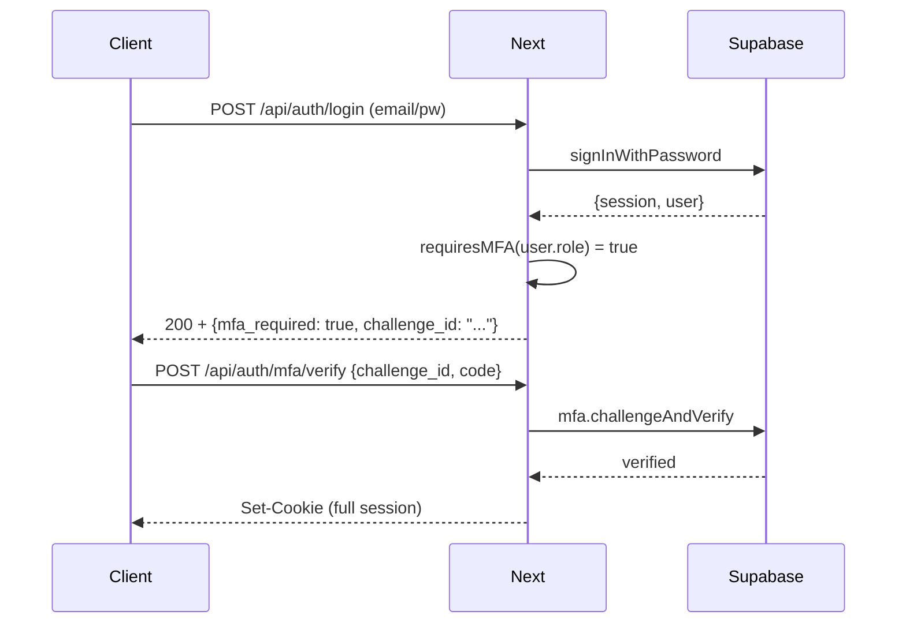
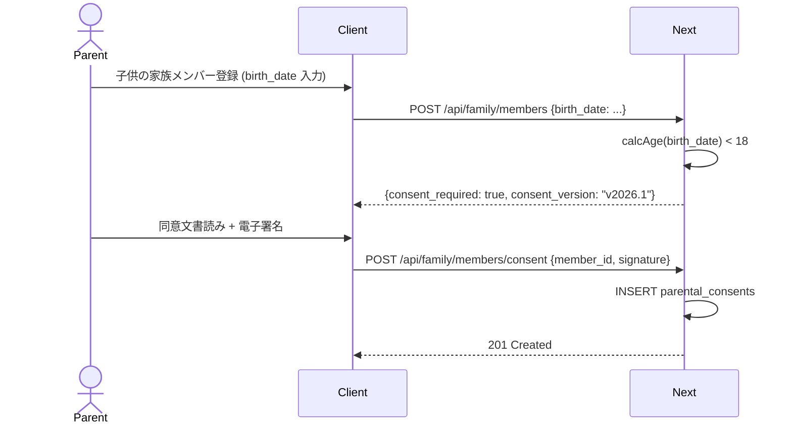
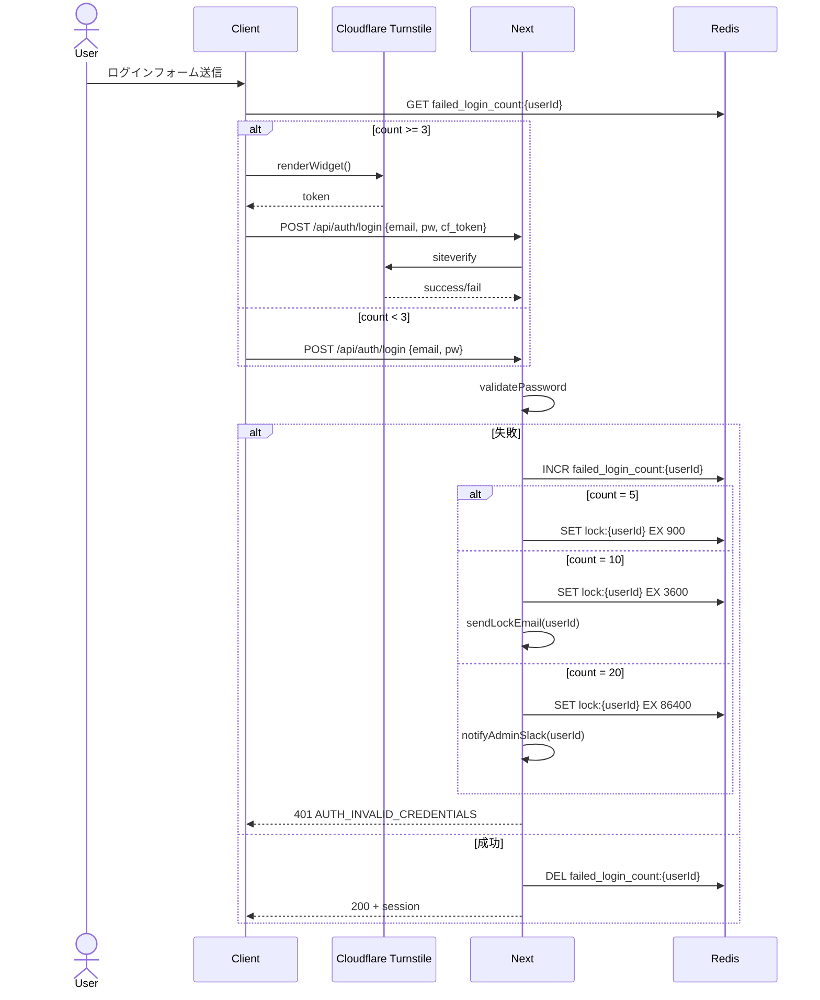

# 認証・セッション管理設計

## 1. 目的・スコープ

全ドメイン共通の認証フロー・セッション管理・2FA/MFA・SSO・パスワードポリシー・子供同意・impersonation を定義する。  
各ドメイン (family / org / operator / mobile) は本ドキュメントを参照し、独自定義を禁止する。

**対象外**: Stripe Webhook 署名検証 (cross/04-api-conventions.md)、RLS ポリシー (cross/02-rls-patterns.md)

---

## 2. 関連要件

- 要件定義 03 §17.1-17.12 (認証・セッション管理)
- 要件定義 03 §17.10 (子供アカウント保護 COPPA / 日本)
- 要件定義 01 §15.4-15.7 (モバイル通知・a11y 周辺)

---

## 3. 認証フロー

### 3.1 対応認証方式

| 方式 | Phase | 備考 |
|------|-------|------|
| Email + Password | Phase 1 | Supabase Auth 標準 |
| Google OAuth | Phase 1 | 個人 + Org Workspace |
| Apple Sign In | Phase 1 | iOS App Store 必須 |
| SAML 2.0 (Azure AD / Google WS / Okta) | Phase 2 | org_enterprise のみ |
| 汎用 OIDC | Phase 2 | org_enterprise のみ |
| LINE Login | Phase 2 | 個人ユーザー向け |
| WebAuthn | Phase 2 | TOTP の代替 |
| SMS 認証 | 非対応 | SIM Swap 攻撃リスクのため禁止 |

### 3.2 Email + Password ログインシーケンス

```mermaid
sequenceDiagram
    actor User
    participant Client
    participant Next as Next.js Edge
    participant Supabase as Supabase Auth
    participant Redis as Upstash Redis

    User->>Client: email + password 入力
    Client->>Next: POST /api/auth/login
    Next->>Redis: rate_limit_check (10/min/IP)
    alt 超過
        Redis-->>Next: 429
        Next-->>Client: RATE_LIMIT_EXCEEDED
    end
    Note over Next: 3回失敗後 Cloudflare Turnstile 必須
    Next->>Supabase: signInWithPassword(email, password)
    alt 失敗
        Supabase-->>Next: invalid credentials
        Next->>Redis: incr failed_login:{userId}
        Note over Next: 5回→15分ロック、10回→1h+メール、20回→24h+admin通知
        Next-->>Client: AUTH_INVALID_CREDENTIALS
    end
    Supabase-->>Next: session (access_token, refresh_token)
    Next->>Next: INSERT user_sessions_metadata
    Note over Next: 2FA が必須ロールの場合
    alt MFA required
        Next-->>Client: AUTH_2FA_REQUIRED
        Client->>Next: POST /api/auth/mfa/verify (code)
        Next->>Supabase: challengeAndVerify
        Supabase-->>Next: verified
    end
    Next-->>Client: Set-Cookie (Secure; HttpOnly; SameSite=Lax)
    Next-->>Client: 200 OK (user profile)
```

### 3.3 ソーシャルログイン統合方針

- 同一メールアドレスの既存アカウントとソーシャルアカウントは **確認メール送信後に自動統合**
- 退会時: ソーシャル連携トークン全削除 + Google/Apple ドキュメント準拠で IdP 側 revoke
- ソーシャルログイン経由の初回登録時は `user_profiles.terms_accepted = true` が入っていないため、利用規約同意モーダルを強制表示

---

## 4. セッション管理

### 4.1 タイムアウト設定

| ロール区分 | アイドルタイムアウト | 絶対タイムアウト |
|-----------|------------------|----------------|
| 個人ユーザー (`user` ロール) | 24 時間 | 30 日 |
| 組織メンバー (`org_member` 以上) | 8 時間 | 7 日 |
| 運営系 (`admin` / `finance` 等) | 1 時間 | 12 時間 |

### 4.2 Cookie 属性

```
Set-Cookie: sb-access-token=...; Path=/; Secure; HttpOnly; SameSite=Lax; Max-Age=86400
Set-Cookie: sb-refresh-token=...; Path=/; Secure; HttpOnly; SameSite=Lax; Max-Age=2592000
```

- `Secure`: HTTPS のみ
- `HttpOnly`: JavaScript からアクセス不可
- `SameSite=Lax`: CSRF 対策 (POST 系はオリジンチェックも追加)

### 4.3 同時ログイン上限

最大 **5 端末** まで。超過時は最古のセッション (`last_active_at` が最も古い) を強制無効化。

ユーザーは `/account/sessions` でセッション一覧を確認し、個別・全端末ログアウトが可能。

### 4.4 ログアウト時の Cookie 完全削除

```typescript
// /api/auth/logout
export async function POST(req: Request) {
  const response = NextResponse.json({ ok: true });
  const cookieNames = ['sb-access-token', 'sb-refresh-token'];
  cookieNames.forEach(name => {
    response.cookies.set(name, '', {
      maxAge: 0,
      path: '/',
      secure: true,
      httpOnly: true,
      sameSite: 'lax',
    });
  });
  // Supabase Auth sign out
  await supabaseAdmin.auth.admin.signOut(sessionId);
  // user_sessions_metadata を revoke
  await db.from('user_sessions_metadata')
    .update({ revoked_at: new Date().toISOString() })
    .eq('session_id', sessionId);
  return response;
}
```

---

## 5. 2FA / MFA

### 5.1 ロール別必須状態

| ロール | 2FA 状態 |
|--------|---------|
| `super_admin` | **必須** (TOTP + バックアップコード) |
| `admin` / `finance` | **必須** (TOTP) |
| `org_admin` | 推奨 (Enterprise プランで強制化可) |
| `org_industrial_doctor` | **必須** (健康データ扱い) |
| その他 | オプション |

### 5.2 TOTP 実装

- Supabase Auth MFA factor (`supabase.auth.mfa.enroll()`) を利用
- TOTP のみ Phase 1 対応。WebAuthn は Phase 2
- バックアップコード: 10 個生成、SHA-256 ハッシュで保存、使用済みは即無効化
- 紛失時リカバリ: super_admin による手動解除 + `admin_audit_logs` 記録 + 本人確認 (身分証アップロード)

### 5.3 MFA 強制フロー



---

## 6. SSO Phase 2 (SAML / OIDC / SCIM / JIT)

### 6.1 対応 IdP (Phase 2)

| IdP | プロトコル |
|-----|---------|
| Azure AD (Entra ID) | SAML 2.0 |
| Google Workspace | SAML 2.0 |
| Okta | SAML 2.0 |
| 汎用 | OIDC |

### 6.2 機能

- IdP 主導 / SP 主導ログイン両対応
- JIT プロビジョニング: `user_profiles` 自動作成、`organization_id` 自動セット
- SCIM 2.0: ユーザー追加・属性更新・削除の双方向同期
- グループ → ロールマッピング: IdP の Group claim → `user_profiles.roles`

### 6.3 organizations テーブル追加列

// SSO 関連カラムの canonical 定義は org/01-data-model.md §3 (organizations テーブル) を参照。
// 以下は参照用の列名概要のみ記載する:
// - sso_enabled BOOLEAN
// - sso_provider VARCHAR(50)          -- 'azure_ad' | 'google_ws' | 'okta' | 'oidc'
// - sso_metadata_url TEXT             -- IdP メタデータ URL
// - sso_metadata_xml TEXT             -- IdP メタデータ XML (直接貼り付け)
// - scim_token_hash TEXT              -- SCIM API 用トークンハッシュ (Vault 暗号化)

---

## 7. パスワードポリシー

### 7.1 ロール別要件

| 項目 | 一般 (`user`) | 組織メンバー (`org_member`+) | 運営 (`admin`+) |
|------|------------|--------------------------|----------------|
| 最小長 | 10 文字 | 12 文字 | 14 文字 |
| 必須文字種 | 英大小英数 | 英大小英数記号 | 英大小英数記号 |
| 過去履歴禁止 | 直近 3 個 | 直近 5 個 | 直近 10 個 |
| 強制ローテーション | なし | なし (Enterprise オプションで 90 日) | 90 日必須 |
| ハッシュ方式 | bcrypt 12 rounds | 同左 | 同左 |
| HIBP 突合 | あり (警告) | あり (拒否) | あり (拒否) |

### 7.2 HIBP (Have I Been Pwned) チェック

```typescript
// src/lib/auth/hibp.ts
export async function checkPasswordBreached(password: string): Promise<boolean> {
  const hash = await crypto.subtle.digest('SHA-1', new TextEncoder().encode(password));
  const hashHex = Array.from(new Uint8Array(hash))
    .map(b => b.toString(16).padStart(2, '0'))
    .join('').toUpperCase();
  const prefix = hashHex.slice(0, 5);
  const suffix = hashHex.slice(5);
  const res = await fetch(`https://api.pwnedpasswords.com/range/${prefix}`);
  const text = await res.text();
  return text.split('\n').some(line => line.startsWith(suffix));
}
```

---

## 8. ログイン失敗ロック

| 失敗回数 | アクション |
|---------|---------|
| 3 回 | Cloudflare Turnstile CAPTCHA 表示 |
| 5 回 | 15 分アカウントロック |
| 10 回 | 1 時間ロック + 本人へメール通知 |
| 20 回 | 24 時間ロック + 管理者 Slack 通知 |

ロック中は正しいパスワードでも拒否。メール経由のリセットのみ解除可能。

カウンターは Upstash Redis に `failed_login:{userId}` キーで管理し、ロック解除後にリセット。

---

## 9. パスワードリセット

### 9.1 フロー

```
1. POST /api/auth/password-reset {email}
   → enumeration 対策: 存在しないメールでも「リセットメールを送信しました」を返す
   → rate limit: 1 メールあたり 3 回/h、IP あたり 10 回/h
2. Resend 経由でリセットリンク送信 (token = 32 byte random, 1 時間有効)
3. GET /api/auth/password-reset/confirm?token={token}
   → token 検証 (使用済み即無効化)
4. POST /api/auth/password-reset/set {token, new_password}
   → HIBP チェック
   → password_history 照合 (直近 N 個)
   → Supabase Auth パスワード更新
   → 全セッション revoke (リセット後は再ログイン強制)
   → admin_audit_logs 記録
```

### 9.2 レート制限実装

```typescript
// src/lib/ratelimit/auth.ts
import { Ratelimit } from '@upstash/ratelimit';
import { Redis } from '@upstash/redis';

export const passwordResetByEmail = new Ratelimit({
  redis: Redis.fromEnv(),
  limiter: Ratelimit.slidingWindow(3, '1 h'),
  prefix: 'pw_reset:email',
});

export const passwordResetByIP = new Ratelimit({
  redis: Redis.fromEnv(),
  limiter: Ratelimit.slidingWindow(10, '1 h'),
  prefix: 'pw_reset:ip',
});
```

---

## 10. メールアドレス変更

```
1. POST /account/email/change {new_email}
2. 新メールへ確認リンク送信 (24 時間有効)
3. 確認後: 旧メールへ変更通知 (詐取検知用)
4. 組織所属者の場合: HR Webhook へ変更通知 (organizations.hr_webhook_enabled=true 時)
5. admin_audit_logs 記録
```

---

## 11. impersonation (なりすまし支援)

**`super_admin` のみ実行可能**。

```typescript
// POST /api/super-admin/impersonate/{userId}
// → 一時セッショントークン発行 (max 1 時間)
// → admin_audit_logs に impersonated_by = actor_id を記録
```

UI 要件:
- 画面上部に **常時赤バナー** 表示:  
  「⚠ [運営者名] として [ユーザー名] さんとしてログイン中。すべての操作が記録されます」
- 全操作が `admin_audit_logs.impersonated_by` 付きで記録
- ユーザーは `/account/privacy` で impersonate 拒否可能 (デフォルト: 許可)

---

## 12. 子供アカウント保護 (COPPA / 日本)

### 12.1 年齢区分と制限

| 年齢 | 根拠法 | 要件 |
|------|-------|------|
| 13 歳未満 | 米国 COPPA | 保護者電子署名同意必須 |
| 18 歳未満 | 日本 個人情報保護法 | 保護者同意必須 |

- 子供アカウント自体は `auth.users` を持たない (`family_members.user_id IS NULL`)
- `family_members.birth_date` で年齢計算
- 13 歳未満には Push 通知送信不可
- `parental_consents` テーブルに同意記録 (§13 DDL 参照)

### 12.2 保護者同意フロー



---

## 13. データモデル

### 13.1 password_history

<!-- DDL/RLS は operator/01-data-model.md §3.23 を参照 (canonical)。本ドキュメントは設計方針のみ記述 -->

### 13.2 parental_consents

// parental_consents の DDL は family/01-data-model.md §4.13 を参照
// RLS ポリシーも family/01-data-model.md §4.13 に集約

### 13.3 user_sessions_metadata

<!-- DDL は operator/01-data-model.md §3.25 を参照 (canonical) -->

### 13.4 failed_invite_lookups

招待トークンの総当たり攻撃の検知・レート制限用イベントログテーブル。

<!-- DDL は operator/01-data-model.md §3.24 を参照 (canonical) -->

---

## 14. 認可ヘルパー関数仕様

### 14.1 requireRole

```typescript
// src/lib/auth/helpers.ts

/**
 * リクエストから認証済みユーザーを取得し、指定ロールのいずれかを持つか検証する。
 * 失敗時は NextResponse で 401 / 403 を返す準備が整った例外を throw する。
 *
 * @param roles - 許可するロールの配列 (例: ['admin', 'super_admin'])
 * @returns 認証済みユーザーの user_profiles 行
 * @throws AuthError (401) - 未認証の場合
 * @throws PermError (403) - ロール不足の場合
 */
export async function requireRole(
  roles: UserRole[]
): Promise<UserProfile> {
  const supabase = createServerClient();
  const { data: { user }, error } = await supabase.auth.getUser();
  if (error || !user) throw new AuthError('AUTH_UNAUTHENTICATED');

  const { data: profile } = await supabase
    .from('user_profiles')
    .select('roles')
    .eq('id', user.id)
    .single();

  if (!profile) throw new AuthError('AUTH_PROFILE_NOT_FOUND');
  const userRoles = (profile?.roles ?? []) as UserRole[];
  if (!userRoles.some(r => roles.includes(r))) {
    throw new PermError('PERM_DENIED', `Requires one of: ${roles.join(', ')}`);
  }
  return { ...user, roles: userRoles };
}
```

### 14.2 requireOrgRole

```typescript
/**
 * ユーザーが指定の organization に対して指定のロールを持つか検証する。
 * 組織とユーザーの所属一致も検証する。
 *
 * @param userId - 検証対象ユーザー ID
 * @param orgId  - 組織 ID
 * @param roles  - 許可する org ロールの配列 (例: ['org_admin', 'org_manager'])
 */
export async function requireOrgRole(
  userId: string,
  orgId: string,
  roles: OrgRole[]
): Promise<void> {
  const supabase = createServerClient();
  const { data: profile } = await supabase
    .from('user_profiles')
    .select('roles, organization_id')
    .eq('user_id', userId)
    .single();

  if (!profile) throw new AuthError('AUTH_PROFILE_NOT_FOUND');
  if (profile.organization_id !== orgId) {
    throw new PermError('PERM_ORG_MISMATCH');
  }
  if (!(profile.roles as OrgRole[]).some(r => roles.includes(r))) {
    throw new PermError('PERM_DENIED');
  }
}
```

### 14.3 resolveOrganizationId

```typescript
/**
 * リクエストパラメータまたは認証ユーザーのプロフィールから organization_id を解決する。
 * admin / super_admin はクエリパラメータ ?org_id= で任意の組織を指定可能。
 * それ以外は自身の organization_id を使用。
 *
 * @param user    - requireRole で取得した UserProfile
 * @param reqOrgId - URL パラメータまたはクエリから受け取った org_id (nullable)
 * @returns 解決済み organization_id
 */
export function resolveOrganizationId(
  user: UserProfile,
  reqOrgId?: string
): string {
  const isAdmin = (user.roles as string[]).some(r => ['admin', 'super_admin'].includes(r));
  if (isAdmin && reqOrgId) return reqOrgId;
  if (!user.organization_id) throw new PermError('PERM_NO_ORG');
  return user.organization_id;
}
```

### 14.4 型定義

```typescript
// src/types/domain/auth.ts
export type UserRole =
  | 'user'
  | 'support'
  | 'sales'
  | 'finance'
  | 'content_moderator'
  | 'org_member'
  | 'org_viewer'
  | 'org_manager'
  | 'org_admin'
  | 'org_industrial_doctor'
  | 'admin'
  | 'super_admin';

export type OrgRole = Extract<
  UserRole,
  'org_member' | 'org_viewer' | 'org_manager' | 'org_admin' | 'org_industrial_doctor'
>;

export class AuthError extends Error {
  constructor(public code: string, message?: string) {
    super(message ?? code);
    this.name = 'AuthError';
  }
}

export class PermError extends Error {
  constructor(public code: string, message?: string) {
    super(message ?? code);
    this.name = 'PermError';
  }
}
```

---

## 15. シーケンス: CAPTCHA + ロック統合フロー



---

## 16. テスト方針

| テスト種別 | 対象 | ツール |
|---------|------|------|
| Unit | `requireRole`, `requireOrgRole`, `resolveOrganizationId`, HIBP チェック | Vitest |
| Integration | ログイン失敗ロック、セッション同時 5 端末上限 | Vitest + Supabase Local |
| E2E | 正常ログイン → MFA → ダッシュボード到達、パスワードリセット全フロー | Playwright |
| Security | CAPTCHA バイパス試行、enumeration 対策、Cookie 属性 | Playwright + 手動 |

---

## 17. 既存実装との関連

| 資産 | 状態 | 対応 |
|------|------|------|
| `src/middleware.ts` (セッション同期) | 保持 | `user_sessions_metadata` 更新ロジックを追加 |
| Supabase Auth Email+Password | 保持 | そのまま利用 |
| `/api/auth/login`, `/api/auth/logout` 既存 | 要確認 | 本仕様に合わせてリファクタ |
| `user_profiles.roles` 列 | 保持・拡張 | 12 ロール体系へ migration |

---

## 18. 未解決事項

| 項目 | 状態 | 期限 |
|------|------|------|
| WebAuthn (Phase 2) の Supabase 対応状況確認 | TODO | Phase 2 着手前 |
| SCIM 2.0 エンドポイント詳細設計 | TODO | org/08-sso-saml.md で定義 |
| LINE Login の Supabase OAuth 設定手順 | TODO | Phase 2 |
| impersonation のセッション分離方式 (Cookie prefix 等) | TODO | operator 実装前に確定 |
| 管理者向け 90 日パスワードローテーション強制の実装方法 | TODO | Phase 1 リリース前 |
