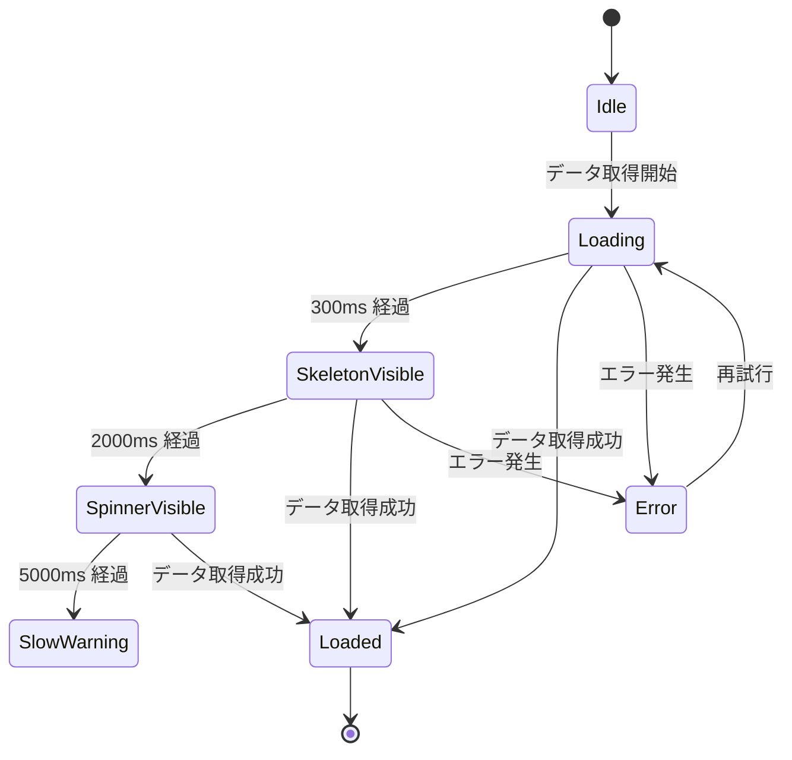

# デザインシステム設計

## 1. 目的・スコープ

全ドメイン共通のデザイントークン・コンポーネント規約・UX パターンを定義する。  
family / org / operator / mobile の各ドメインは本ドキュメントを参照し、独自のスタイルを定義しない。

**対象外**: ドメイン固有の画面レイアウト詳細 (各ドメインの ui-spec.md で定義)

---

## 2. 関連要件

- 要件定義 03 §21 (UX・デザインシステム全項)
- 要件定義 03 §16.1-2 (i18n / a11y)

---

## 3. カラートークン

### 3.1 Tailwind v4 @theme 定義

```css
/* src/styles/tokens.css */
@theme {
  /* ブランドカラー */
  --color-primary:        #E07A5F;  /* Primary brand (暖色・食欲刺激) */
  --color-primary-hover:  #C76A50;
  --color-primary-light:  #F5C8B4;
  --color-primary-dark:   #A8503C;

  /* アクセント */
  --color-secondary:      #81B29A;  /* Accent (健康・自然) */
  --color-secondary-hover:#6A9A83;
  --color-secondary-light:#C5DDD3;

  /* 背景 */
  --color-bg:             #FAF9F7;  /* Light background */
  --color-bg-elevated:    #FFFFFF;  /* Card / Modal 背景 */
  --color-bg-subtle:      #F3F4F6;  /* セクション背景 */

  /* ダークモード (Phase 2) */
  --color-bg-dark:        #1F2937;
  --color-bg-elevated-dark: #374151;
  --color-bg-subtle-dark: #111827;

  /* ステータスカラー */
  --color-success:        #10B981;
  --color-success-light:  #D1FAE5;
  --color-warning:        #F59E0B;
  --color-warning-light:  #FEF3C7;
  --color-danger:         #EF4444;
  --color-danger-light:   #FEE2E2;
  --color-info:           #3B82F6;
  --color-info-light:     #DBEAFE;

  /* テキスト */
  --color-text:           #111827;  /* 本文テキスト */
  --color-text-secondary: #6B7280;  /* サブテキスト */
  --color-text-disabled:  #9CA3AF;
  --color-text-inverse:   #FFFFFF;  /* 濃い背景上のテキスト */

  /* ボーダー */
  --color-border:         #E5E7EB;
  --color-border-strong:  #D1D5DB;
  --color-border-focus:   #E07A5F;  /* = primary */
}
```

### 3.2 コントラスト基準 (WCAG 2.1 AA)

| 組み合わせ | コントラスト比 | 基準 |
|-----------|-------------|------|
| `--color-text` on `--color-bg` | 15.3:1 | ✅ AA (≥4.5:1) |
| `--color-text-secondary` on `--color-bg` | 4.6:1 | ✅ AA |
| `--color-text-inverse` on `--color-primary` | 4.6:1 | ✅ AA |
| `--color-danger` on white | 4.5:1 | ✅ AA |
| `--color-warning` text on white | 要確認 | ⚠ 背景色変更で担保 |

**原則**: 色のみで情報を伝達しない。危険状態は赤色 + アイコン (`<AlertCircle>`) を常に併用する。

---

## 4. タイポグラフィスケール

### 4.1 フォント

- **主要フォント**: Noto Sans JP (CJK 対応必須)
- **フォールバック**: `"Noto Sans JP", "Helvetica Neue", Arial, sans-serif`
- Next.js の `next/font/google` で最適化ロード

### 4.2 スケール

```css
/* tailwind.config.ts の fontSize 設定に対応 */
xs:   12px / line-height: 1.5 / 例: キャプション、タグ
sm:   14px / line-height: 1.5 / 例: サブテキスト、フォームラベル
base: 16px / line-height: 1.5 / 例: 本文 (デフォルト)
lg:   18px / line-height: 1.5 / 例: 強調テキスト
xl:   20px / line-height: 1.25 / 例: カード見出し
2xl:  24px / line-height: 1.25 / 例: セクション見出し (h2)
3xl:  30px / line-height: 1.25 / 例: ページ見出し (h1)
4xl:  36px / line-height: 1.2  / 例: LP ヒーロー
```

### 4.3 font-weight

```
400 (regular): 本文
500 (medium):  ラベル、ナビゲーション
700 (bold):    見出し、CTA ボタン
```

---

## 5. スペーシング (4px grid)

Tailwind デフォルトの `0.25rem` 単位準拠。

```
spacing-1  = 4px   (要素内パディング最小)
spacing-2  = 8px   (アイコン + テキスト間)
spacing-3  = 12px  (フォーム要素内パディング)
spacing-4  = 16px  (カード内パディング)
spacing-6  = 24px  (セクション間)
spacing-8  = 32px  (ページ余白)
spacing-12 = 48px  (大セクション間)
spacing-16 = 64px  (LP セクション間)
```

**禁止**: `margin: 3px`, `padding: 7px` 等の 4px グリッドに乗らない値。Tailwind のクラスを使用すること。

---

## 6. シャドウ / 角丸 / ボーダー

### 6.1 シャドウ

```css
shadow-sm:  0 1px 2px  rgba(0,0,0,0.05)   /* subtle (入力フィールド等) */
shadow-md:  0 4px 6px  rgba(0,0,0,0.07)   /* card */
shadow-lg:  0 10px 15px rgba(0,0,0,0.10)  /* modal */
shadow-xl:  0 20px 25px rgba(0,0,0,0.15)  /* dropdown / popover */
```

### 6.2 角丸

```
rounded-sm:   4px  (タグ、バッジ)
rounded-md:   8px  (ボタン、入力フィールド)
rounded-lg:  12px  (カード)
rounded-xl:  16px  (モーダル、大カード)
rounded-full: 9999px (アバター、チップ)
```

### 6.3 ボーダー

```
通常ボーダー: 1px solid var(--color-border)
フォーカスリング: 2px solid var(--color-primary) + 2px offset
エラーボーダー: 1px solid var(--color-danger)
```

---

## 7. ダークモード方針

**Phase 1**: Light mode のみ (`layout.tsx` で `class="light"` 固定)。  
**Phase 2**: 以下の方針で対応。

- 切替: `prefers-color-scheme` 自動追従 + `user_profiles.color_mode` による手動上書き
- `color_mode` 列: `'light' | 'dark' | 'system'` (DEFAULT `'system'`)
- 全カラートークンに `dark:` バリアント定義 (§3.1 の `--color-*-dark` を活用)
- アバター生成は HSL ベースのため自動対応

```sql
-- Phase 2 migration
ALTER TABLE user_profiles
  ADD COLUMN color_mode VARCHAR(10) NOT NULL DEFAULT 'system'
    CHECK (color_mode IN ('light', 'dark', 'system'));
```

---

## 8. ローディング・スケルトン・エラー UI

### 8.1 ローディング状態の閾値

| 待機時間 | UI |
|---------|-----|
| < 300ms | 何も表示しない (チラつき防止) |
| 300ms 〜 2s | Skeleton (UI の構造を維持したグレーブロック) |
| 2s 〜 5s | Spinner + 「読み込み中…」テキスト |
| 5s 超 | 「時間がかかっています、ネットワークを確認してください」 |

### 8.2 Skeleton コンポーネント

```tsx
// src/components/ui/skeleton.tsx
export function Skeleton({ className }: { className?: string }) {
  return (
    <div
      className={cn(
        'animate-pulse rounded-md bg-gray-200',
        className
      )}
      aria-hidden="true"
    />
  );
}

// 使用例: リスト Skeleton
export function SkeletonCard() {
  return (
    <div className="p-4 space-y-3">
      <Skeleton className="h-4 w-2/3" />
      <Skeleton className="h-4 w-1/2" />
      <Skeleton className="h-4 w-3/4" />
    </div>
  );
}
```

### 8.3 Empty State

```tsx
// src/components/ui/empty-state.tsx
interface EmptyStateProps {
  title: string;
  description?: string;
  action?: { label: string; href: string };
  illustration?: React.ReactNode;
}

export function EmptyState({ title, description, action, illustration }: EmptyStateProps) {
  return (
    <div className="flex flex-col items-center justify-center py-12 text-center">
      {illustration && <div className="mb-4">{illustration}</div>}
      <h3 className="text-lg font-medium text-text">{title}</h3>
      {description && (
        <p className="mt-2 text-sm text-text-secondary max-w-sm">{description}</p>
      )}
      {action && (
        <a href={action.href} className="mt-4 btn-primary">
          {action.label}
        </a>
      )}
    </div>
  );
}
```

### 8.4 エラーバウンダリ

```tsx
// src/components/error-boundary.tsx
'use client';

export class ErrorBoundary extends React.Component<
  { children: React.ReactNode; fallback?: React.ReactNode },
  { hasError: boolean; error?: Error }
> {
  state = { hasError: false };

  static getDerivedStateFromError(error: Error) {
    return { hasError: true, error };
  }

  componentDidCatch(error: Error) {
    Sentry.captureException(error);
  }

  render() {
    if (this.state.hasError) {
      return this.props.fallback ?? (
        <div className="p-8 text-center" role="alert">
          <AlertCircle className="mx-auto mb-2 text-danger" size={32} aria-hidden="true" />
          <p className="text-text">申し訳ありません、エラーが発生しました。</p>
          <button
            className="mt-4 btn-secondary"
            onClick={() => this.setState({ hasError: false })}
          >
            再試行
          </button>
        </div>
      );
    }
    return this.props.children;
  }
}
```

---

## 9. トースト通知

ライブラリ: `sonner`

### 9.1 設定

```tsx
// src/app/layout.tsx
import { Toaster } from 'sonner';

<Toaster
  position="bottom-center"  // mobile: 下部
  className="md:!bottom-auto md:!top-auto md:!right-4 md:!top-4" // desktop: 右上
  toastOptions={{
    duration: 3000, // success/info default
    classNames: {
      error: 'bg-danger-light border-danger',
      warning: 'bg-warning-light border-warning',
    },
  }}
  visibleToasts={3}  // max 3 件 stack
/>
```

### 9.2 表示時間

| 種別 | 表示時間 |
|------|---------|
| `toast.success` / `toast.info` | 3 秒 |
| `toast.warning` | 5 秒 |
| `toast.error` | 5 秒 (または dismiss まで) |
| `toast.loading` | dismiss まで (非同期完了後に差し替え) |

### 9.3 使用パターン

```typescript
import { toast } from 'sonner';

// 成功
toast.success('家族グループを作成しました');

// エラー (API エラーコードから変換)
toast.error('招待の送信に失敗しました。しばらく経ってから再試行してください。');

// 非同期処理
toast.promise(createFamilyGroup(data), {
  loading: '作成中…',
  success: '家族グループを作成しました',
  error: '作成に失敗しました',
});
```

---

## 10. 確認モーダル統一

### 10.1 仕様

| 操作種別 | 実行ボタン色 | パスワード再認証 | Esc 時のデフォルト |
|---------|------------|---------------|--------------------|
| 削除 (グループ・アカウント) | `bg-danger` | 必須 | キャンセル |
| ライセンス revoke | `bg-danger` | 任意 | キャンセル |
| プラン変更 | `bg-primary` | 不要 (Stripe Checkout) | キャンセル |
| 一般確認 (保存・送信) | `bg-primary` | 不要 | キャンセル |

**ボタン配置**: キャンセル (左) / 実行 (右)  
**キーボード**: `Esc` でキャンセル、危険操作は `Enter` の default focus をキャンセルに設定

### 10.2 コンポーネント

```tsx
// src/components/ui/confirm-modal.tsx
interface ConfirmModalProps {
  open: boolean;
  title: string;
  description: string;
  variant?: 'danger' | 'primary';
  confirmLabel?: string;
  requirePasswordConfirm?: boolean;
  onConfirm: () => void | Promise<void>;
  onCancel: () => void;
}

export function ConfirmModal({
  open, title, description, variant = 'primary',
  confirmLabel = '確認', requirePasswordConfirm = false,
  onConfirm, onCancel,
}: ConfirmModalProps) {
  const [password, setPassword] = React.useState('');
  const [loading, setLoading] = React.useState(false);

  const handleConfirm = async () => {
    setLoading(true);
    try {
      if (requirePasswordConfirm) {
        await verifyPassword(password);
      }
      await onConfirm();
    } finally {
      setLoading(false);
    }
  };

  return (
    <Dialog open={open} onOpenChange={(o) => !o && onCancel()}>
      <DialogContent aria-labelledby="confirm-title" aria-describedby="confirm-desc">
        <DialogHeader>
          <DialogTitle id="confirm-title">{title}</DialogTitle>
          <DialogDescription id="confirm-desc">{description}</DialogDescription>
        </DialogHeader>
        {requirePasswordConfirm && (
          <input
            type="password"
            value={password}
            onChange={e => setPassword(e.target.value)}
            placeholder="パスワードを入力してください"
            aria-label="パスワード確認"
            className="input"
          />
        )}
        <DialogFooter>
          <button onClick={onCancel} className="btn-secondary" autoFocus={variant === 'danger'}>
            キャンセル
          </button>
          <button
            onClick={handleConfirm}
            disabled={loading || (requirePasswordConfirm && !password)}
            className={variant === 'danger' ? 'btn-danger' : 'btn-primary'}
          >
            {loading ? <Spinner size="sm" /> : confirmLabel}
          </button>
        </DialogFooter>
      </DialogContent>
    </Dialog>
  );
}
```

---

## 11. フォーム UX

### 11.1 バリデーション規約

- **タイミング**: `onBlur` 時 + `onSubmit` 時の両方でバリデーション実行
- **インラインエラー**: 該当フィールド直下に赤テキスト (`text-danger text-sm`)
- **submit 失敗時**: 最初のエラーフィールドに `focus()` を自動移動 (a11y 必須)
- **必須マーク**: `<label>` に `<span aria-hidden="true" className="text-danger">*</span>`
- **任意表示**: `(任意)` テキストをラベル末尾に追加
- `autocomplete` 属性は全フォームに設定 (`email` / `name` / `current-password` 等)

### 11.2 React Hook Form + Zod パターン

```typescript
// src/components/forms/family-invite-form.tsx
import { useForm } from 'react-hook-form';
import { zodResolver } from '@hookform/resolvers/zod';
import { z } from 'zod';

const schema = z.object({
  email: z.string().email('有効なメールアドレスを入力してください'),
  role: z.enum(['member', 'admin'], { required_error: '役割を選択してください' }),
});

type FormData = z.infer<typeof schema>;

export function FamilyInviteForm({ onSubmit }: { onSubmit: (data: FormData) => Promise<void> }) {
  const {
    register,
    handleSubmit,
    setFocus,
    formState: { errors, isSubmitting },
  } = useForm<FormData>({ resolver: zodResolver(schema) });

  const handleSubmitWithFocus = handleSubmit(
    onSubmit,
    (errors) => {
      // 最初のエラーフィールドへフォーカス移動
      const firstErrorField = Object.keys(errors)[0] as keyof FormData;
      if (firstErrorField) setFocus(firstErrorField);
    }
  );

  return (
    <form onSubmit={handleSubmitWithFocus} noValidate>
      <div className="form-group">
        <label htmlFor="email">
          メールアドレス <span aria-hidden="true" className="text-danger">*</span>
        </label>
        <input
          id="email"
          type="email"
          autoComplete="email"
          aria-describedby={errors.email ? 'email-error' : undefined}
          aria-invalid={!!errors.email}
          {...register('email')}
          className={cn('input', errors.email && 'input-error')}
        />
        {errors.email && (
          <p id="email-error" role="alert" className="text-sm text-danger mt-1">
            {errors.email.message}
          </p>
        )}
      </div>
      <button type="submit" disabled={isSubmitting} className="btn-primary">
        {isSubmitting ? <Spinner size="sm" /> : '招待を送信'}
      </button>
    </form>
  );
}
```

---

## 12. アバター生成

### 12.1 ユーザーアバター

- `boring-avatars` ライブラリを使用
- variant: `marble` (デフォルト) / `beam` / `pixel`
- カラーは `user_id` から HSL ハッシュで自動生成 (常に同じユーザーは同じ色)

```tsx
// src/components/ui/avatar.tsx
import Avatar from 'boring-avatars';

export function UserAvatar({ userId, nickname, size = 40 }: UserAvatarProps) {
  // カスタム画像がある場合は優先
  if (avatarUrl) {
    return (
      <Image
        src={avatarUrl}
        alt={`${nickname}のアバター`}
        width={size}
        height={size}
        className="rounded-full object-cover"
      />
    );
  }
  return (
    <Avatar
      size={size}
      name={userId}
      variant="marble"
      colors={['#E07A5F', '#81B29A', '#F2CC8F', '#3D405B', '#F4F1DE']}
      aria-label={`${nickname}のアバター`}
    />
  );
}
```

### 12.2 子供メンバーアバター

8 種の動物アイコン (Lucide React) から `family_member_id` のハッシュでランダム選択。  
`Cat`, `Dog`, `Rabbit`, `Bird`, `Fish`, `Turtle`, `Squirrel`, `Bear`

---

## 13. 画像最適化

### 13.1 Next/Image 使用規約

```tsx
// 全画像に必ず Next/Image を使用 (HTML  タグ禁止)
import Image from 'next/image';

<Image
  src={mealPhotoUrl}
  alt="食事写真: ○○" // 空 alt は装飾画像のみ許可
  width={800}
  height={600}
  sizes="(max-width: 768px) 100vw, (max-width: 1200px) 50vw, 33vw"
  placeholder="blur"
  blurDataURL={lqipBase64}
  className="rounded-lg object-cover"
/>
```

### 13.2 フォーマット

- Vercel Image Optimization が自動で WebP / AVIF に変換
- アップロード時: EXIF 削除 (GPS 情報保護)、max 2048px にリサイズ (サーバーサイド)
- CDN キャッシュ TTL: 食事写真 7 日、アバター 1 日、org ロゴ 1 日

### 13.3 LQIP (Low Quality Image Placeholder)

```typescript
// src/lib/lqip.ts
import { getPlaiceholder } from 'plaiceholder';

export async function getLQIP(imagePath: string): Promise<string> {
  const { base64 } = await getPlaiceholder(imagePath, { size: 10 });
  return base64;
}
```

---

## 14. アニメーション

### 14.1 基本方針

- トランジション時間: `150ms` (UI フィードバック) / `300ms` (パネル展開) / `500ms` (ページ遷移)
- イージング: `ease-out` (表示時) / `ease-in` (非表示時)
- Tailwind の `transition-*` クラスで統一

### 14.2 prefers-reduced-motion 対応

```css
/* globals.css */
@media (prefers-reduced-motion: reduce) {
  *,
  *::before,
  *::after {
    animation-duration: 0.01ms !important;
    animation-iteration-count: 1 !important;
    transition-duration: 0.01ms !important;
    scroll-behavior: auto !important;
  }
}
```

```tsx
// useReducedMotion フック
export function useReducedMotion(): boolean {
  const [prefersReducedMotion, setPrefersReducedMotion] = React.useState(false);
  React.useEffect(() => {
    const mql = window.matchMedia('(prefers-reduced-motion: reduce)');
    setPrefersReducedMotion(mql.matches);
    mql.addEventListener('change', e => setPrefersReducedMotion(e.matches));
  }, []);
  return prefersReducedMotion;
}
```

---

## 15. レスポンシブブレークポイント

Tailwind デフォルト準拠:

```
sm:  640px   スマートフォン横向き
md:  768px   タブレット縦向き
lg:  1024px  タブレット横向き / 小型デスクトップ
xl:  1280px  デスクトップ
2xl: 1536px  大型ディスプレイ
```

**レイアウト切替点**:
- `< 768px`: モバイルレイアウト (下部タブナビ)
- `>= 768px`: デスクトップレイアウト (左サイドバー)

**コンテンツ最大幅**:
- ページコンテンツ: `max-w-4xl` (1024px)
- フルワイド管理画面: `max-w-7xl` (1280px)
- フォーム: `max-w-lg` (512px)

---

## 16. アイコンセット

**ライブラリ**: `lucide-react` のみ使用。絵文字・その他アイコンライブラリは禁止。

```tsx
import { AlertCircle, CheckCircle2, ChevronRight, X } from 'lucide-react';

// アイコン単体使用時は必ず aria-label または aria-hidden を付与
<AlertCircle
  className="text-danger"
  size={20}
  aria-hidden="true"  // テキストと併用する場合
/>

// アイコンのみのボタン
<button aria-label="削除">
  <X size={16} aria-hidden="true" />
</button>
```

---

## 17. キーボードショートカット (Web)

```typescript
// src/lib/keyboard-shortcuts.ts
export const SHORTCUTS = {
  GLOBAL_SEARCH:    { key: 'k', meta: true },
  FORM_SUBMIT:      { key: 'Enter', meta: true },
  CLOSE_MODAL:      { key: 'Escape' },
  SHORTCUTS_HELP:   { key: '/', meta: true },
  NAV_FAMILY:       { key: 'f', sequence: 'g' },
  NAV_ORG:          { key: 'o', sequence: 'g' },
  NAV_ADMIN:        { key: 'a', sequence: 'g' },
} as const;
```

---

## 18. シーケンス: ローディング状態遷移



---

## 19. テスト方針

| テスト種別 | 対象 | ツール |
|---------|------|------|
| Visual | デザイントークンの一貫性、コンポーネントの見た目 | Storybook + Chromatic (Phase 2) |
| a11y | カラーコントラスト、ARIA 属性 | axe-core/playwright |
| Unit | `useReducedMotion`, アバター色生成ロジック | Vitest |
| E2E | ConfirmModal のキーボード操作、フォームエラーのフォーカス移動 | Playwright |

---

## 20. 既存実装との関連

| 資産 | 状態 | 対応 |
|------|------|------|
| `src/app/globals.css` (既存) | 拡張 | `@theme` ブロックを追加 |
| 既存 Tailwind config | 更新 | v4 形式に移行、カスタムトークン追加 |
| `sonner` (未導入) | 新規 | `npm install sonner` |
| `boring-avatars` (未導入) | 新規 | `npm install boring-avatars` |
| `manifest.json` (既存) | 保持 | Phase 2 PWA 拡張予定 |

---

## 21. 未解決事項

| 項目 | 状態 | 期限 |
|------|------|------|
| Storybook 導入の是非 (ビジュアルテスト) | TODO | Phase 2 |
| ダークモードのカラートークン全バリアント定義 | TODO | Phase 2 着手前 |
| 動物アイコン 8 種の確定 (Lucide の対応状況確認) | TODO | family 実装前 |
| `plaiceholder` の Edge Runtime 互換性確認 | TODO | Phase 1 リリース前 |
| Figma デザインファイルとの同期体制 | TODO | デザイナー参加時 |
