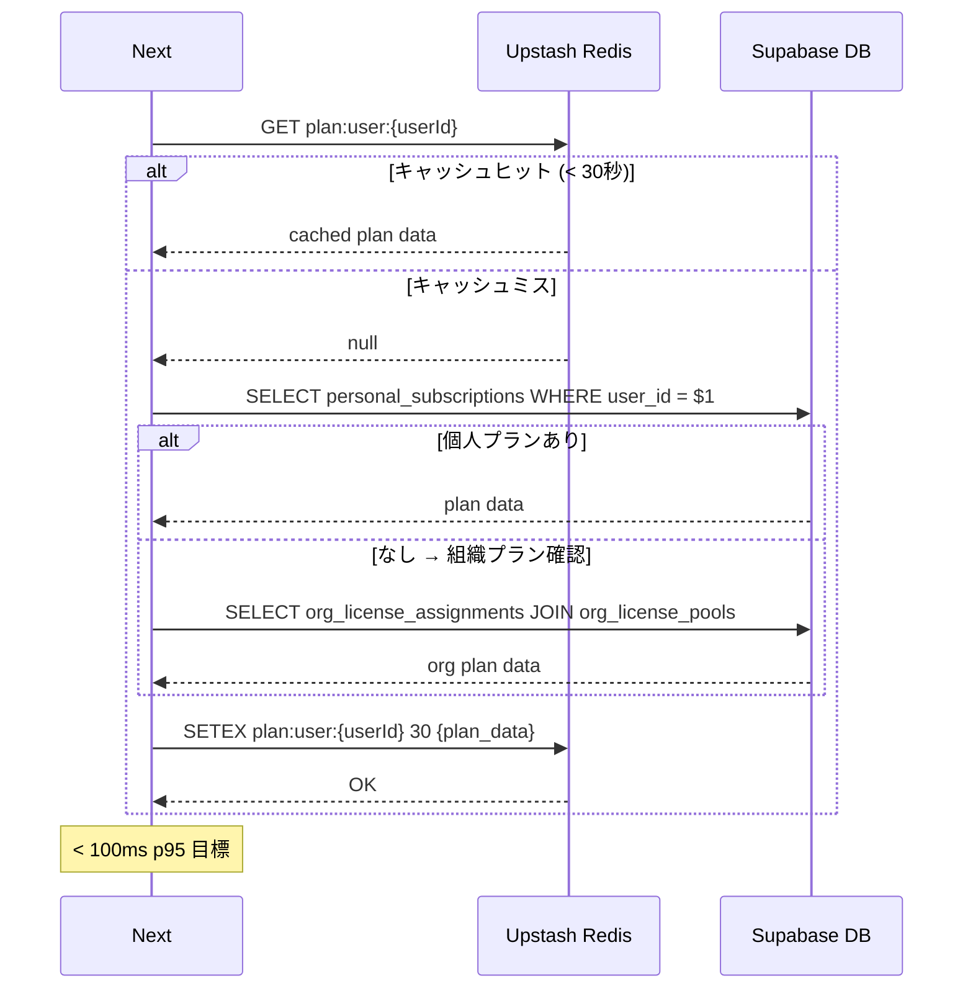

# パフォーマンス・キャッシュ設計

## 1. 目的・スコープ

全ドメイン共通のパフォーマンス目標・キャッシュ戦略・API レート制限・計測手段を定義する。  
各ドメイン実装はここで定めたキャッシュ TTL・レート制限値に従う。

**対象外**: LLM API の具体的なプロンプト設計 (operator/06-ai-llm.md)

---

## 2. 関連要件

- 要件定義 03 §16.4 (パフォーマンス目標)
- 要件定義 03 §22.1 (キャッシュ戦略)
- 要件定義 03 §22.2 (API レート制限)
- 要件定義 03 §22.7 (同時接続スケール)

---

## 3. パフォーマンス目標

### 3.1 確定目標値

| 指標 | 目標 | 計測ツール |
|------|------|---------|
| Lighthouse Performance Score | ≥ 90 | Lighthouse CI (CI 必須) |
| LCP (Largest Contentful Paint) | < 2.5s (75 パーセンタイル) | Vercel Analytics + Web Vitals |
| FID (First Input Delay) | < 100ms | 同上 |
| CLS (Cumulative Layout Shift) | < 0.1 | 同上 |
| API レスポンスタイム p95 | < 500ms | Vercel Speed Insights |
| API レスポンスタイム p99 | < 1500ms | 同上 |
| `getUserActivePlan()` p95 | **< 100ms** | DB スロークエリログ |
| Edge Function コールドスタート p95 | < 1s | Supabase Logs |
| AI 応答 (ストリーミング first token) p95 | < 5s | LLM usage logs |
| DB クエリ p95 | < 50ms | `pg_stat_statements` |

### 3.2 未達時のアクション

| 条件 | アクション |
|------|---------|
| API p95 が目標を 50% 超過 (750ms) | GitHub P0 Issue 自動作成 + Slack アラート |
| Lighthouse Score < 80 | main へのマージ block (CI fail) |
| DB p95 > 100ms | スロークエリログ調査 + インデックス追加 |

---

## 4. キャッシュ戦略

### 4.1 全体キャッシュ構成

```
┌─────────────────────────────────────────────────────────────┐
│                     ユーザーリクエスト                        │
└───────────────────────────┬─────────────────────────────────┘
                            │
              ┌─────────────▼──────────────┐
              │    Vercel Edge CDN          │
              │    - 静的アセット (1年)      │
              │    - LP/公開ページ (ISR 1h) │
              └─────────────┬──────────────┘
                            │ cache miss
              ┌─────────────▼──────────────┐
              │    Next.js Server           │
              │    (Vercel hnd1 Tokyo)       │
              └──────┬──────────┬──────────┘
                     │          │
      ┌──────────────▼──┐  ┌──▼────────────────┐
      │  Upstash Redis   │  │   Supabase DB      │
      │  - KPI 5分       │  │   (PostgreSQL)     │
      │  - Plan 30秒     │  │   - クエリ結果      │
      │  - Stripe 1時間  │  │   - RLS フィルタ済  │
      └─────────────────┘  └────────────────────┘
```

### 4.2 キャッシュ戦略一覧表

| 対象データ | キャッシュ場所 | TTL | キーパターン | パージトリガー |
|-----------|-------------|-----|------------|-------------|
| 静的アセット (JS/CSS/画像) | Vercel Edge CDN | 1 年 (versioned URL) | URL | デプロイ時 |
| LP / 公開ページ | Vercel ISR | 1 時間 | パス | `revalidatePath()` 手動呼び出し |
| `subscription_plans` マスター | Vercel Edge Cache | 5 分 | `global:subscription_plans` | super_admin 操作時に `revalidateTag()` |
| ダッシュボード KPI | Upstash Redis | 5 分 | `dashboard:org:{orgId}` | 関連 INSERT/UPDATE 後に DEL |
| `getUserActivePlan()` 結果 | Upstash Redis | 30 秒 | `plan:user:{userId}` | プラン変更 webhook 受信時に DEL |
| Stripe customer 情報 | Upstash Redis | 1 時間 | `stripe:customer:{userId}` | Stripe webhook 受信時に DEL |
| AI 生成献立 | Supabase Storage | 永久 | content hash | - |
| 食事写真 | Vercel Edge CDN (via Supabase Storage) | 7 日 | ファイルパス | - |

### 4.3 Upstash Redis キャッシュ実装

```typescript
// src/lib/cache/index.ts
import { Redis } from '@upstash/redis';

const redis = Redis.fromEnv();

export const cache = {
  /**
   * キャッシュから取得、なければファクトリ関数を実行してキャッシュ
   */
  async getOrSet<T>(
    key: string,
    factory: () => Promise<T>,
    ttlSeconds: number,
  ): Promise<T> {
    const cached = await redis.get<T>(key);
    if (cached !== null) return cached;

    const value = await factory();
    await redis.setex(key, ttlSeconds, JSON.stringify(value));
    return value;
  },

  /**
   * キャッシュを無効化
   */
  async invalidate(key: string): Promise<void> {
    await redis.del(key);
  },

  /**
   * プレフィックスマッチで一括削除 (例: 'dashboard:org:' + '*')
   */
  async invalidatePattern(pattern: string): Promise<void> {
    const keys = await redis.keys(pattern);
    if (keys.length > 0) {
      await redis.del(...keys);
    }
  },
};

// TTL 定数
export const CACHE_TTL = {
  SUBSCRIPTION_PLANS: 5 * 60,     // 5 分
  DASHBOARD_KPI: 5 * 60,          // 5 分
  USER_ACTIVE_PLAN: 30,           // 30 秒
  STRIPE_CUSTOMER: 60 * 60,       // 1 時間
} as const;
```

### 4.4 getUserActivePlan 実装

```typescript
// src/lib/plan/getUserActivePlan.ts

export async function getUserActivePlan(userId: string): Promise<ActivePlan | null> {
  const cacheKey = `plan:user:${userId}`;

  return cache.getOrSet(
    cacheKey,
    async () => {
      const supabase = createServerClient();

      // 個人プラン
      const { data: personal } = await supabase
        .from('personal_subscriptions')
        .select('plan_key, status, current_period_end')
        .eq('user_id', userId)
        .eq('status', 'active')
        .single();

      if (personal) return { source: 'personal', ...personal };

      // 組織プラン (org_license_assignments 経由)
      const { data: org } = await supabase
        .from('org_license_assignments')
        .select(`
          org_license_pools!inner (
            plan_key,
            organizations!inner ( name )
          )
        `)
        .eq('user_id', userId)
        .is('revoked_at', null)
        .single();

      if (org) return { source: 'org', plan_key: org.org_license_pools.plan_key };

      return null;
    },
    CACHE_TTL.USER_ACTIVE_PLAN,
  );
}

// プラン変更時のキャッシュ無効化
export async function invalidateUserPlanCache(userId: string): Promise<void> {
  await cache.invalidate(`plan:user:${userId}`);
}
```

---

## 5. API レート制限

### 5.1 確定値一覧

| エンドポイント | 匿名 | 認証済み (`user`) | 認証済み admin 系 |
|------------|-----|----------------|----------------|
| `GET /api/v1/family/groups` | - | 60/min | 600/min |
| `POST /api/v1/family/meal-requests` | - | 30/min | 300/min |
| `POST /api/v1/family/meal-requests/{id}/ai-propose` | - | **5/min/user** (LLM コスト) | 50/min |
| `POST /api/v1/auth/login` | 10/min/IP | - | - |
| `POST /api/v1/auth/password-reset` | 3/h/IP | - | - |
| `GET /api/v1/family/invites/{token}` | 60/min/IP | - | - |
| `POST /api/v1/webhooks/stripe` | - (署名検証のみ) | - | - |
| `POST /api/v1/webhooks/resend` | - (署名検証のみ) | - | - |
| AI Edge Functions (knowledge-gpt 等) | - | プラン依存 (03 §5.5.3) | 制限なし |
| デフォルト (その他全 API) | 30/min/IP | 120/min | 1200/min |

### 5.2 Upstash Ratelimit 実装

```typescript
// src/lib/ratelimit/index.ts
import { Ratelimit } from '@upstash/ratelimit';
import { Redis } from '@upstash/redis';

const redis = Redis.fromEnv();

export const ratelimiters = {
  // AI API (LLM コスト保護)
  aiPropose: new Ratelimit({
    redis,
    limiter: Ratelimit.slidingWindow(5, '1 m'),
    prefix: 'rl:ai_propose',
  }),

  // ログイン (IP ベース)
  login: new Ratelimit({
    redis,
    limiter: Ratelimit.slidingWindow(10, '1 m'),
    prefix: 'rl:login',
  }),

  // パスワードリセット (IP ベース、1h)
  passwordReset: new Ratelimit({
    redis,
    limiter: Ratelimit.slidingWindow(3, '1 h'),
    prefix: 'rl:pw_reset',
  }),

  // デフォルト (認証済みユーザー)
  defaultAuth: new Ratelimit({
    redis,
    limiter: Ratelimit.slidingWindow(120, '1 m'),
    prefix: 'rl:default_auth',
  }),

  // デフォルト (匿名)
  defaultAnon: new Ratelimit({
    redis,
    limiter: Ratelimit.slidingWindow(30, '1 m'),
    prefix: 'rl:default_anon',
  }),
};
```

```typescript
// src/middleware.ts (Edge Middleware でレート制限)
import { ratelimiters } from '@/lib/ratelimit';
import { NextResponse } from 'next/server';
import type { NextRequest } from 'next/server';

export async function middleware(request: NextRequest) {
  const ip = request.ip ?? request.headers.get('x-forwarded-for') ?? 'unknown';
  const path = request.nextUrl.pathname;

  // AI API (ユーザーベース)
  if (path.includes('/ai-propose')) {
    const userId = getUserIdFromRequest(request);
    if (userId) {
      const { success } = await ratelimiters.aiPropose.limit(userId);
      if (!success) {
        return NextResponse.json(
          { error: { code: 'RATE_AI_EXCEEDED', message: 'AI リクエストの上限に達しました', request_id: crypto.randomUUID() } },
          { status: 429, headers: { 'Retry-After': '60' } }
        );
      }
    }
  }

  // ログイン (IP ベース)
  if (path === '/api/v1/auth/login' && request.method === 'POST') {
    const { success, reset } = await ratelimiters.login.limit(ip);
    if (!success) {
      return NextResponse.json(
        { error: { code: 'RATE_LOGIN_EXCEEDED', message: 'ログイン試行回数が上限に達しました', request_id: crypto.randomUUID() } },
        { status: 429, headers: { 'Retry-After': String(Math.ceil((reset - Date.now()) / 1000)) } }
      );
    }
  }

  return NextResponse.next();
}
```

---

## 6. DB パフォーマンス設定

### 6.1 pg_stat_statements 有効化

```sql
-- supabase/migrations/xxxx_perf_setup.sql
CREATE EXTENSION IF NOT EXISTS pg_stat_statements;

-- スロークエリログ (200ms 以上)
ALTER SYSTEM SET log_min_duration_statement = '200';

-- 接続プール最大値確認 (PgBouncer)
-- Supabase Pro Plan では PgBouncer がデフォルト有効
-- max_connections = 200 (Pro Plan 標準)
```

### 6.2 インデックス設計基準

```sql
-- 推奨インデックスパターン
-- 1. 頻繁な WHERE 条件のカラム
CREATE INDEX CONCURRENTLY ON family_members (family_group_id, is_active)
  WHERE is_active = TRUE;  -- 部分インデックスでサイズ削減

-- 2. JOIN キー
CREATE INDEX CONCURRENTLY ON user_profiles (organization_id)
  WHERE organization_id IS NOT NULL;

-- 3. cursor-based ページネーション
CREATE INDEX CONCURRENTLY ON family_activity_log (family_group_id, created_at DESC, id DESC);

-- 4. ソフトデリート系テーブル
CREATE INDEX CONCURRENTLY ON org_license_assignments (user_id, revoked_at)
  WHERE revoked_at IS NULL;
```

### 6.3 スロークエリ分析手順

```sql
-- 上位 10 スロークエリ確認
SELECT
  query,
  calls,
  total_exec_time / calls AS avg_ms,
  total_exec_time,
  rows / calls AS avg_rows
FROM pg_stat_statements
WHERE query NOT LIKE '%pg_stat_statements%'
ORDER BY total_exec_time DESC
LIMIT 10;

-- インデックス未使用確認
SELECT
  schemaname,
  tablename,
  indexname,
  idx_scan,
  idx_tup_read,
  idx_tup_fetch
FROM pg_stat_user_indexes
WHERE idx_scan = 0
ORDER BY pg_relation_size(indexrelid) DESC;
```

---

## 7. Lighthouse CI 設定

### 7.1 設定ファイル

```json
// .lighthouserc.json
{
  "ci": {
    "collect": {
      "url": [
        "http://localhost:3000/",
        "http://localhost:3000/login",
        "http://localhost:3000/dashboard",
        "http://localhost:3000/family/groups"
      ],
      "numberOfRuns": 3
    },
    "assert": {
      "assertions": {
        "categories:performance": ["error", {"minScore": 0.9}],
        "categories:accessibility": ["error", {"minScore": 0.9}],
        "categories:best-practices": ["warn", {"minScore": 0.8}],
        "categories:seo": ["warn", {"minScore": 0.8}],
        "largest-contentful-paint": ["error", {"maxNumericValue": 2500}],
        "cumulative-layout-shift": ["error", {"maxNumericValue": 0.1}],
        "first-input-delay": ["warn", {"maxNumericValue": 100}]
      }
    },
    "upload": {
      "target": "temporary-public-storage"
    }
  }
}
```

### 7.2 CI ワークフロー統合

```yaml
# .github/workflows/lighthouse.yml
name: Lighthouse CI

on:
  push:
    branches: [main]

jobs:
  lighthouse:
    runs-on: ubuntu-latest
    steps:
      - uses: actions/checkout@v4
      - name: Install dependencies
        run: npm ci
      - name: Build
        run: npm run build
      - name: Start server
        run: npm start &
        env:
          PORT: 3000
      - name: Run Lighthouse CI
        run: npx lhci autorun
        env:
          LHCI_GITHUB_APP_TOKEN: ${{ secrets.LHCI_GITHUB_APP_TOKEN }}
```

---

## 8. 負荷テスト (k6)

### 8.1 シナリオ定義

```javascript
// tests/load/k6-scenarios.js
import http from 'k6/http';
import { check, sleep } from 'k6';

export const options = {
  scenarios: {
    // 通常負荷 (平常時想定: 50 QPS)
    normal_load: {
      executor: 'constant-arrival-rate',
      rate: 50,
      timeUnit: '1s',
      duration: '5m',
      preAllocatedVUs: 100,
    },
    // ピーク負荷 (イベント時想定: 500 QPS)
    peak_load: {
      executor: 'ramping-arrival-rate',
      startRate: 50,
      timeUnit: '1s',
      stages: [
        { duration: '2m', target: 500 },
        { duration: '5m', target: 500 },
        { duration: '2m', target: 50 },
      ],
      preAllocatedVUs: 500,
    },
  },
  thresholds: {
    http_req_duration: ['p(95)<500', 'p(99)<1500'],  // SLA 準拠
    http_req_failed: ['rate<0.01'],                   // エラー率 1% 未満
  },
};

const BASE_URL = __ENV.BASE_URL || 'https://staging.homegohan.app';

export default function () {
  // シナリオ 1: ダッシュボード閲覧
  const res = http.get(`${BASE_URL}/api/v1/family/groups`, {
    headers: { Authorization: `Bearer ${__ENV.TEST_TOKEN}` },
  });
  check(res, {
    'status is 200': (r) => r.status === 200,
    'response time < 500ms': (r) => r.timings.duration < 500,
  });

  sleep(1);

  // シナリオ 2: AI 献立提案 (レート制限確認)
  const aiRes = http.post(
    `${BASE_URL}/api/v1/family/meal-requests/test-id/ai-propose`,
    JSON.stringify({ constraints: ['低カロリー'] }),
    { headers: { 'Content-Type': 'application/json', Authorization: `Bearer ${__ENV.TEST_TOKEN}` } }
  );
  check(aiRes, {
    'AI API: 200 or 429': (r) => [200, 429].includes(r.status),
  });
}
```

### 8.2 実行タイミング

| シナリオ | タイミング |
|---------|---------|
| 通常負荷 | 毎週水曜 staging で自動実行 |
| ピーク負荷 | 本番リリース前 (手動) |
| DB スロークエリ計測 | ピーク負荷テスト後に `pg_stat_statements` を確認 |

---

## 9. シーケンス: getUserActivePlan のキャッシュフロー



---

## 10. テスト方針

| テスト種別 | 対象 | ツール |
|---------|------|------|
| Unit | `getUserActivePlan` キャッシュロジック、`cache.getOrSet` | Vitest + Redis mock |
| Integration | レート制限の動作確認 (5回目で 429) | Vitest + Upstash Redis local emulator |
| Performance | Lighthouse Score ≥ 90 | Lighthouse CI |
| Load | p95 < 500ms at 500 QPS | k6 (staging) |
| DB | スロークエリ検出 (> 200ms) | pg_stat_statements + CI アラート |

---

## 11. 既存実装との関連

| 資産 | 状態 | 対応 |
|------|------|------|
| `src/lib/plan-limits.ts` (obsolete) | 削除 | `src/lib/plan/getUserActivePlan.ts` に置換 |
| Upstash Redis (未接続) | 新規接続 | `UPSTASH_REDIS_REST_URL` / `UPSTASH_REDIS_REST_TOKEN` env 追加 |
| `pg_stat_statements` (未設定) | 新規 | migration で有効化 |

---

## 12. 未解決事項

| 項目 | 状態 | 期限 |
|------|------|------|
| Upstash Redis の本番プラン選定 (Pay-as-you-go vs. Fixed) | TODO | Phase 1 リリース前 |
| Edge Function のコールドスタート対策 (Deno) | TODO | Edge Function 実装時 |
| OpenTelemetry trace 導入 (Phase 2) | TODO | Phase 2 |
| k6 テストの staging 自動実行 CI 組み込み | TODO | Phase 1 リリース後 |
| `getUserActivePlan` の 30 秒 TTL でプラン変更の即時反映が遅れる問題 | 既知 | Stripe webhook で即時 invalidate する実装で解決 |
