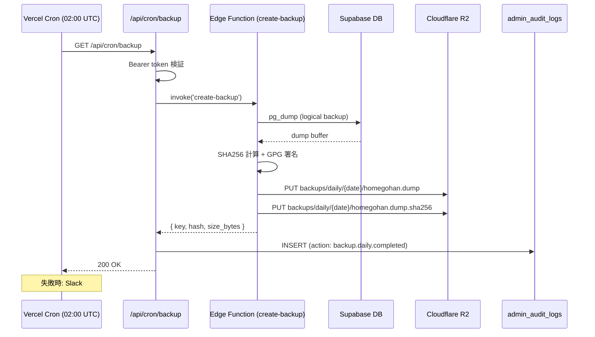

# 災害復旧 (DR) / バックアップ設計

## 1. 目的・スコープ

本番データの保護・障害時の復旧手順・バックアップ管理・リージョン構成を定義する。  
運営チームが障害発生時にこのドキュメントを参照して復旧作業を実施できる状態にする。

**対象外**: アプリケーションレベルの障害対応 (operator/09-runbook.md)

---

## 2. 関連要件

- 要件定義 03 §16.5 (DR / バックアップ)
- 要件定義 03 §22.8 (Supabase Branch / Vercel Preview)
- 要件定義 03 §18.16 (法人 SLA 違反時の自動返金)

---

## 3. インフラ要件

### 3.1 Supabase プラン必須条件

| 環境 | 最低 Supabase プラン | 理由 |
|------|------------------|------|
| 本番 | **Pro Plan 以上** | PITR 7 日 / Supabase Branch 機能 |
| 法人 Enterprise 顧客導入後 | **Team Plan 以上** | PITR 14 日 / Read Replica |
| staging | Pro Plan | 本番同等環境 |
| 開発 / Preview | Free Plan 可 | Supabase Branch |

**契約必須**: 本番リリース前に Pro Plan へのアップグレードを完了すること。

### 3.2 同時接続スケール

```
DB connection pool: PgBouncer (Supabase 標準)
最大 200 connection (Pro Plan)

想定 QPS:
  peak:   500 req/s
  average: 50 req/s

WebSocket (Realtime): 最大 1 万同時接続 (Phase 2 で Realtime 強化)
```

---

## 4. バックアップ階層

### 4.1 バックアップ種別

| タイプ | 頻度 | 保持期間 | 保管場所 | 方法 |
|-------|------|---------|---------|------|
| **PITR** (Point-in-Time Recovery) | 連続 (WAL) | 7 日 (Pro) / 14 日 (Team) | Supabase 自動管理 | Supabase 標準機能 |
| **Daily Logical Backup** | 日次 02:00 UTC (JST 11:00) | 30 日 | S3 / R2 (`pg_dump` 暗号化) | Vercel Cron |
| **Weekly Cold Backup** | 週次 (月曜 03:00 UTC) | 1 年 | S3 Glacier | Vercel Cron |
| **Annual Backup** | 年次 (1/1 04:00 UTC) | **永久** | S3 Glacier (法的要件) | 手動 + Vercel Cron |

### 4.2 Daily Backup 実装

```typescript
// src/app/api/cron/backup/route.ts (Vercel Cron: "0 2 * * *")
export async function GET(request: Request) {
  const authHeader = request.headers.get('authorization');
  if (authHeader !== `Bearer ${process.env.CRON_SECRET}`) {
    return Response.json({ error: 'Unauthorized' }, { status: 401 });
  }

  const timestamp = new Date().toISOString().split('T')[0];
  const backupKey = `backups/daily/${timestamp}/homegohan.dump`;

  try {
    // Supabase pg_dump 実行 (Edge Function 経由)
    const { data } = await supabaseAdmin.functions.invoke('create-backup', {
      body: { type: 'logical', outputKey: backupKey },
    });

    // SHA256 ハッシュ計算 + GPG 署名
    const hash = await computeSHA256(data.dumpBuffer);
    const signed = await gpgSign(data.dumpBuffer);

    // S3 / R2 へアップロード
    await uploadToR2(backupKey, signed);
    await uploadToR2(`${backupKey}.sha256`, hash);

    // admin_audit_logs に記録
    await supabaseAdmin.from('admin_audit_logs').insert({
      action: 'backup.daily.completed',
      actor_id: null,  // system
      metadata: { key: backupKey, hash, size_bytes: data.size },
    });

    return Response.json({ ok: true, key: backupKey });
  } catch (error) {
    // Slack アラート送信
    await notifySlack(`❌ Daily backup failed: ${String(error)}`);
    throw error;
  }
}
```

### 4.3 バックアップ整合性検証

全バックアップファイルに対して:
1. **SHA256 ハッシュ**: バックアップ生成時に計算・保存
2. **GPG 署名**: 運営者の GPG 鍵で署名 (改ざん検知)
3. **復元前検証**: `sha256sum -c backup.sha256` + GPG 検証 必須

```bash
# 復元前の整合性確認手順
sha256sum -c homegohan.dump.sha256   # ハッシュ確認
gpg --verify homegohan.dump.sig homegohan.dump  # GPG 署名確認

# 問題なければ復元
pg_restore --clean --no-owner -d $DATABASE_URL homegohan.dump
```

---

## 5. リージョン構成

### 5.1 Phase 1 (現在)

```
┌─────────────────────────────────────────────────┐
│              Tokyo (hnd1)                        │
│                                                  │
│  ┌──────────────┐    ┌──────────────────────┐   │
│  │  Vercel      │    │  Supabase            │   │
│  │  (hnd1)      │    │  - PostgreSQL        │   │
│  │              │    │  - Auth              │   │
│  │  Next.js     │    │  - Storage           │   │
│  │  Edge Funcs  │    │  - Edge Functions    │   │
│  └──────────────┘    └──────────────────────┘   │
│                                                  │
│  Upstash Redis (Tokyo region)                    │
└─────────────────────────────────────────────────┘

バックアップ先:
  Cloudflare R2 (グローバル分散)
  ← Daily / Weekly / Annual バックアップ
```

**単一リージョン運用**: 地震・大規模障害時は手動復旧。RTO は §6 参照。

### 5.2 Phase 2 (Org Enterprise 顧客 5 社 or 売上 1000 万円超)

```
┌───────────────────┐        ┌───────────────────────┐
│  Tokyo (Primary)  │◄──────►│  Singapore (Replica)  │
│                   │  Repl  │                        │
│  Supabase Primary │        │  Supabase Read Replica │
│  Vercel hnd1      │        │  Vercel sin1           │
└───────────────────┘        └───────────────────────┘
         │                              │
         └──────────── R2 ─────────────┘
                    (共有ストレージ)
```

フェイルオーバー: Singapore Read Replica を Primary に昇格 → 手順書 §8 参照

---

## 6. RPO / RTO 目標

### 6.1 プラン別目標

| プラン | RPO (許容データ損失) | RTO (復旧目標時間) | 根拠 |
|--------|------------------|------------------|------|
| `free` / `pro` | 24 時間 | best effort | Daily Backup |
| `family_*` | 1 時間 | 4 時間 | PITR (直近 1 時間) |
| `org_starter` / `org_standard` | 30 分 | 2 時間 | PITR |
| `org_pro` | 5 分 | 1 時間 | PITR + 優先対応 |
| `org_enterprise` | **1 分** (PITR) | **30 分** | PITR 14 日 + Read Replica (Phase 2) |

### 6.2 SLA 違反の自動返金トリガー (03 §18.16)

| 月次稼働率 | アクション |
|-----------|---------|
| < 99.5% | 当該月料金の 25% を翌月クレジット |
| < 99.0% | 50% クレジット |
| < 95.0% | 100% クレジット + 解約権発生 |

```sql
-- 月次稼働率算出 (pg_cron 月次バッチ)
-- status.homegohan.app の Better Stack データを基に計算
-- 不足分は Stripe Credit Note で自動発行
```

---

## 7. 復元テスト スケジュール

| テスト種別 | 頻度 | 担当 | 成功基準 |
|---------|------|------|---------|
| PITR 復元テスト (staging) | 月次 (第 1 月曜 JST 午前) | 運営チーム | staging API smoke test 全件 OK |
| Full Logical Backup 復元 | 四半期 | 運営チーム | fresh DB に復元後 API 動作確認 |
| Disaster Recovery Drill | 年次 | 運営チーム全員 | 本番想定シナリオで RTO 以内に完了 |

### 7.1 月次 PITR 復元手順

```bash
# 1. Supabase Dashboard から PITR 復元ポイントを選択
#    (staging project に本番の N 時間前の状態を復元)

# 2. 復元完了後、smoke test 実行
curl -s https://staging.homegohan.app/api/v1/public/health | jq .

# 3. 主要 API テスト
npm run test:smoke -- --base-url=https://staging.homegohan.app

# 4. 結果を admin_audit_logs に記録
# action: "dr.test.monthly.pitr", metadata: { result: "success", restored_to: "..." }
```

---

## 8. 5 障害シナリオ別対応手順

### シナリオ 1: Supabase DB 障害

**症状**: DB への接続エラー、API が全て 503

```
検知 → Supabase Status Page (status.supabase.com) を確認
  │
  ├─ Supabase 側の障害 → 待機 + Slack #incident で状況共有
  │
  └─ 自分側の問題 → Supabase Dashboard でアラートを確認
      │
      └─ PITR 復元が必要な場合:
          1. Supabase Dashboard > Database > Backups > PITR
          2. 復元ポイントを選択 (障害発生前の最新)
          3. staging で復元テスト実施
          4. 本番に適用 (影響ユーザーへ事前通知)
          目標: RTO 30 分 (org_enterprise)
```

### シナリオ 2: Vercel 障害

**症状**: Web アプリにアクセスできない (HTTP 500 / 503)

```
検知 → Vercel Status Page (vercel-status.com) を確認
  │
  ├─ Vercel 側の障害 → status.homegohan.app を手動更新、待機
  │
  └─ デプロイ起因の場合:
      1. Vercel Dashboard でロールバック (前 deployment へ)
      2. ロールバック後に smoke test
      3. 根本原因調査 → hot fix PR

フェイルオーバー (長時間障害時):
  → Cloudflare Pages に静的メンテナンスページを展開
  → DNS を一時的に切り替え (homegohan.app → maintenance.homegohan.app)
```

### シナリオ 3: リージョン全体障害 (Tokyo)

**適用条件**: Phase 2 (Singapore Read Replica 導入後)

```
検知 → 東京リージョン全体の障害を確認 (AWS / GCP Status Page)
  │
  1. Supabase Singapore Read Replica を Primary に昇格
     (Supabase Dashboard > Database > Replicas > Promote)
  2. Vercel にリージョン切替 (hnd1 → sin1) を依頼
  3. DNS TTL を短縮 (300s → 60s) で切替
  4. Singapore Primary で動作確認
  5. Tokyo 復旧後に Replication 再確立
```

**Phase 1 (Tokyo のみ)**: リージョン障害時は東京復旧待ち。  
SLA 違反が発生した場合は自動返金処理 (§6.2) を手動でトリガー。

### シナリオ 4: データ破壊 (誤 DELETE)

**症状**: 特定テーブルの行が消えた / 不正な UPDATE が適用された

```
1. 影響範囲特定
   - admin_audit_logs から操作者と操作内容を確認
   - 影響テーブル・行数・タイムスタンプを特定

2. PITR で直前の状態に巻き戻し
   - 破壊発生時刻の T-5分 で復元先 DB を作成

3. 論理バックアップから特定範囲のみ復元 (選択的復元)
   pg_restore --table={affected_table} -d $DATABASE_URL backup.dump

4. 影響ユーザーへの通知
   - 損失データの内容を説明
   - 復旧結果を報告

5. 再発防止
   - 破壊的操作に確認ステップ追加
   - RLS ポリシーの強化
```

### シナリオ 5: ランサムウェア / セキュリティ侵害

**症状**: 不正アクセス確認、データ暗号化、身代金要求

```
即時対応 (30 分以内):
  1. 全アクセスキーの rotate
     - Supabase: Dashboard > Settings > API > Rotate
     - Stripe: Dashboard > Developers > API keys
     - xAI / Anthropic / Google AI: 各コンソールで rotate
     - Vercel: Dashboard > Settings > Environment Variables
  2. Supabase 接続を全て切断
     SELECT pg_terminate_backend(pid) FROM pg_stat_activity
     WHERE pid <> pg_backend_pid();
  3. Slack #incident に緊急通報

調査 (1-24 時間):
  4. admin_audit_logs で異常操作を精査
  5. 侵害経路の特定

復旧 (24-48 時間):
  6. Cold Backup (侵害前の最古の clean バックアップ) から復元
     ※ PITR は侵害後の WAL が含まれる可能性があるため使用しない
  7. 全ユーザーのパスワードリセット強制
  8. 個人情報保護委員会への報告 (72 時間以内、03 §18.3)
  9. ポストモーテム公開 (1 週間以内)
```

---

## 9. バックアップストレージ設定

### 9.1 Cloudflare R2 バケット構成

```
homegohan-backups/
├── daily/
│   ├── 2026-05-07/homegohan.dump
│   ├── 2026-05-07/homegohan.dump.sha256
│   └── 2026-05-07/homegohan.dump.sig
├── weekly/
│   └── 2026-W19/homegohan.dump{.sha256,.sig}
└── annual/
    └── 2026/homegohan.dump{.sha256,.sig}
```

### 9.2 保持ポリシー (R2 Lifecycle)

```json
{
  "rules": [
    {
      "id": "delete-daily-after-30d",
      "filter": { "prefix": "daily/" },
      "expiration": { "days": 30 }
    },
    {
      "id": "archive-weekly-to-glacier",
      "filter": { "prefix": "weekly/" },
      "transitions": [
        { "days": 7, "storageClass": "GLACIER" }
      ],
      "expiration": { "days": 365 }
    }
  ]
}
```

---

## 10. 文書化要件

本設計に加えて以下のドキュメントを別途作成必須:

| ドキュメント | 場所 | 内容 |
|-----------|------|------|
| DR ランブック | `docs/operations/dr-runbook.md` | 各障害シナリオの詳細手順 (コピペ実行可能) |
| バックアップ復元手順 | `docs/operations/backup-restore.md` | 環境別復元手順 |
| インシデント報告テンプレート | `docs/operations/incident-report-template.md` | 個人情報保護委員会向けフォーマット |

---

## 11. シーケンス: Daily Backup フロー



---

## 12. テスト方針

| テスト種別 | 対象 | 頻度 |
|---------|------|------|
| Integration | バックアップ Cron の実行と R2 へのアップロード | 月 1 回 (staging) |
| Restore test | PITR からの復元 + smoke test | 月 1 回 |
| Full DR drill | 全障害シナリオの訓練 | 年 1 回 |
| Integrity check | SHA256 / GPG 検証スクリプト | バックアップ生成ごと (自動) |

---

## 13. 既存実装との関連

| 資産 | 状態 | 対応 |
|------|------|------|
| Supabase Free Plan (現在) | アップグレード必須 | Pro Plan へのアップグレード (本番リリース前) |
| バックアップ Cron (未実装) | 新規 | `/api/cron/backup` + Edge Function 作成 |
| `docs/operations/` (不在) | 新規 | DR ランブック等を作成 |

---

## 14. 未解決事項

| 項目 | 状態 | 期限 |
|------|------|------|
| GPG 鍵管理体制 (鍵保管場所・更新手順) | TODO | 本番リリース前 |
| Cloudflare R2 vs S3 Glacier の最終コスト比較 | TODO | 本番リリース前 |
| Singapore Read Replica の Supabase Team Plan コスト見積もり | TODO | Phase 2 着手前 |
| バックアップ用 Edge Function の ClamAV ウイルススキャン統合 | TODO | Phase 1 リリース後 |
| RTO 30 分の達成可能性を staging DR ドリルで検証 | TODO | Phase 1 リリース後 3 ヶ月以内 |
