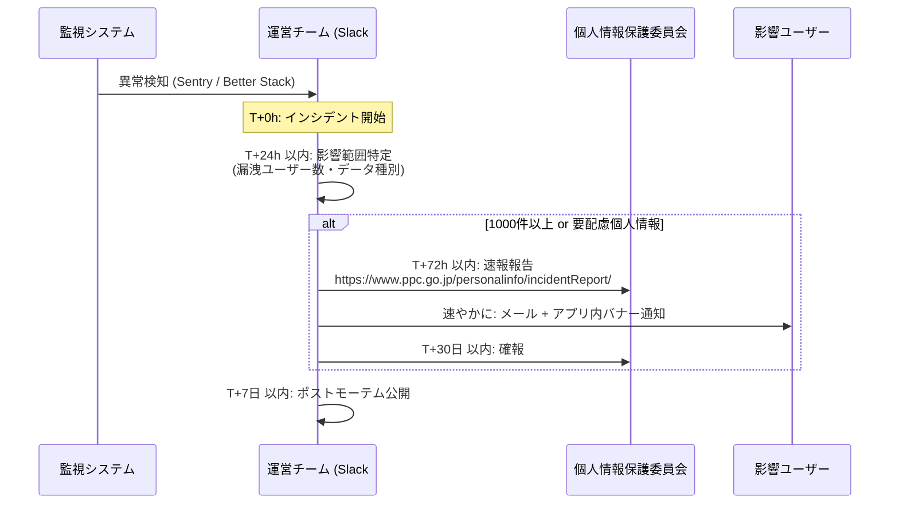
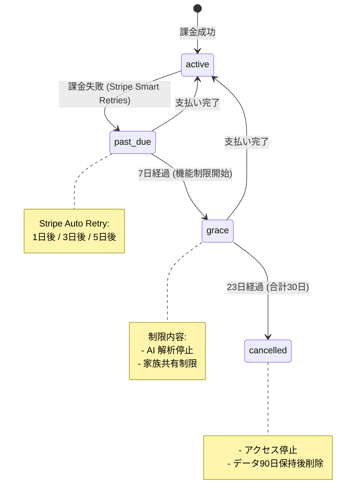

# 法務・コンプライアンス設計

## 1. 目的・スコープ

特商法・個人情報保護法・インボイス制度・GDPR・医療免責等の法的要件を実装レベルで具体化する。  
各ドメイン実装は本ドキュメントで定めた UI テキスト・フロー・テーブル設計に準拠する。

**対象外**: 利用規約・プライバシーポリシーの法的文書そのもの (法務担当が別途作成)

---

## 2. 関連要件

- 要件定義 03 §18 全項 (法務・コンプライアンス)
- 要件定義 03 §18.1 (特商法)
- 要件定義 03 §18.5 (利用規約再同意)
- 要件定義 03 §18.10 (産業医記録保管)

---

## 3. 特定商取引法 (特商法)

### 3.1 最終確認画面の必須表示 (Stripe Checkout 直前)

**法的根拠**: 特定商取引に関する法律 第 11 条 (電子消費者契約)

必須表示項目:
1. プラン名 + 月額 (税込)
2. 自動更新であること、解約しなければ毎月課金される旨
3. 解約方法 (`/account/billing` から 1 タップで解約可能)
4. 解約予告期間 (個人: 翌日有効 / 組織: 月末まで)
5. 最低契約期間 (個人: なし / 組織: プラン依存)
6. 利用規約 / プライバシーポリシーへのリンク

**チェックボックス要件**:  
「上記内容を確認しました」チェックボックスを必須クリック → `申し込む` ボタンが活性化。

### 3.2 UI 実装

```tsx
// src/components/billing/checkout-confirmation.tsx

export function CheckoutConfirmation({
  plan,
  onConfirm,
}: {
  plan: SubscriptionPlan;
  onConfirm: () => void;
}) {
  const [confirmed, setConfirmed] = React.useState(false);

  return (
    <div className="space-y-6 p-6 border rounded-xl bg-white">
      <h2 className="text-xl font-bold">お申し込み内容の確認</h2>

      <table className="w-full text-sm">
        <tbody>
          <tr>
            <td className="py-2 text-text-secondary">プラン名</td>
            <td className="py-2 font-medium">{plan.display_name}</td>
          </tr>
          <tr>
            <td className="py-2 text-text-secondary">月額料金</td>
            <td className="py-2 font-medium">¥{plan.monthly_price_jpy.toLocaleString()} (税込)</td>
          </tr>
          <tr>
            <td className="py-2 text-text-secondary">更新</td>
            <td className="py-2">毎月自動更新。解約しない限り毎月課金されます。</td>
          </tr>
          <tr>
            <td className="py-2 text-text-secondary">解約方法</td>
            <td className="py-2">
              <a href="/account/billing" className="text-primary underline">
                お支払い設定
              </a>から 1 タップで解約できます。
            </td>
          </tr>
          <tr>
            <td className="py-2 text-text-secondary">解約予告期間</td>
            <td className="py-2">{plan.cancel_notice_period}</td>
          </tr>
        </tbody>
      </table>

      <p className="text-sm text-text-secondary">
        <a href="/legal/terms" className="underline">利用規約</a> および{' '}
        <a href="/legal/privacy" className="underline">プライバシーポリシー</a>
        に同意の上でお申し込みください。
      </p>

      <label className="flex items-start gap-3 cursor-pointer">
        <input
          type="checkbox"
          checked={confirmed}
          onChange={e => setConfirmed(e.target.checked)}
          aria-required="true"
          className="mt-1"
        />
        <span className="text-sm">
          上記内容を確認し、利用規約・プライバシーポリシーに同意します{' '}
          <span aria-hidden="true" className="text-danger">*</span>
        </span>
      </label>

      <button
        onClick={onConfirm}
        disabled={!confirmed}
        className="w-full btn-primary disabled:opacity-50 disabled:cursor-not-allowed"
        aria-disabled={!confirmed}
      >
        申し込む
      </button>
    </div>
  );
}
```

---

## 4. 外国第三者提供同意 (個人情報保護法 24 条)

### 4.1 対象サービスと提供データ

| サービス | 事業者所在国 | 提供データ | GDPR 適合 |
|---------|-----------|---------|---------|
| xAI (Grok) | 米国カリフォルニア州 | 食事写真・栄養データ・献立リクエスト | 未取得 |
| Anthropic (Claude) | 米国カリフォルニア州 | 健康相談テキスト・産業医アドバイス | 未取得 |
| Google (Gemini) | 米国カリフォルニア州 | 食事写真・健診 PDF | GDPR 適合 |
| OpenAI | 米国カリフォルニア州 | (使用する場合) | GDPR 適合 |

### 4.2 同意モーダル (AI 機能初回利用時に必須表示)

```tsx
// src/components/consent/ai-data-consent-modal.tsx

const AI_PROVIDERS = [
  { name: 'xAI Inc.', country: '米国カリフォルニア州', gdpr: false },
  { name: 'Anthropic PBC', country: '米国カリフォルニア州', gdpr: false },
  { name: 'Google LLC', country: '米国カリフォルニア州', gdpr: true },
];

export function AiDataConsentModal({ onAccept, onDecline }: ConsentModalProps) {
  return (
    <Dialog open>
      <DialogContent aria-labelledby="ai-consent-title">
        <DialogTitle id="ai-consent-title">
          AI 機能利用に関する外国第三者提供の同意
        </DialogTitle>
        <div className="space-y-4 text-sm">
          <p>
            ほめゴハンは AI 解析のため、食事写真と栄養データを以下の事業者へ送信します:
          </p>
          <ul className="space-y-2">
            {AI_PROVIDERS.map(provider => (
              <li key={provider.name} className="flex items-start gap-2">
                <span className="font-medium">{provider.name}</span>
                <span className="text-text-secondary">({provider.country})</span>
                {!provider.gdpr && (
                  <span className="text-xs bg-warning-light text-warning px-1 rounded">
                    GDPR 適合審査未取得
                  </span>
                )}
              </li>
            ))}
          </ul>
          <p>
            詳細は{' '}
            <a href="/legal/privacy#section5" className="text-primary underline">
              プライバシーポリシー §5
            </a>{' '}
            をご参照ください。
          </p>
          <p className="text-warning-light bg-warning-light p-3 rounded-md text-xs">
            ⚠ 同意しない場合、AI 機能 (献立提案・食事写真解析・産業医アドバイス) は
            ご利用いただけません。
          </p>
        </div>
        <DialogFooter>
          <button onClick={onDecline} className="btn-secondary">
            同意しない (AI 機能を無効化)
          </button>
          <button onClick={onAccept} className="btn-primary">
            同意して AI 機能を利用する
          </button>
        </DialogFooter>
      </DialogContent>
    </Dialog>
  );
}
```

### 4.3 external_data_consents テーブル

```sql
CREATE TABLE external_data_consents (
  id           UUID        PRIMARY KEY DEFAULT gen_random_uuid(),
  user_id      UUID        NOT NULL REFERENCES auth.users(id) ON DELETE CASCADE,
  provider     VARCHAR(50) NOT NULL CHECK (provider IN ('xai', 'anthropic', 'google', 'openai')),
  consented    BOOLEAN     NOT NULL,
  consented_at TIMESTAMPTZ NOT NULL DEFAULT NOW(),
  ip_address   INET,
  user_agent   TEXT,
  revoked_at   TIMESTAMPTZ
);

CREATE UNIQUE INDEX ON external_data_consents (user_id, provider)
  WHERE revoked_at IS NULL;  -- 有効な同意は1件のみ

ALTER TABLE external_data_consents ENABLE ROW LEVEL SECURITY;

CREATE POLICY "ext_consent_self_read"
  ON external_data_consents FOR SELECT
  USING (auth.uid() = user_id);

CREATE POLICY "ext_consent_self_insert"
  ON external_data_consents FOR INSERT
  WITH CHECK (auth.uid() = user_id);

-- 取消: revoked_at を UPDATE (DELETE 禁止、監査目的で保持)
CREATE POLICY "ext_consent_no_delete"
  ON external_data_consents FOR DELETE USING (false);
```

---

## 5. 漏洩 72 時間報告義務

### 5.1 インシデント対応フロー



### 5.2 報告テンプレートの場所

```
docs/operations/incident-report-template.md  ← 運営チームが作成・管理
```

---

## 6. インボイス制度 (適格請求書)

### 6.1 要件

- 運営側適格請求書発行事業者番号: `T` + 13 桁 (取得後に設定)
- `org_invoices` に税率区分ごとの金額・消費税額を記録
- 法人顧客が「インボイス必須」設定をオンにした場合: PDF 生成 (A4 縦)
- 電子保存法準拠: タイムスタンプ付き、改ざん防止

### 6.2 organizations テーブル追加列

```sql
ALTER TABLE organizations
  ADD COLUMN qualified_invoice_number VARCHAR(14),  -- T + 13桁
  ADD COLUMN requires_invoice         BOOLEAN NOT NULL DEFAULT FALSE,
  ADD COLUMN contract_status          VARCHAR(20) DEFAULT 'active'
    CHECK (contract_status IN ('active', 'pending', 'expired', 'cancelled'));
```

### 6.3 org_invoices テーブル

```sql
CREATE TABLE org_invoices (
  id                         UUID        PRIMARY KEY DEFAULT gen_random_uuid(),
  organization_id            UUID        NOT NULL REFERENCES organizations(id),
  stripe_invoice_id          VARCHAR(255) UNIQUE,
  invoice_number             VARCHAR(50),
  issuer_invoice_number      VARCHAR(14), -- 発行元 (運営側) の T番号
  issued_at                  TIMESTAMPTZ NOT NULL DEFAULT NOW(),
  due_at                     TIMESTAMPTZ,
  -- 税率別集計
  subtotal_standard_jpy      INT NOT NULL DEFAULT 0,  -- 標準税率 (10%) 対象額
  tax_standard_jpy           INT NOT NULL DEFAULT 0,  -- 標準消費税額
  subtotal_reduced_jpy       INT NOT NULL DEFAULT 0,  -- 軽減税率 (8%) 対象額
  tax_reduced_jpy            INT NOT NULL DEFAULT 0,  -- 軽減消費税額
  total_jpy                  INT NOT NULL,
  -- 電子保存法
  pdf_url                    TEXT,
  timestamp_token            TEXT,        -- タイムスタンプ局のトークン
  status                     VARCHAR(20) NOT NULL DEFAULT 'draft'
    CHECK (status IN ('draft', 'sent', 'paid', 'overdue', 'cancelled')),
  created_at                 TIMESTAMPTZ NOT NULL DEFAULT NOW()
);

ALTER TABLE org_invoices ENABLE ROW LEVEL SECURITY;

CREATE POLICY "org_invoices_org_read"
  ON org_invoices FOR SELECT
  USING (
    EXISTS (
      SELECT 1 FROM user_profiles up
      WHERE up.user_id = auth.uid()
        AND up.organization_id = org_invoices.organization_id
        AND up.role IN ('org_admin', 'org_manager')
    )
    OR (auth.jwt() ->> 'role') IN ('admin', 'super_admin', 'finance')
  );
```

---

## 7. 利用規約・プライバシーポリシー再同意

### 7.1 terms_acceptances テーブル

```sql
CREATE TABLE terms_acceptances (
  id              UUID        PRIMARY KEY DEFAULT gen_random_uuid(),
  user_id         UUID        NOT NULL REFERENCES auth.users(id) ON DELETE CASCADE,
  document_type   VARCHAR(50) NOT NULL
    CHECK (document_type IN (
      'terms_of_service',
      'privacy_policy',
      'parental_consent',
      'external_data_provision'
    )),
  document_version VARCHAR(20) NOT NULL,  -- 例: "v2026.1"
  accepted_at     TIMESTAMPTZ NOT NULL DEFAULT NOW(),
  ip_address      INET,
  user_agent      TEXT
);

CREATE INDEX ON terms_acceptances (user_id, document_type, document_version);

ALTER TABLE terms_acceptances ENABLE ROW LEVEL SECURITY;

CREATE POLICY "terms_self_read"
  ON terms_acceptances FOR SELECT
  USING (auth.uid() = user_id);

CREATE POLICY "terms_self_insert"
  ON terms_acceptances FOR INSERT
  WITH CHECK (auth.uid() = user_id);

-- UPDATE / DELETE 禁止 (同意記録は不可逆)
CREATE POLICY "terms_no_update"
  ON terms_acceptances FOR UPDATE USING (false);
CREATE POLICY "terms_no_delete"
  ON terms_acceptances FOR DELETE USING (false);
```

### 7.2 変更時の再同意フロー

```typescript
// src/lib/terms/check-acceptance.ts

/**
 * 最新バージョンの利用規約・プライバシーポリシーへの同意を確認する。
 * 未同意の場合は再同意モーダルを表示すべき旨のフラグを返す。
 */
export async function checkTermsAcceptance(userId: string): Promise<{
  needsReAcceptance: boolean;
  pendingDocuments: Array<{ type: string; version: string }>;
}> {
  const CURRENT_VERSIONS = {
    terms_of_service: 'v2026.1',
    privacy_policy: 'v2026.1',
  };

  const supabase = createServerClient();
  const { data } = await supabase
    .from('terms_acceptances')
    .select('document_type, document_version')
    .eq('user_id', userId)
    .in('document_type', Object.keys(CURRENT_VERSIONS));

  const pending = Object.entries(CURRENT_VERSIONS)
    .filter(([type, version]) =>
      !data?.some(a => a.document_type === type && a.document_version === version)
    )
    .map(([type, version]) => ({ type, version }));

  return { needsReAcceptance: pending.length > 0, pendingDocuments: pending };
}
```

**重要変更時の対応**:
- 全ユーザーへ 30 日前メール通知 (Resend 一斉送信)
- アプリ内強制再同意モーダル (ダッシュボードアクセス時にインターセプト)
- 旧バージョンを `docs/legal/archive/v{version}/` に永久保管

---

## 8. 医療免責表示

### 8.1 必須表示箇所

```tsx
// src/components/legal/medical-disclaimer.tsx

export function MedicalDisclaimer({ variant = 'footer' }: { variant?: 'modal' | 'footer' }) {
  const text = 'ほめゴハンは食事管理を支援するアプリであり、医師の診察・診断・治療を代替するものではありません。';

  if (variant === 'modal') {
    return (
      <div role="alert" className="bg-info-light border border-info rounded-lg p-4">
        <div className="flex items-start gap-2">
          <Info className="text-info mt-0.5" size={16} aria-hidden="true" />
          <p className="text-sm text-text">{text}</p>
        </div>
      </div>
    );
  }

  return (
    <p className="text-xs text-text-secondary mt-4 border-t pt-2">
      {text}
    </p>
  );
}
```

必須表示画面:
1. アプリ初回起動時 (モーダル)
2. 健診結果アップロード画面 (フッター)
3. 産業医アドバイス画面 (フッター)
4. AI ヘルスインサイト画面 (フッター)
5. 利用規約 §X (法的文書内)

急病時の表示 (特定キーワード検知時):
```tsx
// 「救急」「病院に行く」「急に具合が悪い」等のキーワード検知後
<div role="alert" className="bg-danger-light border-l-4 border-danger p-4">
  <p className="font-medium">緊急の症状がある場合は、すぐに救急 (119) または
  医療機関を受診してください。このアプリは医療行為を行いません。</p>
</div>
```

---

## 9. 課金失敗グレースペリオド

### 9.1 ステータス遷移



### 9.2 実装

```typescript
// src/lib/billing/grace-period.ts

export type SubscriptionStatus =
  | 'active'
  | 'past_due'
  | 'grace'
  | 'cancelled'
  | 'disputed';

/**
 * Stripe の `invoice.payment_failed` webhook 受信時に呼び出す。
 * past_due → grace → cancelled の遷移は pg_cron バッチで自動実行。
 */
export async function handlePaymentFailed(userId: string): Promise<void> {
  await supabaseAdmin
    .from('personal_subscriptions')
    .update({ status: 'past_due', past_due_since: new Date().toISOString() })
    .eq('user_id', userId)
    .eq('status', 'active');

  // 通知送信
  await sendEmail(userId, 'payment_failed', {
    retry_url: '/account/billing',
    support_url: '/support',
  });
}
```

```sql
-- pg_cron: 毎時チェック
SELECT cron.schedule('check_grace_period', '0 * * * *', $$
  -- past_due → grace (7日経過)
  UPDATE personal_subscriptions
  SET status = 'grace',
      grace_started_at = NOW()
  WHERE status = 'past_due'
    AND past_due_since < NOW() - INTERVAL '7 days';

  -- grace → cancelled (30日経過)
  UPDATE personal_subscriptions
  SET status = 'cancelled',
      cancelled_at = NOW()
  WHERE status = 'grace'
    AND past_due_since < NOW() - INTERVAL '30 days';
$$);
```

---

## 10. チャージバック対応

```typescript
// src/app/api/v1/webhooks/stripe/route.ts
// charge.dispute.created イベントの処理

async function handleDisputeCreated(event: Stripe.Event) {
  const dispute = event.data.object as Stripe.Dispute;
  const chargeId = dispute.charge as string;

  // Stripe から charge の customer を取得
  const charge = await stripe.charges.retrieve(chargeId);
  const customerId = charge.customer as string;

  // user_id を取得
  const { data: sub } = await supabaseAdmin
    .from('personal_subscriptions')
    .select('user_id')
    .eq('stripe_customer_id', customerId)
    .single();

  if (!sub) return;

  // ステータスを disputed に変更
  await supabaseAdmin
    .from('personal_subscriptions')
    .update({ status: 'disputed' })
    .eq('user_id', sub.user_id);

  // super_admin に Slack 通知
  await notifySlack(
    `⚠️ チャージバック発生: user=${sub.user_id} dispute=${dispute.id}`
  );

  // 監査ログ
  await supabaseAdmin.from('admin_audit_logs').insert({
    action: 'billing.dispute.created',
    target_user_id: sub.user_id,
    metadata: { dispute_id: dispute.id, amount: dispute.amount },
  });
}
```

---

## 11. 産業医記録の保管期間

### 11.1 保管要件

| テーブル | 保管期間 | 根拠 |
|---------|---------|------|
| `org_health_notes` | **5 年** | 労働安全衛生規則 |
| `org_health_access_logs` | **10 年** | 同上 + 独自規定 |

### 11.2 退職者データの匿名化

```sql
-- pg_cron: 日次実行 (退職後 5 年経過分を匿名化)
SELECT cron.schedule('anonymize_retired_health_notes', '0 3 * * *', $$
  UPDATE org_health_notes
  SET
    content = '[匿名化済み - 保管期間: ' || TO_CHAR(created_at + INTERVAL '5 years', 'YYYY-MM-DD') || ']',
    updated_at = NOW()
  WHERE user_id IN (
    SELECT up.user_id FROM user_profiles up
    JOIN org_license_assignments ola ON ola.user_id = up.user_id
    WHERE ola.revoked_at < NOW() - INTERVAL '5 years'
  )
  AND anonymized_at IS NULL;
$$);
```

---

## 12. Cookie 同意バナー (改正電気通信事業法)

### 12.1 UI 要件 (2023 年 6 月施行対応)

```tsx
// src/components/legal/cookie-consent-banner.tsx

export function CookieConsentBanner() {
  const [visible, setVisible] = React.useState(false);
  const [preferences, setPreferences] = React.useState({
    analytics: false,
    advertising: false,
  });

  return visible ? (
    <div
      role="dialog"
      aria-labelledby="cookie-banner-title"
      className="fixed bottom-0 left-0 right-0 z-50 bg-bg-elevated shadow-xl p-4 md:p-6"
    >
      <h2 id="cookie-banner-title" className="font-bold mb-2">
        Cookie の使用について
      </h2>
      <p className="text-sm text-text-secondary mb-4">
        このサイトはアクセス解析・広告のため Cookie を使用します。
        詳細は
        <a href="/legal/privacy#cookies" className="text-primary underline">
          プライバシーポリシー
        </a>
        をご参照ください。
      </p>
      <div className="flex flex-wrap gap-2">
        <button
          onClick={() => handleAcceptAll()}
          className="btn-primary"
        >
          すべて許可
        </button>
        <button
          onClick={() => handleEssentialOnly()}
          className="btn-secondary"
        >
          必須のみ
        </button>
        <button
          onClick={() => setShowSettings(true)}
          className="btn-ghost text-sm"
        >
          設定
        </button>
      </div>
    </div>
  ) : null;
}
```

### 12.2 cookie_consents テーブル

```sql
CREATE TABLE cookie_consents (
  id             UUID        PRIMARY KEY DEFAULT gen_random_uuid(),
  user_id        UUID        REFERENCES auth.users(id) ON DELETE CASCADE,  -- nullable (未ログイン時)
  session_id     VARCHAR(255),  -- ブラウザセッション識別子
  analytics      BOOLEAN     NOT NULL DEFAULT FALSE,
  advertising    BOOLEAN     NOT NULL DEFAULT FALSE,
  consented_at   TIMESTAMPTZ NOT NULL DEFAULT NOW(),
  ip_address     INET,
  user_agent     TEXT
);
```

計測 Cookie (GA4 / PostHog 等) は `analytics = TRUE` の同意後にのみ発火。

---

## 13. アナリティクス PII フィルタ

### 13.1 送信禁止データ

```typescript
// src/lib/analytics/schema.ts
// 全アナリティクスイベントはこのファイルで定義・管理

/**
 * 送信禁止フィールド (自動 REDACT)
 */
const PII_FIELDS = [
  'email', 'phone', 'name', 'full_name',
  'password', 'token', 'secret',
  'health_*', 'meal_content', 'birth_date',
] as const;

export function sanitizeEventProperties(
  props: Record<string, unknown>
): Record<string, unknown> {
  return Object.fromEntries(
    Object.entries(props).filter(([key]) =>
      !PII_FIELDS.some(pii => {
        if (pii.endsWith('*')) return key.startsWith(pii.slice(0, -1));
        return key === pii;
      })
    )
  );
}
```

- IP 匿名化: GA4 の匿名化 ON、PostHog の IP マスク設定
- PR レビューで analytics イベント追加時に PII フィールドを含まないかチェック必須

---

## 14. AI 生成コンテンツの著作権

利用規約への記載内容 (実装での表示箇所: 利用規約画面):

```
1. AI が生成した献立・レシピ・コメントの著作権はユーザーに帰属する (個人利用範囲)
2. 運営は集計・サービス改善目的でのみ、匿名化した形で利用できる
3. ユーザーが投稿した口コミ等は CC0 相当のライセンスで運営に提供される
```

---

## 15. SLA 違反の自動返金

詳細は cross/07-dr-backup.md §6.2 を参照。自動算出バッチの仕様:

```sql
-- pg_cron: 月次バッチ (月初 JST 09:00 = UTC 00:00)
SELECT cron.schedule('check_sla_violation', '0 0 1 * *', $$
  -- Better Stack の稼働率データを参照 (外部 API 呼び出し or インポート済みデータ)
  -- org_sla_logs テーブルから月次稼働率を算出
  -- 違反がある場合: Stripe Credit Note を自動発行
  -- admin_audit_logs に記録
$$);
```

---

## 16. GDPR 削除フロー

### 16.1 gdpr_deletion_requests テーブル

```sql
CREATE TABLE gdpr_deletion_requests (
  id              UUID        PRIMARY KEY DEFAULT gen_random_uuid(),
  user_id         UUID        NOT NULL REFERENCES auth.users(id),
  requested_at    TIMESTAMPTZ NOT NULL DEFAULT NOW(),
  cooling_period_ends_at TIMESTAMPTZ NOT NULL  -- requested_at + 30 days
    GENERATED ALWAYS AS (requested_at + INTERVAL '30 days') STORED,
  executed_at     TIMESTAMPTZ,   -- 実際の削除完了日時
  status          VARCHAR(20)  NOT NULL DEFAULT 'pending'
    CHECK (status IN ('pending', 'cooling', 'executing', 'completed', 'cancelled')),
  deletion_reason TEXT,          -- 退会理由 (任意)
  cancelled_at    TIMESTAMPTZ    -- 30日以内の撤回
);

ALTER TABLE gdpr_deletion_requests ENABLE ROW LEVEL SECURITY;

CREATE POLICY "gdpr_self_read"
  ON gdpr_deletion_requests FOR SELECT
  USING (auth.uid() = user_id);
```

### 16.2 削除フロー

```
1. ユーザー: /account/delete でパスワード再認証
2. INSERT gdpr_deletion_requests (status='cooling')
3. 30 日間の cooling period:
   - ログイン制限 (警告バナー表示)
   - 30 日以内ならキャンセル可能
4. 家族グループ owner の場合:
   - 引き継ぎ強制 (owner 移譲 / 解散 / 個人移行 から選択)
5. 30 日経過後 pg_cron が削除実行:
   - auth.users 削除 (CASCADE で関連データ削除)
   - Supabase Storage から写真削除
   - Stripe customer 削除
   - 法的保管義務のあるデータ (産業医記録等) は匿名化
6. 完了メール送信
```

```sql
-- pg_cron: 日次実行 (GDPR 削除実行)
SELECT cron.schedule('execute_gdpr_deletions', '0 4 * * *', $$
  -- cooling_period_ends_at を過ぎた pending/cooling 状態のリクエストを処理
  -- 削除処理は Edge Function に委譲 (Supabase Storage + auth.users の削除)
$$);
```

---

## 17. テスト方針

| テスト種別 | 対象 | ツール |
|---------|------|------|
| Unit | 特商法チェックボックス活性化ロジック、terms acceptance 確認 | Vitest |
| Integration | 課金失敗時の grace period 遷移 | Vitest + Supabase Local |
| E2E | Stripe Checkout 前の確認画面表示、Cookie 同意バナー | Playwright |
| Legal audit | 特商法必須項目の表示確認、医療免責表示の網羅 | 手動 (四半期) |
| Privacy | PII フィルタの動作確認 | Vitest + `analytics-schema.ts` |

---

## 18. 既存実装との関連

| 資産 | 状態 | 対応 |
|------|------|------|
| 既存 `/account/billing` (未実装) | 新規 | 特商法対応のチェックボックス含む Checkout フロー実装 |
| `terms_acceptances` (未作成) | 新規 | migration で作成 |
| Cookie バナー (未実装) | 新規 | `/app/layout.tsx` に `<CookieConsentBanner>` 追加 |
| 退会フロー (既存 `/account/delete` は壊れている) | 再作成 | GDPR フロー準拠で再実装 |

---

## 19. 未解決事項

| 項目 | 状態 | 期限 |
|------|------|------|
| 運営側適格請求書発行事業者番号 (T番号) の取得状況確認 | TODO | 法人向け機能リリース前 |
| 弁護士レビュー: 特商法表示内容・利用規約 §X の医療免責文言 | TODO | Phase 1 リリース前 |
| GPG 鍵を使った署名者の体制 (誰が鍵を管理するか) | TODO | バックアップ実装前 |
| GDPR 削除時の Stripe customer 削除の影響範囲調査 | TODO | operator/05-stripe-integration.md で確認 |
| CloudSign API 連携の詳細設計 (法人電子締結) | TODO | operator/05-stripe-integration.md で定義 |
| 旧バージョン利用規約の `docs/legal/archive/` 保管場所設定 | TODO | 初版リリース前 |
