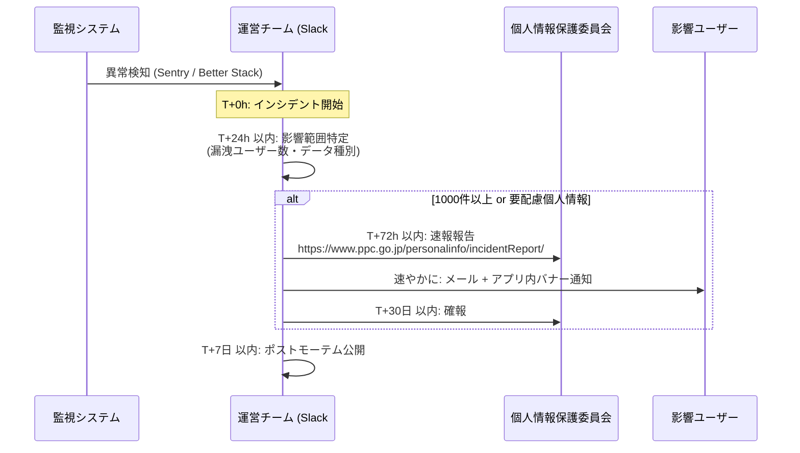
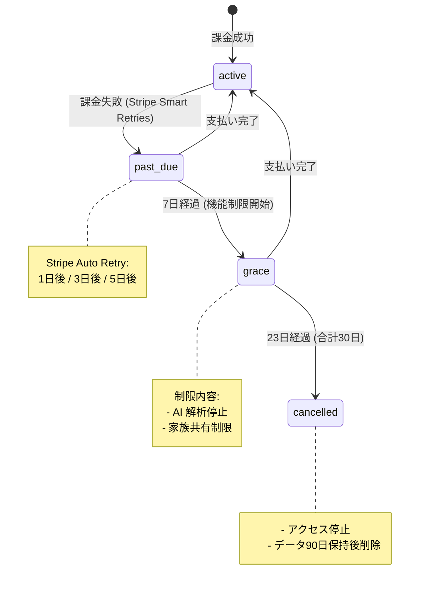

# 法務・コンプライアンス設計

## 1. 目的・スコープ

特商法・個人情報保護法・インボイス制度・GDPR・医療免責等の法的要件を実装レベルで具体化する。  
各ドメイン実装は本ドキュメントで定めた UI テキスト・フロー・テーブル設計に準拠する。

**対象外**: 利用規約・プライバシーポリシーの法的文書そのもの (法務担当が別途作成)

---

## 2. 関連要件

- 要件定義 03 §18 全項 (法務・コンプライアンス)
- 要件定義 03 §18.1 (特商法)
- 要件定義 03 §18.5 (利用規約再同意)
- 要件定義 03 §18.10 (産業医記録保管)

---

## 3. 特定商取引法 (特商法)

### 3.1 最終確認画面の必須表示 (Stripe Checkout 直前)

**法的根拠**: 特定商取引に関する法律 第 11 条 (電子消費者契約)

必須表示項目:
1. プラン名 + 月額 (税込)
2. 自動更新であること、解約しなければ毎月課金される旨
3. 解約方法 (`/account/billing` から 1 タップで解約可能)
4. 解約予告期間 (個人: 翌日有効 / 組織: 月末まで)
5. 最低契約期間 (個人: なし / 組織: プラン依存)
6. 利用規約 / プライバシーポリシーへのリンク

**チェックボックス要件**:  
「上記内容を確認しました」チェックボックスを必須クリック → `申し込む` ボタンが活性化。

### 3.2 UI 実装

```tsx
// src/components/billing/checkout-confirmation.tsx

export function CheckoutConfirmation({
  plan,
  onConfirm,
}: {
  plan: SubscriptionPlan;
  onConfirm: () => void;
}) {
  const [confirmed, setConfirmed] = React.useState(false);

  return (
    <div className="space-y-6 p-6 border rounded-xl bg-white">
      <h2 className="text-xl font-bold">お申し込み内容の確認</h2>

      <table className="w-full text-sm">
        <tbody>
          <tr>
            <td className="py-2 text-text-secondary">プラン名</td>
            <td className="py-2 font-medium">{plan.display_name}</td>
          </tr>
          <tr>
            <td className="py-2 text-text-secondary">月額料金</td>
            <td className="py-2 font-medium">¥{(plan.monthly_price_jpy ?? 0).toLocaleString()} (税込)</td>
          </tr>
          <tr>
            <td className="py-2 text-text-secondary">更新</td>
            <td className="py-2">毎月自動更新。解約しない限り毎月課金されます。</td>
          </tr>
          <tr>
            <td className="py-2 text-text-secondary">解約方法</td>
            <td className="py-2">
              <a href="/account/billing" className="text-primary underline">
                お支払い設定
              </a>から 1 タップで解約できます。
            </td>
          </tr>
          <tr>
            <td className="py-2 text-text-secondary">解約予告期間</td>
            <td className="py-2">{plan.plan_type === 'personal' ? 'いつでも解約可能 (次回更新日まで利用可)' : '月末まで'}</td>
          </tr>
        </tbody>
      </table>

      <p className="text-sm text-text-secondary">
        <a href="/legal/terms" className="underline">利用規約</a> および{' '}
        <a href="/legal/privacy" className="underline">プライバシーポリシー</a>
        に同意の上でお申し込みください。
      </p>

      <label className="flex items-start gap-3 cursor-pointer">
        <input
          type="checkbox"
          checked={confirmed}
          onChange={e => setConfirmed(e.target.checked)}
          aria-required="true"
          className="mt-1"
        />
        <span className="text-sm">
          上記内容を確認し、利用規約・プライバシーポリシーに同意します{' '}
          <span aria-hidden="true" className="text-danger">*</span>
        </span>
      </label>

      <button
        onClick={onConfirm}
        disabled={!confirmed}
        className="w-full btn-primary disabled:opacity-50 disabled:cursor-not-allowed"
        aria-disabled={!confirmed}
      >
        申し込む
      </button>
    </div>
  );
}
```

---

## 4. 外国第三者提供同意 (個人情報保護法 24 条)

### 4.1 対象サービスと提供データ

| サービス | 事業者所在国 | 提供データ | GDPR 適合 |
|---------|-----------|---------|---------|
| xAI (Grok) | 米国カリフォルニア州 | 食事写真・栄養データ・献立リクエスト | 未取得 |
| Anthropic (Claude) | 米国カリフォルニア州 | 健康相談テキスト・産業医アドバイス | 未取得 |
| Google (Gemini) | 米国カリフォルニア州 | 食事写真・健診 PDF | GDPR 適合 |
| OpenAI | 米国カリフォルニア州 | (使用する場合) | GDPR 適合 |

### 4.2 同意モーダル (AI 機能初回利用時に必須表示)

```tsx
// src/components/consent/ai-data-consent-modal.tsx

const AI_PROVIDERS = [
  { name: 'xAI Inc.', country: '米国カリフォルニア州', gdpr: false },
  { name: 'Anthropic PBC', country: '米国カリフォルニア州', gdpr: false },
  { name: 'Google LLC', country: '米国カリフォルニア州', gdpr: true },
];

export function AiDataConsentModal({ onAccept, onDecline }: ConsentModalProps) {
  return (
    <Dialog open>
      <DialogContent aria-labelledby="ai-consent-title">
        <DialogTitle id="ai-consent-title">
          AI 機能利用に関する外国第三者提供の同意
        </DialogTitle>
        <div className="space-y-4 text-sm">
          <p>
            ほめゴハンは AI 解析のため、食事写真と栄養データを以下の事業者へ送信します:
          </p>
          <ul className="space-y-2">
            {AI_PROVIDERS.map(provider => (
              <li key={provider.name} className="flex items-start gap-2">
                <span className="font-medium">{provider.name}</span>
                <span className="text-text-secondary">({provider.country})</span>
                {!provider.gdpr && (
                  <span className="text-xs bg-warning-light text-warning px-1 rounded">
                    GDPR 適合審査未取得
                  </span>
                )}
              </li>
            ))}
          </ul>
          <p>
            詳細は{' '}
            <a href="/legal/privacy#section5" className="text-primary underline">
              プライバシーポリシー §5
            </a>{' '}
            をご参照ください。
          </p>
          <p className="text-warning-light bg-warning-light p-3 rounded-md text-xs">
            ⚠ 同意しない場合、AI 機能 (献立提案・食事写真解析・産業医アドバイス) は
            ご利用いただけません。
          </p>
        </div>
        <DialogFooter>
          <button onClick={onDecline} className="btn-secondary">
            同意しない (AI 機能を無効化)
          </button>
          <button onClick={onAccept} className="btn-primary">
            同意して AI 機能を利用する
          </button>
        </DialogFooter>
      </DialogContent>
    </Dialog>
  );
}
```

### 4.3 external_data_consents テーブル

```sql
CREATE TABLE external_data_consents (
  id           UUID        PRIMARY KEY DEFAULT gen_random_uuid(),
  user_id      UUID        NOT NULL REFERENCES auth.users(id) ON DELETE CASCADE,
  provider     VARCHAR(50) NOT NULL CHECK (provider IN ('xai', 'anthropic', 'google', 'openai')),
  consented    BOOLEAN     NOT NULL,
  consented_at TIMESTAMPTZ NOT NULL DEFAULT NOW(),
  ip_address   INET,
  user_agent   TEXT,
  revoked_at   TIMESTAMPTZ
);

CREATE UNIQUE INDEX ON external_data_consents (user_id, provider)
  WHERE revoked_at IS NULL;  -- 有効な同意は1件のみ

ALTER TABLE external_data_consents ENABLE ROW LEVEL SECURITY;

CREATE POLICY "ext_consent_self_read"
  ON external_data_consents FOR SELECT
  USING (auth.uid() = user_id);

CREATE POLICY "ext_consent_self_insert"
  ON external_data_consents FOR INSERT
  WITH CHECK (auth.uid() = user_id);

-- 取消: revoked_at を UPDATE (DELETE 禁止、監査目的で保持)
CREATE POLICY "ext_consent_no_delete"
  ON external_data_consents FOR DELETE USING (false);
```

---

## 5. 漏洩 72 時間報告義務

### 5.1 インシデント対応フロー


```mermaid
sequenceDiagram
    participant Monitor as 監視システム
    participant Ops as 運営チーム (Slack #incident)
    participant PPC as 個人情報保護委員会
    participant Users as 影響ユーザー

    Monitor->>Ops: 異常検知 (Sentry / Better Stack)
    Note over Ops: T+0h: インシデント開始
    Ops->>Ops: T+24h 以内: 影響範囲特定<br>(漏洩ユーザー数・データ種別)
    alt 1000件以上 or 要配慮個人情報
        Ops->>PPC: T+72h 以内: 速報報告<br>https://www.ppc.go.jp/personalinfo/incidentReport/
        Ops->>Users: 速やかに: メール + アプリ内バナー通知
        Ops->>PPC: T+30日 以内: 確報
    end
    Ops->>Ops: T+7日 以内: ポストモーテム公開
```

### 5.2 報告テンプレートの場所

```
docs/operations/incident-report-template.md  ← 運営チームが作成・管理
```

---

## 6. インボイス制度 (適格請求書)

### 6.1 要件

- 運営側適格請求書発行事業者番号: `T` + 13 桁 (取得後に設定)
- `org_invoices` に税率区分ごとの金額・消費税額を記録
- 法人顧客が「インボイス必須」設定をオンにした場合: PDF 生成 (A4 縦)
- 電子保存法準拠: タイムスタンプ付き、改ざん防止

### 6.2 organizations テーブル追加列

```sql
ALTER TABLE organizations
  ADD COLUMN qualified_invoice_number VARCHAR(14),  -- T + 13桁
  ADD COLUMN requires_invoice         BOOLEAN NOT NULL DEFAULT FALSE,
  ADD COLUMN contract_status          VARCHAR(20) DEFAULT 'active'
    CHECK (contract_status IN ('active', 'pending', 'expired', 'cancelled'));
```

### 6.3 org_invoices テーブル

DDL/RLS は **`org/01-data-model.md §3.x org_invoices`** を参照 (canonical)。

インボイス制度対応の必須列 (canonical 側に追記要):
- `issuer_invoice_number VARCHAR(14)` — 発行元 (運営側) の T 番号
- `subtotal_standard_jpy / tax_standard_jpy` — 標準税率 (10%) 対象額・税額
- `subtotal_reduced_jpy / tax_reduced_jpy` — 軽減税率 (8%) 対象額・税額
- `pdf_url`, `timestamp_token` — 電子保存法対応 (タイムスタンプ局トークン)

canonical 定義に上記列が無い場合は org/01 で ALTER TABLE 追加すること。

RLS (canonical = org/09-rls-policies.md):
- 同組織 `org_admin` / `org_manager` の SELECT 許可
- 運営 `admin` / `super_admin` / `finance` の SELECT 許可

---

## 7. 利用規約・プライバシーポリシー再同意

### 7.1 terms_acceptances テーブル

```sql
CREATE TABLE terms_acceptances (
  id              UUID        PRIMARY KEY DEFAULT gen_random_uuid(),
  user_id         UUID        NOT NULL REFERENCES auth.users(id) ON DELETE CASCADE,
  document_type   VARCHAR(50) NOT NULL
    CHECK (document_type IN (
      'terms_of_service',
      'privacy_policy',
      'parental_consent',
      'external_data_provision'
    )),
  document_version VARCHAR(20) NOT NULL,  -- 例: "v2026.1"
  accepted_at     TIMESTAMPTZ NOT NULL DEFAULT NOW(),
  ip_address      INET,
  user_agent      TEXT
);

CREATE INDEX ON terms_acceptances (user_id, document_type, document_version);

ALTER TABLE terms_acceptances ENABLE ROW LEVEL SECURITY;

CREATE POLICY "terms_self_read"
  ON terms_acceptances FOR SELECT
  USING (auth.uid() = user_id);

CREATE POLICY "terms_self_insert"
  ON terms_acceptances FOR INSERT
  WITH CHECK (auth.uid() = user_id);

-- UPDATE / DELETE 禁止 (同意記録は不可逆)
CREATE POLICY "terms_no_update"
  ON terms_acceptances FOR UPDATE USING (false);
CREATE POLICY "terms_no_delete"
  ON terms_acceptances FOR DELETE USING (false);
```

### 7.2 変更時の再同意フロー

```typescript
// src/lib/terms/check-acceptance.ts

/**
 * 最新バージョンの利用規約・プライバシーポリシーへの同意を確認する。
 * 未同意の場合は再同意モーダルを表示すべき旨のフラグを返す。
 */
export async function checkTermsAcceptance(userId: string): Promise<{
  needsReAcceptance: boolean;
  pendingDocuments: Array<{ type: string; version: string }>;
}> {
  const CURRENT_VERSIONS = {
    terms_of_service: 'v2026.1',
    privacy_policy: 'v2026.1',
  };

  const supabase = createServerClient();
  const { data } = await supabase
    .from('terms_acceptances')
    .select('document_type, document_version')
    .eq('user_id', userId)
    .in('document_type', Object.keys(CURRENT_VERSIONS));

  const pending = Object.entries(CURRENT_VERSIONS)
    .filter(([type, version]) =>
      !data?.some(a => a.document_type === type && a.document_version === version)
    )
    .map(([type, version]) => ({ type, version }));

  return { needsReAcceptance: pending.length > 0, pendingDocuments: pending };
}
```

**重要変更時の対応**:
- 全ユーザーへ 30 日前メール通知 (Resend 一斉送信)
- アプリ内強制再同意モーダル (ダッシュボードアクセス時にインターセプト)
- 旧バージョンを `docs/legal/archive/v{version}/` に永久保管

---

## 8. 医療免責表示

### 8.1 必須表示箇所

```tsx
// src/components/legal/medical-disclaimer.tsx

export function MedicalDisclaimer({ variant = 'footer' }: { variant?: 'modal' | 'footer' }) {
  const text = 'ほめゴハンは食事管理を支援するアプリであり、医師の診察・診断・治療を代替するものではありません。';

  if (variant === 'modal') {
    return (
      <div role="alert" className="bg-info-light border border-info rounded-lg p-4">
        <div className="flex items-start gap-2">
          <Info className="text-info mt-0.5" size={16} aria-hidden="true" />
          <p className="text-sm text-text">{text}</p>
        </div>
      </div>
    );
  }

  return (
    <p className="text-xs text-text-secondary mt-4 border-t pt-2">
      {text}
    </p>
  );
}
```

必須表示画面:
1. アプリ初回起動時 (モーダル)
2. 健診結果アップロード画面 (フッター)
3. 産業医アドバイス画面 (フッター)
4. AI ヘルスインサイト画面 (フッター)
5. 利用規約 §X (法的文書内)

急病時の表示 (特定キーワード検知時):
```tsx
// 「救急」「病院に行く」「急に具合が悪い」等のキーワード検知後
<div role="alert" className="bg-danger-light border-l-4 border-danger p-4">
  <p className="font-medium">緊急の症状がある場合は、すぐに救急 (119) または
  医療機関を受診してください。このアプリは医療行為を行いません。</p>
</div>
```

---

## 9. 課金失敗グレースペリオド

### 9.1 ステータス遷移


```mermaid
stateDiagram-v2
    [*] --> active: 課金成功
    active --> past_due: 課金失敗 (Stripe Smart Retries)
    note right of past_due
      Stripe Auto Retry:
      1日後 / 3日後 / 5日後
    end note
    past_due --> grace: 7日経過 (機能制限開始)
    note right of grace
      制限内容:
      - AI 解析停止
      - 家族共有制限
    end note
    grace --> cancelled: 23日経過 (合計30日)
    note right of cancelled
      - アクセス停止
      - データ90日保持後削除
    end note
    grace --> active: 支払い完了
    past_due --> active: 支払い完了
```

### 9.2 実装

```typescript
// src/lib/billing/grace-period.ts

// DDL CHECK 制約 (operator/01-data-model.md:343) と完全一致
// チャージバックは status='past_due' + notes で表現 (operator/05 §4.2)
export type SubscriptionStatus =
  | 'trialing'
  | 'active'
  | 'paused'
  | 'past_due'
  | 'grace'
  | 'cancelled'
  | 'expired';

/**
 * Stripe の `invoice.payment_failed` webhook 受信時に呼び出す。
 * past_due → grace → cancelled の遷移は pg_cron バッチで自動実行。
 */
export async function handlePaymentFailed(userId: string): Promise<void> {
  await supabaseAdmin
    .from('personal_subscriptions')
    .update({ status: 'past_due', past_due_since: new Date().toISOString() })
    .eq('user_id', userId)
    .eq('status', 'active');

  // 通知送信
  await sendEmail(userId, 'payment_failed', {
    retry_url: '/account/billing',
    support_url: '/support',
  });
}
```

```sql
-- pg_cron: 毎時チェック
SELECT cron.schedule('check_grace_period', '0 * * * *', $$
  -- past_due → grace (7日経過)
  UPDATE personal_subscriptions
  SET status = 'grace',
      grace_started_at = NOW()
  WHERE status = 'past_due'
    AND past_due_since < NOW() - INTERVAL '7 days';

  -- grace → cancelled (grace_started_at から 23 日経過 = 合計 30 日)
  -- operator/08-cron-batches.md §5.7 Stage 2 と整合
  UPDATE personal_subscriptions
  SET status = 'cancelled',
      cancelled_at = NOW()
  WHERE status = 'grace'
    AND grace_started_at < NOW() - INTERVAL '23 days';
$$);
```

---

## 10. チャージバック対応

```typescript
// src/app/api/v1/webhooks/stripe/route.ts
// charge.dispute.created イベントの処理

async function handleDisputeCreated(event: Stripe.Event) {
  const dispute = event.data.object as Stripe.Dispute;
  const chargeId = dispute.charge as string;

  // Stripe から charge の customer を取得
  const charge = await stripe.charges.retrieve(chargeId);
  const customerId = charge.customer as string;

  // user_id を取得
  const { data: sub } = await supabaseAdmin
    .from('personal_subscriptions')
    .select('user_id')
    .eq('stripe_customer_id', customerId)
    .single();

  if (!sub) return;

  // ステータスを past_due (soft-suspend) に変更 + dispute メタ情報を notes に記録
  // CHECK 制約: ('trialing','active','paused','cancelled','expired','past_due','grace')
  // disputed という独立ステータスは設けず、past_due + notes で運用 (operator/05 §4.2 と整合)
  await supabaseAdmin
    .from('personal_subscriptions')
    .update({
      status: 'past_due',
      notes: `チャージバック発生 (dispute_id: ${dispute.id})`,
    })
    .eq('user_id', sub.user_id);

  // super_admin に Slack 通知
  await notifySlack(
    `⚠️ チャージバック発生: user=${sub.user_id} dispute=${dispute.id}`
  );

  // 監査ログ
  await supabaseAdmin.from('admin_audit_logs').insert({
    action: 'billing.dispute.created',
    target_user_id: sub.user_id,
    metadata: { dispute_id: dispute.id, amount: dispute.amount },
  });
}
```

---

## 11. 産業医記録の保管期間

### 11.1 保管要件

| テーブル | 保管期間 | 根拠 |
|---------|---------|------|
| `org_health_notes` | **5 年** | 労働安全衛生規則 |
| `org_health_access_logs` | **10 年** | 同上 + 独自規定 |

### 11.2 退職者データの匿名化

```sql
-- pg_cron: 日次実行 (退職後 5 年経過分を匿名化)
SELECT cron.schedule('anonymize_retired_health_notes', '0 3 * * *', $$
  UPDATE org_health_notes
  SET
    content = '[匿名化済み - 保管期間: ' || TO_CHAR(created_at + INTERVAL '5 years', 'YYYY-MM-DD') || ']',
    updated_at = NOW()
  WHERE user_id IN (
    SELECT up.id FROM user_profiles up
    JOIN org_license_assignments ola ON ola.user_id = up.id
    WHERE ola.revoked_at < NOW() - INTERVAL '5 years'
  )
  AND anonymized_at IS NULL;
$$);
```

---

## 12. Cookie 同意バナー (改正電気通信事業法)

### 12.1 UI 要件 (2023 年 6 月施行対応)

```tsx
// src/components/legal/cookie-consent-banner.tsx

export function CookieConsentBanner() {
  const [visible, setVisible] = React.useState(false);
  const [preferences, setPreferences] = React.useState({
    analytics: false,
    advertising: false,
  });

  return visible ? (
    <div
      role="dialog"
      aria-labelledby="cookie-banner-title"
      className="fixed bottom-0 left-0 right-0 z-50 bg-bg-elevated shadow-xl p-4 md:p-6"
    >
      <h2 id="cookie-banner-title" className="font-bold mb-2">
        Cookie の使用について
      </h2>
      <p className="text-sm text-text-secondary mb-4">
        このサイトはアクセス解析・広告のため Cookie を使用します。
        詳細は
        <a href="/legal/privacy#cookies" className="text-primary underline">
          プライバシーポリシー
        </a>
        をご参照ください。
      </p>
      <div className="flex flex-wrap gap-2">
        <button
          onClick={() => handleAcceptAll()}
          className="btn-primary"
        >
          すべて許可
        </button>
        <button
          onClick={() => handleEssentialOnly()}
          className="btn-secondary"
        >
          必須のみ
        </button>
        <button
          onClick={() => setShowSettings(true)}
          className="btn-ghost text-sm"
        >
          設定
        </button>
      </div>
    </div>
  ) : null;
}
```

### 12.2 cookie_consents テーブル

```sql
CREATE TABLE cookie_consents (
  id             UUID        PRIMARY KEY DEFAULT gen_random_uuid(),
  user_id        UUID        REFERENCES auth.users(id) ON DELETE CASCADE,  -- nullable (未ログイン時)
  session_id     VARCHAR(255),  -- ブラウザセッション識別子
  analytics      BOOLEAN     NOT NULL DEFAULT FALSE,
  advertising    BOOLEAN     NOT NULL DEFAULT FALSE,
  consented_at   TIMESTAMPTZ NOT NULL DEFAULT NOW(),
  ip_address     INET,
  user_agent     TEXT
);
```

計測 Cookie (GA4 / PostHog 等) は `analytics = TRUE` の同意後にのみ発火。

---

## 13. アナリティクス PII フィルタ

### 13.1 送信禁止データ

```typescript
// src/lib/analytics/schema.ts
// 全アナリティクスイベントはこのファイルで定義・管理

/**
 * 送信禁止フィールド (自動 REDACT)
 */
const PII_FIELDS = [
  'email', 'phone', 'name', 'full_name',
  'password', 'token', 'secret',
  'health_*', 'meal_content', 'birth_date',
] as const;

export function sanitizeEventProperties(
  props: Record<string, unknown>
): Record<string, unknown> {
  return Object.fromEntries(
    Object.entries(props).filter(([key]) =>
      !PII_FIELDS.some(pii => {
        if (pii.endsWith('*')) return key.startsWith(pii.slice(0, -1));
        return key === pii;
      })
    )
  );
}
```

- IP 匿名化: GA4 の匿名化 ON、PostHog の IP マスク設定
- PR レビューで analytics イベント追加時に PII フィールドを含まないかチェック必須

---

## 14. AI 生成コンテンツの著作権

利用規約への記載内容 (実装での表示箇所: 利用規約画面):

```
1. AI が生成した献立・レシピ・コメントの著作権はユーザーに帰属する (個人利用範囲)
2. 運営は集計・サービス改善目的でのみ、匿名化した形で利用できる
3. ユーザーが投稿した口コミ等は CC0 相当のライセンスで運営に提供される
```

---

## 15. SLA 違反の自動返金

詳細は cross/07-dr-backup.md §6.2 を参照。自動算出バッチの仕様:

```sql
-- pg_cron: 月次バッチ (月初 JST 09:00 = UTC 00:00)
SELECT cron.schedule('check_sla_violation', '0 0 1 * *', $$
  -- Better Stack の稼働率データを参照 (外部 API 呼び出し or インポート済みデータ)
  -- org_sla_logs テーブルから月次稼働率を算出
  -- 違反がある場合: Stripe Credit Note を自動発行
  -- admin_audit_logs に記録
$$);
```

---

## 16. 退会・GDPR 削除フロー (即時削除)

> **オーナー判断 (2026-10-08, #1130)**: 退会 (アカウント削除) は **即時削除が正式仕様**。
> 旧版の「30 日の cooling period (クーリングオフ) を置き、期間が過ぎたら pg_cron が削除する」方式は採用しない。
> 現行実装の `POST /api/account/delete` (`auth.admin.deleteUser` による即時削除) が正式仕様どおりの動きで、30 日待機のための仕組みは作らない。
> 要件定義 03 §15.7 / §18.13 にある「30 日 cooling period」は、この判断で置き換える。

### 16.1 方針

| 項目 | 正式仕様 |
|------|---------|
| 削除のタイミング | 本人が確認を済ませた時点で **即時**。待機期間 (cooling period) は設けない |
| 取り消し・復旧 | できない。確認画面にも「この操作は取り消せません」と明記する |
| ログイン制限・警告バナー | 設けない (待機期間がないため) |
| 遅延削除バッチ | 作らない。旧設計の pg_cron `execute_gdpr_deletions` と `/api/cron/gdpr-delete` は設計から外す |
| 削除要求の記録 (`gdpr_deletion_requests`) | 退会フローでは使わない (§16.4) |
| 削除前の確認メール・削除完了メール | 追加する (#1152、作業計画 T20)。現行実装はまだ送らない。確認の方式 (通知のみか、メール内リンクでの最終確認か) は T20 で決める。どちらの方式でも 30 日の待機は設けない |
| 削除処理の堅牢化 | 追加した (#1175、作業計画 T11)。範囲は §16.3 |

背景 (#1130): 旧設計の遅延削除バッチは実装されないままで、削除要求を記録しても実行されずに残りうる設計だった。実際の退会は最初から即時削除として動いている。

※ 本節の T11 / T20 は作業計画 (2026-10-08) の番号。§19 の「T番号」(適格請求書発行事業者番号) とは別物。

### 16.2 削除フロー

```
1. ユーザー: 設定画面の「アカウントを削除する」を押す (Web / モバイル)
   - Web: 確認モーダルに「削除します」と入力する
   - モバイル: 確認アラートで「削除」を選ぶ
2. クライアント: POST /api/account/delete { confirm: true }
   - 認証済みセッションが必須 (未認証は 401、confirm がなければ 400)
   - (今後追加) 削除前に確認メールを送る (#1152、T20)
3. 削除をブロックする条件 (409):
   - 組織の owner → ACCOUNT_DELETE_BLOCKED_ORG_OWNER
     (先に owner を譲渡するか、組織を解散する)
   - 家族グループの代表者 → ACCOUNT_DELETE_BLOCKED_FAMILY_REPRESENTATIVE
     (先に代表者を譲渡するか、家族グループを解散する)
4. 削除前の後始末 (service_role。実装は src/lib/account-deletion.ts。どの手順もやり直しても同じ結果になる):
   - 生のメールアドレスを残す記録を伏せ、本人の非公開レシピを消す: RPC prepare_account_deletion
     (メール配信ログ・問い合わせ・組織/家族の招待・家族の昇格リクエスト。pending の招待は revoked にする。失敗したら削除しない)
   - ライセンス席の解放: RPC release_user_membership (失敗しても削除は続ける)
   - Storage のファイル削除: meal_photos / fridge-images / health-checkups の `<user_id>/` 以下、旧パス、
     DB の URL が指す本人のファイル (失敗したら削除しない)
5. auth.users を削除 (auth.admin.deleteUser)
   - public 側のデータは FK の ON DELETE CASCADE / SET NULL で削除・匿名化される
     (auth.users を指す外部キーに NO ACTION は無い。20261008150100_auth_users_fk_on_delete.sql)
6. 200 { success: true }
   - クライアントはサインアウトして、ログイン前の画面へ戻る
   - (今後追加) 削除完了メールを送る (#1152、T20)
```

手順 4 と 5 は 1 つのトランザクションではなく、別々の呼び出し。手順 4 の各段階は何度流しても結果が変わらないので、
どこかで失敗したら 500 ACCOUNT_DELETE_FAILED (応答に `request_id` を含める。生のエラー文は返さない) で止める。アカウントは残るので、もう一度実行できる。

モバイルの削除画面 (`apps/mobile/app/settings/account.tsx`) へアプリ内から到達できない問題は #1037 で追う。アカウント削除の導線はアプリ内に必須なので、iOS 審査前の必須項目になる (MOBILE_TODO.md 参照)。

### 16.3 削除の範囲と現行実装

| 対象 | 正式仕様 | 現行実装 (2026-10-08) |
|------|---------|----------------------|
| アカウント (`auth.users`) と、FK でぶら下がる個人データ (食事・献立・健康記録・家族メンバー情報など) | 物理削除 (匿名化ではなく削除) | 実装済み (`auth.admin.deleteUser` と FK の CASCADE / SET NULL) |
| FK で消えない参照 (`invited_by` / `created_by` など) | FK の ON DELETE で処理 | 実装済み (#1175)。`auth.users` を指す NO ACTION の外部キーは 0 本。本人だけの記録 (`nps_surveys` / `csat_feedbacks` / `experiment_assignments` / `ai_content_logs`) は CASCADE、サポート・会計の記録 (`support_tickets` / `support_ticket_messages` / `coupon_redemptions` / `referral_rewards` / `gdpr_deletion_requests` / `email_delivery_logs`) と運営者・作成者・承認者の参照は行を残して SET NULL。テストが NO ACTION の再発を止める |
| 利用者が作ったレシピ (`recipes`) | 非公開は削除、公開は匿名化して残す | 実装済み (#1175)。`recipes.user_id` は `ON DELETE SET NULL` で、`user_id` が NULL の行は RLS (`Users can view public recipes`) で全員に見える。そのまま退会させると非公開のレシピまで公開されるので、RPC `prepare_account_deletion` が本人の非公開レシピを先に消す。公開レシピは `user_id` だけが外れて残る (他の利用者のコレクション・いいね・コメントが付いていることがあるため) |
| Storage の写真 (食事・冷蔵庫など) | 削除 | 実装済み (#1175)。3 バケットの `<user_id>/` 以下、旧パス (`meals/<user_id>/` など)、本人の行の URL が指す本人のファイル。持ち主がパスから分からない旧ファイル (バケット直下のタイムスタンプ名) は消さない |
| Stripe の顧客・サブスクリプション | 解約して顧客を削除 | 行っていない (#1175 の範囲外。影響範囲の調査は §19) |
| 法的保管義務のあるデータ (産業医記録 §11、監査ログ) | 削除せず、匿名化して保持 | 監査ログ (`admin_audit_logs`) は FK の `ON DELETE SET NULL` で操作者 ID が外れて残る。クーポンの償還記録 (`coupon_redemptions`) と紹介報酬 (`referral_rewards`) も、行を残して利用者との紐づけだけを外す (償還記録には匿名化した日時 `anonymized_at` が入る)。7 年保存が必要な範囲は税理士に確認中で、確認が済むまでは「匿名化して残す」。期限を過ぎた記録を消すバッチは、確認が済んでから作る |
| 送信ログ中の生メールアドレス (`email_delivery_logs.email`) | 削除または匿名化 | 実装済み (#1175)。RPC `prepare_account_deletion` が `redacted@redacted.invalid` に置き換える (行は残す)。問い合わせ・招待も同様。宛先停止リスト (`email_blacklist`) は、苦情・バウンスのあったアドレスへ再送しないために伏せない。`membership_audit.metadata` の招待先アドレスも伏せない (#1163 の 24 時間の送信上限がこの値を数えており、伏せると退会した人のアドレスへの上限が戻ってしまう。ハッシュに置き換える案を含め、扱いは未決) |
| 途中で失敗したとき | 半端な状態を残さず、やり直せる | 実装済み (#1175)。後始末 (手順 4。ライセンス席の解放を除く) の失敗は 500 ACCOUNT_DELETE_FAILED で止めて `deleteUser` を呼ばない。外部キー違反で `deleteUser` が失敗する経路は無い (組織のオーナー・家族の代表者は先に 409 で止める) |

### 16.4 `gdpr_deletion_requests` テーブルの扱い

DDL は **operator/01-data-model.md §3.21** を参照 (テーブル定義としては canonical)。ただし退会フローでは使わない。

- `cooling_until` (INSERT 時に `NOW() + 30 days`) と `cancelled_at` は、待機期間を前提にした列。正式仕様では使わない。
- 退会時にこのテーブルへ行を作らない。削除の実行記録を何で残すかは §19 の未解決事項。
- テーブルを廃止するか、別の用途にするかは未決 (§19)。現状は super-admin の exports API (`/api/super-admin/exports`) がエクスポート依頼の記録先として流用している。

### 16.5 運営による代理削除

運営 (super_admin) が本人に代わって削除する画面・API は未実装。サポートから依頼を受けたときの扱いは operator/09-runbook.md §9.2 を参照。

---

## 17. テスト方針

| テスト種別 | 対象 | ツール |
|---------|------|------|
| Unit | 特商法チェックボックス活性化ロジック、terms acceptance 確認 | Vitest |
| Integration | 課金失敗時の grace period 遷移 | Vitest + Supabase Local |
| E2E | Stripe Checkout 前の確認画面表示、Cookie 同意バナー | Playwright |
| Legal audit | 特商法必須項目の表示確認、医療免責表示の網羅 | 手動 (四半期) |
| Privacy | PII フィルタの動作確認 | Vitest + `analytics-schema.ts` |

---

## 18. 既存実装との関連

| 資産 | 状態 | 対応 |
|------|------|------|
| 既存 `/account/billing` (未実装) | 新規 | 特商法対応のチェックボックス含む Checkout フロー実装 |
| `terms_acceptances` (未作成) | 新規 | migration で作成 |
| Cookie バナー (未実装) | 新規 | `/app/layout.tsx` に `<CookieConsentBanner>` 追加 |
| 退会フロー (`POST /api/account/delete`) | 維持 | 即時削除が正式仕様 (§16、2026-10-08 オーナー判断 #1130)。確認メール・完了メール (#1152、T20) を追加する。堅牢化 (#1175、T11) は追加済み (§16.3) |

---

## 19. 未解決事項

| 項目 | 状態 | 期限 |
|------|------|------|
| 運営側適格請求書発行事業者番号 (T番号) の取得状況確認 | TODO | 法人向け機能リリース前 |
| 弁護士レビュー: 特商法表示内容・利用規約 §X の医療免責文言 | TODO | Phase 1 リリース前 |
| GPG 鍵を使った署名者の体制 (誰が鍵を管理するか) | TODO | バックアップ実装前 |
| 退会 (即時削除) 時の Stripe 顧客・サブスクリプションの扱いの調査 | TODO | operator/05-stripe-integration.md で確認 (#1175 の PR の範囲外。別タスク) |
| 削除の実行記録 (誰がいつ消したか) を何で残すか。旧設計は `gdpr_deletion_requests` (永久保管) と `admin_audit_logs` (severity='critical') に残していた | TODO | #1175 の PR では、`app_logs` に成功のログ (`account deleted`。`request_id` つき。user_id もメールアドレスも載せない) を残すだけ。恒久的な記録を何で残すかは未決 |
| `gdpr_deletion_requests` テーブルの廃止・用途変更 (退会フローでは使わない。§16.4) | TODO | #1175 の PR では、外部キーを `ON DELETE SET NULL` にしただけ (退会すると `user_id` が外れて行は残る)。廃止・用途変更は未決 |
| CloudSign API 連携の詳細設計 (法人電子締結) | TODO | operator/05-stripe-integration.md で定義 |
| 旧バージョン利用規約の `docs/legal/archive/` 保管場所設定 | TODO | 初版リリース前 |
