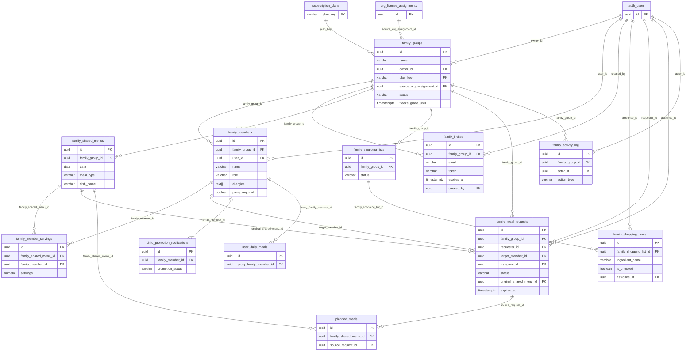

# family/ データモデル詳細設計

## 1. 目的・スコープ

家族管理ドメインの全テーブル DDL を確定し、ALTER 拡張・インデックス・ER 図を網羅する。
マイグレーションファイル `2026MMDD005_create_family_management.sql` の実装ベースとなる。

スコープ外: `subscription_plans`, `personal_subscriptions`, `org_license_assignments` の DDL は
`operator/01-data-model.md` に委ねる。本書はそれらへの FK 参照のみ記述する。

## 2. 関連要件

- 要件 01 §7.1 テーブル定義
- 要件 01 §7.6 子供メンバーライフサイクル (P0)
- 要件 01 §7.7 家族グループ分割 (P0)
- 要件 01 §7.8 大人代理操作 (P1)
- 要件 01 §7.3 既存テーブル RLS 拡張
- 100-scenarios.md B (家族 owner 20 件) / C (家族 admin/member 10 件) / H (特殊家族 5 件)

## 3. 詳細仕様

### 3.1 テーブル一覧

| テーブル | 種別 | 説明 |
|---------|------|------|
| `family_groups` | 新規 | 家族グループ本体 |
| `family_members` | 新規 | グループメンバー (子供含む) |
| `family_invites` | 新規 | 招待トークン管理 |
| `family_shared_menus` | 新規 | 共有献立エントリ |
| `family_member_servings` | 新規 | 食材按分 (メンバーごとの量) |
| `family_shopping_lists` | 新規 | 買い物リストヘッダ |
| `family_shopping_items` | 新規 | 買い物リスト明細 |
| `family_meal_requests` | 新規 | 個別献立リクエスト管理 |
| `family_activity_log` | 新規 | 監査・アクティビティログ |
| `child_promotion_notifications` | 新規 | 18 歳到達通知記録 |
| `planned_meals` | ALTER | `family_shared_menu_id`, `source_request_id` 追加 |
| `user_daily_meals` | ALTER | `proxy_family_member_id` 追加 |
| `family_members` | ALTER | `proxy_required`, `proxy_reason`, `proxy_legal_guardian_id` 追加 (P1) |

## 4. DDL

### 4.1 `family_groups`

```sql
CREATE TABLE family_groups (
  id                       UUID        PRIMARY KEY DEFAULT gen_random_uuid(),
  name                     VARCHAR(100) NOT NULL,
  description              TEXT,
  icon_url                 TEXT,
  owner_id                 UUID        NOT NULL REFERENCES auth.users(id) ON DELETE CASCADE,
  -- plan_key: operator/01-data-model.md §7.2.7 で定義される plan_key を参照
  -- 想定値: 'free' / 'family_basic' / 'family_pro' / 'family_addon'
  plan_key                 VARCHAR(100) NOT NULL DEFAULT 'free'
                             REFERENCES subscription_plans(plan_key)
                             ON UPDATE CASCADE ON DELETE RESTRICT,
  -- 組織同梱配布の場合の元ライセンス (個人加入なら NULL)
  source_org_assignment_id UUID        REFERENCES org_license_assignments(id)
                             ON DELETE SET NULL,
  member_limit             INT         NOT NULL DEFAULT 4,
  settings                 JSONB       NOT NULL DEFAULT '{}',
  -- ライフサイクル状態
  status                   VARCHAR(20) NOT NULL DEFAULT 'active'
                             CHECK (status IN ('active', 'frozen', 'archived')),
  frozen_at                TIMESTAMPTZ,
  freeze_grace_until       TIMESTAMPTZ,  -- 30 日猶予後に archived へ自動遷移
  archived_at              TIMESTAMPTZ,
  created_at               TIMESTAMPTZ NOT NULL DEFAULT NOW(),
  updated_at               TIMESTAMPTZ NOT NULL DEFAULT NOW(),
  -- 1 ユーザー 1 オーナーグループ (ver 1.0 制約)
  UNIQUE (owner_id)
);

-- settings JSONB 想定キー:
-- share_meal_records: 'true'|'false'  (家族間食事記録公開デフォルト)
-- share_health_data:  'false'          (健康データ公開はオフデフォルト)
-- weekly_menu_day:    'monday'         (共有献立の開始曜日)
```

### 4.2 `family_members`

```sql
CREATE TABLE family_members (
  id                  UUID        PRIMARY KEY DEFAULT gen_random_uuid(),
  family_group_id     UUID        NOT NULL REFERENCES family_groups(id) ON DELETE CASCADE,
  user_id             UUID        REFERENCES auth.users(id) ON DELETE SET NULL,
  -- 基本情報
  name                VARCHAR(50) NOT NULL,
  relation            VARCHAR(50) NOT NULL
                        CHECK (relation IN ('self', 'spouse', 'child', 'parent', 'sibling', 'grandparent', 'other')),
  birth_date          DATE,
  gender              VARCHAR(20) CHECK (gender IN ('male', 'female', 'other', 'prefer_not_to_say')),
  -- 身体情報
  height_cm           NUMERIC(5,2) CHECK (height_cm > 0 AND height_cm <= 300),
  weight_kg           NUMERIC(5,2) CHECK (weight_kg > 0 AND weight_kg <= 500),
  -- 食事制約 (共有献立 AI 生成で和集合計算に使用)
  allergies           TEXT[]      NOT NULL DEFAULT '{}',
  dislikes            TEXT[]      NOT NULL DEFAULT '{}',
  favorite_foods      TEXT[]      NOT NULL DEFAULT '{}',
  diet_style          VARCHAR(50) NOT NULL DEFAULT 'omnivore'
                        CHECK (diet_style IN ('omnivore', 'pescatarian', 'vegetarian', 'vegan', 'keto', 'halal', 'kosher')),
  spice_tolerance     VARCHAR(20) NOT NULL DEFAULT 'medium'
                        CHECK (spice_tolerance IN ('mild', 'medium', 'spicy')),
  -- 健康
  health_conditions   TEXT[]      NOT NULL DEFAULT '{}',
  medications         TEXT[]      NOT NULL DEFAULT '{}',
  daily_calories      INT         CHECK (daily_calories > 0 AND daily_calories <= 10000),
  protein_ratio       NUMERIC(4,2) CHECK (protein_ratio >= 0.10 AND protein_ratio <= 0.40),
  -- ロール
  role                VARCHAR(20) NOT NULL DEFAULT 'member'
                        CHECK (role IN ('owner', 'admin', 'member', 'child')),
  -- 表示・状態
  display_order       INT         NOT NULL DEFAULT 0,
  is_active           BOOLEAN     NOT NULL DEFAULT TRUE,
  privacy_settings    JSONB       NOT NULL DEFAULT '{"share_meals": false, "share_health": false}',
  -- 大人代理操作 (P1, 要件 §7.8)
  proxy_required      BOOLEAN     NOT NULL DEFAULT FALSE,
  proxy_reason        VARCHAR(50) CHECK (proxy_reason IN ('dementia', 'bedridden', 'medical_treatment', 'other')),
  proxy_legal_guardian_id UUID    REFERENCES auth.users(id),  -- 成年後見人 (Phase 2)
  -- メタ
  created_at          TIMESTAMPTZ NOT NULL DEFAULT NOW(),
  updated_at          TIMESTAMPTZ NOT NULL DEFAULT NOW(),
  -- user_id がある場合は同グループに 1 レコードのみ
  UNIQUE (family_group_id, user_id) WHERE (user_id IS NOT NULL)
);
```

### 4.3 `family_invites`

```sql
CREATE TABLE family_invites (
  id                UUID        PRIMARY KEY DEFAULT gen_random_uuid(),
  family_group_id   UUID        NOT NULL REFERENCES family_groups(id) ON DELETE CASCADE,
  email             VARCHAR(255) NOT NULL,
  role              VARCHAR(20) NOT NULL DEFAULT 'member'
                      CHECK (role IN ('admin', 'member')),
  nickname          VARCHAR(50),
  token             VARCHAR(64) NOT NULL UNIQUE,
  expires_at        TIMESTAMPTZ NOT NULL,           -- DEFAULT: created_at + 7 days
  accepted_at       TIMESTAMPTZ,
  accepted_by       UUID        REFERENCES auth.users(id),
  cancelled_at      TIMESTAMPTZ,
  created_by        UUID        NOT NULL REFERENCES auth.users(id),
  created_at        TIMESTAMPTZ NOT NULL DEFAULT NOW(),
  -- トークンは 32 byte hex (crypto.randomBytes(32).toString('hex'))
  CONSTRAINT chk_family_invites_token_len CHECK (length(token) = 64)
);
```

### 4.4 `family_shared_menus`

```sql
CREATE TABLE family_shared_menus (
  id                UUID        PRIMARY KEY DEFAULT gen_random_uuid(),
  family_group_id   UUID        NOT NULL REFERENCES family_groups(id) ON DELETE CASCADE,
  date              DATE        NOT NULL,
  meal_type         VARCHAR(20) NOT NULL
                      CHECK (meal_type IN ('breakfast', 'lunch', 'dinner', 'snack')),
  dish_name         VARCHAR(200) NOT NULL,
  recipe_id         UUID,                            -- dataset_recipes への参照 (任意)
  servings_total    NUMERIC(4,2) NOT NULL DEFAULT 1.0
                      CHECK (servings_total > 0),
  notes             TEXT,
  created_by        UUID        NOT NULL REFERENCES auth.users(id),
  created_at        TIMESTAMPTZ NOT NULL DEFAULT NOW(),
  updated_at        TIMESTAMPTZ NOT NULL DEFAULT NOW(),
  UNIQUE (family_group_id, date, meal_type, dish_name)
);
```

### 4.5 `family_member_servings` (食材按分)

```sql
CREATE TABLE family_member_servings (
  id                       UUID         PRIMARY KEY DEFAULT gen_random_uuid(),
  family_shared_menu_id    UUID         NOT NULL REFERENCES family_shared_menus(id) ON DELETE CASCADE,
  family_member_id         UUID         NOT NULL REFERENCES family_members(id) ON DELETE CASCADE,
  servings                 NUMERIC(4,2) NOT NULL DEFAULT 1.0
                             CHECK (servings >= 0),
  notes                    TEXT,
  UNIQUE (family_shared_menu_id, family_member_id)
);
```

### 4.6 `family_shopping_lists`

```sql
CREATE TABLE family_shopping_lists (
  id                UUID        PRIMARY KEY DEFAULT gen_random_uuid(),
  family_group_id   UUID        NOT NULL REFERENCES family_groups(id) ON DELETE CASCADE,
  start_date        DATE        NOT NULL,
  end_date          DATE        NOT NULL,
  status            VARCHAR(20) NOT NULL DEFAULT 'active'
                      CHECK (status IN ('active', 'completed', 'archived')),
  created_at        TIMESTAMPTZ NOT NULL DEFAULT NOW(),
  updated_at        TIMESTAMPTZ NOT NULL DEFAULT NOW(),
  CHECK (start_date <= end_date)
);
```

### 4.7 `family_shopping_items`

```sql
CREATE TABLE family_shopping_items (
  id                       UUID         PRIMARY KEY DEFAULT gen_random_uuid(),
  family_shopping_list_id  UUID         NOT NULL REFERENCES family_shopping_lists(id) ON DELETE CASCADE,
  ingredient_name          VARCHAR(200) NOT NULL,
  quantity                 NUMERIC(8,2),
  unit                     VARCHAR(20),
  category                 VARCHAR(50),  -- '野菜', '肉', '魚介', '乳製品', '調味料' 等
  is_checked               BOOLEAN      NOT NULL DEFAULT FALSE,
  assignee_id              UUID         REFERENCES auth.users(id),  -- 担当者
  added_by                 UUID         NOT NULL REFERENCES auth.users(id),
  checked_by               UUID         REFERENCES auth.users(id),
  checked_at               TIMESTAMPTZ,
  created_at               TIMESTAMPTZ  NOT NULL DEFAULT NOW(),
  updated_at               TIMESTAMPTZ  NOT NULL DEFAULT NOW(),
  -- checked_at は is_checked = TRUE のときのみ設定
  CONSTRAINT chk_checked_consistency CHECK (
    (is_checked = FALSE AND checked_at IS NULL)
    OR (is_checked = TRUE AND checked_at IS NOT NULL)
  )
);
```

### 4.8 `family_meal_requests` (個別献立リクエスト)

```sql
CREATE TABLE family_meal_requests (
  id                       UUID        PRIMARY KEY DEFAULT gen_random_uuid(),
  family_group_id          UUID        NOT NULL REFERENCES family_groups(id) ON DELETE CASCADE,
  -- 依頼者・対象者・担当者
  requester_id             UUID        NOT NULL REFERENCES auth.users(id),
  target_member_id         UUID        NOT NULL REFERENCES family_members(id),
  assignee_id              UUID        REFERENCES auth.users(id),    -- NULL = AI
  proposed_by_ai           BOOLEAN     NOT NULL DEFAULT FALSE,
  -- 対象食事
  date                     DATE        NOT NULL,
  meal_type                VARCHAR(20) NOT NULL
                             CHECK (meal_type IN ('breakfast', 'lunch', 'dinner', 'snack')),
  original_shared_menu_id  UUID        REFERENCES family_shared_menus(id) ON DELETE SET NULL,
  -- リクエスト内容
  reason                   TEXT,
  constraints              JSONB       NOT NULL DEFAULT '{}',
  -- constraints JSONB 想定キー:
  --   max_calories: number
  --   low_carb: boolean
  --   exclude_ingredients: string[]
  --   cuisine_type: string
  --   max_cooking_time_min: number
  -- 提案
  proposed_dish_name       VARCHAR(200),
  proposed_recipe          JSONB,
  proposed_at              TIMESTAMPTZ,
  -- 承認・拒否
  responded_at             TIMESTAMPTZ,
  rejection_reason         TEXT,
  -- 状態
  status                   VARCHAR(20) NOT NULL DEFAULT 'pending'
    CHECK (status IN ('pending', 'proposed', 'accepted', 'rejected', 'cancelled', 'expired')),
  -- 期限: 対象食事日 24h 前 or リクエスト作成 + 3 日のうち早い方 (アプリ層で設定)
  expires_at               TIMESTAMPTZ,
  -- メタ
  created_at               TIMESTAMPTZ NOT NULL DEFAULT NOW(),
  updated_at               TIMESTAMPTZ NOT NULL DEFAULT NOW()
);
```

### 4.9 `family_activity_log` (監査ログ、不可逆)

```sql
CREATE TABLE family_activity_log (
  id                    UUID        PRIMARY KEY DEFAULT gen_random_uuid(),
  family_group_id       UUID        NOT NULL REFERENCES family_groups(id) ON DELETE CASCADE,
  actor_id              UUID        REFERENCES auth.users(id) ON DELETE SET NULL,
  -- NULL = システム/バッチ、または GDPR 削除済みユーザー
  actor_email_snapshot  VARCHAR(255),  -- GDPR 削除前の email スナップショット
  action_type           VARCHAR(50) NOT NULL,
  -- action_type 一覧:
  --   group_created / group_updated / group_frozen / group_archived
  --   (dissolved は archived に統一: family_groups.status CHECK に 'dissolved' なし)
  --   member_added / member_removed / member_left / role_changed
  --   owner_transferred / group_split
  --   invite_sent / invite_accepted / invite_cancelled
  --   shared_menu_generated / shared_menu_updated / shared_menu_deleted
  --   shopping_list_created / shopping_item_checked
  --   meal_request_created / meal_request_proposed / meal_request_accepted
  --   meal_request_rejected / meal_request_cancelled / meal_request_expired
  --   child_promoted / proxy_enabled / proxy_disabled
  target_id             UUID,                                  -- 操作対象のレコード ID
  details               JSONB       NOT NULL DEFAULT '{}',
  created_at            TIMESTAMPTZ NOT NULL DEFAULT NOW()
  -- UPDATE / DELETE は RLS で禁止 (§08-rls-policies.md 参照)
);
```

### 4.10 `child_promotion_notifications` (18 歳到達バッチ記録)

```sql
CREATE TABLE child_promotion_notifications (
  id                UUID        PRIMARY KEY DEFAULT gen_random_uuid(),
  family_member_id  UUID        NOT NULL REFERENCES family_members(id) ON DELETE CASCADE,
  notified_at       TIMESTAMPTZ NOT NULL DEFAULT NOW(),
  promotion_status  VARCHAR(20) NOT NULL DEFAULT 'pending'
                      CHECK (promotion_status IN ('pending', 'completed', 'declined')),
  completed_at      TIMESTAMPTZ,
  new_user_id       UUID        REFERENCES auth.users(id),  -- promote-to-user 後の新 auth.users.id
  UNIQUE (family_member_id)  -- 1 メンバーにつき 1 通知レコード
);
```

### 4.11 ALTER `planned_meals` (家族連携用カラム追加)

```sql
-- 既存 planned_meals テーブルへの拡張
-- マイグレーション: 2026MMDD008_alter_planned_meals.sql

ALTER TABLE planned_meals
  ADD COLUMN IF NOT EXISTS family_shared_menu_id UUID
    REFERENCES family_shared_menus(id) ON DELETE SET NULL;

ALTER TABLE planned_meals
  ADD COLUMN IF NOT EXISTS source_request_id UUID
    REFERENCES family_meal_requests(id) ON DELETE SET NULL;

-- 判別ロジック:
-- both NULL              → 純粋な個人献立
-- shared_menu_id 設定   → 共有献立 (家族と同じ料理)
-- source_request_id 設定 → 個別リクエストフロー由来の代替メニュー
-- 両方設定               → 共有献立離脱 + リクエスト経由で代替を入れた状態
```

### 4.12 ALTER `user_daily_meals` (子供代理操作用カラム追加)

```sql
-- マイグレーション: 2026MMDD009_alter_user_daily_meals.sql

ALTER TABLE user_daily_meals
  ADD COLUMN IF NOT EXISTS proxy_family_member_id UUID
    REFERENCES family_members(id) ON DELETE SET NULL;

-- proxy_family_member_id IS NOT NULL: child メンバー (user_id=NULL) の代理食事記録
-- proxy_family_member_id IS NULL:     本人の通常記録
```

## 5. インデックス一覧

```sql
-- family_groups
CREATE INDEX idx_family_groups_owner      ON family_groups(owner_id);
CREATE INDEX idx_family_groups_status     ON family_groups(status) WHERE status = 'frozen';
CREATE INDEX idx_family_groups_grace      ON family_groups(freeze_grace_until)
  WHERE freeze_grace_until IS NOT NULL;  -- 猶予期限バッチ用

-- family_members
CREATE INDEX idx_family_members_group     ON family_members(family_group_id);
CREATE INDEX idx_family_members_user      ON family_members(user_id) WHERE user_id IS NOT NULL;
CREATE INDEX idx_family_members_active    ON family_members(family_group_id, is_active)
  WHERE is_active = TRUE;
CREATE INDEX idx_family_members_child     ON family_members(family_group_id)
  WHERE user_id IS NULL AND role = 'child';  -- 子供代理操作クエリ用
CREATE INDEX idx_family_members_birthdate ON family_members(birth_date)
  WHERE birth_date IS NOT NULL AND user_id IS NULL;  -- 18歳到達バッチ用

-- family_invites
CREATE INDEX idx_family_invites_token     ON family_invites(token);
CREATE INDEX idx_family_invites_email     ON family_invites(email);
CREATE INDEX idx_family_invites_pending   ON family_invites(family_group_id)
  WHERE accepted_at IS NULL AND cancelled_at IS NULL;

-- family_shared_menus
CREATE INDEX idx_family_shared_menus_group_date ON family_shared_menus(family_group_id, date);

-- family_member_servings
CREATE INDEX idx_family_member_servings_menu   ON family_member_servings(family_shared_menu_id);
CREATE INDEX idx_family_member_servings_member ON family_member_servings(family_member_id);

-- family_shopping_lists
-- Partial UNIQUE INDEX: 1 グループ active リストは 1 件のみ
CREATE UNIQUE INDEX idx_family_shopping_lists_active
  ON family_shopping_lists(family_group_id)
  WHERE status = 'active';

-- family_shopping_items
CREATE INDEX idx_family_shopping_items_list      ON family_shopping_items(family_shopping_list_id);
CREATE INDEX idx_family_shopping_items_unchecked ON family_shopping_items(family_shopping_list_id)
  WHERE is_checked = FALSE;
CREATE INDEX idx_family_shopping_items_assignee  ON family_shopping_items(assignee_id)
  WHERE assignee_id IS NOT NULL;

-- family_meal_requests
CREATE INDEX idx_family_meal_requests_group     ON family_meal_requests(family_group_id, status, date);
CREATE INDEX idx_family_meal_requests_requester ON family_meal_requests(requester_id, status);
CREATE INDEX idx_family_meal_requests_assignee  ON family_meal_requests(assignee_id, status)
  WHERE status IN ('pending', 'proposed');
CREATE INDEX idx_family_meal_requests_pending   ON family_meal_requests(family_group_id)
  WHERE status = 'pending';
CREATE INDEX idx_family_meal_requests_expires   ON family_meal_requests(expires_at)
  WHERE status IN ('pending', 'proposed');  -- expired バッチ用

-- family_activity_log
CREATE INDEX idx_family_activity_group ON family_activity_log(family_group_id, created_at DESC);
CREATE INDEX idx_family_activity_actor ON family_activity_log(actor_id, created_at DESC)
  WHERE actor_id IS NOT NULL;

-- child_promotion_notifications
CREATE INDEX idx_child_promo_status ON child_promotion_notifications(promotion_status)
  WHERE promotion_status = 'pending';

-- planned_meals 拡張
CREATE INDEX idx_planned_meals_shared   ON planned_meals(family_shared_menu_id)
  WHERE family_shared_menu_id IS NOT NULL;
CREATE INDEX idx_planned_meals_request  ON planned_meals(source_request_id)
  WHERE source_request_id IS NOT NULL;

-- user_daily_meals 拡張
CREATE INDEX idx_user_daily_meals_proxy ON user_daily_meals(proxy_family_member_id)
  WHERE proxy_family_member_id IS NOT NULL;
```

## 6. ER 図 (Mermaid)



## 7. テスト方針

### 7.1 マイグレーション検証

- `supabase db reset` で local DB にマイグレーション適用 → エラーなし
- `supabase db diff` でドリフト確認
- 各テーブルで RLS `ENABLE ROW LEVEL SECURITY` 確認

### 7.2 制約テスト (Vitest + Supabase Local)

| テストケース | 検証内容 |
|------------|---------|
| `family_groups` UNIQUE (owner_id) | 同ユーザーが 2 グループ作成で 409 |
| `family_members` partial UNIQUE | 同グループに同 user_id で 409 |
| `family_shopping_lists` partial UNIQUE | active リストが 2 件で 409 |
| `family_invites` CHECK token_len | 63 文字トークンで INSERT 失敗 |
| `family_shopping_items` CHECK checked | is_checked=true / checked_at=NULL で INSERT 失敗 |
| FK CASCADE | family_groups 削除 → 子レコード全 CASCADE |
| FK SET NULL | org_license_assignments 削除 → family_groups.source_org_assignment_id = NULL |

### 7.3 インデックス効果確認

```sql
-- 期限切れバッチのクエリ計画確認
EXPLAIN ANALYZE
SELECT id FROM family_meal_requests
WHERE status IN ('pending', 'proposed') AND expires_at < NOW();

-- 買い物リスト Realtime 購読クエリ
EXPLAIN ANALYZE
SELECT * FROM family_shopping_items
WHERE family_shopping_list_id = $1 AND is_checked = FALSE;
```

## 8. 既存実装との関連

### 8.1 保持

- `planned_meals` 既存カラム: 変更なし、`ADD COLUMN IF NOT EXISTS` で追加のみ
- `user_daily_meals` 既存カラム: 変更なし
- `dataset_recipes`: 参照先として保持 (`family_shared_menus.recipe_id`)

### 8.2 削除 (clean-build 対象)

- `commit 32d13e1` で削除済みの古い `family_groups` / `family_members` テーブルは
  新 DDL で再構築。既存データは Supabase Dashboard で DROP → migrate

### 8.3 新規

- 全 8 テーブル + 2 ALTER は `2026MMDD005_create_family_management.sql`
- `planned_meals` ALTER は `2026MMDD008_alter_planned_meals.sql`
- `user_daily_meals` ALTER は `2026MMDD009_alter_user_daily_meals.sql`

## 4.13 `parental_consents` (子供同意記録)

> **NOTE: operator/01-data-model.md から移動。**
> `family_members(id)` を FK 参照するため family/ ドメインで定義する。
> マイグレーション適用は family_members 作成後。

```sql
-- マイグレーション: 2026MMDD010_create_parental_consents.sql
-- ※ family_members (family/ ドメイン) 適用後に実行すること

CREATE TABLE parental_consents (
  id                UUID PRIMARY KEY DEFAULT gen_random_uuid(),
  family_member_id  UUID NOT NULL REFERENCES family_members(id) ON DELETE CASCADE,
  parent_user_id    UUID NOT NULL REFERENCES auth.users(id),
  signed_at         TIMESTAMPTZ NOT NULL DEFAULT NOW(),
  ip_address        INET,
  user_agent        TEXT,
  consent_version   VARCHAR(20) NOT NULL
);

ALTER TABLE parental_consents ENABLE ROW LEVEL SECURITY;

CREATE POLICY "parental_consents_select" ON parental_consents
  FOR SELECT USING (
    parent_user_id = auth.uid()
    OR EXISTS (
      SELECT 1 FROM user_profiles
      WHERE id = auth.uid() AND ARRAY['admin','super_admin']::TEXT[] && roles
    )
  );

CREATE INDEX idx_parental_consents_member ON parental_consents(family_member_id);
CREATE INDEX idx_parental_consents_parent ON parental_consents(parent_user_id);
```

## 9. 未解決事項

| 項目 | 状態 | 対応方針 |
|------|------|---------|
| `family_members.dietary_restrictions` 列 | 要件では `allergies` + `dislikes` の 2 列だが、05-shared-menu-engine.md が「dietary_restrictions 和集合」と参照 → `allergies` を指す列エイリアスとして整理が必要 | `05-shared-menu-engine.md` §3 で `allergies` を dietary_restrictions として扱うことを明記 |
| `family_shopping_items.category` の ENUM 化 | 現状 VARCHAR(50)。将来的に CHECK 制約 or 別テーブルマスター化を検討 | Phase 2 課題 |
| `family_groups.settings` JSONB のスキーマ固定 | 現状 JSONB で自由記述。TypeScript 型は `FamilyGroupSettings` として `types/domain/family.ts` で定義 | 実装時に確定 |
| `proxy_legal_guardian_id` の法的検討 | 成年後見人登録は法的スコープ → Phase 2 で法務レビュー後に正式カラム追加 | 現時点は列のみ宣言、機能実装なし |
