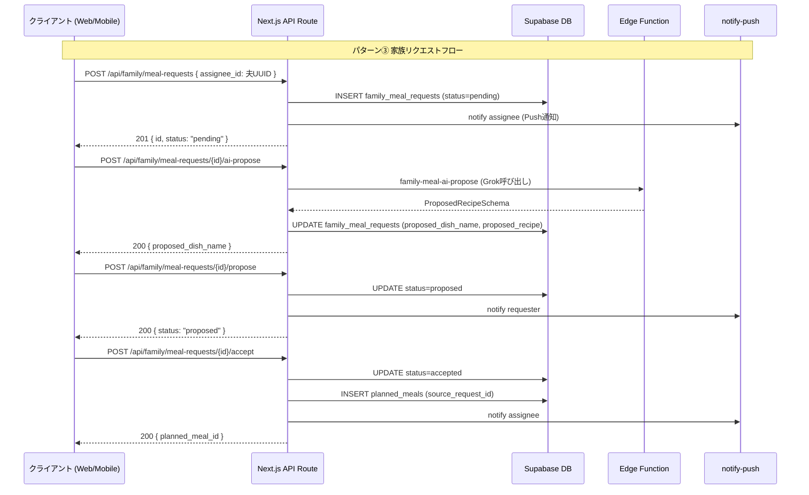

# family/ API 仕様詳細設計

## 1. 目的・スコープ

家族管理ドメインの全 REST API エンドポイントについて、リクエスト・レスポンス・エラーコードを確定する。
`cross/04-api-conventions.md` の規約に準拠し、エラーコード命名規則に従う。

スコープ外: Edge Function の内部実装詳細は `05-shared-menu-engine.md` / `04-meal-request-flow.md` に委ねる。

## 2. 関連要件

- 要件 01 §8 API 仕様
- 要件 01 §4 ユースケース
- 100-scenarios.md B (owner 20 件) / C (admin/member 10 件)

## 3. 共通規約

### 3.1 認証

全エンドポイントは `Authorization: Bearer <supabase_access_token>` 必須。
例外: `GET /api/family/invites/{token}` のみ認証不要 (受諾画面のプレビュー用)。

### 3.2 楽観的ロック

状態遷移を伴うエンドポイント (`dissolve`, `transfer-ownership`, `migrate-to-personal`, `split`) は
`If-Unmodified-Since: <ISO8601>` ヘッダ必須。
不一致時は `412 Precondition Failed` を返す。

### 3.3 エラーレスポンス形式

```json
{
  "error": {
    "code": "FAM_GROUP_NOT_FOUND",
    "message": "指定された家族グループが見つかりません",
    "request_id": "req_..."
  }
}
```

### 3.4 エラーコード一覧

| コード | HTTP | 意味 |
|--------|------|------|
| `FAM_GROUP_NOT_FOUND` | 404 | グループが存在しない |
| `FAM_GROUP_FULL` | 422 | メンバー数上限到達 |
| `FAM_GROUP_NOT_ACTIVE` | 422 | グループが frozen / archived 状態 |
| `FAM_USER_ALREADY_IN_GROUP` | 409 | 既に他グループ所属 |
| `FAM_INVITE_EXPIRED` | 410 | 招待期限切れ |
| `FAM_INVITE_USED` | 409 | 既に受諾済 |
| `FAM_INVITE_CANCELLED` | 410 | キャンセル済 |
| `FAM_PERMISSION_DENIED` | 403 | 権限不足 |
| `FAM_OWNER_CANNOT_LEAVE` | 422 | オーナーは脱退不可 |
| `FAM_NEED_ADMIN_FOR_TRANSFER` | 422 | 譲渡先管理者なし |
| `FAM_INVALID_LOCK` | 412 | 楽観的ロック不一致 |
| `FAM_SPLIT_CONSENT_TIMEOUT` | 422 | メンバー同意タイムアウト |
| `FAM_CHILD_PROMOTE_AUTH_REQUIRED` | 403 | 親の再認証が必要 |
| `FAM_REQUEST_NOT_FOUND` | 404 | リクエストが存在しない |
| `FAM_REQUEST_INVALID_STATUS` | 422 | 状態遷移が不正 |
| `FAM_AI_GENERATION_FAILED` | 502 | AI 生成失敗 (3 回リトライ後) |
| `FAM_ALLERGEN_CONFLICT` | 422 | アレルゲン突合失敗 (3 回リトライ後) |
| `FAM_SHOPPING_LIST_NOT_FOUND` | 404 | 買い物リストが存在しない |

---

## 4. グループ操作

### 4.1 `POST /api/family/groups` — グループ作成

**認証**: 必須
**前提**: 呼び出しユーザーが家族グループ未所属

**リクエスト**:
```json
{
  "name": "田中家",
  "description": "我が家の食事管理",
  "icon_url": null,
  "plan_key": "free"
}
```

**バリデーション**:
- `name`: 必須、1-100 文字、HTML タグ不可
- `description`: 任意、0-500 文字
- `plan_key`: `subscription_plans` に存在する family 系 plan_key

**レスポンス 201**:
```json
{
  "id": "uuid",
  "name": "田中家",
  "description": null,
  "icon_url": null,
  "owner_id": "uuid",
  "plan_key": "free",
  "member_limit": 4,
  "status": "active",
  "source_org_assignment_id": null,
  "settings": {},
  "created_at": "2026-05-06T20:30:00Z",
  "updated_at": "2026-05-06T20:30:00Z"
}
```

**エラー**:
- `422 VALID_REQUIRED_FIELD`: バリデーション失敗
- `409 FAM_USER_ALREADY_IN_GROUP`: 既に所属

---

### 4.2 `GET /api/family/groups/me` — 自分のグループ取得

**認証**: 必須

**レスポンス 200**:
```json
{
  "group": {
    "id": "uuid",
    "name": "田中家",
    "owner_id": "uuid",
    "plan_key": "free",
    "member_limit": 4,
    "status": "active",
    "freeze_grace_until": null,
    "settings": {},
    "created_at": "2026-05-06T20:30:00Z",
    "updated_at": "2026-05-06T20:30:00Z"
  },
  "my_role": "owner",
  "my_member_id": "uuid",
  "members_count": 4,
  "pending_invites_count": 1
}
```

**レスポンス 404**: 所属グループなし (body なし)

---

### 4.3 `GET /api/family/groups/{id}` — グループ詳細取得

**認証**: 必須 (同グループメンバーのみ)

**レスポンス 200**: `GET /me` と同形式 + `members` 配列含む

```json
{
  "group": { /* family_group */ },
  "my_role": "member",
  "my_member_id": "uuid",
  "members": [
    {
      "id": "uuid",
      "name": "田中美咲",
      "relation": "self",
      "role": "owner",
      "user_id": "uuid",
      "is_active": true,
      "display_order": 0
    }
  ],
  "members_count": 4,
  "pending_invites_count": 0
}
```

**エラー**:
- `403 FAM_PERMISSION_DENIED`: 非メンバー
- `404 FAM_GROUP_NOT_FOUND`

---

### 4.4 `PATCH /api/family/groups/{id}` — グループ情報更新

**認証**: 必須 (owner のみ)

**リクエスト** (部分更新):
```json
{
  "name": "田中家 (新)",
  "description": "更新後の説明",
  "settings": {
    "share_meal_records": "true",
    "weekly_menu_day": "monday"
  }
}
```

**レスポンス 200**: 更新後の group オブジェクト

**エラー**:
- `403 FAM_PERMISSION_DENIED`: owner 以外
- `404 FAM_GROUP_NOT_FOUND`

---

### 4.5 `DELETE /api/family/groups/{id}` — グループ解散

**認証**: 必須 (owner のみ)、パスワード再認証必須

**リクエスト**:
```json
{
  "password": "current_password"
}
```

**動作**:
1. パスワード再認証 (Supabase Auth `signInWithPassword` で検証)
2. `family_groups.status = 'archived'`、`archived_at = NOW()`
3. 全メンバーに push + email 通知
4. `family_activity_log` に `group_archived` 記録 (dissolved は archived に統一)
5. 関連リソース (invites / shared_menus / shopping_lists) は CASCADE 削除

**レスポンス 204**: No Content

**エラー**:
- `401 AUTH_REAUTH_REQUIRED`: パスワード不一致
- `403 FAM_PERMISSION_DENIED`
- `422 FAM_NEED_ADMIN_FOR_TRANSFER`: (owner が child の親権者で分割不可の場合の警告)

---

### 4.6 `POST /api/family/groups/{id}/transfer-owner` — オーナー譲渡

**認証**: 必須 (owner のみ)、楽観的ロック必須

**リクエスト**:
```json
{
  "new_owner_member_id": "uuid",
  "password": "current_password"
}
```

**動作**:
1. `If-Unmodified-Since` 検証
2. `acquire_family_group_lock(group_id)` 取得 (ラッパー経由)
3. パスワード再認証
4. `family_members` で旧 owner → `admin`、新 owner → `owner`
5. `family_groups.owner_id` 更新
6. 双方に通知
7. `family_activity_log` に `owner_transferred` 記録

**レスポンス 200**: 更新後 group

**エラー**:
- `412 FAM_INVALID_LOCK`
- `422 FAM_NEED_ADMIN_FOR_TRANSFER`: 新 owner がメンバーに存在しない

---

### 4.7 `POST /api/family/groups/{id}/migrate-to-personal` — 個人プランへ移行

**認証**: 必須 (owner、組織同梱 family_addon のみ)、楽観的ロック必須

**説明**: 退職時の frozen グループを個人プラン (`family_basic` / `family_pro`) へ移行する。
UC-ORG-17 シナリオ。

**リクエスト**:
```json
{
  "target_plan_key": "family_basic",
  "stripe_payment_method_id": "pm_xxx"
}
```

**動作**:
1. 楽観的ロック検証
2. `acquire_family_group_lock(group_id)` 取得 (ラッパー経由)
3. Stripe サブスクリプション作成
4. `family_groups.plan_key` 更新、`status = 'active'`、`frozen_at = NULL`
5. `family_activity_log` に `group_migrated_to_personal` 記録

**レスポンス 200**: 更新後 group

**エラー**:
- `412 FAM_INVALID_LOCK`
- `422 FAM_GROUP_NOT_ACTIVE`: frozen 以外のグループに対して呼ぶと失敗

---

### 4.8 `POST /api/family/groups/{id}/transfer-ownership` — 凍結時の所有者移転 (UC-ORG-17)

**説明**: `migrate-to-personal` と異なり、退職者が所有権を他メンバーに譲り自分はグループを離れる。

**リクエスト**:
```json
{
  "new_owner_member_id": "uuid",
  "password": "current_password"
}
```

動作は `transfer-owner` と同等。frozen グループでも実行可能。

**レスポンス 200**: 更新後 group

---

### 4.9 `POST /api/family/groups/{id}/dissolve` — 凍結時のグループ解散 (UC-ORG-17)

**説明**: `DELETE /api/family/groups/{id}` の frozen 対応版。frozen グループでも実行可能。

**リクエスト**: `DELETE` と同形式

**レスポンス 204**

---

### 4.10 `POST /api/family/groups/{id}/split` — グループ分割 (P0, §7.7)

**認証**: 必須 (owner のみ)、楽観的ロック必須、パスワード再認証必須

**リクエスト**:
```json
{
  "password": "current_password",
  "split_members": ["member_uuid_1", "member_uuid_2"],
  "new_group_name": "田中家 (Aチーム)",
  "new_owner_id": "user_uuid",
  "meal_history_mode": "shared",
  "shopping_list_mode": "new_owner"
}
```

**フィールド定義**:
- `split_members`: 新グループに移行するメンバー UUID 配列
- `new_owner_id`: 新グループの owner になる user_id (split_members に含まれること)
- `meal_history_mode`: `"shared"` (両グループで read-only 共有) / `"split"` (完全分割)
- `shopping_list_mode`: `"original_owner"` / `"new_owner"` / `"archive"`

**動作**:
1. 楽観的ロック + advisory lock
2. パスワード再認証
3. split_members 内に child メンバーがいる場合: 親権者の同意確認 (24h タイムアウト)
4. 同意確定後:
   - 新 `family_group` 作成 (`plan_key = 'free'`、新 owner を owner に)
   - 指定メンバーを `family_members.family_group_id` 更新
   - `meal_history_mode` に従い `planned_meals` 処理
5. 全関連メンバーに通知
6. `family_activity_log` に `group_split` 記録

**レスポンス 202 Accepted** (同意待ちは非同期):
```json
{
  "split_id": "uuid",
  "status": "awaiting_consent",
  "consent_deadline": "2026-05-07T20:30:00Z",
  "consents_required": ["member_uuid_1", "member_uuid_2"]
}
```

**同意完了時**: Realtime で `family_split_completed` イベントをブロードキャスト

**エラー**:
- `412 FAM_INVALID_LOCK`
- `422 FAM_SPLIT_CONSENT_TIMEOUT`: 24h 以内に未応答

---

## 5. メンバー操作

### 5.1 `GET /api/family/members` — メンバー一覧

**クエリ**: `?group_id={uuid}&include_inactive=false`

**レスポンス 200**:
```json
{
  "members": [
    {
      "id": "uuid",
      "family_group_id": "uuid",
      "user_id": "uuid",
      "name": "田中美咲",
      "relation": "self",
      "role": "owner",
      "birth_date": "1986-04-01",
      "gender": "female",
      "allergies": [],
      "diet_style": "omnivore",
      "display_order": 0,
      "is_active": true,
      "proxy_required": false
    }
  ]
}
```

---

### 5.2 `POST /api/family/members` — メンバー追加

**認証**: 必須 (owner / admin のみ)

**リクエスト**:
```json
{
  "name": "長男",
  "relation": "child",
  "birth_date": "2016-04-15",
  "gender": "male",
  "height_cm": 135.0,
  "weight_kg": 30.0,
  "allergies": ["卵"],
  "dislikes": ["ピーマン"],
  "role": "child",
  "user_id": null
}
```

**バリデーション**:
- `name`: 必須、1-50 文字
- `relation`: 列挙値 (self/spouse/child/parent/sibling/grandparent/other)
- `role = 'child'` の場合: `user_id` は null 必須
- `role = 'owner'` は不可 (transfer-owner で変更)
- メンバー数 < `family_groups.member_limit`

**レスポンス 201**: 作成後の member オブジェクト

**エラー**:
- `403 FAM_PERMISSION_DENIED`
- `422 FAM_GROUP_FULL`: member_limit 超過

---

### 5.3 `PATCH /api/family/members/{id}` — メンバー情報更新

**認証**: 必須 (本人 or owner or admin)

**リクエスト** (部分更新):
```json
{
  "allergies": ["卵", "牛乳"],
  "weight_kg": 31.5,
  "privacy_settings": { "share_meals": true }
}
```

`role` 変更は owner のみ。`proxy_required` / `proxy_reason` 変更は owner / admin のみ。

**レスポンス 200**: 更新後の member オブジェクト

---

### 5.4 `DELETE /api/family/members/{id}` — メンバー除名

**認証**: 必須 (owner は全員除名可、admin は child メンバーのみ)

**クエリ**: `?data_mode=keep|delete`
- `keep`: 食事履歴を各個人に残す (デフォルト)
- `delete`: 完全削除

**動作**:
1. `family_members.is_active = false`
2. 除名されたメンバーに push + email 通知
3. `family_activity_log` に `member_removed` 記録

**レスポンス 204**

---

### 5.5 `POST /api/family/members/leave` — 自分が脱退

**認証**: 必須

**動作**:
1. owner は不可 (422 `FAM_OWNER_CANNOT_LEAVE`)
2. `family_members.is_active = false`
3. owner に通知
4. `family_activity_log` に `member_left` 記録

**レスポンス 204**

---

### 5.6 `POST /api/family/members/{id}/link-account` — 子供メンバーにアカウントを紐付け

**認証**: 必須

**リクエスト**:
```json
{
  "user_id": "uuid"
}
```

**動作**:
1. 呼び出しユーザーが `user_id` の本人である確認
2. 対象 `family_member` が `user_id IS NULL` (child) である確認
3. グループ owner が承認済みである確認 (owner が呼び出す場合は同時承認)
4. `family_members.user_id = user_id`, `role = 'member'` に更新

**レスポンス 200**: 更新後の member オブジェクト

---

### 5.7 `POST /api/family/members/{id}/promote-to-user` — 18 歳到達アカウント独立 (P0, §7.6)

**認証**: 必須 (owner のみ)、パスワード再認証必須

**リクエスト**:
```json
{
  "email": "child@example.com",
  "password": "new_account_password",
  "transfer_data": "all",
  "owner_password": "parent_password"
}
```

**`transfer_data` 選択肢**:
- `"all"`: 食事履歴・健康データを新アカウントに完全移管
- `"history_only"`: 食事履歴のみ移管、健康データは親側保持
- `"none"`: 移管なし (新アカウントは空)

**動作**:
1. owner パスワード再認証
2. Supabase Auth で子供用新アカウント作成 (`email` + `password`)
3. Email 確認メール送信
4. `family_members.user_id = new_user_id`, `role = 'member'`
5. `transfer_data` に従い `meals` / `user_daily_meals` の `user_id` 更新
6. `child_promotion_notifications.promotion_status = 'completed'`
7. 新アカウントに 30 日無料体験 push
8. `family_activity_log` に `child_promoted` 記録

**レスポンス 200**:
```json
{
  "new_user_id": "uuid",
  "member_id": "uuid",
  "transfer_data": "all",
  "trial_expires_at": "2026-06-06T20:30:00Z"
}
```

---

## 6. 招待

### 6.1 `POST /api/family/invites` — 招待送信

**認証**: 必須 (owner / admin のみ)

**リクエスト**:
```json
{
  "email": "spouse@example.com",
  "role": "admin",
  "nickname": "ダーリン"
}
```

**動作**:
1. Cloudflare Turnstile CAPTCHA 検証
2. `crypto.randomBytes(32).toString('hex')` でトークン生成
3. `family_invites` INSERT (`expires_at = NOW() + 7 days`)
4. Resend 経由で招待メール送信
5. `family_activity_log` に `invite_sent` 記録

**レスポンス 201**:
```json
{
  "id": "uuid",
  "token": "abc123...",
  "invite_url": "https://homegohan-app.vercel.app/invite/family/abc123...",
  "expires_at": "2026-05-13T20:30:00Z"
}
```

---

### 6.2 `GET /api/family/invites` — 招待一覧

**認証**: 必須 (owner / admin のみ)
**クエリ**: `?status=pending|accepted|cancelled`

**レスポンス 200**:
```json
{
  "invites": [
    {
      "id": "uuid",
      "email": "spouse@example.com",
      "role": "admin",
      "expires_at": "2026-05-13T20:30:00Z",
      "accepted_at": null,
      "cancelled_at": null
    }
  ]
}
```

---

### 6.3 `GET /api/family/invites/{token}` — 招待情報取得 (受諾画面用)

**認証**: 不要 (token で識別)
**実装**: server-side で `service_role` キー使用 (RLS バイパス)

**レスポンス 200**:
```json
{
  "family_group_name": "田中家",
  "inviter_name": "田中美咲",
  "role": "admin",
  "expires_at": "2026-05-13T20:30:00Z",
  "is_valid": true
}
```

**エラー**:
- `410 FAM_INVITE_EXPIRED`
- `409 FAM_INVITE_USED`
- `410 FAM_INVITE_CANCELLED`
- `404`: トークン不存在

---

### 6.4 `POST /api/family/invites/{token}/accept` — 招待受諾

**認証**: 必須
**実装**: server-side で `service_role` キー使用

**動作**:
1. トークン有効性確認
2. 呼び出しユーザーが他グループ非所属確認
3. `family_invites.accepted_at = NOW()`, `accepted_by = auth.uid()`
4. `family_members` INSERT
5. グループ全員に通知
6. `family_activity_log` に `invite_accepted` 記録

**レスポンス 200**:
```json
{
  "group_id": "uuid",
  "member_id": "uuid",
  "role": "admin"
}
```

**エラー**:
- `409 FAM_USER_ALREADY_IN_GROUP`
- `410 FAM_INVITE_EXPIRED`

---

### 6.5 `DELETE /api/family/invites/{id}` — 招待取消

**認証**: 必須 (owner or 招待作成者)

**動作**: `family_invites.cancelled_at = NOW()`

**レスポンス 204**

---

## 7. 共有献立

### 7.1 `POST /api/family/shared-menus/generate` — 共有献立 AI 生成

**認証**: 必須 (owner / admin のみ)

**リクエスト**:
```json
{
  "start_date": "2026-05-12",
  "end_date": "2026-05-18",
  "member_ids": ["uuid1", "uuid2", "uuid3"],
  "constraints": {
    "use_fridge_first": true,
    "respect_all_allergies": true,
    "max_cooking_time_min": 30,
    "cuisine_preferences": ["和食", "洋食"]
  }
}
```

**動作**:
1. `family_members` の `allergies` + `diet_style` 和集合計算
2. Edge Function `family-shared-menu-generate` 呼び出し
3. レスポンス後 `family_shared_menus` に bulk INSERT
4. 各メンバーの `user_daily_meals` + `planned_meals` を展開 (05-shared-menu-engine.md §4 参照)

**レスポンス 201**:
```json
{
  "generated_count": 21,
  "shared_menu_ids": ["uuid", "..."],
  "planned_meal_count": 84
}
```

---

### 7.2 `GET /api/family/shared-menus` — 共有献立一覧

**クエリ**: `?date_from=2026-05-12&date_to=2026-05-18`

**レスポンス 200**:
```json
{
  "shared_menus": [
    {
      "id": "uuid",
      "date": "2026-05-12",
      "meal_type": "dinner",
      "dish_name": "カレーライス",
      "servings_total": 4.0,
      "member_servings": [
        { "family_member_id": "uuid", "member_name": "美咲", "servings": 1.0 }
      ]
    }
  ]
}
```

---

### 7.3 `PATCH /api/family/shared-menus/{id}` — 共有献立更新

**認証**: 必須 (owner / admin のみ)

**リクエスト** (部分更新):
```json
{
  "dish_name": "チキンカレー",
  "notes": "子供向けに甘口",
  "servings_total": 4.0
}
```

**レスポンス 200**: 更新後の shared_menu

---

### 7.4 `DELETE /api/family/shared-menus/{id}` — 共有献立削除

**認証**: 必須 (owner / admin のみ)

**動作**: `family_shared_menus` DELETE, 紐付く `planned_meals.family_shared_menu_id = NULL`

**レスポンス 204**

---

## 8. 買い物リスト

### 8.1 `GET /api/family/shopping-list` — active リスト取得

**認証**: 必須

**レスポンス 200**:
```json
{
  "list": {
    "id": "uuid",
    "family_group_id": "uuid",
    "start_date": "2026-05-12",
    "end_date": "2026-05-18",
    "status": "active"
  },
  "items": [
    {
      "id": "uuid",
      "ingredient_name": "鶏胸肉",
      "quantity": 600,
      "unit": "g",
      "category": "肉",
      "is_checked": false,
      "assignee_id": null,
      "assignee_name": null,
      "added_by_name": "美咲"
    }
  ],
  "unchecked_count": 8,
  "total_count": 12
}
```

**レスポンス 404**: active リストなし

---

### 8.2 `POST /api/family/shopping-list/{id}/items` — アイテム手動追加

**認証**: 必須 (全メンバー)

**リクエスト**:
```json
{
  "ingredient_name": "牛乳",
  "quantity": 1,
  "unit": "L",
  "category": "乳製品",
  "assignee_id": null
}
```

**レスポンス 201**: 作成後の item オブジェクト

---

### 8.3 `PATCH /api/family/shopping-list/{id}/items/{itemId}/check` — チェック状態更新

**認証**: 必須 (全メンバー)

**リクエスト**:
```json
{
  "is_checked": true
}
```

**動作**: Realtime ブロードキャストも同時発火 (`shopping_list_{list_id}` チャンネル、リスト ID で動的)

**レスポンス 200**: 更新後の item

---

### 8.4 `PATCH /api/family/shopping-list/{id}/items/{itemId}` — アイテム更新

**認証**: 必須

**リクエスト** (担当者割当等):
```json
{
  "assignee_id": "user_uuid",
  "quantity": 800,
  "unit": "g"
}
```

**レスポンス 200**: 更新後の item

---

### 8.5 `POST /api/family/shopping-list/generate` — 共有献立から再生成

**認証**: 必須 (owner / admin のみ)

**リクエスト**:
```json
{
  "date_from": "2026-05-12",
  "date_to": "2026-05-18"
}
```

**動作**:
1. 指定期間の `family_shared_menus` からレシピ食材を抽出
2. 既存 active リストに追加 (重複はマージ)
3. active リストがなければ新規作成

**レスポンス 200**: 更新後のリストと追加アイテム数

---

## 9. 個別献立リクエスト

### 9.1 `POST /api/family/meal-requests` — リクエスト作成 (共有献立離脱)

**認証**: 必須

**リクエスト**:
```json
{
  "target_member_id": "uuid",
  "date": "2026-05-13",
  "meal_type": "dinner",
  "original_shared_menu_id": "uuid",
  "reason": "ダイエット中",
  "constraints": {
    "max_calories": 600,
    "low_carb": true,
    "exclude_ingredients": ["米"]
  },
  "assignee_id": null,
  "self_decide_dish": null
}
```

**動作分岐** (要件 §8.6.1):
| 条件 | パターン | 動作 |
|------|---------|------|
| `self_decide_dish` あり | ① 自分で決める | 即 `planned_meals` 追加, status=`accepted` |
| `assignee_id=null`, `self_decide_dish=null` | ② AI 生成 | Edge Function 呼び出し → `proposed` → 自動 `accepted` |
| `assignee_id=他メンバー` | ③ 家族に依頼 | `pending` 作成, assignee に Push 通知 |
| target が child (user_id IS NULL) | ④ 子供代理 | ①〜③ のいずれか、requester は owner/admin 必須 |

**レスポンス 201**:
```json
{
  "id": "uuid",
  "status": "accepted",
  "assignee_id": null,
  "proposed_dish_name": "鶏胸肉のサラダ",
  "proposed_by_ai": true,
  "planned_meal_id": "uuid"
}
```

---

### 9.2 `GET /api/family/meal-requests` — リクエスト一覧

**クエリ**: `?status=pending&assignee_id=me&requester_id=me&date_from=&date_to=`

**レスポンス 200**:
```json
{
  "requests": [
    {
      "id": "uuid",
      "status": "pending",
      "date": "2026-05-13",
      "meal_type": "dinner",
      "requester_name": "田中美咲",
      "target_member_name": "田中美咲",
      "assignee_name": "田中太郎",
      "reason": "ダイエット中",
      "expires_at": "2026-05-12T06:00:00Z"
    }
  ],
  "badge_count": 2
}
```

`badge_count`: `assignee_id = me AND status = 'pending'` の件数 + `requester_id = me AND status = 'proposed'` の件数

---

### 9.3 `GET /api/family/meal-requests/{id}` — リクエスト詳細

**レスポンス 200**: 全フィールド含む詳細

---

### 9.4 `POST /api/family/meal-requests/{id}/propose` — 代替メニュー提案 (パターン③)

**認証**: 必須 (`assignee_id = auth.uid()` のみ)

**リクエスト**:
```json
{
  "dish_name": "鶏胸肉のサラダ",
  "recipe": {
    "ingredients": [
      { "name": "鶏胸肉", "amount": "200g" }
    ],
    "steps": ["鶏胸肉を茹でる", "野菜と合わせる"]
  },
  "use_ai_suggestion": false
}
```

**`use_ai_suggestion: true`** の場合: `ai-propose` エンドポイントを内部呼び出し

**動作**: status `pending` → `proposed`, requester に Push 通知

**レスポンス 200**: 更新後のリクエスト

---

### 9.5 `POST /api/family/meal-requests/{id}/accept` — 提案承認

**認証**: 必須 (`requester_id = auth.uid()` のみ)

**動作**:
1. status `proposed` → `accepted`
2. `planned_meals` に `source_request_id` 紐付けで INSERT
3. `original_shared_menu_id` がある場合: UI 表示で「離脱中」フラグ管理
4. assignee に Push 通知
5. `family_activity_log` に `meal_request_accepted` 記録

**レスポンス 200**:
```json
{
  "status": "accepted",
  "planned_meal_id": "uuid"
}
```

---

### 9.6 `POST /api/family/meal-requests/{id}/reject` — 提案拒否

**認証**: 必須 (`requester_id = auth.uid()` のみ)

**リクエスト**:
```json
{
  "rejection_reason": "もっと低カロリーな案がほしい"
}
```

**動作**: status `proposed` → `rejected`, assignee に Push 通知 (理由付き)

**レスポンス 200**: 更新後のリクエスト

---

### 9.7 `POST /api/family/meal-requests/{id}/cancel` — リクエストキャンセル

**認証**: 必須 (`requester_id = auth.uid()` のみ)

**動作**: status `pending` / `proposed` → `cancelled`, assignee に Push 通知 (静音)

**レスポンス 200**: 更新後のリクエスト

---

### 9.8 `POST /api/family/meal-requests/{id}/ai-propose` — AI 補助提案生成

**認証**: 必須 (`assignee_id = auth.uid()` のみ)

**説明**: assignee が「AI に任せる」ボタンを押した際に呼び出す。
Edge Function `family-meal-ai-propose` を呼び出し、結果を `proposed_dish_name` / `proposed_recipe` に設定する。
その後 `propose` エンドポイントで正式提案に進む。

**リクエスト**:
```json
{
  "additional_constraints": {
    "cuisine_type": "和食",
    "max_cooking_time_min": 20
  }
}
```

**レスポンス 200**:
```json
{
  "proposed_dish_name": "鶏胸肉の和風サラダ",
  "proposed_recipe": { /* ProposedRecipeSchema */ },
  "proposed_by_ai": true,
  "retries_used": 1
}
```

**エラー**:
- `502 FAM_AI_GENERATION_FAILED`: 3 回リトライ後も失敗
- `422 FAM_ALLERGEN_CONFLICT`: アレルゲン突合失敗

---

## 10. 通知設定

### 10.1 `GET /api/family/notification-preferences` — 通知設定取得

**認証**: 必須

**レスポンス 200**:
```json
{
  "preferences": {
    "invite_received":      { "email": true, "push": true },
    "invite_accepted":      { "email": false, "push": true },
    "member_joined":        { "email": false, "push": true },
    "member_left":          { "email": false, "push": true },
    "member_removed":       { "email": true, "push": true },
    "group_archived":       { "email": true, "push": true },
    "shared_menu_generated": { "email": false, "push": false },
    "shopping_item_added":  { "email": false, "push": false },
    "meal_request_received": { "email": false, "push": true },
    "meal_request_proposed": { "email": false, "push": true },
    "meal_request_accepted": { "email": false, "push": true },
    "meal_request_rejected": { "email": false, "push": true },
    "meal_request_expired":  { "email": false, "push": true },
    "allergen_warning":     { "email": true, "push": true }
  }
}
```

---

### 10.2 `PUT /api/family/notification-preferences` — 通知設定更新

**認証**: 必須

**リクエスト**: `GET` と同形式 (全設定を上書き)

**レスポンス 200**: 更新後の preferences

---

## 11. アクティビティログ

### 11.1 `GET /api/family/activity` — アクティビティ一覧

**認証**: 必須 (同グループメンバーのみ)
**クエリ**: `?limit=20&before=2026-05-06T20:30:00Z`

**レスポンス 200**:
```json
{
  "activities": [
    {
      "id": "uuid",
      "action_type": "member_added",
      "actor_name": "田中美咲",
      "details": { "member_name": "長男", "role": "child" },
      "created_at": "2026-05-06T20:30:00Z"
    }
  ],
  "has_more": true
}
```

---

## 12. シーケンス



## 13. テスト方針

### 13.1 Unit テスト (Vitest)

- 各 API Route の Zod バリデーション (正常 / 異常入力)
- 権限マトリクス全組み合わせ: owner / admin / member / child 代理 × 全操作
- エラーコード返却の一致確認

### 13.2 Integration テスト (Vitest + Supabase Local)

- 招待 → 受諾 → メンバー追加フロー
- 個別リクエスト 4 パターン全てのステータス遷移
- 楽観的ロック (If-Unmodified-Since 不一致 → 412)
- frozen グループへの INSERT 禁止

### 13.3 E2E (Playwright)

- `tests/e2e/family/family-02-invite-accept.spec.ts`
- `tests/e2e/family/family-09-meal-request-pattern3.spec.ts`

## 14. 既存実装との関連

- 既存 `GET /api/family/groups`, `POST /api/family/members` は clean-build で削除済み (commit 32d13e1)
- 本仕様で完全新規実装
- `cross/04-api-conventions.md` の規約に従いエラーフォーマットを統一

## 15. 未解決事項

| 項目 | 状態 |
|------|------|
| `GET /api/family/invites/{token}` のレート制限 | Upstash Ratelimit で 100 req/IP/min 設定 (cross/ 依存) |
| split API の同意フロー詳細 UI | `03-ui-spec.md §6` で設計 |
| `promote-to-user` の Email 確認フロー | Supabase Auth の `signUp` + `verifyOtp` フローを流用 |
