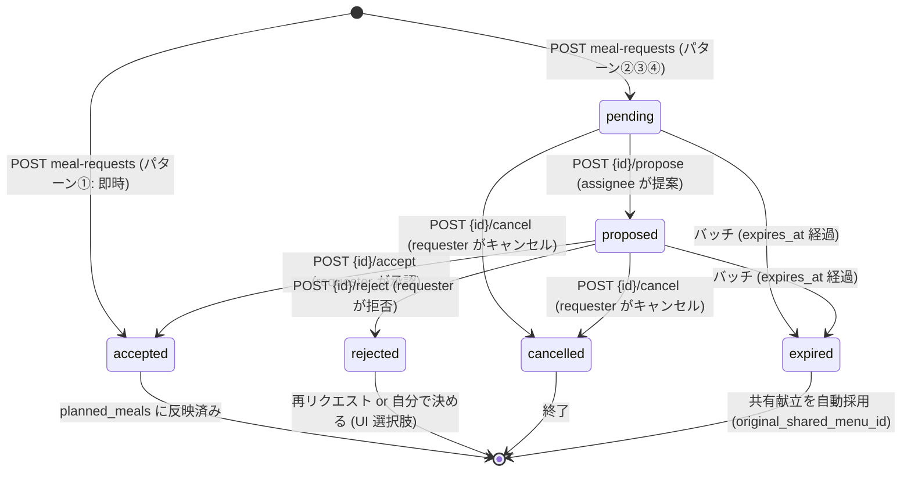
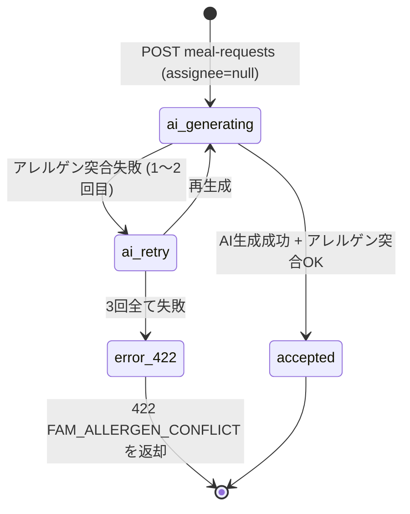
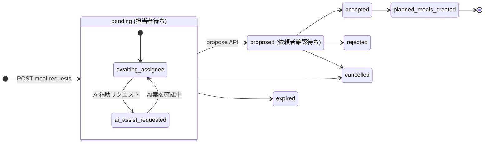
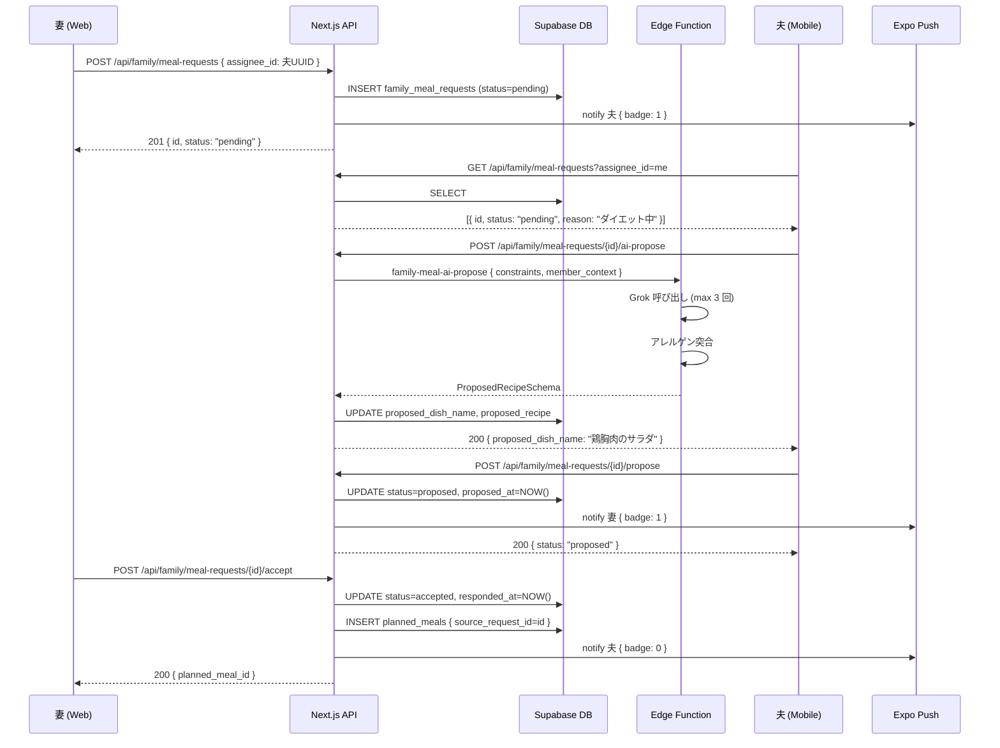
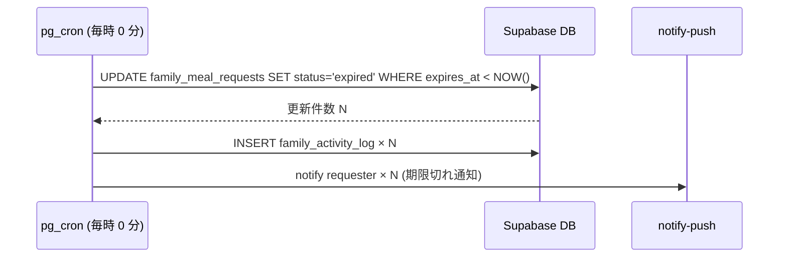

# family/ 個別献立リクエスト フロー詳細設計

## 1. 目的・スコープ

共有献立から個人離脱して代替メニューを作成する 4 パターンの状態機械を確定する。
状態遷移図・バッジ計算ロジック・アレルゲン突合仕様・Zod スキーマを含む。

## 2. 関連要件

- 要件 01 §5.5.5 共有献立から個人離脱・個別献立リクエストフロー
- 要件 01 §7.1.8 `family_meal_requests` DDL
- 100-scenarios.md B7-B13 / C3 / H1

## 3. 4 パターン詳細

### パターン①: 自己決定 (即時完了)

**アクター**: 任意メンバー (child 以外)
**フロー**:
1. 共有献立から「別メニューにする」を選択
2. 「自分で決める」を選択
3. 料理名 + レシピ (任意) を入力
4. `POST /api/family/meal-requests` with `self_decide_dish`
5. サーバー: `planned_meals` に即 INSERT (status = accepted)
6. `family_meal_requests` には記録しない (DB 節約)
   - `source_request_id = NULL`、`family_shared_menu_id = NULL`

**特徴**: 最速、非同期なし、他メンバーへの通知なし

---

### パターン②: AI 提案 (準即時)

**アクター**: 任意メンバー (child 以外)
**フロー**:
1. 「AI に提案してもらう」を選択
2. 本人の `allergies`, `diet_style`, `daily_calories` を自動取得
3. 追加制約 (任意) 入力
4. `POST /api/family/meal-requests` with `assignee_id = null, self_decide_dish = null`
5. サーバー: Edge Function `family-meal-ai-propose` を同期呼び出し (30s timeout)
6. 出力を Zod `ProposedRecipeSchema` でバリデーション + アレルゲン突合
7. OK なら `family_meal_requests.status = 'accepted'`, `proposed_by_ai = true`
8. `planned_meals` に INSERT

**特徴**: AI 生成するが requester が即承認 (confirm ステップなし)
アレルゲン突合失敗時は最大 3 回リトライ → 失敗で 422 返却

---

### パターン③: 家族メンバーへの依頼 (非同期)

**アクター**: 依頼者 (requester) + 担当者 (assignee)
**フロー**:
1. 「家族メンバーに頼む」を選択 + assignee 選択
2. 理由・制約入力
3. `POST /api/family/meal-requests` with `assignee_id = 担当者UUID`
4. `family_meal_requests` INSERT (status = 'pending')
5. assignee に Push 通知「○○からリクエスト」+ バッジ +1
6. assignee がリクエスト画面を開く
7. 「AI に提案させる」→ `ai-propose` 呼び出し or 「自分で考える」→ 手動入力
8. `POST /api/family/meal-requests/{id}/propose`
9. status: `pending` → `proposed`
10. requester に Push 通知「○○から提案が届きました」+ バッジ +1
11. requester が確認
    - 承認: `POST .../accept` → status: `proposed` → `accepted` → `planned_meals` INSERT
    - 拒否: `POST .../reject` → status: `proposed` → `rejected` (assignee に通知)
12. 拒否後: requester は同メニューで再リクエスト or 自分で決める

---

### パターン④: 子供代理 (親が代行)

**アクター**: owner / admin (requester として動作)
**対象**: child メンバー (`user_id IS NULL`)

**フロー**:
1. 親が「次男だけ別メニュー」を選択
2. target_member = 次男 (child)
3. パターン①〜③のいずれかを選択
4. `POST /api/family/meal-requests` with `target_member_id = 子供のmember.id`
5. `requester_id = 親のauth.uid()` で INSERT (RLS: `user_id IS NULL` の target は owner/admin のみ)
6. 以降はパターン①〜③と同じ
7. `planned_meals` は `proxy_family_member_id = 次男.id` の `user_daily_meals` に紐付け

**注意**: 子供は Push 通知を受け取らない (アカウントなし)。承認・拒否も親が代行。

---

## 4. 状態機械 (Mermaid State Diagram)

### 4.1 全パターン共通



### 4.2 パターン② AI 自動完了



### 4.3 パターン③ 家族依頼の詳細遷移



---

## 5. `expires_at` 自動 `expired` 遷移バッチ

### 5.1 バッチ仕様

- **実行タイミング**: pg_cron で毎時 0 分 (`0 * * * *`)
- **対象**: `status IN ('pending', 'proposed') AND expires_at < NOW()`
- **処理**:
  1. 対象レコードの `status = 'expired'` に UPDATE
  2. `expires_at` 計算: `LEAST(date - INTERVAL '24 hours', created_at + INTERVAL '3 days')`
  3. 期限切れ通知を requester に送信

```sql
-- pg_cron ジョブ定義 (cron_setup.sql)
SELECT cron.schedule(
  'expire_family_meal_requests',
  '0 * * * *',
  $$
    WITH expired AS (
      UPDATE family_meal_requests
      SET status = 'expired', updated_at = NOW()
      WHERE status IN ('pending', 'proposed')
        AND expires_at < NOW()
      RETURNING id, requester_id, family_group_id, date, meal_type,
                original_shared_menu_id
    )
    INSERT INTO family_activity_log (family_group_id, actor_id, action_type, target_id, details)
    SELECT family_group_id, NULL, 'meal_request_expired', id,
           jsonb_build_object('date', date, 'meal_type', meal_type)
    FROM expired;
  $$
);
```

### 5.2 期限切れ後の自動対応

`expired` になった場合、対象食事日に共有献立 (`original_shared_menu_id`) がある場合は
自動的に共有献立を採用 (UI で「共有献立に戻りました」表示)。
`original_shared_menu_id = NULL` の場合は「未設定」として当日を迎える。

### 5.3 通知文面

```
assignee が応答しなかったため、〇〇 (月曜 夕食) のリクエストが期限切れになりました。
自分で決めるか、別の方にリクエストしますか?

[自分で決める]  [再リクエスト]
```

---

## 6. アプリ内バッジ計算ロジック

### 6.1 バッジカウント定義

```typescript
// lib/family/badge.ts

async function getFamilyBadgeCount(userId: string): Promise<number> {
  const { data } = await supabase
    .from('family_meal_requests')
    .select('id, status, assignee_id, requester_id')
    .or(`assignee_id.eq.${userId},requester_id.eq.${userId}`)
    .in('status', ['pending', 'proposed']);

  const pendingForMe = data?.filter(
    (r) => r.assignee_id === userId && r.status === 'pending'
  ).length ?? 0;

  const proposedToMe = data?.filter(
    (r) => r.requester_id === userId && r.status === 'proposed'
  ).length ?? 0;

  return pendingForMe + proposedToMe;
}
```

### 6.2 iOS / Android バッジ

Push 通知ペイロードの `badge` フィールドに上記計算値を載せる。

```typescript
// Edge Function: notify-push
const badge = await getFamilyBadgeCount(targetUserId);
await expo.sendPushNotificationsAsync([{
  to: pushToken,
  title: '献立リクエストが届きました',
  body: '美咲からの依頼を確認してください',
  badge,                      // ← アイコンバッジ数
  data: {
    type: 'family.meal_request.received',
    request_id: requestId,
  }
}]);
```

### 6.3 既読処理

ユーザーが FAM-010 (リクエスト一覧) を表示した時点でバッジを減算。
実装: Server Component で `GET /api/family/meal-requests?assignee_id=me` 呼び出し時に
既読処理 API を同時実行。

---

## 7. アレルゲン突合ロジック

### 7.1 突合フロー

```
AI 生成レシピ (proposed_recipe.ingredients[].name)
  ↓
target_member の allergies リストと突合
  ↓
ヒット → 再生成フラグ (最大 3 回)
ヒットなし → OK、accepted
3 回全てヒット → 422 FAM_ALLERGEN_CONFLICT
```

### 7.2 突合アルゴリズム

```typescript
// supabase/functions/family-meal-ai-propose/allergen.ts

const ALLERGEN_KEYWORDS: Record<string, string[]> = {
  '卵': ['卵', 'たまご', 'エッグ', '卵白', '卵黄', 'マヨネーズ', 'オムレツ'],
  '牛乳': ['牛乳', 'ミルク', 'バター', 'チーズ', 'ヨーグルト', '生クリーム', 'ラクトース'],
  '小麦': ['小麦', 'パン', 'うどん', 'パスタ', '天ぷら粉', '薄力粉', 'グルテン'],
  '落花生': ['落花生', 'ピーナッツ', 'ピーナツ', 'ピーナッツバター'],
  // ... 食物アレルギー特定原材料 28 品目
};

function hasAllergenConflict(
  ingredients: string[],
  allergies: string[]
): boolean {
  for (const allergy of allergies) {
    const keywords = ALLERGEN_KEYWORDS[allergy] ?? [allergy];
    for (const ingredient of ingredients) {
      if (keywords.some((kw) => ingredient.includes(kw))) {
        return true;
      }
    }
  }
  return false;
}
```

### 7.3 再生成プロンプト調整

2 回目以降の再生成では system prompt に除外食材を追加:

```
以下の食材を含む料理は提案しないでください: {conflict_ingredients.join(', ')}
前回の提案 "{previous_dish_name}" は除外してください。
```

---

## 8. ProposedRecipeSchema (Zod)

```typescript
// types/domain/family.ts (または shared/schemas/meal-request.ts)

import { z } from 'zod';

export const IngredientSchema = z.object({
  name: z.string().min(1).max(100),
  amount: z.string().max(50),
  unit: z.string().max(20).optional(),
  notes: z.string().max(200).optional(),
});

export const RecipeStepSchema = z.object({
  step: z.number().int().min(1),
  description: z.string().min(1).max(500),
  time_minutes: z.number().int().min(0).optional(),
});

export const NutritionSchema = z.object({
  calories: z.number().min(0).max(5000),
  protein_g: z.number().min(0).max(500).optional(),
  fat_g: z.number().min(0).max(500).optional(),
  carb_g: z.number().min(0).max(500).optional(),
  sodium_mg: z.number().min(0).max(10000).optional(),
});

export const ProposedRecipeSchema = z.object({
  dish_name: z.string().min(1).max(200),
  description: z.string().max(500).optional(),
  cuisine_type: z.string().max(50).optional(),   // '和食', '洋食', '中華' 等
  cooking_time_min: z.number().int().min(0).max(300),
  difficulty: z.enum(['easy', 'medium', 'hard']),
  servings: z.number().min(1).max(20),
  ingredients: z.array(IngredientSchema).min(1).max(50),
  steps: z.array(RecipeStepSchema).min(1).max(30),
  nutrition_per_serving: NutritionSchema.optional(),
  allergen_free_of: z.array(z.string()).optional(),  // 除外済みアレルゲンリスト
  notes: z.string().max(500).optional(),
});

export type ProposedRecipe = z.infer<typeof ProposedRecipeSchema>;
```

### 8.1 スキーマ検証エラー時の処理

AI 出力が `ProposedRecipeSchema` に合わない場合 (構造不正、型ミスマッチ等):
- 軽微なエラー (number が string で来た等): `z.coerce.number()` で自動変換
- 構造エラー: 再生成カウントを消費せずにリトライ (pure format error)
- 3 回全て構造エラー: `502 FAM_AI_GENERATION_FAILED`

---

## 9. シーケンス図

### 9.1 パターン③ 詳細



### 9.2 expired バッチ



---

## 10. エラーハンドリング

| エラー | 原因 | 対応 |
|--------|------|------|
| `FAM_REQUEST_NOT_FOUND` | {id} が存在しないか他グループ | 404 返却 |
| `FAM_REQUEST_INVALID_STATUS` | 状態遷移が不正 (例: accepted → proposed) | 422 返却 |
| `FAM_PERMISSION_DENIED` | propose を requester が呼んだ場合等 | 403 返却 |
| `FAM_AI_GENERATION_FAILED` | Edge Function 3 回全て失敗 | 502 返却、UI でフォールバック案内 |
| `FAM_ALLERGEN_CONFLICT` | 3 回全てアレルゲン突合失敗 | 422 返却、手動入力を促す |
| `FAM_GROUP_NOT_ACTIVE` | frozen/archived グループへのリクエスト | 422 返却、FrozenGroupBanner 表示 |

---

## 11. テスト方針

### 11.1 Unit テスト (Vitest)

```typescript
// tests/unit/family/meal-request-state-machine.test.ts
describe('状態遷移バリデーション', () => {
  test('pending → proposed: OK');
  test('pending → accepted: NG (直接不可)');
  test('accepted → rejected: NG (終端状態)');
  test('expired → cancelled: NG (終端状態)');
});

// tests/unit/family/allergen.test.ts
describe('アレルゲン突合', () => {
  test('卵アレルギー + マヨネーズ含むレシピ → conflict');
  test('卵アレルギー + 鶏胸肉 → no conflict');
  test('3 回リトライ後も conflict → 422');
});
```

### 11.2 Integration テスト

- パターン③のフル遷移 (pending → proposed → accepted)
- expires_at バッチ (時刻モック使用)
- 子供代理リクエスト (target が child の場合の RLS)

### 11.3 E2E (Playwright)

- `tests/e2e/family/family-09-meal-request-pattern3.spec.ts`

## 12. 既存実装との関連

- `family-meal-ai-propose` Edge Function は新規実装
- `generate-menu-v5` の RAG パターン (system prompt, JSON mode) を流用
- `ProposedRecipeSchema` は既存 `03-operator-admin.md §5.5.6` のスキーマ定義に準拠

## 13. 未解決事項

| 項目 | 状態 |
|------|------|
| `expires_at` のデフォルト値をアプリ層 vs DB デフォルトのどちらで設定するか | アプリ層 (API Route) で `LEAST(date - 1 day, created_at + 3 days)` を計算して INSERT 時にセット |
| パターン②の AI 生成が 30s を超えた場合のタイムアウト UI | ローディングスピナー + 30s 後に「時間がかかっています」メッセージ表示 |
| アレルゲン 28 品目の全 KEYWORD マッピング | 実装時に食品安全委員会の表記に基づいてリスト化 |
