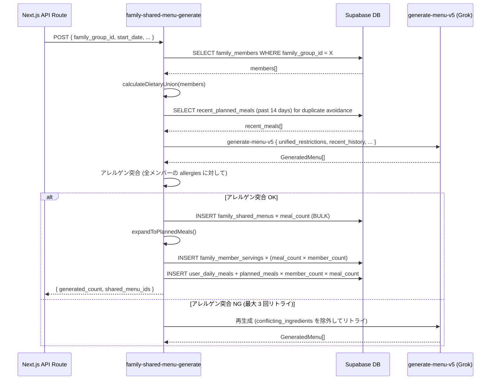
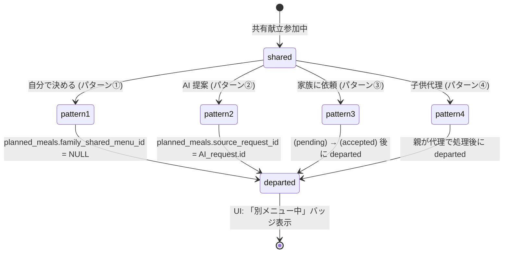

# family/ 共有献立 AI 生成エンジン 詳細設計

## 1. 目的・スコープ

家族全員の食事制約 (アレルギー・食スタイル・健康条件) の和集合を計算し、
全メンバーが安全に食べられる共有献立を AI 生成するエンジンを設計する。

スコープ外: 個別献立リクエストの AI 提案は `04-meal-request-flow.md` に記載。

## 2. 関連要件

- 要件 01 §5.5 F-FAM-005 共有献立
- 要件 01 §5.5.3 制約の和集合
- 要件 01 §8.4.1 `POST /api/family/shared-menus/generate`
- 要件 01 §8.6.9 `family-shared-menu-generate` Edge Function
- 100-scenarios.md B6 / H1

## 3. dietary_restrictions 和集合計算

### 3.1 入力データ

```typescript
// family_members テーブルの食事制約列
interface MemberDietaryProfile {
  id: string;
  name: string;
  allergies: string[];          // ['卵', '牛乳'] など
  dislikes: string[];           // ['セロリ', 'レバー'] など
  diet_style: DietStyle;        // 'omnivore' | 'vegetarian' | 'vegan' | etc.
  health_conditions: string[];  // ['high_blood_pressure', 'diabetes'] など
  medications: string[];        // 服用薬
  daily_calories: number | null;
  spice_tolerance: SpiceTolerance;
}
```

注: 要件・DDL では `allergies` 列が food restriction の主体。`dietary_restrictions` は
設計書内での呼称として `allergies + diet_style + health_conditions` の和集合を指す。

### 3.2 和集合計算アルゴリズム

```typescript
// lib/family/dietary-union.ts

interface UnifiedRestrictions {
  // アレルゲン: 誰か 1 人でも含んでいれば全員に適用
  allergens: string[];
  // 嫌いな食べ物: 全員共通のものだけ除外 (個人の好みは共有献立では除外しない)
  // → 設計判断: 全員嫌いなもののみ除外 (1 人が嫌いなだけでは除外しない)
  common_dislikes: string[];
  // 食スタイル: 最も制限が厳しいものを採用
  // vegan > vegetarian > pescatarian > omnivore
  strictest_diet_style: DietStyle;
  // 塩分制限: 誰か 1 人でも high_blood_pressure なら適用
  low_sodium_required: boolean;
  // 糖質制限: 誰か 1 人でも diabetes なら適用
  low_carb_required: boolean;
  // カロリー上限: 全メンバーの最小値 (最も制限が厳しいメンバーに合わせる)
  max_calories_per_serving: number | null;
  // 辛さ: 全メンバーの最も mild なレベルを採用
  max_spice_level: SpiceTolerance;
}

function calculateDietaryUnion(members: MemberDietaryProfile[]): UnifiedRestrictions {
  const activeMembers = members.filter((m) => m.role !== 'child' || true); // 全員考慮

  // アレルゲン: Union
  const allergens = [...new Set(activeMembers.flatMap((m) => m.allergies))];

  // 嫌いな食べ物: Intersection (全員が嫌いなもの)
  const common_dislikes = activeMembers
    .map((m) => new Set(m.dislikes))
    .reduce((acc, set) => new Set([...acc].filter((x) => set.has(x))), new Set(activeMembers[0]?.dislikes ?? []));

  // 食スタイル: 最も制限が厳しいものを採用
  const DIET_RANK: Record<DietStyle, number> = {
    omnivore: 0, pescatarian: 1, vegetarian: 2, vegan: 3,
    keto: 1, halal: 2, kosher: 2,
  };
  const strictest_diet_style = activeMembers.reduce((acc, m) =>
    DIET_RANK[m.diet_style] > DIET_RANK[acc] ? m.diet_style : acc,
    'omnivore' as DietStyle
  );

  // 健康条件
  const low_sodium_required = activeMembers.some((m) =>
    m.health_conditions.includes('high_blood_pressure')
  );
  const low_carb_required = activeMembers.some((m) =>
    m.health_conditions.includes('diabetes')
  );

  // カロリー: 最小値 (null は制限なし)
  const calorie_limits = activeMembers
    .map((m) => m.daily_calories)
    .filter((c): c is number => c !== null);
  const max_calories_per_serving = calorie_limits.length > 0
    ? Math.min(...calorie_limits) / 3  // 1 食あたりに換算
    : null;

  // 辛さ: 最も mild
  const SPICE_RANK: Record<SpiceTolerance, number> = { mild: 0, medium: 1, spicy: 2 };
  const max_spice_level = activeMembers.reduce((acc, m) =>
    SPICE_RANK[m.spice_tolerance] < SPICE_RANK[acc] ? m.spice_tolerance : acc,
    'spicy' as SpiceTolerance
  );

  return {
    allergens,
    common_dislikes: [...common_dislikes],
    strictest_diet_style,
    low_sodium_required,
    low_carb_required,
    max_calories_per_serving,
    max_spice_level,
  };
}
```

---

## 4. `family-shared-menu-generate` Edge Function

### 4.1 エントリポイント

```
supabase/functions/family-shared-menu-generate/index.ts
```

既存 `generate-menu-v5` を **家族対応モード** で呼び出すラッパー。
独立した Edge Function として実装し、内部で `generate-menu-v5` の生成ロジックを再利用する。

### 4.2 入力スキーマ

```typescript
// supabase/functions/family-shared-menu-generate/types.ts

import { z } from 'zod';

export const FamilySharedMenuGenerateInputSchema = z.object({
  family_group_id: z.string().uuid(),
  start_date: z.string().date(),           // ISO: '2026-05-12'
  end_date: z.string().date(),             // ISO: '2026-05-18'
  member_ids: z.array(z.string().uuid()),  // 共有対象メンバー
  constraints: z.object({
    use_fridge_first: z.boolean().default(false),
    max_cooking_time_min: z.number().int().min(10).max(120).optional(),
    cuisine_preferences: z.array(z.string()).default([]),
    budget_per_meal_yen: z.number().int().min(100).max(5000).optional(),
  }).default({}),
  meal_types: z.array(
    z.enum(['breakfast', 'lunch', 'dinner', 'snack'])
  ).default(['breakfast', 'lunch', 'dinner']),
});

export type FamilySharedMenuGenerateInput = z.infer<typeof FamilySharedMenuGenerateInputSchema>;
```

### 4.3 処理フロー



### 4.4 `generate-menu-v5` への入力ラッパー

```typescript
// supabase/functions/family-shared-menu-generate/wrapper.ts

interface GenerateMenuV5FamilyInput {
  // generate-menu-v5 標準入力
  start_date: string;
  end_date: string;
  meal_count: number;
  meal_types: string[];
  // 家族固有の追加入力
  unified_restrictions: {
    allergens: string[];
    diet_style: string;
    low_sodium: boolean;
    low_carb: boolean;
    max_calories_per_serving: number | null;
    max_spice: string;
  };
  family_recent_history: string[];   // 重複回避: 最近 14 日の料理名
  family_context: {
    member_count: number;
    age_groups: string[];            // ['adult', 'child_school_age', 'toddler'] 等
    cooking_time_max: number | null;
    cuisine_preferences: string[];
  };
}
```

システムプロンプト追加指示:
```
あなたは家族全員が食べられる安全で美味しい献立を作る専門家です。
以下の制約は家族の誰かが必要としているため、全員の料理に適用してください:
- 除外アレルゲン: {allergens.join(', ')}
- 食事スタイル: {diet_style}
- 塩分制限: {low_sodium ? '必須 (1 食 2g 以下)' : 'なし'}
- 糖質制限: {low_carb ? '必須 (1 食 30g 以下)' : 'なし'}
```

---

## 5. 出力後の `planned_meals` 自動展開

### 5.1 展開ロジック

共有献立生成後、メンバーごとの `user_daily_meals` + `planned_meals` を自動作成する。

```typescript
// supabase/functions/family-shared-menu-generate/expand.ts

async function expandToPlannedMeals(
  sharedMenus: FamilySharedMenu[],
  members: FamilyMember[],
  supabase: SupabaseClient
): Promise<void> {
  const plannedMealsInserts: PlannedMealInsert[] = [];
  const servingsInserts: MemberServingInsert[] = [];

  for (const menu of sharedMenus) {
    // 各メンバーに按分 (均等配分、後から手動変更可)
    const servingsPerMember = menu.servings_total / members.length;

    for (const member of members) {
      // child (user_id IS NULL) は proxy_family_member_id 経由
      const userId = member.user_id;
      if (!userId) continue;  // child の user_daily_meals は親が別途作成

      // user_daily_meals が存在しない場合は INSERT or UPSERT
      const dailyMealId = await getOrCreateDailyMeal(
        userId, menu.date, supabase
      );

      plannedMealsInserts.push({
        daily_meal_id: dailyMealId,
        meal_type: menu.meal_type,
        dish_name: menu.dish_name,
        family_shared_menu_id: menu.id,
        source_request_id: null,
      });

      servingsInserts.push({
        family_shared_menu_id: menu.id,
        family_member_id: member.id,
        servings: servingsPerMember,
      });
    }
  }

  // Bulk INSERT
  await supabase.from('planned_meals').insert(plannedMealsInserts);
  await supabase.from('family_member_servings').insert(servingsInserts);
}
```

### 5.2 child メンバーの展開

child (`user_id IS NULL`) の場合:
1. child 用の `user_daily_meals` は `proxy_family_member_id = child.id` で作成
2. INSERT は service_role 経由 (RLS バイパス)
3. `planned_meals` の所有権は child の代理 `user_daily_meals.id` 経由

---

## 6. メンバー個別離脱時の分岐

共有献立が生成された後に特定メンバーが離脱する際の処理。

### 6.1 離脱パターン分岐



### 6.2 離脱後の共有献立 UI

`planned_meals.family_shared_menu_id` = NULL の場合:
- 共有献立カレンダーでそのメンバーは「別メニュー中」（薄いグレー + アイコン）
- 按分の `family_member_servings.servings` は 0 に更新

---

## 7. 共有献立カレンダー UI

### 7.1 週間カレンダー構造

```
       月    火    水    木    金    土    日
朝   オート  ---   ---   ---   ---   ---   ---
昼   弁当  親子丼  ---   ---   ---   ---   ---
夜   カレー 炒め物  ---   ---   ---   ---   ---
```

各セルに料理名 + 参加メンバーのアバター一覧を表示。
「別メニュー中」メンバーは薄いアバターで表示。

### 7.2 インタラクション

| 操作 | 動作 |
|------|------|
| セルをタップ | 献立詳細シート (按分情報 / 個別離脱状況) |
| 「AI 生成」ボタン | 生成モーダル表示 |
| セル長押し | 「編集」「削除」「このメンバーだけ別メニュー」 |
| 「このメンバーだけ別メニュー」 | MealRequestModal 表示 (`04-meal-request-flow.md`) |

### 7.3 Server Component / Client Component 分離

```
SharedMenuCalendar (Server Component)
  ├── 週のデータを fetch (SSR)
  └── SharedMenuWeekView (Client Component, "use client")
        ├── インタラクティブなセル操作
        ├── MealRequestModal
        └── Realtime 更新受信 (useEffect)
```

---

## 8. エラーハンドリング

| エラー | 原因 | 対応 |
|--------|------|------|
| `FAMILY_AI_GENERATION_FAILED` | Edge Function 3 回リトライ後失敗 | 502 返却, UI で「後で試してください」 |
| `FAMILY_ALLERGEN_CONFLICT` | 全員制約を満たすメニューが生成不可 | 422, 制約を緩める提案 UI 表示 |
| Edge Function タイムアウト (30s) | AI 生成に時間がかかりすぎ | 504, ポーリング or Realtime で完了通知 |
| `FAMILY_GROUP_NOT_ACTIVE` | frozen/archived グループ | 422 |

### 8.1 長時間実行への対応

共有献立生成 (21 食 × family 4 人 = 84 件 planned_meals) は 30s を超える可能性がある。

**対応方針**:
1. Edge Function を非同期ジョブとして起動し、即座に `job_id` を返す
2. Supabase Realtime チャンネル `family_group_{id}_menu_generation` を購読
3. 生成完了時に `INSERT family_activity_log { action_type: 'shared_menu_generated' }` → Realtime trigger で UI 更新

---

## 9. テスト方針

### 9.1 Unit テスト (Vitest)

```typescript
// tests/unit/family/dietary-union.test.ts
describe('calculateDietaryUnion', () => {
  test('2 人のアレルゲンを union する');
  test('1 人が vegan の場合: strictest_diet_style = vegan');
  test('全員嫌いなもの以外は common_dislikes に含めない');
  test('高血圧あり → low_sodium_required = true');
  test('全メンバーのカロリー上限の最小値');
});
```

### 9.2 Integration テスト

- 4 人家族のダミーデータで和集合計算 → Edge Function 呼び出し → DB 展開
- child メンバーを含む場合の `user_daily_meals` 作成
- アレルゲン突合で 2 回失敗 → 3 回目成功

### 9.3 E2E (Playwright)

- `tests/e2e/family/family-07-shared-menu-generate.spec.ts`
- 4 人家族で週間献立 AI 生成 → カレンダー表示確認

## 10. 既存実装との関連

- `generate-menu-v5` Edge Function は保持。本 Function はラッパーとして新規作成。
- `dataset_recipes`: `family_shared_menus.recipe_id` から参照 (任意)
- `knowledge-gpt` の RAG 設計: system prompt 構造を流用

## 11. 未解決事項

| 項目 | 状態 |
|------|------|
| `generate-menu-v5` の family 対応モード追加 or 別 Function か | 別 Function (`family-shared-menu-generate`) で分離を選択。理由: family 固有の多メンバー展開ロジックが複雑なため |
| 共有献立生成の非同期化 (30s 超え問題) | Phase 2 で async job + Realtime 通知に移行。Phase 1 は同期で 30s 以内を目標 |
| `common_dislikes` の計算方式 | 全員嫌いなもののみ除外 (AND 条件)。OR 条件 (誰か 1 人でも嫌い) にするかは要件確認が必要 |
| 食材按分のデフォルト計算式 (年齢・体重考慮) | Phase 2 で AI 推薦。Phase 1 は均等配分 |
