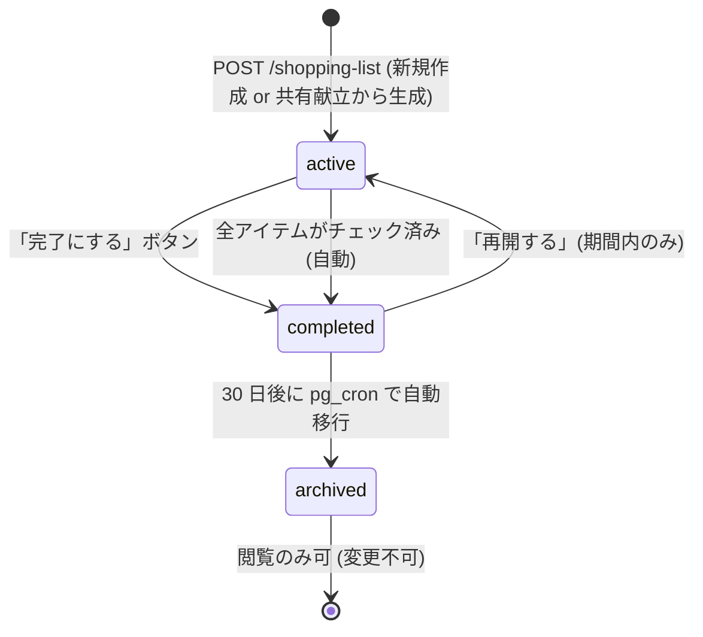
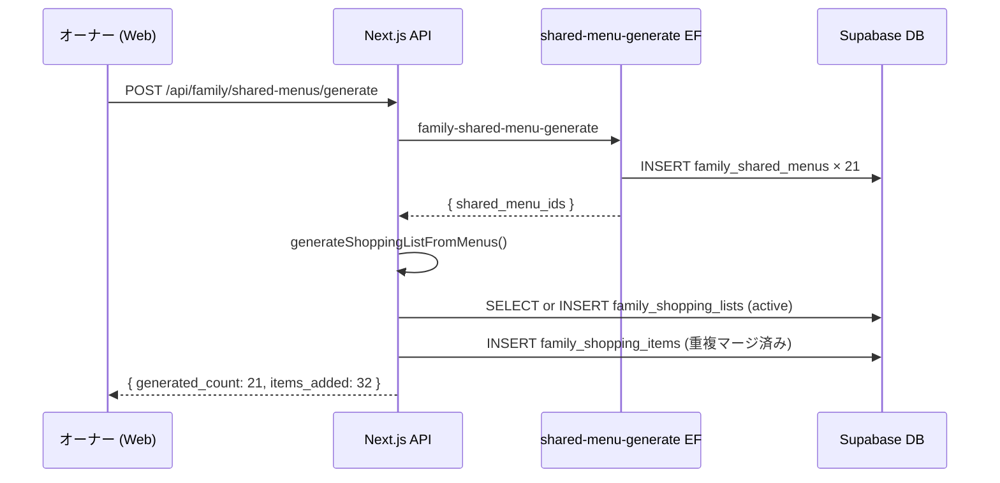
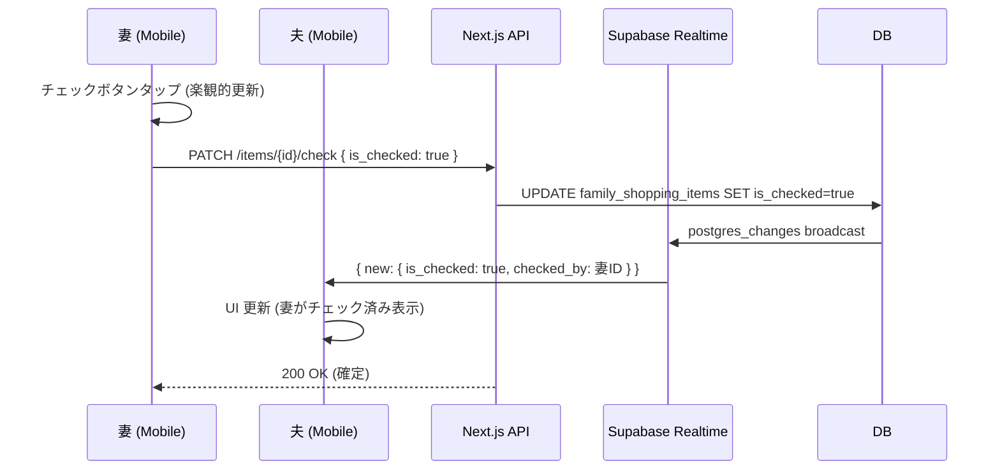

# family/ 共有買い物リスト 詳細設計

## 1. 目的・スコープ

家族の共有買い物リストの lifecycle 管理・自動生成・リアルタイム同期・印刷対応を確定する。

## 2. 関連要件

- 要件 01 §5.6 F-FAM-006 共有買い物リスト
- 要件 01 §7.1.7 `family_shopping_lists` / `family_shopping_items` DDL
- 100-scenarios.md B11 / B12

## 3. lifecycle (active → completed → archived)

### 3.1 状態定義

| 状態 | 説明 | 遷移条件 |
|------|------|---------|
| `active` | 現在使用中のリスト。1 グループに 1 件のみ | 新規作成時 |
| `completed` | 買い物完了。全アイテムがチェック済み or 手動完了 | 手動「完了」ボタン or 全チェック自動 |
| `archived` | 長期保存用。完了後 30 日で自動移行 | pg_cron バッチ or 手動 |

### 3.2 Partial UNIQUE INDEX

```sql
-- 1 グループあたり active なリストは 1 件のみ
CREATE UNIQUE INDEX idx_family_shopping_lists_active
  ON family_shopping_lists(family_group_id)
  WHERE status = 'active';
```

これにより、重複 active 作成を DB レベルで防止 (409 `UNIQUE_VIOLATION`)。

### 3.3 状態遷移図



### 3.4 pg_cron バッチ (completed → archived)

```sql
-- cron_setup.sql に追加
SELECT cron.schedule(
  'archive_family_shopping_lists',
  '0 2 * * *',   -- 毎日 2 時
  $$
    UPDATE family_shopping_lists
    SET status = 'archived', updated_at = NOW()
    WHERE status = 'completed'
      AND updated_at < NOW() - INTERVAL '30 days';
  $$
);
```

---

## 4. 共有献立からの自動生成

### 4.1 生成トリガー

1. **共有献立生成後の自動生成**: `POST /api/family/shared-menus/generate` 完了後、
   自動的に対応期間の買い物リストを生成 (オプション、デフォルト ON)
2. **手動再生成**: `POST /api/family/shopping-list/generate` で任意タイミングで実行

### 4.2 食材抽出ロジック

```typescript
// lib/family/shopping-list-generator.ts

async function generateShoppingListFromMenus(
  familyGroupId: string,
  dateFrom: string,
  dateTo: string,
  supabase: SupabaseClient
): Promise<FamilyShoppingItem[]> {
  // 指定期間の共有献立を取得
  const { data: menus } = await supabase
    .from('family_shared_menus')
    .select('id, dish_name, recipe_id, servings_total')
    .eq('family_group_id', familyGroupId)
    .gte('date', dateFrom)
    .lte('date', dateTo);

  const items: FamilyShoppingItem[] = [];

  for (const menu of menus ?? []) {
    if (menu.recipe_id) {
      // dataset_recipes から食材を取得
      const { data: recipe } = await supabase
        .from('dataset_recipes')
        .select('ingredients')
        .eq('id', menu.recipe_id)
        .single();

      if (recipe?.ingredients) {
        for (const ingredient of recipe.ingredients) {
          items.push({
            ingredient_name: ingredient.name,
            quantity: ingredient.amount * menu.servings_total,
            unit: ingredient.unit,
            category: ingredient.category ?? categorizeIngredient(ingredient.name),
          });
        }
      }
    } else {
      // recipe_id なし: dish_name のみ (食材自動推測は Phase 2)
      items.push({
        ingredient_name: menu.dish_name,
        quantity: null,
        unit: null,
        category: '未分類',
      });
    }
  }

  // 重複食材をマージ (同名 + 同単位)
  return mergeIngredients(items);
}

function mergeIngredients(items: FamilyShoppingItem[]): FamilyShoppingItem[] {
  const merged = new Map<string, FamilyShoppingItem>();
  for (const item of items) {
    const key = `${item.ingredient_name}::${item.unit ?? ''}`;
    if (merged.has(key)) {
      const existing = merged.get(key)!;
      existing.quantity = (existing.quantity ?? 0) + (item.quantity ?? 0);
    } else {
      merged.set(key, { ...item });
    }
  }
  return [...merged.values()];
}
```

### 4.3 カテゴリ自動分類

```typescript
// lib/family/ingredient-categorizer.ts

const CATEGORY_KEYWORDS: Record<string, string[]> = {
  '肉': ['鶏', '豚', '牛', '羊', '鴨', 'ひき肉', 'ソーセージ', 'ベーコン'],
  '魚介': ['鮭', '鯖', 'タラ', 'エビ', 'イカ', 'ホタテ', '刺身'],
  '野菜': ['にんじん', '玉ねぎ', 'じゃがいも', 'トマト', 'キャベツ', 'ほうれん草'],
  '乳製品': ['牛乳', 'チーズ', 'バター', 'ヨーグルト', '生クリーム'],
  '調味料': ['醤油', '塩', '砂糖', 'みりん', '酒', '味噌', 'ケチャップ'],
  '穀物': ['米', 'パスタ', 'うどん', '小麦粉', 'パン粉'],
  '豆腐・大豆': ['豆腐', '油揚げ', '納豆', '大豆', '豆乳'],
};

function categorizeIngredient(name: string): string {
  for (const [category, keywords] of Object.entries(CATEGORY_KEYWORDS)) {
    if (keywords.some((kw) => name.includes(kw))) {
      return category;
    }
  }
  return 'その他';
}
```

---

## 5. 個別献立リクエスト accept 時の材料追加

### 5.1 accept フックで買い物リストに追加

`POST /api/family/meal-requests/{id}/accept` の実行後:

```typescript
// lib/family/shopping-list-hooks.ts

async function onMealRequestAccepted(
  request: FamilyMealRequest,
  supabase: SupabaseClient
): Promise<void> {
  // 1. active な買い物リストを取得
  const { data: activeList } = await supabase
    .from('family_shopping_lists')
    .select('id')
    .eq('family_group_id', request.family_group_id)
    .eq('status', 'active')
    .single();

  if (!activeList) return;  // active リストがなければスキップ

  // 2. proposed_recipe から食材を抽出
  const recipe = request.proposed_recipe as ProposedRecipe;
  if (!recipe?.ingredients) return;

  // 3. 食材を買い物リストに追加
  const newItems = recipe.ingredients.map((ing) => ({
    family_shopping_list_id: activeList.id,
    ingredient_name: ing.name,
    quantity: ing.amount ? parseFloat(ing.amount) : null,
    unit: ing.unit ?? null,
    category: categorizeIngredient(ing.name),
    added_by: request.requester_id,
    is_checked: false,
  }));

  await supabase.from('family_shopping_items').insert(newItems);
}
```

---

## 6. 担当者 (assignee_id) 設定

### 6.1 担当者割当 UI

各アイテムに「担当: 未設定」ドロップダウン。
グループメンバー一覧から選択 (child は選択不可)。

### 6.2 担当フィルタ機能

「自分が担当」タブでフィルタ表示:

```sql
SELECT * FROM family_shopping_items
WHERE family_shopping_list_id = $1
  AND assignee_id = auth.uid()
  AND is_checked = FALSE;
```

---

## 7. チェック状態のリアルタイム同期

### 7.1 Supabase Realtime チャンネル

```typescript
// apps/mobile/src/app/family/shopping-list.tsx (または Web 版)

const channel = supabase
  .channel(`shopping_list_${listId}`)
  .on(
    'postgres_changes',
    {
      event: 'UPDATE',
      schema: 'public',
      table: 'family_shopping_items',
      filter: `family_shopping_list_id=eq.${listId}`,
    },
    (payload) => {
      // 楽観的更新と競合した場合: サーバーの値を優先
      setItems((prev) =>
        prev.map((item) =>
          item.id === payload.new.id ? { ...item, ...payload.new } : item
        )
      );
    }
  )
  .subscribe();
```

### 7.2 楽観的更新

チェックボタンタップ時:
1. 即座に UI を更新 (楽観的更新)
2. `PATCH /api/family/shopping-list/{id}/items/{itemId}/check` 呼び出し
3. サーバー成功: 確定
4. サーバー失敗 (409 等): ロールバック + エラートースト

### 7.3 切断時の再接続

```typescript
channel.on('system', { event: 'disconnected' }, () => {
  setRealtimeConnected(false);
  // バナー: 「リアルタイム同期が切れています。再接続中...」
});

channel.on('system', { event: 'connected' }, () => {
  setRealtimeConnected(true);
  // 再接続後: 最新データを fetch して同期
  refetchItems();
});
```

---

## 8. 印刷対応 (`@media print`)

### 8.1 CSS

```css
/* app/(family)/[id]/shopping-list/print.css */

@media print {
  /* ナビゲーション・サイドバー・ボタン類を非表示 */
  nav, aside, .no-print, button, .fab { display: none !important; }

  /* ページレイアウト */
  body { font-size: 12pt; }
  .shopping-list-container { max-width: 100%; }

  /* チェック済みアイテムをグレーアウト */
  .shopping-item.checked {
    color: #999;
    text-decoration: line-through;
  }

  /* カテゴリ別に区切り線 */
  .shopping-category-group {
    break-inside: avoid;
    margin-bottom: 1rem;
  }

  /* ヘッダー情報 */
  .print-header {
    border-bottom: 2pt solid #333;
    margin-bottom: 1rem;
    padding-bottom: 0.5rem;
  }

  /* チェックボックスを印刷用 □ に変換 */
  .shopping-item::before {
    content: '☐ ';
    font-size: 14pt;
  }
  .shopping-item.checked::before {
    content: '☑ ';
  }
}
```

### 8.2 印刷ヘッダー

```
田中家 買い物リスト
2026/05/12 (月) 〜 05/18 (日)
印刷日: 2026/05/07

─ 肉類 ──────────────────────────
□ 鶏胸肉       600g    [太郎]
□ 豚バラ       300g
...
```

---

## 9. シーケンス図

### 9.1 共有献立からの自動生成



### 9.2 Realtime チェック同期



---

## 10. エラーハンドリング

| エラー | 原因 | 対応 |
|--------|------|------|
| `FAM_SHOPPING_LIST_NOT_FOUND` | active リストが存在しない | 新規作成を促す |
| `UNIQUE_VIOLATION` (active index) | 同時 active 作成競合 | 409, 既存 active リストを使用するよう案内 |
| Realtime 切断 | ネットワーク断 | バナー表示 + ポーリングフォールバック (5s interval) |
| チェック API タイムアウト | ネットワーク遅延 | 楽観的更新をキープ、再試行 3 回後にロールバック |

---

## 11. テスト方針

### 11.1 Unit テスト (Vitest)

主要テストケース:

1. `it('extracts ingredients from dataset_recipes when recipe_id is provided')`
2. `it('merges duplicate ingredients with same name and unit')`
3. `it('keeps ingredients with different units as separate items')`
4. `it('categorizes 鶏胸肉 as 肉')`
5. `it('categorizes unknown ingredient as その他')`
6. `it('returns empty array when menus have no dishes')`

```typescript
// tests/unit/family/shopping-list-generator.test.ts
import { describe, it, expect, vi } from 'vitest';
import {
  generateShoppingListFromMenus,
  categorizeIngredient,
} from '@/lib/family/shopping-list-generator';

const mockMenusWithRecipe = [
  {
    id: 'menu-001',
    dish_name: '鶏の照り焼き',
    recipe_id: 'recipe-001',
    recipe: {
      ingredients: [
        { name: '鶏胸肉', quantity: 200, unit: 'g' },
        { name: '醤油', quantity: 30, unit: 'ml' },
        { name: 'みりん', quantity: 20, unit: 'ml' },
      ],
    },
  },
  {
    id: 'menu-002',
    dish_name: '鶏の唐揚げ',
    recipe_id: 'recipe-002',
    recipe: {
      ingredients: [
        { name: '鶏胸肉', quantity: 300, unit: 'g' }, // 重複
        { name: '片栗粉', quantity: 50, unit: 'g' },
      ],
    },
  },
];

describe('generateShoppingListFromMenus', () => {
  it('extracts ingredients from dataset_recipes when recipe_id is provided', () => {
    const items = generateShoppingListFromMenus(mockMenusWithRecipe);
    const ingredientNames = items.map((i) => i.ingredient_name);
    expect(ingredientNames).toContain('鶏胸肉');
    expect(ingredientNames).toContain('醤油');
    expect(ingredientNames).toContain('片栗粉');
  });

  it('merges duplicate ingredients with same name and unit', () => {
    const items = generateShoppingListFromMenus(mockMenusWithRecipe);
    const chicken = items.filter((i) => i.ingredient_name === '鶏胸肉');
    expect(chicken).toHaveLength(1); // 200g + 300g = 500g にマージ
    expect(chicken[0].quantity).toBe(500);
    expect(chicken[0].unit).toBe('g');
  });

  it('keeps ingredients with different units as separate items', () => {
    const menus = [
      {
        recipe: {
          ingredients: [
            { name: '塩', quantity: 5, unit: 'g' },
            { name: '塩', quantity: 1, unit: '小さじ' }, // 単位が違う
          ],
        },
      },
    ];
    const items = generateShoppingListFromMenus(menus);
    const salt = items.filter((i) => i.ingredient_name === '塩');
    expect(salt).toHaveLength(2); // 別アイテムとして保持
  });

  it('returns empty array when menus have no dishes', () => {
    expect(generateShoppingListFromMenus([])).toHaveLength(0);
  });
});

describe('categorizeIngredient', () => {
  it('categorizes 鶏胸肉 as 肉', () => {
    expect(categorizeIngredient('鶏胸肉')).toBe('肉');
  });

  it('categorizes キャベツ as 野菜', () => {
    expect(categorizeIngredient('キャベツ')).toBe('野菜');
  });

  it('categorizes 牛乳 as 乳製品', () => {
    expect(categorizeIngredient('牛乳')).toBe('乳製品');
  });

  it('categorizes unknown ingredient as その他', () => {
    expect(categorizeIngredient('zzz未知の食材zzz')).toBe('その他');
  });
});
```

### 11.2 Integration テスト

主要テストケース:

1. `it('returns 409 when second active shopping list is created for same group')`
2. `it('batch transitions completed lists to archived after 7 days')`
3. `it('generates shopping list items from family shared menus')`

```typescript
// tests/integration/family/shopping-list.integration.test.ts
describe('買い物リスト Integration', () => {
  it('returns 409 when second active shopping list is created for same group', async () => {
    const owner = await createTestUser('user');
    const group = await createFamilyGroupInDB(supabaseAdmin, {
      owner_id: owner.id,
    });

    // 1 件目: OK
    const res1 = await fetch(`${BASE_URL}/api/family/shopping-lists`, {
      method: 'POST',
      headers: { Authorization: `Bearer ${ownerToken}`, 'Content-Type': 'application/json' },
      body: JSON.stringify({
        family_group_id: group.id,
        start_date: '2026-06-01',
        end_date: '2026-06-07',
      }),
    });
    expect(res1.status).toBe(201);

    // 2 件目: 409
    const res2 = await fetch(`${BASE_URL}/api/family/shopping-lists`, {
      method: 'POST',
      headers: { Authorization: `Bearer ${ownerToken}`, 'Content-Type': 'application/json' },
      body: JSON.stringify({
        family_group_id: group.id,
        start_date: '2026-06-08',
        end_date: '2026-06-14',
      }),
    });
    expect(res2.status).toBe(409);
  });

  it('batch transitions completed lists to archived after 7 days', async () => {
    const owner = await createTestUser('user');
    const group = await createFamilyGroupInDB(supabaseAdmin, { owner_id: owner.id });

    // completed 状態で 7 日以上前のリストを作成
    const oldDate = new Date(Date.now() - 8 * 24 * 60 * 60 * 1000);
    await supabaseAdmin.from('family_shopping_lists').insert({
      family_group_id: group.id,
      start_date: '2026-01-01',
      end_date: '2026-01-07',
      status: 'completed',
      updated_at: oldDate.toISOString(),
    });

    const { archiveCompletedLists } = await import(
      '@/lib/family/shopping-list-batch'
    );
    await archiveCompletedLists(supabaseAdmin);

    const { data } = await supabaseAdmin
      .from('family_shopping_lists')
      .select('status')
      .eq('family_group_id', group.id)
      .single();
    expect(data?.status).toBe('archived');
  });
});
```

### 11.3 E2E (Playwright)

主要テストケース:

1. `test('Realtime: wife checks item, husband sees update within 5s')`
2. `test('generates shopping list items from this week shared menus')`

```typescript
// tests/e2e/family/family-06-shopping-realtime.spec.ts
import { test, expect } from '@playwright/test';

test('Realtime: wife checks item, husband sees update within 5s', async ({
  browser,
}) => {
  // それぞれ別の認証コンテキストを作成
  const wifeContext = await browser.newContext({
    storageState: './tests/e2e/fixtures/wife-auth.json',
  });
  const husbandContext = await browser.newContext({
    storageState: './tests/e2e/fixtures/husband-auth.json',
  });

  const wifePage = await wifeContext.newPage();
  const husbandPage = await husbandContext.newPage();

  // 同じ買い物リストページを両方で開く
  await Promise.all([
    wifePage.goto('/family/shopping-list'),
    husbandPage.goto('/family/shopping-list'),
  ]);
  await Promise.all([
    wifePage.waitForLoadState('networkidle'),
    husbandPage.waitForLoadState('networkidle'),
  ]);

  // 妻がアイテムをチェック
  const firstItem = wifePage.locator('[data-testid=shopping-item]').first();
  await firstItem.locator('[data-testid=item-checkbox]').click();

  // 夫の画面で反映を確認 (Supabase Realtime)
  await expect(
    husbandPage.locator('[data-testid=shopping-item]').first()
      .locator('[data-testid=item-checkbox]'),
  ).toBeChecked({ timeout: 5_000 });

  await wifeContext.close();
  await husbandContext.close();
});

## 12. 既存実装との関連

- 既存 `shopping_lists` (個人) テーブルは保持。本設計の `family_shopping_lists` は別テーブル。
- `dataset_recipes.ingredients` の構造に依存 (recipe_id 経由の食材抽出)

## 13. 未解決事項

| 項目 | 状態 |
|------|------|
| `dataset_recipes.ingredients` の JSONB スキーマ確定 | 既存 Edge Function の利用から逆算して確定必要 |
| 食材の AI 自動推測 (recipe_id なし時) | Phase 2 で AI に食材リスト推測を依頼 |
| 共有献立から生成時の「既存アイテムとの重複チェック」の精度 | 名称の表記揺れ (「鶏肉」vs「鶏胸肉」) は Phase 2 で AI 正規化 |
| 買い物リスト履歴の保存期間 | archived の物理削除は 90 日後 (家族グループ設定で変更可) → Phase 2 |
