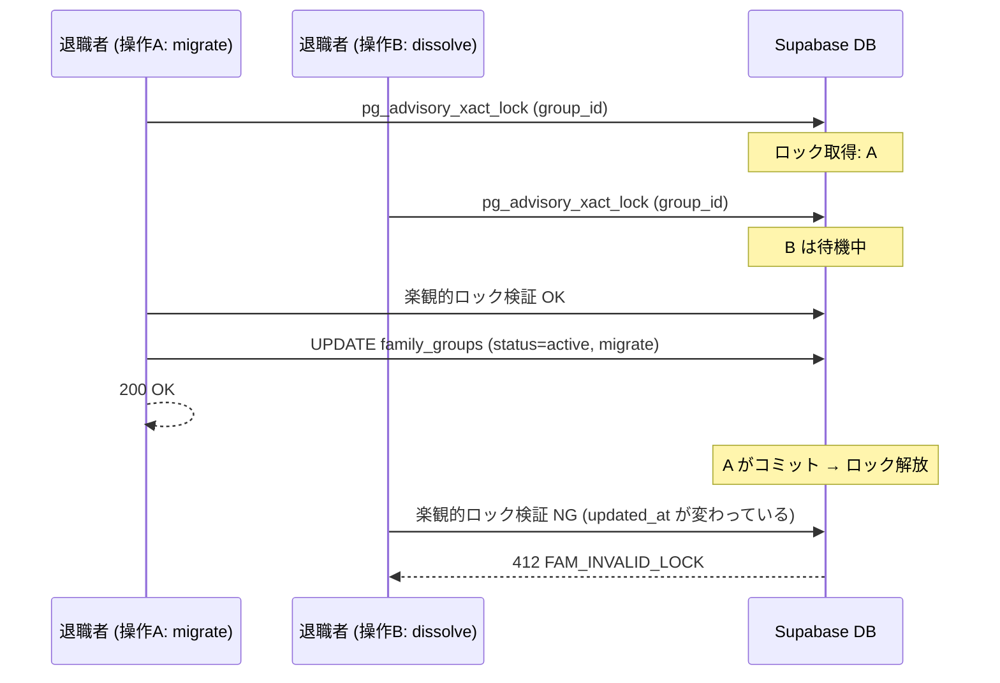
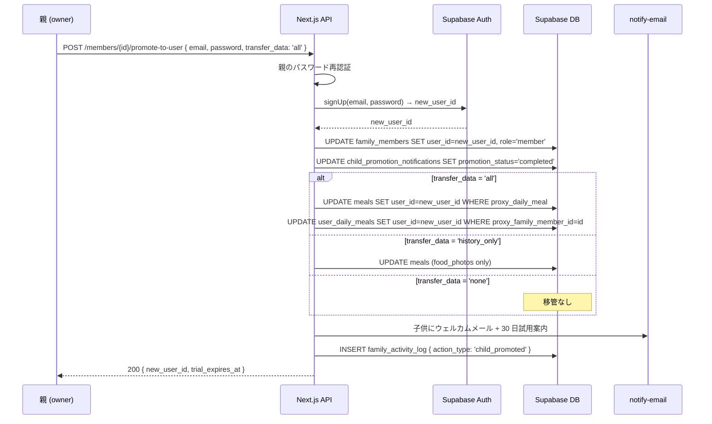
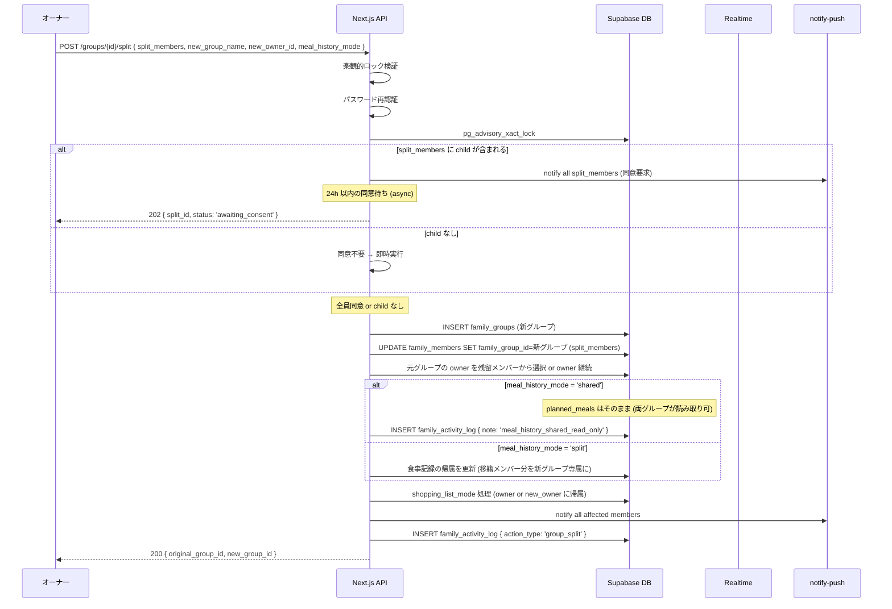
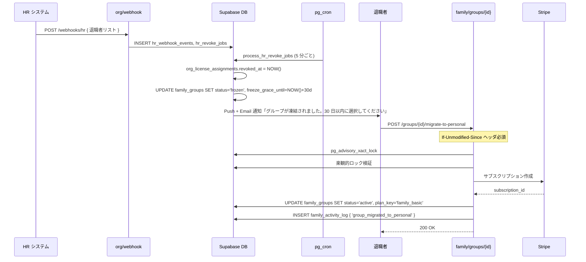

# family/ ライフサイクル管理 詳細設計

## 1. 目的・スコープ

家族グループと家族メンバーのライフサイクル全体を管理する:
1. **凍結フロー** (UC-ORG-17: 退職時トリガー)
2. **子供 → 大人移行** (P0: 18 歳到達)
3. **グループ分割** (P0: 離婚・別居等)
4. **大人代理操作** (P1: 認知症等)

## 2. 関連要件

- 要件 01 §4.17 UC-ORG-17 退職時家族グループ凍結
- 要件 01 §7.6 子供メンバーライフサイクル (P0)
- 要件 01 §7.7 家族グループ分割 (P0)
- 要件 01 §7.8 大人代理操作 (P1)
- 要件 01 §7.4 frozen/archived 状態 RLS
- 100-scenarios.md C7 / C8 / H5 / G4

---

## 3. 凍結フロー (UC-ORG-17)

### 3.1 トリガー

組織からの退職処理 (`org/05-offboarding-flow.md` 参照) が実行されると:

```sql
-- org/05-offboarding-flow の pg_cron ジョブから呼び出し
-- process_hr_revoke_jobs 内で family_groups を凍結

UPDATE family_groups
SET
  status = 'frozen',
  frozen_at = NOW(),
  freeze_grace_until = NOW() + INTERVAL '30 days',
  updated_at = NOW()
WHERE
  -- 組織同梱ライセンス経由のグループ
  source_org_assignment_id = $revoked_assignment_id
  AND status = 'active';
```

### 3.2 30 日猶予期間

凍結後 30 日以内に以下の 3 択を選択:

| 選択肢 | API | 説明 |
|--------|-----|------|
| 個人プランに移行 | `POST /api/family/groups/{id}/migrate-to-personal` | 個人課金でグループ継続 |
| 所有権を譲渡 | `POST /api/family/groups/{id}/transfer-ownership` | 別メンバーが owner になり継続 |
| グループを解散 | `POST /api/family/groups/{id}/dissolve` | 全データ保持後にグループ終了 |

### 3.3 猶予期間バッチ (frozen → archived)

```sql
-- cron_setup.sql
SELECT cron.schedule(
  'archive_frozen_family_groups',
  '0 3 * * *',  -- 毎日 3 時
  $$
    WITH expired AS (
      UPDATE family_groups
      SET status = 'archived', archived_at = NOW(), updated_at = NOW()
      WHERE status = 'frozen'
        AND freeze_grace_until < NOW()
      RETURNING id, owner_id
    )
    INSERT INTO family_activity_log (family_group_id, actor_id, action_type, details)
    SELECT id, NULL, 'group_archived',
           '{"reason": "freeze_grace_expired"}'::jsonb
    FROM expired;
  $$
);
```

### 3.4 凍結状態でのアクセス制限

| 操作 | frozen | archived |
|------|--------|---------|
| グループ情報閲覧 | ✅ | ✅ |
| メンバー情報閲覧 | ✅ | ✅ |
| 食事記録閲覧 | ✅ | ✅ |
| 献立リクエスト新規作成 | ❌ | ❌ |
| 買い物リスト追加 | ❌ | ❌ |
| 共有献立生成 | ❌ | ❌ |
| メンバー追加 | ❌ | ❌ |
| migrate/transfer/dissolve | ✅ (frozen のみ) | ❌ |

### 3.5 楽観的ロック

`migrate-to-personal` / `transfer-ownership` / `dissolve` は同時実行防止が必須。

**実装**:

```typescript
// lib/family/lifecycle-lock.ts

async function executeWithLifecycleLock<T>(
  groupId: string,
  expectedUpdatedAt: string,  // If-Unmodified-Since ヘッダ値
  operation: (supabase: SupabaseClient) => Promise<T>,
  supabase: SupabaseClient
): Promise<T> {
  // 1. advisory lock 取得 (cross/02-rls-patterns.md §6.2.1 のヘルパー使用)
  // ロックキー: 'family-group:{UUID}' 形式に統一
  await supabase.rpc('acquire_family_group_lock', {
    family_group_id: groupId,
  });

  // 2. 楽観的ロック検証
  const { data: group } = await supabase
    .from('family_groups')
    .select('updated_at')
    .eq('id', groupId)
    .single();

  if (group.updated_at !== expectedUpdatedAt) {
    throw new ApiError(412, 'FAM_INVALID_LOCK',
      '他の操作が先に完了しました。ページを更新してください。'
    );
  }

  // 3. 操作実行
  return operation(supabase);
}
```

**シーケンス (G4: 同時実行競合)**:



---

## 4. 子供 → 大人移行 (P0, §7.6)

### 4.1 18 歳到達バッチ (親通知)

```sql
-- cron_setup.sql: 月次バッチ
SELECT cron.schedule(
  'notify_child_18_birthday',
  '0 9 1 * *',  -- 毎月 1 日 9 時
  $$
    -- 今月 18 歳になる child メンバーを検知
    INSERT INTO child_promotion_notifications (family_member_id, notified_at)
    SELECT fm.id, NOW()
    FROM family_members fm
    JOIN family_groups fg ON fg.id = fm.family_group_id
    WHERE fm.birth_date IS NOT NULL
      AND DATE_PART('year', AGE(fm.birth_date)) = 18
      AND DATE_PART('month', AGE(fm.birth_date)) = 0  -- 18 歳になった直後
      AND fm.user_id IS NULL
      AND fg.status = 'active'
      AND NOT EXISTS (
        SELECT 1 FROM child_promotion_notifications cpn
        WHERE cpn.family_member_id = fm.id
      );

    -- owner に通知
    -- (実際の Push/Email 送信は notify-push/notify-email Edge Function 経由)
  $$
);
```

通知文面:
```
お子様 (○○さん) が 18 歳に到達しました。
独立したアカウントへの移行を検討してください。
[移行手続きを始める]
```

### 4.2 `promote-to-user` API フロー



### 4.3 データ移管選択肢

| `transfer_data` | 移管内容 | 想定ユースケース |
|----------------|---------|--------------|
| `all` | 食事記録・健康データ・体重推移すべて | 子供が全履歴を引き継ぎたい |
| `history_only` | 食事記録のみ、健康診断等は親側保持 | 親が医療情報を管理し続ける |
| `none` | 移管なし (空の新アカウント) | プライバシー重視 |

### 4.4 プラン継承

移行直後のアカウントは:
- 個人 `free` プランで開始
- 30 日間の個人 Pro 無料体験トリガー
- 家族グループには `member` として残留

---

## 5. グループ分割 (P0, §7.7)

### 5.1 前提条件

- owner 限定
- パスワード再認証必須
- 楽観的ロック + advisory lock
- 子供メンバーがいる場合: 親権者 (法的)同意が必要

### 5.2 フロー



### 5.3 同意フロー詳細

```typescript
// lib/family/split-consent.ts

interface SplitConsent {
  split_id: string;
  member_id: string;
  consented: boolean;
  consented_at: TIMESTAMPTZ | null;
}

// split_consents テーブル (一時テーブル、分割完了後に削除)
// または family_activity_log の details JSONB で管理

async function waitForConsents(
  splitId: string,
  requiredMemberIds: string[],
  timeoutMs: number = 24 * 60 * 60 * 1000  // 24h
): Promise<boolean> {
  // Realtime で consent イベントを受信
  // タイムアウト時は split_id を 'consent_timeout' に更新
  // 全員同意で true を返す
}
```

### 5.4 法的注意事項

子供メンバーが含まれる分割の場合:
- Phase 1: アプリ内同意のみ (親権者が両方の親である場合のみ対応)
- Phase 2: 家庭裁判所判断が必要なケースは法務 + 運営に問い合わせ誘導

**UI 警告**:
```
⚠ 子供メンバーが含まれています
グループ分割には全ての保護者の同意が必要です。
法的な親権問題が絡む場合は、まず専門家にご相談ください。
```

---

## 6. 大人代理操作 (P1, §7.8)

### 6.1 列定義

```sql
-- family_members への追加 (01-data-model.md に記載済み)
ALTER TABLE family_members
  ADD COLUMN IF NOT EXISTS proxy_required      BOOLEAN     NOT NULL DEFAULT FALSE,
  ADD COLUMN IF NOT EXISTS proxy_reason        VARCHAR(50)
    CHECK (proxy_reason IN ('dementia', 'bedridden', 'medical_treatment', 'other')),
  ADD COLUMN IF NOT EXISTS proxy_legal_guardian_id UUID
    REFERENCES auth.users(id);
```

### 6.2 RLS 拡張

`proxy_required = TRUE` の大人メンバー (`user_id IS NOT NULL`) に対して
child 代理と同じロジックを適用:

```sql
-- planned_meals の代理 INSERT 拡張
-- 08-rls-policies.md §5 に記載

CREATE POLICY planned_meals_adult_proxy_insert ON planned_meals
  FOR INSERT WITH CHECK (
    EXISTS (
      SELECT 1 FROM user_daily_meals udm
      JOIN family_members target ON target.user_id = udm.user_id
      JOIN family_members caller ON caller.family_group_id = target.family_group_id
      WHERE udm.id = planned_meals.daily_meal_id
        AND target.proxy_required = TRUE
        AND caller.user_id = auth.uid()
        AND caller.role IN ('owner', 'admin')
    )
  );
```

### 6.3 UI (メンバー編集画面)

```
─ 代理操作設定 ───────────────────────────────
代理操作が必要   [ON / OFF]

理由:
○ 認知症
○ 寝たきり
○ 療養中
○ その他

[保存]
```

`proxy_required = true` のメンバーには FamilyMemberCard に「代理中」バッジを表示。

### 6.4 Phase 2: 法的代理人

`proxy_legal_guardian_id` 列は Phase 2 で機能実装:
- 成年後見人の登録 (本人確認書類 + 法的文書アップロード)
- 登録された後見人のみが代理操作可能 (owner/admin 制限の解除)

---

## 7. シーケンス図 (凍結〜移行)



---

## 8. エラーハンドリング

| エラー | 原因 | 対応 |
|--------|------|------|
| `FAM_INVALID_LOCK` (412) | 楽観的ロック不一致 | ページ更新を促す |
| `FAM_GROUP_NOT_ACTIVE` (422) | archived グループへの操作 | 対応不可旨を表示 |
| `FAM_SPLIT_CONSENT_TIMEOUT` (422) | 同意タイムアウト | 分割中止、再実行を案内 |
| `FAM_CHILD_PROMOTE_AUTH_REQUIRED` (403) | 親のパスワード未確認 | 再認証画面にリダイレクト |
| Stripe 失敗 (migrate) | カード拒否等 | Stripe エラーをユーザーに表示、retry 可能 |

---

## 9. テスト方針

### 9.1 Unit テスト

```typescript
// tests/unit/family/lifecycle.test.ts
describe('楽観的ロック', () => {
  test('updated_at 一致: OK');
  test('updated_at 不一致: 412 返却');
  test('同時実行: advisory lock で片方が 412');
});

describe('18歳バッチ', () => {
  test('誕生月に child_promotion_notifications INSERT');
  test('2 回目の月次バッチでは重複 INSERT しない (UNIQUE 制約)');
});
```

### 9.2 Integration テスト

- UC-ORG-17: HR Webhook → frozen → 30 日後 archived バッチ
- promote-to-user: transfer_data 3 パターン全て
- split: child 含む / child 含まない の 2 パターン

### 9.3 E2E (Playwright)

- `tests/e2e/family/family-10-lifecycle-frozen.spec.ts`
- `tests/e2e/family/family-11-child-promote.spec.ts`

## 10. 既存実装との関連

- `org/05-offboarding-flow.md` が frozen トリガーの発生源 → 本ドキュメントはその受け側
- `cross/02-rls-patterns.md` の advisory lock パターンを流用

## 11. 未解決事項

| 項目 | 状態 |
|------|------|
| グループ分割後の `planned_meals` read-only 共有の実装方法 | `family_shared_menu_id` を元グループのままにすることで両グループから閲覧可。RLS 拡張が必要 (Phase 2 課題) |
| promote-to-user の Email 確認待ち中のメンバー状態表示 | `child_promotion_notifications.promotion_status = 'pending'` で「移行手続き中」バッジ表示 |
| split の `split_consents` テーブル | `family_activity_log.details` で管理するか専用テーブルにするかは実装時に決定 |
| 大人代理の法的文書管理 (Phase 2) | `Supabase Storage org-logos` バケットに類似した `legal-docs` バケットを新設 |
