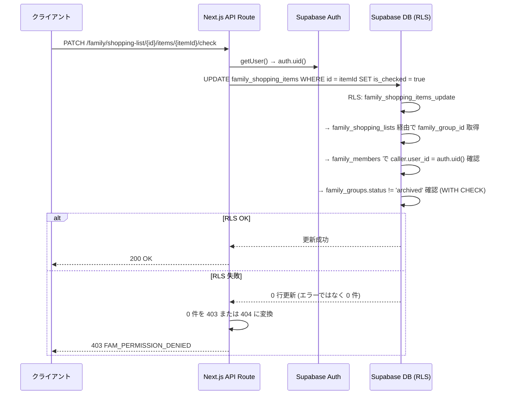

# family/ RLS ポリシー 詳細設計

## 1. 目的・スコープ

家族管理ドメインの全テーブルに対する Row Level Security (RLS) ポリシーを具体的な SQL で確定する。
「アプリ層 feature flag は UX のため、RLS はセキュリティのため」の二層防御原則に従う。

スコープ外: `cross/02-rls-patterns.md` の共通パターンは本書で流用するが詳細は cross/ に委ねる。

## 2. 関連要件

- 要件 01 §7.1.3 `family_invites` RLS
- 要件 01 §7.3 既存テーブル RLS 拡張 (family 閲覧)
- 要件 01 §7.4 frozen/archived 状態 WITH CHECK
- 要件 01 §7.5 プラン制限の RLS 二重防御
- 要件 01 §7.1.8 `family_meal_requests` RLS (子供代理ロジック)

## 3. 基本方針

| 原則 | 内容 |
|------|------|
| 全テーブル RLS 有効 | `ENABLE ROW LEVEL SECURITY` 必須 |
| DELETE 禁止 (immutable) | `family_activity_log` は INSERT のみ、UPDATE/DELETE 禁止 |
| 状態制限 | frozen/archived グループへの INSERT は全テーブルで WITH CHECK |
| child 代理 | child member の INSERT は owner/admin が代行可 |
| anon アクセス禁止 | `family_invites` への直接クエリは API 層で service_role 経由のみ |

---

## 4. `family_groups`

```sql
ALTER TABLE family_groups ENABLE ROW LEVEL SECURITY;

-- SELECT: 同グループメンバー全員
CREATE POLICY "family_groups_select" ON family_groups
  FOR SELECT USING (
    EXISTS (
      SELECT 1 FROM family_members fm
      WHERE fm.family_group_id = family_groups.id
        AND fm.user_id = auth.uid()
        AND fm.is_active = TRUE
    )
    -- オーナー自身も含む
    OR owner_id = auth.uid()
  );

-- INSERT: 認証済みユーザー。ただし family_basic/pro 以上のプランを持つか、
--         組織同梱ライセンスを持つユーザーのみ (プラン制限二重防御)
CREATE POLICY "family_groups_insert" ON family_groups
  FOR INSERT WITH CHECK (
    owner_id = auth.uid()
    AND (
      -- 個人有料プラン
      EXISTS (
        SELECT 1 FROM personal_subscriptions ps
        WHERE ps.user_id = auth.uid()
          AND ps.status IN ('active', 'trialing')
          AND ps.plan_key IN ('family_basic', 'family_pro')
      )
      -- 組織同梱ライセンス
      OR EXISTS (
        SELECT 1 FROM org_license_assignments ola
        JOIN org_license_pools olp ON olp.id = ola.license_pool_id
        WHERE ola.user_id = auth.uid()
          AND ola.status = 'active'
          AND olp.family_addon_seats > 0
      )
      -- free プランも作成可 (member_limit=4 で自動制限)
      OR plan_key = 'free'
    )
  );

-- UPDATE: オーナーのみ
CREATE POLICY "family_groups_update" ON family_groups
  FOR UPDATE USING (owner_id = auth.uid())
  WITH CHECK (owner_id = auth.uid());

-- DELETE: 不可 (物理削除禁止。archived 状態への遷移のみ許可)
CREATE POLICY "family_groups_no_delete" ON family_groups
  FOR DELETE USING (false);
```

---

## 5. `family_members`

```sql
ALTER TABLE family_members ENABLE ROW LEVEL SECURITY;

-- SELECT: 同グループメンバー全員 (非アクティブメンバーも履歴として閲覧可)
CREATE POLICY "family_members_select" ON family_members
  FOR SELECT USING (
    EXISTS (
      SELECT 1 FROM family_members caller
      WHERE caller.family_group_id = family_members.family_group_id
        AND caller.user_id = auth.uid()
    )
  );

-- INSERT: owner / admin のみ。frozen/archived グループへは不可
CREATE POLICY "family_members_insert" ON family_members
  FOR INSERT WITH CHECK (
    EXISTS (
      SELECT 1 FROM family_members caller
      JOIN family_groups fg ON fg.id = caller.family_group_id
      WHERE caller.family_group_id = family_members.family_group_id
        AND caller.user_id = auth.uid()
        AND caller.role IN ('owner', 'admin')
        AND fg.status = 'active'           -- frozen/archived は不可
    )
  );

-- UPDATE: 本人 or owner or admin
--   ただし role の変更は owner のみ
--   proxy_required / proxy_reason の変更は owner/admin のみ
CREATE POLICY "family_members_update_self" ON family_members
  FOR UPDATE USING (user_id = auth.uid())
  WITH CHECK (
    user_id = auth.uid()
    -- self UPDATE では role / proxy_required 変更不可 (アプリ層で制御)
  );

CREATE POLICY "family_members_update_admin" ON family_members
  FOR UPDATE USING (
    EXISTS (
      SELECT 1 FROM family_members caller
      WHERE caller.family_group_id = family_members.family_group_id
        AND caller.user_id = auth.uid()
        AND caller.role IN ('owner', 'admin')
    )
  )
  WITH CHECK (
    EXISTS (
      SELECT 1 FROM family_members caller
      WHERE caller.family_group_id = family_members.family_group_id
        AND caller.user_id = auth.uid()
        AND caller.role IN ('owner', 'admin')
    )
  );

-- DELETE: owner / admin のみ (実際は is_active = false に更新するが、物理削除用に念のため)
CREATE POLICY "family_members_delete" ON family_members
  FOR DELETE USING (
    EXISTS (
      SELECT 1 FROM family_members caller
      WHERE caller.family_group_id = family_members.family_group_id
        AND caller.user_id = auth.uid()
        AND caller.role IN ('owner', 'admin')
    )
  );
```

---

## 6. `family_invites`

```sql
ALTER TABLE family_invites ENABLE ROW LEVEL SECURITY;

-- anon ユーザーは RLS で完全遮断
-- GET /api/family/invites/{token} は API 層で service_role 経由アクセス

-- SELECT: 同グループの owner / admin のみ
CREATE POLICY "family_invites_select" ON family_invites
  FOR SELECT USING (
    EXISTS (
      SELECT 1 FROM family_members fm
      WHERE fm.family_group_id = family_invites.family_group_id
        AND fm.user_id = auth.uid()
        AND fm.role IN ('owner', 'admin')
    )
  );

-- INSERT: 同グループの owner / admin のみ。frozen グループは不可
CREATE POLICY "family_invites_insert" ON family_invites
  FOR INSERT WITH CHECK (
    created_by = auth.uid()
    AND EXISTS (
      SELECT 1 FROM family_members fm
      JOIN family_groups fg ON fg.id = fm.family_group_id
      WHERE fm.family_group_id = family_invites.family_group_id
        AND fm.user_id = auth.uid()
        AND fm.role IN ('owner', 'admin')
        AND fg.status = 'active'
    )
  );

-- UPDATE: キャンセル操作のみ (accepted_at, cancelled_at の更新)
--         API 層では service_role 経由で実行するため、ここは念のためのポリシー
CREATE POLICY "family_invites_update" ON family_invites
  FOR UPDATE USING (
    created_by = auth.uid()
    OR EXISTS (
      SELECT 1 FROM family_groups fg
      WHERE fg.id = family_invites.family_group_id
        AND fg.owner_id = auth.uid()
    )
  );

-- DELETE: owner or 作成者 (取消 = 物理削除ではなく cancelled_at セットが推奨)
CREATE POLICY "family_invites_delete" ON family_invites
  FOR DELETE USING (
    created_by = auth.uid()
    OR EXISTS (
      SELECT 1 FROM family_groups fg
      WHERE fg.id = family_invites.family_group_id
        AND fg.owner_id = auth.uid()
    )
  );
```

---

## 7. `family_shared_menus`

```sql
ALTER TABLE family_shared_menus ENABLE ROW LEVEL SECURITY;

-- SELECT: 同グループメンバー全員 (閲覧のみ frozen も可)
CREATE POLICY "family_shared_menus_select" ON family_shared_menus
  FOR SELECT USING (
    EXISTS (
      SELECT 1 FROM family_members fm
      WHERE fm.family_group_id = family_shared_menus.family_group_id
        AND fm.user_id = auth.uid()
    )
  );

-- INSERT: owner / admin のみ。frozen/archived グループは不可
CREATE POLICY "family_shared_menus_insert" ON family_shared_menus
  FOR INSERT WITH CHECK (
    created_by = auth.uid()
    AND EXISTS (
      SELECT 1 FROM family_members fm
      JOIN family_groups fg ON fg.id = fm.family_group_id
      WHERE fm.family_group_id = family_shared_menus.family_group_id
        AND fm.user_id = auth.uid()
        AND fm.role IN ('owner', 'admin')
        AND fg.status = 'active'
    )
  );

-- UPDATE: owner / admin のみ
CREATE POLICY "family_shared_menus_update" ON family_shared_menus
  FOR UPDATE USING (
    EXISTS (
      SELECT 1 FROM family_members fm
      WHERE fm.family_group_id = family_shared_menus.family_group_id
        AND fm.user_id = auth.uid()
        AND fm.role IN ('owner', 'admin')
    )
  )
  WITH CHECK (
    EXISTS (
      SELECT 1 FROM family_members fm
      JOIN family_groups fg ON fg.id = fm.family_group_id
      WHERE fm.family_group_id = family_shared_menus.family_group_id
        AND fm.user_id = auth.uid()
        AND fm.role IN ('owner', 'admin')
        AND fg.status = 'active'
    )
  );

-- DELETE: owner / admin のみ
CREATE POLICY "family_shared_menus_delete" ON family_shared_menus
  FOR DELETE USING (
    EXISTS (
      SELECT 1 FROM family_members fm
      WHERE fm.family_group_id = family_shared_menus.family_group_id
        AND fm.user_id = auth.uid()
        AND fm.role IN ('owner', 'admin')
    )
  );
```

---

## 8. `family_member_servings`

```sql
ALTER TABLE family_member_servings ENABLE ROW LEVEL SECURITY;

-- SELECT: 同グループメンバー全員
CREATE POLICY "family_member_servings_select" ON family_member_servings
  FOR SELECT USING (
    EXISTS (
      SELECT 1 FROM family_shared_menus fsm
      JOIN family_members fm ON fm.family_group_id = fsm.family_group_id
      WHERE fsm.id = family_member_servings.family_shared_menu_id
        AND fm.user_id = auth.uid()
    )
  );

-- INSERT / UPDATE: owner / admin のみ
CREATE POLICY "family_member_servings_write" ON family_member_servings
  FOR ALL USING (
    EXISTS (
      SELECT 1 FROM family_shared_menus fsm
      JOIN family_members fm ON fm.family_group_id = fsm.family_group_id
      WHERE fsm.id = family_member_servings.family_shared_menu_id
        AND fm.user_id = auth.uid()
        AND fm.role IN ('owner', 'admin')
    )
  );
```

---

## 9. `family_shopping_lists` / `family_shopping_items`

```sql
ALTER TABLE family_shopping_lists ENABLE ROW LEVEL SECURITY;
ALTER TABLE family_shopping_items ENABLE ROW LEVEL SECURITY;

-- family_shopping_lists SELECT: 同グループメンバー全員 (frozen も閲覧可)
CREATE POLICY "family_shopping_lists_select" ON family_shopping_lists
  FOR SELECT USING (
    EXISTS (
      SELECT 1 FROM family_members fm
      WHERE fm.family_group_id = family_shopping_lists.family_group_id
        AND fm.user_id = auth.uid()
    )
  );

-- family_shopping_lists INSERT: owner / admin のみ。frozen は不可
CREATE POLICY "family_shopping_lists_insert" ON family_shopping_lists
  FOR INSERT WITH CHECK (
    EXISTS (
      SELECT 1 FROM family_members fm
      JOIN family_groups fg ON fg.id = fm.family_group_id
      WHERE fm.family_group_id = family_shopping_lists.family_group_id
        AND fm.user_id = auth.uid()
        AND fm.role IN ('owner', 'admin')
        AND fg.status = 'active'
    )
  );

-- family_shopping_lists UPDATE (status 変更): owner / admin のみ
CREATE POLICY "family_shopping_lists_update" ON family_shopping_lists
  FOR UPDATE USING (
    EXISTS (
      SELECT 1 FROM family_members fm
      WHERE fm.family_group_id = family_shopping_lists.family_group_id
        AND fm.user_id = auth.uid()
        AND fm.role IN ('owner', 'admin')
    )
  )
  WITH CHECK (
    EXISTS (
      SELECT 1 FROM family_members fm
      JOIN family_groups fg ON fg.id = fm.family_group_id
      WHERE fm.family_group_id = family_shopping_lists.family_group_id
        AND fm.user_id = auth.uid()
        AND fm.role IN ('owner', 'admin')
        AND fg.status != 'archived'
    )
  );

-- family_shopping_items SELECT: 同グループメンバー全員
CREATE POLICY "family_shopping_items_select" ON family_shopping_items
  FOR SELECT USING (
    EXISTS (
      SELECT 1 FROM family_shopping_lists fsl
      JOIN family_members fm ON fm.family_group_id = fsl.family_group_id
      WHERE fsl.id = family_shopping_items.family_shopping_list_id
        AND fm.user_id = auth.uid()
    )
  );

-- family_shopping_items INSERT: 全メンバー可 (owner/admin/member)。frozen は不可
CREATE POLICY "family_shopping_items_insert" ON family_shopping_items
  FOR INSERT WITH CHECK (
    added_by = auth.uid()
    AND EXISTS (
      SELECT 1 FROM family_shopping_lists fsl
      JOIN family_members fm ON fm.family_group_id = fsl.family_group_id
      JOIN family_groups fg ON fg.id = fsl.family_group_id
      WHERE fsl.id = family_shopping_items.family_shopping_list_id
        AND fm.user_id = auth.uid()
        AND fg.status = 'active'
    )
  );

-- family_shopping_items UPDATE (チェック・担当者変更): 全メンバー可
CREATE POLICY "family_shopping_items_update" ON family_shopping_items
  FOR UPDATE USING (
    EXISTS (
      SELECT 1 FROM family_shopping_lists fsl
      JOIN family_members fm ON fm.family_group_id = fsl.family_group_id
      WHERE fsl.id = family_shopping_items.family_shopping_list_id
        AND fm.user_id = auth.uid()
    )
  )
  WITH CHECK (
    EXISTS (
      SELECT 1 FROM family_shopping_lists fsl
      JOIN family_members fm ON fm.family_group_id = fsl.family_group_id
      JOIN family_groups fg ON fg.id = fsl.family_group_id
      WHERE fsl.id = family_shopping_items.family_shopping_list_id
        AND fm.user_id = auth.uid()
        AND fg.status != 'archived'
    )
  );

-- family_shopping_items DELETE: owner / admin のみ
CREATE POLICY "family_shopping_items_delete" ON family_shopping_items
  FOR DELETE USING (
    EXISTS (
      SELECT 1 FROM family_shopping_lists fsl
      JOIN family_members fm ON fm.family_group_id = fsl.family_group_id
      WHERE fsl.id = family_shopping_items.family_shopping_list_id
        AND fm.user_id = auth.uid()
        AND fm.role IN ('owner', 'admin')
    )
  );
```

---

## 10. `family_meal_requests` (子供代理ロジック含む)

```sql
ALTER TABLE family_meal_requests ENABLE ROW LEVEL SECURITY;

-- SELECT: 同グループメンバー全員
CREATE POLICY "family_meal_requests_select" ON family_meal_requests
  FOR SELECT USING (
    EXISTS (
      SELECT 1 FROM family_members fm
      WHERE fm.family_group_id = family_meal_requests.family_group_id
        AND fm.user_id = auth.uid()
    )
  );

-- INSERT: 同グループの実ユーザーメンバーのみ。frozen/archived グループは不可
--         子供代理リクエスト: target が child (user_id IS NULL) の場合は owner/admin のみ
CREATE POLICY "family_meal_requests_insert" ON family_meal_requests
  FOR INSERT WITH CHECK (
    requester_id = auth.uid()
    -- 呼び出し元は同グループの owner/admin/member
    AND EXISTS (
      SELECT 1 FROM family_members fm
      JOIN family_groups fg ON fg.id = fm.family_group_id
      WHERE fm.family_group_id = family_meal_requests.family_group_id
        AND fm.user_id = auth.uid()
        AND fm.role IN ('owner', 'admin', 'member')
        AND fg.status = 'active'
    )
    -- target_member は同グループ内
    AND EXISTS (
      SELECT 1 FROM family_members tgt
      WHERE tgt.id = family_meal_requests.target_member_id
        AND tgt.family_group_id = family_meal_requests.family_group_id
    )
    -- child 代理: target が child (user_id IS NULL) → requester は owner/admin のみ
    AND (
      (
        SELECT user_id FROM family_members
        WHERE id = family_meal_requests.target_member_id
      ) IS NOT NULL
      -- 通常メンバーへのリクエスト: 全員可
      OR EXISTS (
        SELECT 1 FROM family_members fm
        WHERE fm.family_group_id = family_meal_requests.family_group_id
          AND fm.user_id = auth.uid()
          AND fm.role IN ('owner', 'admin')
      )
      -- child/proxy_required=TRUE メンバーへのリクエスト: owner/admin のみ
    )
    -- proxy_required=TRUE の大人メンバーへのリクエストも同様
    AND (
      (
        SELECT proxy_required FROM family_members
        WHERE id = family_meal_requests.target_member_id
      ) = FALSE
      OR EXISTS (
        SELECT 1 FROM family_members fm
        WHERE fm.family_group_id = family_meal_requests.family_group_id
          AND fm.user_id = auth.uid()
          AND fm.role IN ('owner', 'admin')
      )
    )
  );

-- UPDATE (propose): assignee_id = auth.uid() のみ
CREATE POLICY "family_meal_requests_propose" ON family_meal_requests
  FOR UPDATE USING (
    assignee_id = auth.uid()
    AND status IN ('pending')
  )
  WITH CHECK (
    assignee_id = auth.uid()
    AND status IN ('proposed')  -- pending → proposed のみ許可
  );

-- UPDATE (accept/reject/cancel): requester_id = auth.uid() のみ
CREATE POLICY "family_meal_requests_decide" ON family_meal_requests
  FOR UPDATE USING (
    requester_id = auth.uid()
    AND status IN ('proposed', 'pending')
  )
  WITH CHECK (
    requester_id = auth.uid()
    AND status IN ('accepted', 'rejected', 'cancelled')
  );

-- DELETE: 不可 (履歴保持)
CREATE POLICY "family_meal_requests_no_delete" ON family_meal_requests
  FOR DELETE USING (false);
```

---

## 11. `family_activity_log` (immutable)

```sql
ALTER TABLE family_activity_log ENABLE ROW LEVEL SECURITY;

-- SELECT: 同グループメンバー全員 (透明性のため全員閲覧可)
CREATE POLICY "family_activity_log_select" ON family_activity_log
  FOR SELECT USING (
    EXISTS (
      SELECT 1 FROM family_members fm
      WHERE fm.family_group_id = family_activity_log.family_group_id
        AND fm.user_id = auth.uid()
    )
  );

-- INSERT: 同グループメンバー (actor_id = auth.uid() を強制)
--         システム/バッチ操作は service_role 経由 (actor_id = NULL 許可)
CREATE POLICY "family_activity_log_insert" ON family_activity_log
  FOR INSERT WITH CHECK (
    (
      actor_id = auth.uid()
      AND EXISTS (
        SELECT 1 FROM family_members fm
        WHERE fm.family_group_id = family_activity_log.family_group_id
          AND fm.user_id = auth.uid()
      )
    )
    -- service_role (バッチ / pg_cron) は actor_id NULL で INSERT 可
    -- → service_role はデフォルトで RLS バイパスするため、ここでは認証ユーザーのみ制御
  );

-- UPDATE: 不可 (監査ログ不可逆)
CREATE POLICY "family_activity_log_no_update" ON family_activity_log
  FOR UPDATE USING (false);

-- DELETE: 不可 (監査ログ不可逆)
CREATE POLICY "family_activity_log_no_delete" ON family_activity_log
  FOR DELETE USING (false);
```

---

## 12. `planned_meals` 拡張ポリシー (家族プロキシ INSERT)

```sql
-- 既存 planned_meals の SELECT/INSERT/UPDATE/DELETE ポリシーは保持
-- 以下を追加

-- INSERT: 家族グループの owner/admin が、同グループ child (user_id IS NULL) の planned_meals を作成可
CREATE POLICY "planned_meals_family_child_proxy_insert" ON planned_meals
  FOR INSERT WITH CHECK (
    EXISTS (
      SELECT 1 FROM user_daily_meals udm
      JOIN family_members tgt ON tgt.id = udm.proxy_family_member_id
        AND tgt.user_id IS NULL             -- child メンバーのみ
      JOIN family_members caller ON caller.family_group_id = tgt.family_group_id
      WHERE udm.id = planned_meals.daily_meal_id
        AND caller.user_id = auth.uid()
        AND caller.role IN ('owner', 'admin')
    )
  );

-- INSERT: proxy_required = TRUE の大人メンバーの planned_meals を owner/admin が作成可
CREATE POLICY "planned_meals_family_adult_proxy_insert" ON planned_meals
  FOR INSERT WITH CHECK (
    EXISTS (
      SELECT 1 FROM user_daily_meals udm
      JOIN family_members tgt ON tgt.user_id = udm.user_id
        AND tgt.proxy_required = TRUE       -- 代理操作が必要な大人
      JOIN family_members caller ON caller.family_group_id = tgt.family_group_id
      WHERE udm.id = planned_meals.daily_meal_id
        AND caller.user_id = auth.uid()
        AND caller.role IN ('owner', 'admin')
    )
  );

-- INSERT: 家族リクエスト accepted フローで requester が承認 → INSERT
CREATE POLICY "planned_meals_family_request_insert" ON planned_meals
  FOR INSERT WITH CHECK (
    source_request_id IS NOT NULL
    AND EXISTS (
      SELECT 1 FROM family_meal_requests req
      WHERE req.id = planned_meals.source_request_id
        AND req.requester_id = auth.uid()
        AND req.status = 'accepted'
    )
  );
```

---

## 13. `meals` 拡張ポリシー (家族閲覧)

```sql
-- 既存 meals の SELECT ポリシー (meals_select_own) は保持
-- 同グループメンバーの meals 閲覧ポリシーを追加

CREATE POLICY "meals_family_select" ON meals
  FOR SELECT USING (
    EXISTS (
      SELECT 1 FROM family_members caller
      JOIN family_members target ON target.family_group_id = caller.family_group_id
      JOIN family_groups grp ON grp.id = caller.family_group_id
      WHERE caller.user_id = auth.uid()
        AND target.user_id = meals.user_id
        AND grp.status = 'active'           -- frozen/archived グループは閲覧不可
        AND COALESCE((grp.settings->>'share_meal_records')::boolean, true) = true
        -- target のプライバシー設定確認
        AND (
          SELECT COALESCE((fm.privacy_settings->>'share_meals')::boolean, false)
          FROM family_members fm
          WHERE fm.user_id = meals.user_id
            AND fm.family_group_id = grp.id
        ) = true
    )
  );
```

**産業医ポリシー** (家族領域は除外済み):

```sql
-- 産業医は家族の meals を閲覧不可
-- meals_family_select ポリシーは family_members の同一グループ条件で自動的に除外される
-- (産業医は family_members に所属しないため、家族データにはアクセスできない)

-- 産業医の組織内 meals 閲覧は meals_industrial_doctor_select ポリシーで管理
-- (要件 §7.3 記載の既存ポリシー、本書では再掲のみ)
CREATE POLICY "meals_industrial_doctor_select" ON meals
  FOR SELECT USING (
    EXISTS (
      SELECT 1 FROM user_profiles caller_profile
      JOIN user_profiles target_profile ON target_profile.id = meals.user_id
      WHERE caller_profile.id = auth.uid()
        AND 'org_industrial_doctor' = ANY(caller_profile.roles)
        AND caller_profile.organization_id = target_profile.organization_id
        AND target_profile.consent_org_health_data = TRUE
        AND target_profile.is_active_in_org = TRUE
    )
  );
```

---

## 14. frozen / archived 状態の WITH CHECK (共通パターン)

以下のテーブルは INSERT 時に `fg.status = 'active'` チェックを WITH CHECK に含める:

| テーブル | 対応 |
|---------|------|
| `family_members` | INSERT WITH CHECK に含む (§5) |
| `family_invites` | INSERT WITH CHECK に含む (§6) |
| `family_shared_menus` | INSERT WITH CHECK に含む (§7) |
| `family_shopping_lists` | INSERT WITH CHECK に含む (§9) |
| `family_shopping_items` | INSERT WITH CHECK に含む (§9) |
| `family_meal_requests` | INSERT WITH CHECK に含む (§10) |

**共通 SQL パターン**:

```sql
-- frozen/archived グループへの INSERT を防ぐ共通チェック
-- (各テーブルの INSERT ポリシーで family_group_id を経由して fg.status を確認)
AND EXISTS (
  SELECT 1 FROM family_groups fg
  WHERE fg.id = {table}.family_group_id  -- または JOIN 経由
    AND fg.status = 'active'
)
```

---

## 15. プラン制限の RLS 二重防御

```sql
-- family_groups の INSERT: §4 で定義済み (family_basic/pro/free のみ作成可)

-- family_members の INSERT: member_limit チェック
-- (RLS では CHECK できないため、サーバー側トリガーで実装)

CREATE OR REPLACE FUNCTION check_family_member_limit()
RETURNS TRIGGER AS $$
BEGIN
  IF (
    SELECT COUNT(*) FROM family_members
    WHERE family_group_id = NEW.family_group_id AND is_active = TRUE
  ) >= (
    SELECT member_limit FROM family_groups WHERE id = NEW.family_group_id
  ) THEN
    RAISE EXCEPTION 'FAM_GROUP_FULL: メンバー上限に達しました'
      USING ERRCODE = 'P0001';
  END IF;
  RETURN NEW;
END;
$$ LANGUAGE plpgsql;

CREATE TRIGGER trg_family_member_limit
  BEFORE INSERT ON family_members
  FOR EACH ROW EXECUTE FUNCTION check_family_member_limit();

-- AI 機能 (共有献立生成) はサーバーサイド関数で getUserActivePlan() の features に
-- 'family_menu_ai' が含まれることを確認 (RLS ではなく API 層で gate)
```

---

## 16. シーケンス (RLS 検証フロー)



---

## 17. テスト方針

### 17.1 RLS 網羅テスト (Vitest + Supabase Local)

```typescript
// tests/integration/family/rls.test.ts

describe('family_groups RLS', () => {
  test('owner は自グループを SELECT できる');
  test('他グループメンバーは SELECT できない');
  test('DELETE は誰もできない');
  test('frozen グループへの child INSERT は 0 件');
});

describe('family_meal_requests RLS (子供代理)', () => {
  test('owner が child を target に INSERT できる');
  test('member が child を target に INSERT できない (403)');
  test('assignee 以外が propose できない');
  test('requester 以外が accept できない');
});

describe('meals_family_select RLS', () => {
  test('share_meals=true のメンバーの meals は同グループから SELECT できる');
  test('share_meals=false のメンバーの meals は閲覧できない');
  test('frozen グループの meals は閲覧できない');
  test('産業医は family_members 所属外なので家族 meals を閲覧できない');
});
```

### 17.2 プラン制限テスト

```typescript
describe('プラン制限 RLS', () => {
  test('free ユーザーが family_groups INSERT: OK (plan_key=free)');
  test('free ユーザーが family_basic グループ INSERT: RLS NG');
  test('family_basic サブスク保持ユーザーが INSERT: OK');
});
```

## 18. 既存実装との関連

- 既存 `rls_hardening.sql` マイグレーション (commit 32d13e1) に本ポリシーを追加
- `meals_industrial_doctor_select` は org/ ドメインの要件 §8.8.4 と重複定義になるため
  `rls_hardening.sql` (7 番目のマイグレーション) で一元管理

## 19. 未解決事項

| 項目 | 状態 |
|------|------|
| `child_promotion_notifications` の RLS | owner/admin が SELECT, INSERT 可。service_role がバッチで INSERT。仕様確定済みだが SQL 記述が本書から漏れているため実装時に追加 |
| `family_member_servings` の frozen チェック | family_shared_menus 経由で family_group_id を取得し fg.status 確認。JOIN が増えるが正確性優先 |
| `planned_meals` の 2 つの proxy ポリシーと既存 `planned_meals_insert_own` の ORDER | PostgreSQL は複数ポリシーを OR で評価する (permissive)。既存ポリシーと競合しないことを確認が必要 |
| RLS パフォーマンス (EXISTS サブクエリの多用) | `cross/06-perf-cache.md` と連携し、`family_members` にインデックス最適化。クエリ計画を `EXPLAIN ANALYZE` で検証 |
