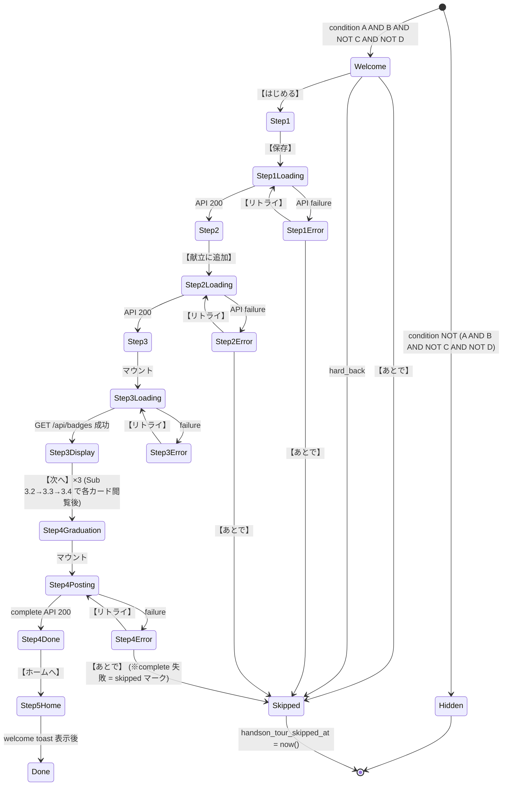

# 01 — 表示トリガー / 全体フロー / ロール除外

> 関連: [00-overview](./00-overview.md) / [02-step0-welcome](./02-step0-welcome.md) / [09-api-spec](./09-api-spec.md)

---

## 1. 表示トリガー条件

### 1.1 論理式

```
表示する = (A) AND (B) AND NOT (C) AND NOT (D)
```

- **A**: `user_profiles.onboarding_completed_at IS NOT NULL` (= onboarding 完了済)
- **B**: `user_profiles.handson_tour_completed_at IS NULL` AND `handson_tour_skipped_at IS NULL` (= ハンズオン未完了かつ未スキップ)
- **C**: ユーザーが既に non-sandbox の `meal_logs` または `weekly_menus` を 1 件以上保有 (= 既存ユーザーが事故的に初回扱いされない安全弁)
- **D**: ユーザーが admin / super_admin / org_admin / org_industrial_doctor の **いずれか** ロールを保有 (= 業務利用ユーザーは個人向けハンズオンを受けない)

### 1.2 Rule of priority

`force=1` パラメータで明示的に再表示を要求された場合、**B のみ無視**、A / C / D は依然として満たす必要がある (= ロール除外 / 既存ユーザー除外は force でも貫徹)。これは role 切り替わりやデータ移行後の状態を保護するため。

### 1.3 判定タイミング

3 ヶ所で判定:

#### 1.3.1 onboarding/complete API 成功直後
```ts
// src/app/api/onboarding/complete/route.ts (既存)
async function handler(req) {
  // 既存ロジック ...
  await db.query(`UPDATE user_profiles SET onboarding_completed_at = now() WHERE user_id = $1`, [userId]);

  const tourStatus = await getHandsonTourStatus(userId);
  return {
    status: 200,
    body: {
      ok: true,
      next_route: tourStatus.should_show ? '/handson-tour' : '/home',
      ...existingFields,
    },
  };
}
```

#### 1.3.2 /home マウント時 (フォールバック)
直リンクや push 通知から /home に来たケース対応。

```ts
// src/app/(main)/home/page.tsx (既存に追加)
useEffect(() => {
  (async () => {
    const status = await fetch('/api/handson-tour/status').then(r => r.json());
    if (status.should_show) {
      router.replace('/handson-tour');
    }
  })();
}, []);
```

mobile も同様 (`apps/mobile/app/(tabs)/home.tsx`)。

#### 1.3.3 /handson-tour 自身のマウント時
直リンクで /handson-tour に来た admin ユーザー等に対する防御。

```ts
// src/app/handson-tour/layout.tsx (新規)
useEffect(() => {
  (async () => {
    const status = await fetch('/api/handson-tour/status').then(r => r.json());
    if (!status.should_show) router.replace('/home');
  })();
}, []);
```

### 1.4 サーバー側判定 (canonical)

クライアントは `/api/handson-tour/status` の結果を信頼する。実判定は API 内で完結 (詳細は §09-api-spec.md):

```ts
async function getHandsonTourStatus(userId: string): Promise<{
  should_show: boolean;
  completed_at: ISO8601 | null;
  skipped_at: ISO8601 | null;
}> {
  const profile = await db.queryOne(/* SELECT ... FROM user_profiles */);
  if (!profile) throw new Error('profile_not_found');

  // D: ロール除外
  const adminRoles = ['admin','super_admin','org_admin','org_industrial_doctor'];
  if (profile.roles.some(r => adminRoles.includes(r))) {
    return { should_show: false, completed_at: profile.handson_tour_completed_at, skipped_at: profile.handson_tour_skipped_at };
  }

  // A: onboarding 未完
  if (!profile.onboarding_completed_at) return { should_show: false, completed_at: null, skipped_at: null };

  // B: 完了/スキップ済み
  if (profile.handson_tour_completed_at) return { should_show: false, completed_at: profile.handson_tour_completed_at, skipped_at: null };
  if (profile.handson_tour_skipped_at) return { should_show: false, completed_at: null, skipped_at: profile.handson_tour_skipped_at };

  // C: 既存活動あり (non-sandbox の meal_logs or weekly_menus)
  const hasActivity = await db.queryOne(`
    SELECT 1 FROM (
      SELECT 1 FROM meal_logs WHERE user_id = $1 AND is_sandbox = false LIMIT 1
      UNION ALL
      SELECT 1 FROM weekly_menus WHERE user_id = $1 AND is_sandbox = false LIMIT 1
    ) t LIMIT 1
  `, [userId]);

  if (hasActivity) {
    // 安全弁: 既存ユーザーには表示しない、自動スキップでマーク
    await db.query(`UPDATE user_profiles SET handson_tour_skipped_at = now() WHERE user_id = $1 AND handson_tour_skipped_at IS NULL`, [userId]);
    return { should_show: false, completed_at: null, skipped_at: new Date().toISOString() };
  }

  return { should_show: true, completed_at: null, skipped_at: null };
}
```

---

## 2. 全体フロー (mermaid)

### 2.1 ステップ遷移図



### 2.2 ハードバック (端末バック / ブラウザバック) 処理

| 画面 | バック動作 |
|---|---|
| Step 0 | `handson_tour_skipped { reason: 'hard_back' }` event + skipped_at セット + /home |
| Step 1 ~ 3 | 同上 |
| Step 4 (graduation) | API 完了済なら /home (= 完了扱い継続)、未完了なら skipped_at セット |
| Step 5 (toast 表示中) | 即 dismiss + 通常 home |

### 2.3 エラー時のリカバリ動線

各ステップの API failure はネットワーク (オフライン)、サーバー 5xx、レスポンス validation 失敗が含まれる。共通 UI:

```
┌────────────────────────────────────┐
│   ⚠ {error_title}                   │
│   {error_subtitle}                 │
│                                    │
│   [   もう一度   ]                   │
│                                    │
│   [ あとで ]                         │
└────────────────────────────────────┘
```

文言は §14 step.{N}.error_* を使用。【あとで】タップ時は `handson_tour_skipped { reason: 'user_action' }` event。

---

## 3. ロール除外詳細

### 3.1 除外対象ロール

| ロール | 業務役割 | 除外理由 |
|---|---|---|
| `admin` | サポート / コンテンツ管理 | 個人向け UX を見ない |
| `super_admin` | システム管理 | 同上 |
| `org_admin` | 法人管理者 | 法人ユーザーは別オンボーディング |
| `org_industrial_doctor` | 法人産業医 | 同上 |

### 3.2 除外しないロール

| ロール | 理由 |
|---|---|
| `user` (一般) | メインターゲット |
| `support` | 業務だが個人 UX も理解しておく必要 (任意で見る = settings から) |
| `sales` | 同上 |
| `finance` | 同上 |
| `content_moderator` | 同上 |
| `org_member`, `org_viewer`, `org_manager` | 法人だが日常利用ユーザー、ハンズオン受ける |

判定: `roles && (roles && [admin, super_admin, org_admin, org_industrial_doctor])` の **集合積が空** であれば対象。

### 3.3 多重ロール

`roles` は TEXT[] 配列。例: `['user', 'org_member']` → 除外対象に該当ナシ → ハンズオン表示。

例: `['user', 'admin']` → admin 含むので除外 (= /handson-tour 表示しない、auto-skip マークも付ける)。

---

## 4. 後日再開 (/settings 経由)

### 4.1 UI 配置

`/settings` 画面の「アプリ設定」セクション内に新規エントリ:

```
┌────────────────────────────────────┐
│ アプリ設定                            │
├────────────────────────────────────┤
│ 🌙 ダークモード         [トグル]      │
│ 🔔 通知設定            >            │
│ 📚 使い方ガイドをもう一度見る  >     │← 新規
│ 🌐 言語                >            │
└────────────────────────────────────┘
```

### 4.2 URL クエリ仕様

タップ時 `/handson-tour?force=1` へ遷移。

`force=1` は §1.2 の通り B のみ無視し、A/C/D は維持。

`force=1` での再表示時、Step 4 では:
- complete API は `already_completed: true` を返す
- `tutorial_complete` バッジは初回のみ付与済 (再付与なし)
- UI は通常通り卒業画面表示 (= もう一度卒業セレモニーを楽しめる)

### 4.3 Analytics

`/settings` から開始した場合、`handson_tour_started { entry_source: 'settings_force' }` を発火。auto-trigger 開始と区別して集計。

---

## 5. 表示優先度 (他 UI モーダルとの順序)

オンボーディング完了直後に他のモーダルが立ち上がるケース (例: 通知許可 / 位置情報許可 / 利用規約改訂通知) との競合解消。

### 5.1 表示順位

| 優先度 | UI |
|---|---|
| 1 (最優先) | 利用規約改訂通知 (法務、必ず最初) |
| 2 | OS 通知許可 (push 通知) |
| 3 | OS 位置情報許可 (※ 本機能では使用しないが将来対応) |
| 4 | **ハンズオンチュートリアル** ← 本機能 |
| 5 | フィードバックリクエスト (アプリストアレビュー誘導等) |

### 5.2 実装方針
- ハンズオンマウント時、上位モーダルが open 中なら 500ms ポーリングで dismiss を待つ
- 上位モーダル dismiss 後にハンズオン表示
- 上位モーダルで /home に遷移したケース、/home マウント時の検証 (§1.3.2) で再判定

### 5.3 利用規約改訂時のスキップ
- 利用規約改訂通知が出ているユーザーは onboarding 完了から時間が経っており、既存ユーザーの可能性が高い
- 但し condition C (meal_logs 既存) で auto-skip されるはず → 二重防御

---

## 6. URL ルーティング詳細

### 6.1 Web (Next.js App Router)

```
/handson-tour           → Step 0 ウェルカム
/handson-tour/photo     → Step 1
/handson-tour/menu      → Step 2
/handson-tour/badges    → Step 3
/handson-tour/graduate  → Step 4
/home                   → Step 5 (通常 home)
```

各 page は `src/app/handson-tour/{path}/page.tsx`。layout は `src/app/handson-tour/layout.tsx` で共通 (overlay コンテナ等)。

### 6.2 Mobile (Expo Router)

```
(tabs)/home                       → 通常 home
handson-tour/index                → Step 0 (タブバー外)
handson-tour/photo
handson-tour/menu
handson-tour/badges
handson-tour/graduate
```

`apps/mobile/app/handson-tour/_layout.tsx` で共通 layout。タブバー非表示 (集中させるため):

```tsx
export default function Layout() {
  return <Stack screenOptions={{ headerShown: false, gestureEnabled: false }} />;
}
```

`gestureEnabled: false` で iOS の swipe back を無効化。ハードバックは Android のみで残るが、§2.2 のハードバック処理で対応。

### 6.3 ディープリンク

`homegohan://handson-tour` (mobile) / `https://homegohan.app/handson-tour` (web) でハンズオン直リンク可能。直リンクでも §1.3.3 のマウント時検証で should_show を確認、false なら /home へリダイレクト。

`homegohan://handson-tour?force=1` で /settings 経由再表示。

---

## 7. ハンズオン中のアプリ離脱・復帰

### 7.1 バックグラウンド遷移 (mobile)
- ハンズオン中に他アプリへ切り替え
- 復帰時: 同じ Step 位置から継続表示 (in-memory state 保持)
- ただしアプリ kill された場合は §7.2

### 7.2 アプリ kill / プロセス再起動
- 次回起動時、§1.3.1 の判定が再走 → ハンズオン未完了なら Step 0 から再開
- これは v1 仕様 (中断リカバリは v2、§00 §4)

### 7.3 ブラウザリロード (web)
- /handson-tour/photo で F5 → ページ再読み込み
- §1.3.3 マウント時検証 → should_show: true なので Step 0 から再開 (URL は /handson-tour に書き換え)

### 7.4 ステップ進捗の途中保存しない方針
v1 では state は in-memory のみ。理由:
- 90 秒のフローなので中断は稀
- 永続化のロジック複雑度が体験向上に見合わない
- 中断ユーザーは Step 0 から再開しても 90 秒で終わる

v2 で計測し、Step 1 / 2 で離脱率が高ければ途中再開を検討。

---

## 8. 計測との連動

### 8.1 表示判定で発火するイベント

| 条件 | イベント | properties |
|---|---|---|
| status API success + should_show=true | `handson_tour_eligible` | { entry_source: 'auto'|'settings_force' } |
| status API success + should_show=false (admin role) | `handson_tour_skipped` | { reason: 'admin_role', step: -1 } |
| status API success + should_show=false (existing user, auto-skip) | `handson_tour_skipped` | { reason: 'existing_user', step: -1 } |

### 8.2 ステップ遷移で発火するイベント

§22-analytics.md で完全定義。本ファイルは概念のみ。

---

## 9. テストとの連動

### 9.1 ユニットテスト (`shouldShowHandsonTour`)
- onboarding 未完 → false
- 完了済 → false
- スキップ済 → false
- meal_logs 既存 → false (& auto-skip 副作用)
- admin role → false (& auto-skip しない、ロール変更可能性のため)
- 通常新規 → true

実装は §11-testing.md で具体化。

### 9.2 E2E テスト
- ハッピーパス (新規登録 → ハンズオン完走 → /home)
- スキップ (Step 0 で【あとで】)
- ハードバック (各 step)
- admin での非表示
- 既存ユーザーでの非表示

§11-testing.md で全 Maestro / Playwright spec 提示。

---

## 10. 実装責任 (PR 担当)

| 責任 | PR | 設計参照 |
|---|---|---|
| `/api/handson-tour/status` 実装 | Phase 1 PR | §09-api-spec.md |
| onboarding/complete レスポンス拡張 | Phase 1 PR | 本ファイル §1.3.1 |
| /home マウント時検証 | Phase 2 (Web/Mobile) PR | §1.3.2 |
| /handson-tour layout の検証 | Phase 2 PR | §1.3.3 |
| /settings の再開エントリ | Phase 2 PR | §4.1 |
| 既存モーダル順序 (利用規約 > 通知 > 位置 > tour) | Phase 2 PR | §5 |
| URL ルーティング 6 つ | Phase 2 PR | §6 |
| ハードバック処理 | Phase 2 PR | §2.2 |
| ユニットテスト | Phase 1 PR | §9.1 |
| E2E テスト | Phase 5 PR | §9.2 |
