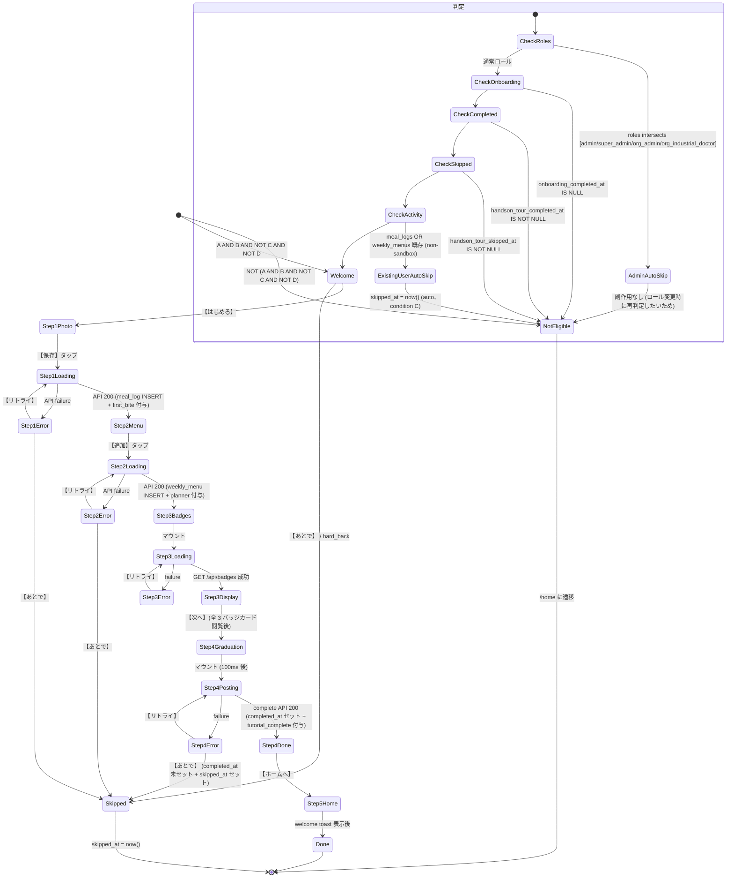

# 08 — 状態管理 / DB スキーマ

> 関連: [01-trigger-flow](./01-trigger-flow.md) / [09-api-spec](./09-api-spec.md) / [21-migration-sql](./21-migration-sql.md) / [17-security](./17-security.md)

---

## 1. DB スキーマ拡張一覧

operator/01-data-model.md (canonical) に追記する DDL の **proposal**。実装時は operator/01 に書き、本ファイルは参照のみとする。

### 1.1 `user_profiles` 拡張

```sql
ALTER TABLE user_profiles
  ADD COLUMN handson_tour_completed_at TIMESTAMPTZ NULL,
  ADD COLUMN handson_tour_skipped_at   TIMESTAMPTZ NULL;
```

#### 1.1.1 列の意味

| 列 | 型 | NULL 許容 | 意味 |
|---|---|---|---|
| `handson_tour_completed_at` | TIMESTAMPTZ | YES | 初回ハンズオン完走時刻。NULL = 未完走 |
| `handson_tour_skipped_at` | TIMESTAMPTZ | YES | 明示スキップ or auto-skip 時刻。NULL = スキップしていない |

#### 1.1.2 不変条件 (CHECK 不要、アプリで保証)

- 同時に両方 NOT NULL は **ありうる** (= force=1 で再表示後にスキップした場合は completed_at + skipped_at 両方持つ可能性)
  - ただし v1 ではこのケースは発生しない設計 (force=1 の skip ボタンは出さないため)
- completed_at が NOT NULL なら以降の表示判定で skipped_at は無視

#### 1.1.3 部分インデックス

```sql
CREATE INDEX idx_user_profiles_handson_tour_pending
  ON user_profiles (user_id)
  WHERE handson_tour_completed_at IS NULL AND handson_tour_skipped_at IS NULL;
```

`should_show` 判定の高速化。pending な user_id だけ index に乗る。

### 1.2 `meal_logs` に `is_sandbox` 追加

```sql
ALTER TABLE meal_logs
  ADD COLUMN is_sandbox BOOLEAN NOT NULL DEFAULT false;
```

#### 1.2.1 用途
- ハンズオン Step 1 で挿入された行を区別
- 通常 UI (週間献立 / 食事一覧) では非表示
- ただしバッジ判定 (first_bite) では cnt 対象

#### 1.2.2 部分インデックス

```sql
CREATE INDEX idx_meal_logs_user_non_sandbox
  ON meal_logs (user_id, eaten_at DESC)
  WHERE is_sandbox = false;
```

通常 UI のクエリは `WHERE is_sandbox = false` を含むので、index pruning で高速化。

### 1.3 `weekly_menus` に `is_sandbox` 追加

```sql
ALTER TABLE weekly_menus
  ADD COLUMN is_sandbox BOOLEAN NOT NULL DEFAULT false;
```

同様の用途。

### 1.4 `badges` seed 追加 (`tutorial_complete`)

```sql
INSERT INTO badges (code, name, description, condition_json)
VALUES (
  'tutorial_complete',
  '使い方マスター',
  'はじめての使い方ガイドを最後まで完走',
  '{"type":"event","event":"handson_tour_completed"}'::jsonb
)
ON CONFLICT (code) DO NOTHING;
```

#### 1.4.1 condition_json の意味

`{"type":"event","event":"handson_tour_completed"}` は将来の自動判定エンジン向け仕様。v1 では使用せず、`POST /api/handson-tour/complete` 内で **明示的に INSERT** する。

将来 condition engine が実装された場合、このバッジは `handson_tour_completed_at` セット時に自動付与される。

#### 1.4.2 icon_url

`icon_url` 列は既存 `badges` テーブルにあり、URL or NULL。v1 では絵文字 🎓 をフォールバック表示するため `icon_url` を NULL のまま実装可能。後でカスタムアイコンが用意できたら UPDATE で URL 設定。

---

## 2. 状態遷移図 (詳細)

### 2.1 mermaid 完全版



### 2.2 主要遷移の DB 副作用

| 遷移 | DB 副作用 |
|---|---|
| Step 1 完了 (Step1Loading → Step2Menu) | `meal_logs` INSERT (`is_sandbox=true`) + `user_badges` INSERT (`first_bite`、未保有時のみ) |
| Step 2 完了 | `weekly_menus` INSERT + `user_badges` INSERT (`planner`) |
| Step 3 表示 | DB 副作用なし (read only) |
| Step 4 完了 | `user_profiles.handson_tour_completed_at` UPDATE + `user_badges` INSERT (`tutorial_complete`) |
| Skipped | `user_profiles.handson_tour_skipped_at` UPDATE |
| ExistingUserAutoSkip | 同上 |
| AdminAutoSkip | 同上 (roles に admin 含むときも skipped_at をセット) |

注: AdminAutoSkip での skipped_at セットは v1 仕様検討中。setting して permanent skip にすると、後でロール変わったら再表示できなくなる。**設定しない方針** に変更:

#### 2.2.1 修正 (admin/super_admin の auto-skip を非永続化)

| ロール | 表示判定 | DB 副作用 |
|---|---|---|
| admin / super_admin / org_admin / org_industrial_doctor | should_show=false | **副作用なし** (ロール変更されたら再判定で表示される) |
| 既存ユーザー (condition C) | should_show=false | `skipped_at = now()` セット (= 今後ハンズオン無効化、UX 一貫性) |

つまり既存ユーザーは恒久 skip、admin はロール依存で動的 skip。

---

## 3. 競合状態の解決

### 3.1 多重端末 卒業 API 呼び出し

シナリオ: ユーザーが iPhone と PC で同時にハンズオン進行 → 両方 Step 4 卒業 API を叩く

#### 解決方法
```sql
-- COALESCE で先勝ちを保証
UPDATE user_profiles
SET handson_tour_completed_at = COALESCE(handson_tour_completed_at, now())
WHERE user_id = $1
RETURNING handson_tour_completed_at;
```

`RETURNING` の `handson_tour_completed_at` を見て:
- リクエスト受付時刻 (now()) と比較
- 1 秒以内なら新規完了、それ以前なら既存完了 (`already_completed: true`)

```sql
-- 厳密版
UPDATE user_profiles
SET handson_tour_completed_at = COALESCE(handson_tour_completed_at, now())
WHERE user_id = $1
RETURNING
  handson_tour_completed_at,
  (handson_tour_completed_at < now() - INTERVAL '500 milliseconds') AS already;
```

### 3.2 バッジ INSERT の冪等性

```sql
INSERT INTO user_badges (user_id, badge_id, obtained_at)
SELECT $1, b.id, now() FROM badges b WHERE b.code = $2
ON CONFLICT (user_id, badge_id) DO NOTHING
RETURNING badge_id;
```

`(user_id, badge_id)` PRIMARY KEY を前提として、ON CONFLICT で重複防止。RETURNING が空なら既存 (= 重複 INSERT 試行)。

### 3.3 Step 1/2 の API 並列呼び出し

シナリオ: Step 1 で【保存】タップ → loading 中に Step 2 へ進めない (UI 上)、ただし back で戻って再度【保存】タップ

#### 解決方法
- クライアント側: 【保存】タップ後 1 秒 disabled (二重タップ防止)
- サーバー側: `meal_logs` の重複は厳密には防げない (タイムスタンプで区別)
- 検出: クライアントが直近 5 秒で sandbox meal_log を持っているかチェック (§17 §24.4)

---

## 4. 中断時のリカバリ (v1: 最初から)

### 4.1 リカバリ方針

v1 では中断後に **Step 0 から再開** する。途中状態の永続化はしない。

理由:
- 90 秒のフローなので中断は稀
- 永続化ロジックの複雑度が体験向上に見合わない
- 中断ユーザーは Step 0 から再開しても 90 秒で終わる

### 4.2 例外: Step 1 完了後の中断

シナリオ: Step 1 で【保存】成功 → アプリ kill → 再起動

問題点:
- `meal_logs` に `is_sandbox=true` で 1 行追加済み
- `user_badges` に first_bite 追加済み (新規ユーザーの場合)
- 再起動で Step 0 から再開すると、Step 1 で再度 INSERT が走る

#### 解決方法 (§24.4 で詳述)
- Step 1 サブステップ 1.6 で API 呼び出し前に「直近 5 分以内に sandbox meal_log を持っているか」チェック
- 既存なら Step 1 完了として扱い、**API 呼ばずに Step 2 へ進める**
- meal_log の重複追加を防ぐ

実装擬似コード:

```ts
async function handleSaveSandbox() {
  const recent = await fetch('/api/meal-logs?recent=5min&sandbox=true').then(r => r.json());
  if (recent.length > 0) {
    // 既存の sandbox 行あり、二重 INSERT 防止
    fireAnalytics('handson_tour_step_skipped_due_to_existing_sandbox', { step: 1 });
    advanceToStep2();
    return;
  }
  // 通常の保存 API 呼び出し
  await fetch('/api/meal-plans/add-from-photo?source=handson_tour', { ... });
  advanceToStep2();
}
```

Step 2 も同様。

---

## 5. RLS (Row Level Security)

### 5.1 既存 RLS

`user_profiles`:
```sql
CREATE POLICY user_profiles_owner_rw ON user_profiles
  USING (auth.uid() = user_id)
  WITH CHECK (auth.uid() = user_id);
```

新規 2 列もこの RLS で保護される (= 自分以外のハンズオン状態を見れない / 変更できない)。

`meal_logs`:
```sql
CREATE POLICY meal_logs_owner_rw ON meal_logs
  USING (auth.uid() = user_id)
  WITH CHECK (auth.uid() = user_id);
```

`is_sandbox` 列も同 RLS。

`user_badges`:
```sql
CREATE POLICY user_badges_owner_r ON user_badges
  FOR SELECT USING (auth.uid() = user_id);

CREATE POLICY user_badges_server_w ON user_badges
  FOR INSERT WITH CHECK (false);  -- クライアント直接 INSERT 不可、API 経由のみ
```

クライアントは badges 直接 INSERT 不可。`POST /api/handson-tour/complete` がサーバー (service_role) で INSERT。

### 5.2 新規追加 RLS

特に追加なし。既存 RLS で十分。

### 5.3 admin / org_admin によるユーザーデータ閲覧

特権ロールがユーザーのハンズオン状態を見たい場合:

```sql
CREATE POLICY user_profiles_admin_r ON user_profiles
  FOR SELECT USING (
    auth.uid() = user_id
    OR EXISTS (
      SELECT 1 FROM user_profiles up
      WHERE up.user_id = auth.uid()
      AND up.roles && ARRAY['admin','super_admin']::text[]
    )
  );
```

ただしこれは family/08-rls-policies.md / cross/02-rls-patterns.md に既存定義がある可能性。本ファイルは concept のみ、canonical は別ファイル。

---

## 6. クライアント状態管理

### 6.1 Tour 全体の state

```ts
type TourState = {
  /** 現在の Step (0-5) */
  currentStep: 0 | 1 | 2 | 3 | 4 | 5;
  /** Step 0 開始時刻 (total_duration_ms 計算用) */
  tourStartTimestamp: number;
  /** entry source (analytics) */
  entrySource: 'auto' | 'settings_force';
  /** 各ステップの dwell time */
  stepDwellMs: Record<number, number>;
  /** force=1 で再表示中か */
  forceMode: boolean;
};
```

### 6.2 永続化先

| データ | 永続化先 | 理由 |
|---|---|---|
| `tourStartTimestamp` | sessionStorage (web) / TempVar (mobile) | total_duration_ms 計算のため、リロード後も維持 |
| `currentStep` | router state (URL) | リロード後の復帰に URL を信頼 |
| `entrySource` | URL query (`force=1` or なし) | 永続化不要、URL のみ |
| `stepDwellMs` | in-memory | 永続化不要、analytics 送信時に消費 |

### 6.3 Tour Context (共有)

```tsx
// src/contexts/TourContext.tsx
import { createContext, useContext } from 'react';

const TourContext = createContext<TourState | null>(null);

export function TourProvider({ children }: { children: React.ReactNode }) {
  // ...
  return <TourContext.Provider value={state}>{children}</TourContext.Provider>;
}

export function useTour() {
  const ctx = useContext(TourContext);
  if (!ctx) throw new Error('useTour must be used within TourProvider');
  return ctx;
}
```

`/handson-tour/layout.tsx` で `<TourProvider>` でラップ。

---

## 7. Tour の終了ハンドリング

### 7.1 正常終了 (Step 4 卒業)
- TourContext を破棄 (provider unmount)
- sessionStorage クリア
- Step 5 (welcome toast) の表示は別 context (= 通常 home の context)

### 7.2 スキップ終了
- skip API 成功後、即 /home に遷移
- TourContext 破棄
- sessionStorage クリア

### 7.3 エラー → 諦め
- Step 4 卒業 API 失敗 → 【あとで】タップ
- skip API 呼び出し
- TourContext 破棄

---

## 8. テストケース (state / DB)

### 8.1 Unit
- `shouldShowHandsonTour()`:
  - 各 condition の組み合わせを 16 通り (2^4) テスト
  - admin role → false
  - 既存ユーザー → false (& side effect: skipped_at セット)

### 8.2 Integration
- migration 実行で 4 つの ALTER 全部適用される
- migration ロールバックで元に戻る
- `tutorial_complete` バッジが seed されている (REPL でクエリ確認)
- 卒業 API 呼び出しで:
  - `user_profiles.handson_tour_completed_at` が NOT NULL になる
  - `user_badges` に tutorial_complete が追加される
  - 同 user で 2 回呼んでも user_badges 行は 1 つ
- skip API で:
  - `user_profiles.handson_tour_skipped_at` が NOT NULL になる
  - `user_profiles.handson_tour_completed_at` は NULL のまま (= 完了していない)

### 8.3 RLS
- 他人の handson_tour_completed_at を読めないことを RLS テストで確認
- 他人の user_badges に INSERT できないことを確認

---

## 9. 残不確実性 (§99 連携)

- [ ] `meal_logs` テーブルの正確な列名 (operator/01-data-model 確認)
- [ ] `weekly_menus` テーブルの正確な列名 (同上)
- [ ] `user_badges` の PRIMARY KEY 構成 (`(user_id, badge_id)` で OK か、別 unique 制約か)
- [ ] admin/super_admin の閲覧 RLS (family/08 既存定義との整合)
- [ ] `target_kcal_per_day` カラムの有無 (operator/01 §user_profiles 確認、なければ計算 helper 関数を新規実装)
- [ ] 中断後の state 復帰: 5 分以内チェックの「5 分」が妥当か (= 二重 INSERT 防止精度)
- [ ] sandbox 行を内部 admin が削除する SQL (operator/09-runbook に記載 or 新規)
