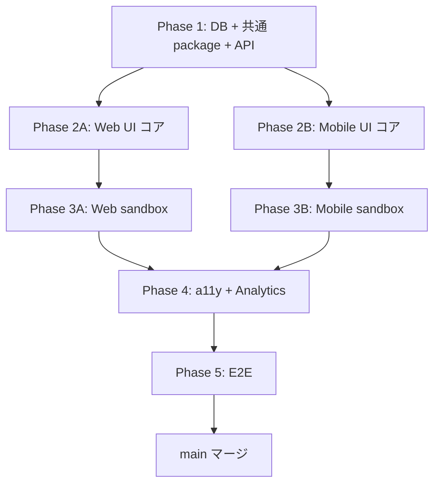

# 16 — ファイル構造とコード差分量

> 関連: [12-phases](./12-phases.md) / [13-integration](./13-integration.md)

---

## 1. 新規ファイル一覧

### 1.1 共通 package (Phase 1)

```
packages/handson-tour-shared/
├── package.json                                  (~30 行)
├── tsconfig.json                                 (~20 行)
├── src/
│   ├── index.ts                                  (~30 行 - re-export)
│   ├── types.ts                                  (~120 行 - Step / Bubble / TourState / SandboxComponentProps 等)
│   ├── steps.ts                                  (~250 行 - Step 0-5 構成データ)
│   ├── mocks.ts                                  (~100 行 - MOCK_PHOTO_RESPONSE / MOCK_MENU_RESPONSE / SAMPLE_MEAL_IMAGE)
│   ├── analytics.ts                              (~150 行 - 6 events Zod schema)
│   ├── personalize.ts                            (~80 行 - {nickname} / {target_kcal} 等の展開)
│   ├── i18n.ts                                   (~250 行 - 81 i18n キー ja v1)
│   ├── constants.ts                              (~80 行 - 数値定数集約)
│   ├── url-routes.ts                             (~30 行 - /handson-tour/{step} path 定義)
│   └── helpers.ts                                (~100 行 - cookingExpToText / safeNickname 等)
└── __tests__/
    ├── personalize.test.ts                       (~150 行)
    ├── analytics.test.ts                         (~80 行)
    ├── i18n-completeness.test.ts                 (~60 行)
    └── mocks-schema.test.ts                      (~60 行)
```

合計: ~1500 行 (新規)

### 1.2 Web UI コア (Phase 2A)

```
src/app/handson-tour/
├── layout.tsx                                    (~50 行 - 共通 layout + マウント時検証)
├── page.tsx                                      (~120 行 - Step 0 ウェルカム)
├── photo/page.tsx                                (~150 行 - Step 1 統合)
├── menu/page.tsx                                 (~150 行 - Step 2 統合)
├── badges/page.tsx                               (~150 行 - Step 3 統合)
└── graduate/page.tsx                             (~180 行 - Step 4 卒業)

src/components/handson-tour/
├── TourOverlay.tsx                               (~280 行 - CSS mask + Framer Motion)
├── TourBubble.tsx                                (~150 行 - 配置ロジック + 矢印)
├── TourProgress.tsx                              (~50 行)
├── TourSandboxWrapper.tsx                        (~100 行 - HOC)
├── ConfettiOverlay.tsx                           (~30 行 - react-confetti wrap)
├── useTourOverlayLogic.ts                        (~150 行)
├── useReducedMotion.ts                           (~30 行)
├── useTour.ts                                    (~50 行 - context hook)
├── TourProvider.tsx                              (~80 行)
└── stories/
    ├── TourOverlay.stories.tsx                   (~120 行)
    ├── TourBubble.stories.tsx                    (~80 行)
    ├── TourProgress.stories.tsx                  (~50 行)
    └── TourSandboxWrapper.stories.tsx            (~100 行)

src/app/api/handson-tour/
├── status/route.ts                               (~120 行)
├── complete/route.ts                             (~120 行)
└── skip/route.ts                                 (~80 行)
```

合計: ~2400 行 (新規)

### 1.3 Mobile UI コア (Phase 2B)

```
apps/mobile/app/handson-tour/
├── _layout.tsx                                   (~40 行)
├── index.tsx                                     (~120 行 - Step 0)
├── photo.tsx                                     (~150 行 - Step 1)
├── menu.tsx                                      (~150 行 - Step 2)
├── badges.tsx                                    (~150 行 - Step 3)
└── graduate.tsx                                  (~180 行 - Step 4)

apps/mobile/src/handson-tour/
├── TourOverlay.tsx                               (~320 行 - MaskedView + Reanimated)
├── TourBubble.tsx                                (~150 行)
├── TourProgress.tsx                              (~50 行)
├── TourSandboxWrapper.tsx                        (~100 行)
├── Confetti.tsx                                  (~120 行 - reanimated 自前実装)
├── useTourOverlayLogic.ts                        (~150 行)
├── useReducedMotion.ts                           (~30 行 - AccessibilityInfo)
├── useTour.ts                                    (~50 行)
└── TourProvider.tsx                              (~80 行)

apps/mobile/assets/handson-tour/
└── sample-meal.jpg                               (asset, copy from karaage.jpg)
```

合計: ~2010 行 + 1 asset (新規)

### 1.4 共通 (両方で使う)

```
public/handson-tour/
└── sample-meal.jpg                               (asset, copy from karaage.jpg)
```

### 1.5 Migration (Phase 1)

```
supabase/migrations/
└── 2026XXXXXXXXXX_handson_tour.sql               (~80 行 - DDL + RPC + seed)
```

### 1.6 Maestro flows (Phase 5)

```
apps/mobile/maestro/flows/tour/
├── 01-handson-completion.yaml                    (~100 行)
├── 02-skip-at-welcome.yaml                       (~25 行)
├── 03-hard-back.yaml                             (~50 行)
├── 04-step1-error-retry.yaml                     (~50 行)
├── 05-step2-menu-success.yaml                    (~60 行 - 01 から続き)
├── 06-step2-menu-error-retry.yaml                (~50 行)
├── 07-step3-badges.yaml                          (~50 行)
├── 08-step4-graduation.yaml                      (~60 行)
├── 09-step4-graduation-retry.yaml                (~50 行)
├── 10-force-replay.yaml                          (~70 行)
├── 11-skip-for-admin.yaml                        (~30 行)
└── 12-skip-for-existing-user.yaml                (~40 行)

apps/mobile/maestro/_shared/
└── login-as-new-user.yaml                        (~30 行 - 既存に追加)
```

合計: ~700 行

### 1.7 Playwright (Phase 5)

```
tests/e2e/tour/
├── fixtures.ts                                   (~80 行 - signupNewUser, loginAsAdmin 等)
├── 01-handson-completion.spec.ts                 (~150 行)
├── 02-skip-at-welcome.spec.ts                    (~30 行)
├── 03-graduation-retry.spec.ts                   (~50 行)
├── 04-force-replay.spec.ts                       (~60 行)
├── 05-skip-for-admin.spec.ts                     (~30 行)
├── 06-skip-for-existing-user.spec.ts             (~40 行)
└── 07-a11y-axe.spec.ts                           (~70 行)
```

合計: ~510 行

### 1.8 CI ワークフロー

```
.github/workflows/
└── handson-tour-tests.yml                        (~80 行)
```

### 1.9 設計書 (本ディレクトリ、既存 + 残)

```
docs/design/family/09-onboarding-handson-tour/
├── README.md                                     (already)
├── 00-overview.md                                (already)
├── 01-trigger-flow.md                            (already)
├── 02-step0-welcome.md                           (already)
├── 03-step1-photo.md                             (already)
├── 04-step2-menu.md                              (already)
├── 05-step3-badges.md                            (already)
├── 06-step4-graduation.md                        (already)
├── 07-components.md                              (already)
├── 08-state-db.md                                (already)
├── 09-api-spec.md                                (already)
├── 10-a11y.md                                    (already)
├── 11-testing.md                                 (already)
├── 12-phases.md                                  (already)
├── 13-integration.md                             (already)
├── 14-mocks-i18n.md                              (already)
├── 15-design-tokens.md                           (already)
├── 16-files-structure.md                         (本ファイル)
├── 17-security.md                                (次)
├── 18-performance.md                             (次)
├── 19-rollout.md                                 (次)
├── 20-observability.md                           (次)
├── 21-migration-sql.md                           (次)
├── 22-analytics.md                               (次)
└── 99-open-questions.md                          (次)
```

---

## 2. 既存ファイル変更箇所

### 2.1 API 拡張 (Phase 1)

| パス | 想定 +/- | 内容 |
|---|---|---|
| `src/app/api/onboarding/complete/route.ts` | +20 / -2 | レスポンスに `next_route` 追加 |
| `src/app/api/meal-plans/add-from-photo/route.ts` | +50 / -5 | `?source` query + `body.sandbox` + 偽装防止 |
| `src/app/api/menu-plans/add/route.ts` | +50 / -5 | 同上 |

### 2.2 UI 既存画面拡張 (Phase 3)

| パス | 想定 +/- | 内容 |
|---|---|---|
| `src/app/(main)/meals/new/page.tsx` | +80 / -0 | `mode='sandbox'` プロップ + Sandbox 派生コンポーネント |
| `apps/mobile/app/meals/new.tsx` | +80 / -0 | 同上 |
| `src/components/ai-assistant/V4GenerateModal.tsx` | +120 / -0 | `mode='sandbox'` + initialFlags + Sandbox 派生 |
| Mobile 版 V4GenerateModal (要確認) | +120 / -0 | 同上 |
| `src/app/(main)/badges/page.tsx` | +60 / -5 | tutorial-mode + highlight + `badge-card-{code}` 動的 testID |
| Mobile 版 badges 画面 (要確認) | +60 / -0 | 同上 |

### 2.3 onboarding / home / settings 連動 (Phase 2)

| パス | 想定 +/- | 内容 |
|---|---|---|
| `src/app/onboarding/complete/page.tsx` | +20 / -3 | `next_route` 経由で遷移 |
| `apps/mobile/app/onboarding/complete.tsx` | +20 / -3 | 同上 |
| `src/app/(main)/home/page.tsx` | +25 / -0 | mount 時 status 確認 |
| `apps/mobile/app/(tabs)/home.tsx` | +25 / -0 | 同上 |
| `src/app/(main)/settings/page.tsx` | +20 / -0 | 再開エントリ追加 |
| `apps/mobile/app/(tabs)/settings.tsx` | +20 / -0 | 同上 |

### 2.4 設計書追記 (canonical 経由)

| パス | 想定 +/- | 内容 |
|---|---|---|
| `docs/design/operator/01-data-model.md` | +60 / -0 | user_profiles 2 列、meal_logs is_sandbox、weekly_menus is_sandbox、badges seed |
| `docs/design/family/02-api-spec.md` | +200 / -0 | API 4 本 + 拡張 3 本 |
| `docs/design/family/03-ui-spec.md` | +50 / -0 | ハンズオン画面群 (本ディレクトリへの参照) |
| `docs/design/cross/03-design-system.md` | +80 / -0 | Coachmark コンポーネント仕様 |
| `docs/design/cross/05-i18n-a11y.md` | +40 / -0 | tour 章 (本ディレクトリへの参照) |
| `docs/design/operator/07-audit-monitoring.md` | +80 / -0 | analytics events (本ディレクトリ §22 参照) |
| `docs/design/mobile/01-architecture.md` | +30 / -0 | ハンズオン routing |
| `docs/seed_badges.sql` | +5 / -0 | tutorial_complete |

### 2.5 設定ファイル

| パス | 想定 +/- | 内容 |
|---|---|---|
| `package.json` (root) | +5 / -0 | workspace に `packages/handson-tour-shared/` 追加 |
| `apps/mobile/package.json` | +5 / -0 | `@homegohan/handson-tour-shared` を deps に |
| `tsconfig.json` (root) | +3 / -0 | path mapping |
| `apps/mobile/tsconfig.json` | +3 / -0 | 同上 |

### 2.6 既存テスト fix (testID 動的化の影響)

| パス | 想定 +/- |
|---|---|
| `tests/e2e/badges/*.spec.ts` | testID 検索を `badge-card` → `badge-card-{code}` 等に修正 |
| `src/__tests__/badges/*.test.tsx` | 同上 |
| `apps/mobile/__tests__/badges/*.test.tsx` | 同上 |

合計影響: **~100 行修正** (具体数は実装時に grep で確認)

---

## 3. 総コード量サマリ

### 3.1 新規

| カテゴリ | 行数 |
|---|---|
| 共通 package | ~1500 |
| Web UI コア | ~2400 |
| Mobile UI コア | ~2010 |
| Migration | ~80 |
| Maestro flows | ~700 |
| Playwright | ~510 |
| CI | ~80 |
| 設計書 (本ディレクトリ) | ~5000 (推定、現状 17/25 で ~6500 行) |

合計新規: **~12000 行 + 2 アセット**

### 3.2 既存変更

| カテゴリ | 行数 |
|---|---|
| API 拡張 | +120 / -12 |
| UI 既存画面拡張 | +520 / -10 |
| 連動 (onboarding/home/settings) | +130 / -6 |
| 設計書追記 (canonical) | +545 |
| 設定ファイル | +16 |
| 既存テスト fix | ~100 |

合計既存変更: **~1430 行追加、~30 行削除**

### 3.3 grand total

**約 13500 行追加** + 既存 30 行修正 + 2 アセット。

---

## 4. PR 分割戦略 (memory: feedback-modular-monolith-parallel)

memory に従い、30+ ファイル規模なので Opus がモジュール境界で分割し並列 implementer 起動。

### 4.1 PR ごとの行数目安

| PR | Phase | 想定行数 | レビュー時間 |
|---|---|---|---|
| P1-A: DB | 1 | ~150 (migration + seed + RPC) | 30 分 |
| P1-B: 共通 package + API | 1 | ~2000 (package 1500 + API 500) | 2 時間 |
| P2-A: Web UI コア | 2 | ~2400 | 2.5 時間 |
| P2-B: Mobile UI コア | 2 | ~2010 | 2.5 時間 |
| P3-A: Web 既存画面 sandbox | 3 | ~270 | 1 時間 |
| P3-B: Mobile 既存画面 sandbox | 3 | ~260 | 1 時間 |
| P4: a11y + Analytics | 4 | ~300 | 1.5 時間 |
| P5: E2E | 5 | ~1300 (Maestro 700 + Playwright 510 + CI 80) | 1.5 時間 |

合計: 8 PR、レビュー総時間 ~12 時間。

### 4.2 PR レビュー単位の妥当性

- 各 PR が独立して機能 (P1 完了で API は動く、P2A 完了で Web UI は動く)
- レビュアーが 1 PR 30 分-2.5 時間で把握できる規模
- merge 順序は P1 → P2A/B → P3A/B → P4 → P5

### 4.3 PR description テンプレート

```markdown
## Summary
- Phase X (タスク内容)

## 関連設計書
- docs/design/family/09-onboarding-handson-tour/{該当ファイル群}.md

## 変更内容
- {具体的な変更を箇条書き}

## チェックリスト
- [ ] 設計書通りの実装
- [ ] Unit テスト追加 (coverage > 80%)
- [ ] 型チェック pass
- [ ] lint pass
- [ ] CI pass
- [ ] (該当 phase なら) Storybook / Maestro flow 追加
- [ ] (該当 phase なら) operator/01-data-model に DDL canonical 追記
- [ ] レビュー観点 (12-phases.md §8) 確認

## Test plan
- {手動確認ステップ}

## 関連 Issue
- (新規 issue を作成、本 PR で close)
```

---

## 5. ディレクトリ命名規則

### 5.1 設計書

`docs/design/family/09-onboarding-handson-tour/` の番号 09 は family/01-08 の続き (researcher 結果より family/09 が空き)。

### 5.2 コード

- Web: `src/components/handson-tour/` (kebab-case)
- Mobile: `apps/mobile/src/handson-tour/` (kebab-case)
- API: `src/app/api/handson-tour/` (kebab-case)
- ルート: `src/app/handson-tour/` (kebab-case)

統一 prefix: `handson-tour` (kebab-case、英語のみ、文書とコードで同一)。

### 5.3 testID 命名

すべて kebab-case:

- `tour-step-0` (Step 全体)
- `tour-step-0-start` (ボタン)
- `tour-step-0-skip` (ボタン)
- `tour-step-1-intro` (intro 吹き出し)
- `tour-overlay`, `tour-bubble`, `tour-progress-dots`, `tour-next-button`, `tour-skip-button`
- `tour-step-1-saving`, `tour-step-1-error`, `tour-step-1-error-retry`, `tour-step-1-error-skip`
- `meal-camera-button`, `meal-result-screen` (既存、変更なし)
- `v4-no-cook-toggle`, `v4-generate-button`, `v4-result-card` (Web 既存、Mobile 新規)
- `badge-card-first_bite`, `badge-card-planner`, `badge-card-tutorial_complete` (動的、新規)

### 5.4 i18n キー命名

`tour.{section}.{element}` (snake_case、§14-mocks-i18n.md §2.2)

---

## 6. 依存関係グラフ



並列度:
- Phase 1: 1
- Phase 2: 2 (A/B 並列)
- Phase 3: 2 (A/B 並列)
- Phase 4: 1 (a11y / Analytics は別 implementer 並列も可)
- Phase 5: 1

---

## 7. 残不確実性 (§99 連携)

- [ ] Mobile 版 V4GenerateModal の実装場所と行数 (researcher 未確認)
- [ ] Mobile 版 badges 画面の実装場所と行数 (researcher 未確認)
- [ ] 既存 `data-testid="badge-card"` を参照するテストファイル数 (= fix 工数)
- [ ] CI ワークフロー追加で既存 CI への影響 (実行時間増加 ~5-10 分)
- [ ] PR P1-B (共通 package + API、~2000 行) を 2 PR に分割するか (package 単独 + API 単独)
