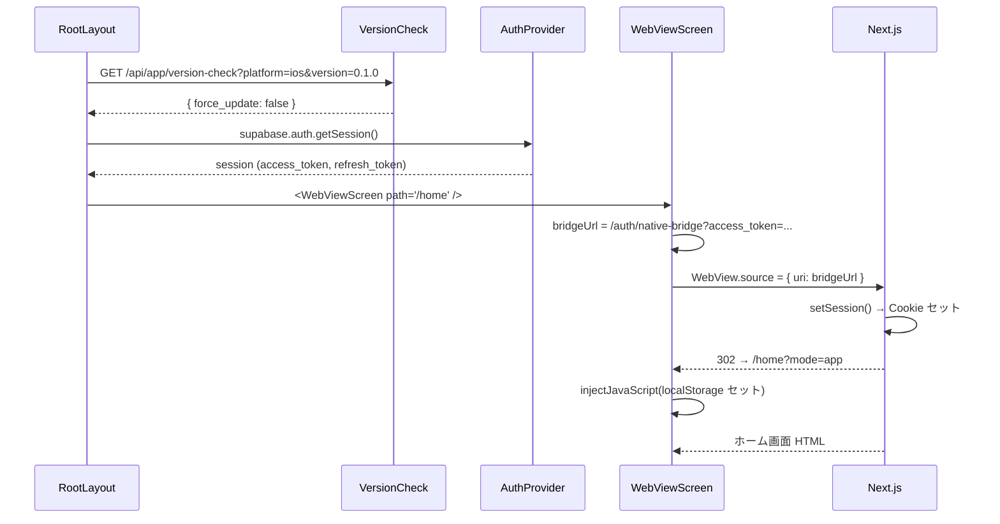
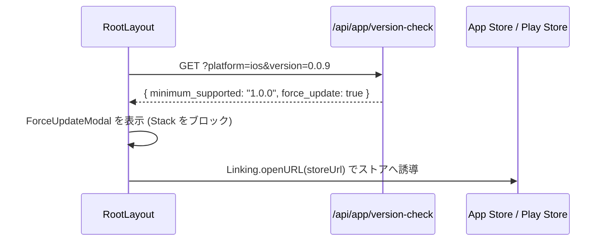

# モバイル App アーキテクチャ設計

## 1. 目的・スコープ

React Native + Expo SDK 53 によるモバイルアプリの全体構成を定義する。
WebView ハイブリッド設計・セッション同期・ビルド設定・強制アップデートを扱う。

**対象外**:
- ディープリンク詳細 → `02-deep-link.md`
- Push 通知詳細 → `03-push-notification.md`
- カメラ/ストレージ詳細 → `04-storage-camera.md`

## 2. 関連要件

- 要件定義 `01-family-management.md §15` (モバイル App 実装要件 全体)
- 要件定義 `01 §15.5` (アプリバージョン強制更新)
- 要件定義 `01 §15.7` (Android FCM / iOS APNs 対応)

## 3. 詳細仕様

### 3.1 技術スタック

| 項目 | 採用 | 備考 |
|------|------|------|
| フレームワーク | React Native (Expo SDK 53) | managed workflow |
| ルーティング | Expo Router v4 (file-based) | `app/` ディレクトリ構成 |
| UI ライブラリ | RN 標準 + `react-native-safe-area-context` | Tailwind 非採用 (Web 側のみ) |
| WebView | `react-native-webview` | WebView ハイブリッドの核 |
| ストレージ | `expo-secure-store` (セッション) / `@react-native-async-storage/async-storage` (設定) | |
| 通知 | `expo-notifications` | APNs / FCM 自動振り分け |
| カメラ | `expo-image-picker` | iOS 18 カメラバグ回避のためネイティブ必須 |
| フォント | `@expo-google-fonts/noto-sans-jp` | 既存 |
| ビルド | EAS Build (Expo Application Services) | |
| 配布 | Apple Configurator 2 → TestFlight → App Store | |

### 3.2 WebView ハイブリッド設計

#### 方針

ほめゴハンの全 UI の約 80% は Web 側 (`src/app/` = Next.js App Router) で実装する。
Mobile はそれを `WebViewScreen` コンポーネント経由で表示するラッパーとなる。
ネイティブ専用画面は以下に限定する:

| ネイティブ画面 | ファイル | 理由 |
|-------------|---------|------|
| タブバー + タブ画面群 | `app/(tabs)/` | OS ネイティブタブ UX |
| 家族招待受諾 | `app/family/invite-accept.tsx` | ディープリンクを直接受け取る |
| 組織招待受諾 | `app/org/invite-accept.tsx` | 同上 |
| 認証画面群 | `app/(auth)/` | Supabase Auth セッション初期取得 |
| 設定画面 | `app/(tabs)/settings.tsx` | 通知権限・ログアウト等の OS API |

#### WebViewScreen の役割

`src/components/web/WebViewScreen.tsx` が担う処理:

1. **セッションブリッジ URL 生成**: ネイティブ SecureStore からトークンを読み、`/auth/native-bridge?access_token=...&next=PATH` へリダイレクト
2. **localStorage 注入**: `injectedJavaScriptBeforeContentLoaded` で `sb-{ref}-auth-token` を localStorage にセット (クライアント Supabase JS SDK 用)
3. **タブ間ナビゲーション intercept**: `buildTabInterceptScript` を inject し、別タブへの `<a>` クリックを `postMessage` で捕捉して Expo Router に委譲
4. **SPA pushState hook**: `history.pushState` を override し programmatic ナビゲーションも interceptor に流す
5. **ダウンロード処理**: Web 側 `postMessage({ type: 'download' })` を受け取り `expo-sharing` で共有
6. **タブ再タップ時リセット**: `navigation.addListener('tabPress')` でアクティブ WebView を初期 URL へ `window.location.replace`

#### postMessage プロトコル (Web → Native)

```typescript
// Web 側から送信するメッセージ型
type WebToNativeMessage =
  | { type: 'tab-navigate'; path: string; fullPath: string }
  | { type: 'navigate-back' }
  | { type: 'download'; filename: string; content: string; mimeType: string }
  | { type: 'open-image-picker'; mode: 'camera' | 'library'; context: UploadContext }
  | { type: 'upload-meal-photo'; familyGroupId?: string };

// Native → Web (injectJavaScript 経由)
type NativeToWebMessage =
  | { type: 'upload-complete'; url: string; path: string }
  | { type: 'upload-error'; code: string; message: string }
  | { type: 'session-expired' };
```

`open-image-picker` と `upload-meal-photo` は `nativeBridge.ts` (新規実装) で処理し、
カメラ起動 → Supabase Storage アップロード → `upload-complete` で Web 側に URL を返す。

### 3.3 セッション同期

WebView ハイブリッドにおける最大の課題は「ネイティブ側セッション ↔ WebView 内 Web セッション」の同期である。

#### ログイン時フロー

```
1. ユーザーがネイティブ認証画面でメール/パスワードを入力
2. Supabase Auth → access_token + refresh_token 取得
3. ネイティブ側: expo-secure-store に保存 (AuthProvider)
4. WebViewScreen: SecureStore からトークンを読み出し
5. WebViewScreen: /auth/native-bridge?access_token=X&refresh_token=Y&next=/home を WebView に表示
6. native-bridge (Next.js Route): Supabase setSession → Cookie にセット → next へリダイレクト
7. WebViewScreen: injectedJavaScriptBeforeContentLoaded で localStorage にも sb-{ref}-auth-token をセット
8. これ以降 WebView 内 Supabase JS SDK は有効セッション状態
```

#### ログアウト時フロー

```
1. settings.tsx の handleLogout 呼び出し
2. clearUserScopedAsyncStorage(userId) でユーザースコープ AsyncStorage 全削除
3. supabase.auth.signOut() → ネイティブ SecureStore のトークン削除
4. WebView 内 localStorage も次回ロード時に bridge 未通過のため空になる
5. router.replace('/') → index.tsx がログイン画面へリダイレクト
```

#### セッションリフレッシュ

- ネイティブ側: `AuthProvider` が `supabase.auth.onAuthStateChange` を listen し、自動リフレッシュ
- WebView 側: Next.js middleware の `updateSession()` が Cookie を自動リフレッシュ
- トークン期限切れ時: Native → `injectJavaScript` で `{ type: 'session-expired' }` をポスト → Web 側でログアウト処理

## 4. データモデル

セッション同期専用のデータは既存テーブルを使用。新規マイグレーション不要。

```sql
-- 既存テーブル: セッション関連
-- user_push_tokens: Push Token 登録 (03-push-notification.md で詳細)
-- notification_preferences: 通知設定 (03-push-notification.md で詳細)
```

バージョンチェック用 API は DB テーブルではなく環境変数から動的に返す:

```typescript
// src/app/api/app/version-check/route.ts (新規)
// GET /api/app/version-check?platform=ios&version=1.2.3
// Response: { minimum_supported: "1.0.0", current: "1.2.3", force_update: false }
```

## 5. シーケンス

### 5.1 アプリ起動からホーム表示まで



### 5.2 強制アップデートモーダル



## 6. ファイル構成

```
apps/mobile/
├── app/                              # Expo Router (ページ)
│   ├── _layout.tsx                  # 既存 + Linking.addEventListener 追加 (02-deep-link.md)
│   ├── index.tsx                    # ルートリダイレクト
│   ├── (auth)/                      # ネイティブ認証画面
│   ├── (tabs)/                      # ネイティブタブバー
│   │   ├── _layout.tsx
│   │   ├── home.tsx                 # WebViewScreen path="/home"
│   │   ├── menus.tsx                # WebViewScreen path="/menus"
│   │   ├── meals.tsx                # WebViewScreen path="/meals"
│   │   ├── health.tsx               # WebViewScreen path="/health"
│   │   └── settings.tsx             # ネイティブ設定画面 (OS API 使用)
│   ├── family/
│   │   └── invite-accept.tsx        # 新規: homegohan://invite/family/{token}
│   └── org/
│       └── invite-accept.tsx        # 新規: homegohan://invite/org/{token}
│
├── src/
│   ├── components/
│   │   └── web/
│   │       └── WebViewScreen.tsx    # 既存 (メンテナンス)
│   ├── lib/
│   │   ├── supabase.ts              # 既存
│   │   ├── api.ts                   # 既存
│   │   ├── deeplink.ts              # 既存 + parseInviteLink() 追加 (02-deep-link.md)
│   │   ├── pushNotifications.ts     # 既存 + setBadgeCountAsync 追加 (03-push-notification.md)
│   │   ├── storage.ts               # 既存 + uploadMealPhoto() 追加 (04-storage-camera.md)
│   │   └── nativeBridge.ts          # 新規: Web ↔ Native 通信ハブ
│   ├── providers/
│   │   ├── AuthProvider.tsx         # 既存
│   │   └── ProfileProvider.tsx      # 既存
│   └── theme/                       # 既存
│
├── app.json                         # scheme: "homegohan" 設定済み
└── eas.json                         # preview/production プロファイル定義済み
```

## 7. ビルド設定

### 7.1 app.json 概要

```json
{
  "expo": {
    "name": "ほめゴハン",
    "slug": "homegohan",
    "scheme": "homegohan",
    "version": "0.1.0",
    "ios": {
      "bundleIdentifier": "com.homegohan.app",
      "infoPlist": {
        "NSCameraUsageDescription": "食事写真を撮影するためにカメラを使用します。",
        "NSPhotoLibraryUsageDescription": "食事写真を選択するために写真ライブラリを使用します。"
      }
    },
    "android": {
      "package": "com.homegohan.app",
      "permissions": ["android.permission.CAMERA", "android.permission.POST_NOTIFICATIONS"]
    },
    "plugins": ["expo-router", "expo-image-picker", "expo-notifications"]
  }
}
```

`scheme: "homegohan"` は既に設定済みのため、ディープリンク `homegohan://` は追加設定不要。

### 7.2 EAS Build プロファイル

```
development  → developmentClient + iOS simulator + channel: development
preview      → internal distribution + iOS .ipa (Apple Configurator 2) + Android .apk
production   → App Store submission + Android .aab
```

`eas.json` の既存設定で対応済み。新規追加が必要な環境変数:

| 変数 | プロファイル | 用途 |
|------|-----------|------|
| `EXPO_FCM_SERVER_KEY` | preview / production | Android FCM サーバーキー (新規) |
| `EXPO_PUBLIC_EAS_PROJECT_ID` | preview / production | Expo Push Token 取得 (既存) |
| `EXPO_PUBLIC_WEB_URL` | 全プロファイル | WebView ベース URL (既存) |
| `EXPO_PUBLIC_SUPABASE_URL` | 全プロファイル | Supabase URL (既存) |

**EAS Secret 登録コマンド** (iOS APNs キーは登録済み):
```bash
# Android FCM Server Key (新規)
eas secret:create --scope project --name EXPO_FCM_SERVER_KEY --value "YOUR_FCM_SERVER_KEY"
```

### 7.3 配布フロー

```
開発: eas build --platform ios --profile development --local
      → Apple Configurator 2 で USB インストール

Preview: eas build --platform ios --profile preview --local
         → Apple Configurator 2 で実機テスト
         eas build --platform android --profile preview
         → adb install で Android 実機テスト

本番: eas build --platform ios --profile production
     eas submit --platform ios
     eas build --platform android --profile production
     eas submit --platform android
```

## 8. 強制アップデート

破壊的 API 変更 (snake_case 統一・エンドポイントリネーム等) で旧バージョンのアプリが動作不能になる際に強制更新ダイアログを表示する。

### API 仕様

```
GET /api/app/version-check?platform=ios&version=0.1.0

Response 200:
{
  "minimum_supported": "1.0.0",
  "current": "1.2.0",
  "force_update": false
}
```

`force_update: true` の場合、RootLayout でモーダルを表示して操作をブロックし、
App Store / Play Store のアプリページへ誘導する。

### 実装箇所

- API: `src/app/api/app/version-check/route.ts` (新規)
  - 環境変数 `MINIMUM_SUPPORTED_VERSION`, `CURRENT_APP_VERSION` から返す
- ネイティブ: `app/_layout.tsx` にて起動直後に `fetch('/api/app/version-check')` を呼び出す
  - `force_update: true` なら `<ForceUpdateModal>` を Stack の上に被せてレンダリングをブロック

```typescript
// app/_layout.tsx への追加イメージ
const [forceUpdate, setForceUpdate] = useState(false);

useEffect(() => {
  (async () => {
    try {
      const res = await fetch(`${API_BASE}/api/app/version-check?platform=${Platform.OS}&version=${appVersion}`);
      const data = await res.json();
      if (data.force_update) setForceUpdate(true);
    } catch {
      // ネットワークエラー時はスキップ (オフライン対応)
    }
  })();
}, []);
```

## 9. エラーハンドリング

| シナリオ | 対処 |
|---------|------|
| WebView 読み込み失敗 | `renderLoading` スピナー + タイムアウト後リトライボタン |
| セッション取得失敗 | `uri = WEB_BASE_URL + path?mode=app` (未ログイン状態で表示) |
| バージョンチェック API エラー | スキップして起動継続 (オフライン対応) |
| native-bridge リダイレクトエラー | Web 側で 500 → WebView がエラーページ → ネイティブで再ロード |

## 10. テスト方針

| レベル | ツール | カバレッジ |
|--------|--------|-----------|
| Unit | Jest (RNTL) | `nativeBridge.ts` のメッセージ解析、セッションブリッジ URL 生成 |
| Integration | Jest + MSW | バージョンチェック API レスポンス処理 |
| E2E | Maestro | アプリ起動 → ホーム表示 → ログアウト |
| Manual | Apple Configurator 2 | 実機での WebView/カメラ/Push |

## 11. 既存実装との関連

### 保持

- `apps/mobile/` 全体 (ファイル構成・WebView ハイブリッド設計)
- `src/components/web/WebViewScreen.tsx` (既存実装そのまま。`postMessage` ハンドラー追加のみ)
- `src/providers/AuthProvider.tsx`, `ProfileProvider.tsx`
- `app/(tabs)/` 全画面
- `app.json` の `scheme: "homegohan"` 設定

### 修正

- `app/_layout.tsx`: Linking.addEventListener 追加 + バージョンチェック呼び出し追加
- `src/components/web/WebViewScreen.tsx`: `onMessage` ハンドラーに `open-image-picker` / `upload-meal-photo` 追加

### 新規

- `app/family/invite-accept.tsx`
- `app/org/invite-accept.tsx`
- `src/lib/nativeBridge.ts`
- `src/app/api/app/version-check/route.ts` (Web 側)

## 12. ハンズオンチュートリアル ルーティング (family/09 連携)

family/09 初回オンボーディングハンズオンチュートリアルが Mobile 側に追加するルーティング・コンポーネント・コンテキストの canonical。詳細(行数目安、ファイル一覧、テスト fixture)は family/09 §16-files-structure.md 参照。

### 12.1 Expo Router 経路

家族・組織の WebView ハイブリッドとは異なり、ハンズオンチュートリアルは **ネイティブ画面** で実装する(WebView ではない)。理由は family/09 設計書 §00 §3:

- Spotlight overlay の精度確保(`MaskedView` + Reanimated v3 ネイティブ実装が必要)
- iOS Dynamic Type AX5 (2.85x) 対応のため、WebView 内 CSS では制御困難
- 紙吹雪アニメーション(Step 4)を 60fps で出すため

| ルート | ファイル | 用途 |
|---|---|---|
| `/handson-tour` | `apps/mobile/app/handson-tour/_layout.tsx` | TourProvider でラップする layout |
| `/handson-tour` (index) | `apps/mobile/app/handson-tour/index.tsx` | Step 0 ウェルカム |
| `/handson-tour/photo` | `apps/mobile/app/handson-tour/photo.tsx` | Step 1 写真追加 sandbox |
| `/handson-tour/menu` | `apps/mobile/app/handson-tour/menu.tsx` | Step 2 AI 献立 sandbox |
| `/handson-tour/badges` | `apps/mobile/app/handson-tour/badges.tsx` | Step 3 バッジ確認 |
| `/handson-tour/graduate` | `apps/mobile/app/handson-tour/graduate.tsx` | Step 4 卒業 |

Step 5(welcome toast)は通常 `/home` 復帰後にネイティブ Toast として表示。

### 12.2 ディープリンク

`homegohan://handson-tour` および `homegohan://handson-tour?force=1` を受け付ける。`apps/mobile/src/lib/deeplink.ts`(既存ファイル)の `parseInviteLink()` 列に handson-tour 分岐を追加。

ただし Phase 1 では deep link は未公開、`/settings` の「使い方ガイドをもう一度見る」リンクのみが `router.push('/handson-tour?force=1')` で再表示する仕組み(family/03 §11.6)。

### 12.3 新規 Mobile 側ファイル

```
apps/mobile/
├── app/handson-tour/
│   ├── _layout.tsx
│   ├── index.tsx              # Step 0
│   ├── photo.tsx              # Step 1
│   ├── menu.tsx               # Step 2
│   ├── badges.tsx             # Step 3
│   └── graduate.tsx           # Step 4
└── src/handson-tour/
    ├── TourOverlay.tsx        # MaskedView + Reanimated
    ├── TourBubble.tsx
    ├── TourProgress.tsx
    ├── TourSandboxWrapper.tsx
    ├── Confetti.tsx           # Step 4 紙吹雪 (Reanimated 自前)
    ├── useTourOverlayLogic.ts
    ├── useReducedMotion.ts    # AccessibilityInfo.isReduceMotionEnabled()
    └── index.ts
```

加えて:
- `apps/mobile/src/contexts/TourContext.tsx` 新規(Tour 全体 state)
- `apps/mobile/assets/handson-tour/sample-meal.jpg` 新規(~200KB、Web から cp)

詳細行数目安は family/09 §16-files-structure.md §1.3 参照(合計 ~1740 行)。

### 12.4 既存ファイル修正

| 既存ファイル | 修正内容 |
|---|---|
| `apps/mobile/src/components/menu/V4GenerateModal.tsx` (642 行) | `mode='sandbox'` prop 対応 + sandbox 用 props 受信(§99 §1.2 Q9) |
| `apps/mobile/app/badges/index.tsx` (109 行) | `tutorialMode` prop + `badge-card-{code}` 動的 testID + ハイライト演出追加(§99 §1.2 Q10) |
| `apps/mobile/app/(tabs)/settings.tsx` 等の settings 画面 | 「使い方ガイドをもう一度見る」行追加(family/03 §11.6) |
| `apps/mobile/app/meals/new.tsx`(新規 or 既存改修) | `?source=handson_tour&sandbox=true` クエリ受信時に Tour overlay 連動 |
| `apps/mobile/src/lib/posthog.ts`(新規) | `posthog-react-native` 初期化(operator/07 §15.1) |

### 12.5 共通 package との連携

`packages/handson-tour-shared/`(workspace package)を `apps/mobile/package.json` の dependencies に追加:

```json
{
  "dependencies": {
    "@homegohan/handson-tour-shared": "workspace:*"
  }
}
```

mock データ・型・i18n・analytics ヘルパーはすべて此処から import。Web/Mobile で重複実装しない(設計書 §99 §1.1 確定)。

### 12.6 ネイティブ依存追加

| パッケージ | 用途 | 既存 / 新規 |
|---|---|---|
| `@react-native-masked-view/masked-view` | TourOverlay の Spotlight 穴抜き | 新規(EAS Build 設定で nativewind / linking 必要) |
| `react-native-reanimated` v3 | 入場 / spotlight 移動 / 紙吹雪 | 既存(確認要) or 新規 |
| `posthog-react-native` | Analytics 配信 | 新規 |

EAS Build 前にローカル `npm ci` + 型チェック必須(lock 不整合・型エラーは静的に潰すこと、CI 待ちで検出する運用は不可)。

### 12.7 a11y 要件 (Mobile 固有)

- iOS Dynamic Type AX5 (2.85x) で TourBubble がはみ出ないこと(§99 Q17 open、Phase 4 で実機検証)
- VoiceOver / TalkBack で各 Step タイトル → 本文 → primary action の順
- `AccessibilityInfo.isReduceMotionEnabled()` 購読で reduced-motion 対応
- ハードバック(Android)は `BackHandler` で skip API 発火

### 12.8 テスト方針

Maestro flow を `apps/mobile/maestro/flows/tour/` 配下に 12 件追加(family/09 §16 §1.7):

| flow | 内容 |
|---|---|
| `01-handson-completion.yaml` | 正常系(Step 0 → 4 完走) |
| `02-skip-at-welcome.yaml` | Step 0 でスキップ |
| `03-hard-back.yaml` | ハードバックで skip |
| `04-step1-error-retry.yaml` | Step 1 API 失敗 → リトライ |
| `05-step2-menu-success.yaml` | Step 2 正常 |
| `06-step2-error-retry.yaml` | Step 2 API 失敗 → リトライ |
| `07-step3-badges.yaml` | Step 3 バッジ表示 |
| `08-step4-graduation.yaml` | Step 4 卒業 |
| `09-step4-retry.yaml` | Step 4 API 失敗 → リトライ |
| `10-force-replay.yaml` | force=1 再表示 |
| `11-admin-skip.yaml` | admin ロール auto-skip |
| `12-existing-user-skip.yaml` | 既存ユーザー auto-skip |

ハンズオン Maestro 着手は Issue #626(testID 不足)/ #627(Maestro stuck)解消後に並列着手。

## 13. 未解決事項

| 項目 | 優先度 | 担当 |
|------|--------|------|
| Android FCM 動作確認 (実機テスト) | 高 | `notify-push` Edge Function 実装前に確認必須 |
| iOS 18 カメラ dismiss バグの根本解消 | 高 | `04-storage-camera.md` に詳細 |
| Universal Links 対応 (Phase 2) | 低 | Apple Configurator 2 配布が続く間は不要 |
| Biometric 認証 (Face ID / Touch ID) | 中 | `cross/01-auth-session.md` Phase 2 予定 |
| OTA Update (expo-updates) | 低 | `app.json` で `enabled: false` のまま。大型変更時に検討 |
