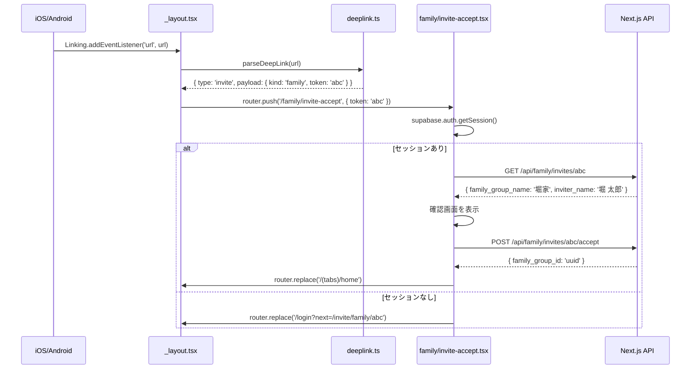
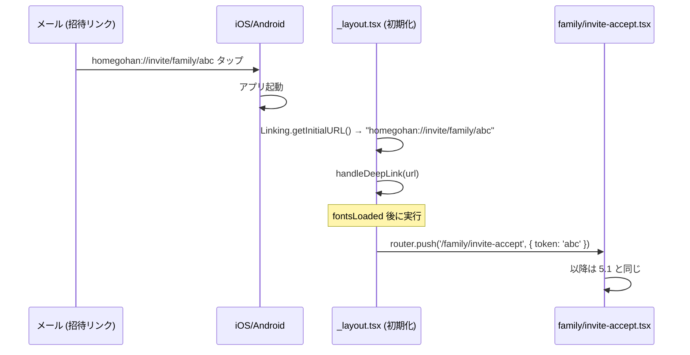

# ディープリンク設計

## 1. 目的・スコープ

`homegohan://` カスタムスキームによるディープリンクの設計を定義する。
招待リンクの受信・解析・受諾画面実装を扱う。

**対象外**:
- Supabase Auth のメール確認リンク (`homegohan://callback#access_token=...`) → 既存 `deeplink.ts` で対応済み
- Universal Links (`https://homegohan.app/...`) → Apple Configurator 2 配布のため Phase 2 以降

## 2. 関連要件

- 要件定義 `01-family-management.md §15.1` (ディープリンク招待受諾)
- `family/02-api-spec.md` の `POST /api/family/invites/{token}/accept`
- `org/02-api-spec.md` の `POST /api/org/invites/{token}/accept`

## 3. 詳細仕様

### 3.1 URL スキーム定義

```
homegohan://                          アプリ起動 (ルート)
homegohan://invite/family/{token}     家族グループ招待受諾
homegohan://invite/org/{token}        組織招待受諾
homegohan://callback#access_token=... Supabase Auth 認証コールバック (既存)
```

`app.json` に `scheme: "homegohan"` が既に設定済みのため、iOS/Android とも追加設定不要。

### 3.2 URL パーサー (`src/lib/deeplink.ts` 拡張)

既存の `deeplink.ts` は Supabase Auth コールバック専用 (`extractSupabaseLinkParams`)。
招待リンク解析用の関数を追加する。

```typescript
// src/lib/deeplink.ts に追加する型と関数

export type InviteDeepLink =
  | { kind: 'family'; token: string }
  | { kind: 'org'; token: string };

export type DeepLinkParseResult =
  | { type: 'invite'; payload: InviteDeepLink }
  | { type: 'auth-callback'; payload: SupabaseLinkParams }
  | { type: 'unknown' };

/**
 * homegohan:// URL を解析して種別と payload を返す
 * @param url 受信した URL 文字列
 */
export function parseDeepLink(url: string): DeepLinkParseResult {
  // homegohan://invite/family/TOKEN123
  const familyMatch = url.match(/^homegohan:\/\/invite\/family\/([A-Za-z0-9_-]+)/);
  if (familyMatch) {
    return { type: 'invite', payload: { kind: 'family', token: familyMatch[1] } };
  }

  // homegohan://invite/org/TOKEN456
  const orgMatch = url.match(/^homegohan:\/\/invite\/org\/([A-Za-z0-9_-]+)/);
  if (orgMatch) {
    return { type: 'invite', payload: { kind: 'org', token: orgMatch[1] } };
  }

  // homegohan://callback#access_token=... (既存 Supabase Auth)
  if (url.includes('callback')) {
    const params = extractSupabaseLinkParams(url);
    if (params.access_token || params.code || params.token_hash) {
      return { type: 'auth-callback', payload: params };
    }
  }

  return { type: 'unknown' };
}
```

### 3.3 ハンドラー (`app/_layout.tsx`)

アプリが未起動の場合と起動済みの場合で 2 つの取得経路がある。

```typescript
// app/_layout.tsx に追加するコード

import * as Linking from 'expo-linking';
import { parseDeepLink } from '../src/lib/deeplink';

// 起動済み時のリスナー
useEffect(() => {
  const subscription = Linking.addEventListener('url', ({ url }) => {
    handleDeepLink(url);
  });
  return () => subscription.remove();
}, []);

// アプリ未起動時の初期 URL 取得
useEffect(() => {
  Linking.getInitialURL().then((url) => {
    if (url) handleDeepLink(url);
  });
}, []);

function handleDeepLink(url: string) {
  const result = parseDeepLink(url);
  if (result.type === 'invite') {
    const { kind, token } = result.payload;
    if (kind === 'family') {
      router.push({ pathname: '/family/invite-accept', params: { token } });
    } else if (kind === 'org') {
      router.push({ pathname: '/org/invite-accept', params: { token } });
    }
  } else if (result.type === 'auth-callback') {
    // 既存の Supabase Auth コールバック処理 (AuthProvider 側で対応)
  }
}
```

**注意点**:
- `Linking.getInitialURL()` は非同期のため、フォントロード後 (`fontsLoaded` が `true` になった後) に呼び出すこと
- `router.push` は Expo Router の Stack が初期化されてから呼び出す必要がある → `useEffect` 内で `fontsLoaded` を依存に含める

### 3.4 家族招待受諾画面 (`app/family/invite-accept.tsx` 新規)

```typescript
// app/family/invite-accept.tsx
// homegohan://invite/family/{token} の受諾 UI

import { useLocalSearchParams, router } from 'expo-router';
import { useEffect, useState } from 'react';
import { View, Text, ActivityIndicator, Alert, Pressable } from 'react-native';
import { supabase } from '../../src/lib/supabase';

type Status = 'loading' | 'confirm' | 'accepting' | 'success' | 'error';

type InviteInfo = {
  family_group_name: string;
  inviter_name: string;
  expires_at: string;
};

export default function FamilyInviteAcceptScreen() {
  const { token } = useLocalSearchParams<{ token: string }>();
  const [status, setStatus] = useState<Status>('loading');
  const [inviteInfo, setInviteInfo] = useState<InviteInfo | null>(null);
  const [errorCode, setErrorCode] = useState<string | null>(null);

  useEffect(() => {
    fetchInviteInfo();
  }, [token]);

  async function fetchInviteInfo() {
    try {
      const { data: sessionData } = await supabase.auth.getSession();
      if (!sessionData.session) {
        // 未ログイン: ログイン画面へリダイレクト (token をクエリで渡す)
        router.replace({
          pathname: '/login',
          params: { next: `/invite/family/${token}` },
        });
        return;
      }

      // 招待情報を取得 (token の有効性確認)
      const res = await fetch(`${API_BASE}/api/family/invites/${token}`, {
        headers: { Authorization: `Bearer ${sessionData.session.access_token}` },
      });
      const data = await res.json();

      if (!res.ok) {
        setErrorCode(data.error?.code ?? 'UNKNOWN');
        setStatus('error');
        return;
      }

      setInviteInfo(data);
      setStatus('confirm');
    } catch {
      setErrorCode('NETWORK_ERROR');
      setStatus('error');
    }
  }

  async function handleAccept() {
    if (!token) return;
    setStatus('accepting');
    try {
      const { data: sessionData } = await supabase.auth.getSession();
      const res = await fetch(`${API_BASE}/api/family/invites/${token}/accept`, {
        method: 'POST',
        headers: {
          Authorization: `Bearer ${sessionData.session?.access_token}`,
          'Content-Type': 'application/json',
        },
      });
      const data = await res.json();

      if (!res.ok) {
        setErrorCode(data.error?.code ?? 'ACCEPT_FAILED');
        setStatus('error');
        return;
      }

      setStatus('success');
      // 成功: 家族タブへ遷移
      setTimeout(() => router.replace('/(tabs)/home'), 2000);
    } catch {
      setErrorCode('NETWORK_ERROR');
      setStatus('error');
    }
  }

  // ... UI レンダリング (status に応じて表示を切り替え)
}
```

### 3.5 組織招待受諾画面 (`app/org/invite-accept.tsx` 新規)

家族招待受諾とほぼ同構成。エンドポイントのみ異なる。

```typescript
// app/org/invite-accept.tsx
// homegohan://invite/org/{token} の受諾 UI

// 主な差分:
// - API: POST /api/org/invites/{token}/accept
// - 取得情報: organization_name, inviter_name, role (org_member等)
// - 成功後遷移先: /(tabs)/home (または org ダッシュボード)
```

### 3.6 API 呼び出し詳細

```
# 招待情報取得 (確認画面用)
GET /api/family/invites/{token}
Authorization: Bearer {access_token}

Response 200:
{
  "token": "...",
  "family_group_name": "堀家",
  "inviter_name": "堀 太郎",
  "expires_at": "2026-05-14T12:00:00Z",
  "status": "pending"
}

# 招待受諾
POST /api/family/invites/{token}/accept
Authorization: Bearer {access_token}

Response 200:
{
  "family_group_id": "uuid",
  "family_group_name": "堀家",
  "member_id": "uuid"
}

# 組織版
GET /api/org/invites/{token}
POST /api/org/invites/{token}/accept
```

## 4. データモデル

ディープリンク処理自体は DB スキーマ変更不要。
招待トークンは `family_invites` / `organization_invites` テーブルに格納される (family/org ドメイン定義)。

```sql
-- 参照: family/01-data-model.md
-- family_invites テーブル (family ドメインで定義)
-- id, family_group_id, token, invitee_email, status, expires_at, created_by

-- 参照: org/01-data-model.md
-- organization_invites テーブル (org ドメインで定義)
-- id, organization_id, token, invitee_email, role, status, expires_at, created_by
```

## 5. シーケンス

### 5.1 アプリ起動済み時の招待受諾



### 5.2 アプリ未起動時の招待受諾



## 6. エラーハンドリング

| エラーコード | 状況 | UI 対応 |
|------------|------|---------|
| `INVITE_NOT_FOUND` | token 不正 / 存在しない | 「招待リンクが見つかりません」+ ホームへ戻るボタン |
| `INVITE_EXPIRED` | 有効期限切れ | 「招待の有効期限が切れています」+ 招待者に連絡を促す |
| `INVITE_ALREADY_ACCEPTED` | 既に受諾済み | 「既に家族グループに参加しています」+ ホームへ |
| `INVITE_REVOKED` | 招待が取り消された | 「この招待は無効です」+ ホームへ |
| `FAM_MEMBER_LIMIT_EXCEEDED` | 家族グループ上限超過 | 「グループのメンバー上限に達しています」|
| `ALREADY_IN_FAMILY` | 別の家族グループ所属済み | 「既に別の家族グループに参加しています」|
| `NETWORK_ERROR` | ネットワーク不通 | 「接続を確認してください」+ 再試行ボタン |
| `UNKNOWN` | 予期せぬエラー | 「エラーが発生しました (サポートに連絡)」|

## 7. テスト方針

### Unit テスト (`__tests__/lib/deeplink.test.ts` に追加)

```typescript
describe('parseDeepLink()', () => {
  it('家族招待リンクを正しく解析できる', () => {
    const result = parseDeepLink('homegohan://invite/family/TOKEN123');
    expect(result).toEqual({ type: 'invite', payload: { kind: 'family', token: 'TOKEN123' } });
  });

  it('組織招待リンクを正しく解析できる', () => {
    const result = parseDeepLink('homegohan://invite/org/TOKEN456');
    expect(result).toEqual({ type: 'invite', payload: { kind: 'org', token: 'TOKEN456' } });
  });

  it('Supabase Auth コールバックを識別できる', () => {
    const result = parseDeepLink('homegohan://callback#access_token=AT&refresh_token=RT');
    expect(result.type).toBe('auth-callback');
  });

  it('不明な URL を unknown として返す', () => {
    const result = parseDeepLink('homegohan://unknown/path');
    expect(result.type).toBe('unknown');
  });

  it('ハイフン・アンダースコアを含む token を解析できる', () => {
    const result = parseDeepLink('homegohan://invite/family/tok-en_123');
    expect(result.type).toBe('invite');
    expect((result as any).payload.token).toBe('tok-en_123');
  });
});
```

### E2E テスト (Maestro)

```yaml
# maestro/family-invite-deeplink.yaml
appId: com.homegohan.app
---
- launchApp
- openLink: "homegohan://invite/family/TEST_TOKEN_VALID"
- assertVisible: "堀家への参加を確認"
- tapOn: "参加する"
- assertVisible: "参加しました"
```

E2E 用テストデータ: seed スクリプトで有効な token を DB に挿入してから実行。

## 8. 既存実装との関連

### 保持

- `src/lib/deeplink.ts` の `extractSupabaseLinkParams()` と `SupabaseLinkParams` 型
- `__tests__/lib/deeplink.test.ts` の既存テストケース (全テスト通過を維持)

### 修正

- `src/lib/deeplink.ts`: `parseDeepLink()` と `InviteDeepLink` 型を追加
- `app/_layout.tsx`: `Linking.addEventListener` と `Linking.getInitialURL()` 呼び出しを追加
  - 追加コードは既存の `PushTokenRegistrar` コンポーネントと並置する形で組み込む

### 新規

- `app/family/invite-accept.tsx`
- `app/org/invite-accept.tsx`

## 9. 未解決事項

| 項目 | 優先度 | 担当 |
|------|--------|------|
| Universal Links 対応 (Apple Verified Domains) | 低 | TestFlight / App Store 配布になった時点で検討 |
| メール本文の招待リンク形式: Web URL か `homegohan://` か | 中 | family ドメインの invite メールテンプレートと合わせて決定 (現状は `homegohan://` で統一) |
| 未ログイン → ログイン後の自動受諾フロー | 高 | login 画面に `next` param を渡すだけでは受諾まで自動化されない。ログイン完了後に `/invite/family/{token}` へリダイレクトし Web 側で受諾する形が現実的 |
| Deep link で招待受諾後のバッジ更新 | 中 | Push 通知側 (03-push-notification.md) と連携して既読処理を実装 |
