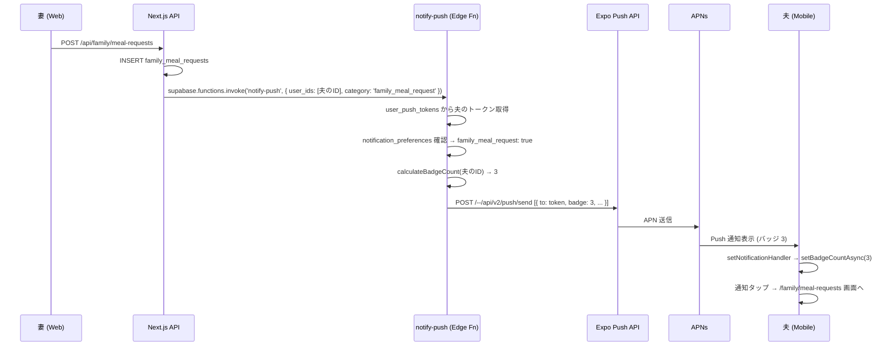
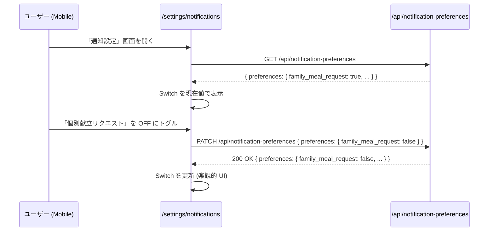

# Push 通知設計

## 1. 目的・スコープ

Expo Push Notifications を使用したプッシュ通知の設計を定義する。
トークン登録・通知ペイロード・バッジカウント・通知種別 on/off・Quiet Hours を扱う。

**対象外**:
- Web 側の通知ベル UI → `family/03-ui-spec.md` / `org/03-ui-spec.md`
- メール通知 (`notify-email` Edge Function) → `operator/08-cron-batches.md`

## 2. 関連要件

- 要件定義 `01-family-management.md §15.3` (Push 通知バッジカウント)
- 要件定義 `01-family-management.md §15.4` (通知種別 on/off)
- 要件定義 `01-family-management.md §15.7` (Android FCM / iOS APNs)

## 3. 詳細仕様

### 3.1 Expo Push 通知の概要

```
送信者 (Next.js / Edge Function)
  → Expo Push API (https://exp.host/--/api/v2/push/send)
    → APNs (iOS) / FCM (Android)
      → ユーザーのデバイス
```

- Expo Push Token 形式: `ExponentPushToken[xxxxxxxxxxxxxxxxxxxxxx]`
- Expo がプラットフォーム差異 (APNs/FCM) を吸収するため、送信側のコードは統一できる
- ただし iOS と Android で通知の表示動作に差異があるため注意 (§3.8 参照)

### 3.2 Push Token 登録

#### 既存実装 (`src/lib/pushNotifications.ts`)

`registerAndSaveExpoPushToken()` 関数が以下を行う:
1. `expo-notifications` で権限確認・リクエスト
2. Android: 通知チャンネル `"default"` 作成
3. `Notifications.getExpoPushTokenAsync({ projectId })` でトークン取得
4. `user_push_tokens` テーブルに `upsert` (onConflict: `user_id,expo_push_token`)

#### DB スキーマ変更 (`user_push_tokens`)

現在の `user_push_tokens` テーブルに `organization_id` 列を追加する。
組織に紐づくユーザーへの通知を効率的に一斉送信するために使用。

```sql
-- マイグレーション: alter_user_push_tokens_add_org.sql
ALTER TABLE user_push_tokens
  ADD COLUMN IF NOT EXISTS organization_id UUID REFERENCES organizations(id) ON DELETE SET NULL,
  ADD COLUMN IF NOT EXISTS device_model TEXT,
  ADD COLUMN IF NOT EXISTS os_version TEXT,
  ADD COLUMN IF NOT EXISTS app_version TEXT;

CREATE INDEX IF NOT EXISTS idx_user_push_tokens_org ON user_push_tokens(organization_id)
  WHERE organization_id IS NOT NULL;
```

`organization_id` は `registerAndSaveExpoPushToken()` 呼び出し時にユーザーの `user_profiles.organization_id` から取得して設定する:

```typescript
// pushNotifications.ts の修正箇所
const { data: profile } = await supabase
  .from('user_profiles')
  .select('organization_id')
  .eq('id', auth.user.id)
  .single();

await supabase.from('user_push_tokens').upsert({
  user_id: auth.user.id,
  expo_push_token: token,
  platform: Platform.OS,
  organization_id: profile?.organization_id ?? null,
  app_version: Constants.expoConfig?.version ?? null,
}, { onConflict: 'user_id,expo_push_token' });
```

### 3.3 ペイロード形式

```typescript
// notify-push Edge Function が送信するペイロード型
type PushPayload = {
  to: string;                    // Expo Push Token
  title: string;                 // 通知タイトル (日本語)
  body: string;                  // 通知本文 (日本語)
  data?: Record<string, unknown>; // アプリ内ルーティング用データ
  badge?: number;                // iOS バッジ数 (サーバー側計算値)
  sound?: 'default' | null;      // 通知音
  categoryIdentifier?: string;   // iOS アクション定義 (§3.4 参照)
  channelId?: string;            // Android チャンネル ID
  priority?: 'default' | 'normal' | 'high';
  ttl?: number;                  // Time-to-live (秒)
};
```

`data` フィールドは通知タップ後の画面遷移に使用する:

```typescript
// 家族献立リクエスト通知の例
{
  type: 'family_meal_request',
  family_group_id: 'uuid',
  request_id: 'uuid',
  deep_link: 'homegohan://family/meal-requests',
}
```

### 3.4 通知種別と categoryIdentifier

| 通知種別 | `categoryIdentifier` | タイトル例 | 本文例 |
|---------|---------------------|-----------|--------|
| 個別献立リクエスト | `family_meal_request` | 「献立リクエストが届きました」| 「{送信者名} さんからリクエスト: {日付}の{食事}」|
| 献立提案完了 | `family_meal_proposed` | 「献立が提案されました」| 「{提案者名} さんが提案: {料理名}」|
| 退職猶予 (凍結警告) | `family_freeze_warning` | 「家族グループについてご確認ください」| 「{家族グループ名} は {N} 日後に凍結されます」|
| 家族凍結 | `family_frozen` | 「家族グループが凍結されました」| 「移行手続きをお願いします」|
| プラン deprecated | `plan_deprecated` | 「ご利用プランの変更について」| 「現在のプランは {日付} に終了します」|
| 試用期間終了 | `trial_ending` | 「試用期間が間もなく終了します」| 「あと {N} 日で試用期間が終了します」|
| ライセンス更新 | `license_renewal` | 「ライセンスの更新が必要です」| 「年間ライセンスが {日付} に期限切れになります」|

### 3.5 バッジカウント設計

#### クライアント側実装

```typescript
// src/lib/pushNotifications.ts に追加

/**
 * アプリアイコンのバッジ数を更新する
 * @param count 新しいバッジ数 (0 でバッジ消去)
 */
export async function setNotificationBadge(count: number): Promise<void> {
  await Notifications.setBadgeCountAsync(count);
}

/**
 * バッジ数をデクリメントする (既読処理)
 * @param decrementBy デクリメント量 (デフォルト 1)
 */
export async function decrementBadge(decrementBy = 1): Promise<void> {
  const current = await Notifications.getBadgeCountAsync();
  const next = Math.max(0, current - decrementBy);
  await Notifications.setBadgeCountAsync(next);
}

// 通知ハンドラーの設定 (アプリ起動時に一度だけ呼び出す)
export function setupNotificationHandler(): void {
  Notifications.setNotificationHandler({
    handleNotification: async (notification) => {
      // ペイロードの badge フィールドでバッジを更新
      const badge = notification.request.content.badge;
      if (typeof badge === 'number') {
        await setNotificationBadge(badge);
      }

      return {
        shouldShowAlert: true,
        shouldPlaySound: true,
        shouldSetBadge: true,
      };
    },
  });
}
```

`setupNotificationHandler()` は `app/_layout.tsx` の `RootLayout` 内で呼び出す:

```typescript
// app/_layout.tsx に追加
import { setupNotificationHandler } from '../src/lib/pushNotifications';

// RootLayout の先頭で呼び出し (コンポーネント外)
setupNotificationHandler();
```

#### サーバー側バッジ計算

`notify-push` Edge Function がペイロードの `badge` フィールドに最新の未読数を付与する。

```typescript
// supabase/functions/notify-push/index.ts (新規)
// バッジ数の計算例

async function calculateBadgeCount(userId: string, supabaseClient: SupabaseClient): Promise<number> {
  // 未確認の家族献立リクエスト数
  const { count: mealRequestCount } = await supabaseClient
    .from('family_meal_requests')
    .select('id', { count: 'exact', head: true })
    .eq('assignee_id', userId)
    .eq('status', 'pending');

  // 提案済みリクエスト (確認待ち) 数
  const { count: proposedCount } = await supabaseClient
    .from('family_meal_requests')
    .select('id', { count: 'exact', head: true })
    .eq('requester_id', userId)
    .eq('status', 'proposed');

  // システム通知 (未読)
  const { count: systemCount } = await supabaseClient
    .from('user_notifications')
    .select('id', { count: 'exact', head: true })
    .eq('user_id', userId)
    .eq('is_read', false);

  return (mealRequestCount ?? 0) + (proposedCount ?? 0) + (systemCount ?? 0);
}
```

#### バッジデクリメントのタイミング

| タイミング | 処理 | 実装箇所 |
|-----------|------|---------|
| 家族タブ表示時 | 家族関連バッジをデクリメント | `app/(tabs)/home.tsx` の `useFocusEffect` |
| 通知タップからの画面遷移後 | 対象 1 件をデクリメント | 各受諾・詳細画面の `useEffect` |
| 「すべて既読」操作 | バッジを 0 にリセット | Web 側の既読 API 呼び出し後 → Native bridge で `setNotificationBadge(0)` |

### 3.6 通知種別 on/off

#### DB スキーマ

```sql
-- 要件 §15.4 の ALTER TABLE
ALTER TABLE notification_preferences
  ADD COLUMN IF NOT EXISTS preferences JSONB
  NOT NULL DEFAULT '{
    "family_meal_request": true,
    "family_meal_proposed": true,
    "family_shared_menu": true,
    "family_shopping_list": true,
    "family_freeze_warning": true,
    "family_frozen": true,
    "plan_deprecated": true,
    "trial_ending": true,
    "license_renewal": true
  }';

-- JSONB のキー存在チェック制約
ALTER TABLE notification_preferences
  ADD CONSTRAINT check_preferences_is_object
  CHECK (jsonb_typeof(preferences) = 'object');
```

#### API 拡張

```
PATCH /api/notification-preferences
Content-Type: application/json

{
  "preferences": {
    "family_meal_request": false,
    "family_meal_proposed": true
  }
}

Response 200:
{
  "preferences": {
    "family_meal_request": false,
    "family_meal_proposed": true,
    ...
  }
}
```

既存の `PATCH /api/notification-preferences` に `preferences` フィールドを追加するだけでよい。
`notifications_enabled: false` の場合は `preferences` の内容に関わらず全通知を送信しない (AND 条件)。

#### ネイティブ設定 UI

`app/(tabs)/settings.tsx` を拡張する。現在は単一 boolean (`notifications_enabled`) のみ。

修正方針:
1. 「通知設定 →」という新しい `SettingRow` を「一般」セクションに追加
2. タップで `/settings/notifications` 専用画面へ遷移 (`app/settings/notifications.tsx` 新規)
3. 専用画面で各種別の Switch を表示

```
settings.tsx (既存) の「一般」セクション変更:
  Before: 通知 [Switch on/off]
  After:  通知設定 [→] (別画面で細かい設定)
          ├ 全体の通知 ON/OFF (設定画面内の最上部)
          ├ 個別献立リクエスト [Switch]
          ├ 献立提案完了 [Switch]
          ├ 家族グループ凍結警告 [Switch]
          ├ プラン変更 [Switch]
          └ ライセンス更新 [Switch]
```

### 3.7 Quiet Hours

**デフォルト**: 22:00-07:00 は緊急通知以外送信しない。

#### サーバー側実装 (`notify-push` Edge Function)

```typescript
// notify-push Edge Function 内の Quiet Hours チェック

const URGENT_CATEGORIES = ['family_frozen', 'license_renewal'];

function isInQuietHours(timezone: string): boolean {
  const now = new Date();
  const hour = parseInt(now.toLocaleTimeString('ja-JP', {
    timeZone: timezone,
    hour: '2-digit',
    hour12: false,
  }));
  return hour >= 22 || hour < 7;
}

// 送信前チェック
if (isInQuietHours(userTimezone) && !URGENT_CATEGORIES.includes(categoryIdentifier)) {
  // Quiet Hours: DB の pending_push_notifications に積んで朝 7:00 に送信
  await scheduleForMorning(payload, userId);
  return;
}
```

`user_profiles` テーブルの `timezone` 列 (または `notification_preferences.quiet_hours_start/end`) を参照。
デフォルト timezone は `'Asia/Tokyo'`。

#### ユーザーカスタマイズ (Phase 2)

現時点では固定 (22:00-07:00)。ユーザー設定 UI は Phase 2 以降。

### 3.8 iOS / Android 差分

| 機能 | iOS | Android |
|------|-----|---------|
| バッジ | `setBadgeCountAsync` で自動更新 | Android 8+ は `setNotificationChannelAsync` のバッジ設定が必要 |
| 通知音 | `sound: 'default'` | チャンネルの `sound` 設定を継承 |
| 通知チャンネル | 不要 (iOS は自動) | `setNotificationChannelAsync` で `"default"` チャンネル必須 |
| 通知権限 | 初回起動時に `requestPermissionsAsync` | Android 13+ (`POST_NOTIFICATIONS`) は手動リクエスト必要 |
| APNs / FCM | APNs キー (.p8) を EAS Secret に登録済み | FCM Server Key を `EXPO_FCM_SERVER_KEY` として EAS Secret に追加要 |
| フォアグラウンド表示 | `setNotificationHandler` で制御 | 同左 |

#### Android チャンネル設定

現在の `registerAndSaveExpoPushToken()` に `"default"` チャンネルのみ。
通知種別ごとに専用チャンネルを作成することで Android の通知設定 UI をより細かく制御できる:

```typescript
// Android 向けチャンネル設定 (将来対応)
if (Platform.OS === 'android') {
  await Notifications.setNotificationChannelAsync('family', {
    name: '家族通知',
    importance: Notifications.AndroidImportance.HIGH,
    vibrationPattern: [0, 250, 250, 250],
  });
  await Notifications.setNotificationChannelAsync('system', {
    name: 'システム通知',
    importance: Notifications.AndroidImportance.DEFAULT,
  });
}
```

現時点では `"default"` チャンネルのみ実装し、Phase 2 で細分化。

### 3.9 `notify-push` Edge Function との連携

```
呼び出し元:
  - Next.js API Route (/api/family/meal-requests → 通知トリガー)
  - pg_cron バッチ (trial_ending / license_renewal の定期通知)

呼び出し方法:
  supabase.functions.invoke('notify-push', {
    body: {
      user_ids: ['uuid1', 'uuid2'],
      category: 'family_meal_request',
      title: '献立リクエストが届きました',
      body: '堀 花子さんからリクエスト: 明日の夕食',
      data: { type: 'family_meal_request', request_id: 'uuid' },
    }
  })

notify-push 内部処理:
  1. user_ids から user_push_tokens を取得
  2. 各ユーザーの notification_preferences を確認
     → category が false なら送信スキップ
  3. Quiet Hours チェック (通常通知の場合)
  4. バッジ数計算 (calculateBadgeCount)
  5. Expo Push API に一括送信 (chunking: 100件/バッチ)
  6. 送信結果をログ保存
```

## 4. データモデル

```sql
-- user_push_tokens (既存 + 拡張)
CREATE TABLE IF NOT EXISTS user_push_tokens (
  id UUID PRIMARY KEY DEFAULT gen_random_uuid(),
  user_id UUID NOT NULL REFERENCES auth.users(id) ON DELETE CASCADE,
  expo_push_token TEXT NOT NULL,
  platform TEXT NOT NULL CHECK (platform IN ('ios', 'android')),
  organization_id UUID REFERENCES organizations(id) ON DELETE SET NULL, -- 新規追加
  device_model TEXT,     -- 新規追加
  os_version TEXT,       -- 新規追加
  app_version TEXT,      -- 新規追加
  created_at TIMESTAMPTZ NOT NULL DEFAULT NOW(),
  updated_at TIMESTAMPTZ NOT NULL DEFAULT NOW(),
  UNIQUE (user_id, expo_push_token)
);

-- notification_preferences (既存 + 拡張)
-- preferences JSONB 列を追加 (§3.6 参照)

-- pending_push_notifications (新規: Quiet Hours 遅延送信用)
CREATE TABLE pending_push_notifications (
  id UUID PRIMARY KEY DEFAULT gen_random_uuid(),
  user_id UUID NOT NULL REFERENCES auth.users(id) ON DELETE CASCADE,
  payload JSONB NOT NULL,
  scheduled_at TIMESTAMPTZ NOT NULL, -- 送信予定時刻
  sent_at TIMESTAMPTZ,               -- 送信完了時刻
  created_at TIMESTAMPTZ NOT NULL DEFAULT NOW()
);

CREATE INDEX idx_pending_push_scheduled ON pending_push_notifications(scheduled_at)
  WHERE sent_at IS NULL;
```

## 5. シーケンス

### 5.1 個別献立リクエスト通知フロー



### 5.2 通知種別 on/off 設定フロー



## 6. エラーハンドリング

| シナリオ | 対処 |
|---------|------|
| `getExpoPushTokenAsync` が null を返す | エラーを silent に処理、設定画面で手動再試行を促す |
| `user_push_tokens` への upsert 失敗 | エラーログ、次回起動時に再試行 |
| Expo Push API がトークン無効を返す (`DeviceNotRegistered`) | `user_push_tokens` から該当トークンを削除 |
| Push 権限が拒否済み | OS 設定画面へ誘導 (`Linking.openSettings()`) |
| Quiet Hours 中の緊急通知 | `URGENT_CATEGORIES` はスキップせず即送信 |
| Android FCM 未設定 | `notify-push` Edge Function での送信時にエラー → ログ記録し iOS のみ送信 |

## 7. テスト方針

### Unit テスト

| テスト | ファイル | 内容 |
|--------|---------|------|
| `setNotificationBadge` | `__tests__/lib/pushNotifications.test.ts` | モックで `setBadgeCountAsync` が呼ばれることを確認 |
| `decrementBadge` | 同上 | 現在値取得 → デクリメント → 0 以下にならないことを確認 |
| `setupNotificationHandler` | 同上 | badge フィールドがある通知で `setBadgeCountAsync` が呼ばれる |
| Quiet Hours ロジック | `__tests__/lib/quietHours.test.ts` | 22:00-07:00 でスキップされることを確認 |

### Manual テスト (必須)

| 検証項目 | 手順 |
|---------|------|
| iOS Push 受信 | Apple Configurator 2 インストール → Push 送信テスト |
| バッジ数表示 | Push 受信後にホーム画面でバッジ確認 |
| バッジデクリメント | 対象画面を開いてバッジが減ることを確認 |
| Android FCM (未実機確認) | Android 実機 or エミュレーターで確認 |

### Maestro E2E

```yaml
# maestro/push-notification-badge.yaml
# Push 送信後のバッジ表示確認 (テスト環境での送信)
appId: com.homegohan.app
---
- launchApp
- assertVisible: "バッジが表示されている"
```

## 8. 既存実装との関連

### 保持

- `src/lib/pushNotifications.ts` の `registerAndSaveExpoPushToken()` (基本フローはそのまま)
- `app/_layout.tsx` の `PushTokenRegistrar` コンポーネント
- `app/(tabs)/settings.tsx` の通知権限リクエストロジック

### 修正

- `src/lib/pushNotifications.ts`:
  - `organization_id` 取得 + `user_push_tokens` への保存を追加
  - `setNotificationBadge()` 関数を追加
  - `decrementBadge()` 関数を追加
  - `setupNotificationHandler()` 関数を追加
- `app/_layout.tsx`: `setupNotificationHandler()` の呼び出しを追加
- `app/(tabs)/settings.tsx`: 「通知」の単一 Switch を「通知設定 →」リンクに変更

### 新規

- `app/settings/notifications.tsx` (通知種別個別設定画面)
- `supabase/functions/notify-push/index.ts` (Edge Function)
- `supabase/migrations/alter_user_push_tokens_add_org.sql`
- `supabase/migrations/alter_notification_preferences_add_jsonb.sql`
- `supabase/migrations/create_pending_push_notifications.sql`

## 9. 未解決事項

| 項目 | 優先度 | 担当 |
|------|--------|------|
| Android FCM Server Key の取得・EAS Secret 登録 | 高 | `notify-push` 実装前に必要 |
| `pending_push_notifications` の pg_cron 送信バッチ (Quiet Hours 遅延送信) | 中 | `operator/08-cron-batches.md` に依頼 |
| iOS の Rich Push (通知に画像表示) | 低 | Phase 2 |
| Push 通知アクション (通知センターから直接「承認」ボタン) | 低 | iOS `categoryIdentifier` + Action Buttons で実装可能、Phase 2 |
| バッジ数の正確性担保 (複数デバイス対応) | 中 | 複数端末所有ユーザーで不整合が発生しうる。サーバー側から常に最新値を badge に含めることで解消 |
| Expo Push Token の有効期限・再登録 | 中 | 端末リセット時にトークンが変わる → `DeviceNotRegistered` エラーをトリガーとして自動削除＆再登録 |
