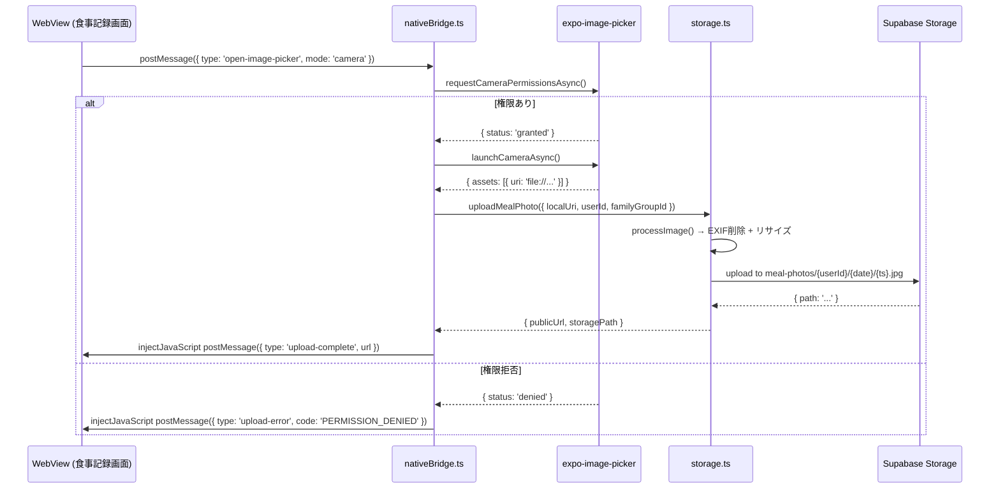
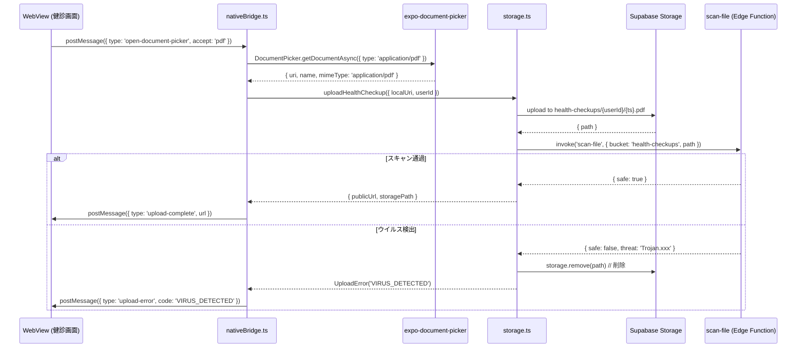

# ストレージ・カメラ設計

## 1. 目的・スコープ

モバイルアプリからの画像・ファイルアップロード経路を設計する。
expo-image-picker による食事写真の撮影・アップロード・EXIF 削除、および健診結果 PDF アップロードを扱う。

**対象外**:
- 冷蔵庫写真 (`fridge-images` バケット) → 既存 `uploadFridgePhoto()` が実装済み (設計変更不要)
- Web 側のファイル入力 UI → `family/03-ui-spec.md`

## 2. 関連要件

- 要件定義 `01-family-management.md §15.2` (食事写真アップロード)
- 要件定義 `03-operator-admin.md §15.13` (ファイルスキャン)
- 要件定義 `03-operator-admin.md §19.7` (健診結果 PDF アップロード)

## 3. 詳細仕様

### 3.1 iOS 18 カメラ dismiss バグの問題

WebView 内の `<input type="file" accept="image/*" capture>` を使ったカメラ起動は、**iOS 18 で dismiss バグ** が存在する。カメラ UI が表示された後、撮影完了ボタンを押しても元の WebView に戻らずに dismiss される問題。

```typescript
// src/components/web/WebViewScreen.tsx の既存コメント:
// Fix 3: iOS 18 カメラバツボタン workaround
// <input type="file"> 経由カメラの dismiss が効かないケースへの対処
// 根本解決は次 PR で expo-image-picker ネイティブブリッジ実装予定
// TODO: Phase B-2 で <input type="file"> を expo-image-picker bridge に置換
```

**根本解決**: Web 側から `postMessage({ type: 'open-image-picker' })` を送り、ネイティブの `expo-image-picker` を起動する。撮影完了後はアップロードし、URL を Web 側に返す。

### 3.2 全体フロー

```
Web 側 (食事記録画面)
  → postMessage({ type: 'open-image-picker', mode: 'camera', context: { mealId: '...' } })
  → ネイティブ: nativeBridge.ts が受け取り expo-image-picker を起動
  → カメラ撮影 or ライブラリ選択
  → ローカル URI 取得
  → storage.ts の uploadMealPhoto() を呼び出し
    → EXIF 削除
    → リサイズ (max 2048px)
    → Supabase Storage meal-photos バケットへ multipart アップロード
    → family_group_id metadata 設定
  → postMessage({ type: 'upload-complete', url: '...', path: '...' })
  → Web 側: 返ってきた URL を食事記録に紐づけ
```

### 3.3 `uploadMealPhoto()` 関数設計

```typescript
// src/lib/storage.ts に追加

export type UploadMealPhotoOptions = {
  localUri: string;
  userId: string;
  familyGroupId?: string;  // 家族共有時に設定
  mealId?: string;         // 食事記録 ID (metadata 用)
  onProgress?: (progress: number) => void; // 0-100
};

export type UploadMealPhotoResult = {
  publicUrl: string;
  storagePath: string;
};

/**
 * 食事写真をネイティブ URI から Supabase Storage にアップロードする
 *
 * - EXIF 削除 (GPS / カメラ情報等の PII 除去)
 * - 自動リサイズ (max 2048px)
 * - family_group_id metadata 設定 (RLS で家族メンバーに閲覧権付与)
 *
 * @param options UploadMealPhotoOptions
 * @returns publicUrl + storagePath
 */
export async function uploadMealPhoto(options: UploadMealPhotoOptions): Promise<UploadMealPhotoResult> {
  const { localUri, userId, familyGroupId, mealId, onProgress } = options;

  // 1. リサイズ + EXIF 削除
  const processed = await processImage(localUri);

  // 2. ストレージパス: {userId}/{YYYYMMDD}/{timestamp}-{random}.jpg
  const date = new Date().toISOString().slice(0, 10).replace(/-/g, '');
  const random = Math.random().toString(36).substring(2, 8);
  const path = `${userId}/${date}/${Date.now()}-${random}.jpg`;

  // 3. Blob 変換
  const response = await fetch(processed.uri);
  const blob = await response.blob();

  // 4. metadata 設定
  const metadata: Record<string, string> = {
    uploaded_by: userId,
    ...(familyGroupId && { family_group_id: familyGroupId }),
    ...(mealId && { meal_id: mealId }),
  };

  // 5. Supabase Storage へアップロード (multipart)
  const { data, error } = await supabase.storage
    .from('meal-photos')
    .upload(path, blob, {
      contentType: 'image/jpeg',
      metadata,
      upsert: false,
    });

  if (error) {
    if (error.message.includes('quota')) throw new UploadError('QUOTA_EXCEEDED', error.message);
    throw new UploadError('UPLOAD_FAILED', error.message);
  }

  const { data: { publicUrl } } = supabase.storage.from('meal-photos').getPublicUrl(data.path);

  return { publicUrl, storagePath: data.path };
}
```

### 3.4 画像処理 (EXIF 削除 + リサイズ)

`expo-image-manipulator` を使用してリサイズと EXIF 削除を行う。

```typescript
// src/lib/storage.ts 内

import * as ImageManipulator from 'expo-image-manipulator';

const MAX_DIMENSION = 2048;
const JPEG_QUALITY = 0.85;

type ProcessedImage = {
  uri: string;
  width: number;
  height: number;
};

async function processImage(localUri: string): Promise<ProcessedImage> {
  // ImageManipulator.manipulateAsync は EXIF を除去したクリーンな JPEG を生成する
  // (save オプションで format: 'jpeg' を指定すると EXIF が含まれない)
  const result = await ImageManipulator.manipulateAsync(
    localUri,
    [
      {
        resize: {
          // アスペクト比維持でリサイズ (max 2048px)
          width: MAX_DIMENSION,
          height: MAX_DIMENSION,
        },
      },
    ],
    {
      compress: JPEG_QUALITY,
      format: ImageManipulator.SaveFormat.JPEG,
      base64: false,
    }
  );

  return {
    uri: result.uri,
    width: result.width,
    height: result.height,
  };
}
```

**EXIF 削除の根拠**: `ImageManipulator.manipulateAsync` は内部で iOS の `CGImageDestination` / Android の `BitmapFactory` を使用し、JPEG 再エンコード時に撮影時の EXIF メタデータ (GPS 座標・カメラシリアル番号等) は含まれない。これにより PII 漏洩を防ぐ。

**リサイズ動作**: `resize` アクションは幅または高さのどちらかが `MAX_DIMENSION` を超えた場合のみ縮小し、それ以下なら原寸のまま保持する。アスペクト比は Expo が自動的に維持する。

### 3.5 権限管理

#### 権限要求タイミング

画像選択の直前に `ImagePicker.requestCameraPermissionsAsync()` / `requestMediaLibraryPermissionsAsync()` を呼び出す。

```typescript
// src/lib/nativeBridge.ts

import * as ImagePicker from 'expo-image-picker';

export async function openImagePicker(mode: 'camera' | 'library'): Promise<ImagePicker.ImagePickerAsset | null> {
  if (mode === 'camera') {
    const { status } = await ImagePicker.requestCameraPermissionsAsync();
    if (status !== 'granted') {
      return null; // 呼び出し元で拒否 UX を表示
    }
    const result = await ImagePicker.launchCameraAsync({
      mediaTypes: ['images'],
      allowsEditing: false,  // カメラ撮影後のトリミングは不要
      quality: 1.0,          // 生データを取得し、processImage でリサイズ
      exif: false,           // EXIF 取得不要 (processImage で削除)
    });
    if (result.canceled) return null;
    return result.assets[0];
  }

  if (mode === 'library') {
    const { status } = await ImagePicker.requestMediaLibraryPermissionsAsync();
    if (status !== 'granted') {
      return null;
    }
    const result = await ImagePicker.launchImageLibraryAsync({
      mediaTypes: ['images'],
      allowsEditing: false,
      quality: 1.0,
      exif: false,
    });
    if (result.canceled) return null;
    return result.assets[0];
  }

  return null;
}
```

#### 権限拒否時の UX

```typescript
// 権限が拒否された場合の Alert
Alert.alert(
  'カメラへのアクセスが必要です',
  '食事写真を撮影するには、設定アプリからカメラのアクセスを許可してください。',
  [
    { text: 'キャンセル', style: 'cancel' },
    { text: '設定を開く', onPress: () => Linking.openSettings() },
  ]
);
```

#### `app.json` の権限定義 (既存設定)

```json
"ios": {
  "infoPlist": {
    "NSCameraUsageDescription": "食事写真を撮影するためにカメラを使用します。",
    "NSPhotoLibraryUsageDescription": "食事写真を選択するために写真ライブラリを使用します。",
    "NSPhotoLibraryAddUsageDescription": "解析結果の保存のために写真ライブラリへ追加する場合があります。"
  }
},
"android": {
  "permissions": [
    "android.permission.CAMERA",
    "android.permission.READ_MEDIA_IMAGES",
    "android.permission.READ_EXTERNAL_STORAGE"
  ]
}
```

既存設定で必要な権限は網羅済み。変更不要。

### 3.6 進捗表示 UI

```typescript
// WebView → Native の通信で進捗を返す場合の設計

// nativeBridge.ts からの通知
// WebViewScreen.tsx の injectJavaScript で実行:
webViewRef.current?.injectJavaScript(`
  window.dispatchEvent(new CustomEvent('native-upload-progress', {
    detail: { progress: ${progress}, mealId: '${mealId}' }
  }));
  true;
`);

// Web 側 (Next.js) での受信:
useEffect(() => {
  const handler = (e: CustomEvent) => {
    setUploadProgress(e.detail.progress);
  };
  window.addEventListener('native-upload-progress', handler as EventListener);
  return () => window.removeEventListener('native-upload-progress', handler as EventListener);
}, []);
```

現時点では Supabase JS SDK がアップロード進捗コールバックをサポートしていないため、
`onProgress` コールバックは以下で簡易実装:
- アップロード開始時: `onProgress(0)`
- Blob 生成完了時: `onProgress(30)`
- アップロード完了時: `onProgress(100)`

### 3.7 エラーハンドリング

```typescript
export class UploadError extends Error {
  constructor(public code: UploadErrorCode, message: string) {
    super(message);
    this.name = 'UploadError';
  }
}

type UploadErrorCode =
  | 'QUOTA_EXCEEDED'      // ストレージ容量超過
  | 'INVALID_FILE_TYPE'   // 対応していないファイル形式
  | 'UPLOAD_FAILED'       // ネットワークエラー等
  | 'PERMISSION_DENIED'   // カメラ/ライブラリ権限なし
  | 'PROCESS_FAILED';     // リサイズ/EXIF削除失敗
```

| エラーコード | ユーザー向けメッセージ | 対処 |
|------------|---------------------|------|
| `QUOTA_EXCEEDED` | 「ストレージの空き容量が不足しています」| プランアップグレードを促す |
| `INVALID_FILE_TYPE` | 「対応していないファイル形式です (JPEG/PNG/WebP のみ)」| 別の画像を選ぶよう促す |
| `UPLOAD_FAILED` | 「アップロードに失敗しました。接続を確認してください」| 再試行ボタン表示 |
| `PERMISSION_DENIED` | 「カメラへのアクセスが必要です」| OS 設定画面へ誘導 |
| `PROCESS_FAILED` | 「画像の処理に失敗しました」| 別の画像を試すよう促す |

### 3.8 家族共有のメタデータ設計

`family_group_id` を Storage metadata に設定することで、Supabase Storage の RLS ポリシーが家族メンバーへの閲覧権を付与する。

```sql
-- meal-photos バケットの RLS ポリシー (family ドメインで定義)
-- 家族メンバーが familyGroupId を metadata に持つ画像を閲覧可能
CREATE POLICY "family_members_can_view_meal_photos"
ON storage.objects FOR SELECT
USING (
  bucket_id = 'meal-photos'
  AND (
    -- 本人のアップロード
    (storage.foldername(name))[1] = auth.uid()::text
    OR
    -- 同じ家族グループのメンバー
    EXISTS (
      SELECT 1 FROM family_members fm1
      JOIN family_members fm2 ON fm1.family_group_id = fm2.family_group_id
      WHERE fm1.user_id = auth.uid()
        AND fm2.user_id::text = (metadata->>'uploaded_by')
        AND fm1.status = 'active'
        AND fm2.status = 'active'
    )
  )
);
```

## 4. データモデル

```sql
-- meal-photos バケット (既存、設定変更なし)
-- バケット設定: public = false (署名付き URL または RLS ポリシー経由)
-- ファイルサイズ制限: 10MB (Supabase 設定)
-- 許可 MIME type: image/jpeg, image/png, image/webp

-- health-checkups バケット (既存)
-- バケット設定: public = false
-- ファイルサイズ制限: 20MB (PDF 対応)
-- 許可 MIME type: image/jpeg, image/png, application/pdf
```

## 5. シーケンス

### 5.1 食事写真撮影〜アップロード



### 5.2 健診結果 PDF アップロード (ウイルススキャン付き)



## 6. エラーハンドリング

(§3.7 の `UploadError` を使用)

ウイルス検出時の追加処理:
- ファイルを Storage から即削除
- ユーザーへ「安全でないファイルが検出されました。別のファイルをお試しください。」を表示
- Sentry にエラーレポート (threat 名を含む)

## 7. テスト方針

### Unit テスト

| テスト | ファイル | 内容 |
|--------|---------|------|
| `uploadMealPhoto` | `__tests__/lib/storage.test.ts` | Supabase SDK をモック、正常パス + エラーパス |
| `processImage` | `__tests__/lib/storage.test.ts` | `ImageManipulator.manipulateAsync` のモック |
| `openImagePicker` | `__tests__/lib/nativeBridge.test.ts` | 権限あり/なし のフロー確認 |

```typescript
// __tests__/lib/storage.test.ts (新規)
describe('uploadMealPhoto()', () => {
  it('正常系: JPEG がアップロードされ publicUrl が返る', async () => {
    // ... supabase.storage.from().upload をモック
  });

  it('QUOTA_EXCEEDED エラーが UploadError としてスローされる', async () => {
    // ... upload が quota エラーを返すケース
  });

  it('familyGroupId が metadata に含まれる', async () => {
    // ... upsert 引数の metadata を検証
  });
});
```

### Manual テスト (必須)

| 検証項目 | 確認方法 |
|---------|---------|
| カメラ起動 (iOS 18) | iPhone iOS 18 実機で撮影 → WebView に写真が表示される |
| EXIF 削除確認 | アップロード後の JPEG ファイルの EXIF を `exiftool` で検査 → GPS なし |
| 2048px リサイズ | 4000px 画像をアップロード → Storage に 2048px 以下のファイルがある |
| ライブラリ選択 | 写真ライブラリから選択 → アップロード成功 |
| 権限拒否 UX | 権限を拒否した状態 → Alert + 設定画面へのリンク |

## 8. 既存実装との関連

### 保持

- `src/lib/storage.ts` の `uploadFridgePhoto()` (冷蔵庫写真、変更なし)
- `app.json` の `expo-image-picker` plugin 設定
- カメラ・写真ライブラリ権限文言 (既存設定済み)

### 修正

- `src/lib/storage.ts`: `uploadMealPhoto()` 関数を追加
- `src/components/web/WebViewScreen.tsx`: `onMessage` ハンドラーに `open-image-picker` / `upload-meal-photo` ケースを追加

### 新規

- `src/lib/nativeBridge.ts`: `openImagePicker()` 実装
- `supabase/functions/scan-file/index.ts`: ClamAV によるウイルススキャン (Edge Function)

### 依存パッケージの確認

```bash
# 要確認: package.json に以下があるか
expo-image-picker      # 既存 (app.json plugins に登録済み)
expo-image-manipulator # EXIF削除・リサイズに必要 → 未確認、要追加
expo-document-picker   # PDF アップロードに必要 → 未確認、要追加
```

```bash
# 追加が必要な場合
npx expo install expo-image-manipulator expo-document-picker
```

## 9. 未解決事項

| 項目 | 優先度 | 担当 |
|------|--------|------|
| `expo-image-manipulator` の EXIF 削除動作の公式確認 | 高 | Android での EXIF 削除挙動も検証必要。代替: `react-native-exif-remover` |
| `scan-file` Edge Function の ClamAV セットアップ | 高 | Supabase Edge Runtime に ClamAV がないため、外部サービス (VirusTotal API 等) か Docker カスタムランタイムが必要 |
| アップロード進捗の正確な実装 | 中 | Supabase JS SDK が XMLHttpRequest ベースの進捗未対応。`fetch` + `ReadableStream` で部分対応可能 |
| WebP / HEIC フォーマット対応 | 中 | iOS はデフォルトで HEIC を返すケースあり。`ImageManipulator` で JPEG 変換で解決済みだが確認要 |
| PDF サムネイル生成 | 低 | 健診結果 PDF のサムネイル表示 → `expo-print` or サーバー側変換 (Phase 2) |
| meal-photos バケットの署名付き URL (有効期限設定) | 中 | `public = false` の場合は署名付き URL が必要。有効期限 (デフォルト 1 時間) とキャッシュの設計が必要 |
