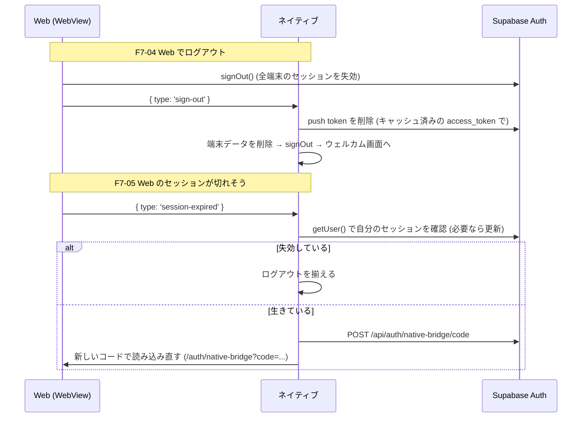

# モバイル 認証・セッション・push token の扱い

## 1. 目的・スコープ

モバイルアプリの認証まわり (セッションの保管、起動時の復元、Google ログイン、WebView との状態の食い違い、push token) の設計。
Issue #1038 (F7-04〜F7-10) の修正に合わせて整理した。

`01-architecture.md` の「3.3 セッション同期」は、この文書の内容で置き換わる部分がある (特に、セッションの保管先と、`session-expired` の向き)。
WebView の認証ブリッジそのもの (ワンタイムコード方式、オリジンの固定) は #1036 / #1158 (`webViewBridge.ts`) の担当で、ここでは扱わない。

| 項目 | 内容 | 実装 |
|------|------|------|
| F7-06 | セッションを平文の AsyncStorage ではなく、端末の安全な保管庫に置く | `src/lib/secureSessionStorage.ts` / `src/lib/supabase.ts` |
| F7-07 | オフライン起動でログイン済みのユーザーをウェルカム画面に落とさない | `src/providers/AuthProvider.tsx` / `src/lib/authErrors.ts` |
| F7-08 | Google ログインのコールバック URL を捨てない。成功と誤表示しない | `app/(auth)/login.tsx` / `app/(auth)/auth/verify.tsx` / `src/lib/authLink.ts` |
| F7-09 | push token の登録が、展開されなかった `$VAR` で静かに失敗しない | `eas.json` / `src/lib/pushNotifications.ts` |
| F7-10 | ログアウトで、この端末の push token を `user_push_tokens` から消す | `src/lib/signOut.ts` / `src/lib/pushNotifications.ts` |
| F7-04 | Web (WebView) でログアウトしたら、ネイティブもログアウトする | `src/lib/webViewAuthMessages.ts` / Web: `src/lib/native-auth-bridge.ts` |
| F7-05 | Web とネイティブが同じ refresh_token を別々に更新して、セッションごと失効するのを防ぐ | 同上 / Web: `native-bridge/route.ts`, `NativeSessionWatcher.tsx` |

## 2. セッションの保管 (F7-06)

Supabase のセッション (access_token と refresh_token) は、iOS Keychain / Android Keystore に置く (`expo-secure-store`)。
以前は AsyncStorage (平文) に置いていた。refresh_token は長期間有効なログイン権限なので、バックアップやファイルの読み取りで見えてはいけない。

- expo-secure-store は 1 つの値を 2048 バイトまでに制限する (超えると警告。将来の SDK ではエラーになり得る)。セッションは 3〜5KB なので、値を小さく分けて保存する
  - `<key>` に目次 `v1.<世代>.<断片数>`、`<key>.<世代>.<番号>` に断片
  - 書き込みは「新しい世代の断片 → 目次 → 古い世代の削除」の順。途中で失敗しても、読み手は古い世代をそのまま読める
- Supabase 公式ドキュメントの「乱数鍵を SecureStore、暗号化したセッションを AsyncStorage」方式は採らなかった。暗号ライブラリ (aes-js) と乱数のネイティブモジュールが増え、認証タグの無い AES-CTR を自前で持つことになる。OS の保管庫に直接置くほうが部品が少ない
- 読み取りのたびに保管庫へ問い合わせず、メモリにも持つ (`getSession()` は API 呼び出しごとに走る)
- 移行: 旧バージョンが AsyncStorage に保存した平文のセッションは、最初に読んだときに保管庫へ移して AsyncStorage から消す。ログアウトされない
- 保管庫に書けない端末 (Keystore の破損など) では、ログインできなくならないよう AsyncStorage に退避する (次に読んだときに移行を再試行する)
- **iOS の Keychain はアプリを削除しても残る**。AsyncStorage に「入っている」印を置き、印が無いのに保管庫に値があれば再インストールの残りとみなして消す。前のユーザーのセッションが復活しない
- 保存キーは supabase-js の既定 (`sb-<ref>-auth-token`) のまま

## 3. 起動時のセッション復元 (F7-07)

`AuthProvider` は起動時に保存済みのセッションをサーバーで検証する。**サーバーが失効と明言したときだけ**捨てる。

| `getUser()` のエラー | 扱い |
|---|---|
| 401 / 403、`session_not_found`、`user_not_found`、`refresh_token_not_found` など | セッションを捨てる (`signOut({ scope: 'local' })`) |
| `AuthRetryableFetchError`、status 0 / 408 / 429 / 5xx、fetch の例外 | 保存済みのセッションを信頼して起動する |
| 上記以外 | 失効を確認できていないので、捨てない |

access_token が期限切れで、更新に通信が必要な機内モード起動では、`getSession()` が `session: null` を返す (保存済みのセッションは消えていない)。
通信エラーのときは `getStoredSession()` で保存済みのセッションを読み、それで起動する。通信が戻れば supabase-js が更新し (`TOKEN_REFRESHED`)、差し替わる。

## 4. Google ログインのコールバック (F7-08)

iOS の `ASWebAuthenticationSession` は、コールバック URL を `openAuthSessionAsync` の `result.url` にだけ返し、`Linking` のイベントには流さない。
以前は `result.url` を捨てて `/auth/verify` へ遷移していたため、verify 画面が URL を取れず、セッションが無いまま「確認が完了しました」と表示した。

- `login.tsx` が `result.url` から `code` / `access_token`+`refresh_token` を取り出し、その場でセッションにする (`completeAuthLink`)
- `verify.tsx` は、リンクの情報が無い・`error` がある・交換に失敗したときはエラー表示にする。起動リンクの取得が済むまでは、エラーを出さず確認中のままにする
- Android では同じコールバックが `result.url` とディープリンクの両方で届き得る。`code` は 1 回しか交換できないので、同じリンクの処理は 1 回にして結果を共有する

## 5. push token (F7-09 / F7-10)

登録 (`registerAndSaveExpoPushToken`)
- EAS の project ID は UUID 形式を確認し、不正な値 (展開されなかった `"$EXPO_PUBLIC_EAS_PROJECT_ID"` など) は読み飛ばして次の候補へ進む
  (環境変数 → `easConfig` → `app.json` の `extra.eas.projectId` → `extra.projectId`)
- `eas.json` の `EXPO_PUBLIC_EAS_PROJECT_ID` の行は削除した。`app.json` の `extra.eas.projectId` を使う。
  eas.json の `"$VAR"` は展開されずに文字列のまま入っていた (Issue #1038 の報告)。形式の検査があるので、どちらでも壊れない。
  `01-architecture.md` §7.2 の表にある同名の行 (preview / production) は、この変更で eas.json に設定しなくなった (環境変数や EAS Secret として注入することは今でもできる)
- 失敗は PostHog に送る (`push_token_registration_failed`。トークンやユーザー ID は載せない)
- 「登録済み」の印は、トークンを実際に保存できたときだけ付ける。権限を拒否された場合に印を付けると、後から許可しても二度と登録されない

削除 (`signOutWithCleanup`)
- ログアウトは「push token の削除 → 端末データの削除 → サインアウト」の順。削除は RLS (本人の行のみ) のため、サインアウトの前に行う
- 消すのは「この端末のトークンの、このユーザーの行」だけ。同じユーザーの他の端末の行を消すと、その端末は登録済みの印が立っていて再登録されず、通知が届かなくなる
- 失敗・タイムアウト (3 秒) でもログアウトは止めない
- アカウント削除では不要。`auth.users` の削除で `user_push_tokens` が `ON DELETE CASCADE` で消える

## 6. Web (WebView) とネイティブの状態を揃える (F7-04 / F7-05)

ログイン状態の持ち主は**ネイティブ**。WebView の Web 側は、ネイティブが張った借り物の Cookie セッションで動く。

### 6.1 refresh_token の持ち主はネイティブだけ (F7-05)

ネイティブの refresh_token をそのまま Web の Cookie にも入れると、Web (middleware / ブラウザの supabase-js) とネイティブが同じ refresh_token を別々にローテーションする。
片方が使った古い refresh_token をもう片方が使うと、Supabase は再利用とみなしてセッションごと失効させ、突然のログアウトになる。

- `/auth/native-bridge?code=...` (`handleCode`) は、Web の Cookie セッションに access_token だけを実際の値で入れ、refresh_token には使えない値
  (`NATIVE_BRIDGE_WEB_REFRESH_TOKEN_PLACEHOLDER`) を入れる。Web は自分で更新できない
- 期限が近づいたら Web が `{ type: 'session-expired' }` を送り (§6.2)、ネイティブが新しいコードで WebView を読み込み直す
- 旧方式 (トークンを URL で渡す GET) は変えない。旧アプリは再ブリッジの仕組みを持たないため
- 従来の動作 (実際の refresh_token を入れる) へ戻すスイッチ: 環境変数 `NATIVE_BRIDGE_SHARE_REFRESH_TOKEN=on` (Vercel は再デプロイ後に効く)

### 6.2 Web → ネイティブ のメッセージ

`window.ReactNativeWebView.postMessage(JSON.stringify(message))`。ネイティブは、自分の Web オリジンのページから届いたものだけを処理する。

```typescript
type WebToNativeAuthMessage =
  | { type: 'sign-out' }          // 利用者が Web でログアウトした
  | { type: 'session-expired' };  // Web のセッションが切れた・切れそう
```

| 送る場所 (Web) | メッセージ |
|---|---|
| `broadcastSignOut()` (`src/lib/user-storage.ts`)。設定・マイページ (ログアウトと退会)・組織レイアウト・`family/promotions/[token]`・パスワード再設定後の全端末ログアウト・凍結ページ | `sign-out` |
| `NativeSessionWatcher` (認証が必要なページの共通レイアウトに常駐)。20 秒ごと・前面復帰時に確認し、セッションが無い、または (ネイティブから借りたセッションで) 有効期限までの残りが 120 秒を切った | `session-expired` |
| ログイン画面が表示されたとき (WebView でログイン画面 = セッションが無い) | `session-expired` |

`session-expired` は Web 側で 15 秒以内に続けて送らず、ログアウトを知らせた後は送らない。普通のブラウザでは何も送らない。

ネイティブの処理 (`src/lib/webViewAuthMessages.ts`)
- `sign-out`: 共通のログアウト (§5) を行い、ウェルカム画面へ戻る。5 つのタブが同時に送ってきても 1 回だけ行う
- `session-expired`:
  1. ネイティブも未ログインなら何もしない
  2. ネイティブのセッションをサーバーで確かめる。失効していれば (Web のログアウトで全端末のセッションが失効した後など)、読み込み直さずログアウトを揃える
  3. 生きている (または確かめられない) なら、そのタブを `initialPath` に使い捨ての `_rb` を付けて開き直させる (= bridge をやり直す)
  4. 回数制限: タブごとに、10 秒以上の間隔、5 分で 3 回まで。ブリッジが失敗し続けても延々と繰り返さない



## 7. 互換性とリリースの順序

| 変更 | 新しい Web + 旧アプリ | 旧 Web + 新アプリ |
|---|---|---|
| `sign-out` / `session-expired` の送信 | 旧アプリは未知の `type` を無視する。変化なし | メッセージが来ないだけ。ネイティブの処理は何も起きない |
| `native-bridge` の Cookie の refresh_token | コード方式を使うのは新ビルドだけ (旧アプリは旧方式)。変化なし | — |

- Web の変更は、先に本番へ出して問題ない。旧アプリは何も変わらない
- ただし、**コード方式のブリッジ (#1036 / #1289) を載せたビルドと、この変更のネイティブ側は、同じビルドで出す**こと。
  Web 側の refresh_token が使えない値になるため、`session-expired` を処理するネイティブが無いと、WebView は最長 1 時間で未ログインの表示になる
- OTA が無効 (`updates.enabled=false`) で、`expo-secure-store` はネイティブモジュールなので、反映には EAS Build とストアリリースが必要

## 8. 未解決事項

- ログアウトがオフラインで失敗したとき (`signOut()` が `{ error }` を返してセッションが残る) の扱い。#1037 (draft PR #1079) の `clearSupabaseAuthStorage` / `clearSession` が担当
- Web の設定・マイページのログアウト / 退会ボタンを WebView 内で隠す対応は #1037 (draft PR #1079)。この変更の `sign-out` 通知は、隠れなかった経路 (凍結ページなど) の二重の備え
- `invite/[token]` の「ログアウトしてやり直す」は `broadcastSignOut()` を通らないのでネイティブへ通知しない (WebView の主要な導線ではない)
- 再ブリッジは、開いていたパスではなくタブの既定のパス (または直前の `initialPath`) を開き直す。入力中のフォームの内容は失われる
- push token を DB 側で端末ごとに 1 ユーザーへ紐づけ直す (別ユーザーのログインで古い行を消す) には、サービスロールの処理が要る。サーバー側の送信 (`notify-push`) は #1136 で未実装
