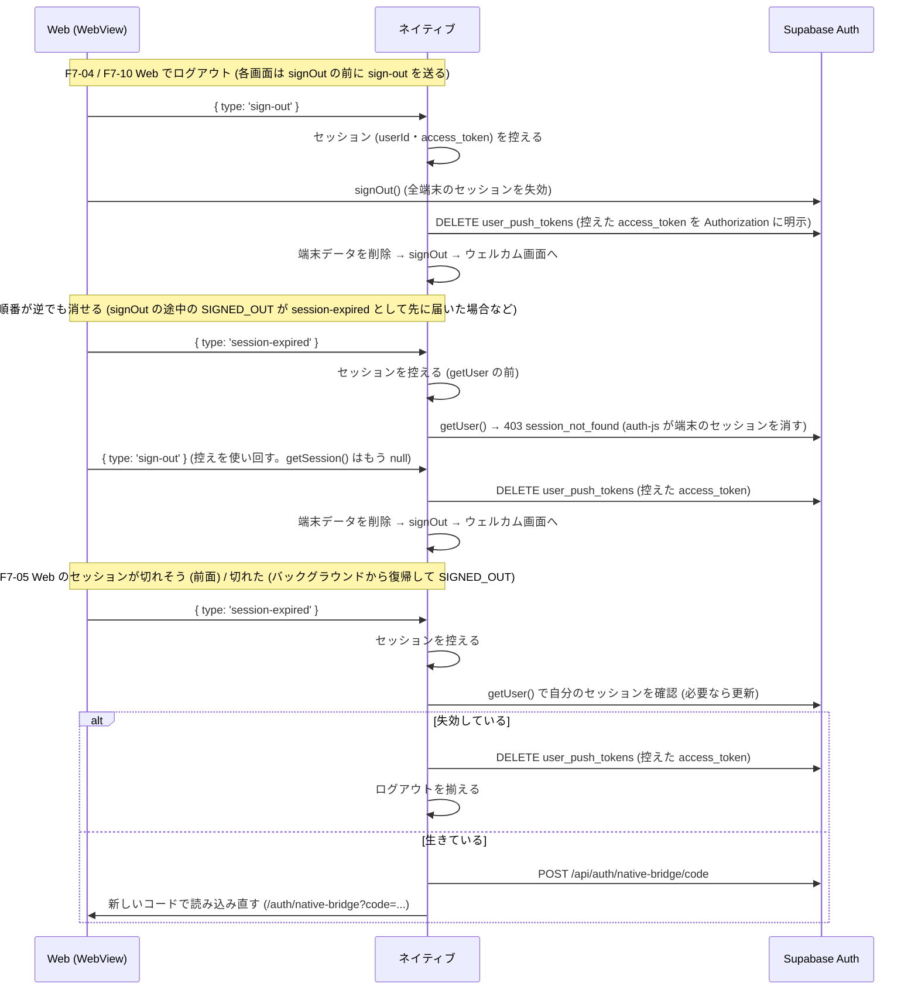

# モバイル 認証・セッション・push token の扱い

## 1. 目的・スコープ

モバイルアプリの認証まわり (セッションの保管、起動時の復元、Google ログイン、WebView との状態の食い違い、push token) の設計。
Issue #1038 (F7-04〜F7-10) の修正に合わせて整理した。

`01-architecture.md` の「3.3 セッション同期」は、この文書の内容で置き換わる部分がある (特に、セッションの保管先と、`session-expired` の向き)。
WebView の認証ブリッジそのもの (ワンタイムコード方式、オリジンの固定) は #1036 / #1158 (`webViewBridge.ts`) の担当で、ここでは扱わない。

| 項目 | 内容 | 実装 |
|------|------|------|
| F7-06 | セッションを平文の AsyncStorage ではなく、端末の安全な保管庫に置く | `src/lib/secureSessionStorage.ts` / `src/lib/supabase.ts` |
| F7-07 | オフライン起動でログイン済みのユーザーをウェルカム画面に落とさない | `src/providers/AuthProvider.tsx` / `src/lib/authErrors.ts` |
| F7-08 | Google ログインのコールバック URL を捨てない。成功と誤表示しない | `app/(auth)/login.tsx` / `app/(auth)/auth/verify.tsx` / `src/lib/authLink.ts` |
| F7-09 | push token の登録が、展開されなかった `$VAR` で静かに失敗しない | `eas.json` / `src/lib/pushNotifications.ts` |
| F7-10 | ログアウトで、この端末の push token を `user_push_tokens` から消す | `src/lib/signOut.ts` / `src/lib/pushNotifications.ts` |
| F7-04 | Web (WebView) でログアウトしたら、ネイティブもログアウトする | `src/lib/webViewAuthMessages.ts` / Web: `src/lib/native-auth-bridge.ts` |
| F7-05 | Web とネイティブが同じ refresh_token を別々に更新して、セッションごと失効するのを防ぐ | 同上 / Web: `native-bridge/route.ts`, `NativeSessionWatcher.tsx` |

## 2. セッションの保管 (F7-06)

Supabase のセッション (access_token と refresh_token) は、iOS Keychain / Android Keystore に置く (`expo-secure-store`)。
以前は AsyncStorage (平文) に置いていた。refresh_token は長期間有効なログイン権限なので、バックアップやファイルの読み取りで見えてはいけない。

- expo-secure-store は 1 つの値を 2048 バイトまでに制限する (超えると警告。将来の SDK ではエラーになり得る)。セッションは 3〜5KB なので、値を小さく分けて保存する
  - `<key>` に目次 `v1.<世代>.<断片数>`、`<key>.<世代>.<番号>` に断片
  - 書き込みは「新しい世代の断片 → 目次 → 古い世代の削除」の順。途中で失敗しても、読み手は古い世代をそのまま読める
- Supabase 公式ドキュメントの「乱数鍵を SecureStore、暗号化したセッションを AsyncStorage」方式は採らなかった。暗号ライブラリ (aes-js) と乱数のネイティブモジュールが増え、認証タグの無い AES-CTR を自前で持つことになる。OS の保管庫に直接置くほうが部品が少ない
- 読み取りのたびに保管庫へ問い合わせず、メモリにも持つ (`getSession()` は API 呼び出しごとに走る)
- 移行: 旧バージョンが AsyncStorage に保存した平文のセッションは、最初に読んだときに保管庫へ移して AsyncStorage から消す。ログアウトされない
- 保管庫に書けない端末 (Keystore の破損など) では、ログインできなくならないよう AsyncStorage に退避する (次に読んだときに移行を再試行する)
- 保管庫に書けたのに平文の削除だけが失敗すると、平文には使用済み (ローテーション済み) の古いセッションが残る。AsyncStorage に値があるときは、
  セッションの有効期限 (`expires_at`) を保管庫の値と比べ、**保管庫のほうが新しければ保管庫を採って平文を消す**。古い平文で新しい値を上書きすると、
  使用済みの refresh_token をサーバーが再利用とみなして、セッションごと失効し得るため。比べられない値 (PKCE の code-verifier など) は、これまでどおり平文を採る
- **iOS の Keychain はアプリを削除しても残る**。AsyncStorage に「入っている」印を置き、印が無いのに保管庫に値があれば再インストールの残りとみなして消す。前のユーザーのセッションが復活しない
- 保存キーは supabase-js の既定 (`sb-<ref>-auth-token`) のまま

## 3. 起動時のセッション復元 (F7-07)

`AuthProvider` は起動時に保存済みのセッションをサーバーで検証する。**サーバーが失効と明言したときだけ**捨てる。

| `getUser()` のエラー | 扱い |
|---|---|
| 401 / 403、`session_not_found`、`user_not_found`、`refresh_token_not_found` など | セッションを捨てる (`signOut({ scope: 'local' })`) |
| `AuthRetryableFetchError`、status 0 / 408 / 429 / 5xx、fetch の例外 | 保存済みのセッションを信頼して起動する |
| 上記以外 | 失効を確認できていないので、捨てない |

access_token が期限切れで、更新に通信が必要な機内モード起動では、`getSession()` が `session: null` を返す (保存済みのセッションは消えていない)。
通信エラーのときは `getStoredSession()` で保存済みのセッションを読み、それで起動する。通信が戻れば supabase-js が更新し (`TOKEN_REFRESHED`)、差し替わる。
サーバーが `refresh_token` を失効と答えれば `SIGNED_OUT` になるので、検証を省いても失効の取りこぼしにはならない。

- **この場合は `getUser()` による検証を省く**。`getUser()` も同じ更新をもう一度試みて、同じ理由で失敗するだけだから。
  supabase-js は更新に失敗すると約 25 秒かけてやり直す (`_initialize` と `getSession()` のそれぞれで)。実測で、期限切れ + オフラインの起動は、
  `getSession()` が約 51 秒、そのあと `getUser()` がさらに約 51 秒かかっていた (合わせて約 100 秒)。検証を省いて、約 51 秒にした
- それでも、読み込み中の表示が約 50 秒続く。短くするには、保存済みのセッションで先に画面を出し、更新と検証を裏で行う設計が要る (未対応。§8)

## 4. Google ログインのコールバック (F7-08)

iOS の `ASWebAuthenticationSession` は、コールバック URL を `openAuthSessionAsync` の `result.url` にだけ返し、`Linking` のイベントには流さない。
以前は `result.url` を捨てて `/auth/verify` へ遷移していたため、verify 画面が URL を取れず、セッションが無いまま「確認が完了しました」と表示した。

- `login.tsx` が `result.url` から `code` / `access_token`+`refresh_token` を取り出し、その場でセッションにする (`completeAuthLink`)
- `verify.tsx` は、リンクの情報が無い・`error` がある・交換に失敗したときはエラー表示にする (見出しのアイコンと色もエラーのもの。成功の緑のチェックにするのは、エラーなく終わったときだけ)。
  起動リンクの取得が済むまでは、エラーを出さず確認中のままにする
- Android では同じコールバックが `result.url` とディープリンクの両方で届き得る。`code` は 1 回しか交換できないので、同じリンクの処理は 1 回にして結果を共有する
- 既知の見え方 (実機で確認する): Android の Google ログインでは、リダイレクトのディープリンクで expo-router も `/auth/verify` を開く。
  verify の `Linking.useURL()` は購読前に流れたイベントを受け取れないので、`login.tsx` の `routeAfterSignIn` が画面を移すまでの 1〜2 秒、
  「確認できませんでした」が見える可能性がある。ログイン自体は `login.tsx` 側で完了し、画面が移れば消える

## 5. push token (F7-09 / F7-10)

登録 (`registerAndSaveExpoPushToken`)
- EAS の project ID は UUID 形式を確認し、不正な値 (展開されなかった `"$EXPO_PUBLIC_EAS_PROJECT_ID"` など) は読み飛ばして次の候補へ進む
  (環境変数 → `easConfig` → `app.json` の `extra.eas.projectId` → `extra.projectId`)
- `eas.json` の `EXPO_PUBLIC_EAS_PROJECT_ID` の行は削除した。`app.json` の `extra.eas.projectId` を使う。
  eas.json の `"$VAR"` は展開されずに文字列のまま入っていた (Issue #1038 の報告)。形式の検査があるので、どちらでも壊れない。
  `01-architecture.md` §7.2 の表にある同名の行 (preview / production) は、この変更で eas.json に設定しなくなった (環境変数や EAS Secret として注入することは今でもできる)
- 失敗は端末のコンソールに出す (`push_token_registration_failed`。トークンやユーザー ID は載せない)。PostHog には送らない (#1166)
- 「登録済み」の印は、トークンを実際に保存できたときだけ付ける。権限を拒否された場合に印を付けると、後から許可しても二度と登録されない。
  旧ビルドは権限を拒否されても印 (`push_token_registered_v1:<uid>`) を付けていたため、通知を拒否した端末には v1 の印が残っている。
  そのまま読むと、後から許可しても登録されないので、印のキーを `push_token_registered_v2` に上げた (v1 は読まず、ログアウトで消す)。
  更新後の初回起動で 1 度だけ登録を確かめ直す (登録済みの端末では upsert が何も変えないだけ)
- 権限のダイアログ: 起動時の自動登録では、まだ一度も尋ねていない (`undetermined`) ときだけ出す。拒否された後も毎回出すと、
  Android 13 以降は、一度拒否した利用者に次の起動でもう一度ダイアログが出る。拒否した利用者は OS の設定で許可すれば、次の起動で登録される。
  設定画面の登録ボタン (`userInitiated: true`) は利用者の操作なので、OS がまだ尋ねられる (`canAskAgain` が `false` でない) なら出す

削除 (`signOutWithCleanup`)
- ログアウトは「push token の削除 → 端末データの削除 → サインアウト」の順。削除は RLS (本人の行のみ) のため、サインアウトの前に行う
- 通る場所と、削除を認可するもの

  | 通る場所 | 削除を認可するもの |
  |---|---|
  | 設定タブ・マイページのログアウト (`signOutWithCleanup(user.id)`)、パスワード再設定後の全端末サインアウト (`auth/reset-password.tsx`) | いまのセッション。セッションが生きているうちに呼ぶので、supabase-js が付ける |
  | Web (WebView) からの `sign-out` / `session-expired` の反映 (`webViewAuthMessages.ts`) | **処理の最初に控えた本人のアクセストークン**。`Authorization` ヘッダーで明示する (下) |

- Web (WebView) からのログアウトでは、**キャッシュ済みのセッションに頼らず、控えた値を使う**。Web の `signOut()` は全端末のセッションをサーバーで失効させ、
  失効したあとにネイティブが `getUser()` を呼ぶと、サーバーは `403 session_not_found` を返す。auth-js (2.105) はそれを `AuthSessionMissingError` にして、
  端末のセッションを消す (`_removeSession`)。auth-js の処理はロックで直列なので、そのあとに動く `getSession()` は `null` を返す。
  すると、ユーザー ID が分からず削除を諦める (skipped)、または削除の通信が anon キーで送られて RLS で 0 行になる (エラーにならない)。
  詳しい順番と対策は §6.2
- `Authorization` ヘッダーを明示すると、supabase-js は上書きしない (`fetchWithAuth` は、既にあれば付けない)。
  PostgREST は JWT の署名と期限だけを見て、セッションが失効済みかどうかは見ないので、アクセストークンの期限内なら、失効後でも RLS で本人の行を消せる
- 消えた行の件数を数える (`delete({ count: 'exact' })`)。0 件 (RLS に弾かれた、または行が既に無い。どちらもエラーにならない) のときは `push_token_unregister_no_rows` を端末のコンソールに出す (PostHog には送らない: #1166)。
  以前は 0 件でも「削除できた」扱いで、RLS を素通りしても気づけなかった。Web からアカウントを削除したときも `sign-out` が届くが、そのときは `auth.users` の削除で行が CASCADE で先に消えているので、この通知が出る (正常)
- 消すのは「この端末のトークンの、このユーザーの行」だけ。同じユーザーの他の端末の行を消すと、その端末は登録済みの印が立っていて再登録されず、通知が届かなくなる
- 失敗・タイムアウト (3 秒) でもログアウトは止めない
- アカウント削除 (アプリの `app/settings/account.tsx`) では不要。`auth.users` の削除で `user_push_tokens` が `ON DELETE CASCADE` で消える

## 6. Web (WebView) とネイティブの状態を揃える (F7-04 / F7-05)

ログイン状態の持ち主は**ネイティブ**。WebView の Web 側は、ネイティブが張った借り物の Cookie セッションで動く。

### 6.1 refresh_token の持ち主はネイティブだけ (F7-05)

ネイティブの refresh_token をそのまま Web の Cookie にも入れると、Web (middleware / ブラウザの supabase-js) とネイティブが同じ refresh_token を別々にローテーションする。
片方が使った古い refresh_token をもう片方が使うと、Supabase は再利用とみなしてセッションごと失効させ、突然のログアウトになる。

- `/auth/native-bridge?code=...` (`handleCode`) は、Web の Cookie セッションに access_token だけを実際の値で入れ、refresh_token には使えない値
  (`NATIVE_BRIDGE_WEB_REFRESH_TOKEN_PLACEHOLDER`) を入れる。Web は自分で更新できない
- 期限が近づいたら Web が `{ type: 'session-expired' }` を送り (§6.2)、ネイティブが新しいコードで WebView を読み込み直す
- 旧方式 (トークンを URL で渡す GET) は変えない。旧アプリは再ブリッジの仕組みを持たないため
- 従来の動作 (実際の refresh_token を入れる) へ戻すスイッチ: 環境変数 `NATIVE_BRIDGE_SHARE_REFRESH_TOKEN=on` (Vercel は再デプロイ後に効く)

**「切れる前に頼むので、Web は更新しない」は、前面で使っているときしか成り立たない。** ブラウザの supabase-js (auth-js 2.105) は、次の時点で必ず更新を試みる。
借り物の refresh_token では更新が 400 になり、auth-js はセッションを捨てて `SIGNED_OUT` を出す。

| auth-js が更新を試みる契機 | 更新を試みる残り時間 |
|---|---|
| 自動更新の tick (30 秒ごと。前面のときだけ) | 120 秒未満 (`floor(残り / 30 秒) <= AUTO_REFRESH_TICK_THRESHOLD (3)`) |
| `getSession()` (Supabase への API 呼び出しのたびに走る)・バックグラウンドからの復帰 (`visibilitychange`) | 90 秒未満 (`EXPIRY_MARGIN_MS`)。復帰時は tick も直ちに走る |

そのため 2 段構えにしている。

1. **前面で使っているとき**: `NativeSessionWatcher` が、auth-js より先に再ブリッジを頼む (`REFRESH_AHEAD_SECONDS` = 180 秒)。
   20 秒ごとの確認の遅れと、ネイティブの再ブリッジにかかる時間を見込んでも、auth-js の tick (120 秒) より前に済む。
   (以前の 120 秒は tick と同じ閾値で、tick が先に走ると (およそ 3 回に 1 回) 借り物の refresh_token で更新して失敗していた。90 秒という説明も誤りで、90 秒は `getSession()` の閾値)
2. **先回りできないとき**: 1 時間以上バックグラウンドに置いて戻ると、その間タイマーが止まっているので、復帰した瞬間に auth-js が更新を試みる。
   どんな閾値でも先回りできない。WebView の中の `SIGNED_OUT` は「利用者のログアウト」とは限らないので、`MainLayout` は §6.3 のとおり扱う。

閾値の関係は `src/__tests__/lib/native-session-authjs-thresholds.test.ts` が、本物の auth-js (GoTrueClient) の動きで確かめる (auth-js を上げて閾値が変わると落ちる)。

### 6.2 Web → ネイティブ のメッセージ

`window.ReactNativeWebView.postMessage(JSON.stringify(message))`。ネイティブは、自分の Web オリジンのページから届いたものだけを処理する。

```typescript
type WebToNativeAuthMessage =
  | { type: 'sign-out' }          // 利用者が Web でログアウトした
  | { type: 'session-expired' };  // Web のセッションが切れた・切れそう
```

| 送る場所 (Web) | メッセージ |
|---|---|
| 各画面のログアウト処理が `supabase.auth.signOut()` の**前**に呼ぶ `notifyNativeSignOut()` (`src/lib/native-auth-bridge.ts`)。設定・マイページ (ログアウトと退会)・組織レイアウト・`family/promotions/[token]`・パスワード再設定後の全端末ログアウト・凍結ページ。`signOut()` の後の `broadcastSignOut()` (`src/lib/user-storage.ts`) も、まだ送っていなければ送る | `sign-out` |
| `NativeSessionWatcher` (認証が必要なページの共通レイアウトに常駐)。20 秒ごと・前面復帰時に確認し、セッションが無い、または (ネイティブから借りたセッションで) 有効期限までの残りが 180 秒を切った | `session-expired` |
| `MainLayout` の `onAuthStateChange`。WebView の中で `SIGNED_OUT` になった (§6.3) | `session-expired` |
| ログイン画面が表示されたとき (WebView でログイン画面 = セッションが無い) | `session-expired` |

`session-expired` は Web 側で 15 秒以内に続けて送らず、ログアウトを知らせた後は送らない。`sign-out` は 1 つのページで 1 回だけ送る。普通のブラウザでは何も送らない。

**ログアウトの `sign-out` は、`signOut()` の前に送る。** 利用者のログアウトでも、`signOut()` の途中で auth-js が `SIGNED_OUT` を出す。
`MainLayout` がそれを `session-expired` として先に送ると、ネイティブは自分のセッションをサーバーで確かめ、(Web の `signOut()` が全端末を失効させるので) 失効と返り、
auth-js が端末のセッションを消す。そのあとに届く `sign-out` では、ユーザー ID も本人の JWT も取れず、push token を消せない (§5)。そこで二重に備える。

1. **Web**: 各画面が `signOut()` の前に `notifyNativeSignOut()` を呼ぶ。このページはログアウト通知済みになり、`session-expired` を送らなくなる。ネイティブには `sign-out` だけが先に届く。
   `broadcastSignOut()` 自体は `signOut()` の**あと**に呼ぶ (先に呼ぶと、同じタブの `BroadcastChannel` で `MainLayout` が `/login` へ移り、`signOut()` が途中で止まる)。
   並び (`notifyNativeSignOut` → `signOut` → `broadcastSignOut`) は `tests/native-sign-out-order-source-scan.test.ts` が検査する
2. **ネイティブ**: 順番が違っても消せるように、処理の最初にセッションを控える (下)。呼び忘れた画面、別のタブのログイン画面が送る `session-expired`、
   ログアウトの途中で届く `session-expired` でも、取りこぼさない

ネイティブの処理 (`src/lib/webViewAuthMessages.ts`)
- **セッションの控え**: 処理の最初に `getSession()` で `userId` と `accessToken` を控える。同時に動く他のメッセージとは、同じ控えを使い回す
  (メッセージごとに `getSession()` を呼ぶと、先に動いている `session-expired` の `getUser()` が端末のセッションを消したあとで、`null` を受け取る)。
  控えは、処理中のメッセージが無くなったとき、またはログアウトが済んだときに捨てる (次のログインの別ユーザーに使わない)。
  ログアウトでは、この控えを `signOutWithCleanup(userId, { accessToken })` に渡し、push token の削除を本人の JWT で認可する (§5)
- `sign-out`: 共通のログアウト (§5) を行い、ウェルカム画面へ戻る。5 つのタブが同時に送ってきても 1 回だけ行う
- `session-expired`:
  1. ネイティブも未ログインなら何もしない (上の控えが無い)。この控えは、次の `getUser()` より**前**に取る
  2. ネイティブのセッションをサーバーで確かめる。失効していれば (Web のログアウトで全端末のセッションが失効した後など)、読み込み直さず、控えた値でログアウトを揃える
  3. 生きている (または確かめられない) なら、そのタブを `initialPath` に使い捨ての `_rb` を付けて開き直させる (= bridge をやり直す)
  4. 回数制限: タブごとに、10 秒以上の間隔、5 分で 3 回まで。ブリッジが失敗し続けても延々と繰り返さない
  5. 確かめている間に `sign-out` が始まった・済んだら、読み込み直しも二重のログアウトもしない



### 6.3 WebView の中の SIGNED_OUT (`MainLayout`)

`MainLayout` は `onAuthStateChange` の `SIGNED_OUT` で、これまで `clearUserScopedLocalStorage()` と `/login` への移動を行っていた (ほかのタブでのログアウトを伝えるため。#145)。
WebView の中では、`SIGNED_OUT` は利用者のログアウトとは限らない (§6.1)。ログアウト扱いにすると、ログアウトしていないのに、次のことが起きる。

- user-scoped の localStorage のキーが消える。Cookie と localStorage は全タブの WebView で共有なので、開いているすべてのタブが失う。
  `v4MenuGenerating` など (献立タブがページリロード時に進行中の生成を復元する値)、`v4_range_days` / `v4_include_existing` (AI 生成の設定)、`profile_reminder_dismissed` (閉じたバナーが再び出る)
- `/login` が一瞬出てから、ネイティブの再ブリッジで読み込み直される

そこで、WebView の中 (`isInNativeWebView()`) の `SIGNED_OUT` は次のとおり扱う。

1. `session-expired` を送って、再ブリッジを頼む。localStorage は消さず、`/login` へも移さない
2. ネイティブが読み込み直すと、ページごと入れ替わるので、待ちは自然に終わる
3. `NATIVE_REBRIDGE_WAIT_MS` (15 秒) 待っても読み込み直されなければ、従来どおりログアウトとして扱う (localStorage を消して `/login` へ移る)。
   `session-expired` を知らない旧アプリ、ネイティブ側の回数制限、ネイティブも未ログイン、通信が極端に遅い場合のため。旧アプリでは、実際の refresh_token を持つセッションの失効が従来より最大 15 秒遅れて `/login` に移るだけ
4. 待っている間に、セッションが戻った (`SIGNED_IN` など。別のタブが先に再ブリッジされ、共有の Cookie が新しくなった場合) とき、またはこのレイアウトを離れたときは、待ちをやめる

利用者が意図したログアウト (設定・マイページ・組織レイアウトなど) は、この扱いに頼らない。各画面が `signOut()` の前に自分で `clearUserScopedLocalStorage()` を呼び、
続けて `notifyNativeSignOut()` で `sign-out` を送る。このページはログアウト通知済みになるので、`signOut()` が出す `SIGNED_OUT` では `session-expired` を送らず、
ネイティブには `sign-out` だけが届く (§6.2)。再ブリッジの待ち (上の 3.) のタイマーは動くが、`signOut()` のあとの `broadcastSignOut()` が同じタブの `BroadcastChannel` で
すぐ `/login` へ移し、ページごと入れ替わるので、15 秒を待たずに終わる。
ほかのタブからの `BroadcastChannel('auth')` の `SIGNED_OUT` (意図したログアウト) は、従来どおりすぐログアウト扱いにする。

`src/__tests__/app/main-layout-signed-out.test.tsx` が、本物の auth-js (GoTrueClient) で更新を失敗させて `SIGNED_OUT` を出し、この扱いを確かめる。
同じファイルで、実際の設定画面を `MainLayout` の中に置いてログアウトし、ネイティブに届くのが `sign-out` だけであること (`session-expired` が先に届かないこと) も確かめる。

## 7. 互換性とリリースの順序

| 変更 | 新しい Web + 旧アプリ | 旧 Web + 新アプリ |
|---|---|---|
| `sign-out` / `session-expired` の送信 | 旧アプリは未知の `type` を無視する。変化なし | メッセージが来ないだけ。ネイティブの処理は何も起きない |
| ログアウトの `sign-out` を `signOut()` の前に送る (§6.2) | 旧アプリは未知の `type` を無視する。変化なし | この変更より前の Web (`session-expired` が先、`sign-out` が `signOut()` のあとに届く) でも、新アプリは処理の最初に控えたセッションで push token を消せる |
| WebView の中の `SIGNED_OUT` (§6.3) | 旧アプリは `session-expired` を無視するので、`NATIVE_REBRIDGE_WAIT_MS` (15 秒) 後に従来どおり localStorage を消して `/login` へ移る。従来より最大 15 秒遅れるだけ | — |
| `native-bridge` の Cookie の refresh_token | コード方式を使うのは新ビルドだけ (旧アプリは旧方式)。変化なし | — |

- Web の変更は、先に本番へ出して問題ない。旧アプリは何も変わらない
- ただし、**コード方式のブリッジ (#1036 / #1289) を載せたビルドと、この変更のネイティブ側は、同じビルドで出す**こと。
  Web 側の refresh_token が使えない値になるため、`session-expired` を処理するネイティブが無いと、WebView は最長 1 時間で未ログインの表示になる
- OTA が無効 (`updates.enabled=false`) で、`expo-secure-store` はネイティブモジュールなので、反映には EAS Build とストアリリースが必要

## 8. 未解決事項

- ログアウトがオフラインで失敗したとき (`signOut()` が `{ error }` を返してセッションが残る) の扱い。#1037 (draft PR #1079) の `clearSupabaseAuthStorage` / `clearSession` が担当
- Web の設定・マイページのログアウト / 退会ボタンを WebView 内で隠す対応は #1037 (draft PR #1079)。この変更の `sign-out` 通知は、隠れなかった経路 (凍結ページなど) の二重の備え
- `invite/[token]` の「ログアウトしてやり直す」は `notifyNativeSignOut()` / `broadcastSignOut()` を通らないのでネイティブへ直接は通知しない (WebView の主要な導線ではない)。
  Web のログアウトのあとに移るログイン画面が `session-expired` を送り、ネイティブがサーバーで失効を確かめて、控えたセッションでログアウトを揃える (§6.2)
- 再ブリッジは、開いていたパスではなくタブの既定のパス (または直前の `initialPath`) を開き直す。入力中のフォームの内容は失われる
- `MainLayout` 以外にも、API が 401 を返したときに自分で `/login` へ移る画面がある (献立ページの生成ポーリング `weeklyMenuGenerating` / `singleMealGenerating` を消して移る処理、設定の書き出しなど)。
  WebView の借り物のセッションが失われた直後の 1〜3 秒 (ネイティブの再ブリッジが終わる前) にそのリクエストが重なると、その画面は従来どおり `/login` へ移る。
  `MainLayout` の扱い (§6.3) は、ほぼすべての画面に共通する localStorage の削除と `/login` への移動を避けるもので、個々の画面の 401 の扱いは変えていない
- 起動時の読み込み中の表示 (§3): access_token が期限切れのままオフラインで起動すると、約 50 秒続く (supabase-js の更新のやり直し)。保存済みのセッションで先に画面を出し、更新と検証を裏で行う設計にすれば無くせるが、
  検証前のセッションで画面を出すことになる (失効済みでも一瞬ホームが見える)。未対応
- Android の `react-native-webview` は `window.ReactNativeWebView` を `addJavascriptInterface` で全フレームに出す。自分のオリジンのページに埋め込まれた他オリジンの iframe からも
  `sign-out` / `session-expired` を送れ、`nativeEvent.url` (メインフレームの URL) の検査を通り得る。影響は強制ログアウトと再ブリッジの要求まで。`download` の送信元の検査と同じ信頼モデルで、
  自分の Web が他オリジンの iframe を埋め込まない限り起きないため、いまは対処しない
- `NATIVE_REBRIDGE_WAIT_MS` (15 秒): 回線が遅いと、ネイティブの再ブリッジ (`getUser()` + コードの発行 + ページの読み込み) が間に合わず、避けたかった localStorage の削除と `/login` への移動が起きる。
  ネイティブが受け付けたことを Web に返す仕組み (`injectJavaScript`) を入れるか、待ち時間を延ばす余地がある。旧アプリで行き止まりになるのを避ける 15 秒を優先して、いまは変えない
- ログアウトのあと、同じタブの `MainLayout` が `BroadcastChannel` で `window.location.href = '/login'` と全体を読み込み直す。ページごと入れ替わるので `notifyNativeSignOut()` の記録が初期化され、
  ログイン画面が `session-expired` をもう一度送る。ネイティブ側で `ignored` (ログアウト処理中) か `no-session` (ログアウト済み) になるだけで害は無いので、そのままにしている。
  `sessionStorage` に印を残して抑える案は、印が残る期間の管理が要り、本当に再ブリッジが要るときに止めてしまう危険のほうが大きい
- push token を DB 側で端末ごとに 1 ユーザーへ紐づけ直す (別ユーザーのログインで古い行を消す) には、サービスロールの処理が要る。サーバー側の送信 (`notify-push`) は #1136 で未実装
