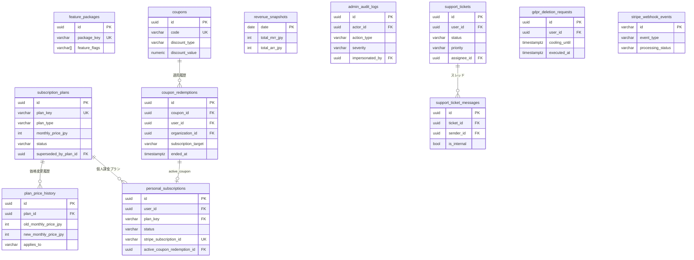
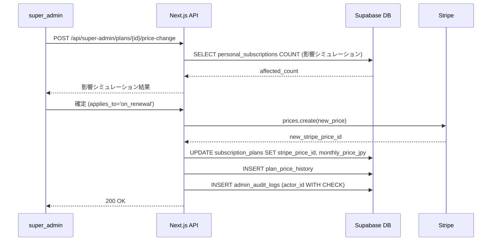

# operator/ データモデル設計

## 1. 目的・スコープ

運営管理ドメイン (operator) が管理するすべての PostgreSQL テーブルの DDL、RLS ポリシー、インデックス、seed データを定義する。本ドキュメントが定義するテーブル群は **全ドメインの基盤** となり、family/ および org/ ドメインは `subscription_plans.plan_key` を FK 参照する。

対象外: `auth.users`（Supabase Auth 管轄）、`dataset_*`（公開マスター）、family 系・org 系テーブル。

## 2. 関連要件

- 要件 03 §7 データモデル
- 要件 03 §11.0 マイグレーション依存順序
- 要件 03 §15.7 GDPR 削除要求
- 要件 03 §15.8 監査ログ対象操作
- 要件 03 §17.1 パスワード履歴
- 要件 03 §17.4 セッション管理
- 要件 03 §17.10 子供アカウント保護
- cross/02-rls-patterns.md RLS パターン

## 3. データモデル

### 3.1 マイグレーション適用順序 (§11.0 再掲)

```
[Phase 4.5 開始 — 以下の順序で適用、逆順は FK 制約違反で失敗]

1. subscription_plans       ← 全ドメインの plan_key FK 起点、'free' を必ず seed
2. feature_packages
3. plan_price_history
4. coupons
5. coupon_redemptions
6. personal_subscriptions   ← subscription_plans(plan_key) FK
7. revenue_snapshots
8. admin_audit_logs         ← 拡張 (既存テーブルに列追加)
9. support_tickets
10. support_ticket_messages
11. sales_leads
12. sales_activities (sales_lead_activities)
13. infra_metrics / infra_alerts
14. experiments / experiment_assignments
15. nps_surveys / csat_feedbacks
16. daily_active_users
17. referral_rewards
18. help_articles
19. stripe_webhook_events
20. email_delivery_logs
21. email_blacklist
22. cookie_consents
23. external_data_consents
24. terms_acceptances
25. gdpr_deletion_requests
26. parental_consents  ← family/01-data-model.md で定義 (family_members FK のため family/ ドメイン適用後)
27. password_history
28. failed_invite_lookups
29. user_sessions_metadata
30. handson_tour 関連 (§3.26)  ← family/09 連携: user_profiles 2 列追加 + meals.is_sandbox + user_daily_meals.is_sandbox + badges seed + RPC 2 本
```

### 3.2 `subscription_plans` — プラン定義マスター

```sql
CREATE TABLE subscription_plans (
  id                      UUID PRIMARY KEY DEFAULT gen_random_uuid(),
  plan_key                VARCHAR(100) NOT NULL UNIQUE,
  display_name            VARCHAR(200) NOT NULL,
  plan_type               VARCHAR(20) NOT NULL
    CHECK (plan_type IN ('personal', 'family', 'org')),
  description             TEXT,
  -- 価格
  monthly_price_jpy       INT,            -- NULL = 無料 or カスタム
  yearly_price_jpy        INT,
  currency                VARCHAR(3) NOT NULL DEFAULT 'JPY',
  -- Stripe 連携
  stripe_product_id       VARCHAR(255),   -- Stripe Product object ID
  stripe_price_id         VARCHAR(255),   -- 現在有効な Stripe Price ID
  -- 上限値
  max_members             INT,            -- 家族最大人数、組織最大 seat 数
  max_family_seats        INT,            -- 組織プランの家族同梱 seat 数
  -- 機能
  feature_packages        UUID[] NOT NULL DEFAULT '{}',  -- feature_packages.id 配列
  -- 公開ステータス
  status                  VARCHAR(20) NOT NULL DEFAULT 'draft'
    CHECK (status IN ('draft', 'public', 'private', 'deprecated')),
  display_order           INT NOT NULL DEFAULT 0,
  -- メタ
  banner_url              TEXT,
  trial_days              INT NOT NULL DEFAULT 0,
  min_contract_months     INT NOT NULL DEFAULT 1,
  auto_renew_default      BOOLEAN NOT NULL DEFAULT TRUE,
  -- deprecated 状態管理
  ends_at                 TIMESTAMPTZ,    -- プランの提供終了日 (deprecated プランのみ設定)
                                          -- NULL = 提供継続中 or 未設定
  -- バージョン管理
  version                 INT NOT NULL DEFAULT 1,
  superseded_by_plan_id   UUID REFERENCES subscription_plans(id),
  created_at              TIMESTAMPTZ NOT NULL DEFAULT NOW(),
  updated_at              TIMESTAMPTZ NOT NULL DEFAULT NOW()
);

CREATE INDEX idx_subscription_plans_status ON subscription_plans(status, display_order);
CREATE INDEX idx_subscription_plans_type ON subscription_plans(plan_type, status);

-- RLS
ALTER TABLE subscription_plans ENABLE ROW LEVEL SECURITY;

-- SELECT: 全認証ユーザー + 匿名 (公開プランのみ)
CREATE POLICY "subscription_plans_select_public" ON subscription_plans
  FOR SELECT USING (
    status IN ('public', 'private')
    OR EXISTS (
      SELECT 1 FROM user_profiles
      WHERE id = auth.uid()
        AND ARRAY['admin','super_admin']::TEXT[] && roles
    )
  );

-- INSERT / UPDATE / DELETE: super_admin のみ
CREATE POLICY "subscription_plans_mutate_super_admin" ON subscription_plans
  FOR ALL USING (
    EXISTS (
      SELECT 1 FROM user_profiles
      WHERE id = auth.uid() AND 'super_admin' = ANY(roles)
    )
  )
  WITH CHECK (
    EXISTS (
      SELECT 1 FROM user_profiles
      WHERE id = auth.uid() AND 'super_admin' = ANY(roles)
    )
  );
```

#### 9 種公式 plan_key seed

```sql
-- 必ず subscription_plans が存在してから実行
-- 'free' は全ドメインのデフォルト値として必須

INSERT INTO subscription_plans
  (plan_key, display_name, plan_type, monthly_price_jpy, yearly_price_jpy,
   max_members, trial_days, status, display_order)
VALUES
  ('free',           'Free',            'personal', 0,     0,      NULL, 0, 'public', 10),
  ('pro',            'Pro',             'personal', 980,   9800,   NULL, 7, 'public', 20),
  ('family_basic',   'Family Basic',    'family',   1480,  14800,  4,    7, 'public', 30),
  ('family_pro',     'Family Pro',      'family',   2480,  24800,  8,    7, 'public', 40),
  ('family_addon',   'Family Addon',    'family',   280,   NULL,   NULL, 0, 'private', 50),
  ('org_starter',    'Org Starter',     'org',      580,   5800,   30,   0, 'public', 60),
  ('org_standard',   'Org Standard',    'org',      980,   9800,   100,  0, 'public', 70),
  ('org_pro',        'Org Pro',         'org',      1980,  19800,  500,  0, 'public', 80),
  ('org_enterprise', 'Org Enterprise',  'org',      NULL,  NULL,   NULL, 0, 'public', 90)
ON CONFLICT (plan_key) DO NOTHING;
```

### 3.3 `feature_packages` — 機能パッケージ

```sql
CREATE TABLE feature_packages (
  id              UUID PRIMARY KEY DEFAULT gen_random_uuid(),
  package_key     VARCHAR(100) NOT NULL UNIQUE,
  display_name    VARCHAR(200) NOT NULL,
  description     TEXT,
  feature_flags   VARCHAR(100)[] NOT NULL DEFAULT '{}',
  display_order   INT NOT NULL DEFAULT 0,
  status          VARCHAR(20) NOT NULL DEFAULT 'active'
    CHECK (status IN ('active', 'deprecated')),
  created_at      TIMESTAMPTZ NOT NULL DEFAULT NOW(),
  updated_at      TIMESTAMPTZ NOT NULL DEFAULT NOW()
);

ALTER TABLE feature_packages ENABLE ROW LEVEL SECURITY;

CREATE POLICY "feature_packages_select_authenticated" ON feature_packages
  FOR SELECT TO authenticated USING (status = 'active');

CREATE POLICY "feature_packages_mutate_super_admin" ON feature_packages
  FOR ALL USING (
    EXISTS (SELECT 1 FROM user_profiles WHERE id = auth.uid() AND 'super_admin' = ANY(roles))
  );

-- seed
INSERT INTO feature_packages (package_key, display_name, feature_flags, display_order) VALUES
  ('basic',             '基本機能',      ARRAY['meal_tracking','nutrition_view','health_record'], 10),
  ('ai_analysis',       'AI 解析',       ARRAY['food_recognition','ai_consultation','ai_menu_generate'], 20),
  ('family_management', '家族管理',      ARRAY['family_groups_enabled','shared_menu','shopping_list'], 30),
  ('family_8members',   '家族 8 名拡張', ARRAY['family_max_8_enabled'], 40),
  ('org_management',    '組織管理',      ARRAY['org_dashboard','license_management','challenge_feature'], 50),
  ('industrial_doctor', '産業医連携',    ARRAY['industrial_doctor_access','ai_doctor_advice','health_report_advanced'], 60),
  ('sso',               'SSO',           ARRAY['sso_saml_enabled','scim_enabled'], 70)
ON CONFLICT (package_key) DO NOTHING;
```

### 3.4 `plan_price_history` — 価格変更履歴

```sql
CREATE TABLE plan_price_history (
  id                    UUID PRIMARY KEY DEFAULT gen_random_uuid(),
  plan_id               UUID NOT NULL REFERENCES subscription_plans(id) ON DELETE CASCADE,
  old_monthly_price_jpy INT,
  new_monthly_price_jpy INT,
  old_yearly_price_jpy  INT,
  new_yearly_price_jpy  INT,
  old_stripe_price_id   VARCHAR(255),
  new_stripe_price_id   VARCHAR(255),
  changed_by            UUID NOT NULL REFERENCES auth.users(id),
  reason                TEXT,
  effective_at          TIMESTAMPTZ NOT NULL,
  applies_to            VARCHAR(30) NOT NULL
    CHECK (applies_to IN ('new_only', 'on_renewal', 'immediately')),
  affected_subscription_count INT,
  created_at            TIMESTAMPTZ NOT NULL DEFAULT NOW()
);

CREATE INDEX idx_plan_price_history_plan ON plan_price_history(plan_id, created_at DESC);

ALTER TABLE plan_price_history ENABLE ROW LEVEL SECURITY;

CREATE POLICY "plan_price_history_select" ON plan_price_history
  FOR SELECT USING (
    EXISTS (
      SELECT 1 FROM user_profiles
      WHERE id = auth.uid()
        AND ARRAY['admin','super_admin','finance']::TEXT[] && roles
    )
  );

-- UPDATE / DELETE 不可 (変更履歴は不可逆)
CREATE POLICY "plan_price_history_no_update" ON plan_price_history
  FOR UPDATE USING (false);
CREATE POLICY "plan_price_history_no_delete" ON plan_price_history
  FOR DELETE USING (false);
```

### 3.5 `coupons` — クーポン・割引コード

```sql
CREATE TABLE coupons (
  id                UUID PRIMARY KEY DEFAULT gen_random_uuid(),
  code              VARCHAR(50) NOT NULL UNIQUE,
  display_name      VARCHAR(200),
  discount_type     VARCHAR(20) NOT NULL CHECK (discount_type IN ('fixed', 'percentage')),
  discount_value    NUMERIC NOT NULL,
  applicable_plans  UUID[] NOT NULL DEFAULT '{}',
  applicable_to     VARCHAR(20) NOT NULL DEFAULT 'all'
    CHECK (applicable_to IN ('all', 'personal', 'family', 'org')),
  valid_from        TIMESTAMPTZ NOT NULL,
  valid_until       TIMESTAMPTZ NOT NULL,
  max_uses          INT,
  uses_count        INT NOT NULL DEFAULT 0,
  per_user_limit    INT NOT NULL DEFAULT 1,
  duration_months   INT,
  -- クーポン利益プレビュー (管理 UI 向け、DB 計算済)
  gross_margin_preview_jpy INT,
  status            VARCHAR(20) NOT NULL DEFAULT 'active'
    CHECK (status IN ('active', 'paused', 'expired')),
  created_by        UUID NOT NULL REFERENCES auth.users(id),
  created_at        TIMESTAMPTZ NOT NULL DEFAULT NOW(),
  CONSTRAINT coupons_discount_value_positive CHECK (discount_value > 0),
  CONSTRAINT coupons_percentage_max CHECK (discount_type != 'percentage' OR discount_value <= 100)
);

CREATE INDEX idx_coupons_code ON coupons(code);
CREATE INDEX idx_coupons_status ON coupons(status, valid_until);

ALTER TABLE coupons ENABLE ROW LEVEL SECURITY;

CREATE POLICY "coupons_select_sales_or_above" ON coupons
  FOR SELECT USING (
    EXISTS (
      SELECT 1 FROM user_profiles
      WHERE id = auth.uid()
        AND ARRAY['sales','finance','admin','super_admin']::TEXT[] && roles
    )
  );

CREATE POLICY "coupons_mutate_sales_or_above" ON coupons
  FOR ALL USING (
    EXISTS (
      SELECT 1 FROM user_profiles
      WHERE id = auth.uid()
        AND ARRAY['sales','admin','super_admin']::TEXT[] && roles
    )
  );
```

### 3.6 `coupon_redemptions` — クーポン適用履歴

```sql
CREATE TABLE coupon_redemptions (
  id                          UUID PRIMARY KEY DEFAULT gen_random_uuid(),
  coupon_id                   UUID NOT NULL REFERENCES coupons(id),
  user_id                     UUID REFERENCES auth.users(id),
  organization_id             UUID REFERENCES organizations(id) DEFERRABLE INITIALLY DEFERRED,
  -- NOTE: organizations テーブルは org/ ドメイン (02-organization-management) で作成される。
  -- coupon_redemptions は 01-operator-admin で先に作成されるため DEFERRABLE INITIALLY DEFERRED を付与。
  subscription_target         VARCHAR(20) NOT NULL
    CHECK (subscription_target IN ('personal', 'org')),
  applied_to_subscription_id  UUID NOT NULL,
  discount_amount_jpy         INT NOT NULL,
  duration_months             INT,
  redeemed_at                 TIMESTAMPTZ NOT NULL DEFAULT NOW(),
  ended_at                    TIMESTAMPTZ,
  end_reason                  VARCHAR(50),
    -- 'replaced_by_other_coupon' / 'subscription_cancelled' / 'duration_expired'
  applied_retroactively       BOOLEAN NOT NULL DEFAULT FALSE,
  approved_by                 UUID REFERENCES auth.users(id),
  CONSTRAINT coupon_redemptions_user_or_org CHECK (
    (user_id IS NOT NULL) OR (organization_id IS NOT NULL)
  )
);

-- 1 契約に対し有効な redemption は常に 1 件まで (重複適用不可)
CREATE UNIQUE INDEX idx_coupon_redemptions_active_per_subscription
  ON coupon_redemptions(subscription_target, applied_to_subscription_id)
  WHERE ended_at IS NULL;

CREATE INDEX idx_coupon_redemptions_coupon ON coupon_redemptions(coupon_id, redeemed_at DESC);

ALTER TABLE coupon_redemptions ENABLE ROW LEVEL SECURITY;

CREATE POLICY "coupon_redemptions_select" ON coupon_redemptions
  FOR SELECT USING (
    user_id = auth.uid()
    OR EXISTS (
      SELECT 1 FROM user_profiles
      WHERE id = auth.uid()
        AND ARRAY['finance','admin','super_admin']::TEXT[] && roles
    )
  );
```

### 3.7 `personal_subscriptions` — 個人課金

```sql
CREATE TABLE personal_subscriptions (
  id                          UUID PRIMARY KEY DEFAULT gen_random_uuid(),
  user_id                     UUID NOT NULL REFERENCES auth.users(id) ON DELETE CASCADE,
  plan_key                    VARCHAR(100) NOT NULL
    REFERENCES subscription_plans(plan_key)
    ON UPDATE CASCADE ON DELETE RESTRICT,
  -- ステータス
  -- past_due → grace (7日経過) → cancelled (30日経過) の段階的遷移
  status                      VARCHAR(20) NOT NULL DEFAULT 'trialing'
    CHECK (status IN ('trialing', 'active', 'paused', 'cancelled', 'expired', 'past_due', 'grace')),
  -- 試用
  trial_started_at            TIMESTAMPTZ,
  trial_ends_at               TIMESTAMPTZ,
  trial_source                VARCHAR(50),
    -- 'direct' / 'referral' / 'campaign:xxx'
  -- 一時停止 (組織ライセンス受領時)
  paused_at                   TIMESTAMPTZ,
  paused_until                TIMESTAMPTZ,
  pause_reason                VARCHAR(50),
    -- 'org_license_received' / 'user_request'
  -- 期間
  starts_at                   TIMESTAMPTZ NOT NULL DEFAULT NOW(),
  current_period_start        TIMESTAMPTZ,
  current_period_end          TIMESTAMPTZ,
  cancel_at                   TIMESTAMPTZ,
  cancelled_at                TIMESTAMPTZ,
  -- グレースペリオド (past_due → grace → cancelled 遷移)
  past_due_since              TIMESTAMPTZ,  -- status が past_due になった時刻
  grace_started_at            TIMESTAMPTZ,  -- status が grace になった時刻 (past_due から 7 日後)
  -- Stripe
  stripe_customer_id          VARCHAR(255),
  stripe_subscription_id      VARCHAR(255) UNIQUE,
  stripe_price_id             VARCHAR(255),
  -- クーポン
  active_coupon_redemption_id UUID REFERENCES coupon_redemptions(id),
  -- メタ
  notes                       TEXT,
  created_at                  TIMESTAMPTZ NOT NULL DEFAULT NOW(),
  updated_at                  TIMESTAMPTZ NOT NULL DEFAULT NOW(),
  CONSTRAINT ps_paused_until_required
    CHECK (NOT (status = 'paused' AND paused_until IS NULL))
);

-- 1 ユーザーに対し active/trialing/paused/past_due/grace は最大 1 件
-- (cancelled/expired は履歴として複数残せる)
CREATE UNIQUE INDEX idx_personal_subscriptions_active_per_user
  ON personal_subscriptions(user_id)
  WHERE status IN ('trialing', 'active', 'paused', 'past_due', 'grace');

CREATE INDEX idx_personal_subscriptions_status
  ON personal_subscriptions(status);
CREATE INDEX idx_personal_subscriptions_trial_ending
  ON personal_subscriptions(trial_ends_at)
  WHERE status = 'trialing';
CREATE INDEX idx_personal_subscriptions_stripe_sub
  ON personal_subscriptions(stripe_subscription_id)
  WHERE stripe_subscription_id IS NOT NULL;

ALTER TABLE personal_subscriptions ENABLE ROW LEVEL SECURITY;

-- SELECT: 本人 or admin 系 or finance
CREATE POLICY "personal_subscriptions_select" ON personal_subscriptions
  FOR SELECT USING (
    user_id = auth.uid()
    OR EXISTS (
      SELECT 1 FROM user_profiles
      WHERE id = auth.uid()
        AND ARRAY['admin','super_admin','finance','support']::TEXT[] && roles
    )
  );

-- INSERT: 本人 (Stripe Webhook 経由 service_role) or admin
CREATE POLICY "personal_subscriptions_insert" ON personal_subscriptions
  FOR INSERT WITH CHECK (
    user_id = auth.uid()
    OR EXISTS (
      SELECT 1 FROM user_profiles
      WHERE id = auth.uid()
        AND ARRAY['admin','super_admin']::TEXT[] && roles
    )
  );

-- UPDATE: 本人 (cancel/pause) or admin/super_admin
CREATE POLICY "personal_subscriptions_update" ON personal_subscriptions
  FOR UPDATE USING (
    user_id = auth.uid()
    OR EXISTS (
      SELECT 1 FROM user_profiles
      WHERE id = auth.uid()
        AND ARRAY['admin','super_admin']::TEXT[] && roles
    )
  );

-- DELETE: 不可 (履歴保持)
CREATE POLICY "personal_subscriptions_no_delete" ON personal_subscriptions
  FOR DELETE USING (false);
```

### 3.8 `revenue_snapshots` — 収益日次スナップショット

```sql
CREATE TABLE revenue_snapshots (
  date                  DATE PRIMARY KEY,
  personal_active_users INT NOT NULL DEFAULT 0,
  personal_mrr_jpy      INT NOT NULL DEFAULT 0,
  family_active_groups  INT NOT NULL DEFAULT 0,
  family_mrr_jpy        INT NOT NULL DEFAULT 0,
  org_active_orgs       INT NOT NULL DEFAULT 0,
  org_active_seats      INT NOT NULL DEFAULT 0,
  org_mrr_jpy           INT NOT NULL DEFAULT 0,
  total_mrr_jpy         INT NOT NULL DEFAULT 0,
  total_arr_jpy         INT NOT NULL DEFAULT 0,
  new_signups           INT NOT NULL DEFAULT 0,
  cancellations         INT NOT NULL DEFAULT 0,
  upgrade_count         INT NOT NULL DEFAULT 0,
  downgrade_count       INT NOT NULL DEFAULT 0,
  trial_starts          INT NOT NULL DEFAULT 0,
  trial_conversions     INT NOT NULL DEFAULT 0,
  computed_at           TIMESTAMPTZ NOT NULL DEFAULT NOW()
);

ALTER TABLE revenue_snapshots ENABLE ROW LEVEL SECURITY;

CREATE POLICY "revenue_snapshots_select" ON revenue_snapshots
  FOR SELECT USING (
    EXISTS (
      SELECT 1 FROM user_profiles
      WHERE id = auth.uid()
        AND ARRAY['finance','admin','super_admin']::TEXT[] && roles
    )
  );
```

### 3.9 `admin_audit_logs` — 監査ログ (不可逆)

既存テーブル拡張 + RLS 強化:

```sql
-- 既存テーブル拡張
ALTER TABLE admin_audit_logs
  ADD COLUMN IF NOT EXISTS target_type          VARCHAR(30),
  ADD COLUMN IF NOT EXISTS severity             VARCHAR(20) NOT NULL DEFAULT 'info'
    CHECK (severity IN ('info', 'warn', 'critical')),
  ADD COLUMN IF NOT EXISTS impersonated_by      UUID REFERENCES auth.users(id) ON DELETE SET NULL,
  ADD COLUMN IF NOT EXISTS session_id           VARCHAR(255),
  ADD COLUMN IF NOT EXISTS ip_address           INET,
  ADD COLUMN IF NOT EXISTS user_agent           TEXT,
  ADD COLUMN IF NOT EXISTS actor_email_snapshot VARCHAR(255),  -- GDPR 削除後の actor 特定用
  ADD COLUMN IF NOT EXISTS actor_role_snapshot  VARCHAR(50);   -- GDPR 削除後の actor ロール保持

-- actor_id を NOT NULL → NULL 許容に変更 (GDPR 削除対応)
ALTER TABLE admin_audit_logs ALTER COLUMN actor_id DROP NOT NULL;
ALTER TABLE admin_audit_logs
  DROP CONSTRAINT IF EXISTS admin_audit_logs_actor_id_fkey;
ALTER TABLE admin_audit_logs
  ADD CONSTRAINT admin_audit_logs_actor_id_fkey
    FOREIGN KEY (actor_id) REFERENCES auth.users(id) ON DELETE SET NULL;

-- インデックス
CREATE INDEX IF NOT EXISTS idx_audit_logs_actor ON admin_audit_logs(actor_id, created_at DESC);
CREATE INDEX IF NOT EXISTS idx_audit_logs_target ON admin_audit_logs(target_id, created_at DESC);
CREATE INDEX IF NOT EXISTS idx_audit_logs_action ON admin_audit_logs(action_type, created_at DESC);
CREATE INDEX IF NOT EXISTS idx_audit_logs_severity ON admin_audit_logs(severity, created_at DESC);

ALTER TABLE admin_audit_logs ENABLE ROW LEVEL SECURITY;

-- SELECT: super_admin のみ
-- (admin が自分の操作を消せない設計 — admin にも閲覧権限を与えない)
CREATE POLICY "audit_logs_select_super_admin" ON admin_audit_logs
  FOR SELECT USING (
    EXISTS (
      SELECT 1 FROM user_profiles
      WHERE id = auth.uid() AND 'super_admin' = ANY(roles)
    )
  );

-- INSERT: admin 系全ロールから可、actor_id = auth.uid() を強制
CREATE POLICY "audit_logs_insert_admins" ON admin_audit_logs
  FOR INSERT WITH CHECK (
    actor_id = auth.uid()
    AND EXISTS (
      SELECT 1 FROM user_profiles
      WHERE id = auth.uid()
        AND ARRAY['admin','super_admin','support','sales','finance','content_moderator']::TEXT[]
            && roles
    )
  );

-- UPDATE / DELETE: 完全禁止 (不可逆性の保証)
CREATE POLICY "audit_logs_no_update" ON admin_audit_logs
  FOR UPDATE USING (false);
CREATE POLICY "audit_logs_no_delete" ON admin_audit_logs
  FOR DELETE USING (false);

-- 7 年保管: 運用ポリシーで pg_cron による Cold Storage 移行を実施
-- (physical DELETE は永遠に禁止、アーカイブテーブルへの COPY + DELETE は super_admin が手動)
COMMENT ON TABLE admin_audit_logs IS '監査ログ。RLS により UPDATE/DELETE 完全禁止。保持期間7年(個人情報保護法/SOC2)';
```

### 3.9.1 `user_profiles` 拡張 (operator 連携用)

re_engagement バッチ (operator/08-cron-batches.md §5.5) が参照する列を追加する。

```sql
-- マイグレーション: 2026MMDD011_alter_user_profiles_operator.sql

ALTER TABLE user_profiles
  ADD COLUMN IF NOT EXISTS last_login_at    TIMESTAMPTZ,
  -- 最終ログイン日時 (auth.users.last_sign_in_at を Edge Function が同期)
  ADD COLUMN IF NOT EXISTS plan_key_cached  VARCHAR(100);
  -- personal_subscriptions の現在有効な plan_key キャッシュ (Edge Function が同期、常に最新とは限らない)
```

### 3.10 `support_tickets` / `support_ticket_messages`

```sql
CREATE TABLE support_tickets (
  id            UUID PRIMARY KEY DEFAULT gen_random_uuid(),
  user_id       UUID NOT NULL REFERENCES auth.users(id),
  subject       VARCHAR(200) NOT NULL,
  category      VARCHAR(50) NOT NULL
    CHECK (category IN ('account','billing','feature','bug','other')),
  priority      VARCHAR(20) NOT NULL DEFAULT 'medium'
    CHECK (priority IN ('low', 'medium', 'high', 'urgent')),
  status        VARCHAR(20) NOT NULL DEFAULT 'open'
    CHECK (status IN ('open', 'in_progress', 'pending', 'resolved', 'closed')),
  assignee_id   UUID REFERENCES auth.users(id),
  -- SLA tracking
  first_response_at TIMESTAMPTZ,
  resolved_at   TIMESTAMPTZ,
  closed_at     TIMESTAMPTZ,
  -- 組織・家族関連付け (任意)
  organization_id UUID REFERENCES organizations(id),
  created_at    TIMESTAMPTZ NOT NULL DEFAULT NOW(),
  updated_at    TIMESTAMPTZ NOT NULL DEFAULT NOW()
);

CREATE INDEX idx_support_tickets_status ON support_tickets(status, created_at DESC);
CREATE INDEX idx_support_tickets_assignee ON support_tickets(assignee_id, status);
CREATE INDEX idx_support_tickets_user ON support_tickets(user_id, created_at DESC);

CREATE TABLE support_ticket_messages (
  id          UUID PRIMARY KEY DEFAULT gen_random_uuid(),
  ticket_id   UUID NOT NULL REFERENCES support_tickets(id) ON DELETE CASCADE,
  sender_id   UUID NOT NULL REFERENCES auth.users(id),
  is_internal BOOLEAN NOT NULL DEFAULT FALSE,
  body        TEXT NOT NULL,
  attachments JSONB DEFAULT '[]',
  created_at  TIMESTAMPTZ NOT NULL DEFAULT NOW()
);

CREATE INDEX idx_ticket_messages_ticket ON support_ticket_messages(ticket_id, created_at ASC);

ALTER TABLE support_tickets ENABLE ROW LEVEL SECURITY;
ALTER TABLE support_ticket_messages ENABLE ROW LEVEL SECURITY;

-- tickets: 本人閲覧 + support/admin/super_admin
CREATE POLICY "tickets_select" ON support_tickets
  FOR SELECT USING (
    user_id = auth.uid()
    OR EXISTS (
      SELECT 1 FROM user_profiles
      WHERE id = auth.uid()
        AND ARRAY['support','admin','super_admin']::TEXT[] && roles
    )
  );

CREATE POLICY "tickets_insert_user" ON support_tickets
  FOR INSERT WITH CHECK (user_id = auth.uid());

CREATE POLICY "tickets_update_support" ON support_tickets
  FOR UPDATE USING (
    EXISTS (
      SELECT 1 FROM user_profiles
      WHERE id = auth.uid()
        AND ARRAY['support','admin','super_admin']::TEXT[] && roles
    )
  );

-- messages: 内部メモは support のみ閲覧
CREATE POLICY "ticket_messages_select" ON support_ticket_messages
  FOR SELECT USING (
    NOT is_internal
    OR EXISTS (
      SELECT 1 FROM user_profiles
      WHERE id = auth.uid()
        AND ARRAY['support','admin','super_admin']::TEXT[] && roles
    )
  );

CREATE POLICY "ticket_messages_insert" ON support_ticket_messages
  FOR INSERT WITH CHECK (sender_id = auth.uid());
```

### 3.11 `sales_leads` / `sales_lead_activities`

```sql
CREATE TABLE sales_leads (
  id              UUID PRIMARY KEY DEFAULT gen_random_uuid(),
  company_name    VARCHAR(200) NOT NULL,
  industry        VARCHAR(100),
  employee_count  INT,
  contact_name    VARCHAR(100),
  contact_email   VARCHAR(255),
  contact_phone   VARCHAR(50),
  source          VARCHAR(50)
    CHECK (source IN ('website','referral','event','cold_call','other')),
  stage           VARCHAR(30) NOT NULL DEFAULT 'approach'
    CHECK (stage IN ('approach','meeting','proposal','negotiation','won','lost')),
  assigned_to     UUID REFERENCES auth.users(id),
  estimated_acv   INT,
  notes           TEXT,
  -- 契約後の組織 ID
  converted_org_id UUID REFERENCES organizations(id),
  created_at      TIMESTAMPTZ NOT NULL DEFAULT NOW(),
  updated_at      TIMESTAMPTZ NOT NULL DEFAULT NOW()
);

CREATE INDEX idx_sales_leads_stage ON sales_leads(stage, assigned_to);

CREATE TABLE sales_lead_activities (
  id              UUID PRIMARY KEY DEFAULT gen_random_uuid(),
  lead_id         UUID NOT NULL REFERENCES sales_leads(id) ON DELETE CASCADE,
  actor_id        UUID NOT NULL REFERENCES auth.users(id),
  activity_type   VARCHAR(30) NOT NULL
    CHECK (activity_type IN ('call','email','meeting','note','stage_change')),
  details         JSONB NOT NULL,
  created_at      TIMESTAMPTZ NOT NULL DEFAULT NOW()
);

ALTER TABLE sales_leads ENABLE ROW LEVEL SECURITY;
ALTER TABLE sales_lead_activities ENABLE ROW LEVEL SECURITY;

CREATE POLICY "sales_leads_access" ON sales_leads
  FOR ALL USING (
    EXISTS (
      SELECT 1 FROM user_profiles
      WHERE id = auth.uid()
        AND ARRAY['sales','admin','super_admin']::TEXT[] && roles
    )
  );

CREATE POLICY "sales_activities_access" ON sales_lead_activities
  FOR ALL USING (
    EXISTS (
      SELECT 1 FROM user_profiles
      WHERE id = auth.uid()
        AND ARRAY['sales','admin','super_admin']::TEXT[] && roles
    )
  );
```

### 3.12 `infra_metrics` / `infra_alerts`

```sql
CREATE TABLE infra_metrics (
  id          UUID PRIMARY KEY DEFAULT gen_random_uuid(),
  metric_name VARCHAR(100) NOT NULL,
  source      VARCHAR(50) NOT NULL
    CHECK (source IN ('vercel','supabase','gemini','xai','anthropic','openai','custom')),
  value       NUMERIC NOT NULL,
  unit        VARCHAR(20),
  tags        JSONB DEFAULT '{}',
  recorded_at TIMESTAMPTZ NOT NULL DEFAULT NOW()
);

CREATE INDEX idx_infra_metrics_recent ON infra_metrics(metric_name, recorded_at DESC);
-- 30 日以上古いデータは pg_cron で削除
CREATE INDEX idx_infra_metrics_cleanup ON infra_metrics(recorded_at);

CREATE TABLE infra_alerts (
  id          UUID PRIMARY KEY DEFAULT gen_random_uuid(),
  metric_name VARCHAR(100) NOT NULL,
  threshold   NUMERIC NOT NULL,
  comparison  VARCHAR(10) NOT NULL CHECK (comparison IN ('>','>=','<','<=','=')),
  triggered_at TIMESTAMPTZ NOT NULL,
  resolved_at TIMESTAMPTZ,
  details     JSONB,
  ack_by      UUID REFERENCES auth.users(id),
  ack_at      TIMESTAMPTZ,
  created_at  TIMESTAMPTZ NOT NULL DEFAULT NOW()
);

ALTER TABLE infra_metrics ENABLE ROW LEVEL SECURITY;
ALTER TABLE infra_alerts ENABLE ROW LEVEL SECURITY;

CREATE POLICY "infra_select_super_admin" ON infra_metrics
  FOR SELECT USING (
    EXISTS (SELECT 1 FROM user_profiles WHERE id = auth.uid() AND 'super_admin' = ANY(roles))
  );

CREATE POLICY "infra_alerts_access" ON infra_alerts
  FOR ALL USING (
    EXISTS (
      SELECT 1 FROM user_profiles
      WHERE id = auth.uid() AND ARRAY['admin','super_admin']::TEXT[] && roles
    )
  );
```

### 3.13 `experiments` / `experiment_assignments` — A/B テスト

```sql
CREATE TABLE experiments (
  id              UUID PRIMARY KEY DEFAULT gen_random_uuid(),
  key             VARCHAR(100) NOT NULL UNIQUE,
  name            VARCHAR(200) NOT NULL,
  hypothesis      TEXT,
  variants        JSONB NOT NULL,
    -- [{ key: 'control', weight: 50 }, { key: 'variant_a', weight: 50 }]
  primary_metric  VARCHAR(100),
  start_date      DATE,
  end_date        DATE,
  status          VARCHAR(20) NOT NULL DEFAULT 'draft'
    CHECK (status IN ('draft', 'running', 'completed', 'cancelled')),
  result          JSONB,
  created_by      UUID NOT NULL REFERENCES auth.users(id),
  created_at      TIMESTAMPTZ NOT NULL DEFAULT NOW()
);

CREATE TABLE experiment_assignments (
  experiment_id UUID NOT NULL REFERENCES experiments(id),
  user_id       UUID NOT NULL REFERENCES auth.users(id),
  variant_key   VARCHAR(50) NOT NULL,
  assigned_at   TIMESTAMPTZ NOT NULL DEFAULT NOW(),
  PRIMARY KEY (experiment_id, user_id)
);

ALTER TABLE experiments ENABLE ROW LEVEL SECURITY;

CREATE POLICY "experiments_select_super_admin" ON experiments
  FOR ALL USING (
    EXISTS (SELECT 1 FROM user_profiles WHERE id = auth.uid() AND 'super_admin' = ANY(roles))
  );
```

### 3.14 `nps_surveys` / `csat_feedbacks`

```sql
CREATE TABLE nps_surveys (
  id          UUID PRIMARY KEY DEFAULT gen_random_uuid(),
  user_id     UUID NOT NULL REFERENCES auth.users(id),
  score       INT NOT NULL CHECK (score BETWEEN 0 AND 10),
  comment     TEXT,
  plan_key    VARCHAR(100),
  sent_at     TIMESTAMPTZ NOT NULL,
  responded_at TIMESTAMPTZ,
  created_at  TIMESTAMPTZ NOT NULL DEFAULT NOW()
);

CREATE INDEX idx_nps_surveys_recent ON nps_surveys(sent_at DESC);

CREATE TABLE csat_feedbacks (
  id          UUID PRIMARY KEY DEFAULT gen_random_uuid(),
  user_id     UUID NOT NULL REFERENCES auth.users(id),
  ticket_id   UUID REFERENCES support_tickets(id),
  score       INT NOT NULL CHECK (score BETWEEN 1 AND 5),
  comment     TEXT,
  created_at  TIMESTAMPTZ NOT NULL DEFAULT NOW()
);

ALTER TABLE nps_surveys ENABLE ROW LEVEL SECURITY;
ALTER TABLE csat_feedbacks ENABLE ROW LEVEL SECURITY;

CREATE POLICY "nps_select_admin" ON nps_surveys
  FOR SELECT USING (
    EXISTS (
      SELECT 1 FROM user_profiles
      WHERE id = auth.uid() AND ARRAY['admin','super_admin','support']::TEXT[] && roles
    )
  );

CREATE POLICY "nps_insert_self" ON nps_surveys
  FOR INSERT WITH CHECK (user_id = auth.uid());

CREATE POLICY "csat_access" ON csat_feedbacks
  FOR ALL USING (
    user_id = auth.uid()
    OR EXISTS (
      SELECT 1 FROM user_profiles
      WHERE id = auth.uid() AND ARRAY['support','admin','super_admin']::TEXT[] && roles
    )
  );
```

### 3.15 `daily_active_users`

```sql
CREATE TABLE daily_active_users (
  date          DATE NOT NULL,
  plan_type     VARCHAR(20) NOT NULL CHECK (plan_type IN ('personal','family','org','all')),
  plan_key      VARCHAR(100) NOT NULL DEFAULT '',
  -- plan_key: 集計対象の plan_key。全体集計行は '' (空文字) を使用
  dau           INT NOT NULL DEFAULT 0,
  wau           INT NOT NULL DEFAULT 0,
  mau           INT NOT NULL DEFAULT 0,
  computed_at   TIMESTAMPTZ NOT NULL DEFAULT NOW(),
  PRIMARY KEY (date, plan_type, plan_key)
  -- NOTE: PostgreSQL の PRIMARY KEY に COALESCE 等の関数式は使用不可。
  -- plan_key を NOT NULL DEFAULT '' に変更し、全体集計行は '' で代替する。
);

ALTER TABLE daily_active_users ENABLE ROW LEVEL SECURITY;

CREATE POLICY "dau_select_admin" ON daily_active_users
  FOR SELECT USING (
    EXISTS (
      SELECT 1 FROM user_profiles
      WHERE id = auth.uid() AND ARRAY['admin','super_admin','finance']::TEXT[] && roles
    )
  );
```

### 3.16 `referral_rewards`

```sql
CREATE TABLE referral_rewards (
  id              UUID PRIMARY KEY DEFAULT gen_random_uuid(),
  referrer_id     UUID NOT NULL REFERENCES auth.users(id),
  referred_id     UUID NOT NULL REFERENCES auth.users(id),
  reward_type     VARCHAR(30) NOT NULL CHECK (reward_type IN ('credit','coupon','extension')),
  reward_value    JSONB NOT NULL,
  status          VARCHAR(20) NOT NULL DEFAULT 'pending'
    CHECK (status IN ('pending','granted','expired')),
  granted_at      TIMESTAMPTZ,
  expires_at      TIMESTAMPTZ,
  created_at      TIMESTAMPTZ NOT NULL DEFAULT NOW()
);

ALTER TABLE referral_rewards ENABLE ROW LEVEL SECURITY;

CREATE POLICY "referral_rewards_select" ON referral_rewards
  FOR SELECT USING (
    referrer_id = auth.uid()
    OR referred_id = auth.uid()
    OR EXISTS (
      SELECT 1 FROM user_profiles
      WHERE id = auth.uid() AND ARRAY['admin','super_admin']::TEXT[] && roles
    )
  );
```

### 3.17 `help_articles`

```sql
CREATE TABLE help_articles (
  id          UUID PRIMARY KEY DEFAULT gen_random_uuid(),
  slug        VARCHAR(200) NOT NULL UNIQUE,
  title       VARCHAR(500) NOT NULL,
  body        TEXT NOT NULL,
  category    VARCHAR(100),
  tags        VARCHAR(50)[] DEFAULT '{}',
  status      VARCHAR(20) NOT NULL DEFAULT 'draft'
    CHECK (status IN ('draft', 'published', 'archived')),
  locale      VARCHAR(5) NOT NULL DEFAULT 'ja',
  view_count  INT NOT NULL DEFAULT 0,
  created_by  UUID NOT NULL REFERENCES auth.users(id),
  created_at  TIMESTAMPTZ NOT NULL DEFAULT NOW(),
  updated_at  TIMESTAMPTZ NOT NULL DEFAULT NOW()
);

ALTER TABLE help_articles ENABLE ROW LEVEL SECURITY;

CREATE POLICY "help_articles_public" ON help_articles
  FOR SELECT USING (status = 'published');

CREATE POLICY "help_articles_manage" ON help_articles
  FOR ALL USING (
    EXISTS (
      SELECT 1 FROM user_profiles
      WHERE id = auth.uid() AND ARRAY['admin','super_admin','support']::TEXT[] && roles
    )
  );
```

### 3.18 `stripe_webhook_events` — Stripe Webhook 冪等化

```sql
CREATE TABLE stripe_webhook_events (
  id              VARCHAR(255) PRIMARY KEY,  -- Stripe event.id (例: evt_1234)
  event_type      VARCHAR(100) NOT NULL,
  payload         JSONB NOT NULL,
  processing_status VARCHAR(20) NOT NULL DEFAULT 'pending'
    CHECK (processing_status IN ('pending','processing','completed','failed')),
  processed_at    TIMESTAMPTZ,
  error_message   TEXT,
  received_at     TIMESTAMPTZ NOT NULL DEFAULT NOW()
);

CREATE INDEX idx_stripe_webhook_status ON stripe_webhook_events(processing_status, received_at);

ALTER TABLE stripe_webhook_events ENABLE ROW LEVEL SECURITY;

-- service_role のみアクセス (Webhook ハンドラは Edge Function 経由)
CREATE POLICY "stripe_webhook_no_access_rls" ON stripe_webhook_events
  FOR ALL USING (false);
-- Edge Function は service_role で bypass
```

### 3.19 `email_delivery_logs` / `email_blacklist`

```sql
CREATE TABLE email_delivery_logs (
  id              UUID PRIMARY KEY DEFAULT gen_random_uuid(),
  user_id         UUID REFERENCES auth.users(id),
  email           VARCHAR(255) NOT NULL,
  template        VARCHAR(100),
  resend_message_id VARCHAR(255),
  status          VARCHAR(20) NOT NULL DEFAULT 'sent'
    CHECK (status IN ('sent', 'delivered', 'bounced', 'complained', 'opened', 'clicked')),
  metadata        JSONB DEFAULT '{}',
  sent_at         TIMESTAMPTZ NOT NULL DEFAULT NOW()
);

CREATE INDEX idx_email_logs_email ON email_delivery_logs(email, sent_at DESC);
CREATE INDEX idx_email_logs_user ON email_delivery_logs(user_id, sent_at DESC);

CREATE TABLE email_blacklist (
  email         VARCHAR(255) PRIMARY KEY,
  reason        VARCHAR(50) NOT NULL CHECK (reason IN ('bounce','complaint','manual')),
  added_at      TIMESTAMPTZ NOT NULL DEFAULT NOW(),
  added_by      UUID REFERENCES auth.users(id)
);

ALTER TABLE email_delivery_logs ENABLE ROW LEVEL SECURITY;
ALTER TABLE email_blacklist ENABLE ROW LEVEL SECURITY;

CREATE POLICY "email_logs_admin" ON email_delivery_logs
  FOR SELECT USING (
    EXISTS (
      SELECT 1 FROM user_profiles
      WHERE id = auth.uid() AND ARRAY['support','admin','super_admin']::TEXT[] && roles
    )
  );

CREATE POLICY "email_blacklist_admin" ON email_blacklist
  FOR ALL USING (
    EXISTS (
      SELECT 1 FROM user_profiles
      WHERE id = auth.uid() AND ARRAY['admin','super_admin']::TEXT[] && roles
    )
  );
```

### 3.20 同意管理テーブル群

以下 3 テーブルの DDL は `cross/08-legal-compliance.md` を canonical とする。

- **cookie_consents** — §12.2 を参照 (改正電気通信事業法準拠、analytics / advertising BOOLEAN)
- **external_data_consents** — §4.3 を参照 (外国第三者提供同意: xAI / Anthropic / Google / OpenAI)
  - 産業医・組織への外部データ共有同意を扱う場合は別名テーブル (例: `org_data_sharing_consents`) で別途定義すること
- **terms_acceptances** — §7.1 を参照 (document_type: terms_of_service / privacy_policy / parental_consent / external_data_provision)

### 3.21 `gdpr_deletion_requests`

```sql
CREATE TABLE gdpr_deletion_requests (
  id              UUID PRIMARY KEY DEFAULT gen_random_uuid(),
  user_id         UUID NOT NULL REFERENCES auth.users(id),
  requested_at    TIMESTAMPTZ NOT NULL DEFAULT NOW(),
  cooling_until   TIMESTAMPTZ NOT NULL DEFAULT (NOW() + INTERVAL '30 days'),
  cancelled_at    TIMESTAMPTZ,
  executed_at     TIMESTAMPTZ,
  certificate_url TEXT,
  executed_by     UUID REFERENCES auth.users(id),  -- NULL = 自動バッチ
  notes           TEXT
);

ALTER TABLE gdpr_deletion_requests ENABLE ROW LEVEL SECURITY;

CREATE POLICY "gdpr_select" ON gdpr_deletion_requests
  FOR SELECT USING (
    user_id = auth.uid()
    OR EXISTS (
      SELECT 1 FROM user_profiles
      WHERE id = auth.uid() AND ARRAY['admin','super_admin']::TEXT[] && roles
    )
  );

CREATE POLICY "gdpr_insert_self" ON gdpr_deletion_requests
  FOR INSERT WITH CHECK (user_id = auth.uid());

-- UPDATE (cancel / execute): 本人キャンセルまたは super_admin
CREATE POLICY "gdpr_update" ON gdpr_deletion_requests
  FOR UPDATE USING (
    (user_id = auth.uid() AND executed_at IS NULL)
    OR EXISTS (
      SELECT 1 FROM user_profiles
      WHERE id = auth.uid() AND 'super_admin' = ANY(roles)
    )
  );
```

### 3.22 `parental_consents`

> **NOTE: DDL は family/01-data-model.md に移動済み。**
> `parental_consents` は `family_members(id)` を FK 参照するため、
> family/ ドメイン (02-organization-management の後) で定義する。
> マイグレーション適用順序については §3.1 と 09-runbook.md §3.2 を参照。

### 3.23 `password_history`

```sql
CREATE TABLE password_history (
  user_id       UUID NOT NULL REFERENCES auth.users(id) ON DELETE CASCADE,
  password_hash VARCHAR(255) NOT NULL,
  changed_at    TIMESTAMPTZ NOT NULL DEFAULT NOW(),
  PRIMARY KEY (user_id, changed_at)
);

-- 最新 N 件のみ参照するためのインデックス
CREATE INDEX idx_password_history_user ON password_history(user_id, changed_at DESC);

ALTER TABLE password_history ENABLE ROW LEVEL SECURITY;

-- service_role のみアクセス (パスワード検証は Edge Function 内)
CREATE POLICY "password_history_no_direct_access" ON password_history
  FOR ALL USING (false);
```

### 3.24 `failed_invite_lookups`

```sql
-- 招待トークン総当たり攻撃の検知・レート制限用
CREATE TABLE failed_invite_lookups (
  id          UUID PRIMARY KEY DEFAULT gen_random_uuid(),
  ip_address  INET NOT NULL,
  token_hint  VARCHAR(10),  -- トークン最初の 10 文字 (診断用)
  invite_type VARCHAR(20) CHECK (invite_type IN ('family','org')),
  attempted_at TIMESTAMPTZ NOT NULL DEFAULT NOW()
);

CREATE INDEX idx_failed_invites_ip ON failed_invite_lookups(ip_address, attempted_at DESC);

-- 7 日以上古いレコードは pg_cron で削除
ALTER TABLE failed_invite_lookups ENABLE ROW LEVEL SECURITY;
CREATE POLICY "failed_invites_no_access" ON failed_invite_lookups
  FOR ALL USING (false);
-- service_role のみ (middleware 経由)
```

### 3.25 `user_sessions_metadata`

```sql
CREATE TABLE user_sessions_metadata (
  session_id    VARCHAR(255) PRIMARY KEY,
  user_id       UUID NOT NULL REFERENCES auth.users(id) ON DELETE CASCADE,
  device_name   VARCHAR(200),
  ip_address    INET,
  user_agent    TEXT,
  created_at    TIMESTAMPTZ NOT NULL DEFAULT NOW(),
  last_active_at TIMESTAMPTZ NOT NULL DEFAULT NOW(),
  revoked_at    TIMESTAMPTZ
);

CREATE INDEX idx_sessions_user ON user_sessions_metadata(user_id, last_active_at DESC);

ALTER TABLE user_sessions_metadata ENABLE ROW LEVEL SECURITY;

CREATE POLICY "sessions_self" ON user_sessions_metadata
  FOR SELECT USING (user_id = auth.uid());

CREATE POLICY "sessions_revoke_self" ON user_sessions_metadata
  FOR UPDATE USING (user_id = auth.uid());
```

### 3.26 `handson_tour` 連携 — family/09 ハンズオンチュートリアル拡張

family/09(初回オンボーディングハンズオンツアー)が利用する DB 拡張をここに集約する。本セクションが canonical、family/09 配下の §08-state-db / §21-migration-sql は proposal 扱い。

> **実テーブル名の注意**: 過去版では `meal_logs` / `weekly_menus` と記述していたが、実スキーマには存在しない。実体は `meals`(`db_audit_fixes` 由来) / `user_daily_meals`(`date_based_model_migration` 由来)。本セクションは実体に揃えている (2026-05-08 修正)。`user_profiles` の主キーも `id`(`auth.users(id)` への FK)であり、`user_id` 列は存在しない点に注意。

#### 3.26.1 `user_profiles` 拡張 (handson_tour 状態)

```sql
-- マイグレーション: 2026MMDD030_handson_tour.sql

ALTER TABLE user_profiles
  ADD COLUMN IF NOT EXISTS handson_tour_completed_at TIMESTAMPTZ NULL,
  ADD COLUMN IF NOT EXISTS handson_tour_skipped_at   TIMESTAMPTZ NULL;

COMMENT ON COLUMN user_profiles.handson_tour_completed_at IS
  '初回ハンズオンチュートリアル完了日時 (family/09)。NULL = 未完走';
COMMENT ON COLUMN user_profiles.handson_tour_skipped_at IS
  '初回ハンズオンチュートリアル明示スキップ or auto-skip 日時 (family/09)';

-- 部分インデックス: 表示判定 (should_show) 高速化、pending な user だけ index に乗る
CREATE INDEX IF NOT EXISTS idx_user_profiles_handson_tour_pending
  ON user_profiles (id)
  WHERE handson_tour_completed_at IS NULL AND handson_tour_skipped_at IS NULL;
```

不変条件(CHECK 不要、API 層で保証):
- 同時に両方 NOT NULL は v1 では発生しない(force=1 で再表示後の skip ボタン非表示のため)
- `handson_tour_completed_at IS NOT NULL` の場合、表示判定で `handson_tour_skipped_at` は無視

RLS は既存 `user_profiles_owner_rw`(`auth.uid() = id`)で保護される。新規列追加のみで RLS 変更は不要。

#### 3.26.2 `meals` 拡張 (sandbox 識別子)

`meals` 本体は既存実装(`docs/design/00-existing-cleanup.md` 保持リスト、`db_audit_fixes` で定義)。本拡張は ALTER のみを管理する。

```sql
ALTER TABLE meals
  ADD COLUMN IF NOT EXISTS is_sandbox BOOLEAN NOT NULL DEFAULT false;

COMMENT ON COLUMN meals.is_sandbox IS
  'true = ハンズオンチュートリアル中の sandbox 投入 (family/09)';

-- 通常 UI のクエリ高速化(WHERE is_sandbox=false で index pruning)
CREATE INDEX IF NOT EXISTS idx_meals_user_non_sandbox
  ON meals (user_id, eaten_at DESC)
  WHERE is_sandbox = false;

-- 部分 UNIQUE: ハンズオン中の二重 INSERT 防止 (user_id, is_sandbox=true) は 1 行のみ
CREATE UNIQUE INDEX IF NOT EXISTS uniq_user_sandbox_meal
  ON meals (user_id)
  WHERE is_sandbox = true;
```

利用方針:
- 通常 UI(週間献立 / 食事一覧)は `WHERE is_sandbox = false` を必ず付与
- バッジ判定(`first_bite` 等)は `is_sandbox=true` も対象に含める(設計書 §03-step1-photo §03)

#### 3.26.3 `user_daily_meals` 拡張 (sandbox 識別子)

`user_daily_meals` は日付ベースの献立管理テーブル(`date_based_model_migration` 由来、`UNIQUE(user_id, day_date)`)。本拡張は ALTER のみ。

```sql
ALTER TABLE user_daily_meals
  ADD COLUMN IF NOT EXISTS is_sandbox BOOLEAN NOT NULL DEFAULT false;

COMMENT ON COLUMN user_daily_meals.is_sandbox IS
  'true = ハンズオンチュートリアル中の sandbox 投入 (family/09)';

CREATE UNIQUE INDEX IF NOT EXISTS uniq_user_sandbox_daily_meal
  ON user_daily_meals (user_id)
  WHERE is_sandbox = true;
```

#### 3.26.4 `badges` seed (`tutorial_complete`)

```sql
INSERT INTO badges (code, name, description, condition_json)
VALUES (
  'tutorial_complete',
  '使い方マスター',
  'はじめての使い方ガイドを最後まで完走',
  '{"type":"event","event":"handson_tour_completed"}'::jsonb
)
ON CONFLICT (code) DO NOTHING;
```

`icon_url` は v1 では NULL のまま(クライアントが 🎓 絵文字をフォールバック表示。§99 §1.2 Q1 確定事項)。将来カスタムアイコンを発注した場合は `UPDATE badges SET icon_url = '...' WHERE code = 'tutorial_complete'` で差し替え。

`condition_json` は将来の自動判定エンジン向け。v1 では使用せず、`POST /api/handson-tour/complete`(family/02 §handson_tour)が明示 INSERT。

#### 3.26.5 RPC: `user_has_non_sandbox_activity`

ハンズオンチュートリアル `should_show` 判定の condition C(既存ユーザー判定)で使用。

```sql
CREATE OR REPLACE FUNCTION user_has_non_sandbox_activity(p_user_id uuid)
RETURNS boolean
LANGUAGE plpgsql
SECURITY DEFINER
SET search_path = public
AS $$
BEGIN
  RETURN EXISTS (
    SELECT 1 FROM meals WHERE user_id = p_user_id AND is_sandbox = false LIMIT 1
  ) OR EXISTS (
    SELECT 1 FROM user_daily_meals WHERE user_id = p_user_id AND is_sandbox = false LIMIT 1
  );
END;
$$;

COMMENT ON FUNCTION user_has_non_sandbox_activity IS
  'family/09 condition C 判定: ユーザーが既に non-sandbox の食事記録 or 献立を持つか';

REVOKE EXECUTE ON FUNCTION user_has_non_sandbox_activity(uuid) FROM anon, authenticated;
GRANT EXECUTE ON FUNCTION user_has_non_sandbox_activity(uuid) TO service_role;
```

#### 3.26.6 RPC: `complete_handson_tour`(atomic 卒業処理)

`POST /api/handson-tour/complete` が呼び出す。`user_profiles` 更新 + `tutorial_complete` バッジ INSERT を atomic に実行し、`already_completed` 判定も返す。

```sql
CREATE OR REPLACE FUNCTION complete_handson_tour(p_user_id uuid)
RETURNS jsonb
LANGUAGE plpgsql
SECURITY DEFINER
SET search_path = public
AS $$
DECLARE
  v_existing_completed_at timestamptz;
  v_completed_at timestamptz;
  v_was_already boolean;
  v_badge_id uuid;
  v_badge_name text;
  v_badge_icon_url text;
  v_badge_obtained_at timestamptz;
BEGIN
  -- UPDATE 前に既存値を取得 (already_completed 判定のため)
  -- now() はトランザクション開始時刻で固定なので、COALESCE 後の RETURNING と完全一致して
  -- 判定が壊れる。先に SELECT NULL チェックすることで防ぐ。
  SELECT handson_tour_completed_at INTO v_existing_completed_at
  FROM user_profiles WHERE id = p_user_id;

  IF NOT FOUND THEN
    RAISE EXCEPTION 'profile_not_found';
  END IF;

  v_was_already := (v_existing_completed_at IS NOT NULL);

  UPDATE user_profiles
  SET handson_tour_completed_at = COALESCE(handson_tour_completed_at, now())
  WHERE id = p_user_id
  RETURNING handson_tour_completed_at INTO v_completed_at;

  SELECT id, name, icon_url INTO v_badge_id, v_badge_name, v_badge_icon_url
  FROM badges WHERE code = 'tutorial_complete';

  IF v_badge_id IS NULL THEN
    RAISE EXCEPTION 'badge_not_found';
  END IF;

  INSERT INTO user_badges (user_id, badge_id, obtained_at)
  VALUES (p_user_id, v_badge_id, now())
  ON CONFLICT (user_id, badge_id) DO NOTHING;

  SELECT obtained_at INTO v_badge_obtained_at
  FROM user_badges WHERE user_id = p_user_id AND badge_id = v_badge_id;

  RETURN jsonb_build_object(
    'completed_at', v_completed_at,
    'badge_awarded', jsonb_build_object(
      'code', 'tutorial_complete',
      'name', v_badge_name,
      'obtained_at', v_badge_obtained_at,
      'icon_url', v_badge_icon_url
    ),
    'already_completed', v_was_already
  );
END;
$$;

COMMENT ON FUNCTION complete_handson_tour IS
  'family/09 卒業処理: profile UPDATE + tutorial_complete バッジ INSERT を atomic に実行';

REVOKE EXECUTE ON FUNCTION complete_handson_tour(uuid) FROM anon, authenticated;
GRANT EXECUTE ON FUNCTION complete_handson_tour(uuid) TO service_role;
```

#### 3.26.7 ロールバック SQL

family/09/§21-migration-sql.md §3 を canonical 化。逆順で:

```sql
BEGIN;

DROP FUNCTION IF EXISTS complete_handson_tour(uuid);
DROP FUNCTION IF EXISTS user_has_non_sandbox_activity(uuid);

DROP INDEX IF EXISTS uniq_user_sandbox_daily_meal;
DROP INDEX IF EXISTS uniq_user_sandbox_meal;
DROP INDEX IF EXISTS idx_meals_user_non_sandbox;
DROP INDEX IF EXISTS idx_user_profiles_handson_tour_pending;

DELETE FROM user_badges
  WHERE badge_id IN (SELECT id FROM badges WHERE code = 'tutorial_complete');
DELETE FROM badges WHERE code = 'tutorial_complete';

ALTER TABLE user_daily_meals DROP COLUMN IF EXISTS is_sandbox;
ALTER TABLE meals            DROP COLUMN IF EXISTS is_sandbox;
ALTER TABLE user_profiles
  DROP COLUMN IF EXISTS handson_tour_skipped_at,
  DROP COLUMN IF EXISTS handson_tour_completed_at;

COMMIT;
```

#### 3.26.8 既存目標 kcal 計算との関係 (Q7 確定事項)

Step 1 「目標 kcal の X%」表示は新規 helper を追加せず、既存 `src/lib/build-nutrition-input.ts:26-50` の `buildNutritionCalculatorInput()` + `calculateNutritionTargets()` を流用する(§99 §1.2 Q7)。`user_profiles.target_kcal_per_day` カラムは追加しない。

実カラム名は `age`(整数) / `height`(NUMERIC) / `weight`(NUMERIC) を参照(`birth_date` / `height_cm` / `weight_kg` は不存在)。

#### 3.26.9 デプロイ順序

1. 本 migration 適用(DB スキーマ更新)
2. API デプロイ(family/02 §handson_tour 章の 4 API)
3. UI デプロイ(Web/Mobile のハンズオン画面群)

ロールバック時は逆順。

## 4. ER 図



## 5. シーケンス



## 6. エラーハンドリング

| エラー | HTTP | コード |
|-------|------|--------|
| `subscription_plans` の `plan_key` 重複 | 409 | `OP_PLAN_KEY_CONFLICT` |
| `coupon_redemptions` の重複適用 | 409 | `OP_COUPON_ALREADY_ACTIVE` |
| `personal_subscriptions` の active 重複 | 409 | `OP_SUBSCRIPTION_ALREADY_ACTIVE` |
| 監査ログへの UPDATE/DELETE 試行 | 403 | `OP_AUDIT_LOG_IMMUTABLE` |
| deprecated プランへの新規 INSERT | 422 | `OP_PLAN_DEPRECATED` |

## 7. テスト方針

主要テストケース:

1. `it('plan_key FK updates cascade to all referencing tables on UPDATE')`
2. `it('returns unique violation when same user has two active personal_subscriptions')`
3. `it('rejects UPDATE on admin_audit_logs via RLS')`
4. `it('rejects DELETE on admin_audit_logs via RLS')`
5. `it('returns unique violation when same user applies same coupon twice (ended_at IS NULL)')`
6. `it('subscription_plans seed contains exactly 9 records')`
7. `it('revenue_snapshots insert succeeds for daily aggregation batch')`

```typescript
// tests/integration/operator/data-model-constraints.integration.test.ts
import { describe, it, expect } from 'vitest';

describe('personal_subscriptions 制約テスト', () => {
  it('returns unique violation when same user has two active personal_subscriptions', async () => {
    const user = await createTestUser('user');
    const base = personalSubscriptionFactory({ user_id: user.id, plan_key: 'pro' });

    await supabaseAdmin.from('personal_subscriptions').insert(base);

    // 2 件目 (同ユーザー × active) → unique partial index 違反
    const { error } = await supabaseAdmin.from('personal_subscriptions').insert({
      ...personalSubscriptionFactory({ user_id: user.id, plan_key: 'family_basic' }),
      status: 'active',
    });
    expect(error).not.toBeNull();
    expect(error!.code).toBe('23505'); // unique_violation
  });
});

describe('admin_audit_logs immutability (RLS)', () => {
  it('rejects UPDATE on admin_audit_logs for admin role', async () => {
    const adminToken = await signInAsUser('admin@test.local');
    const adminClient = createClient(
      process.env.SUPABASE_URL!,
      process.env.SUPABASE_ANON_KEY!,
      { global: { headers: { Authorization: `Bearer ${adminToken}` } } },
    );
    const { error } = await adminClient
      .from('admin_audit_logs')
      .update({ action_type: '改ざん' } as never)
      .eq('id', faker.string.uuid());
    expect(error).not.toBeNull();
  });

  it('rejects DELETE on admin_audit_logs for super_admin role', async () => {
    const superToken = await signInAsUser('super@test.local');
    const superClient = createClient(
      process.env.SUPABASE_URL!,
      process.env.SUPABASE_ANON_KEY!,
      { global: { headers: { Authorization: `Bearer ${superToken}` } } },
    );
    const { error } = await superClient
      .from('admin_audit_logs')
      .delete()
      .eq('id', faker.string.uuid());
    expect(error).not.toBeNull();
  });
});

describe('coupon_redemptions partial unique index', () => {
  it('returns unique violation when same user applies same coupon twice (ended_at IS NULL)', async () => {
    const user = await createTestUser('user');
    const couponId = faker.string.uuid();

    await supabaseAdmin.from('coupon_redemptions').insert({
      user_id: user.id,
      coupon_id: couponId,
      redeemed_at: new Date().toISOString(),
      ended_at: null, // アクティブ
    });

    const { error } = await supabaseAdmin.from('coupon_redemptions').insert({
      user_id: user.id,
      coupon_id: couponId,
      redeemed_at: new Date().toISOString(),
      ended_at: null, // 重複 (ended_at IS NULL の partial unique)
    });
    expect(error).not.toBeNull();
    expect(error!.code).toBe('23505');
  });

  it('allows same coupon after ended_at is set (second redemption after expiry)', async () => {
    const user = await createTestUser('user');
    const couponId = faker.string.uuid();

    // 1 件目: 終了済み
    await supabaseAdmin.from('coupon_redemptions').insert({
      user_id: user.id,
      coupon_id: couponId,
      redeemed_at: new Date(Date.now() - 30 * 24 * 60 * 60 * 1000).toISOString(),
      ended_at: new Date(Date.now() - 1000).toISOString(), // 終了済み
    });

    // 2 件目: NULL (新規適用) → OK
    const { error } = await supabaseAdmin.from('coupon_redemptions').insert({
      user_id: user.id,
      coupon_id: couponId,
      redeemed_at: new Date().toISOString(),
      ended_at: null,
    });
    expect(error).toBeNull();
  });
});

describe('subscription_plans seed', () => {
  it('contains exactly 9 plan records', async () => {
    const { count } = await supabaseAdmin
      .from('subscription_plans')
      .select('*', { count: 'exact', head: true });
    expect(count).toBe(9);
  });

  it('includes all expected plan_keys', async () => {
    const { data } = await supabaseAdmin
      .from('subscription_plans')
      .select('plan_key');
    const planKeys = data?.map((p) => p.plan_key) ?? [];
    const expectedKeys = [
      'free',
      'pro',
      'family_basic',
      'family_pro',
      'family_addon',
      'org_starter',
      'org_standard',
      'org_pro',
      'org_enterprise',
    ];
    for (const key of expectedKeys) {
      expect(planKeys).toContain(key);
    }
  });
});
```

## 8. 既存実装との関連

- `admin_audit_logs`: 既存テーブルに `target_type`, `severity`, `impersonated_by` 等を ALTER で追加
- `organizations`: `coupon_redemptions` が FK 参照 — org/ ドメインの `organizations` テーブルが先に存在すること
- `family_members`: `parental_consents` が FK 参照 — DDL は family/01-data-model.md に移動済み。family/ ドメイン適用後に作成されること

## 9. 未解決事項

- `revenue_snapshots` の DATE 型 PK は plan_type × plan_key で複合にすべきか（現在は date 単一 PRIMARY KEY）→ 集計粒度が要件で変わりうるため要確認
- `coupons.gross_margin_preview_jpy` はアプリ層で計算後 INSERT か、DB トリガーで自動計算か→ 要件 §15.12 では「管理 UI に実質粗利プレビュー表示を必須化」とあるため UI 側計算で DB 保存は任意
- `infra_metrics` の TTL (30 日削除) を pg_cron か partitioning のどちらで実装するか → 08-cron-batches.md で決定
