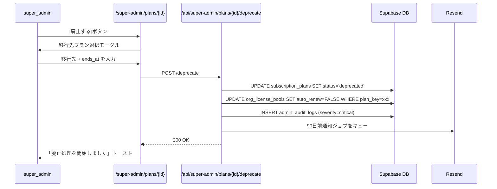

# operator/ UI 画面仕様

## 1. 目的・スコープ

運営管理コンソール (`/admin`, `/super-admin`, `/support`, `/sales`, `/finance`) の全画面仕様を定義する。各画面のコンポーネント構成・状態・操作フローを記述する。

## 2. 関連要件

- 要件 03 §9 UI 画面仕様
- 要件 03 §3 ペルソナ (A〜E)
- 100-scenarios.md F ペルソナ F1〜F20
- cross/03-design-system.md
- cross/05-i18n-a11y.md

## 3. 共通レイアウト

### 3.1 管理コンソール共通 Layout

```
┌─────────────────────────────────────────────────────┐
│ 赤バナー (impersonate 中のみ表示)                      │
│ ⚠ [運営者名] として [ユーザー名] として操作中           │
├───────────────┬─────────────────────────────────────┤
│               │ ヘッダー: ロゴ / 環境バッジ / ユーザー │
│  サイドバー   ├─────────────────────────────────────┤
│  (ロール別)   │                                     │
│               │  メインコンテンツ                    │
│               │                                     │
└───────────────┴─────────────────────────────────────┘
```

**環境バッジ**: 本番=赤 `PROD`、Staging=黄 `STAGING`、Preview=青 `PREVIEW` を常時表示 (Stripe テスト/本番切替の誤操作防止)

### 3.2 サイドバー (ロール別)

| メニュー項目 | 表示ロール |
|------------|----------|
| ダッシュボード | admin, super_admin, support, finance, sales |
| ユーザー管理 | admin, super_admin, support |
| 組織管理 | admin, super_admin |
| モデレーション | admin, super_admin, content_moderator |
| サポートチケット | admin, super_admin, support |
| 売上・経理 | admin, super_admin, finance |
| クーポン | admin, super_admin, sales |
| 営業 CRM | admin, super_admin, sales |
| 通知配信 | admin, super_admin |
| 不正検知 | admin, super_admin |
| 監査ログ | super_admin |
| お知らせ | admin, super_admin |
| super_admin 専用 ▼ | super_admin |
| └ プラン管理 | super_admin |
| └ 機能パッケージ | super_admin |
| └ 機能フラグ | super_admin |
| └ A/B テスト | super_admin |
| └ Stripe 設定 | super_admin |
| └ Cron ジョブ | super_admin |
| └ データエクスポート | super_admin |
| └ インフラ監視 | super_admin |
| └ 管理者管理 | super_admin |
| └ DB 管理 | super_admin |
| └ LLM 使用量 | super_admin |
| └ システム設定 | super_admin |

---

## 4. `/admin` — 管理者ダッシュボード

**対象ロール**: admin, super_admin

### コンポーネント

**KPI カード群**:
- 全ユーザー数 / 今日のアクティブユーザー (前日比 %)
- 今月の MRR (前月比 %)
- 未対応チケット数 (赤バッジ)
- 今日の食事記録数
- LLM コスト今月 (予算比 %)

**グラフセクション**:
- 月次 DAU/WAU/MAU 推移 (折れ線)
- プラン別ユーザー数 (ドーナツ)

**直近アクティビティ**:
- `admin_audit_logs` 最新 10 件 (アクション / 操作者 / 時刻)

**クイックアクション**:
- 「ユーザー検索」
- 「チケット確認」
- 「緊急通知送信」

---

## 5. `/admin/users` — ユーザー一覧

### コンポーネント

**検索バー**: 全文検索 (email/name/id)

**フィルタパネル**:
- プラン (チェックボックス)
- ロール (チェックボックス)
- ステータス (active / banned / deleted)
- 登録日範囲
- 最終ログイン

**テーブル**:

| カラム | 表示内容 |
|------|--------|
| ユーザー | アバター + 名前 + email |
| プラン | バッジ (plan_key) |
| ロール | バッジ一覧 |
| ステータス | active / banned (赤) |
| 最終ログイン | 相対時刻 |
| 食事記録数 | 数値 |
| アクション | 詳細ボタン |

**バルク操作** (チェックボックス選択時):
- CSV ダウンロード
- 一括 BAN (super_admin のみ)

---

## 6. `/admin/users/{id}` — ユーザー詳細

### レイアウト

```
[基本情報セクション]
  名前 / email / 登録日 / 最終ログイン / プラン / ロール
  [BAN ボタン] [ロール変更ボタン] [impersonate ボタン (super_admin のみ)]

[タブ]
  食事記録 | AI 利用 | 健康データ | チケット | 監査ログ | 管理ノート
```

**BAN モーダル**:
- 理由カテゴリ (ドロップダウン)
- 詳細テキストエリア
- BAN 種別 (一時 / 永久)
- 期間スライダー (一時 BAN の場合)
- 通知メッセージ (編集可)
- [確定ボタン]

**管理ノートタブ**:
- 時系列ノート一覧
- 追加フォーム (Markdown エディタ)

---

## 7. `/admin/organizations` — 組織一覧

**テーブル**:

| カラム | 内容 |
|------|------|
| 組織名 | ロゴ + 名前 |
| プラン | badge |
| Seat 数 | 使用中/上限 |
| 期限 | 日付 + 残日数 |
| 売上/月 | JPY |
| 担当営業 | 名前 |
| アクション | 詳細 / 課金詳細 |

---

## 8. `/admin/organizations/{orgId}/billing` — 組織課金詳細

### セクション

**Stripe 連携情報**:
- Stripe Customer ID → 「🔗 Stripe で開く ↗」ボタン
- ライセンスプール一覧
  - 各プールの Stripe Subscription → 「🔗 Stripe Subscription で開く ↗」
- Invoice 履歴 → 各行に「🔗 Stripe Invoice で開く ↗」

**担当メモ**: 営業/経理コメントフィールド

**操作ボタン**:
- 請求書一括ダウンロード (Stripe API 経由 PDF)
- ライセンス強制終了 (super_admin のみ)

---

## 9. `/admin/finance/dashboard` — 売上ダッシュボード

**KPI カード**:
- 今月の MRR / 前月比
- ARR / 前月比
- 解約率 (Churn Rate)
- LTV / CAC / LTV:CAC
- 新規 MRR / 拡張 MRR / 縮小 MRR / 解約 MRR

**グラフ**:
- MRR 月次推移 (折れ線)
- プラン別内訳 (積み上げ棒)
- コホート分析ヒートマップ (登録月 × 継続月)
- アップグレードファネル

**Stripe ダッシュボードリンク**: 「↗ Stripe Dashboard で開く」(finance 頻用)

**対象ロール**: admin, super_admin, finance

---

## 10. `/admin/finance/personal` — 個人課金者一覧

**テーブル**:

| カラム | 内容 |
|------|------|
| ユーザー | email + 名前 |
| プラン | badge |
| ステータス | active / trialing / past_due |
| 開始日 | 日付 |
| 次回更新日 | 日付 |
| MRR | JPY |
| アクション | 詳細 |

---

## 11. `/admin/finance/personal/{userId}` — 個人課金詳細 ⭐

### セクション

| セクション | 内容 |
|----------|------|
| 基本情報 | nickname / email / 登録日 / 最終ログイン |
| 現在のプラン | `personal_subscriptions` 全行 (active + 履歴) |
| Stripe 直接リンク | 🔗 Stripe Customer Dashboard / Stripe Subscription |
| Invoice 履歴 | 直近 12 ヶ月 + 各行の 🔗 Stripe Invoice |
| 適用クーポン | 現在有効なもの + 履歴 |
| 操作 | 解約予約 / 即時解約 / プラン変更 / 返金 (Stripe へ誘導) |
| 監査ログ | このユーザーへの全操作履歴 |

**権限別操作制限**:
- `support`: 閲覧 + 解約予約のみ
- `finance`: 上記 + 返金誘導 (Stripe 側で実行)
- `admin` / `super_admin`: 全操作

---

## 12. `/admin/finance/licenses` — 組織ライセンス販売管理

**アラートバー**: 30 日以内に期限切れの組織数 (黄色バナー)

**テーブル**:

| カラム | 内容 |
|------|------|
| 組織名 | リンク |
| プラン | badge |
| Seat 数 | 使用/上限 |
| 有効期限 | 日付 + 残日数 (残 7 日以内は赤) |
| 月額売上 | JPY |
| 自動更新 | ON/OFF |
| ステータス | active / expiring / expired |
| アクション | 詳細 / Stripe リンク |

**グラフ**: 月別販売推移 (棒グラフ)

---

## 13. `/admin/finance/invoices` — 請求書管理

**操作バー**: 「全組織分一括生成」ボタン (確認モーダル付き)

**テーブル**: 請求書 ID / 組織名 / 請求額 / ステータス / 発行日 / 支払期限 / アクション (PDF / 再送)

---

## 14. `/admin/coupons` — クーポン管理 ⭐

### クーポン一覧テーブル

| カラム | 内容 |
|------|------|
| コード | モノスペースフォント |
| 割引 | `20%` or `¥5,000 OFF` |
| 対象 | all / personal / org |
| 有効期限 | 日付 |
| 利用数 | `42 / 100` |
| ステータス | badge |
| アクション | 詳細 / 一時停止 |

**「+ 新規クーポン」モーダル**:
```
コード: [入力欄 or 自動生成]
表示名: [入力欄]
割引種別: ○ 固定額 (円)  ○ パーセント (%)
割引値: [数値入力]
適用対象: ○ 全て ○ 個人 ○ 組織
有効期限: [日付範囲ピッカー]
最大利用回数: [数値 / 無制限]
ユーザー毎の上限: [数値 (default: 1)]
割引期間: [月数 / ずっと]

[実質粗利プレビュー: ¥XXX (XX%)]

[キャンセル] [作成]
```

---

## 15. `/admin/support/tickets` — サポートチケット一覧 (拡張)

**フィルタタブ**: すべて / 未対応 / 対応中 / 解決済

**テーブル**:

| カラム | 内容 |
|------|------|
| チケット ID | #1234 |
| ユーザー | email |
| 件名 | 最大 50 文字 |
| カテゴリ | badge |
| 優先度 | badge (urgent は赤) |
| ステータス | badge |
| 担当者 | アバター |
| SLA | 残時間 (超過は赤) |
| 作成日 | 相対時刻 |

---

## 16. `/admin/support/tickets/{id}` — チケット詳細 (新規)

### レイアウト

```
[左カラム: ユーザー情報パネル]
  名前 / email / プラン / 登録日
  [ユーザー詳細を見る]リンク

[右カラム: メインエリア]
  ┌──────────────────────────────┐
  │ チケットヘッダー              │
  │ 件名 / カテゴリ / 優先度 / SLA │
  │ 担当者割当 [ドロップダウン]   │
  ├──────────────────────────────┤
  │ メッセージスレッド           │
  │  [ユーザー] 09:00            │
  │  「ログインできません...」   │
  │  [サポート] 10:30            │
  │  「パスワードリセットを...」  │
  ├──────────────────────────────┤
  │ 返信フォーム                 │
  │  [外部返信 / 内部メモ タブ]  │
  │  テキストエリア              │
  │  テンプレート選択 ▼         │
  │  [送信ボタン]               │
  └──────────────────────────────┘
```

**内部メモ**: 背景色が薄黄色で視覚的区別

---

## 17. `/admin/sales/leads` — 営業 CRM ⭐

**カンバンビュー** (ステージ別カラム):

```
[アプローチ]  [商談中]  [提案]  [交渉]  [契約済]  [失注]
  3 件          5 件     2 件    1 件    12 件     4 件
  ...カード...
```

**カード表示**: 会社名 / 担当者 / 推定 ACV / 最終活動日

**「+ 新規リード」ボタン**: サイドパネルで入力

---

## 18. `/admin/notifications` — 通知配信管理

**タブ**:
- キャンペーン一覧
- テンプレート
- 配信履歴

**キャンペーン新規作成ウィザード**:

```
Step 1: ターゲット設定
  [全ユーザー / フィルタ / CSV アップロード]
  フィルタ: プラン / 登録月 / 最終ログイン / 食事記録なし期間

Step 2: メッセージ作成
  チャネル: [Push / Email / アプリ内]
  バリアント: A / B (A/B テスト有効化)
  タイトル: [入力]
  本文: [リッチエディタ]
  ディープリンク: [入力]

Step 3: スケジュール
  [即時] or [予約: 日時ピッカー]
  [プレビュー] → [配信確定]
```

---

## 19. `/admin/abuse` — 不正検知キュー (admin)

**検知一覧テーブル**: ユーザー / ルール / 検知日時 / 自動アクション / レビューステータス

**手動レビュー**: 確認 / false_positive / エスカレーション

---

## 20. `/admin/audit-logs` — 監査ログ閲覧 (拡張)

**フィルタ**:
- アクション種別 (マルチセレクト)
- 操作者
- 対象
- 重要度 (info / warn / critical)
- 期間

**テーブル**:

| カラム | 内容 |
|------|------|
| 日時 | 絶対時刻 |
| 操作者 | email + role |
| アクション | タグ (例: `admin.user.ban`) |
| 対象 | email or ID |
| 重要度 | badge |
| 詳細 | 展開 → JSON |

**CSV エクスポート**: 法務対応用

**権限**: `super_admin` のみ

---

## 21. `/admin/announcements` — お知らせ管理

テーブル + 作成モーダル (タイトル / 本文 / 表示期間 / 対象プラン)

---

## 22. `/super-admin` — super_admin ダッシュボード

**KPI カード**:
- 全 KPI + システム健全性スコア
- LLM コストアラート (前日比 +30% 以上で赤)
- 過去 24 時間の重要イベント (severity='critical' の監査ログ)

**インフラステータスパネル**:
- Vercel: エラー率 + p95 レイテンシ
- Supabase DB: クエリ時間 + 接続数
- LLM APIs: 各モデルの応答時間

---

## 23. `/super-admin/plans` — プラン定義・販売管理 ⭐

### プラン一覧

**テーブル**:

| カラム | 内容 |
|------|------|
| plan_key | モノスペース |
| 表示名 | テキスト |
| 種別 | badge (personal / family / org) |
| 月額 | ¥XXX |
| 年額 | ¥XXX |
| パッケージ数 | 数値 |
| ステータス | badge (draft/public/private/deprecated) |
| 表示順 | ドラッグ変更可 |
| アクション | 編集 / 公開 / 廃止 |

**フィルタ**: 種別 / ステータス

**「+ 新規プラン作成」ボタン**

---

## 24. `/super-admin/plans/{id}` — プラン編集 ⭐

### タブ構成

**基本情報タブ**:
- plan_key (公開後は変更不可)
- 表示名 / 説明 (Markdown エディタ)
- 種別 / 上限値 (メンバー数)
- バナー画像アップロード
- 試用期間 / 最低契約期間

**価格設定タブ**:
- 月額 / 年額 (JPY)
- Stripe Product ID / Price ID (masked)
- 「価格変更」ボタン → モーダル

**価格変更モーダル**:
```
新しい月額: [¥入力]
新しい年額: [¥入力]
適用範囲:
  ○ 新規契約のみ
  ○ 次回更新時 (既存契約は次の請求サイクルから)
  ○ 即時 (proration あり)
理由: [テキストエリア]
有効日: [日付ピッカー]

[影響シミュレーション]
  影響契約数: 3,420 件
  月次収益変化: +¥680,000
  [影響ユーザーリスト (最大 20 件)]

[キャンセル] [価格変更を実行]
```

**機能パッケージタブ**:
- マトリクス UI: パッケージ × プランのチェックボックス
- ワンクリックで機能追加/削除

**ステータスタブ**:
- 現在のステータス表示
- ライフサイクル遷移ボタン
  - [公開する] (draft → public)
  - [非公開にする] (public → private)
  - [廃止する] (→ deprecated、移行先プラン指定必須)
  - [廃止をロールバック] (deprecated → private, super_admin 限定)

**価格変更履歴タブ**:
- 変更日 / 旧価格 → 新価格 / 適用範囲 / 変更者

---

## 25. `/super-admin/feature-packages` — 機能パッケージ管理 ⭐

### パッケージ一覧

**テーブル**: package_key / 表示名 / feature flags 数 / 利用プラン数

**編集モーダル**:
- パッケージ名 / 説明
- 含める feature flag チェックボックス (全フラグ一覧から選択)

**マトリクスビュー タブ**: プラン × パッケージの俯瞰 (read-only)

---

## 26. `/super-admin/integrations/stripe` — Stripe 設定 ⭐

**テスト/本番モードバナー**: 現在のモードを画面上部に常時表示
- テストモード: 黄色バナー「⚠ Stripe テストモード」
- 本番モード: 緑バナー「✓ Stripe 本番モード」

**設定フォーム**:
- Publishable Key (masked)
- Secret Key (masked、変更時は再入力)
- Webhook Signing Secret (masked)
- Webhook Endpoint: `https://homegohan.app/api/webhooks/stripe` (read-only)
- Stripe API バージョン (表示のみ + 更新通知)

**Stripe Dashboard リンク**: 「↗ Stripe Dashboard を開く」

---

## 27. `/super-admin/cron-jobs` — Cron ジョブ管理

### テーブル

| カラム | 内容 |
|------|------|
| ジョブ名 | テキスト |
| 種別 | pg_cron / Vercel Cron |
| スケジュール | cron 式 + 人間語 |
| 最終実行 | 日時 + 結果 (success/failed) |
| 次回実行 | 日時 |
| 操作 | [今すぐ実行] / [一時停止] |

**今すぐ実行 モーダル**: 「ジョブ名 を手動実行しますか？」+ [実行確定]

**実行ログ**: 直近 10 回のログ (成功/失敗/実行時間)

---

## 28. `/super-admin/exports` — データエクスポート

**エクスポートリクエストフォーム**:
- エクスポート種別 (ユーザーデータ / 監査ログ / 食事記録 / 組織データ)
- 形式 (CSV / JSON / Parquet)
- フィルタ (期間 / プラン / etc.)
- PII マスキング (ON/OFF、デフォルト ON)

**エクスポート一覧テーブル**: ID / 種別 / ステータス / 作成日時 / ダウンロード

---

## 29. `/super-admin/abuse` — 不正検知ルール管理

**ルール一覧**: ルール名 / 種別 / しきい値 / アクション / 有効/無効

**ルール作成フォーム**: GUI でルール条件を設定 (コードレス)

---

## 30. `/super-admin/experiments` — A/B テスト管理

### 実験一覧

**テーブル**: 実験名 / ステータス / 期間 / バリアント数 / 主要メトリクス / 操作

**実験詳細画面**:
- 仮説 / バリアント設定
- 統計分析パネル: p 値 / 信頼区間 / サブグループ別
- 採用/却下ボタン

---

## 31. `/super-admin/admins` — 管理者管理

**テーブル**: email / ロール一覧 / 最終ログイン / 2FA 状態 / 操作

**ロール変更フロー**:
1. [ロール変更] → モーダル
2. チェックボックスでロール選択
3. パスワード再認証
4. [確定] → 監査ログ + 対象者メール通知

---

## 32. `/super-admin/database` — DB 管理

**テーブル**: テーブル名 / 行数 / サイズ / 最終更新 / インデックス数

**スロークエリ**: `pg_stat_statements` 上位 20 件

**バックアップ状態**: PITR 最終バックアップ日時 / Logical Backup 最終実行

---

## 33. `/super-admin/llm-usage` — LLM 使用量 (強化)

**期間選択**: 今日 / 7 日 / 30 日 / カスタム

**ダッシュボード**:
- 総コスト カード (USD + JPY、前期比)
- モデル別内訳 グラフ (ドーナツ)
- 機能別内訳 グラフ (棒グラフ)
- ユーザー別 Top 50 テーブル (異常検知用、赤ハイライト)
- 時系列推移 (時間/日別)

**異常アラート**: 1 ユーザー 5,000 req/日超 → バナー表示

**クォータ設定ボタン**: ユーザー個別クォータ変更モーダル

---

## 34. `/super-admin/settings` — システム設定

- メンテナンスモード (ON/OFF)
- お知らせバナー設定
- 全ユーザーへの緊急メッセージ送信
- Feature flag デフォルト値
- LLM プロバイダー優先度

---

## 5. シーケンス — プラン廃止フロー



## 6. エラーハンドリング

| シナリオ | UI の対応 |
|---------|---------|
| 権限不足 (403) | トーストで「権限がありません」表示、操作ボタンは disabled |
| BAN 操作の再認証 | モーダル内でパスワード確認フォーム表示 |
| プラン廃止で移行先未指定 | バリデーションエラー「移行先プランを選択してください」 |
| Stripe 連携失敗 | 「Stripe との同期に失敗しました。管理者に連絡してください」|
| 監査ログ取得エラー | 「閲覧は super_admin のみ可能です」|

## 7. テスト方針

- **a11y**: `@axe-core/playwright` で全ページ violations = 0
- **Keyboard**: Tab キーで全インタラクティブ要素にフォーカス到達
- **E2E**:
  - `op/01-user-search.spec.ts`
  - `op/03-moderation-resolve.spec.ts`
  - `op/07-mrr-dashboard.spec.ts`
  - `op/plan-deprecate.spec.ts`

## 8. 既存実装との関連

- `src/app/(admin)/` および `src/app/(super-admin)/` は commit `32d13e1` で全削除済み → 完全新規実装
- 既存の UI パーツ (`components/ui/*`) は活用する

## 9. 未解決事項

- `/super-admin/database` の直接 SQL 実行機能 (将来要件) は Phase 3 以降で検討
- `/admin/sales/leads` のカンバン vs テーブルビューはユーザビリティテスト後に決定
- モバイル対応: 管理コンソールは desktop-first で設計、モバイルは responsive 対応のみ (テーブルはスクロール)
