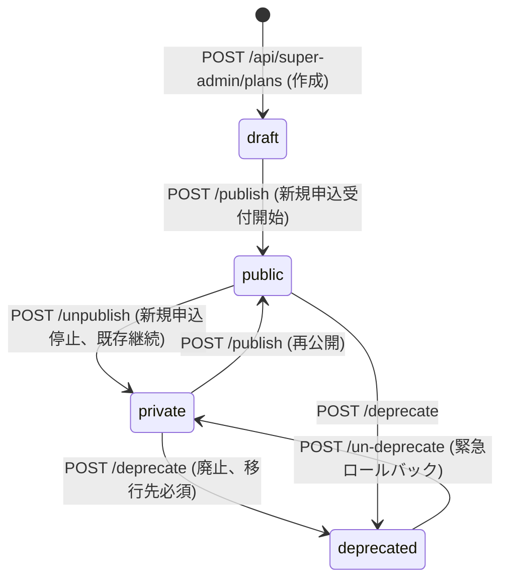
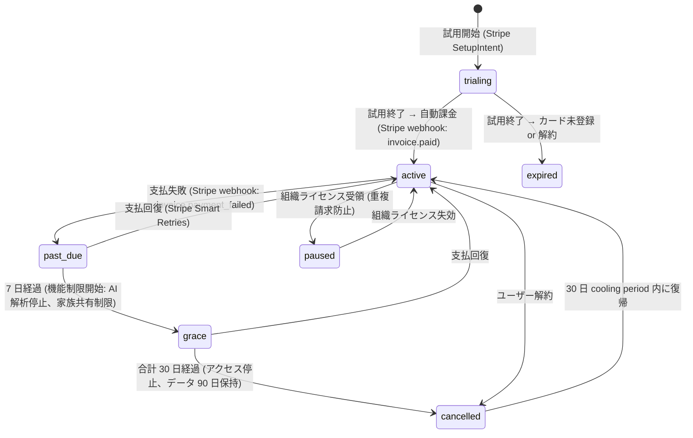
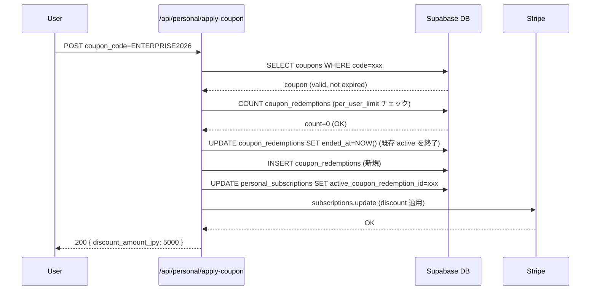

# operator/ プラン管理設計

## 1. 目的・スコープ

運営者が subscription_plans / feature_packages / coupons を管理する機能の詳細設計。対応する要件は F-OP-015 (プラン定義・販売管理)、F-OP-016 (販売・収益管理)、F-OP-017 (個人課金管理)。

**対象外**: 組織ライセンスの購入フロー (org/ ドメイン)、家族プランの選択フロー (family/ ドメイン)

## 2. 関連要件

- 要件 03 §5.15 F-OP-015 プラン定義・販売管理ツール
- 要件 03 §5.16 F-OP-016 販売・収益管理
- 要件 03 §5.17 F-OP-017 個人課金管理
- 要件 03 §4.16〜4.19 ユースケース
- 100-scenarios.md F1〜F6, F14〜F15, F20

## 3. プラン定義 (F-OP-015)

### 3.1 subscription_plans CRUD

#### 作成 (draft 状態で作成)

**バリデーション規則**:
- `plan_key`: 英数字 + アンダースコアのみ、50 文字以内、UNIQUE
- `plan_type`: `personal` | `family` | `org` (変更不可)
- `monthly_price_jpy`: 0 以上の整数 (NULL = カスタム/無料)
- `org` 型は `trial_days = 0` を強制 (組織プランに試用なし)
- `family_addon` は `plan_type = 'family'` でも `applicable_to = 'org'` フラグを持つ特殊プラン

```typescript
// src/lib/plan/validator.ts
export function validatePlanCreate(data: PlanCreateInput): ValidationResult {
  if (data.plan_type === 'org' && data.trial_days > 0) {
    return { error: 'OP_ORG_PLAN_NO_TRIAL' };
  }
  if (data.plan_key === 'family_addon' && data.plan_type !== 'family') {
    return { error: 'OP_FAMILY_ADDON_TYPE_REQUIRED' };
  }
  // plan_key に既存の 9 種公式 key との重複は許可 (編集扱い)
  return { ok: true };
}
```

#### 更新 (status 別の更新可能フィールド)

| status | 変更可能フィールド |
|--------|----------------|
| `draft` | 全フィールド自由 |
| `public` | display_name / description / banner_url / feature_packages のみ。価格は price-change API 経由 |
| `private` | 同上 |
| `deprecated` | migration_message のみ (ends_at は変更不可) |

### 3.2 機能パッケージ × プランマトリクス UI

```
              | free | pro | family_basic | family_pro | family_addon | org_starter | org_standard | org_pro | org_enterprise |
基本機能       |  ✓   |  ✓  |     ✓       |     ✓     |      ✓       |     ✓       |      ✓       |   ✓    |       ✓        |
AI 解析        |      |  ✓  |     ✓       |     ✓     |      ✓       |             |      ✓       |   ✓    |       ✓        |
家族管理       |      |     |     ✓       |     ✓     |      ✓       |             |              |   ※    |       ※        |
家族 8 名拡張  |      |     |             |     ✓     |              |             |              |        |               |
組織管理       |      |     |             |           |              |     ✓       |      ✓       |   ✓    |       ✓        |
産業医連携     |      |     |             |           |              |             |              |   ✓    |       ✓        |
SSO            |      |     |             |           |              |             |              |        |       ✓        |
```

※ `org_pro` / `org_enterprise` は `family_addon` を別途購入することで家族機能が解放される。素のプランに家族機能は含まない。

**マトリクス変更時の処理**:
1. `subscription_plans.feature_packages` 配列を PATCH
2. `getUserActivePlan()` のキャッシュを invalidate (Upstash Redis の plan:{plan_key} key を DEL)
3. 変更は **リアルタイム** で全ユーザーに適用 (次リクエスト時に新 feature_packages を参照)

### 3.3 価格変更フロー

**3 種の適用範囲**:

| 適用範囲 | DB 更新 | Stripe 連携 |
|---------|--------|------------|
| `new_only` | `subscription_plans.stripe_price_id` を新 Price ID に更新 | 新 Price object を作成 |
| `on_renewal` | 各 `personal_subscriptions.stripe_price_id` を次回更新時に切替 | 既存 Subscription の phase 変更 |
| `immediately` | 即時に全 `personal_subscriptions` を新 Price に切替 | `stripe.subscriptions.update({ proration_behavior: 'create_prorations' })` |

**Stripe Price の immutability 対応**:
- Stripe Price は作成後に amount を変更できない (Stripe の設計)
- 価格変更 = 新 Price object を作成し、旧 Price を `active=false` にする

```typescript
// supabase/functions/stripe-price-sync/index.ts
export async function syncPriceChange(input: PriceChangeInput) {
  // 1. 新 Stripe Price を作成
  const newPrice = await stripe.prices.create({
    product: input.stripe_product_id,
    unit_amount: input.new_monthly_price_jpy,
    currency: 'jpy',
    recurring: { interval: 'month' },
  });

  // 2. DB 更新 (トランザクション内)
  // 引数名は operator/05-stripe-integration.md §5.2 の apply_price_change RPC 定義に合わせて p_ プレフィックスを使用
  await supabase.rpc('apply_price_change', {
    p_plan_id: input.plan_id,
    p_new_stripe_price_id: newPrice.id,
    p_new_monthly_price_jpy: input.new_monthly_price_jpy,
    p_applies_to: input.applies_to,
    p_changed_by: input.actor_id,
    p_reason: input.reason ?? '',
  });

  // 3. on_renewal / immediately の場合は既存サブスクリプションを更新
  if (input.applies_to === 'immediately') {
    await batchUpdateSubscriptions(input.plan_key, newPrice.id);
  }

  // エラー時: 新 Price を deactivate + DB rollback
}
```

**影響シミュレーション API** (`GET /api/super-admin/plans/{id}/impact`):

```sql
-- 影響する personal_subscriptions 数を計算
SELECT COUNT(*), SUM(sp.monthly_price_jpy) as current_mrr
FROM personal_subscriptions ps
JOIN subscription_plans sp ON ps.plan_key = sp.plan_key
WHERE ps.plan_key = $1
  AND ps.status IN ('active', 'trialing', 'paused')
  AND ps.stripe_subscription_id IS NOT NULL;
```

### 3.4 プランライフサイクル



**各ステータスの挙動**:

| ステータス | 新規申込 | 既存契約 auto_renew | family_groups 凍結 |
|-----------|---------|-------------------|--------------------|
| `draft` | ✗ | - | - |
| `public` | ✓ | 継続 | 対象外 |
| `private` | ✗ | 継続 | 対象外 |
| `deprecated` | ✗ | 強制 FALSE | ends_at 経過後に frozen |

### 3.5 deprecated 適用時の挙動

`POST /api/super-admin/plans/{id}/deprecate` を呼んだ時:

1. `subscription_plans.status = 'deprecated'` に更新
2. **`org_license_pools` の強制更新**:
   ```sql
   UPDATE org_license_pools
   SET auto_renew = FALSE,
       auto_renew_was_force_disabled_at = NOW()
   WHERE plan_key = $1 AND auto_renew = TRUE;
   ```
3. **段階通知ジョブ**をキューに投入:
   - T-90 日: 「廃止予定のお知らせ」(Email + アプリ内バナー)
   - T-30 日: 「廃止まで 30 日のお知らせ」(Push + Email)
   - T-7 日: 「廃止まで 7 日の最終お知らせ」(Push + Email)
   - T-0 (ends_at 当日): 自動バッチで凍結処理実行

4. **ends_at 経過後のバッチ** (`pg_cron: daily 02:00 UTC`):
   ```sql
   -- deprecated プランの期限切れ処理
   UPDATE org_license_assignments
   SET status = 'expired'
   WHERE pool_id IN (
     SELECT id FROM org_license_pools
     WHERE plan_key IN (
       SELECT plan_key FROM subscription_plans WHERE status = 'deprecated'
     ) AND expires_at <= NOW()
   );
   ```

### 3.6 deprecated ロールバック手順 (F5 シナリオ)

```
POST /api/super-admin/plans/{id}/un-deprecate
→ status を 'private' に変更 (public には戻さない)
→ auto_renew_was_force_disabled_at IS NOT NULL のレコードを auto_renew=TRUE に復元
→ 影響組織管理者へ「誤操作のため更新有効化を戻しました」通知
→ admin_audit_logs に severity=critical で記録
```

## 4. 販売・収益管理 (F-OP-016)

### 4.1 クーポン管理

#### 重複適用禁止ロジック (§4.19)

```
1 契約に対し、ended_at IS NULL の coupon_redemptions は常に 1 件まで。
```

**新クーポン適用フロー**:

```typescript
// src/lib/plan/coupon.ts
async function applyCoupon(
  subscriptionId: string,
  subscriptionTarget: 'personal' | 'org',
  couponCode: string,
  userId: string
) {
  // 1. クーポン有効性チェック
  const coupon = await getCouponByCode(couponCode);
  if (!coupon || coupon.status !== 'active') throw new Error('OP_COUPON_INVALID');
  if (new Date() > coupon.valid_until) throw new Error('OP_COUPON_EXPIRED');

  // 2. per_user_limit チェック
  const existingRedemptions = await countUserRedemptions(coupon.id, userId);
  if (existingRedemptions >= coupon.per_user_limit) throw new Error('OP_COUPON_LIMIT_REACHED');

  // 3. 既存クーポンの終了 (重複防止)
  await supabase
    .from('coupon_redemptions')
    .update({ ended_at: new Date(), end_reason: 'replaced_by_other_coupon' })
    .eq('subscription_target', subscriptionTarget)
    .eq('applied_to_subscription_id', subscriptionId)
    .is('ended_at', null);

  // 4. 新クーポンを適用
  const redemption = await supabase.from('coupon_redemptions').insert({
    coupon_id: coupon.id,
    user_id: userId,
    subscription_target: subscriptionTarget,
    applied_to_subscription_id: subscriptionId,
    discount_amount_jpy: calculateDiscount(coupon, currentPrice),
    duration_months: coupon.duration_months,
  });

  // 5. personal_subscriptions の active_coupon_redemption_id を更新
  if (subscriptionTarget === 'personal') {
    await supabase
      .from('personal_subscriptions')
      .update({ active_coupon_redemption_id: redemption.id })
      .eq('id', subscriptionId);
  }
}
```

**試用期間中のクーポン**: 試用中は適用不可。本契約開始時に自動適用。

**遡及適用 (super_admin 承認時のみ)**:
- `coupon_redemptions.applied_retroactively = TRUE` を記録
- `approved_by` に super_admin の user_id を記録
- 監査ログに severity='warn' で記録

#### Stripe 手数料と価格設計 (§15.12)

```typescript
// src/lib/plan/margin.ts
export function calculateGrossMargin(priceJpy: number, discountPercent: number = 0): MarginInfo {
  const effectivePrice = priceJpy * (1 - discountPercent / 100);
  const stripeFee = effectivePrice * 0.036 + 40; // 3.6% + ¥40
  const grossMargin = effectivePrice - stripeFee;
  const grossMarginRate = grossMargin / effectivePrice;

  // 0 円課金の防止
  if (effectivePrice < 50) throw new Error('OP_PRICE_TOO_LOW'); // 手数料割れ
  return { effectivePrice, stripeFee, grossMargin, grossMarginRate };
}
```

**クーポン管理 UI で「実質粗利プレビュー」を必須表示**

### 4.2 アップグレード分析 (F-OP-016.3)

**ファネル**: Free → Pro → Family → 法人

```sql
-- アップグレード転換率の計算
WITH funnel AS (
  SELECT
    COUNT(CASE WHEN plan_key = 'free' THEN 1 END) as free_users,
    COUNT(CASE WHEN plan_key = 'pro' THEN 1 END) as pro_users,
    COUNT(CASE WHEN plan_key LIKE 'family%' THEN 1 END) as family_users,
    COUNT(CASE WHEN plan_key LIKE 'org%' THEN 1 END) as org_users
  FROM personal_subscriptions
  WHERE status IN ('active', 'trialing')
)
SELECT
  pro_users::FLOAT / NULLIF(free_users, 0) * 100 as free_to_pro_rate,
  family_users::FLOAT / NULLIF(pro_users, 0) * 100 as pro_to_family_rate
FROM funnel;
```

### 4.3 収益予測 (F-OP-016.4)

**Phase 1: 線形外挿**

```typescript
// src/lib/plan/forecast.ts
export function forecastMRR(snapshots: RevenueSnapshot[], horizonMonths: number): MRRForecast[] {
  const growthRates = snapshots.slice(-6).map((s, i, arr) => {
    if (i === 0) return 0;
    return (s.total_mrr_jpy - arr[i-1].total_mrr_jpy) / arr[i-1].total_mrr_jpy;
  });
  const avgGrowthRate = growthRates.slice(1).reduce((a, b) => a + b, 0) / (growthRates.length - 1);
  const lastMRR = snapshots[snapshots.length - 1].total_mrr_jpy;

  return Array.from({ length: horizonMonths }, (_, i) => ({
    month: addMonths(new Date(), i + 1),
    mrr_jpy: Math.round(lastMRR * Math.pow(1 + avgGrowthRate, i + 1)),
    confidence_low: Math.round(lastMRR * Math.pow(1 + avgGrowthRate * 0.7, i + 1)),
    confidence_high: Math.round(lastMRR * Math.pow(1 + avgGrowthRate * 1.3, i + 1)),
  }));
}
```

## 5. 個人課金管理 (F-OP-017)

### 5.1 個人プランの状態遷移



### 5.2 試用期間 (trial_days) フロー (§5.15.6.5)

**試用開始**:
1. ユーザーが「X 日間無料で試す」ボタン
2. Stripe Setup Intent 作成 (カード登録必須、課金なし)
3. `personal_subscriptions` に INSERT:
   ```sql
   INSERT INTO personal_subscriptions (
     user_id, plan_key, status, trial_started_at,
     trial_ends_at, trial_source, stripe_customer_id
   ) VALUES (
     $1, $2, 'trialing', NOW(),
     NOW() + (trial_days || ' days')::INTERVAL, 'direct', $3
   );
   ```
4. 同一プランの過去 trial 履歴チェック (再試用禁止):
   ```sql
   SELECT COUNT(*) FROM personal_subscriptions
   WHERE user_id = $1 AND plan_key = $2 AND trial_started_at IS NOT NULL;
   -- > 0 なら OP_TRIAL_ALREADY_USED
   ```

**試用終了処理** (Vercel Cron: 日次 09:00 JST):
1. `trial_ends_at <= NOW()` で `status='trialing'` を抽出
2. `stripe_customer_id` がある → Stripe 自動課金開始 (`subscription.create`) → webhook で `status='active'`
3. カード未登録 → `status='expired'` に更新

**試用中の AI quota**:
- `personal_subscriptions.status = 'trialing'` の場合は試用専用 quota を返す (§5.5.3 参照)
- 本契約の約 1/10 (例: pro の試用 = 50 req/日 = free 相当)

### 5.3 グレースペリオド (§18.7)

**支払失敗フロー**:

```
invoice.payment_failed webhook 受信
  → personal_subscriptions.status = 'past_due'
  → グレースペリオド: 7 日間
    → 毎日リマインダーメール送信
    → 機能は継続 (UX 配慮)
  → 7 日後も未払い:
    → status = 'cancelled'
    → 機能停止
    → 解約理由アンケート送信
```

### 5.4 一時停止 (paused) — 組織ライセンス重複防止 (§5.11.7)

```typescript
// 組織ライセンス受領時
async function pausePersonalSubscription(userId: string, orgLicenseExpiresAt: Date) {
  const activeSub = await getActivePersonalSubscription(userId);
  if (!activeSub || activeSub.plan_type !== 'personal') return;

  // Stripe subscription を pause (billing cycle anchor を保持)
  await stripe.subscriptions.update(activeSub.stripe_subscription_id, {
    pause_collection: { behavior: 'mark_uncollectible' },
  });

  await supabase.from('personal_subscriptions').update({
    status: 'paused',
    paused_at: new Date(),
    paused_until: orgLicenseExpiresAt,
    pause_reason: 'org_license_received',
  }).eq('id', activeSub.id);
}
```

## 6. シーケンス — クーポン適用フロー



## 7. エラーハンドリング

| エラー | コード | 対処 |
|-------|--------|------|
| 試用再申請 | `OP_TRIAL_ALREADY_USED` | 「同じプランの試用は 1 回のみです」 |
| クーポン期限切れ | `OP_COUPON_EXPIRED` | 「このクーポンは有効期限が切れています」 |
| 重複クーポン | `OP_COUPON_ALREADY_ACTIVE` | 「現在有効なクーポンがあります。置き換えますか？」確認モーダル |
| deprecated プラン | `OP_PLAN_DEPRECATED` | 「このプランは廃止されました。新プランをご利用ください」 |
| Stripe 失敗 | `OP_STRIPE_SYNC_FAILED` | 内部エラー記録 + 管理者 Slack 通知 |

## 8. テスト方針

主要テストケース:

1. `it('validatePlanCreate rejects plan_key with uppercase letters')`
2. `it('validatePlanCreate rejects monthly_price_jpy below 0')`
3. `it('calculateGrossMargin returns correct margin for standard plan')`
4. `it('forecastMRR increases linearly with constant monthly growth')`
5. `it('auto_renew is set to FALSE when plan is deprecated')`
6. `it('plan_price_history is inserted when price is changed')`
7. `it('E2E: plan transitions through full lifecycle draft → public → private → deprecated')`
8. `it('E2E: trial starts, reminder sent at day 11, billing starts at day 14')`

```typescript
// tests/unit/operator/plan-validation.test.ts
import { describe, it, expect } from 'vitest';
import { validatePlanCreate, calculateGrossMargin } from '@/lib/operator/plan-management';

describe('validatePlanCreate', () => {
  it('rejects plan_key with uppercase letters', () => {
    const result = validatePlanCreate({ plan_key: 'Individual_Pro', display_name: 'Test' });
    expect(result.success).toBe(false);
    expect(result.errors?.find((e) => e.field === 'plan_key')).toBeTruthy();
  });

  it('rejects plan_key with spaces', () => {
    const result = validatePlanCreate({ plan_key: 'my plan', display_name: 'Test' });
    expect(result.success).toBe(false);
  });

  it('rejects monthly_price_jpy below 0', () => {
    const result = validatePlanCreate({
      plan_key: 'test_plan',
      display_name: 'Test',
      monthly_price_jpy: -100,
    });
    expect(result.success).toBe(false);
    expect(result.errors?.find((e) => e.field === 'monthly_price_jpy')).toBeTruthy();
  });

  it('accepts valid plan payload', () => {
    const result = validatePlanCreate({
      plan_key: 'test_plan_001',
      display_name: 'テストプラン',
      plan_type: 'individual',
      monthly_price_jpy: 980,
      trial_days: 14,
    });
    expect(result.success).toBe(true);
  });
});

describe('calculateGrossMargin', () => {
  it('returns correct margin for standard 980 yen plan', () => {
    const result = calculateGrossMargin({
      monthly_price_jpy: 980,
      stripe_fee_rate: 0.036,
      infra_cost_jpy: 50,
    });
    // 980 * (1 - 0.036) - 50 = 980 * 0.964 - 50 = 944.72 - 50 = 894.72 → floor = 894
    expect(result.gross_margin_jpy).toBe(894);
    expect(result.gross_margin_rate).toBeGreaterThan(0.9);
  });

  it('returns 0 margin when price equals costs', () => {
    const result = calculateGrossMargin({
      monthly_price_jpy: 100,
      stripe_fee_rate: 0.036,
      infra_cost_jpy: 97, // ほぼコストと同額
    });
    expect(result.gross_margin_jpy).toBeGreaterThanOrEqual(0);
  });
});

// tests/integration/operator/plan-lifecycle.integration.test.ts
describe('プランライフサイクル Integration', () => {
  it('sets auto_renew=FALSE on org_license_pools when plan is deprecated', async () => {
    // deprecated プランに紐づくプールを作成
    const pool = await createOrgLicensePoolInDB(supabaseAdmin, {
      plan_key: 'org_starter',
      auto_renew: true,
    });

    // プランを deprecated に変更
    await supabaseAdmin
      .from('subscription_plans')
      .update({ status: 'deprecated' })
      .eq('plan_key', 'org_starter');

    // トリガーまたはバッチが連動して auto_renew を FALSE にする
    const { triggerDeprecatePlan } = await import('@/lib/operator/plan-deprecation');
    await triggerDeprecatePlan(supabaseAdmin, 'org_starter');

    const { data: updatedPool } = await supabaseAdmin
      .from('org_license_pools')
      .select('auto_renew')
      .eq('id', pool.id)
      .single();
    expect(updatedPool?.auto_renew).toBe(false);
  });

  it('inserts plan_price_history when price is changed', async () => {
    const oldPrice = 980;
    const newPrice = 1200;

    await fetch(`${BASE_URL}/api/super-admin/plans/individual_pro/price`, {
      method: 'PATCH',
      headers: {
        Authorization: `Bearer ${superAdminToken}`,
        'Content-Type': 'application/json',
      },
      body: JSON.stringify({ monthly_price_jpy: newPrice }),
    });

    const { data: history } = await supabaseAdmin
      .from('plan_price_history')
      .select('*')
      .eq('plan_key', 'individual_pro')
      .order('created_at', { ascending: false })
      .limit(1)
      .single();

    expect(history?.old_price_jpy).toBe(oldPrice);
    expect(history?.new_price_jpy).toBe(newPrice);
  });
});
```

## 9. 既存実装との関連

- `subscription_plans` テーブルは 01-data-model.md で定義
- `getUserActivePlan()` は cross/06-perf-cache.md に定義 (5 分 Redis キャッシュ)
- プラン変更通知メールは `supabase/functions/notify-email/` (新規 Edge Function)

## 10. 未解決事項

- `family_addon` の「組織同梱専用」の API バリデーション: `source_org_assignment_id IS NOT NULL` チェックは org/ ドメインの API レイヤーで実装する想定だが、operator ドメインとの責任分界が曖昧 → 要 org/ 担当と調整
- `org_enterprise` の「カスタム価格」: `monthly_price_jpy = NULL` の場合の Stripe 連携方法 (Stripe Quote / Manual billing) は Phase 2 で決定
- deprecated → 自動移行 (移行先プランへの自動切替) のユーザー同意: オーナーが要承認か完全自動かを要確認
