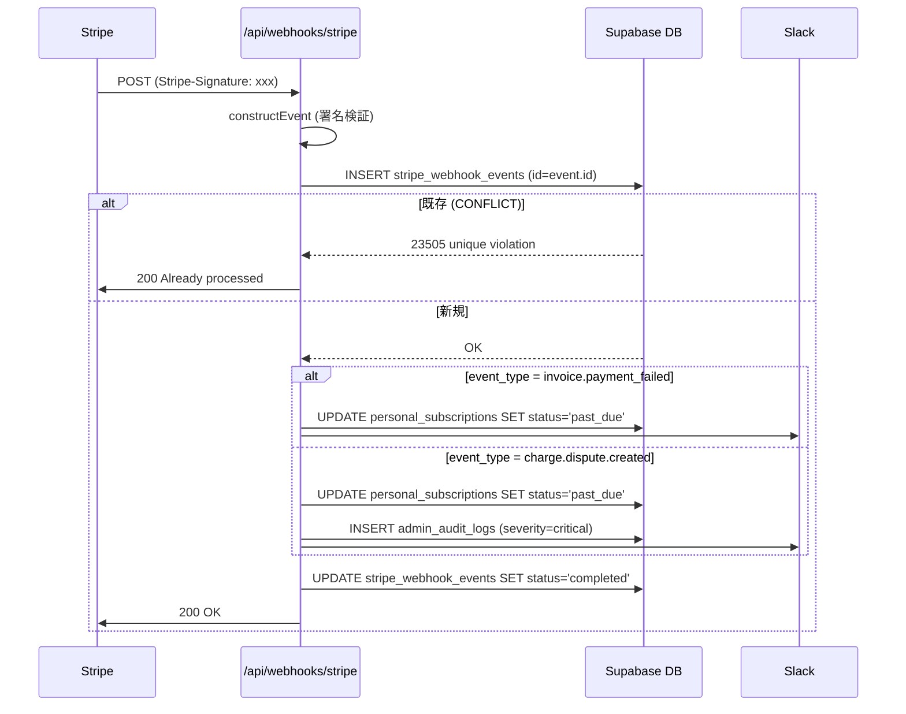

# operator/ Stripe 連携設計

## 1. 目的・スコープ

Stripe との決済連携の全詳細を定義する。Webhook 受信・冪等性保証・Price 同期・日次 reconciliation・課金失敗グレースペリオド・チャージバック対応を含む。

**設計原則**: DB が source of truth、Stripe が課金実行。不一致は日次 reconciliation で検出し、人間が判断して修正する。

## 2. 関連要件

- 要件 03 §15.12 Stripe 手数料設計
- 要件 03 §18.4 インボイス番号
- 要件 03 §18.7 グレースペリオド
- 要件 03 §18.8 チャージバック対応
- 要件 03 §22.10 Stripe reconciliation
- 100-scenarios.md F7〜F10

## 3. データモデル

### 3.1 stripe_webhook_events (冪等化テーブル)

```sql
CREATE TABLE stripe_webhook_events (
  id              VARCHAR(255) PRIMARY KEY,  -- Stripe event.id (例: evt_1AbCd...)
  event_type      VARCHAR(100) NOT NULL,
  payload         JSONB NOT NULL,
  processing_status VARCHAR(20) NOT NULL DEFAULT 'pending'
    CHECK (processing_status IN ('pending', 'processing', 'completed', 'failed')),
  processed_at    TIMESTAMPTZ,
  error_message   TEXT,
  received_at     TIMESTAMPTZ NOT NULL DEFAULT NOW()
);

CREATE INDEX idx_stripe_webhook_status ON stripe_webhook_events(processing_status, received_at);
```

### 3.2 personal_subscriptions の Stripe 関連列

```sql
-- 主要な Stripe 関連列 (01-data-model.md 再掲)
stripe_customer_id       VARCHAR(255),    -- cus_xxx
stripe_subscription_id   VARCHAR(255) UNIQUE,  -- sub_xxx
stripe_price_id          VARCHAR(255),    -- price_xxx (現在の Price ID)
```

### 3.3 subscription_plans の Stripe 関連列

```sql
stripe_product_id  VARCHAR(255),  -- prod_xxx
stripe_price_id    VARCHAR(255),  -- price_xxx (現在有効な Price ID)
```

## 4. Webhook 受信フロー

### 4.1 冪等性保証

```typescript
// src/app/api/webhooks/stripe/route.ts
export async function POST(request: Request) {
  // 1. Stripe-Signature 検証
  const signature = request.headers.get('Stripe-Signature')!;
  const body = await request.text();
  let event: Stripe.Event;
  try {
    event = stripe.webhooks.constructEvent(body, signature, process.env.STRIPE_WEBHOOK_SECRET!);
  } catch {
    return new Response('Invalid signature', { status: 400 });
  }

  // 2. 冪等性チェック: INSERT ... ON CONFLICT DO NOTHING
  const { error: insertError } = await supabase
    .from('stripe_webhook_events')
    .insert({
      id: event.id,  // PRIMARY KEY
      event_type: event.type,
      payload: event,
      processing_status: 'processing',
    });

  // ON CONFLICT (id) → 既に処理済み → 200 early return
  if (insertError?.code === '23505') {
    return new Response('Already processed', { status: 200 });
  }

  // 3. イベント処理
  try {
    await processStripeEvent(event);
    await supabase.from('stripe_webhook_events').update({
      processing_status: 'completed',
      processed_at: new Date(),
    }).eq('id', event.id);
  } catch (err: unknown) {
    await supabase.from('stripe_webhook_events').update({
      processing_status: 'failed',
      error_message: String(err),
    }).eq('id', event.id);
    return new Response('Processing failed', { status: 500 });
  }

  return new Response('OK', { status: 200 });
}
```

### 4.2 受信イベント一覧と処理内容

| Stripe イベント | 処理内容 |
|---------------|---------|
| `customer.subscription.created` | `personal_subscriptions` に INSERT (status='trialing' or 'active') |
| `customer.subscription.updated` | `personal_subscriptions` を UPSERT (status/price_id 更新) |
| `customer.subscription.deleted` | `personal_subscriptions.status = 'cancelled'` |
| `invoice.paid` | `status='active'`, `current_period_start/end` 更新 |
| `invoice.payment_failed` | `status='past_due'`, グレースペリオド開始 |
| `invoice.upcoming` | 更新前リマインダーメール送信 |
| `customer.subscription.trial_will_end` | 試用終了 3 日前メール・Push 送信 |
| `charge.dispute.created` | ユーザー soft-suspend + 監査ログ (severity='critical') |
| `payment_intent.payment_failed` | 支払失敗通知 |
| `customer.updated` | Stripe Customer の email 変更を DB に反映 |

#### `invoice.paid` 処理詳細

```typescript
async function handleInvoicePaid(invoice: Stripe.Invoice) {
  const subscriptionId = invoice.subscription as string;

  await supabase.from('personal_subscriptions').update({
    status: 'active',
    current_period_start: new Date(invoice.period_start * 1000),
    current_period_end: new Date(invoice.period_end * 1000),
    stripe_price_id: (invoice.lines.data[0] as any).price?.id,
  }).eq('stripe_subscription_id', subscriptionId);
}
```

#### `invoice.payment_failed` + グレースペリオド (§18.7)

```typescript
async function handlePaymentFailed(invoice: Stripe.Invoice) {
  const subscriptionId = invoice.subscription as string;

  // 対象 subscription を取得 (user_id 等を使うため)
  const { data: subscription } = await supabase
    .from('personal_subscriptions')
    .select('id, user_id')
    .eq('stripe_subscription_id', subscriptionId)
    .single();
  if (!subscription) return;

  // status を past_due に変更 + past_due_since 記録 (cron で 7 日後に grace へ遷移)
  await supabase.from('personal_subscriptions').update({
    status: 'past_due',
    past_due_since: new Date(),
  }).eq('id', subscription.id);

  // グレースペリオド遷移 (3 段階):
  // - past_due (Stripe Smart Retries で支払回復チャンス)
  // - 7 日経過 → grace (cron grace_period_check で遷移、AI 解析等の機能制限開始)
  // - 合計 30 日経過 → cancelled (cron で遷移、アクセス停止 + データ 90 日保持)

  // リマインダーメール送信
  await sendPaymentFailedEmail(subscription.user_id);

  // 監査ログ
  await insertAuditLog({
    actor_id: SYSTEM_USER_ID,
    action_type: 'system.payment.failed',
    target_id: subscription.user_id,
    severity: 'warn',
    details: { invoice_id: invoice.id, amount_due: invoice.amount_due },
  });
}
```

#### `charge.dispute.created` — チャージバック対応 (§18.8)

```typescript
async function handleDisputeCreated(dispute: Stripe.Dispute) {
  const chargeId = dispute.charge as string;
  const charge = await stripe.charges.retrieve(chargeId);
  const subscriptionId = (charge.metadata as any).subscription_id;

  // 1. ユーザーを soft-suspend (機能停止、BAN ではない)
  const sub = await getSubscriptionByStripeId(subscriptionId);
  await supabase.from('personal_subscriptions').update({
    status: 'past_due',
    notes: `チャージバック発生 (dispute_id: ${dispute.id})`,
  }).eq('id', sub.id);

  // 2. admin 通知 (Slack #fraud-alert)
  await notifySlack({
    channel: '#fraud-alert',
    message: `チャージバック発生: user_id=${sub.user_id}, amount=${dispute.amount}, dispute_id=${dispute.id}`,
  });

  // 3. 監査ログ (severity=critical)
  await insertAuditLog({
    actor_id: SYSTEM_USER_ID,
    action_type: 'system.stripe.chargeback',
    target_id: sub.user_id,
    severity: 'critical',
    details: { dispute_id: dispute.id, amount: dispute.amount },
  });

  // 4. admin が手動で BAN 判断 (自動 BAN はしない)
}
```

## 5. 価格変更 → Stripe Price 同期

### 5.1 Edge Function: stripe-price-sync

`supabase/functions/stripe-price-sync/index.ts`:

```typescript
import { stripe } from '../_shared/stripe.ts';

interface PriceChangeInput {
  plan_id: string;
  plan_key: string;
  stripe_product_id: string;
  new_monthly_price_jpy: number;
  new_yearly_price_jpy?: number;
  applies_to: 'new_only' | 'on_renewal' | 'immediately';
  changed_by: string;
  reason?: string;
}

Deno.serve(async (req) => {
  const input: PriceChangeInput = await req.json();
  const supabase = createSupabaseServiceClient();

  // 1. 新 Stripe Price (月額) を作成
  let newMonthlyPrice: Stripe.Price;
  try {
    newMonthlyPrice = await stripe.prices.create({
      product: input.stripe_product_id,
      unit_amount: input.new_monthly_price_jpy,
      currency: 'jpy',
      recurring: { interval: 'month' },
      metadata: { plan_key: input.plan_key, changed_by: input.changed_by },
    });
  } catch (err: unknown) {
    return new Response(JSON.stringify({ error: 'OP_STRIPE_SYNC_FAILED', detail: String(err) }), {
      status: 502,
    });
  }

  // 2. DB 更新 (トランザクション: RPC 経由)
  const { error: dbError } = await supabase.rpc('apply_price_change', {
    p_plan_id: input.plan_id,
    p_new_stripe_price_id: newMonthlyPrice.id,
    p_new_monthly_price_jpy: input.new_monthly_price_jpy,
    p_applies_to: input.applies_to,
    p_changed_by: input.changed_by,
    p_reason: input.reason ?? '',
  });

  if (dbError) {
    // DB 失敗 → Stripe Price を deactivate (rollback 代替)
    await stripe.prices.update(newMonthlyPrice.id, { active: false });
    return new Response(JSON.stringify({ error: 'OP_DB_UPDATE_FAILED' }), { status: 500 });
  }

  // 3. applies_to = 'immediately' の場合: 既存 subscription を即時切替
  if (input.applies_to === 'immediately') {
    await batchUpdateExistingSubscriptions(supabase, input.plan_key, newMonthlyPrice.id);
  }

  return new Response(JSON.stringify({
    new_stripe_price_id: newMonthlyPrice.id,
  }), { status: 200 });
});
```

### 5.2 適用範囲別の Stripe API 呼び出し

| 適用範囲 | Stripe 操作 |
|---------|------------|
| `new_only` | 旧 Price を `active=false` に更新 (新規購入で旧 Price が選ばれないようにする) |
| `on_renewal` | 各 `personal_subscriptions` の `stripe_subscription_id` に `items.update` で新 Price を次回更新時から適用 |
| `immediately` | `stripe.subscriptions.update({ proration_behavior: 'create_prorations', items: [{ price: newPriceId }] })` を全既存 sub に適用 |

```sql
-- apply_price_change RPC 内の処理
CREATE OR REPLACE FUNCTION apply_price_change(
  p_plan_id UUID,
  p_new_stripe_price_id VARCHAR,
  p_new_monthly_price_jpy INT,
  p_applies_to VARCHAR,
  p_changed_by UUID,
  p_reason TEXT
) RETURNS void AS $$
BEGIN
  -- subscription_plans を更新
  UPDATE subscription_plans
  SET stripe_price_id = p_new_stripe_price_id,
      monthly_price_jpy = p_new_monthly_price_jpy,
      updated_at = NOW()
  WHERE id = p_plan_id;

  -- 価格変更履歴を記録
  INSERT INTO plan_price_history (
    plan_id, new_monthly_price_jpy, new_stripe_price_id,
    changed_by, reason, effective_at, applies_to
  ) VALUES (
    p_plan_id, p_new_monthly_price_jpy, p_new_stripe_price_id,
    p_changed_by, p_reason, NOW(), p_applies_to
  );

  -- 監査ログ
  INSERT INTO admin_audit_logs (actor_id, action_type, target_id, target_type, severity, details)
  VALUES (
    p_changed_by, 'super_admin.plan.price_change', p_plan_id, 'plan', 'warn',
    jsonb_build_object('new_price_jpy', p_new_monthly_price_jpy, 'applies_to', p_applies_to)
  );
END;
$$ LANGUAGE plpgsql SECURITY DEFINER;
```

## 6. Stripe Customer / Subscription / Invoice ↔ DB 連動

### 6.1 Stripe オブジェクト → DB マッピング

| Stripe オブジェクト | DB テーブル / 列 |
|-------------------|----------------|
| `Customer (cus_xxx)` | `personal_subscriptions.stripe_customer_id` |
| `Subscription (sub_xxx)` | `personal_subscriptions.stripe_subscription_id` |
| `Price (price_xxx)` | `personal_subscriptions.stripe_price_id` / `subscription_plans.stripe_price_id` |
| `Invoice` | `email_delivery_logs` (請求書メール) / 管理 UI での deep link |
| `PaymentIntent` | `stripe_webhook_events` に記録 |
| `Dispute` | `admin_audit_logs` に記録 |

### 6.2 Stripe Dashboard Deep Link

管理 UI から Stripe Dashboard への直接リンクを生成:

```typescript
// src/lib/stripe/links.ts
export function getStripeLinks(sub: PersonalSubscription): StripeLinks {
  const base = process.env.NODE_ENV === 'production'
    ? 'https://dashboard.stripe.com'
    : 'https://dashboard.stripe.com/test';

  return {
    customer: sub.stripe_customer_id
      ? `${base}/customers/${sub.stripe_customer_id}` : null,
    subscription: sub.stripe_subscription_id
      ? `${base}/subscriptions/${sub.stripe_subscription_id}` : null,
    invoice: (invoiceId: string) => `${base}/invoices/${invoiceId}`,
  };
}
```

**注意**: テストモード URL は `/test/` を含む。環境変数 `STRIPE_MODE` で制御。管理画面上部に常時モードバナーを表示 (`/super-admin/integrations/stripe` 参照)。

## 7. インボイス番号 (§18.4)

形式: `T` + 13 桁数字 (例: `T2026050600001`)

```typescript
// src/lib/stripe/invoice.ts
export function generateInvoiceNumber(date: Date, seq: number): string {
  const dateStr = date.toISOString().slice(0, 10).replace(/-/g, '');  // '20260506'
  const seqStr = String(seq).padStart(5, '0');
  return `T${dateStr}${seqStr}`;  // T202605060001 (13桁)
}
```

Stripe Invoice の `number` フィールドにセット (Stripe Invoice Settings で prefix 設定)。

## 8. 日次 Reconciliation Cron

### 8.1 `/api/cron/stripe-reconcile` (Vercel Cron: 日次 12:00 JST)

**目的**: Stripe 側と DB の課金状態を照合し、Webhook 取りこぼし等の不整合を検出。

```typescript
// src/app/api/cron/stripe-reconcile/route.ts
export async function POST(request: Request) {
  // CRON_SECRET 認証
  if (request.headers.get('Authorization') !== `Bearer ${process.env.CRON_SECRET}`) {
    return new Response('Unauthorized', { status: 401 });
  }

  const discrepancies: Discrepancy[] = [];

  // 1. Stripe から全アクティブ subscription を取得 (paginate)
  let stripeSubscriptions: Stripe.Subscription[] = [];
  let hasMore = true;
  let startingAfter: string | undefined;

  while (hasMore) {
    const page = await stripe.subscriptions.list({
      status: 'all',
      limit: 100,
      starting_after: startingAfter,
    });
    stripeSubscriptions.push(...page.data);
    hasMore = page.has_more;
    startingAfter = page.data[page.data.length - 1]?.id;
  }

  // 2. DB と照合
  for (const stripeSub of stripeSubscriptions) {
    const dbSub = await supabase
      .from('personal_subscriptions')
      .select('*')
      .eq('stripe_subscription_id', stripeSub.id)
      .single();

    if (!dbSub.data) {
      discrepancies.push({
        type: 'missing_in_db',
        stripe_subscription_id: stripeSub.id,
        detail: 'Stripe に存在するが DB に存在しない',
      });
    } else {
      const stripeStatus = mapStripeStatus(stripeSub.status);
      if (dbSub.data.status !== stripeStatus) {
        discrepancies.push({
          type: 'status_mismatch',
          stripe_subscription_id: stripeSub.id,
          stripe_status: stripeStatus,
          db_status: dbSub.data.status,
        });
      }
    }
  }

  // 3. 不一致を記録 (自動修復しない)
  for (const disc of discrepancies) {
    await insertAuditLog({
      actor_id: SYSTEM_USER_ID,
      action_type: 'system.stripe.reconcile_discrepancy',
      severity: 'warn',
      details: disc,
    });
  }

  // 4. 不一致がある場合は Slack に通知
  if (discrepancies.length > 0) {
    await notifySlack({
      channel: '#stripe-alerts',
      message: `Stripe reconciliation: ${discrepancies.length} 件の不一致を検出。要確認: ${process.env.NEXT_PUBLIC_APP_URL}/admin/audit-logs`,
    });
  }

  return new Response(JSON.stringify({ discrepancies: discrepancies.length }), { status: 200 });
}
```

**自動修復は禁止**: 不整合の原因が不明なため、人間が確認後に `super_admin` が手動修正。

### 8.2 pg_cron による補完チェック (Supabase 内)

```sql
-- Supabase pg_cron で月次実行
SELECT cron.schedule(
  'license-used-count-reconcile',
  '0 4 1 * *',  -- 毎月1日 04:00 UTC
  $$
  -- org_license_pools.used_licenses と実際の assignments 数を照合
  UPDATE org_license_pools p
  SET used_licenses = (
    SELECT COUNT(*) FROM org_license_assignments a
    WHERE a.license_pool_id = p.id AND a.status = 'active'
  )
  WHERE used_licenses != (
    SELECT COUNT(*) FROM org_license_assignments a
    WHERE a.license_pool_id = p.id AND a.status = 'active'
  );
  $$
);
```

### 8.3 Stripe webhook 処理スタック検出

`processing_status = 'processing'` のまま 15 分以上経過したレコードを日次で検出し、ステータスをリセットする。

```sql
-- cron 登録は operator/08-cron-batches.md §4.1 で集約
-- (stripe_event_stuck_check は operator/08 の pg_cron ジョブ一覧を参照)

CREATE OR REPLACE FUNCTION process_stripe_event_stuck()
RETURNS void
SECURITY DEFINER
SET search_path = public
AS $$
DECLARE
  stuck_count INT;
BEGIN
  -- 15 分以上 processing のまま止まっているイベントを検出
  UPDATE stripe_webhook_events
  SET processing_status = 'pending'
  WHERE processing_status = 'processing'
    AND received_at < NOW() - INTERVAL '15 minutes';

  GET DIAGNOSTICS stuck_count = ROW_COUNT;

  IF stuck_count > 0 THEN
    INSERT INTO admin_audit_logs (actor_id, action_type, severity, details)
    VALUES (
      '00000000-0000-0000-0000-000000000000',
      'system.stripe.stuck_events_reset',
      'warn',
      jsonb_build_object('reset_count', stuck_count, 'executed_at', NOW())
    );
    -- pg_notify で Slack 通知
    PERFORM pg_notify('admin_alerts', jsonb_build_object(
      'type', 'stripe_stuck_events',
      'count', stuck_count
    )::TEXT);
  END IF;

  RAISE NOTICE 'stripe_event_stuck_check: % events reset', stuck_count;
END;
$$ LANGUAGE plpgsql;
```

## 9. グレースペリオド詳細 (§18.7)

**フロー** (3 段階遷移、cross/08-legal-compliance.md §9 + operator/08-cron-batches.md §5.7 と整合):

```
Day 0: invoice.payment_failed webhook 受信
  → personal_subscriptions.status = 'past_due', past_due_since = NOW()
  → メール: 「お支払いに失敗しました。カード情報をご確認ください」
  → Stripe Smart Retries が裏で動作 (1 日後 / 3 日後 / 5 日後に自動再試行)

Day 1-6: 毎日リマインダーメール (Vercel Cron: grace_period_check 09:30 JST、operator/08 §5.7 と整合)
  → SELECT WHERE status='past_due' AND past_due_since <= NOW() - INTERVAL '1 day'

Day 7: 機能制限開始 (Stage 1)
  → invoice.payment_failed から 7 日経過、invoice.paid 未受信
  → status = 'past_due' → 'grace', grace_started_at = NOW()
  → AI 解析 / 家族共有等の有料機能を制限 (基本閲覧は可)
  → 通知メール: 「機能制限を開始しました。30 日以内に支払いを再開してください」

Day 8-29: grace 状態で継続リマインダー
  → SELECT WHERE status='grace' AND grace_started_at <= NOW() - INTERVAL '<n> days'
  → 7 日 / 14 日 / 21 日 / 28 日にエスカレートメール

Day 30: 完全解約 (Stage 2)
  → grace_started_at から 23 日経過 (合計 30 日)
  → status = 'grace' → 'cancelled', cancelled_at = NOW()
  → アクセス停止 (データ 90 日保持後に GDPR フローへ)
  → 解約通知メール + 解約理由アンケート
  → Stripe subscription cancel (端数処理なし)
```

**グレースペリオド中の機能解放**:
- `getUserActivePlan()` は `past_due` および `grace` 状態でも **本来のプランを返す** が、UI 層と Edge Function 層で個別に制限を実装:
  - `past_due` (Day 0-6): 機能は通常通り (回復チャンス重視)
  - `grace` (Day 7-29): AI 解析・家族共有・産業医アドバイス等の有料機能を 402 (Payment Required) で拒否、基本閲覧は可
  - `cancelled`: 全機能停止 (ログイン可、課金画面のみアクセス可能)

## 10. チャージバック対応 (§18.8)

**自動処理**:
1. `charge.dispute.created` 受信 → `personal_subscriptions.status = 'past_due'` (soft-suspend)
2. Slack `#fraud-alert` 通知
3. `admin_audit_logs` に severity='critical' で記録

**admin の手動判断**:
- 正当なチャージバック → 永久 BAN + アカウント削除検討
- 誤ったチャージバック → 証拠を Stripe Evidence として提出 (Stripe Dashboard で実施)

**Stripe Evidence 提出サポート**:
- 管理 UI から「Stripe Evidence を提出」ボタン → `/super-admin/integrations/stripe` の Stripe Dashboard リンクへ誘導

## 11. シーケンス — Stripe Webhook 受信



## 12. エラーハンドリング

| シナリオ | 対処 |
|---------|------|
| Webhook 署名検証失敗 | 400 を返す (Stripe が再送する) |
| DB 更新失敗 | `processing_status='failed'` + `error_message` 記録、Stripe が 5 分後に再送 |
| Stripe API タイムアウト | Edge Function の 30 秒タイムアウト内でリトライ (3 回、500ms 指数バックオフ) |
| Price 作成後に DB 失敗 | 新 Price を `active=false` に更新 (rollback 代替) |
| reconcile で大量不一致 (>100 件) | Slack #incident に escalate + 自動修復しない |

## 13. テスト方針

- **Unit**: `generateInvoiceNumber()` / `mapStripeStatus()` / `calculateGrossMargin()`
- **Integration** (Stripe Test Mode):
  - Webhook 冪等性: 同一 event.id を 2 回 POST → 2 回目は 200 early return
  - `invoice.payment_failed` → `status='past_due'` 確認
  - `charge.dispute.created` → soft-suspend + audit log 確認
  - Price sync → `plan_price_history` INSERT 確認
- **E2E** (Playwright + Stripe Test):
  - `op/stripe-reconcile.spec.ts`
  - `op/payment-failure-grace.spec.ts`

## 14. 既存実装との関連

- `supabase/functions/stripe-price-sync/` は新規 Edge Function
- `/api/webhooks/stripe` は commit `32d13e1` で削除済み → 完全新規

## 15. 未解決事項

- Stripe Invoice の PDF を DB に保存するか、Stripe のストレージから毎回取得するか → コスト試算後に決定 (現在は Stripe のみ保存、管理 UI から deep link で参照する方針)
- `org_enterprise` のカスタム価格 (月額 NULL) の Stripe 連携 → Stripe Quote / 手動 Invoice を使う予定、Phase 2 で実装
- Stripe の API バージョンピン留め: `2024-12-18.acacia` に固定 (変更時は `super_admin/integrations/stripe` UI で通知)
