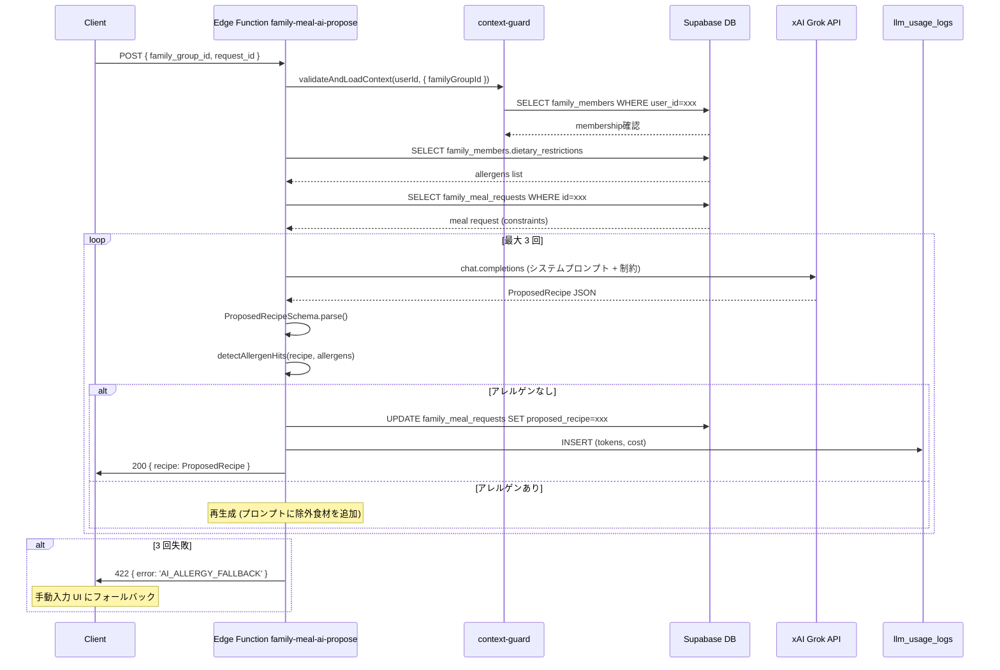

# operator/ AI / LLM 設計

## 1. 目的・スコープ

ほめゴハン全機能の AI モデル選定・LLM 使用量計測・プラン別 quota・プロンプト管理・アレルゲン検証フロー・Edge Function 一覧・AI 出力の context 漏洩防止を定義する。

**対象外**: 個別 Edge Function の実装詳細 (別ドキュメント)

## 2. 関連要件

- 要件 03 §5.5 F-OP-005 LLM コスト管理
- 要件 03 §5.5.3 クォータ
- 要件 03 §5.5.4 AI モデル選定
- 要件 03 §5.5.5 ストリーミング usage 計測
- 要件 03 §5.5.6 ProposedRecipeSchema
- 要件 03 §5.5.7 アレルゲン突合
- 要件 03 §15.20.6
- 100-scenarios.md F11 (DAU/WAU/MAU) ← LLM コストと連動

## 3. AI モデル選定マトリクス

### 3.1 機能別モデル割当

| 機能 | モデル | プロバイダー | 選定理由 | 月コスト想定 (1,000 users) |
|------|-------|------------|---------|--------------------------|
| `food-recognition` (写真→食材認識) | Gemini 2.0 Flash | Google | コスト最安、画像認識品質十分 | $50 |
| `classify-photo` (写真分類) | Gemini 2.0 Flash Lite | Google | 速度重視、低コスト | $20 |
| `analyze-fridge` (冷蔵庫分析) | Gemini 2.0 Flash | Google | 画像 + テキスト複合処理 | $30 |
| `analyze-health-checkup` (健診 PDF→数値 OCR) | Gemini 2.0 Flash | Google | PDF OCR 高品質 | $10 |
| `analyze-weight-scale` (体重計 OCR) | Gemini 2.0 Flash Lite | Google | 速度重視 | $5 |
| `knowledge-gpt` (一般質問・チャット) | xAI Grok-4-1-fast-non-reasoning | xAI | latency 最速、コスト競争力 | $200 |
| `family-meal-ai-propose` (個別献立 AI 提案) | xAI Grok-4-1-fast-non-reasoning | xAI | latency 最速 | $100 |
| `family-shared-menu-generate` (共有献立生成) | xAI Grok-4 | xAI | 高品質 (複数制約の最適化) | $150 |
| `generate-week-menu` (週次献立生成) | xAI Grok-4-1-fast | xAI | バランス型 | $100 |
| `generate-day-menu` / `generate-single-meal` | xAI Grok-4-1-fast-non-reasoning | xAI | 高速 | $50 |
| `industrial-doctor-advice` (産業医 AI アドバイス) | claude-3-5-sonnet-20241022 | Anthropic | 健康指導の専門性・安全性 | $80 |
| `image/generate` (献立画像生成) | Gemini Imagen | Google | コスト・品質バランス | $30 |

**選定基準**:
- 画像認識: Gemini (コスト最安、OCR 品質高)
- チャット・献立提案: xAI Grok (latency 最速、コスト中)
- 健康指導 (産業医向け): Claude Sonnet (専門性・安全性・医療倫理)
- 速度重視のリアルタイム判定: Gemini Flash Lite

### 3.2 フォールバック設定

| 主モデル | フォールバック | 条件 |
|---------|------------|------|
| xAI Grok (チャット系) | OpenAI GPT-4o-mini | xAI API エラー率 > 5% / タイムアウト |
| Gemini Flash (画像系) | OpenAI GPT-4o Vision | Gemini API エラー |
| Claude Sonnet (産業医) | なし (機能停止、人間エスカレーション) | 安全性上の理由 |

## 4. LLM 使用量計測

### 4.1 llm_usage_logs テーブル (既存拡張)

```sql
-- 既存テーブルに organization_id 列を追加
ALTER TABLE llm_usage_logs
  ADD COLUMN IF NOT EXISTS organization_id UUID REFERENCES organizations(id),
  ADD COLUMN IF NOT EXISTS family_group_id UUID REFERENCES family_groups(id),
  ADD COLUMN IF NOT EXISTS is_streaming BOOLEAN NOT NULL DEFAULT FALSE,
  ADD COLUMN IF NOT EXISTS function_name VARCHAR(100),
  ADD COLUMN IF NOT EXISTS model VARCHAR(100),
  ADD COLUMN IF NOT EXISTS prompt_tokens INT,
  ADD COLUMN IF NOT EXISTS completion_tokens INT,
  ADD COLUMN IF NOT EXISTS total_tokens INT,
  ADD COLUMN IF NOT EXISTS cost_usd NUMERIC(10,6),
  ADD COLUMN IF NOT EXISTS duration_ms INT;

CREATE INDEX idx_llm_usage_user_date ON llm_usage_logs(user_id, created_at::DATE);
CREATE INDEX idx_llm_usage_function ON llm_usage_logs(function_name, created_at DESC);
CREATE INDEX idx_llm_usage_org ON llm_usage_logs(organization_id, created_at DESC)
  WHERE organization_id IS NOT NULL;
```

### 4.2 使用量計測ヘルパー

```typescript
// supabase/functions/_shared/llm-usage.ts (既存ファイル拡張)

export interface LLMUsageContext {
  userId: string;
  organizationId?: string;
  familyGroupId?: string;
  functionName: string;
  model: string;
  isStreaming?: boolean;
}

export async function logLLMUsage(
  ctx: LLMUsageContext,
  usage: { prompt_tokens: number; completion_tokens: number },
  durationMs: number
): Promise<void> {
  const totalTokens = usage.prompt_tokens + usage.completion_tokens;
  const costUsd = calculateCost(totalTokens, ctx.model);

  await supabase.from('llm_usage_logs').insert({
    user_id: ctx.userId,
    organization_id: ctx.organizationId ?? null,
    family_group_id: ctx.familyGroupId ?? null,
    function_name: ctx.functionName,
    model: ctx.model,
    prompt_tokens: usage.prompt_tokens,
    completion_tokens: usage.completion_tokens,
    total_tokens: totalTokens,
    cost_usd: costUsd,
    is_streaming: ctx.isStreaming ?? false,
    duration_ms: durationMs,
  });
}

// コスト計算 (概算、モデル別レート)
function calculateCost(tokens: number, model: string): number {
  const rates: Record<string, { input: number; output: number } | number> = {
    'grok-4-1-fast-non-reasoning': { input: 0.000005, output: 0.000020 },
    'grok-4-1-fast': { input: 0.000005, output: 0.000020 },
    'grok-4': 0.000005,
    'gemini-2.0-flash': 0.0000003,
    'gemini-2.0-flash-lite': 0.00000015,
    'claude-3-5-sonnet-20241022': 0.000015,
  };
  return tokens * (rates[model] ?? 0.000005);
}
```

### 4.3 ストリーミング応答時の usage 計測 (§5.5.5)

```typescript
// supabase/functions/_shared/llm-usage.ts
export async function logStreamingUsage(
  ctx: LLMUsageContext,
  stream: ReadableStream,
  startTime: number
): Promise<{ response: ReadableStream; usage: Promise<void> }> {
  let totalCompletionTokens = 0;
  let usageLogged = false;

  const [stream1, stream2] = stream.tee();

  // バックグラウンドでトークン数を集計 (完了時に記録)
  const usagePromise = (async () => {
    const reader = stream2.getReader();
    const decoder = new TextDecoder();
    let buffer = '';

    while (true) {
      const { done, value } = await reader.read();
      if (done) break;

      buffer += decoder.decode(value, { stream: true });
      // SSE パースしてトークン数を累積
      const lines = buffer.split('\n');
      for (const line of lines) {
        if (line.startsWith('data: ')) {
          try {
            const data = JSON.parse(line.slice(6));
            if (data.usage) {
              totalCompletionTokens = data.usage.completion_tokens ?? totalCompletionTokens;
            }
          } catch {}
        }
      }
      buffer = lines[lines.length - 1];
    }

    // ストリーム完了時に usage を記録
    if (!usageLogged) {
      usageLogged = true;
      await logLLMUsage(ctx, {
        prompt_tokens: 0,  // ストリーミングでは別途取得
        completion_tokens: totalCompletionTokens,
      }, Date.now() - startTime);
    }
  })();

  return { response: stream1, usage: usagePromise };
}
```

## 5. プラン別 Quota

### 5.1 日次・月次クォータ一覧 (§5.5.3)

| プラン | 日次上限 | 月次上限 | 試用期間中の上限 |
|--------|---------|---------|---------------|
| `free` | 50 req | 1,000 req | - |
| `pro` | 500 req | 10,000 req | 50 req/日 (= free 相当) |
| `family_basic` | 800 req | 20,000 req | 100 req/日 |
| `family_pro` | 1,500 req | 50,000 req | 100 req/日 |
| `org_starter` | 200/seat | 5,000/seat | - |
| `org_standard` | 500/seat | 10,000/seat | - |
| `org_pro` | 1,000/seat | 30,000/seat | - |
| `org_enterprise` | カスタム | カスタム | - |

**試用中制限** (`personal_subscriptions.status = 'trialing'`): 本契約の 1/10 程度に制限。7 日 × 50 req/日 = 最大 350 req (コスト流出防止)。

### 5.2 Quota チェック実装

```typescript
// src/lib/plan/quota.ts
export async function checkLLMQuota(
  userId: string,
  planKey: string,
  subscriptionStatus: PersonalSubscriptionStatus
): Promise<QuotaCheckResult> {
  const quotaConfig = getQuotaConfig(planKey, subscriptionStatus);
  if (!quotaConfig) return { allowed: true }; // フリー制限 (50/日)

  // Redis から今日の使用量を取得 (TTL: 24 時間)
  const todayKey = `llm_quota:${userId}:${new Date().toISOString().slice(0, 10)}`;
  const todayUsage = await redis.incr(todayKey);
  if (todayUsage === 1) await redis.expire(todayKey, 86400); // 初回は TTL セット

  if (todayUsage > quotaConfig.daily_limit) {
    return { allowed: false, reason: 'OP_QUOTA_EXCEEDED_DAILY', limit: quotaConfig.daily_limit };
  }

  return { allowed: true, remaining: quotaConfig.daily_limit - todayUsage };
}

function getQuotaConfig(planKey: string, status: PersonalSubscriptionStatus): QuotaConfig | null {
  // 試用中は試用専用 quota
  if (status === 'trialing') {
    const trialQuotas: Record<string, number> = {
      pro: 50, family_basic: 100, family_pro: 100,
    };
    return { daily_limit: trialQuotas[planKey] ?? 50 };
  }

  const quotas: Record<string, number> = {
    free: 50, pro: 500, family_basic: 800, family_pro: 1500,
    org_starter: 200, org_standard: 500, org_pro: 1000,
  };
  return { daily_limit: quotas[planKey] ?? 50 };
}
```

### 5.3 異常検知

```typescript
// src/lib/plan/anomaly.ts
export async function detectLLMAnomaly(userId: string, dailyCount: number): Promise<void> {
  // 1 ユーザーが 1 日 5,000 リクエスト超 → アラート
  if (dailyCount > 5000) {
    await notifySlack({
      channel: '#llm-anomaly',
      message: `⚠️ LLM 異常使用: user_id=${userId}, today=${dailyCount} req`,
    });
    // 自動クォータ削減 (1,000 req/日に制限)
    await redis.set(`llm_quota_override:${userId}`, 1000, { ex: 86400 * 7 });
  }
}
```

## 6. アレルゲン突合フロー (§5.5.7)

### 6.1 ProposedRecipeSchema (Zod)

> **注意**: `ProposedRecipeSchema` の canonical 定義は **family/04-meal-request-flow.md §8** を参照。
> 個別献立フローのドメイン主管であるため、family/04 の定義を唯一の正とする。
> 本ファイルでは重複定義を保持しない。

### 6.2 アレルゲン突合フロー

```typescript
// supabase/functions/_shared/allergy.ts

const MAJOR_ALLERGENS = [
  '卵', '乳', '小麦', '落花生', 'えび', 'かに', 'そば', 'くるみ', // 特定原材料 8 種
  'あわび', 'いか', 'いくら', 'オレンジ', 'カシューナッツ', 'キウイフルーツ',
  '牛肉', 'ごま', 'さけ', 'さば', '大豆', '鶏肉', 'バナナ', '豚肉',
  'まつたけ', 'もも', 'やまいも', 'りんご', 'ゼラチン', 'アーモンド',
]; // 特定原材料に準ずるもの含む

export interface AllergenCheckResult {
  safe: boolean;
  hits: Array<{ ingredient: string; allergen: string }>;
}

export function detectAllergenHits(
  recipe: ProposedRecipe,
  memberAllergens: string[]
): AllergenCheckResult {
  const hits: AllergenCheckResult['hits'] = [];

  for (const ingredient of recipe.ingredients) {
    for (const allergen of memberAllergens) {
      // 完全一致 + 部分一致 (例: 「牛乳」に「乳」がヒット)
      if (
        ingredient.name.includes(allergen) ||
        (ingredient.allergen_tags ?? []).includes(allergen)
      ) {
        hits.push({ ingredient: ingredient.name, allergen });
      }
    }
  }

  return { safe: hits.length === 0, hits };
}
```

### 6.3 AI 提案 → アレルゲン突合 → 再生成ループ

```typescript
// supabase/functions/family-meal-ai-propose/index.ts
async function proposeWithAllergenCheck(
  constraints: MealConstraints,
  memberAllergens: string[],
  maxRetries = 3
): Promise<ProposedRecipe> {
  for (let attempt = 0; attempt < maxRetries; attempt++) {
    // 1. AI に献立提案を依頼
    const rawResponse = await callXaiGrok(buildPrompt(constraints, attempt));

    // 2. スキーマ検証
    const parsed = ProposedRecipeSchema.safeParse(rawResponse);
    if (!parsed.success) {
      console.warn(`Attempt ${attempt + 1}: Schema validation failed`, parsed.error);
      continue;
    }

    // 3. アレルゲン突合
    const allergenCheck = detectAllergenHits(parsed.data, memberAllergens);
    if (allergenCheck.safe) {
      return parsed.data;
    }

    console.warn(
      `Attempt ${attempt + 1}: Allergen hits detected: ${JSON.stringify(allergenCheck.hits)}`
    );
  }

  // 3 回失敗 → フォールバック (人間が決める UI へ)
  throw new Error('AI_ALLERGY_FALLBACK');
}
```

**フォールバック**: `throw new Error('AI_ALLERGY_FALLBACK')` → フロントエンドで「AI が安全な提案を作れませんでした。手動で入力してください」を表示。

## 7. プロンプト管理

### 7.1 ディレクトリ構成

```
supabase/functions/
├── _shared/
│   └── prompts/
│       ├── family-meal-ai-propose/
│       │   ├── system.ja.md
│       │   └── user.ja.md
│       ├── family-shared-menu-generate/
│       │   ├── system.ja.md
│       │   └── user.ja.md
│       ├── industrial-doctor-advice/
│       │   ├── system.ja.md     ← 厳格な医療倫理・免責事項含む
│       │   └── user.ja.md
│       ├── knowledge-gpt/
│       │   ├── system.ja.md
│       │   └── user.ja.md
│       └── food-recognition/
│           └── user.ja.md
```

### 7.2 プロンプトテンプレート例 (family-meal-ai-propose)

```markdown
<!-- supabase/functions/_shared/prompts/family-meal-ai-propose/system.ja.md -->
あなたは家族の食事提案AIアシスタントです。

## 重要な制約
- 提案するレシピに、以下のアレルゲンを含む食材を使用してはなりません: {{ALLERGENS}}
- アレルゲンが含まれる場合は、必ず代替食材を提案してください
- 医療的な栄養アドバイスは行わないでください (一般的な食事提案のみ)

## 出力形式
以下のJSONスキーマに従って、必ず JSON のみで応答してください:
{{SCHEMA}}
```

### 7.3 プロンプトバージョン管理

- Git で管理 (PR レビュー必須)
- 大きな変更は `feature_flags` で段階ロールアウト
- 産業医向けプロンプト (`industrial-doctor-advice`) は必ず super_admin が承認

## 8. AI Edge Function 一覧

| Edge Function | モデル | 認証 | quota 対象 | 説明 |
|--------------|-------|-----|-----------|------|
| `family-meal-ai-propose` | xAI Grok-4-1-fast-non-reasoning | JWT | ✓ | 個別献立 AI 提案 + アレルゲン突合 |
| `family-shared-menu-generate` | xAI Grok-4 | JWT | ✓ | 家族全員制約和集合での献立生成 |
| `industrial-doctor-advice` | claude-3-5-sonnet-20241022 | JWT (org_industrial_doctor) | ✓ | 産業医向け AI アドバイス |
| `knowledge-gpt` | xAI Grok-4-1-fast-non-reasoning | JWT | ✓ | 一般質問・栄養アドバイス |
| `generate-week-menu` | xAI Grok-4-1-fast | JWT | ✓ | 週次献立生成 |
| `generate-day-menu` | xAI Grok-4-1-fast-non-reasoning | JWT | ✓ | 日次献立生成 |
| `food-recognition` | Gemini 2.0 Flash | JWT | ✓ | 食事写真→食材認識 |
| `classify-photo` | Gemini 2.0 Flash Lite | JWT | ✓ | 写真分類 |
| `analyze-fridge` | Gemini 2.0 Flash | JWT | ✓ | 冷蔵庫内食材認識 |
| `analyze-health-checkup` | Gemini 2.0 Flash | JWT | ✓ | 健診 PDF→数値 OCR |
| `analyze-weight-scale` | Gemini 2.0 Flash Lite | JWT | ✓ | 体重計 OCR |
| `stripe-price-sync` | - | Service Role | - | Stripe Price 同期 |
| `notify-push` | - | Service Role | - | Expo Push 一斉送信 |
| `notify-email` | - | Service Role | - | Resend 一斉送信 |
| `scan-file` | - | Service Role | - | ClamAV ウイルススキャン |

## 9. AI 出力 context 漏洩防止

### 9.1 必須の組織・家族 ID 絞り込み

全 AI Edge Function は、呼び出し元の context を必ず **サーバー側で検証**する:

```typescript
// supabase/functions/_shared/context-guard.ts

/**
 * AI Edge Function に渡す context を検証する。
 * フロントエンドからの入力は信用せず、DB から自分で取得する。
 */
export async function validateAndLoadContext(
  userId: string,
  requestedContext: {
    familyGroupId?: string;
    organizationId?: string;
  }
): Promise<SafeContext> {
  const supabase = createSupabaseServiceClient();

  // family_group_id の検証: ユーザーが本当にそのグループのメンバーか
  if (requestedContext.familyGroupId) {
    const { data: membership } = await supabase
      .from('family_members')
      .select('id')
      .eq('family_group_id', requestedContext.familyGroupId)
      .eq('user_id', userId)
      .single();

    if (!membership) {
      throw new Error('CONTEXT_GUARD_FAMILY_ACCESS_DENIED');
    }
  }

  // organization_id の検証: ユーザーが本当にその組織のメンバーか
  if (requestedContext.organizationId) {
    const { data: orgMembership } = await supabase
      .from('user_profiles')
      .select('organization_id')
      .eq('id', userId)
      .single();

    if (orgMembership?.organization_id !== requestedContext.organizationId) {
      throw new Error('CONTEXT_GUARD_ORG_ACCESS_DENIED');
    }
  }

  return {
    userId,
    familyGroupId: requestedContext.familyGroupId,
    organizationId: requestedContext.organizationId,
  };
}
```

### 9.2 産業医 context 漏洩防止 (特に重要)

`industrial-doctor-advice` Edge Function:
- `organization_id` はフロントエンドから受け取らず、`user_profiles.organization_id` から取得
- 対象 `user_id` が同一組織のメンバーであることを DB で確認
- consent (`consent_org_health_data = TRUE`) を確認
- family_group_id は **一切渡さない** (産業医は家族データにアクセス不可)

```typescript
// supabase/functions/industrial-doctor-advice/index.ts
Deno.serve(async (req) => {
  const startTime = Date.now();
  const { targetUserId, adviceRequest } = await req.json();

  // JWT からログイン中の産業医の user_id を取得
  const supabase = createSupabaseClientWithAuth(req.headers.get('Authorization')!);
  const { data: { user: doctorUser } } = await supabase.auth.getUser();
  if (!doctorUser) return new Response('Unauthorized', { status: 401 });

  // 産業医の組織 ID を取得 (信頼できる source)
  const { data: doctorProfile } = await supabase
    .from('user_profiles')
    .select('organization_id, roles')
    .eq('id', doctorUser.id)
    .single();

  if (!doctorProfile?.roles?.includes('org_industrial_doctor')) {
    return new Response('Forbidden', { status: 403 });
  }

  // 対象ユーザーが同一組織 + consent 確認 (DB で検証、フロントエンド入力は信用しない)
  const { data: targetProfile } = await supabase
    .from('user_profiles')
    .select('organization_id, consent_org_health_data')
    .eq('id', targetUserId)
    .single();

  if (
    targetProfile?.organization_id !== doctorProfile.organization_id ||
    !targetProfile?.consent_org_health_data
  ) {
    return new Response('Access denied', { status: 403 });
  }

  // AI 呼び出し (organization_id を LLM に渡さない)
  const response = await callClaude(buildMedicalPrompt(adviceRequest));
  await logLLMUsage({
    userId: doctorUser.id,
    organizationId: doctorProfile.organization_id,
    functionName: 'industrial-doctor-advice',
    model: 'claude-3-5-sonnet-20241022',
  }, response.usage, Date.now() - startTime);

  return new Response(JSON.stringify(response.content), { headers: { 'Content-Type': 'application/json' } });
});
```

## 10. シーケンス — family-meal-ai-propose (アレルゲン突合含む)



## 11. エラーハンドリング

| エラー | コード | 対処 |
|-------|--------|------|
| quota 超過 | `OP_QUOTA_EXCEEDED` | 429 + 「本日の利用上限に達しました」メッセージ |
| アレルゲン 3 回失敗 | `AI_ALLERGY_FALLBACK` | 422 + フロントエンドで手動入力 UI に切替 |
| context 漏洩試行 | `CONTEXT_GUARD_*` | 403 + 監査ログ記録 |
| xAI API タイムアウト | `LLM_TIMEOUT` | フォールバックモデルで再試行 |
| JSON parse 失敗 | `LLM_INVALID_OUTPUT` | 再生成 (max_retries 以内) |
| Claude API エラー (産業医) | `LLM_DOCTOR_UNAVAILABLE` | 503 + 「AI アドバイスが一時的に利用できません。産業医に直接ご相談ください」 |

## 12. テスト方針

- **Unit**:
  - `detectAllergenHits()`: 各特定原材料のヒット/非ヒット
  - `ProposedRecipeSchema.parse()`: 正常系・異常系
  - `calculateCost()`: モデル別コスト計算
  - `checkLLMQuota()`: trialing 時の quota 制限
- **Integration** (Supabase Local):
  - `validateAndLoadContext()` の組織 ID 不一致 → 403 確認
  - ストリーミング usage ログの正確な記録
- **E2E**:
  - アレルゲン突合: 卵アレルギー設定 → 卵を含む提案 → 自動再生成 → 卵なし提案
  - quota 超過: Redis で daily_count を操作 → 429 確認

## 13. 既存実装との関連

- `supabase/functions/_shared/llm-usage.ts`: 既存ファイルに `organization_id` / `family_group_id` 列追加
- `supabase/functions/knowledge-gpt/`: 既存 — quota チェックを追加するのみ
- `supabase/functions/food-recognition/`: 既存 — context guard を追加

## 14. 未解決事項

- xAI Grok-4 の正式 API エンドポイントが変更された場合のフォールバック先 → `feature_flags` で切替できるよう設計済み
- `industrial-doctor-advice` の Claude API レート制限 (Rate Limit: 100 req/min) は組織 Pro の利用規模次第では上限引き上げ申請が必要
- LLM プロンプトの多言語対応 (英語) は Phase 2 で `prompts/{function}/{locale}.md` で管理
