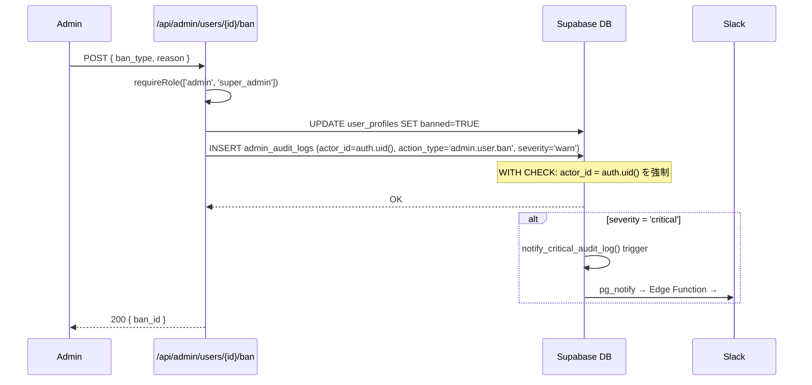

# operator/ 監査・モニタリング設計

## 1. 目的・スコープ

監査ログの不可逆設計・監査対象操作の網羅リスト・外部監視ツール連携 (Sentry / Better Stack)・インシデント管理フロー・Status Page 運用を定義する。

## 2. 関連要件

- 要件 03 §5.3 F-OP-003 監査ログ
- 要件 03 §15.8 監査ログ対象操作の網羅リスト
- 要件 03 §15.9 監査ログ保持期間
- 要件 03 §22.9 Status Page
- 100-scenarios.md F17, F18

## 3. admin_audit_logs DDL + RLS (不可逆)

### 3.1 テーブル定義 (最終版)

```sql
-- 既存テーブルへの ALTER (01-data-model.md で定義済み、ここは補足)
CREATE TABLE IF NOT EXISTS admin_audit_logs (
  id                      UUID PRIMARY KEY DEFAULT gen_random_uuid(),
  actor_id                UUID REFERENCES auth.users(id) ON DELETE SET NULL,
  -- GDPR 削除対応: actor が削除された場合 NULL にして履歴を保持
  -- 削除前スナップショット (削除後の参照用)
  actor_email_snapshot    VARCHAR(255),   -- 削除前の email を保持
  actor_role_snapshot     VARCHAR(50),    -- 削除前の主ロールを保持
  action_type             VARCHAR(100) NOT NULL,
  target_id               UUID,
  target_type             VARCHAR(30),
  details                 JSONB NOT NULL DEFAULT '{}',
  severity                VARCHAR(20) NOT NULL DEFAULT 'info'
    CHECK (severity IN ('info', 'warn', 'critical')),
  ip_address              INET,
  user_agent              TEXT,
  session_id              VARCHAR(255),
  impersonated_by         UUID REFERENCES auth.users(id) ON DELETE SET NULL,
  created_at              TIMESTAMPTZ NOT NULL DEFAULT NOW()
);

-- インデックス
CREATE INDEX idx_audit_logs_actor ON admin_audit_logs(actor_id, created_at DESC);
CREATE INDEX idx_audit_logs_action ON admin_audit_logs(action_type, created_at DESC);
CREATE INDEX idx_audit_logs_target ON admin_audit_logs(target_id, created_at DESC);
CREATE INDEX idx_audit_logs_severity ON admin_audit_logs(severity, created_at DESC);
CREATE INDEX idx_audit_logs_created ON admin_audit_logs(created_at DESC);  -- 7年分のスキャン用
```

### 3.2 RLS ポリシー (不可逆性の保証)

```sql
ALTER TABLE admin_audit_logs ENABLE ROW LEVEL SECURITY;

-- =========================================
-- SELECT: super_admin のみ
-- (admin が自分の操作を消せない設計)
-- (support / sales / finance も閲覧不可 — 事案調査は super_admin に依頼)
-- =========================================
CREATE POLICY "audit_logs_select_super_admin" ON admin_audit_logs
  FOR SELECT USING (
    EXISTS (
      SELECT 1 FROM user_profiles
      WHERE id = auth.uid() AND 'super_admin' = ANY(roles)
    )
  );

-- =========================================
-- INSERT: admin 系全ロールから可
-- WITH CHECK で actor_id = auth.uid() を強制
-- (他の admin のログを偽装して INSERT できない)
-- =========================================
CREATE POLICY "audit_logs_insert_admins" ON admin_audit_logs
  FOR INSERT WITH CHECK (
    actor_id = auth.uid()
    AND EXISTS (
      SELECT 1 FROM user_profiles
      WHERE id = auth.uid()
        AND ARRAY['admin','super_admin','support','sales','finance','content_moderator']::TEXT[]
            && roles
    )
  );

-- =========================================
-- UPDATE: 完全禁止 (不可逆性)
-- =========================================
CREATE POLICY "audit_logs_no_update" ON admin_audit_logs
  FOR UPDATE USING (false);

-- =========================================
-- DELETE: 完全禁止 (不可逆性)
-- =========================================
CREATE POLICY "audit_logs_no_delete" ON admin_audit_logs
  FOR DELETE USING (false);

-- コメント
COMMENT ON TABLE admin_audit_logs IS
  '監査ログ。RLS で UPDATE/DELETE 完全禁止。SELECT は super_admin のみ。7年保管 (個人情報保護法/SOC2)';
COMMENT ON COLUMN admin_audit_logs.impersonated_by IS
  'super_admin が別ユーザーとして操作している場合、super_admin の user_id を記録';
COMMENT ON POLICY "audit_logs_insert_admins" ON admin_audit_logs IS
  'actor_id = auth.uid() を WITH CHECK で強制することで、他人のログを偽装できない';
```

## 4. 監査対象操作の網羅リスト (§15.8)

### 4.1 admin 系操作

```
admin.user.ban                      - ユーザー BAN
admin.user.unban                    - BAN 解除
admin.user.role_change              - ロール変更
admin.user.impersonate              - なりすまし開始
admin.user.impersonate_end          - なりすまし終了
admin.user.note_add                 - 管理ノート追加
admin.organization.create           - 組織作成
admin.organization.suspend          - 組織停止
admin.organization.restore          - 組織復旧
admin.organization.delete           - 組織削除
admin.organization.plan_change      - 組織プラン変更 (手動)
admin.coupon.create                 - クーポン作成
admin.coupon.pause                  - クーポン一時停止
admin.coupon.activate               - クーポン有効化
admin.coupon.retroactive_apply      - 遡及適用 (super_admin 承認)
admin.refund.issue                  - 返金指示 (Stripe Dashboard 誘導)
admin.export.request                - データエクスポート要求
admin.notification.campaign_send    - 通知キャンペーン送信
admin.moderation.resolve            - モデレーション解決
admin.announcement.create           - お知らせ作成
admin.announcement.delete           - お知らせ削除
admin.support.ticket_assign         - チケット担当者変更
```

### 4.2 super_admin 系操作

```
super_admin.plan.create             - プラン作成
super_admin.plan.update             - プラン更新
super_admin.plan.publish            - プラン公開
super_admin.plan.unpublish          - プラン非公開
super_admin.plan.deprecate          - プラン廃止 (severity=critical)
super_admin.plan.un_deprecate       - 廃止ロールバック (severity=critical)
super_admin.plan.price_change       - 価格変更
super_admin.feature_package.create  - 機能パッケージ作成
super_admin.feature_package.update  - 機能パッケージ更新
super_admin.feature_package.delete  - 機能パッケージ削除
super_admin.feature_flag.toggle     - 機能フラグ切替
super_admin.feature_flag.rollout    - ロールアウト戦略変更
super_admin.cron.run_now            - cron 手動実行
super_admin.cron.pause              - cron 一時停止
super_admin.organization.transfer_admin - org_admin 緊急転送
super_admin.gdpr_delete.execute     - GDPR 削除実行
super_admin.impersonate             - なりすまし (admin も含む)
super_admin.llm_quota.override      - LLM クォータ手動変更
super_admin.setting.change          - システム設定変更
```

### 4.3 finance 系操作

```
finance.invoice.generate            - 請求書生成
finance.invoice.regenerate          - 請求書再生成
finance.invoice.cancel              - 請求書キャンセル
finance.invoice.resend              - 請求書再送
finance.refund.approve              - 返金承認
finance.stripe_reconcile.manual     - 手動 reconcile 実行
```

### 4.4 support 系操作

```
support.ticket.escalate             - エスカレーション
support.ticket.close                - チケット close
support.user.password_reset         - パスワードリセット実行
support.user.email_resend           - 確認メール再送
```

### 4.5 システム自動操作

```
system.payment.failed               - 支払失敗 (Stripe webhook)
system.stripe.chargeback            - チャージバック発生 (severity=critical)
system.stripe.reconcile_discrepancy - reconcile 不一致検出
system.plan.auto_expire             - プラン自動期限切れ
system.gdpr_delete.batch            - GDPR 削除バッチ実行
system.ban.auto                     - 自動 BAN (不正検知)
```

### 4.6 監査ログ INSERT ヘルパー

```typescript
// src/lib/audit/log.ts
import { createSupabaseServiceClient } from '@/lib/supabase/service';

interface AuditLogParams {
  actorId: string;
  actionType: string;
  targetId?: string;
  targetType?: string;
  details?: Record<string, unknown>;
  severity?: 'info' | 'warn' | 'critical';
  ipAddress?: string;
  impersonatedBy?: string;
}

export async function insertAuditLog(params: AuditLogParams): Promise<void> {
  const supabase = createSupabaseServiceClient();  // service_role で RLS バイパス (INSERT のみ)

  // actor の email / roles をスナップショットとして取得 (GDPR 削除後も逆引き可能にする)
  let actorEmailSnapshot: string | null = null;
  let actorRoleSnapshot: string | null = null;
  if (params.actorId) {
    const { data: authUser } = await supabase.auth.admin.getUserById(params.actorId);
    actorEmailSnapshot = authUser?.user?.email ?? null;

    const { data: profile } = await supabase
      .from('user_profiles')
      .select('roles')
      .eq('id', params.actorId)
      .single();
    actorRoleSnapshot = (profile?.roles ?? []).join(',') || null;
  }

  await supabase.from('admin_audit_logs').insert({
    actor_id: params.actorId,
    actor_email_snapshot: actorEmailSnapshot,
    actor_role_snapshot: actorRoleSnapshot,
    action_type: params.actionType,
    target_id: params.targetId ?? null,
    target_type: params.targetType ?? null,
    details: params.details ?? {},
    severity: params.severity ?? 'info',
    ip_address: params.ipAddress ?? null,
    impersonated_by: params.impersonatedBy ?? null,
  });
  // エラーは握り潰さず、呼び出し元にスローする (監査ログ失敗は操作を中断させる)
}
```

**注意**:
- `actor_id` は RLS の WITH CHECK で `auth.uid()` と一致することを強制するが、`service_role` を使う場合は RLS をバイパスするため、アプリ層で `actorId = await getCurrentUserId()` を必ず取得して渡すこと。
- `actor_email_snapshot` / `actor_role_snapshot` は GDPR 削除により `actor_id` が NULL になった後も actor を特定するために使用する。これらはスナップショット列であり、後から変更されない。

## 5. 7 年保管とアーカイブ

### 5.1 保持期間一覧

| テーブル | 保持期間 | 根拠 | アーカイブ先 |
|---------|---------|------|------------|
| `admin_audit_logs` | 7 年 | 個人情報保護法、SOC2 | Supabase → S3 Glacier (1 年経過後) |
| `org_license_audit_log` | 7 年 | 法人契約監査要件 | 同上 |
| `org_health_access_logs` | 10 年 | 産業医記録、医療法 | 同上 |
| `family_activity_log` | 3 年 | プライバシーバランス | 同上 |
| `gdpr_deletion_requests` | 永久 | 削除証明 | アーカイブしない |

### 5.2 アーカイブジョブ (pg_cron 月次)

```sql
-- 1 年経過した admin_audit_logs を Cold Storage 用テーブルに移動
-- 実際の S3 転送は Vercel Cron が担当
SELECT cron.schedule(
  'audit-log-archive',
  '0 3 1 * *',  -- 毎月1日 03:00 UTC
  $$
  -- 1 年超のログを archive テーブルに移動
  WITH moved AS (
    DELETE FROM admin_audit_logs
    WHERE created_at < NOW() - INTERVAL '1 year'
    RETURNING *
  )
  INSERT INTO admin_audit_logs_archive SELECT * FROM moved;
  $$
);
```

```sql
CREATE TABLE admin_audit_logs_archive (LIKE admin_audit_logs INCLUDING ALL);
-- archive テーブルは RLS 同様、UPDATE/DELETE 禁止
ALTER TABLE admin_audit_logs_archive ENABLE ROW LEVEL SECURITY;
CREATE POLICY "archive_no_update" ON admin_audit_logs_archive FOR UPDATE USING (false);
CREATE POLICY "archive_no_delete" ON admin_audit_logs_archive FOR DELETE USING (false);
```

## 6. アラート設定

### 6.1 連続失敗アラート

```typescript
// src/lib/monitoring/audit-alerts.ts

// 同一 admin による短時間での大量 BAN (異常操作の検知)
export async function checkBulkBanAnomaly(actorId: string): Promise<void> {
  const { count } = await supabase
    .from('admin_audit_logs')
    .select('*', { count: 'exact' })
    .eq('actor_id', actorId)
    .eq('action_type', 'admin.user.ban')
    .gte('created_at', new Date(Date.now() - 60 * 60 * 1000).toISOString()); // 1時間以内

  if ((count ?? 0) > 50) {
    await notifySlack({
      channel: '#security-alert',
      message: `⚠️ 異常 BAN 操作: actor_id=${actorId} が1時間以内に ${count} 件 BAN`,
    });
  }
}
```

### 6.2 severity='critical' の即時通知

`admin_audit_logs` に severity='critical' が INSERT された場合:

```sql
-- Supabase DB trigger (critical ログ検出)
CREATE OR REPLACE FUNCTION notify_critical_audit_log()
RETURNS TRIGGER AS $$
BEGIN
  IF NEW.severity = 'critical' THEN
    PERFORM pg_notify('critical_audit_log', row_to_json(NEW)::text);
  END IF;
  RETURN NEW;
END;
$$ LANGUAGE plpgsql;

CREATE TRIGGER audit_log_critical_notify
  AFTER INSERT ON admin_audit_logs
  FOR EACH ROW EXECUTE FUNCTION notify_critical_audit_log();
```

Edge Function が `pg_notify` をリッスンして Slack #incident に即時通知。

## 7. Sentry 統合

### 7.1 設定

```typescript
// src/lib/monitoring/sentry.ts
import * as Sentry from '@sentry/nextjs';

// Error は自動的に Sentry に送信される
// admin 操作の追加 context を送信:
export function setSentryAdminContext(user: AdminUser): void {
  Sentry.setUser({
    id: user.id,
    email: user.email,
    role: user.roles.join(','),
  });
  Sentry.setTag('admin_role', user.roles[0]);
}
```

### 7.2 カスタムイシュー送信

```typescript
// 重大エラーは Sentry に手動送信
Sentry.captureException(error, {
  tags: { component: 'stripe-webhook', severity: 'critical' },
  extra: { stripe_event_id: eventId, action_type: 'payment_failed' },
});
```

### 7.3 Performance トレース

```typescript
// Edge Function のパフォーマンストレース (Phase 2: OpenTelemetry に移行予定)
const transaction = Sentry.startTransaction({ name: 'stripe-price-sync' });
// ... 処理 ...
transaction.finish();
```

## 8. Better Stack (Logtail) 統合

### 8.1 ログ送信

全 Vercel API Routes と Edge Functions で Better Stack に構造化ログを送信:

```typescript
// src/lib/monitoring/logger.ts
import { Logtail } from '@logtail/node';

const logtail = new Logtail(process.env.BETTER_STACK_TOKEN!);

export const logger = {
  info: (message: string, meta?: Record<string, unknown>) =>
    logtail.info(message, meta),
  warn: (message: string, meta?: Record<string, unknown>) =>
    logtail.warn(message, meta),
  error: (message: string, meta?: Record<string, unknown>) =>
    logtail.error(message, meta),
};
```

### 8.2 重要イベントのログ出力

```typescript
// Webhook 受信
logger.info('stripe.webhook.received', {
  event_id: event.id,
  event_type: event.type,
  processing_time_ms: processingTime,
});

// 価格変更
logger.warn('plan.price_change', {
  plan_key: planKey,
  old_price: oldPrice,
  new_price: newPrice,
  applies_to: appliesTo,
  actor_id: actorId,
});
```

### 8.3 アラートルール (Better Stack で設定)

| 条件 | アクション |
|-----|---------|
| `error` ログが 5 分間に 10 件超 | Slack #incident 通知 |
| `stripe.webhook` の processing_time > 5s | Slack #stripe-alerts |
| pg_cron ジョブ失敗 | Slack #cron-alerts |
| API p95 > 1000ms (3 分間継続) | Slack #performance |

## 9. Status Page (status.homegohan.app)

### 9.1 Better Stack Status Page 設定

URL: `https://status.homegohan.app`

**監視コンポーネント**:

| コンポーネント | 監視 URL / 方法 | 更新頻度 |
|-------------|--------------|--------|
| Web App | `https://homegohan.app/api/health` | 1 分 |
| API (Auth) | `https://homegohan.app/api/auth/status` | 1 分 |
| Database (Supabase) | Supabase Uptime API | 1 分 |
| AI Chat (xAI) | `https://api.x.ai/v1/models` (HEAD) | 5 分 |
| AI Images (Gemini) | Google API Health | 5 分 |
| Email (Resend) | Resend Status API | 5 分 |
| Payments (Stripe) | Stripe Status API | 1 分 |

### 9.2 インシデント記録フロー

```
1. 自動検知 or 手動検知
2. Better Stack で「インシデント作成」
   → status.homegohan.app に表示
3. 影響コンポーネントとステータスを選択
   (Investigating / Identified / Monitoring / Resolved)
4. ユーザーへの影響範囲によりメール/Push 通知
5. 復旧確認 → Resolved + 今後の対応予定を記載
```

## 10. インシデント管理フロー

### 10.1 検知 → 対応フロー

```
Step 1: 検知
  - 自動: Better Stack / Sentry アラート → Slack #incident
  - 手動: ユーザー報告 → support チケット → admin が確認

Step 2: トリアージ (5 分以内)
  - インシデントリーダーを指名 (on-call)
  - 影響範囲を特定 (どのサービス / 何人のユーザーに影響)
  - 重要度を分類:
    P0: サービス全停止 (30 分以内に対応)
    P1: 主要機能停止 (2 時間以内に対応)
    P2: 部分的な機能低下 (翌営業日まで)
    P3: 軽微な問題 (計画的に対応)

Step 3: 通知 (P0/P1 は即時)
  - status.homegohan.app を更新
  - Slack #incident に状況共有
  - Org Pro/Enterprise 顧客には直接メール通知

Step 4: 対応
  - Slack スレッドで作業ログを記録
  - 5 分毎に進捗更新

Step 5: 復旧確認
  - smoke test 実施
  - status.homegohan.app を Resolved に更新
  - ユーザーへ復旧通知

Step 6: ポストモーテム (P0/P1 は 48 時間以内)
  - 以下のテンプレートを使用
```

### 10.2 ポストモーテムテンプレート

```markdown
# インシデントポストモーテム: [タイトル]

**日時**: YYYY-MM-DD HH:MM JST
**重要度**: P0 / P1 / P2
**影響時間**: N 分
**影響ユーザー数**: N 人

## タイムライン

| 時刻 | イベント |
|-----|---------|
| HH:MM | 最初の検知 |
| HH:MM | 原因特定 |
| HH:MM | 対応開始 |
| HH:MM | 復旧確認 |

## 根本原因

[1-2 段落で根本原因を記述]

## 影響

- 機能停止: [具体的な機能]
- 影響ユーザー: [数]
- データ損失: [あり/なし]

## 対応内容

[実施した対応の詳細]

## 再発防止策

| アクション | 担当者 | 期限 |
|----------|--------|------|
| [具体的な作業] | [名前] | YYYY-MM-DD |

## 学んだこと

[チーム全体で共有すべき教訓]
```

## 11. シーケンス — 監査ログ記録フロー



## 12. エラーハンドリング

| シナリオ | 対処 |
|---------|------|
| 監査ログ INSERT 失敗 | 操作自体をロールバック (監査ログなしの破壊的操作は禁止) |
| Sentry 送信失敗 | fire-and-forget (業務には影響させない) |
| Better Stack 送信失敗 | fire-and-forget |
| Slack 通知失敗 | Better Stack に fallback ログ記録 |

## 13. テスト方針

主要テストケース:

1. `it('rejects UPDATE on admin_audit_logs via audit_logs_no_update policy')`
2. `it('rejects DELETE on admin_audit_logs via audit_logs_no_delete policy')`
3. `it('rejects INSERT when actor_id does not match auth.uid()')`
4. `it('returns 0 rows when admin role (non-super_admin) selects audit_logs')`
5. `it('super_admin can SELECT all audit_logs')`
6. `it('E2E: BAN action creates audit_log entry visible to super_admin')`
7. `it('Sentry error is captured when unhandled exception occurs in API route')`
8. `it('Slack alert is sent when error rate exceeds 1% threshold')`

```typescript
// tests/integration/operator/audit-log-rls.integration.test.ts
import { describe, it, expect, beforeAll } from 'vitest';
import { createClient } from '@supabase/supabase-js';
import { signInAsUser } from '../../helpers/auth';

const supabaseAdmin = createClient(
  process.env.SUPABASE_URL!,
  process.env.SUPABASE_SERVICE_ROLE_KEY!,
);

describe('admin_audit_logs RLS ポリシー', () => {
  let superAdminToken: string;
  let adminToken: string;
  let testLogId: string;

  beforeAll(async () => {
    superAdminToken = await signInAsUser('super@test.local');
    adminToken = await signInAsUser('admin@test.local');

    // テスト用の監査ログを service_role で INSERT
    const { data } = await supabaseAdmin
      .from('admin_audit_logs')
      .insert({
        actor_id: faker.string.uuid(),
        action_type: 'test_action',
        target_type: 'user',
        target_id: faker.string.uuid(),
        severity: 'info',
      })
      .select()
      .single();
    testLogId = data!.id;
  });

  it('rejects UPDATE on admin_audit_logs (audit_logs_no_update policy)', async () => {
    const superClient = createClient(
      process.env.SUPABASE_URL!,
      process.env.SUPABASE_ANON_KEY!,
      { global: { headers: { Authorization: `Bearer ${superAdminToken}` } } },
    );
    const { error } = await superClient
      .from('admin_audit_logs')
      .update({ action_type: '改ざん試行' } as never)
      .eq('id', testLogId);
    expect(error).not.toBeNull();
  });

  it('rejects DELETE on admin_audit_logs (audit_logs_no_delete policy)', async () => {
    const superClient = createClient(
      process.env.SUPABASE_URL!,
      process.env.SUPABASE_ANON_KEY!,
      { global: { headers: { Authorization: `Bearer ${superAdminToken}` } } },
    );
    const { error } = await superClient
      .from('admin_audit_logs')
      .delete()
      .eq('id', testLogId);
    expect(error).not.toBeNull();
  });

  it('returns 0 rows when admin role (non-super_admin) selects audit_logs', async () => {
    const adminClient = createClient(
      process.env.SUPABASE_URL!,
      process.env.SUPABASE_ANON_KEY!,
      { global: { headers: { Authorization: `Bearer ${adminToken}` } } },
    );
    const { data, error } = await adminClient
      .from('admin_audit_logs')
      .select('id');
    expect(error).toBeNull();
    expect(data).toHaveLength(0); // admin は super_admin 専用ログを閲覧不可
  });

  it('super_admin can SELECT all audit_logs', async () => {
    const superClient = createClient(
      process.env.SUPABASE_URL!,
      process.env.SUPABASE_ANON_KEY!,
      { global: { headers: { Authorization: `Bearer ${superAdminToken}` } } },
    );
    const { data, error } = await superClient
      .from('admin_audit_logs')
      .select('id')
      .eq('id', testLogId);
    expect(error).toBeNull();
    expect(data!.length).toBeGreaterThanOrEqual(1);
  });

  it('rejects INSERT when actor_id does not match auth.uid()', async () => {
    const adminClient = createClient(
      process.env.SUPABASE_URL!,
      process.env.SUPABASE_ANON_KEY!,
      { global: { headers: { Authorization: `Bearer ${adminToken}` } } },
    );
    // actor_id を別ユーザーの UUID に偽装して INSERT 試行
    const { error } = await adminClient.from('admin_audit_logs').insert({
      actor_id: faker.string.uuid(), // 現在の auth.uid() と不一致
      action_type: 'fake_action',
      target_type: 'user',
      target_id: faker.string.uuid(),
      severity: 'info',
    });
    expect(error).not.toBeNull(); // WITH CHECK 違反
  });
});

// tests/e2e/operator/operator-ban-audit-log.spec.ts
test('BAN action creates audit_log entry visible to super_admin', async ({
  page,
}) => {
  await page.goto('/operator/users');
  const targetRow = page.locator('[data-testid=user-row]').first();
  const targetUserId = await targetRow.getAttribute('data-user-id');

  await targetRow.locator('[data-testid=ban-user-button]').click();
  await page.click('[data-testid=confirm-ban-button]');
  await expect(
    page.locator('[data-testid=ban-success-toast]'),
  ).toBeVisible();

  // 監査ログページで確認
  await page.goto('/operator/audit-logs');
  const latestLog = page.locator('[data-testid=audit-log-entry]').first();
  await expect(latestLog).toContainText('user_ban');
  await expect(latestLog).toContainText(targetUserId ?? '');
});

## 14. 既存実装との関連

- `admin_audit_logs`: 既存テーブルあり、ALTER で拡張
- Sentry: `@sentry/nextjs` は既存インストール済み
- Better Stack: 新規追加 (`@logtail/node`)
- Status Page: Better Stack の Status Page 機能を利用

## 15. プロダクト Analytics イベント (PostHog)

### 15.1 配信基盤の確定 (2026-05-08)

PostHog を採用(family/09 §99 §1.2 Q8 確定)。既存基盤なし、設計書 22-analytics.md §4 が既に PostHog 前提。

| 環境変数 | 用途 |
|---|---|
| `NEXT_PUBLIC_POSTHOG_KEY` | Web 公開鍵 |
| `NEXT_PUBLIC_POSTHOG_HOST` | Web 配信先 |
| `EXPO_PUBLIC_POSTHOG_KEY` | Mobile 公開鍵 |

導入物:
- Web: `posthog-js`
- Mobile: `posthog-react-native`

設定:
- `person_profiles: 'identified_only'`(認証ユーザーのみプロファイル化)
- `autocapture: false`(手動 capture のみ)
- `capture_pageview: false`(手動制御)
- `sanitize_properties` で PII フィルタ(§15.7)

`admin_audit_logs`(本ファイル §3-4)とは別系統。admin_audit_logs は破壊的・課金的・セキュリティ操作の監査ログ(7 年保管)、PostHog はプロダクト UX のイベント計測。混同しない。

### 15.2 Analytics ヘルパー実装

```
packages/handson-tour-shared/src/analytics.ts
```

`fireAnalytics<T>(eventName, payload)` ラッパーが PostHog SDK を抽象化。dev mode では Zod で payload schema を検証する。詳細は family/09 §22 §4 参照。

### 15.3 ハンズオンチュートリアル 10 イベント (canonical)

family/09 が新規追加するイベント。

| event_name | カテゴリ | 発火タイミング | 主要プロパティ |
|---|---|---|---|
| `handson_tour_eligible` | trigger | `/api/handson-tour/status` が `should_show=true` | `entry_source: 'auto'\|'settings_force'` |
| `handson_tour_started` | progression | Step 0 で【はじめる】タップ | `entry_source` |
| `handson_tour_step_viewed` | progression | 各 Step マウント | `step: 0..5`, `sub_step?: string` |
| `handson_tour_step_completed` | progression | 各 Step 進行 | `step`, `dwell_ms` |
| `handson_tour_skipped` | progression | スキップ動作(明示 / hard_back / auto-skip) | `step: -1..4`, `reason: 'user_action'\|'hard_back'\|'admin_role'\|'existing_user'\|'feature_disabled'\|'not_in_rollout'` |
| `handson_tour_completed` | completion | Step 4 卒業 API 成功 | `total_duration_ms`, `step_skipped_count`, `badge_awarded: 'tutorial_complete'`, `already_completed` |
| `handson_tour_step_error` | error | API エラー / mock 失敗 / 想定外状態 | `step`, `error_code`, `error_message` (max 500, PII 不可), `http_status?` |
| `handson_tour_force_replayed` | re-engagement | `/handson-tour?force=1` 再表示 | `previous_completed_at` |
| `web_vitals_lcp` / `web_vitals_cls` / `web_vitals_fid` | performance | Web Vitals 計測(Web のみ) | `value` / `value_ms`, `page` |

数えるとハンズオン固有 8 + Web Vitals 3 = 11 イベント、family/09 設計書では「10 イベント種類」と表記される(Web Vitals 3 種を「performance」で 1 グループ扱い)。本表では明示的に 11 行を canonical 化。

### 15.4 共通プロパティ (全イベント)

```ts
const CommonPropertiesSchema = z.object({
  user_id: z.string().uuid(),
  timestamp: z.string().datetime(),
  platform: z.enum(['web', 'ios', 'android']),
  app_version: z.string().regex(/^\d+\.\d+\.\d+$/),
  session_id: z.string().uuid().optional(),
  trace_id: z.string().optional(),
});
```

各イベントの完全 Zod schema は family/09 §22 §2.3 参照。型定義は `packages/handson-tour-shared/src/analytics.ts` で `HandsonTourEventName` / `HandsonTourEventPayload<T>` として export。

### 15.5 user identify ポリシー

認証後 `posthog.identify(userId, props)` を呼ぶ。`props` に含めて良いのはコホート分析用の **PII でない** 属性のみ:

| 含めて良い | 含めない |
|---|---|
| `signup_at`(profile.created_at) | `nickname` |
| `platform`(`'web'`/`'ios'`/`'android'`) | `email` |
| `plan_key_cached`(粗いプラン区分) | `weight_kg` / `height_cm` / `age` / `gender` |
| | `allergies` / `dietary_preferences` / `nutrition_goal` |
| | `password` / JWT / session token |
| | GPS / 詳細 IP |

### 15.6 KPI 集計クエリ

PostHog Insights で実装。詳細 SQL は family/09 §22 §5(開始率 / 完了率 / 漏斗 / 7 日継続率 / 平均所要時間 / エラー率)を参照。本セクションは KPI 一覧のみ:

| KPI | 算出 | 目標値 |
|---|---|---|
| 開始率 | `started / signed_up` (30 日コホート) | (Phase 4 で確定) |
| 完了率 | `completed / started` (7 日窓) | 80% (family/09 §00 §6) |
| 平均所要時間 | `AVG(total_duration_ms)` | 90 秒前後 |
| Step 別離脱率 | 漏斗(`step_viewed: 0→4`) | 各ステップ 5% 以内 |
| 7 日継続率 | 完了群 vs スキップ群の `non-sandbox meal_logs` 7 日後存在率 | (Phase 4 で確定) |
| エラー率 | `step_error / step_viewed` 1 時間粒度 | < 1% |

### 15.7 PII フィルタ (cross/08-legal-compliance §13 連携)

```ts
sanitize_properties: (props) => {
  const FORBIDDEN_KEYS = [
    'nickname', 'email', 'phone', 'address',
    'weight_kg', 'height_cm', 'age', 'gender',
    'allergies', 'dietary_preferences', 'nutrition_goal',
    'password', 'jwt', 'token',
  ];
  for (const key of FORBIDDEN_KEYS) {
    if (key in props) delete props[key];
  }
  return props;
};
```

`error_message` は max 500 文字 + PII 含まない実装(個人名や食事名のような UGC は含めず、`'api_500'` `'network_timeout'` 等の error_code を主軸にする)。

### 15.8 ダッシュボード公開タイミング

- Phase 4(a11y + Analytics 実装)完了時に PostHog Insights ダッシュボード作成
- Phase 6(canary 段階公開)で本格モニタリング開始
- Looker Studio などへの転載は v2 検討

### 15.9 Cookie 同意との連携

cross/08-legal-compliance §13 に従い、`cookie_consents` テーブルで「計測 Cookie」の opt-in が取得されたユーザーのみ PostHog `init` を呼ぶ(Web)。同意取消し時は `posthog.opt_out_capturing()` を呼ぶ。Mobile は同様に EXPO_PUBLIC キーの初期化を遅延。

### 15.10 残不確実性

- [ ] sub_step の粒度(1.5 / 1.6 を全部送るか、step のみで十分か) — Phase 4 で決定
- [ ] event sampling(高頻度 event は 10% 等) — Phase 6 でコスト確認後
- [ ] PII フィルタの null チェック(nullable な PII フィールドの処理) — Phase 4 実装時
- [ ] Analytics 配信失敗時のリトライ(PostHog SDK 内蔵で十分か) — Phase 4 検証

## 16. 既存未解決事項

- 監査ログの 1 年後コールドストレージ移行: S3 Glacier への転送ジョブは別途実装 (Phase 3)
- PagerDuty 連携 (要件 §5.10.2 の将来): 現在は Slack のみ対応。PagerDuty は組織 Enterprise 契約時に検討
- `audit_logs_archive` テーブルへの移動でインデックスが再作成されるため、large scale 時のパフォーマンス確認が必要
