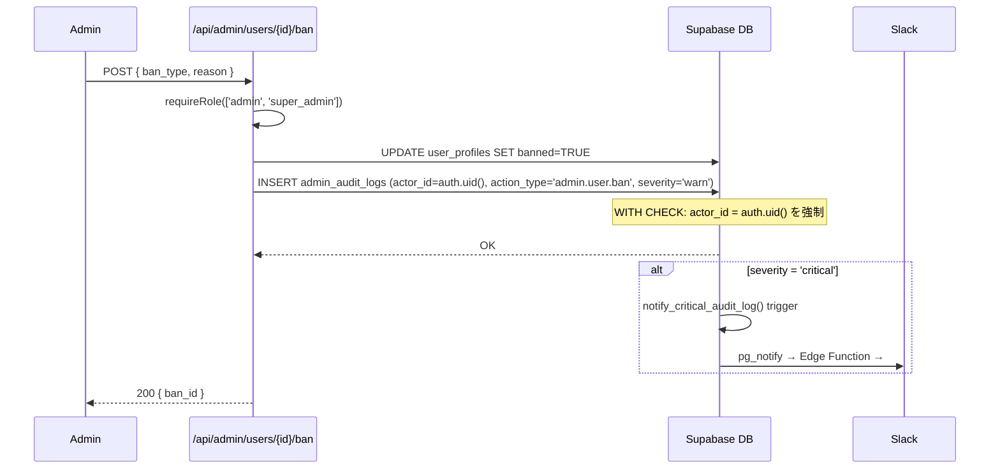

# operator/ 監査・モニタリング設計

## 1. 目的・スコープ

監査ログの不可逆設計・監査対象操作の網羅リスト・エラー監視と性能計測 (`app_logs` と Vercel Speed Insights。Sentry / Better Stack は採用しない)・インシデント管理フロー・死活監視 (Status Page は設置しない) を定義する。

### 1.1 採用状況 (オーナー決定 2026-10-08、#1179)

| 項目 | 採用状況 | 実態 |
|------|---------|------|
| エラー監視 | `app_logs` テーブル + `/super-admin/logs` | Sentry は採用しない。`@sentry/nextjs` は入れていない (§7) |
| 性能の計測 | Vercel Speed Insights のみ | `@vercel/speed-insights` を、送る URL から `?` 以降と招待トークンを消す部品 (`SpeedInsightsClient`) 経由で `src/app/layout.tsx` に置く。本番ではすでに有効とみられる (§7.3) |
| ログ集約 | `app_logs` テーブル | Better Stack (Logtail) は採用しない。`@logtail/node` は入れていない (§8) |
| Status Page | 設置しない | `status.homegohan.app` は作らない。死活監視用の `/api/health` は実装済み (§9) |

§8 のアラートルール、§9 の監視対象の表、§10.1 の手順のうち、Better Stack / Sentry / Status Page を前提にしていた部分は、
採用しないことが決まる前の記述で、実装の根拠にしない (各節に注記を置いた)。

## 2. 関連要件

- 要件 03 §5.3 F-OP-003 監査ログ
- 要件 03 §15.8 監査ログ対象操作の網羅リスト
- 要件 03 §15.9 監査ログ保持期間
- 要件 03 §22.9 Status Page (要件定義にはあるが、設置しないことをオーナーが決めた。§1.1)
- 100-scenarios.md F17, F18

## 3. admin_audit_logs DDL + RLS (不可逆)

### 3.1 テーブル定義 (最終版)

```sql
-- 既存テーブルへの ALTER (01-data-model.md で定義済み、ここは補足)
CREATE TABLE IF NOT EXISTS admin_audit_logs (
  id                      UUID PRIMARY KEY DEFAULT gen_random_uuid(),
  actor_id                UUID REFERENCES auth.users(id) ON DELETE SET NULL,
  -- GDPR 削除対応: actor が削除された場合 NULL にして履歴を保持
  -- 削除前スナップショット (削除後の参照用)
  actor_email_snapshot    VARCHAR(255),   -- 削除前の email を保持
  actor_role_snapshot     VARCHAR(50),    -- 削除前の主ロールを保持
  action_type             VARCHAR(100) NOT NULL,
  target_id               UUID,
  target_type             VARCHAR(30),
  details                 JSONB NOT NULL DEFAULT '{}',
  severity                VARCHAR(20) NOT NULL DEFAULT 'info'
    CHECK (severity IN ('info', 'warn', 'critical')),
  ip_address              INET,
  user_agent              TEXT,
  session_id              VARCHAR(255),
  impersonated_by         UUID REFERENCES auth.users(id) ON DELETE SET NULL,  -- 履歴用 (#1124: impersonate は提供しない。新しく書く処理は無い)
  created_at              TIMESTAMPTZ NOT NULL DEFAULT NOW()
);

-- インデックス
CREATE INDEX idx_audit_logs_actor ON admin_audit_logs(actor_id, created_at DESC);
CREATE INDEX idx_audit_logs_action ON admin_audit_logs(action_type, created_at DESC);
CREATE INDEX idx_audit_logs_target ON admin_audit_logs(target_id, created_at DESC);
CREATE INDEX idx_audit_logs_severity ON admin_audit_logs(severity, created_at DESC);
CREATE INDEX idx_audit_logs_created ON admin_audit_logs(created_at DESC);  -- 7年分のスキャン用
```

### 3.2 RLS ポリシー (不可逆性の保証)

```sql
ALTER TABLE admin_audit_logs ENABLE ROW LEVEL SECURITY;

-- =========================================
-- SELECT: super_admin のみ
-- (admin が自分の操作を消せない設計)
-- (support / sales / finance も閲覧不可 — 事案調査は super_admin に依頼)
-- =========================================
CREATE POLICY "audit_logs_select_super_admin" ON admin_audit_logs
  FOR SELECT USING (
    EXISTS (
      SELECT 1 FROM user_profiles
      WHERE id = auth.uid() AND 'super_admin' = ANY(roles)
    )
  );

-- =========================================
-- INSERT: admin 系全ロールから可
-- WITH CHECK で actor_id = auth.uid() を強制
-- (他の admin のログを偽装して INSERT できない)
-- =========================================
CREATE POLICY "audit_logs_insert_admins" ON admin_audit_logs
  FOR INSERT WITH CHECK (
    actor_id = auth.uid()
    AND EXISTS (
      SELECT 1 FROM user_profiles
      WHERE id = auth.uid()
        AND ARRAY['admin','super_admin','support','sales','finance','content_moderator']::TEXT[]
            && roles
    )
  );

-- =========================================
-- UPDATE: 完全禁止 (不可逆性)
-- =========================================
CREATE POLICY "audit_logs_no_update" ON admin_audit_logs
  FOR UPDATE USING (false);

-- =========================================
-- DELETE: 完全禁止 (不可逆性)
-- =========================================
CREATE POLICY "audit_logs_no_delete" ON admin_audit_logs
  FOR DELETE USING (false);

-- コメント
COMMENT ON TABLE admin_audit_logs IS
  '監査ログ。RLS で UPDATE/DELETE 完全禁止。SELECT は super_admin のみ。7年保管 (個人情報保護法/SOC2)';
COMMENT ON COLUMN admin_audit_logs.impersonated_by IS
  '履歴用 (#1124: impersonate は提供しない)。過去に super_admin が別ユーザーとして操作した行にだけ、super_admin の user_id が入っている';
COMMENT ON POLICY "audit_logs_insert_admins" ON admin_audit_logs IS
  'actor_id = auth.uid() を WITH CHECK で強制することで、他人のログを偽装できない';
```

**注 (#1124)**: なりすまし (impersonate) は提供しない。`impersonated_by` 列は、過去に書かれた行 (`action_type = 'impersonate'` の行) の履歴として残し、
新しく書き込む処理は無い。監査ログは UPDATE / DELETE 不可なので、過去の行 (`details.impersonation_token` を含む) もそのまま残る。
このトークンは、どこでも受け付けない値なので使い道が無い (検証する側が無かった)。

## 4. 監査対象操作の網羅リスト (§15.8)

**注 (#1124)**: なりすまし (impersonate) は提供しないため、`admin.user.impersonate` / `admin.user.impersonate_end` / `super_admin.impersonate` は一覧から外した。
以前の実装は `action_type = 'impersonate'` で記録していた (この一覧の名前とは違う)。終了用の `'impersonate_end'` を書く関数もあったが、呼び出す箇所は無かった。
過去に `'impersonate'` で書かれた行は、監査ログなので残る。

### 4.1 admin 系操作

```
admin.user.ban                      - ユーザー BAN
admin.user.unban                    - BAN 解除
admin.user.role_change              - ロール変更
admin.user.note_add                 - 管理ノート追加
admin.organization.create           - 組織作成
admin.organization.suspend          - 組織停止
admin.organization.restore          - 組織復旧
admin.organization.delete           - 組織削除
admin.organization.plan_change      - 組織プラン変更 (手動)
admin.coupon.create                 - クーポン作成
admin.coupon.pause                  - クーポン一時停止
admin.coupon.activate               - クーポン有効化
admin.coupon.retroactive_apply      - 遡及適用 (super_admin 承認)
admin.refund.issue                  - 返金指示 (Stripe Dashboard 誘導)
admin.export.request                - データエクスポート要求
admin.notification.campaign_send    - 通知キャンペーン送信
admin.moderation.resolve            - モデレーション解決
admin.announcement.create           - お知らせ作成
admin.announcement.delete           - お知らせ削除
admin.support.ticket_assign         - チケット担当者変更
admin.inquiry.update                - 問い合わせのステータス・管理者メモ更新 (PATCH / PUT /api/admin/inquiries/{id})。更新後の本文を返すので、変更が無い更新も記録する
                                      (details: inquiry_id / status_from / status_to / admin_notes_changed / changed。メモの中身は入れない。対象は 4.1.1 と同じ)
```

#### 4.1.1 ユーザー PII 閲覧系操作 (#1200)

運営側がユーザーの個人情報を **閲覧** したことも記録する。開示請求のときに「誰が・いつ・誰の情報を見たか」に答えるため。
実装は `src/lib/admin/audit.ts` の `recordAdminAudit()`。

```
admin.user.view                     - 管理コンソールでのユーザー詳細閲覧 (GET /api/admin/users/{id})
admin.user.view_support             - サポートコンソールでのユーザー詳細閲覧 (GET /api/support/users/{id})
admin.user.view_notes               - サポートコンソールでの管理ノート閲覧 (GET /api/support/users/{id}/notes)
admin.support.ticket.view           - チケット詳細 (件名・メッセージ本文) の閲覧 (GET /api/admin/support/tickets/{id})
admin.support.ticket.view_messages  - チケットのメッセージ一覧の閲覧 (GET /api/admin/support/tickets/{id}/messages)
admin.inquiry.view                  - 問い合わせ詳細 (本文・管理者メモ) の閲覧 (GET /api/admin/inquiries/{id})。一覧は概要 (件名・連絡先・状態) だけなので記録しない
```

記録のルール:
- `target_id` は **情報を見られた本人 (ユーザー)** の id、`target_type` は `'user'`。チケットの閲覧も、チケットではなくチケットを作ったユーザーを対象にする。
  こうすると、開示請求のときに `target_id = 本人` で全ての閲覧をまとめて引ける。チケット ID は `details.ticket_id` に入れる。
  問い合わせ (`admin.inquiry.view` / `admin.inquiry.update`) も同じで、会員の問い合わせは `inquiries.user_id` の本人を対象にし、問い合わせ ID は `details.inquiry_id` に入れる。
  ゲストの問い合わせ (`user_id` なし。会員が退会して外れたものを含む) には本人の id が無いので、`target_type = 'inquiry'` で問い合わせ自体の id を対象にする。
- `details` には **閲覧した項目名だけ** を入れる (`viewed_fields`)。ニックネーム・メール・本文などの値は入れない。
- `severity` は `info`。情報を実際に返したときだけ記録する (404 / 401 / 403 / 0 件のときは記録しない)。
- `ip_address` は `x-forwarded-for` の先頭 1 IP を検証して入れる (inet 列のため、複数 IP や不正値をそのまま渡すと INSERT が失敗する)。`user_agent` も保存する。
- 閲覧の記録は **fail-open**: 記録に失敗しても閲覧は止めず、失敗は db-logger (`app_logs`) に error で残す。
  「記録できないなら実行しない」べき操作 (返金など) は、`recordAdminAudit()` の戻り値 `ok` を見て呼び出し側で止める。

#### 4.1.2 返金の記録 (#1185)

このアプリは返金を実行しない。担当者が Stripe ダッシュボードで返金する **前に**、`POST /api/admin/finance/refunds`
(実装: `src/app/api/admin/finance/refunds/route.ts`) で `admin.refund.issue` を 1 行記録する。API の仕様は `02-api-spec.md` §9。

記録のルール:
- `target_id` は **返金されるユーザー** の id、`target_type` は `'user'` (4.1.1 と同じく、`target_id = 本人` で本人に関わる操作をまとめて引ける)。
- `severity` は `warn`。`details` は `{ amount, currency, reason, stripe_charge_id, stripe_invoice_id }`
  (`amount` は Stripe と同じ最小通貨単位の整数。JPY は円そのもの。使わない側の Stripe ID は `null`)。
- 4.1.1 と違い **fail-closed**: 記録できなかったら 500 を返し、Stripe ダッシュボードへのリンクは返さない
  (監査ログの残らない返金を作らない)。失敗は `recordAdminAudit()` が db-logger (`app_logs`) に error で残す。
- 記録は本人のセッションの client (RLS 有効) で行い、`actor_id` には `requireRole` が返した本人の id を渡す。
  `finance` には `audit_logs_insert_admins` だけが効き、`actor_id = auth.uid()` と運営ロールを DB 側でも強制する
  (`admin` / `super_admin` / `support` には `actor_id` を検査しない旧ポリシー "Admins can create audit logs" も効くため、`actor_id` はアプリ側で必ず本人にする)。
  `finance` ロールは `admin_audit_logs` を SELECT できないため、INSERT した行を読み戻してはいけない。
- 2 名承認 (`finance.refund.approve`) と、Stripe の `charge.refunded` Webhook との突き合わせは Stripe 連携 (#1125) 側で後続。

### 4.2 super_admin 系操作

```
super_admin.plan.create             - プラン作成
super_admin.plan.update             - プラン更新
super_admin.plan.publish            - プラン公開
super_admin.plan.unpublish          - プラン非公開
super_admin.plan.deprecate          - プラン廃止 (severity=critical)
super_admin.plan.un_deprecate       - 廃止ロールバック (severity=critical)
super_admin.plan.price_change       - 価格変更
super_admin.feature_package.create  - 機能パッケージ作成
super_admin.feature_package.update  - 機能パッケージ更新
super_admin.feature_package.delete  - 機能パッケージ削除
super_admin.feature_flag.toggle     - 機能フラグ切替
super_admin.feature_flag.rollout    - ロールアウト戦略変更
super_admin.cron.run_now            - cron 手動実行
super_admin.cron.pause              - cron 一時停止
super_admin.organization.transfer_admin - org_admin 緊急転送
super_admin.gdpr_delete.execute     - GDPR 削除実行
super_admin.llm_quota.override      - LLM クォータ手動変更
super_admin.setting.change          - システム設定変更
```

### 4.3 finance 系操作

```
finance.invoice.generate            - 請求書生成
finance.invoice.regenerate          - 請求書再生成
finance.invoice.cancel              - 請求書キャンセル
finance.invoice.resend              - 請求書再送
finance.refund.approve              - 返金承認
finance.stripe_reconcile.manual     - 手動 reconcile 実行
```

### 4.4 support 系操作

```
support.ticket.escalate             - エスカレーション
support.ticket.close                - チケット close
support.user.password_reset         - パスワードリセット実行
support.user.email_resend           - 確認メール再送
```

### 4.5 システム自動操作

```
system.payment.failed               - 支払失敗 (Stripe webhook)
system.stripe.chargeback            - チャージバック発生 (severity=critical)
system.stripe.reconcile_discrepancy - reconcile 不一致検出
system.plan.auto_expire             - プラン自動期限切れ
system.gdpr_delete.batch            - GDPR 削除バッチ実行
system.ban.auto                     - 自動 BAN (不正検知)
```

### 4.6 監査ログ INSERT ヘルパー

```typescript
// src/lib/audit/log.ts
import { createSupabaseServiceClient } from '@/lib/supabase/service';

interface AuditLogParams {
  actorId: string;
  actionType: string;
  targetId?: string;
  targetType?: string;
  details?: Record<string, unknown>;
  severity?: 'info' | 'warn' | 'critical';
  ipAddress?: string;
}

export async function insertAuditLog(params: AuditLogParams): Promise<void> {
  const supabase = createSupabaseServiceClient();  // service_role で RLS バイパス (INSERT のみ)

  // actor の email / roles をスナップショットとして取得 (GDPR 削除後も逆引き可能にする)
  let actorEmailSnapshot: string | null = null;
  let actorRoleSnapshot: string | null = null;
  if (params.actorId) {
    const { data: authUser } = await supabase.auth.admin.getUserById(params.actorId);
    actorEmailSnapshot = authUser?.user?.email ?? null;

    const { data: profile } = await supabase
      .from('user_profiles')
      .select('roles')
      .eq('id', params.actorId)
      .single();
    actorRoleSnapshot = (profile?.roles ?? []).join(',') || null;
  }

  await supabase.from('admin_audit_logs').insert({
    actor_id: params.actorId,
    actor_email_snapshot: actorEmailSnapshot,
    actor_role_snapshot: actorRoleSnapshot,
    action_type: params.actionType,
    target_id: params.targetId ?? null,
    target_type: params.targetType ?? null,
    details: params.details ?? {},
    severity: params.severity ?? 'info',
    ip_address: params.ipAddress ?? null,
  });
  // エラーは握り潰さず、呼び出し元にスローする (監査ログ失敗は操作を中断させる)
}
```

**注意**:
- `actor_id` は RLS の WITH CHECK で `auth.uid()` と一致することを強制するが、`service_role` を使う場合は RLS をバイパスするため、アプリ層で `actorId = await getCurrentUserId()` を必ず取得して渡すこと。
- `actor_email_snapshot` / `actor_role_snapshot` は GDPR 削除により `actor_id` が NULL になった後も actor を特定するために使用する。これらはスナップショット列であり、後から変更されない。

## 5. 7 年保管とアーカイブ

### 5.1 保持期間一覧

| テーブル | 保持期間 | 根拠 | アーカイブ先 |
|---------|---------|------|------------|
| `admin_audit_logs` | 7 年 | 個人情報保護法、SOC2 | Supabase → S3 Glacier (1 年経過後) |
| `org_license_audit_log` | 7 年 | 法人契約監査要件 | 同上 |
| `org_health_access_logs` | 10 年 | 産業医記録、医療法 | 同上 |
| `family_activity_log` | 3 年 | プライバシーバランス | 同上 |
| `gdpr_deletion_requests` | 永久 | 削除証明 | アーカイブしない |

### 5.2 アーカイブジョブ (pg_cron 月次)

```sql
-- 1 年経過した admin_audit_logs を Cold Storage 用テーブルに移動
-- 実際の S3 転送は Vercel Cron が担当
SELECT cron.schedule(
  'audit-log-archive',
  '0 3 1 * *',  -- 毎月1日 03:00 UTC
  $$
  -- 1 年超のログを archive テーブルに移動
  WITH moved AS (
    DELETE FROM admin_audit_logs
    WHERE created_at < NOW() - INTERVAL '1 year'
    RETURNING *
  )
  INSERT INTO admin_audit_logs_archive SELECT * FROM moved;
  $$
);
```

```sql
CREATE TABLE admin_audit_logs_archive (LIKE admin_audit_logs INCLUDING ALL);
-- archive テーブルは RLS 同様、UPDATE/DELETE 禁止
ALTER TABLE admin_audit_logs_archive ENABLE ROW LEVEL SECURITY;
CREATE POLICY "archive_no_update" ON admin_audit_logs_archive FOR UPDATE USING (false);
CREATE POLICY "archive_no_delete" ON admin_audit_logs_archive FOR DELETE USING (false);
```

## 6. アラート設定

### 6.1 連続失敗アラート

```typescript
// src/lib/monitoring/audit-alerts.ts

// 同一 admin による短時間での大量 BAN (異常操作の検知)
export async function checkBulkBanAnomaly(actorId: string): Promise<void> {
  const { count } = await supabase
    .from('admin_audit_logs')
    .select('*', { count: 'exact' })
    .eq('actor_id', actorId)
    .eq('action_type', 'admin.user.ban')
    .gte('created_at', new Date(Date.now() - 60 * 60 * 1000).toISOString()); // 1時間以内

  if ((count ?? 0) > 50) {
    await notifySlack({
      channel: '#security-alert',
      message: `⚠️ 異常 BAN 操作: actor_id=${actorId} が1時間以内に ${count} 件 BAN`,
    });
  }
}
```

### 6.2 severity='critical' の即時通知

`admin_audit_logs` に severity='critical' が INSERT された場合:

```sql
-- Supabase DB trigger (critical ログ検出)
CREATE OR REPLACE FUNCTION notify_critical_audit_log()
RETURNS TRIGGER AS $$
BEGIN
  IF NEW.severity = 'critical' THEN
    PERFORM pg_notify('critical_audit_log', row_to_json(NEW)::text);
  END IF;
  RETURN NEW;
END;
$$ LANGUAGE plpgsql;

CREATE TRIGGER audit_log_critical_notify
  AFTER INSERT ON admin_audit_logs
  FOR EACH ROW EXECUTE FUNCTION notify_critical_audit_log();
```

Edge Function が `pg_notify` をリッスンして Slack #incident に即時通知。

## 7. エラー監視と性能計測 (Sentry は採用しない)

### 7.1 方針

オーナー決定 (2026-10-08、#1179): Sentry は採用しない。`@sentry/nextjs` は入れておらず (`package.json` に無い)、
`Sentry.captureException` などを呼ぶコードも作らない。旧案にあった Sentry 連携のコード例
(`setSentryAdminContext`・`captureException`・`startTransaction`) は削除した。
エラーの記録・閲覧と性能の計測は、次で足りる。

| 目的 | 手段 |
|------|------|
| エラー・警告の記録 | `app_logs` テーブルへ構造化ログを書く。Next.js は `src/lib/db-logger.ts`、Edge Functions は `supabase/functions/_shared/db-logger.ts`。新規のエンドポイント・Edge Function は必ずこれを通す。ブラウザ側のログは `/api/log` 経由で同じテーブルに入る |
| エラーの閲覧 | `/super-admin/logs` (運用ログ画面) で `app_logs` を見る |
| 性能の計測 (Web Vitals) | Vercel Speed Insights (§7.3) |

### 7.2 重大エラーの記録

重大エラーは `error` レベルで `app_logs` に残す。管理者の操作に関わるものは、`app_logs` とは別に `admin_audit_logs` (§3-4) にも
記録する (運用ログと監査ログは用途が違う。混同しない)。

```typescript
import { createLogger } from '@/lib/db-logger';

const logger = createLogger('stripe-webhook');
logger.error('payment_failed を処理できなかった', error, {
  stripe_event_id: eventId,
  action_type: 'payment_failed',
});
```

### 7.3 Vercel Speed Insights (性能の計測)

- パッケージ: `@vercel/speed-insights` (`package.json` の dependencies)。
- 読み込み: `src/app/layout.tsx` の `<body>` の中に `<SpeedInsightsClient />` (`src/components/SpeedInsightsClient.tsx`) を 1 つだけ置く。画面には何も描画しない。
  `SpeedInsightsClient` は `'use client'` の小さな部品で、`@vercel/speed-insights/next` の `<SpeedInsights />` に `beforeSend` を渡す。
  `beforeSend` は関数なので、サーバーコンポーネントの `layout.tsx` からは渡せない。`<SpeedInsights />` を、この部品を通さずに置かない
  (理由は下の「URL に含まれる情報」。`tests/speed-insights-scrub-1179.test.ts` が、`src` の中で読み込むのはこの部品だけであることを検査する)。
- 計測するもの: Web Vitals (LCP / INP / CLS など) だけ。エラーの記録はしない (§7.1 の `app_logs` が担う)。
- 有効化の状態: **本番ではすでに有効とみられ、このコードをデプロイした時点から、全ページで計測が始まる。** ダッシュボードで有効にするのを待つ関門は無い。
  2026-10-08 に、本番 (`homegohan-app.vercel.app`) へ GET だけで確かめた (計測値の POST はしていない)。
  - `/_vercel/speed-insights/script.js` は 200 で JavaScript を返す。アプリのミドルウェアを通らず、Vercel が先に応答している。
  - 有効にしていない `/_vercel/insights/script.js` や、存在しない `/_vercel/speed-insights/nonexistent-check.js` は、アプリのミドルウェアに届いて `/login` への 307 になる。

  ダッシュボードの実際の状態 (有効か、いつから有効か) は、デプロイの前にオーナーが確かめる。計測を止めたいときは、ダッシュボードで Speed Insights を無効にする (コードを変えずに止まる)。
- 配信と CSP: スクリプトも計測値の送信先も、同じオリジンのパス。設定が無いときの既定値は `/_vercel/speed-insights/script.js` と `/_vercel/speed-insights/vitals`。
  有効にしたプロジェクトのビルドでは、Vercel が `NEXT_PUBLIC_VERCEL_OBSERVABILITY_CLIENT_CONFIG` を渡し、その中の `speedInsights.scriptSrc` / `endpoint`
  (`/<固有のパス>/script.js` / `/<固有のパス>/vitals` の形) が優先される。どちらも同じオリジンなので、CSP (`next.config.mjs`) の `script-src` / `connect-src` の
  `'self'` で足り、CSP は変えていない。読み込み先と `'self'` は `tests/speed-insights-1179.test.tsx` が検査する (設定が無いときの既定値と、設定が渡ったときの両方)。
  実際の送信先は検査できないので、デプロイ後に、ブラウザの開発者ツールで `script[data-sdkn]` の `src` と計測値の送信先を見て、
  未ログインでも 2xx になること、コンソールに CSP 違反が出ていないことを確かめる。
- 認証ミドルウェア: `src/middleware.ts` の matcher は `/_vercel/` 以下を対象から外してある (`tests/speed-insights-middleware-1179.test.ts`)。
  Vercel 上で有効にした機能のパスは、上のとおり Vercel がミドルウェアより前に応答するので、この除外が Vercel 上の計測を守っているわけではない。
  効くのは、Vercel が応答しないとき (有効にしていない機能、存在しないパス、`next start` で Vercel の外に置いたとき) に、
  `/_vercel/*` の応答が `/login` の HTML にすり替わるのを防ぐ場面。害は無いので残している。
- 料金と間引き: 計測するデータの数に応じて Vercel の料金が増えることがある。抑えたいときは `SpeedInsightsClient` の `<SpeedInsights … />` に
  `sampleRate={0.5}` のように渡して間引ける (既定は全件)。
- 外部送信の表示: 計測データは Vercel へ送られる。プライバシーポリシーなどへの表示が要るかは、弁護士の確認 (T30) を待って決める (未確認)。
- URL に含まれる情報: 計測値にはページの URL も載る。Vercel が配るスクリプトは、`location.href` (`?` 以降と `#` 以降を含む URL 全体) をそのまま送る
  (パッケージが `data-path` を付けないため)。このアプリには、URL に個人情報や招待用の値が入るページがある。
  - 招待先のメールアドレス: `/login?redirect=/invite/<token>&email=…`・`/signup?redirect=…&email=…`・`/auth/verify?email=…`
  - パスに入る招待トークン: `/invite/[token]`・`/family/promotions/[token]`

  本番はすでに有効とみられるので、対策なしで出すと、デプロイした時点から、これらが URL ごと Vercel へ送られる。
  そこで `beforeSend` (`scrubSpeedInsightsEvent`、`src/lib/speed-insights-scrub.ts`) で、送る前に URL を直す。
  - `?` 以降、`#` 以降、ユーザー名、パスワードを消す。オリジンとパスだけが残る。
  - `route` (動的セグメントを置き換えた形。例: `/invite/[token]`・`/meals/[id]`) があれば、パスはそれにする。トークンや ID が URL に残らない。
  - パスに招待トークンが入るページ (`/invite/…`・`/family/promotions/…`) は、送るパスが `…/[token]` の形に置き換わっているときだけ送る。
    `route` が無いとき、置き換えに失敗して生のトークンが残っているときは、計測値ごと送らない。
    配られるスクリプトは、`beforeSend` が返した `route` を使わず、元の `route` を送るので、直さずに落とす。
  - URL として読めないときも送らない。

  `beforeSend` の仕様 (計測値を送る直前に 1 件ずつ呼ばれる。null などを返すと送られない。返した `url` が送られる) は、
  配られるスクリプト (scriptVersion 0.1.3) を読んで確かめた。スクリプトは Vercel が更新できるので、デプロイ後に、実際の送信内容
  (開発者ツールの Network) で、`href` にクエリ・`#`・招待トークンが無いことを確かめる。
  `beforeSend` に渡す関数はモジュール直下に置き、参照を変えない (参照が変わるたびに、パッケージが登録し直す)。
  パスに秘密の値が入る `[token]` のページを足したら、`src/lib/speed-insights-scrub.ts` の `TOKEN_PATH_PREFIX` にも足す
  (`tests/speed-insights-scrub-1179.test.ts` が `src/app` を走査して検査する)。
  限界: 変わるのは、Speed Insights の計測値に載る URL だけ。計測の通信そのものに、ブラウザが付ける `Referer` ヘッダなどは残る
  (同じオリジンへの通信で、ページの取得や API と同じ扱い)。Vercel 側がそれを保存するかどうかは確認できていない。

## 8. Better Stack (Logtail) 統合 (採用しない)

オーナー決定 (2026-10-08、#1179): Better Stack は採用しない。`@logtail/node` は入れておらず、`BETTER_STACK_TOKEN` も使わない。
ログは `app_logs` に集める (§7.1)。旧案にあった `logger` ラッパーとログ出力例のコードは削除した。

### 8.1 旧案のアラートルール (未実装)

下の表は Better Stack で設定する予定だったもので、実現する手段がなくなったため実装されていない。
代わりが必要になったら、`app_logs` の集計などで改めて設計する (§16)。

| 条件 | アクション |
|-----|---------|
| `error` ログが 5 分間に 10 件超 | Slack #incident 通知 |
| `stripe.webhook` の processing_time > 5s | Slack #stripe-alerts |
| pg_cron ジョブ失敗 | Slack #cron-alerts |
| API p95 > 1000ms (3 分間継続) | Slack #performance |

### 8.2 アプリログ画面 (実装済み: #1157)

Better Stack は採用しない (上記)。代わりに、`app_logs` (db-logger が書く構造化ログ) を super_admin が画面で読める (§7.1)。

| 項目 | 内容 |
|-----|------|
| 画面 | `/super-admin/logs` (左メニュー「運用 > アプリログ」)。読み取り専用 |
| API | `GET /api/super-admin/logs`。権限は super_admin のみ (admin も不可)。`app_logs` の RLS は本人の行だけ読める (#1171) ため、`requireRole` を通したあとで service role の client を使う |
| 絞り込み | `level` / `source` / `function_name` / `user_id` / `request_id` (いずれも完全一致) と `from` / `to` (ISO 8601、両端を含む) |
| ページ送り | 新しい順 (`created_at`、同時刻は `id`)。`limit` は既定 50・最大 200。応答の `meta.next_cursor` を次回の `cursor` に渡す (OFFSET は使わない) |
| 表示 | 文面は保存されたまま表示する。秘密情報のマスクは書き込み時 (`supabase/functions/_shared/log-sanitizer.ts`: #1171 / #1287) |
| 索引 | `created_at` / `level` / `function_name` / `source` / `user_id`。`request_id` には索引が無く、単独で探すと全行を順に調べる |

しきい値を超えたときの通知 (メールなど) は含まない (§8.1 の旧案は未実装)。Sentry は採用しない (§7)。

## 9. Status Page (status.homegohan.app) は設置しない

オーナー決定 (2026-10-08、#1179): Status Page は設置しない。`status.homegohan.app` は作らず、Better Stack の Status Page 機能も使わない。
障害を利用者へ公開する画面は無いので、利用者への連絡は、影響の範囲に応じてメール / Push で個別に行う (§10.1)。
外部の死活監視サービス (UptimeRobot など) から見る URL は、次のとおり残す。

### 9.1 死活監視の対象

**監視コンポーネント** (表は旧案の Status Page 用のものをそのまま残す。どの監視サービスで見るかは、この文書では決めない。Better Stack は使わない):

| コンポーネント | 監視 URL / 方法 | 更新頻度 |
|-------------|--------------|--------|
| Web App | `https://homegohan.app/api/health` | 1 分 |
| Web App (画面) | `https://homegohan.app/login` | 1 分 |
| API (アプリ経由の DB 疎通) | `https://homegohan.app/api/health?deep=1` | 1 分 |
| Database (Supabase) | Supabase Uptime API | 1 分 |
| AI Chat (xAI) | `https://api.x.ai/v1/models` (HEAD) | 5 分 |
| AI Images (Gemini) | Google API Health | 5 分 |
| Email (Resend) | Resend Status API | 5 分 |
| Payments (Stripe) | Stripe Status API | 1 分 |

**`/api/health` について (#1181、実装: `src/app/api/health/route.ts`)**:

- 認証不要・個人情報なし・`Cache-Control: no-store`。HEAD にも同じステータスで応答する
  (UptimeRobot などは既定で HEAD)。判定は HTTP ステータスだけで足りる (200 = 正常)。
- `/api/health` は認証ミドルウェアを通さず、アプリが応答できるかだけを見る (DB には触れない)。
  画面側の不具合 (ミドルウェアや描画の故障) は拾えないため、`/login` も別に監視する。
- `/api/health?deep=1` は加えて DB (Supabase) に anon キーで 1 行読みに行き、届かない・2 秒を超えると 503 を返す。
  Supabase 側の障害だけでなく、アプリから DB に届かない状態 (鍵・権限・設定の不備) も拾える。
- 旧設計の `/api/auth/status` は実装せず廃止した。認証系の疎通は `?deep=1` と、
  `npm run test:smoke` の「未認証 API が 401」(500 ではない) の確認で代替する。
- 独自ドメインが確定するまでは、`https://homegohan.app` を実 URL の `https://homegohan-app.vercel.app` に読み替える。

### 9.2 インシデント記録フロー

Status Page が無いので、旧案の「Better Stack でインシデントを作成し、`status.homegohan.app` に表示する」流れは使わない。
記録は、§10.1 の Slack スレッドの作業ログと、§10.2 のポストモーテムで行う。

## 10. インシデント管理フロー

### 10.1 検知 → 対応フロー

```
Step 1: 検知
  - 自動: severity='critical' の監査ログ (§6.2) → Slack #incident
    (Better Stack / Sentry のアラートは採用しないため無い。エラー急増の自動検知は未実装で、§8.1 の旧案のまま)
  - 手動: ユーザー報告 → support チケット → admin が確認

Step 2: トリアージ (5 分以内)
  - インシデントリーダーを指名 (on-call)
  - 影響範囲を特定 (どのサービス / 何人のユーザーに影響)
  - 重要度を分類:
    P0: サービス全停止 (30 分以内に対応)
    P1: 主要機能停止 (2 時間以内に対応)
    P2: 部分的な機能低下 (翌営業日まで)
    P3: 軽微な問題 (計画的に対応)

Step 3: 通知 (P0/P1 は即時)
  - (Status Page は設置しない。利用者への連絡は、影響の範囲に応じてメール / Push で個別に行う)
  - Slack #incident に状況共有
  - Org Pro/Enterprise 顧客には直接メール通知

Step 4: 対応
  - Slack スレッドで作業ログを記録
  - 5 分毎に進捗更新

Step 5: 復旧確認
  - smoke test 実施
  - (Status Page は設置しないので、更新するものは無い)
  - ユーザーへ復旧通知

Step 6: ポストモーテム (P0/P1 は 48 時間以内)
  - 以下のテンプレートを使用
```

### 10.2 ポストモーテムテンプレート

```markdown
# インシデントポストモーテム: [タイトル]

**日時**: YYYY-MM-DD HH:MM JST
**重要度**: P0 / P1 / P2
**影響時間**: N 分
**影響ユーザー数**: N 人

## タイムライン

| 時刻 | イベント |
|-----|---------|
| HH:MM | 最初の検知 |
| HH:MM | 原因特定 |
| HH:MM | 対応開始 |
| HH:MM | 復旧確認 |

## 根本原因

[1-2 段落で根本原因を記述]

## 影響

- 機能停止: [具体的な機能]
- 影響ユーザー: [数]
- データ損失: [あり/なし]

## 対応内容

[実施した対応の詳細]

## 再発防止策

| アクション | 担当者 | 期限 |
|----------|--------|------|
| [具体的な作業] | [名前] | YYYY-MM-DD |

## 学んだこと

[チーム全体で共有すべき教訓]
```

## 11. シーケンス — 監査ログ記録フロー


```mermaid
sequenceDiagram
  participant Admin
  participant API as /api/admin/users/{id}/ban
  participant DB as Supabase DB
  participant Slack

  Admin->>API: POST { ban_type, reason }
  API->>API: requireRole(['admin', 'super_admin'])
  API->>DB: UPDATE user_profiles SET banned=TRUE
  API->>DB: INSERT admin_audit_logs (actor_id=auth.uid(), action_type='admin.user.ban', severity='warn')
  Note over DB: WITH CHECK: actor_id = auth.uid() を強制
  DB-->>API: OK

  alt severity = 'critical'
    DB->>DB: notify_critical_audit_log() trigger
    DB->>Slack: pg_notify → Edge Function → #incident
  end

  API-->>Admin: 200 { ban_id }
```

## 12. エラーハンドリング

| シナリオ | 対処 |
|---------|------|
| 監査ログ INSERT 失敗 | 操作自体をロールバック (監査ログなしの破壊的操作は禁止) |
| `app_logs` への記録失敗 | 握りつぶす (`console.error` に出すだけで、業務の処理は止めない。`src/lib/db-logger.ts` の `saveLog`) |
| Slack 通知失敗 | `app_logs` に warn で記録 |

## 13. テスト方針

主要テストケース:

1. `it('rejects UPDATE on admin_audit_logs via audit_logs_no_update policy')`
2. `it('rejects DELETE on admin_audit_logs via audit_logs_no_delete policy')`
3. `it('rejects INSERT when actor_id does not match auth.uid()')`
4. `it('returns 0 rows when admin role (non-super_admin) selects audit_logs')`
5. `it('super_admin can SELECT all audit_logs')`
6. `it('E2E: BAN action creates audit_log entry visible to super_admin')`
7. `it('writes an error row to app_logs when an API route handles an unexpected exception')`
8. `it('Slack alert is sent when error rate exceeds 1% threshold')` (未実装: Better Stack を採用しないため、エラー率のアラートは §8.1 の旧案のまま)

```typescript
// tests/integration/operator/audit-log-rls.integration.test.ts
import { describe, it, expect, beforeAll } from 'vitest';
import { createClient } from '@supabase/supabase-js';
import { signInAsUser } from '../../helpers/auth';

const supabaseAdmin = createClient(
  process.env.SUPABASE_URL!,
  process.env.SUPABASE_SERVICE_ROLE_KEY!,
);

describe('admin_audit_logs RLS ポリシー', () => {
  let superAdminToken: string;
  let adminToken: string;
  let testLogId: string;

  beforeAll(async () => {
    superAdminToken = await signInAsUser('super@test.local');
    adminToken = await signInAsUser('admin@test.local');

    // テスト用の監査ログを service_role で INSERT
    const { data } = await supabaseAdmin
      .from('admin_audit_logs')
      .insert({
        actor_id: faker.string.uuid(),
        action_type: 'test_action',
        target_type: 'user',
        target_id: faker.string.uuid(),
        severity: 'info',
      })
      .select()
      .single();
    testLogId = data!.id;
  });

  it('rejects UPDATE on admin_audit_logs (audit_logs_no_update policy)', async () => {
    const superClient = createClient(
      process.env.SUPABASE_URL!,
      process.env.SUPABASE_ANON_KEY!,
      { global: { headers: { Authorization: `Bearer ${superAdminToken}` } } },
    );
    const { error } = await superClient
      .from('admin_audit_logs')
      .update({ action_type: '改ざん試行' } as never)
      .eq('id', testLogId);
    expect(error).not.toBeNull();
  });

  it('rejects DELETE on admin_audit_logs (audit_logs_no_delete policy)', async () => {
    const superClient = createClient(
      process.env.SUPABASE_URL!,
      process.env.SUPABASE_ANON_KEY!,
      { global: { headers: { Authorization: `Bearer ${superAdminToken}` } } },
    );
    const { error } = await superClient
      .from('admin_audit_logs')
      .delete()
      .eq('id', testLogId);
    expect(error).not.toBeNull();
  });

  it('returns 0 rows when admin role (non-super_admin) selects audit_logs', async () => {
    const adminClient = createClient(
      process.env.SUPABASE_URL!,
      process.env.SUPABASE_ANON_KEY!,
      { global: { headers: { Authorization: `Bearer ${adminToken}` } } },
    );
    const { data, error } = await adminClient
      .from('admin_audit_logs')
      .select('id');
    expect(error).toBeNull();
    expect(data).toHaveLength(0); // admin は super_admin 専用ログを閲覧不可
  });

  it('super_admin can SELECT all audit_logs', async () => {
    const superClient = createClient(
      process.env.SUPABASE_URL!,
      process.env.SUPABASE_ANON_KEY!,
      { global: { headers: { Authorization: `Bearer ${superAdminToken}` } } },
    );
    const { data, error } = await superClient
      .from('admin_audit_logs')
      .select('id')
      .eq('id', testLogId);
    expect(error).toBeNull();
    expect(data!.length).toBeGreaterThanOrEqual(1);
  });

  it('rejects INSERT when actor_id does not match auth.uid()', async () => {
    const adminClient = createClient(
      process.env.SUPABASE_URL!,
      process.env.SUPABASE_ANON_KEY!,
      { global: { headers: { Authorization: `Bearer ${adminToken}` } } },
    );
    // actor_id を別ユーザーの UUID に偽装して INSERT 試行
    const { error } = await adminClient.from('admin_audit_logs').insert({
      actor_id: faker.string.uuid(), // 現在の auth.uid() と不一致
      action_type: 'fake_action',
      target_type: 'user',
      target_id: faker.string.uuid(),
      severity: 'info',
    });
    expect(error).not.toBeNull(); // WITH CHECK 違反
  });
});

// tests/e2e/operator/operator-ban-audit-log.spec.ts
test('BAN action creates audit_log entry visible to super_admin', async ({
  page,
}) => {
  await page.goto('/operator/users');
  const targetRow = page.locator('[data-testid=user-row]').first();
  const targetUserId = await targetRow.getAttribute('data-user-id');

  await targetRow.locator('[data-testid=ban-user-button]').click();
  await page.click('[data-testid=confirm-ban-button]');
  await expect(
    page.locator('[data-testid=ban-success-toast]'),
  ).toBeVisible();

  // 監査ログページで確認
  await page.goto('/operator/audit-logs');
  const latestLog = page.locator('[data-testid=audit-log-entry]').first();
  await expect(latestLog).toContainText('user_ban');
  await expect(latestLog).toContainText(targetUserId ?? '');
});
```

## 14. 既存実装との関連

- `admin_audit_logs`: 既存テーブルあり、ALTER で拡張
- Sentry: 採用しない (#1179)。`@sentry/nextjs` は入れていない (`package.json` に無い)。以前ここに書いていた「既存インストール済み」は誤りだった
- Better Stack: 採用しない (#1179)。`@logtail/node` は入れない
- Status Page: 設置しない (#1179)。`status.homegohan.app` は作らない
- エラー監視: `app_logs` (`src/lib/db-logger.ts` / `supabase/functions/_shared/db-logger.ts`) と `/super-admin/logs`
- 性能の計測: Vercel Speed Insights (`@vercel/speed-insights`。`src/app/layout.tsx` から `src/components/SpeedInsightsClient.tsx` 経由で置く)

## 15. プロダクト Analytics イベント (PostHog) 【不採用】

> **【不採用】オーナー判断 (2026-10-08, #1166)**: PostHog による利用状況の計測は採用しない。
> 本節 (§15.1〜§15.10) は 2026-05-08 時点の旧設計で、**実装の根拠にしない**。経緯の記録として残している。
>
> - コードからは、PostHog の SDK (`posthog-js` / `posthog-react-native`)、初期化コード、`PostHogProvider`、CSP の送信先許可、環境変数 (`NEXT_PUBLIC_POSTHOG_KEY` / `NEXT_PUBLIC_POSTHOG_HOST` / `EXPO_PUBLIC_POSTHOG_KEY` / `EXPO_PUBLIC_POSTHOG_HOST`) の読み取りと設定例を取り除いた。再び import すると `tests/posthog-not-adopted-contract.test.ts` が落ちる。Vercel・EAS に入っている値の削除と、PostHog 側のキーの失効はオーナー作業 (`docs/operations/posthog-dashboard.md` の「後始末」)。
> - モバイルの ErrorBoundary (#1207) が PostHog へ送っていた `app_error_boundary` (§15.3.1) も、送らなくなった。例外の記録は、コンソールとサーバーログ (`app_logs`) だけ。
> - モバイルの異常の通知 (#1038 / #1405) も PostHog 専用だったので、送り先をなくした。push token の登録失敗・削除失敗・削除が 0 件
>   (`push_token_registration_failed` / `push_token_unregister_failed` / `push_token_unregister_no_rows`) と、セッション保管庫の異常 (`secure_session_storage_issue`)。
>   今は端末のコンソール (`console.warn`) に出すだけで、サーバーログ (`app_logs`) には残らない。残したいときは別に設計する
>   (セッション保管庫の異常は、アクセストークンを取る `getSession()` がその保管庫を読むので、保管庫の中から API を呼べない)。
> - `packages/handson-tour-shared/src/analytics.ts` の `fireAnalytics` は残してあるが、送り先 (adapter) を誰も注入していないので何も送らない。イベント名・プロパティの定義 (§15.3〜§15.4) は、将来計測を足すときの出発点として残す。
> - §15.6 の KPI 集計と §15.8 のダッシュボード公開は PostHog 前提のため実施しない。運用手順 `docs/operations/posthog-dashboard.md` も同じく不採用。
> - `cookie_consents` テーブルは残す (migration は変えない)。同意バナーの扱い (cross/08 §12〜§13) は、この判断とは別に決める。
> - 利用状況の数字が必要になったときは、先に「何を・どこへ・どの同意で」送るかを決め直してから設計する。PostHog を戻す場合は、オーナーの判断を取り直す。

### 15.1 配信基盤の確定 (2026-05-08)

PostHog を採用(family/09 §99 §1.2 Q8 確定)。既存基盤なし、設計書 22-analytics.md §4 が既に PostHog 前提。

| 環境変数 | 用途 |
|---|---|
| `NEXT_PUBLIC_POSTHOG_KEY` | Web 公開鍵 |
| `NEXT_PUBLIC_POSTHOG_HOST` | Web 配信先 |
| `EXPO_PUBLIC_POSTHOG_KEY` | Mobile 公開鍵 |

導入物:
- Web: `posthog-js`
- Mobile: `posthog-react-native`

設定:
- `person_profiles: 'identified_only'`(認証ユーザーのみプロファイル化)
- `autocapture: false`(手動 capture のみ)
- `capture_pageview: false`(手動制御)
- `sanitize_properties` で PII フィルタ(§15.7)

`admin_audit_logs`(本ファイル §3-4)とは別系統。admin_audit_logs は破壊的・課金的・セキュリティ操作の監査ログ(7 年保管)、PostHog はプロダクト UX のイベント計測。混同しない。

### 15.2 Analytics ヘルパー実装

```
packages/handson-tour-shared/src/analytics.ts
```

`fireAnalytics<T>(eventName, payload)` ラッパーが PostHog SDK を抽象化。dev mode では Zod で payload schema を検証する。詳細は family/09 §22 §4 参照。

### 15.3 ハンズオンチュートリアル 10 イベント (canonical)

family/09 が新規追加するイベント。

| event_name | カテゴリ | 発火タイミング | 主要プロパティ |
|---|---|---|---|
| `handson_tour_eligible` | trigger | `/api/handson-tour/status` が `should_show=true` | `entry_source: 'auto'\|'settings_force'` |
| `handson_tour_started` | progression | Step 0 で【はじめる】タップ | `entry_source` |
| `handson_tour_step_viewed` | progression | 各 Step マウント | `step: 0..5`, `sub_step?: string` |
| `handson_tour_step_completed` | progression | 各 Step 進行 | `step`, `dwell_ms` |
| `handson_tour_skipped` | progression | スキップ動作(明示 / hard_back / auto-skip) | `step: -1..4`, `reason: 'user_action'\|'hard_back'\|'admin_role'\|'existing_user'\|'feature_disabled'\|'not_in_rollout'` |
| `handson_tour_completed` | completion | Step 4 卒業 API 成功 | `total_duration_ms`, `step_skipped_count`, `badge_awarded: 'tutorial_complete'`, `already_completed` |
| `handson_tour_step_error` | error | API エラー / mock 失敗 / 想定外状態 | `step`, `error_code`, `error_message` (max 500, PII 不可), `http_status?` |
| `handson_tour_force_replayed` | re-engagement | `/handson-tour?force=1` 再表示 | `previous_completed_at` |
| `web_vitals_lcp` / `web_vitals_cls` / `web_vitals_fid` | performance | Web Vitals 計測(Web のみ) | `value` / `value_ms`, `page` |

数えるとハンズオン固有 8 + Web Vitals 3 = 11 イベント、family/09 設計書では「10 イベント種類」と表記される(Web Vitals 3 種を「performance」で 1 グループ扱い)。本表では明示的に 11 行を canonical 化。

#### 15.3.1 アプリ共通のイベント (ハンズオン以外) 【送らなくなった (#1166)】

> **【送らなくなった】** モバイルの ErrorBoundary (#1207) は、当初この節のイベント `app_error_boundary` を PostHog へ送っていた。
> PostHog を採用しない判断 (#1166) に合わせて、`apps/mobile/src/lib/error-report.ts` から PostHog への送信をやめた。今は PostHog へ何も送らない。
> 画面の描画中の例外の記録として残っているのは、**コンソール (`console.error`) とサーバーログ (`POST /api/log` → `app_logs`) だけ**。
> 下の表と項目は、送っていたときの定義の記録で、実装の根拠にしない。

| event_name | カテゴリ | 発火タイミング | 主要プロパティ |
|---|---|---|---|
| `app_error_boundary` (送らない) | error | モバイルの ErrorBoundary が、画面の描画中の例外を受けた (#1207) | `boundary`, `platform`, `error_name?`, `error_fingerprint?` |

送っていたときは、§15.7 に従い **例外の文面 (`message`) もスタックも送らなかった**。PostHog は外部の計測サービスで、イベントがユーザー ID に紐づくうえ、§15.7 の PII フィルタはキー名しか見ず値の中身は除かないため。送っていたのは次の項目だけ。

- `boundary`: どの境界か (例: `root` / `tabs` / `org`)。画面遷移のパスではない
- `platform`: OS
- `error_name`: 例外の種類。`/^[A-Za-z0-9_$.]{1,64}$/` に合う識別子 (`TypeError` など) のときだけ付いた
- `error_fingerprint`: 種類と文面から作る指紋 (32 bit FNV-1a の 16 進 8 桁)。元に戻せず、同じ例外を数えるためだけに使う

今も残っているサーバーログ (`app_logs`) の `metadata` には、`app` (`mobile`) / `boundary` / `platform` / `name` / `message` (300 文字に切り詰め済み) / `stack` (1500 文字に切り詰め済み) / `fingerprint` が入る。`fingerprint` は上の `error_fingerprint` と同じ計算で、`app_logs` の上で同じ例外をまとめて数えるために使う。これらはサーバー側 (`sanitizeLogEntry`) で秘密情報をマスクして保存される (ログイン前の画面の例外は、`/api/log` が 401 で断るので残らない)。実装は `apps/mobile/src/lib/error-report.ts`。`apps/mobile/__tests__/lib/error-report.test.ts` が、送り先がサーバーログだけであることを確かめる。

### 15.4 共通プロパティ (全イベント)

```ts
const CommonPropertiesSchema = z.object({
  user_id: z.string().uuid(),
  timestamp: z.string().datetime(),
  platform: z.enum(['web', 'ios', 'android']),
  app_version: z.string().regex(/^\d+\.\d+\.\d+$/),
  session_id: z.string().uuid().optional(),
  trace_id: z.string().optional(),
});
```

各イベントの完全 Zod schema は family/09 §22 §2.3 参照。型定義は `packages/handson-tour-shared/src/analytics.ts` で `HandsonTourEventName` / `HandsonTourEventPayload<T>` として export。

### 15.5 user identify ポリシー

認証後 `posthog.identify(userId, props)` を呼ぶ。`props` に含めて良いのはコホート分析用の **PII でない** 属性のみ:

| 含めて良い | 含めない |
|---|---|
| `signup_at`(profile.created_at) | `nickname` |
| `platform`(`'web'`/`'ios'`/`'android'`) | `email` |
| `plan_key_cached`(粗いプラン区分) | `weight_kg` / `height_cm` / `age` / `gender` |
| | `allergies` / `dietary_preferences` / `nutrition_goal` |
| | `password` / JWT / session token |
| | GPS / 詳細 IP |

### 15.6 KPI 集計クエリ

PostHog Insights で実装。詳細 SQL は family/09 §22 §5(開始率 / 完了率 / 漏斗 / 7 日継続率 / 平均所要時間 / エラー率)を参照。本セクションは KPI 一覧のみ:

| KPI | 算出 | 目標値 |
|---|---|---|
| 開始率 | `started / signed_up` (30 日コホート) | (Phase 4 で確定) |
| 完了率 | `completed / started` (7 日窓) | 80% (family/09 §00 §6) |
| 平均所要時間 | `AVG(total_duration_ms)` | 90 秒前後 |
| Step 別離脱率 | 漏斗(`step_viewed: 0→4`) | 各ステップ 5% 以内 |
| 7 日継続率 | 完了群 vs スキップ群の `non-sandbox meal_logs` 7 日後存在率 | (Phase 4 で確定) |
| エラー率 | `step_error / step_viewed` 1 時間粒度 | < 1% |

### 15.7 PII フィルタ (cross/08-legal-compliance §13 連携)

```ts
sanitize_properties: (props) => {
  const FORBIDDEN_KEYS = [
    'nickname', 'email', 'phone', 'address',
    'weight_kg', 'height_cm', 'age', 'gender',
    'allergies', 'dietary_preferences', 'nutrition_goal',
    'password', 'jwt', 'token',
  ];
  for (const key of FORBIDDEN_KEYS) {
    if (key in props) delete props[key];
  }
  return props;
};
```

`error_message` は max 500 文字 + PII 含まない実装(個人名や食事名のような UGC は含めず、`'api_500'` `'network_timeout'` 等の error_code を主軸にする)。

### 15.8 ダッシュボード公開タイミング

- Phase 4(a11y + Analytics 実装)完了時に PostHog Insights ダッシュボード作成
- Phase 6(canary 段階公開)で本格モニタリング開始
- Looker Studio などへの転載は v2 検討

### 15.9 Cookie 同意との連携

cross/08-legal-compliance §13 に従い、`cookie_consents` テーブルで「計測 Cookie」の opt-in が取得されたユーザーのみ PostHog `init` を呼ぶ(Web)。同意取消し時は `posthog.opt_out_capturing()` を呼ぶ。Mobile は同様に EXPO_PUBLIC キーの初期化を遅延。

### 15.10 残不確実性

- [ ] sub_step の粒度(1.5 / 1.6 を全部送るか、step のみで十分か) — Phase 4 で決定
- [ ] event sampling(高頻度 event は 10% 等) — Phase 6 でコスト確認後
- [ ] PII フィルタの null チェック(nullable な PII フィールドの処理) — Phase 4 実装時
- [ ] Analytics 配信失敗時のリトライ(PostHog SDK 内蔵で十分か) — Phase 4 検証

## 16. 既存未解決事項

- 監査ログの 1 年後コールドストレージ移行: S3 Glacier への転送ジョブは別途実装 (Phase 3)
- PagerDuty 連携 (要件 §5.10.2 の将来): 現在は Slack のみ対応。PagerDuty は組織 Enterprise 契約時に検討
- `audit_logs_archive` テーブルへの移動でインデックスが再作成されるため、large scale 時のパフォーマンス確認が必要
- エラー急増・Stripe webhook の遅延・pg_cron の失敗・API p95 悪化の自動通知 (§8.1 の旧案): Better Stack を採用しないため未実装。`app_logs` の集計で代替するか、自動通知を持たない運用にするかを決める (#1179)
- Speed Insights の計測データ (ページの URL を含む) を Vercel へ送ることの表示 (§7.3): 記載が要るかは弁護士の確認 (T30) を待って決める。本番はすでに有効とみられ、デプロイした時点から送られる。送る URL からは `?` 以降・`#` 以降・招待トークンを消してある (`beforeSend`)。デプロイ後に、実際の送信内容で確かめる (#1179)
