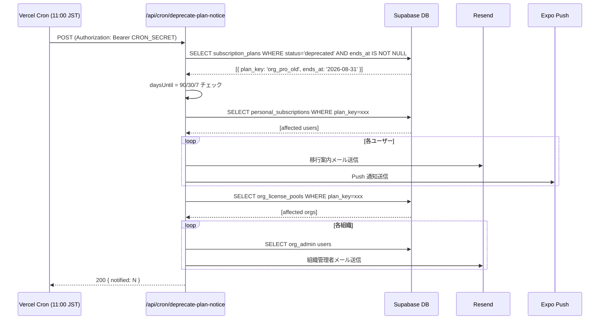

# operator/ Cron / バッチジョブ設計

## 1. 目的・スコープ

pg_cron (Supabase DB 内) および Vercel Cron (HTTP トリガー) の全ジョブ仕様を定義する。スケジュール・処理内容・失敗時アラート・手動実行 UI を含む。

## 2. 関連要件

- 要件 03 §15.17
- 要件 03 §22.x
- 要件 00-architecture.md §6 (pg_cron + Vercel Cron)

## 3. ジョブ一覧

### 3.1 pg_cron ジョブ (Supabase 内)

| ジョブ名 | スケジュール | 概要 |
|---------|-----------|------|
| `license_expire_batch` | daily 02:00 UTC | ライセンス期限切れ処理 |
| `family_freeze_grace_batch` | daily 03:00 UTC | 家族グループ凍結猶予チェック |
| `family_archive_purge_batch` | daily 04:00 UTC | 解散グループの物理削除 (90 日後) |
| `meal_request_expire_batch` | hourly :00 | 期限切れ食事リクエスト処理 |
| `data_integrity_check` | daily 03:30 UTC | データ整合性確認 |
| `license_used_count_reconcile` | monthly 01 04:00 UTC | ライセンス使用数照合 |
| `infra_metrics_cleanup` | daily 05:00 UTC | 30 日超の infra_metrics 削除 |
| `stripe_event_stuck_check` | daily 05:00 UTC | Stripe webhook の processing 状態スタック検出 |
| `failed_invite_lookups_cleanup` | daily 05:30 UTC | 7 日超の failed_invite_lookups 削除 |

### 3.2 Vercel Cron ジョブ (HTTP)

| ジョブ名 | スケジュール (JST) | 概要 |
|---------|-----------------|------|
| `trial_ending_reminder` | daily 09:00 | 試用終了リマインダー |
| `license_renewal_reminder` | daily 10:00 | ライセンス更新リマインダー |
| `deprecate_plan_notice` | daily 11:00 | deprecated プラン移行通知 |
| `stripe_integrity_check` | daily 12:00 | Stripe reconciliation |
| `re_engagement_email` | daily 13:00 | 再エンゲージメントメール |
| `nps_survey_sender` | daily 14:00 | NPS サーベイ送信 |
| `hr_revoke_jobs_processor` | hourly :30 | HR revoke ジョブ処理 |
| `grace_period_check` | daily 09:30 | 支払失敗グレースペリオドチェック |
| `revenue_snapshot` | daily 01:00 | 日次収益スナップショット生成 |
| `dau_snapshot` | daily 01:30 | DAU/WAU/MAU スナップショット |
| `logical_backup` | daily 02:00 | pg_dump → S3 |

---

## 4. pg_cron ジョブ詳細

### 4.1 セットアップ

```sql
-- Supabase で pg_cron 有効化
CREATE EXTENSION IF NOT EXISTS pg_cron;
GRANT USAGE ON SCHEMA cron TO postgres;

-- ジョブ登録
SELECT cron.schedule('license_expire_batch', '0 2 * * *', $$
  SELECT process_license_expire();
$$);

SELECT cron.schedule('family_freeze_grace_batch', '0 3 * * *', $$
  SELECT process_family_freeze_grace_to_archive();
$$);

SELECT cron.schedule('family_archive_purge_batch', '0 4 * * *', $$
  SELECT process_family_archive_purge();
$$);

SELECT cron.schedule('meal_request_expire_batch', '0 * * * *', $$
  SELECT process_meal_request_expire();
$$);

SELECT cron.schedule('data_integrity_check', '30 3 * * *', $$
  SELECT run_data_integrity_check();
$$);

SELECT cron.schedule('license_used_count_reconcile', '0 4 1 * *', $$
  SELECT reconcile_license_used_count();
$$);

SELECT cron.schedule('infra_metrics_cleanup', '0 5 * * *', $$
  DELETE FROM infra_metrics WHERE recorded_at < NOW() - INTERVAL '30 days';
$$);

SELECT cron.schedule('failed_invite_lookups_cleanup', '30 5 * * *', $$
  DELETE FROM failed_invite_lookups WHERE attempted_at < NOW() - INTERVAL '7 days';
$$);
```

### 4.2 `license_expire_batch` — ライセンス期限切れ

```sql
CREATE OR REPLACE FUNCTION process_license_expire()
RETURNS void
SECURITY DEFINER
SET search_path = public
AS $$
BEGIN
  -- 1. 期限切れ org_license_pools の関連 assignments を expired に変更
  UPDATE org_license_assignments ola
  SET status = 'expired', revoked_at = NOW()
  FROM org_license_pools olp
  WHERE ola.license_pool_id = olp.id
    AND ola.status = 'active'
    AND olp.ends_at <= NOW()
    AND olp.auto_renew = FALSE;

  -- 2. 期限切れ personal_subscriptions を expired に変更
  UPDATE personal_subscriptions
  SET status = 'expired'
  WHERE status IN ('trialing', 'active')
    AND current_period_end <= NOW()
    AND stripe_subscription_id IS NULL;  -- Stripe なしの手動管理プランのみ

  -- 3. deprecated プランで ends_at 経過したプールを処理
  UPDATE org_license_pools
  SET ends_at = NOW()
  WHERE plan_key IN (
    SELECT plan_key FROM subscription_plans WHERE status = 'deprecated'
  ) AND ends_at > NOW()
    AND (
      -- subscription_plans.ends_at が設定されていて、既に経過している場合
      SELECT ends_at FROM subscription_plans sp
      WHERE sp.plan_key = org_license_pools.plan_key
        AND sp.status = 'deprecated'
    ) <= NOW();

  -- 4. expired になった assignment に紐付く family_groups を frozen へ
  -- 要件 02 §7.2.8: expired 遷移時に family_groups.source_org_assignment_id を持つグループを凍結フローへ
  UPDATE family_groups
  SET status = 'frozen',
      frozen_at = NOW(),
      freeze_grace_until = NOW() + INTERVAL '30 days'
  WHERE source_org_assignment_id IN (
    SELECT id FROM org_license_assignments
    WHERE status = 'expired'
      AND expires_at >= NOW() - INTERVAL '24 hours'
  )
  AND status = 'active';

  RAISE NOTICE 'license_expire_batch completed at %', NOW();
END;
$$ LANGUAGE plpgsql;
```

### 4.3 `family_freeze_grace_batch` — 家族グループ凍結猶予チェック

```sql
CREATE OR REPLACE FUNCTION process_family_freeze_grace_to_archive()
RETURNS void
SECURITY DEFINER
SET search_path = public
AS $$
DECLARE
  rows_affected INT;
BEGIN
  -- 凍結猶予 (freeze_grace_until) が切れた family_groups を archived に変更 (frozen → archived 遷移のみ)
  UPDATE family_groups
  SET status = 'archived', archived_at = NOW()
  WHERE status = 'frozen'
    AND freeze_grace_until IS NOT NULL
    AND freeze_grace_until <= NOW();

  GET DIAGNOSTICS rows_affected = ROW_COUNT;
  RAISE NOTICE 'family_freeze_grace_batch: % groups archived', rows_affected;
END;
$$ LANGUAGE plpgsql;
```

### 4.4 `family_archive_purge_batch` — 解散グループの物理削除 (90 日後)

-- 責務の分離:
-- - process_family_freeze_grace_to_archive (org/05): frozen → archived 遷移のみ
-- - process_family_archive_purge (本関数): archived から 90 日後の物理削除のみ

```sql
CREATE OR REPLACE FUNCTION process_family_archive_purge()
RETURNS void
SECURITY DEFINER
SET search_path = public
AS $$
DECLARE
  purge_count INT;
BEGIN
  -- archived_at から 90 日経過した family_groups を物理削除 (frozen → archived 遷移は行わない)
  -- CASCADE で関連テーブルも削除される
  DELETE FROM family_groups
  WHERE status = 'archived'
    AND archived_at <= NOW() - INTERVAL '90 days';

  GET DIAGNOSTICS purge_count = ROW_COUNT;
  RAISE NOTICE 'family_archive_purge_batch: % groups purged', purge_count;

  -- 監査ログ (service_role で挿入)
  INSERT INTO admin_audit_logs (actor_id, action_type, severity, details)
  VALUES (
    '00000000-0000-0000-0000-000000000000',  -- SYSTEM_USER_ID
    'system.family.archive_purge',
    'info',
    jsonb_build_object('purge_count', purge_count, 'executed_at', NOW())
  );
END;
$$ LANGUAGE plpgsql;
```

### 4.5 `meal_request_expire_batch` — 期限切れ食事リクエスト

```sql
CREATE OR REPLACE FUNCTION process_meal_request_expire()
RETURNS void
SECURITY DEFINER
SET search_path = public
AS $$
BEGIN
  UPDATE family_meal_requests
  SET status = 'expired'
  WHERE status IN ('pending', 'proposed')
    AND expires_at IS NOT NULL
    AND expires_at <= NOW();
END;
$$ LANGUAGE plpgsql;
```

### 4.6 `data_integrity_check` — データ整合性確認

```sql
CREATE OR REPLACE FUNCTION run_data_integrity_check()
RETURNS void
SECURITY DEFINER
SET search_path = public
AS $$
DECLARE
  orphan_count INT;
BEGIN
  -- 1. personal_subscriptions で plan_key が存在しないレコードをチェック
  SELECT COUNT(*) INTO orphan_count
  FROM personal_subscriptions ps
  WHERE NOT EXISTS (
    SELECT 1 FROM subscription_plans sp WHERE sp.plan_key = ps.plan_key
  );

  IF orphan_count > 0 THEN
    INSERT INTO admin_audit_logs (actor_id, action_type, severity, details)
    VALUES (
      '00000000-0000-0000-0000-000000000000',
      'system.integrity.orphan_subscriptions',
      'critical',
      jsonb_build_object('count', orphan_count)
    );
    -- pg_notify で Slack 通知 (trigger 経由)
  END IF;

  -- 2. active な personal_subscriptions の重複チェック
  SELECT COUNT(*) INTO orphan_count
  FROM (
    SELECT user_id, COUNT(*) cnt
    FROM personal_subscriptions
    WHERE status IN ('trialing', 'active', 'paused', 'past_due')
    GROUP BY user_id HAVING COUNT(*) > 1
  ) dups;

  IF orphan_count > 0 THEN
    INSERT INTO admin_audit_logs (actor_id, action_type, severity, details)
    VALUES (
      '00000000-0000-0000-0000-000000000000',
      'system.integrity.duplicate_active_subscriptions',
      'critical',
      jsonb_build_object('dup_user_count', orphan_count)
    );
  END IF;

  RAISE NOTICE 'data_integrity_check completed at %', NOW();
END;
$$ LANGUAGE plpgsql;
```

### 4.7 `license_used_count_reconcile` — ライセンス使用数月次照合

```sql
CREATE OR REPLACE FUNCTION reconcile_license_used_count()
RETURNS void
SECURITY DEFINER
SET search_path = public
AS $$
DECLARE
  mismatch_count INT := 0;
BEGIN
  UPDATE org_license_pools p
  SET used_licenses = (
    SELECT COUNT(*)
    FROM org_license_assignments a
    WHERE a.license_pool_id = p.id AND a.status = 'active'
  )
  WHERE p.used_licenses != (
    SELECT COUNT(*)
    FROM org_license_assignments a
    WHERE a.license_pool_id = p.id AND a.status = 'active'
  );

  GET DIAGNOSTICS mismatch_count = ROW_COUNT;

  IF mismatch_count > 0 THEN
    INSERT INTO admin_audit_logs (actor_id, action_type, severity, details)
    VALUES (
      '00000000-0000-0000-0000-000000000000',
      'system.license.used_count_reconcile',
      'warn',
      jsonb_build_object('corrected_pools', mismatch_count)
    );
  END IF;
END;
$$ LANGUAGE plpgsql;
```

---

## 5. Vercel Cron ジョブ詳細

### 5.1 vercel.json 設定

```json
{
  "crons": [
    { "path": "/api/cron/trial-ending-reminder",   "schedule": "0 0 * * *" },
    { "path": "/api/cron/license-renewal-reminder", "schedule": "0 1 * * *" },
    { "path": "/api/cron/deprecate-plan-notice",    "schedule": "0 2 * * *" },
    { "path": "/api/cron/stripe-reconcile",         "schedule": "0 3 * * *" },
    { "path": "/api/cron/re-engagement-email",      "schedule": "0 4 * * *" },
    { "path": "/api/cron/nps-survey-sender",        "schedule": "0 5 * * *" },
    { "path": "/api/cron/grace-period-check",       "schedule": "30 0 * * *" },
    { "path": "/api/cron/revenue-snapshot",         "schedule": "0 16 * * *" },
    { "path": "/api/cron/dau-snapshot",             "schedule": "30 16 * * *" },
    { "path": "/api/cron/logical-backup",           "schedule": "0 17 * * *" },
    { "path": "/api/cron/hr-revoke-processor",      "schedule": "30 * * * *"  }
  ]
}
```

*UTC → JST: UTC+9 で変換。例: `0 0 * * *` UTC = 09:00 JST*

### 5.2 共通認証

```typescript
// src/app/api/cron/_auth.ts
export function authenticateCron(request: Request): boolean {
  const auth = request.headers.get('Authorization');
  return auth === `Bearer ${process.env.CRON_SECRET}`;
}

// 各 cron handler の先頭で呼び出す
export function POST(request: Request) {
  if (!authenticateCron(request)) {
    return new Response('Unauthorized', { status: 401 });
  }
  // ...
}
```

### 5.3 `trial_ending_reminder` (09:00 JST)

```typescript
// src/app/api/cron/trial-ending-reminder/route.ts
export async function POST(request: Request) {
  if (!authenticateCron(request)) return new Response('Unauthorized', { status: 401 });

  // 3 日後・1 日後・当日に終了する trialing subscription を抽出
  const { data: expiringSubs } = await supabase
    .from('personal_subscriptions')
    .select('user_id, plan_key, trial_ends_at')
    .eq('status', 'trialing')
    .gte('trial_ends_at', new Date().toISOString())
    .lte('trial_ends_at', new Date(Date.now() + 3 * 24 * 60 * 60 * 1000).toISOString());

  for (const sub of expiringSubs ?? []) {
    const daysLeft = Math.ceil(
      (new Date(sub.trial_ends_at).getTime() - Date.now()) / (1000 * 60 * 60 * 24)
    );

    await sendEmail({
      to: sub.user_id,
      template: 'trial_ending_reminder',
      params: { days_left: daysLeft, plan_key: sub.plan_key },
    });

    await sendPushNotification({
      userId: sub.user_id,
      title: `無料トライアルが ${daysLeft} 日後に終了します`,
      body: '継続してご利用いただくには、プランを設定してください。',
      deepLink: 'homegohan://account/billing',
    });
  }

  return new Response(JSON.stringify({ processed: expiringSubs?.length ?? 0 }), { status: 200 });
}
```

### 5.4 `deprecate_plan_notice` (11:00 JST)

```typescript
// src/app/api/cron/deprecate-plan-notice/route.ts
export async function POST(request: Request) {
  if (!authenticateCron(request)) return new Response('Unauthorized', { status: 401 });

  const { data: deprecatedPlans } = await supabase
    .from('subscription_plans')
    .select('id, plan_key, ends_at, superseded_by_plan_id')
    .eq('status', 'deprecated')
    .not('ends_at', 'is', null);

  for (const plan of deprecatedPlans ?? []) {
    const endsAt = new Date(plan.ends_at!);
    const daysUntil = Math.ceil((endsAt.getTime() - Date.now()) / (1000 * 60 * 60 * 24));

    // 90/30/7 日前のいずれかの場合にのみ通知
    if (![90, 30, 7].includes(daysUntil)) continue;

    // 影響ユーザーを抽出 (personal)
    const { data: affectedUsers } = await supabase
      .from('personal_subscriptions')
      .select('user_id')
      .eq('plan_key', plan.plan_key)
      .in('status', ['active', 'trialing', 'paused']);

    for (const user of affectedUsers ?? []) {
      await sendEmail({
        to: user.user_id,
        template: 'plan_deprecation_notice',
        params: { plan_key: plan.plan_key, ends_at: plan.ends_at, days_until: daysUntil },
      });
    }

    // 影響組織の org_admin を抽出
    const { data: affectedOrgs } = await supabase
      .from('org_license_pools')
      .select('organization_id')
      .eq('plan_key', plan.plan_key)
      .eq('status', 'active');

    for (const org of affectedOrgs ?? []) {
      await notifyOrgAdmins(org.organization_id, {
        template: 'plan_deprecation_notice_org',
        params: { plan_key: plan.plan_key, ends_at: plan.ends_at, days_until: daysUntil },
      });
    }
  }

  return new Response('OK', { status: 200 });
}
```

### 5.5 `re_engagement_email` (13:00 JST)

```typescript
// 7/14/30 日間ログインなし かつ plan_key != 'free' のユーザーに段階的メール
const targets = await supabase
  .from('user_profiles')
  .select('id, last_login_at, plan_key_cached')
  .neq('plan_key_cached', 'free')
  .lte('last_login_at', new Date(Date.now() - 7 * 24 * 60 * 60 * 1000).toISOString())
  .gte('last_login_at', new Date(Date.now() - 31 * 24 * 60 * 60 * 1000).toISOString());

for (const user of targets ?? []) {
  const daysSinceLogin = Math.floor(
    (Date.now() - new Date(user.last_login_at).getTime()) / (1000 * 60 * 60 * 24)
  );

  // 7 日目・14 日目・30 日目のみ送信
  if (![7, 14, 30].includes(daysSinceLogin)) continue;

  const template = daysSinceLogin === 30 ? 're_engagement_offer' : 're_engagement_reminder';
  await sendEmail({ to: user.id, template, params: { days_since_login: daysSinceLogin } });
}
```

### 5.6 `hr_revoke_jobs_processor` (hourly :30)

```typescript
// HR Webhook で追加されたジョブを処理 (毎時 30 分)
const { data: pendingJobs } = await supabase
  .from('hr_revoke_jobs')
  .select('*')
  .in('status', ['pending'])
  .lte('next_attempt_at', new Date().toISOString())
  .order('next_attempt_at', { ascending: true })
  .limit(100);

for (const job of pendingJobs ?? []) {
  try {
    await processHrRevokeJob(job);
    await supabase.from('hr_revoke_jobs').update({ status: 'completed' }).eq('id', job.id);
  } catch (err) {
    const newAttempts = job.attempts + 1;
    if (newAttempts >= 5) {
      // デッドレター
      await supabase.from('hr_revoke_jobs').update({
        status: 'dead_letter',
        last_error: String(err),
      }).eq('id', job.id);
      await notifySlack({ channel: '#hr-alerts', message: `HR revoke job dead letter: ${job.id}` });
    } else {
      // 指数バックオフで再スケジュール (pending に戻して next_attempt_at をセット)
      const nextSchedule = new Date(Date.now() + Math.pow(2, newAttempts) * 60 * 1000);
      await supabase.from('hr_revoke_jobs').update({
        status: 'pending',
        attempts: newAttempts,
        last_error: String(err),
        next_attempt_at: nextSchedule.toISOString(),
      }).eq('id', job.id);
    }
  }
}
```

### 5.7 `grace_period_check` (09:30 JST)

```typescript
// 支払失敗から 7 日経過 → status='cancelled'
const { data: overdueSubs } = await supabase
  .from('personal_subscriptions')
  .select('id, user_id, stripe_subscription_id')
  .eq('status', 'past_due')
  .lte('updated_at', new Date(Date.now() - 7 * 24 * 60 * 60 * 1000).toISOString());

for (const sub of overdueSubs ?? []) {
  await supabase.from('personal_subscriptions')
    .update({ status: 'cancelled', cancelled_at: new Date() })
    .eq('id', sub.id);

  // Stripe subscription もキャンセル
  if (sub.stripe_subscription_id) {
    await stripe.subscriptions.cancel(sub.stripe_subscription_id);
  }

  await sendEmail({
    to: sub.user_id,
    template: 'subscription_cancelled_due_to_payment',
  });
}
```

### 5.8 `revenue_snapshot` (01:00 JST)

```typescript
// 前日のデータを集計して revenue_snapshots に INSERT
const yesterday = new Date();
yesterday.setDate(yesterday.getDate() - 1);
const dateStr = yesterday.toISOString().slice(0, 10);

const { data: mrr } = await supabase.rpc('calculate_daily_mrr', { calc_date: dateStr });

await supabase.from('revenue_snapshots').upsert({
  date: dateStr,
  ...mrr,
  computed_at: new Date(),
});
```

---

## 6. 監視・失敗時アラート

### 6.1 pg_cron 失敗監視

```sql
-- 別の pg_cron ジョブで失敗を監視
SELECT cron.schedule(
  'check_cron_failures',
  '0 */6 * * *',  -- 6時間毎
  $$
  INSERT INTO admin_audit_logs (actor_id, action_type, severity, details)
  SELECT
    '00000000-0000-0000-0000-000000000000',
    'system.cron.failure_detected',
    'warn',
    jsonb_build_object(
      'job_name', jobid::TEXT,
      'failed_count',
      COUNT(*) FILTER (WHERE status = 'failed' AND start_time > NOW() - INTERVAL '24h')
    )
  FROM cron.job_run_details
  WHERE status = 'failed'
    AND start_time > NOW() - INTERVAL '24h'
  GROUP BY jobid
  HAVING COUNT(*) >= 3;
  -- 3 回以上失敗した場合に audit log + pg_notify でアラート
  $$
);
```

### 6.2 Vercel Cron 失敗監視

各 cron handler で `try-catch` して失敗時に Slack 通知:

```typescript
// src/app/api/cron/_wrapper.ts
export function withCronMonitoring(jobName: string, handler: CronHandler): CronHandler {
  return async (request: Request) => {
    const startTime = Date.now();
    try {
      const result = await handler(request);
      logger.info(`cron.${jobName}.success`, { duration_ms: Date.now() - startTime });
      return result;
    } catch (err) {
      logger.error(`cron.${jobName}.failed`, { error: String(err), duration_ms: Date.now() - startTime });
      await notifySlack({
        channel: '#cron-alerts',
        message: `🚨 Cron失敗: ${jobName}\n\`\`\`${String(err)}\`\`\``,
      });
      // Sentry にも送信
      Sentry.captureException(err, { tags: { cron_job: jobName } });
      return new Response('Error', { status: 500 });
    }
  };
}
```

---

## 7. 手動実行 UI (/super-admin/cron-jobs)

### 7.1 画面仕様

**ジョブ一覧テーブル**:

| カラム | 内容 |
|------|------|
| ジョブ名 | テキスト |
| 種別 | `pg_cron` / `Vercel Cron` バッジ |
| スケジュール | cron 式 + 人間語 (例: 「毎日 09:00 JST」) |
| 最終実行 | 日時 + `success` / `failed` バッジ |
| 最終実行時間 | ミリ秒 |
| 次回実行予定 | 日時 |
| 操作 | [今すぐ実行] [一時停止] |

**今すぐ実行フロー**:
1. [今すぐ実行] ボタン
2. 確認モーダル: 「`trial_ending_reminder` を今すぐ手動実行しますか？」
3. パスワード再認証
4. [実行確定] → API 呼び出し
5. 実行ログを画面にリアルタイム表示

**実行ログパネル** (展開): 直近 10 回の実行記録 (開始時刻 / 終了時刻 / ステータス / 処理件数)

### 7.2 手動実行 API

```typescript
// POST /api/super-admin/cron-jobs/{jobName}/run
export async function POST(request: Request, { params }: { params: { jobName: string } }) {
  const user = await requireRole(['super_admin']);
  const { jobName } = params;

  // 監査ログ
  await insertAuditLog({
    actorId: user.id,
    actionType: 'super_admin.cron.run_now',
    details: { job_name: jobName },
    severity: 'warn',
  });

  // pg_cron ジョブの場合は SQL 直接実行
  if (PG_CRON_JOBS.includes(jobName)) {
    await supabase.rpc(`${jobName}`);  // 各関数を RPC で呼び出し
  }

  // Vercel Cron ジョブの場合は自分自身の API を呼び出し
  if (VERCEL_CRON_JOBS[jobName]) {
    const response = await fetch(VERCEL_CRON_JOBS[jobName], {
      method: 'POST',
      headers: { Authorization: `Bearer ${process.env.CRON_SECRET}` },
    });
    return Response.json({ status: response.status });
  }

  return Response.json({ error: 'Unknown job' }, { status: 400 });
}
```

---

## 8. シーケンス — deprecated プラン移行通知 cron



## 9. エラーハンドリング

| ジョブ | 失敗時の対処 |
|-------|-----------|
| pg_cron 全般 | `cron.job_run_details` に記録 → 監視 cron が 3 回失敗を検知 → Slack アラート |
| Vercel Cron 全般 | `withCronMonitoring` ラッパーで Slack + Sentry に送信 |
| `hr_revoke_jobs_processor` | 個別ジョブ単位でリトライ (指数バックオフ 5 回) → dead_letter |
| `stripe_integrity_check` | 不一致検出 → 自動修復しない → Slack + 監査ログ |
| `family_archive_purge_batch` | dry-run モードを持つ (purge_count > 100 の場合は Slack 確認を要求) |

## 10. テスト方針

- **Unit**:
  - `authenticateCron()` の CRON_SECRET 検証
  - `deprecate_plan_notice` の 90/30/7 日前計算
  - `grace_period_check` の 7 日判定
- **Integration** (Supabase Local):
  - `process_license_expire()` の動作確認
  - `process_family_freeze_grace_to_archive()` のステータス遷移
  - `reconcile_license_used_count()` の used_licenses 同期確認
- **E2E** (Playwright):
  - `/super-admin/cron-jobs` で手動実行 → 監査ログに記録されることを確認

## 11. 既存実装との関連

- `pg_cron setup.sql`: `00-architecture.md §6` で言及済み、本ドキュメントが詳細を定義
- Vercel Cron: `vercel.json` に crons を追加
- `hr_revoke_jobs`: 要件 §15.2 で DDL 定義済み

## 12. 未解決事項

- `family_archive_purge_batch` の dry-run モード実装方法 → `?dry_run=true` クエリパラメータで制御する予定
- `revenue_snapshot` の `calculate_daily_mrr` RPC: Stripe データと DB の差異をどう調整するか → stripe reconcile 後に実行するよう依存順序を設定
- pg_cron の失敗ログ長期保管: `cron.job_run_details` は Supabase が自動でクリアするため、重要な失敗は `admin_audit_logs` に都度 INSERT する設計で対応
