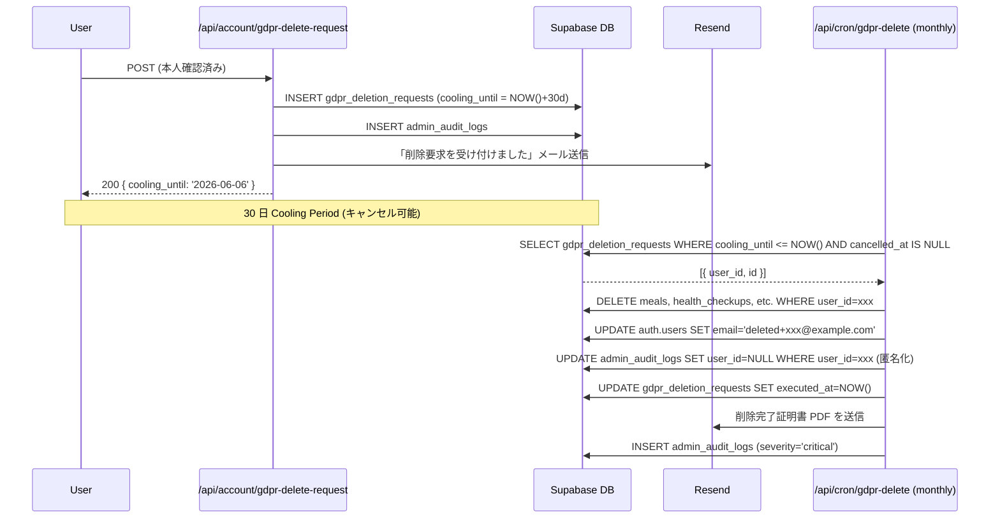

# operator/ 運用手順書 (Runbook)

## 1. 目的・スコープ

本番運用で必要となる手順を網羅する。Stripe reconciliation・pg_cron 手動実行・deprecated プラン rollback・緊急 bulk-revoke・org_admin ゼロ復旧・GDPR 削除・情報漏洩報告・DR シナリオ・マイグレーション適用手順・障害対応フローを定義する。

**このドキュメントは super_admin および on-call エンジニア向け。本番操作は必ず 2 名確認を推奨。**

## 2. 関連要件

- 要件 03 §15 運用手順書
- 要件 03 §16.5 DR / バックアップ
- 要件 03 §11.0 マイグレーション順序

## 3. マイグレーション本番適用手順 (§11.0 順序)

### 3.1 前提

- **ダウンタイム目標**: 30 分以内
- **SLA に従った告知**: Pro 7 日前、Org 14-30 日前
- **ブルーグリーン不要**: スキーマ変更が backward compatible であることを前提
- **全マイグレーションは `BEGIN; ... COMMIT;` でトランザクション化**

### 3.2 適用順序 (必須)

```
1.  03-operator-admin (運営マスター系)
    ├── subscription_plans         ← 'free' レコードを必ず seed
    ├── feature_packages
    ├── plan_price_history
    ├── coupons / coupon_redemptions
    ├── personal_subscriptions
    └── revenue_snapshots

2.  02-organization-management (組織系)
    ├── organizations (既存テーブルは移行ガイド参照)
    ├── departments / department_history
    ├── org_license_pools          ← FK: subscription_plans(plan_key)
    └── org_license_assignments / org_license_audit_log
    + ALTER TABLE user_profiles (organization_id 等)

3.  01-family-management (家族系)
    ├── family_groups              ← FK: subscription_plans(plan_key)
    ├── family_members
    ├── family_invites
    ├── family_shared_menus
    └── family_meal_requests

4.  admin_audit_logs (拡張)
5.  support_tickets / messages
6.  sales_leads / activities
7.  infra_metrics / alerts
8.  experiments / assignments
9.  consent 系 (cookie_consents / terms_acceptances 等)
10. gdpr_deletion_requests
11. parental_consents
12. password_history
13. user_sessions_metadata
14. pg_cron setup (08-cron-batches.md 参照)
15. rls_hardening (全テーブルの RLS 確認・補強)
```

### 3.3 実行手順

```bash
# 1. staging で事前テスト
supabase db reset --linked  # staging プロジェクトで実行

# 2. マイグレーションを順番に適用
supabase db push --linked --include-all

# 3. smoke test (staging)
npm run test:smoke:staging

# 4. 本番適用 (2 名確認)
supabase db push --linked --include-all
# (本番プロジェクトの PROJECT_ID を確認してから実行)

# 5. 型の再生成
npm run db:types
git add types/supabase.ts
git commit -m "chore: Supabase 型を再生成"

# 6. seed データ投入
supabase db execute --file supabase/seeds/subscription_plans.sql

# 7. 動作確認
npm run test:smoke:production
```

### 3.4 ロールバック手順

```bash
# マイグレーション失敗時 (BEGIN...COMMIT のため自動 ROLLBACK)
# PITR で指定時刻に巻き戻す場合:
# 1. Supabase ダッシュボード → Database → Backups → Point-in-time recovery
# 2. ターゲット時刻を入力 (マイグレーション開始 5 分前)
# 3. staging で確認後、本番で実行
```

---

## 4. Stripe ↔ DB Reconciliation 手順

### 4.1 日次 cron (自動)

`/api/cron/stripe-reconcile` が毎日 12:00 JST に自動実行。

不一致検出時は Slack `#stripe-alerts` に通知 + `admin_audit_logs` に記録。

**自動修復は行わない。**

### 4.2 手動 Reconciliation 手順 (不一致発見時)

```
Step 1: 不一致内容の確認
  - /admin/audit-logs で action_type='system.stripe.reconcile_discrepancy' を検索
  - details に { type, stripe_subscription_id, stripe_status, db_status } が記録されている

Step 2: Stripe Dashboard で実態確認
  - https://dashboard.stripe.com/subscriptions/{stripe_subscription_id}
  - 実際のステータス・課金状態を確認

Step 3: 修正
  a) Stripe が正しい場合 (DB を更新):
     -- super_admin が直接 DB 更新 (Supabase Dashboard の SQL Editor)
     UPDATE personal_subscriptions
     SET status = '{stripe_status}',
         current_period_end = {stripe_period_end}
     WHERE stripe_subscription_id = '{sub_id}';

  b) DB が正しい場合 (Stripe 側に問題):
     - Stripe Support に連絡 or Stripe Dashboard で手動修正

Step 4: 監査ログ記録
  -- 手動修正後に必ず記録
  INSERT INTO admin_audit_logs (actor_id, action_type, severity, details)
  VALUES (
    auth.uid(),
    'finance.stripe_reconcile.manual',
    'warn',
    '{"subscription_id": "sub_xxx", "fix": "status corrected to active"}'
  );
```

---

## 5. pg_cron 失敗時の手動実行

### 5.1 失敗確認

```sql
-- 失敗したジョブを確認
SELECT jobid, status, start_time, end_time, return_message
FROM cron.job_run_details
WHERE status = 'failed'
  AND start_time > NOW() - INTERVAL '24h'
ORDER BY start_time DESC;
```

### 5.2 手動実行

**方法 A: /super-admin/cron-jobs UI から実行**
1. super_admin でログイン
2. `/super-admin/cron-jobs` を開く
3. 失敗したジョブの [今すぐ実行] をクリック
4. パスワード再認証
5. [実行確定]

**方法 B: Supabase SQL Editor から直接実行**

```sql
-- 例: license_expire_batch を手動実行
SELECT process_license_expire();

-- 例: data_integrity_check を手動実行
SELECT run_data_integrity_check();
```

### 5.3 Vercel Cron の手動実行

```bash
# CRON_SECRET を使って HTTP で呼び出す
curl -X POST https://homegohan.app/api/cron/trial-ending-reminder \
  -H "Authorization: Bearer ${CRON_SECRET}"
```

---

## 6. deprecated プラン ロールバック手順

### 6.1 シナリオ

`super_admin` が誤って `org_pro` を deprecated にした。

### 6.2 手順

```
Step 1: 被害確認
  - /admin/audit-logs で action_type='super_admin.plan.deprecate' の最新ログを確認
  - 影響を受けた org_license_pools を確認:
    SELECT * FROM org_license_pools
    WHERE plan_key='org_pro' AND auto_renew_was_force_disabled_at IS NOT NULL;

Step 2: un-deprecate 実行
  - /super-admin/plans で対象プランを開く
  - [廃止をロールバック] ボタンをクリック
  - パスワード再認証
  - [確定]
  → status='private' に変更 (public には自動で戻さない)

Step 3: auto_renew 復元確認
  - API が自動的に auto_renew_was_force_disabled_at IS NOT NULL のレコードを TRUE に戻す
  - 確認クエリ:
    SELECT COUNT(*) FROM org_license_pools
    WHERE plan_key='org_pro' AND auto_renew=TRUE;

Step 4: ステータス確認・再公開 (必要な場合)
  - [公開する] ボタンで public に戻す

Step 5: 影響組織への通知確認
  - API が自動送信する「誤操作のため更新有効化を戻しました」通知を確認

Step 6: 監査ログ確認
  - /admin/audit-logs で severity='critical' を確認
```

---

## 7. 誤大量 CSV 割当の緊急 bulk-revoke 手順

### 7.1 シナリオ

`org_admin` が 10,000 人 CSV 割当 → 数千人が誤配布。

### 7.2 手順

```
Step 1: 被害範囲の特定
  SELECT COUNT(*), MIN(created_at), MAX(created_at)
  FROM org_license_assignments
  WHERE pool_id = '{pool_id}'
    AND created_at BETWEEN '{誤操作開始時刻}' AND '{誤操作終了時刻}';

Step 2: bulk-revoke 実行 (API)
  POST /api/org/licenses/assignments/bulk-revoke
  Body:
  {
    "pool_id": "uuid",
    "criteria": {
      "assigned_after": "2026-05-06T10:00:00Z",
      "assigned_before": "2026-05-06T11:00:00Z"
    }
  }

  または特定ユーザー指定:
  {
    "pool_id": "uuid",
    "user_ids": ["uuid1", "uuid2", ...]
  }

Step 3: 確認モーダルで人数を確認
  - 「N 人のライセンスを取消します」(N > 1000 の場合は追加の super_admin 確認が必要)
  - パスワード再認証

Step 4: 実行後の確認
  SELECT COUNT(*) FROM org_license_assignments
  WHERE pool_id = '{pool_id}' AND status = 'revoked'
    AND revoked_at > NOW() - INTERVAL '1h';

Step 5: 影響ユーザーへの通知
  - 自動送信される「ライセンスが取り消されました」メール/Push を確認

Step 6: family_groups 凍結フローの確認
  - source_org_assignment_id を持つ family_groups が frozen になっていることを確認
  SELECT COUNT(*) FROM family_groups
  WHERE source_org_assignment_id IN (
    SELECT id FROM org_license_assignments WHERE pool_id='{pool_id}' AND status='revoked'
      AND revoked_at > NOW() - INTERVAL '1h'
  );
```

---

## 8. org_admin ゼロ状態の緊急復旧

### 8.1 シナリオ

唯一の org_admin が退職 (HR Webhook で revoke) → 組織管理者不在。

### 8.2 設計上の防止策

```typescript
// HR revoke 処理前にチェック (自動)
async function checkOrgAdminCount(organizationId: string, userId: string): Promise<boolean> {
  const { count } = await supabase
    .from('user_profiles')
    .select('*', { count: 'exact' })
    .eq('organization_id', organizationId)
    .contains('roles', ['org_admin'])
    .neq('id', userId);

  if (count === 0) {
    // revoke を保留して super_admin に通知
    await notifySlack({
      channel: '#hr-alerts',
      message: `⚠️ org_admin がゼロになる revoke を保留: org_id=${organizationId}, user_id=${userId}`,
    });
    return false; // revoke を実行しない
  }
  return true;
}
```

### 8.3 発生した場合の手順

```
Step 1: 確認
  SELECT COUNT(*) FROM user_profiles
  WHERE organization_id = '{org_id}'
    AND 'org_admin' = ANY(roles)
    AND organization_id IS NOT NULL;
  -- 0 であれば緊急対応が必要

Step 2: 新 org_admin の候補特定
  - 組織の連絡先 (sales_leads から契約担当者情報を確認)
  - または組織内の org_manager から昇格

Step 3: super_admin 緊急介入
  POST /api/super-admin/organizations/{orgId}/transfer-admin
  Body:
  {
    "new_admin_user_id": "uuid",
    "reason": "唯一の org_admin が退職したため緊急転送"
  }

Step 4: 通知確認
  - 新 org_admin にメール通知が送られることを確認
  - admin_audit_logs に記録されることを確認

Step 5: org_admin に手順案内
  - ライセンス管理の操作方法を support チームからサポート
```

---

## 9. GDPR 削除要求対応フロー (§15.7)

### 9.1 フロー全体

```
Day 0: 削除要求受信 (ユーザー自身 or サポート経由)
  → POST /api/account/gdpr-delete-request
  → gdpr_deletion_requests テーブルに記録
  → cooling_until = NOW() + 30 days
  → 本人確認メール送信 (「削除要求を受け付けました」)

Day 0-30: Cooling Period
  → ユーザーは /account/settings でキャンセル可能
  → サポートがチケット経由で連絡可能

Day 30: 自動削除バッチ実行 (/api/cron/gdpr-delete で月次)
  → cooling_until 経過かつ cancelled_at IS NULL のレコードを処理
  → 物理削除対象:
     - meals, planned_meals, health_checkups (個人データ)
     - family_members (family_group メンバー情報)
     - user_profiles の PII 列を NULL/HASH 化
  → 保持対象 (匿名化):
     - admin_audit_logs (user_id を NULL に、法的要件)
     - org_health_access_logs (同上)
  → auth.users を匿名化:
     UPDATE auth.users
     SET email = 'deleted+' || id || '@example.com',
         phone = NULL
     WHERE id = '{user_id}';

削除完了:
  → gdpr_deletion_requests.executed_at = NOW()
  → 削除完了証明書 PDF 生成 → 本人メール
  → admin_audit_logs に severity='critical' で記録
```

### 9.2 手動対応手順 (support から依頼された場合)

```
Step 1: 本人確認
  - パスポート / 運転免許証の写真をサポートチャンネルで確認
  - メールアドレスが一致することを確認

Step 2: 削除要求を代理作成 (super_admin)
  - /admin/users/{id} でユーザー詳細を確認
  - 「GDPR 削除要求を代理作成」ボタン (super_admin のみ表示)
  - cooling_until を短縮する場合は super_admin の判断で可能

Step 3: 削除実行確認
  - gdpr_deletion_requests.executed_at が設定されていることを確認
  - 証明書 PDF が送信されていることを確認

Step 4: 監査ログ確認
  - admin_audit_logs で action_type='super_admin.gdpr_delete.execute' を確認
```

---

## 10. 情報漏洩 72 時間報告フロー (§18.3)

### 10.1 検知 → 72 時間以内の対応

```
T+0: 漏洩検知
  □ インシデントリーダーを指名
  □ Slack #incident スレッドを作成
  □ 被害範囲の初期調査開始
    - 漏洩したデータの種類 (PII / 健康データ / 課金情報 等)
    - 影響ユーザー数の概算
    - 漏洩経路の特定

T+1h: 初期封じ込め
  □ 脆弱な API / 機能を緊急停止 (feature_flag で OFF)
  □ 関連するアクセストークンを全 rotate
  □ Supabase の疑わしいサービスロール token を無効化

T+2h: 影響範囲の確定
  □ 正確な漏洩データの種類と件数を確定
  □ 漏洩開始時刻の特定 (ログ調査)

T+4h: ユーザーへの通知 (影響を受けた全ユーザー)
  □ Email: 「重要なセキュリティに関するお知らせ」
  □ 漏洩した情報の種類を明記
  □ ユーザーが取るべきアクションを案内 (パスワード変更等)

T+24h: 個人情報保護委員会への報告 (日本)
  □ 個人情報保護委員会の報告フォームを提出
  □ EU 拠点企業ユーザーがいる場合: 所管 DPA (監督当局) にも報告

T+72h: 詳細報告書提出
  □ 委員会報告書に詳細情報を追記
  □ 再発防止策を含む

T+1week: ポストモーテム
  □ 09-runbook.md §10.2 テンプレートに従って作成
  □ 全 admin に共有
```

### 10.2 報告書テンプレート (個人情報保護委員会向け)

```
【個人データ漏洩報告書】

報告日時: YYYY-MM-DD HH:MM
事業者名: ほめゴハン株式会社 (仮称)

1. 事故の概要
   [1-2 段落で漏洩の経緯を記述]

2. 漏洩した個人データの種類と件数
   - 種類: [メールアドレス / 氏名 / 健康データ 等]
   - 件数: [X 名]
   - 時期: [期間]

3. 漏洩の原因
   [技術的原因と運用上の原因]

4. 影響を受けた本人への対応
   - 通知日時: YYYY-MM-DD
   - 通知方法: Email
   - 内容: [概要]

5. 再発防止策
   - 短期: [実施済み対応]
   - 中期: [実施予定の対応と期限]

6. 添付資料
   - インシデントポストモーテム (別紙)
   - 影響ユーザーリスト (別紙、厳秘)
```

---

## 11. DR シナリオ別手順 (§16.5)

### 11.1 シナリオ 1: Supabase DB 障害

**目標 RTO**: org_pro 以上 = 30 分

```
Step 1: 影響確認 (T+0)
  □ status.homegohan.app で Supabase ステータスを確認
  □ Supabase Status Page (status.supabase.com) を確認

Step 2: 一時的な対応 (T+5 min)
  □ API で DB 接続エラーを返す場合: Maintenance Mode を ON
    → /super-admin/settings → メンテナンスモード ON
  □ status.homegohan.app を Investigating に更新

Step 3: Supabase サポートに連絡 (T+10 min)
  □ Supabase Pro/Team サポートチャンネルで報告
  □ インシデント ID を取得

Step 4: PITR 復旧が必要な場合
  □ Supabase ダッシュボード → Database → Backups → PITR
  □ 復旧ターゲット時刻を選択 (障害発生前の最も新しい時刻)
  □ staging で復元テスト → 本番復元
  □ RTO: 30 分 (org_pro)

Step 5: 復旧確認
  □ /api/health エンドポイントで疎通確認
  □ smoke test 実施
  □ Maintenance Mode を OFF
  □ status.homegohan.app を Resolved に更新
```

### 11.2 シナリオ 2: Vercel 障害

```
Step 1: 影響確認
  □ Vercel Status (vercel-status.com) を確認

Step 2: フォールバック (該当する場合)
  □ 別リージョンの Vercel への手動 redirect (Cloudflare の DNS を変更)
  □ または Cloudflare Pages への一時的なフォールバック (静的ページのみ)

Step 3: Vercel サポートに連絡
```

### 11.3 シナリオ 3: リージョン全体障害 (東京)

**Phase 1 (現在): 単一リージョン運用のため手動復旧**

```
Step 1: 影響確認 (東京リージョン全体の障害)
  □ AWS Tokyo (ap-northeast-1) の Status を確認

Step 2: フォールバック先の準備
  □ Supabase: Singapore (sin1) Read Replica への手動切替 (Phase 2 機能)
    → Phase 1 では利用不可 → RTO best effort (6-12 時間)
  □ Vercel: 大阪 (kix1) へのリダイレクト設定

Step 3: ユーザー通知
  □ status.homegohan.app を Major Outage に更新
  □ 影響ユーザーへメール送信 (キャッシュ済みのメールリストから)

Step 4: 復旧後
  □ Read Replica のデータ整合性確認
  □ Stripe reconciliation を手動実行
```

### 11.4 シナリオ 4: データ破壊 (誤 DELETE)

```
Step 1: 被害範囲の確認
  □ どのテーブル・どの条件で DELETE されたかを admin_audit_logs で確認
  □ 件数を確認

Step 2: PITR で巻き戻し (T-1h 相当)
  □ Supabase Dashboard → PITR で DELETE 発生前の時刻を選択
  □ staging の別 DB で復元 → 正常を確認
  □ 本番で復元 (ダウンタイム発生)

Step 3: または論理バックアップから部分復元
  □ Daily Logical Backup から対象テーブルのみ抽出
  □ pg_restore --table='{table_name}' で部分復元

Step 4: 整合性確認
  □ restore 後に data_integrity_check を手動実行
  □ Stripe reconcile を手動実行

Step 5: 原因究明・防止策
  □ admin_audit_logs で操作者を特定
  □ 誤操作の場合: super_admin への操作権限の再教育
  □ セキュリティ問題の場合: §10 漏洩対応フローへ
```

### 11.5 シナリオ 5: ランサムウェア / 侵害

```
Step 1: 即時対応 (T+0)
  □ 全サービスをオフライン (Maintenance Mode ON)
  □ status.homegohan.app を Major Outage に更新
  □ Supabase の全 API キーを即時 rotate
    - anon key
    - service_role key
    - SUPABASE_JWT_SECRET
  □ Vercel の全環境変数を rotate
    - STRIPE_SECRET_KEY
    - CRON_SECRET
    - RESEND_API_KEY
    - 全 LLM API キー

Step 2: 被害調査 (T+1h)
  □ 侵害経路の特定 (ログ調査)
  □ 漏洩データの特定

Step 3: Cold Backup から復元
  □ Weekly Cold Backup (S3 Glacier) から最新の未侵害 backup を選択
  □ SHA256 + GPG 署名を検証 (integrity check)
  □ 新しい Supabase プロジェクトに復元
  □ DNS を新プロジェクトに切替

Step 4: 段階的な復旧
  □ Read-only モードで一部機能を復旧
  □ 全ログを監視しながら段階的に機能を解放

Step 5: ユーザー通知 (§10.1 漏洩対応フロー)
  □ 個人情報保護委員会への報告 (72 時間以内)
```

---

## 12. 障害対応 Runbook (汎用)

### 12.1 Slack #incident スレッド運用

```
[インシデント宣言]
@channel P0 障害発生: homegohan.app が応答しない
影響範囲: 全ユーザー / 特定機能 / 特定プラン
リーダー: [名前]
ブリッジ: [Slack スレッド / Zoom URL]

[5 分毎の状況更新]
T+05: 原因調査中 - Vercel ログを確認
T+10: DB クエリタイムアウトを確認 - Supabase に問い合わせ中
T+20: Supabase 側の問題と確認 - 復旧待ち
T+35: 復旧完了 - smoke test 実施中
T+40: smoke test OK - Resolved
```

### 12.2 影響範囲特定クエリ

```sql
-- 直近のエラーを持つ Stripe Webhook を確認
SELECT id, event_type, error_message, received_at
FROM stripe_webhook_events
WHERE processing_status = 'failed'
  AND received_at > NOW() - INTERVAL '1h'
ORDER BY received_at DESC;

-- past_due のユーザー数
SELECT COUNT(*) FROM personal_subscriptions WHERE status = 'past_due';

-- 最近 BAN されたユーザー
SELECT actor_id, target_id, details, created_at
FROM admin_audit_logs
WHERE action_type = 'admin.user.ban'
  AND created_at > NOW() - INTERVAL '1h';
```

### 12.3 ユーザーへの通知文テンプレート

```
件名: 【ほめゴハン】サービス障害のお知らせ

{user_name} 様

現在、ほめゴハンの一部サービスにおいて障害が発生しております。

■ 影響範囲: [具体的な機能]
■ 発生日時: YYYY-MM-DD HH:MM 頃〜
■ 現在の状況: 調査中 / 対応中 / 復旧済み

ご不便をおかけして大変申し訳ございません。
復旧状況は https://status.homegohan.app でご確認いただけます。

ご質問がございましたら support@homegohan.app までお問い合わせください。

ほめゴハン運営チーム
```

### 12.4 ポストモーテム作成

障害解決後 48 時間以内に 07-audit-monitoring.md §10.2 のテンプレートを使用して作成。

作成後は全 admin に Slack で共有し、再発防止策のタスクを GitHub Issues に起票。

---

## 13. シーケンス — GDPR 削除フロー



## 14. エラーハンドリング

| シナリオ | 対処 |
|---------|------|
| PITR 復元失敗 | Supabase サポートに即時連絡、Cold Backup 復元に切替 |
| GDPR バッチ途中失敗 | 冪等設計 (executed_at IS NULL のレコードのみ処理) → 翌月バッチで継続 |
| bulk-revoke 途中失敗 | `org_license_assignments` の revoked_at で冪等化 → 再実行可能 |
| reconcile 不一致 > 100 件 | Slack #incident に escalate + 手動調査 |

## 15. テスト方針

- **Integration**:
  - `process_license_expire()` のテスト (期限切れ = 正しく expired に変更)
  - GDPR 削除の匿名化確認 (admin_audit_logs の user_id が NULL になること)
  - `bulk-revoke` の冪等性 (同じ条件で 2 回実行しても副作用なし)
- **E2E** (Staging 環境で定期実行):
  - マイグレーション手順の smoke test
  - PITR 復元テスト (月 1 回)

## 16. 既存実装との関連

- `hr_revoke_jobs` テーブル: 要件 §15.2 で DDL 定義
- `gdpr_deletion_requests` テーブル: 01-data-model.md で DDL 定義
- `org_license_pools.auto_renew_was_force_disabled_at`: 要件 §15.4 で定義

## 17. 未解決事項

- GDPR 削除完了証明書 PDF の生成方法: pdf-lib / Puppeteer / Vercel Edge での生成方法は Phase 2 で決定
- `logical_backup` cron (`pg_dump → S3`): S3 接続情報と IAM 権限の設定は本番環境構築時に確定
- EU GDPR の 1 ヶ月以内回答 SLA: 現在は 30 日 cooling period があるため最大 60 日。EU 規制との整合性を法務確認が必要
- ランサムウェア対応での「新しい Supabase プロジェクト」への DNS 切替: Vercel の環境変数変更とドメイン設定変更の手順を別途ドキュメント化が必要
