# org/ データモデル

## 1. 目的・スコープ

組織管理ドメインに必要な全テーブルの DDL、ER 図、インデックス設計を定義する。

対象外:
- `subscription_plans` (operator ドメインで定義)
- `family_groups` / `family_members` (family ドメインで定義、本ドメインは FK 参照のみ)
- `auth.users` / 既存 `meals` / `health_checkups` 等の基盤テーブル

## 2. 関連要件

- 要件定義 02 §7 (データモデル全体)
- 要件定義 02 §5.11 (ライセンスプール)
- 要件定義 02 §5.12 (家族プラン同梱)
- 要件定義 02 §4.17 (UC-ORG-17 退職フロー)

## 3. DDL

### 3.1 既存テーブル ALTER

#### `organizations` 拡張

```sql
-- 運営側が既存に作成している base テーブルに対して追加列を付与する
ALTER TABLE organizations ADD COLUMN IF NOT EXISTS billing_email       VARCHAR(255);
ALTER TABLE organizations ADD COLUMN IF NOT EXISTS primary_color       VARCHAR(7);          -- '#FF6B6B'
ALTER TABLE organizations ADD COLUMN IF NOT EXISTS member_limit        INT NOT NULL DEFAULT 30;
ALTER TABLE organizations ADD COLUMN IF NOT EXISTS sso_enabled         BOOLEAN NOT NULL DEFAULT FALSE;
ALTER TABLE organizations ADD COLUMN IF NOT EXISTS sso_provider        VARCHAR(50);         -- 'azure_ad' | 'google_workspace' | 'okta' | 'generic_oidc'
ALTER TABLE organizations ADD COLUMN IF NOT EXISTS sso_metadata_url    TEXT;                -- IdP metadata URL (SAML/OIDC)
ALTER TABLE organizations ADD COLUMN IF NOT EXISTS sso_metadata_xml    TEXT;                -- IdP metadata XML (SAML フォールバック)
ALTER TABLE organizations ADD COLUMN IF NOT EXISTS scim_token_hash     TEXT;                -- SCIM 2.0 Bearer token (bcrypt hash)
ALTER TABLE organizations ADD COLUMN IF NOT EXISTS contract_started_at TIMESTAMPTZ;
ALTER TABLE organizations ADD COLUMN IF NOT EXISTS contract_ended_at   TIMESTAMPTZ;
ALTER TABLE organizations ADD COLUMN IF NOT EXISTS suspended_at        TIMESTAMPTZ;
ALTER TABLE organizations ADD COLUMN IF NOT EXISTS suspended_reason    TEXT;
ALTER TABLE organizations ADD COLUMN IF NOT EXISTS settings            JSONB NOT NULL DEFAULT '{}';
-- settings JSONB 例:
-- {
--   "invite_email_domain_allowlist": ["example.com"],
--   "auto_assign_on_invite_accept": true,
--   "freeze_grace_days": 30,
--   "require_2fa": false,
--   "ip_allowlist": ["203.0.113.0/24"],
--   "slack_webhook_url": "https://hooks.slack.com/..."
-- }
```

#### `user_profiles` 拡張 (組織属性)

```sql
-- 複数組織所属 (§5.11.7) のため organization_id はプライマリ表示用
-- 実際の権限判定は org_license_assignments を真とする
ALTER TABLE user_profiles ADD COLUMN IF NOT EXISTS organization_id        UUID REFERENCES organizations(id) ON DELETE SET NULL;
ALTER TABLE user_profiles ADD COLUMN IF NOT EXISTS department_id          UUID REFERENCES departments(id) ON DELETE SET NULL;
ALTER TABLE user_profiles ADD COLUMN IF NOT EXISTS employee_id            VARCHAR(50);
ALTER TABLE user_profiles ADD COLUMN IF NOT EXISTS joined_org_at          DATE;
ALTER TABLE user_profiles ADD COLUMN IF NOT EXISTS is_active_in_org       BOOLEAN NOT NULL DEFAULT TRUE;
ALTER TABLE user_profiles ADD COLUMN IF NOT EXISTS consent_org_health_data BOOLEAN NOT NULL DEFAULT FALSE;
ALTER TABLE user_profiles ADD COLUMN IF NOT EXISTS consent_org_data_at    TIMESTAMPTZ;

-- 組織内で社員番号ユニーク制約
CREATE UNIQUE INDEX IF NOT EXISTS idx_user_profiles_org_emp
  ON user_profiles(organization_id, employee_id)
  WHERE employee_id IS NOT NULL;

CREATE INDEX IF NOT EXISTS idx_user_profiles_org ON user_profiles(organization_id)
  WHERE organization_id IS NOT NULL;

CREATE INDEX IF NOT EXISTS idx_user_profiles_dept ON user_profiles(department_id)
  WHERE department_id IS NOT NULL;
```

#### `departments` 拡張

```sql
ALTER TABLE departments ADD COLUMN IF NOT EXISTS member_count_cache       INT NOT NULL DEFAULT 0;
ALTER TABLE departments ADD COLUMN IF NOT EXISTS member_count_updated_at  TIMESTAMPTZ;
```

### 3.2 新規テーブル

#### `department_history`

```sql
CREATE TABLE IF NOT EXISTS department_history (
  id                 UUID PRIMARY KEY DEFAULT gen_random_uuid(),
  user_id            UUID NOT NULL REFERENCES auth.users(id) ON DELETE CASCADE,
  organization_id    UUID NOT NULL REFERENCES organizations(id) ON DELETE CASCADE,
  from_department_id UUID REFERENCES departments(id) ON DELETE SET NULL,
  to_department_id   UUID REFERENCES departments(id) ON DELETE SET NULL,
  changed_by         UUID REFERENCES auth.users(id) ON DELETE SET NULL,
  changed_at         TIMESTAMPTZ NOT NULL DEFAULT NOW(),
  reason             TEXT
);

CREATE INDEX IF NOT EXISTS idx_dept_history_user ON department_history(user_id, changed_at DESC);
CREATE INDEX IF NOT EXISTS idx_dept_history_org  ON department_history(organization_id, changed_at DESC);
```

#### `org_members` (ビュー的結合のための denormalize helper — 省略可だが利便性のため定義)

組織とユーザーの紐付けは `user_profiles.organization_id` と `org_license_assignments` の 2 経路で管理する。
`org_members` ビューは多用クエリ向けに提供する。

```sql
-- マテリアライズドビューとして定義 (5 分ごと REFRESH)
-- IMPORTANT: Materialized View には RLS を適用できない。
-- このビューは service_role 専用。直接クエリでの RLS 適用が必要な場合は
-- ベーステーブル (user_profiles) に直接クエリすること。
-- Edge Function 内での service_role 使用時は admin_audit_logs に記録必須。
CREATE MATERIALIZED VIEW IF NOT EXISTS org_members AS
SELECT
  up.id             AS user_id,
  up.organization_id,
  up.department_id,
  up.employee_id,
  up.joined_org_at,
  up.is_active_in_org,
  up.consent_org_health_data,
  up.roles,
  up.display_name,
  up.email
FROM user_profiles up
WHERE up.organization_id IS NOT NULL;

CREATE UNIQUE INDEX IF NOT EXISTS idx_org_members_uid ON org_members(user_id);
CREATE INDEX IF NOT EXISTS idx_org_members_org ON org_members(organization_id);
-- NOTE: org_members MV は service_role 専用。RLS 不可。
-- 一般ユーザーへの公開には user_profiles への直接クエリ + RLS を使用すること。
```

#### `org_subscriptions`

```sql
CREATE TABLE IF NOT EXISTS org_subscriptions (
  id                      UUID PRIMARY KEY DEFAULT gen_random_uuid(),
  organization_id         UUID NOT NULL REFERENCES organizations(id) ON DELETE CASCADE,
  plan_key                VARCHAR(100) NOT NULL
                            REFERENCES subscription_plans(plan_key)
                            ON UPDATE CASCADE ON DELETE RESTRICT,
  billing_cycle           VARCHAR(20) NOT NULL CHECK (billing_cycle IN ('monthly', 'yearly')),
  amount_jpy              INT NOT NULL,
  currency                VARCHAR(3) NOT NULL DEFAULT 'JPY',
  starts_at               TIMESTAMPTZ NOT NULL,
  ends_at                 TIMESTAMPTZ NOT NULL,
  auto_renew              BOOLEAN NOT NULL DEFAULT TRUE,
  stripe_subscription_id  VARCHAR(255) UNIQUE,
  status                  VARCHAR(30) NOT NULL DEFAULT 'active'
                            CHECK (status IN ('active', 'trialing', 'past_due', 'cancelled', 'suspended')),
  created_at              TIMESTAMPTZ NOT NULL DEFAULT NOW(),
  updated_at              TIMESTAMPTZ NOT NULL DEFAULT NOW()
);

CREATE INDEX IF NOT EXISTS idx_org_subscriptions_org ON org_subscriptions(organization_id, status);
```

#### `org_invoices`

```sql
CREATE TABLE IF NOT EXISTS org_invoices (
  id                      UUID PRIMARY KEY DEFAULT gen_random_uuid(),
  organization_id         UUID NOT NULL REFERENCES organizations(id) ON DELETE CASCADE,
  subscription_id         UUID REFERENCES org_subscriptions(id),
  amount_jpy              INT NOT NULL,
  tax_jpy                 INT NOT NULL DEFAULT 0,
  status                  VARCHAR(30) NOT NULL
                            CHECK (status IN ('draft', 'sent', 'paid', 'overdue', 'cancelled')),
  invoice_number          VARCHAR(50) NOT NULL UNIQUE,
  due_date                DATE NOT NULL,
  paid_at                 TIMESTAMPTZ,
  pdf_url                 TEXT,
  stripe_invoice_id       VARCHAR(255) UNIQUE,
  created_at              TIMESTAMPTZ NOT NULL DEFAULT NOW()
);

CREATE INDEX IF NOT EXISTS idx_org_invoices_org ON org_invoices(organization_id, created_at DESC);
```

#### `org_license_pools`

```sql
CREATE TABLE IF NOT EXISTS org_license_pools (
  id                      UUID PRIMARY KEY DEFAULT gen_random_uuid(),
  organization_id         UUID NOT NULL REFERENCES organizations(id) ON DELETE CASCADE,
  plan_key                VARCHAR(100) NOT NULL
                            REFERENCES subscription_plans(plan_key)
                            ON UPDATE CASCADE ON DELETE RESTRICT,
  total_licenses          INT NOT NULL DEFAULT 0,
  used_licenses           INT NOT NULL DEFAULT 0,
  -- GENERATED ALWAYS: 直接 UPDATE 禁止、アプリ層での used_licenses 整合性はトリガーで管理
  available_licenses      INT GENERATED ALWAYS AS (total_licenses - used_licenses) STORED,
  family_addon_seats      INT NOT NULL DEFAULT 0,
  starts_at               TIMESTAMPTZ NOT NULL,
  ends_at                 TIMESTAMPTZ NOT NULL,
  auto_renew              BOOLEAN NOT NULL DEFAULT TRUE,
  unit_price_jpy          INT NOT NULL,
  billing_cycle           VARCHAR(20) NOT NULL CHECK (billing_cycle IN ('monthly', 'yearly')),
  stripe_subscription_id  VARCHAR(255),
  notes                   TEXT,
  created_by              UUID REFERENCES auth.users(id),
  created_at              TIMESTAMPTZ NOT NULL DEFAULT NOW(),
  updated_at              TIMESTAMPTZ NOT NULL DEFAULT NOW(),
  CHECK (total_licenses >= used_licenses),
  CHECK (total_licenses >= 0),
  CHECK (used_licenses >= 0)
);

CREATE INDEX IF NOT EXISTS idx_org_license_pools_org    ON org_license_pools(organization_id);
CREATE INDEX IF NOT EXISTS idx_org_license_pools_active ON org_license_pools(organization_id, ends_at);
-- NOTE: partial INDEX の WHERE 句に NOW() などの VOLATILE 関数は使用不可。
-- アプリ層で ends_at > NOW() のフィルタを適用すること。
```

#### `org_license_assignments`

```sql
CREATE TABLE IF NOT EXISTS org_license_assignments (
  id                      UUID PRIMARY KEY DEFAULT gen_random_uuid(),
  license_pool_id         UUID NOT NULL REFERENCES org_license_pools(id) ON DELETE CASCADE,
  -- organization_id を denormalize (RLS / getUserActivePlan の効率化)
  -- INSERT 時トリガーで org_license_pools.organization_id を自動コピー、UPDATE 不可
  organization_id         UUID NOT NULL REFERENCES organizations(id) ON DELETE CASCADE,
  user_id                 UUID NOT NULL REFERENCES auth.users(id) ON DELETE CASCADE,
  assigned_at             TIMESTAMPTZ NOT NULL DEFAULT NOW(),
  assigned_by             UUID REFERENCES auth.users(id),
  revoked_at              TIMESTAMPTZ,
  revoked_by              UUID REFERENCES auth.users(id),
  revoke_reason           VARCHAR(50)
                            CHECK (revoke_reason IN ('manual', 'inactive_90d', 'left_org', 'auto_revoke', 'plan_change', 'hr_webhook')),
  expires_at              TIMESTAMPTZ,
  status                  VARCHAR(20) NOT NULL DEFAULT 'active'
                            CHECK (status IN ('active', 'revoked', 'expired')),
  family_seats_used       INT NOT NULL DEFAULT 0,
  -- 家族グループへのリンク (family ドメインが参照)
  -- family_groups.source_org_assignment_id から逆参照される
  notes                   TEXT,
  created_at              TIMESTAMPTZ NOT NULL DEFAULT NOW(),
  updated_at              TIMESTAMPTZ NOT NULL DEFAULT NOW()
);

-- partial unique: 同一プール × 同一ユーザーに active は 1 行のみ
-- 複数組織所属は「別プール」なので制約に抵触しない
CREATE UNIQUE INDEX IF NOT EXISTS idx_org_license_active_per_pool_user
  ON org_license_assignments(license_pool_id, user_id)
  WHERE status = 'active';

CREATE INDEX IF NOT EXISTS idx_org_license_pool   ON org_license_assignments(license_pool_id, status);
CREATE INDEX IF NOT EXISTS idx_org_license_user   ON org_license_assignments(user_id, status);
CREATE INDEX IF NOT EXISTS idx_org_license_org    ON org_license_assignments(organization_id, status);
CREATE INDEX IF NOT EXISTS idx_org_license_revoke ON org_license_assignments(revoked_at)
  WHERE revoked_at IS NOT NULL;
```

#### `org_license_audit_log`

```sql
CREATE TABLE IF NOT EXISTS org_license_audit_log (
  id              UUID PRIMARY KEY DEFAULT gen_random_uuid(),
  organization_id UUID NOT NULL REFERENCES organizations(id) ON DELETE CASCADE,
  license_pool_id UUID REFERENCES org_license_pools(id),
  assignment_id   UUID REFERENCES org_license_assignments(id),
  actor_id        UUID REFERENCES auth.users(id),
  action_type     VARCHAR(50) NOT NULL
                    CHECK (action_type IN (
                      'pool_purchased', 'pool_extended', 'pool_expired',
                      'license_assigned', 'license_revoked', 'license_expired',
                      'bulk_assign', 'bulk_revoke',
                      'auto_revoke_inactive', 'plan_upgrade', 'plan_downgrade'
                    )),
  details         JSONB NOT NULL DEFAULT '{}',
  created_at      TIMESTAMPTZ NOT NULL DEFAULT NOW()
  -- UPDATE / DELETE 不可 (RLS で強制)
);

CREATE INDEX IF NOT EXISTS idx_org_license_audit_org  ON org_license_audit_log(organization_id, created_at DESC);
CREATE INDEX IF NOT EXISTS idx_org_license_audit_pool ON org_license_audit_log(license_pool_id, created_at DESC);
```

#### `org_health_access_logs`

```sql
CREATE TABLE IF NOT EXISTS org_health_access_logs (
  id              UUID PRIMARY KEY DEFAULT gen_random_uuid(),
  organization_id UUID NOT NULL REFERENCES organizations(id) ON DELETE CASCADE,
  doctor_id       UUID NOT NULL REFERENCES auth.users(id),
  patient_id      UUID NOT NULL REFERENCES auth.users(id),
  access_type     VARCHAR(50) NOT NULL
                    CHECK (access_type IN (
                      'view_meals', 'view_health_score', 'view_checkup',
                      'add_note', 'view_history', 'ai_advice', 'export'
                    )),
  details         JSONB NOT NULL DEFAULT '{}',
  accessed_at     TIMESTAMPTZ NOT NULL DEFAULT NOW()
  -- 10 年保管 (労働安全衛生法対応)
  -- UPDATE / DELETE 不可 (RLS で強制)
);

CREATE INDEX IF NOT EXISTS idx_org_health_access_doctor  ON org_health_access_logs(doctor_id, accessed_at DESC);
CREATE INDEX IF NOT EXISTS idx_org_health_access_patient ON org_health_access_logs(patient_id, accessed_at DESC);
CREATE INDEX IF NOT EXISTS idx_org_health_access_org     ON org_health_access_logs(organization_id, accessed_at DESC);
```

#### `org_health_notes`

```sql
CREATE TABLE IF NOT EXISTS org_health_notes (
  id              UUID PRIMARY KEY DEFAULT gen_random_uuid(),
  organization_id UUID NOT NULL REFERENCES organizations(id) ON DELETE CASCADE,
  patient_id      UUID NOT NULL REFERENCES auth.users(id) ON DELETE CASCADE,
  doctor_id       UUID NOT NULL REFERENCES auth.users(id),
  note            TEXT NOT NULL,
  category        VARCHAR(50)
                    CHECK (category IN ('consultation', 'guidance', 'follow_up', 'ai_advice')),
  is_ai_generated BOOLEAN NOT NULL DEFAULT FALSE,   -- AI 提案フラグ
  ai_model        VARCHAR(100),                      -- 'claude-3-5-sonnet-20241022' 等
  created_at      TIMESTAMPTZ NOT NULL DEFAULT NOW(),
  updated_at      TIMESTAMPTZ NOT NULL DEFAULT NOW()
  -- 5 年保管
);

CREATE INDEX IF NOT EXISTS idx_org_health_notes_patient ON org_health_notes(patient_id, created_at DESC);
CREATE INDEX IF NOT EXISTS idx_org_health_notes_doctor  ON org_health_notes(doctor_id, created_at DESC);
CREATE INDEX IF NOT EXISTS idx_org_health_notes_org     ON org_health_notes(organization_id, created_at DESC);
```

#### `organization_invites`

```sql
-- 既存テーブルがある場合は DROP して再作成 (clean-build 方針)
CREATE TABLE IF NOT EXISTS organization_invites (
  id              UUID PRIMARY KEY DEFAULT gen_random_uuid(),
  organization_id UUID NOT NULL REFERENCES organizations(id) ON DELETE CASCADE,
  email           VARCHAR(255) NOT NULL,
  role            VARCHAR(50) NOT NULL
                    CHECK (role IN ('org_admin', 'org_manager', 'org_member', 'org_viewer', 'org_industrial_doctor')),
  department_id   UUID REFERENCES departments(id) ON DELETE SET NULL,
  nickname        VARCHAR(100),
  employee_id     VARCHAR(50),
  token           VARCHAR(64) NOT NULL UNIQUE,   -- 32 byte hex
  token_hmac      VARCHAR(128) NOT NULL,          -- HMAC-SHA256 署名
  expires_at      TIMESTAMPTZ NOT NULL DEFAULT (NOW() + INTERVAL '14 days'),
  status          VARCHAR(20) NOT NULL DEFAULT 'pending'
                    CHECK (status IN ('pending', 'accepted', 'expired', 'cancelled')),
  invited_by      UUID NOT NULL REFERENCES auth.users(id),
  accepted_at     TIMESTAMPTZ,
  accepted_by     UUID REFERENCES auth.users(id),
  resend_count    INT NOT NULL DEFAULT 0,
  last_resent_at  TIMESTAMPTZ,
  created_at      TIMESTAMPTZ NOT NULL DEFAULT NOW()
);

CREATE INDEX IF NOT EXISTS idx_org_invites_token  ON organization_invites(token);
CREATE INDEX IF NOT EXISTS idx_org_invites_email  ON organization_invites(organization_id, email);
CREATE INDEX IF NOT EXISTS idx_org_invites_status ON organization_invites(organization_id, status);
```

#### `organization_challenges`

```sql
CREATE TABLE IF NOT EXISTS organization_challenges (
  id              UUID PRIMARY KEY DEFAULT gen_random_uuid(),
  organization_id UUID NOT NULL REFERENCES organizations(id) ON DELETE CASCADE,
  title           VARCHAR(200) NOT NULL,
  description     TEXT,
  challenge_type  VARCHAR(50) NOT NULL
                    CHECK (challenge_type IN ('breakfast_rate', 'veggie_score', 'homecook_rate', 'steps', 'weight_loss', 'custom')),
  target_scope    VARCHAR(30) NOT NULL DEFAULT 'organization'
                    CHECK (target_scope IN ('organization', 'department', 'individual')),
  target_dept_id  UUID REFERENCES departments(id) ON DELETE SET NULL,
  goal_value      NUMERIC,                         -- 例: 朝食率 80.0
  goal_unit       VARCHAR(30),                     -- '%', 'steps', 'kg'
  starts_at       TIMESTAMPTZ NOT NULL,
  ends_at         TIMESTAMPTZ NOT NULL,
  status          VARCHAR(20) NOT NULL DEFAULT 'draft'
                    CHECK (status IN ('draft', 'active', 'completed', 'cancelled')),
  reward_text     TEXT,
  auto_join       BOOLEAN NOT NULL DEFAULT FALSE,  -- TRUE: 対象者全員自動参加
  created_by      UUID NOT NULL REFERENCES auth.users(id),
  created_at      TIMESTAMPTZ NOT NULL DEFAULT NOW(),
  updated_at      TIMESTAMPTZ NOT NULL DEFAULT NOW(),
  CHECK (ends_at > starts_at)
);

CREATE TABLE IF NOT EXISTS org_challenge_participants (
  challenge_id    UUID NOT NULL REFERENCES organization_challenges(id) ON DELETE CASCADE,
  user_id         UUID NOT NULL REFERENCES auth.users(id) ON DELETE CASCADE,
  joined_at       TIMESTAMPTZ NOT NULL DEFAULT NOW(),
  progress_value  NUMERIC,                         -- 現在の達成値
  achieved        BOOLEAN NOT NULL DEFAULT FALSE,
  achieved_at     TIMESTAMPTZ,
  PRIMARY KEY (challenge_id, user_id)
);

CREATE INDEX IF NOT EXISTS idx_challenge_org    ON organization_challenges(organization_id, status);
CREATE INDEX IF NOT EXISTS idx_challenge_part   ON org_challenge_participants(user_id, challenge_id);
```

#### `hr_webhook_events`

```sql
CREATE TABLE IF NOT EXISTS hr_webhook_events (
  id              UUID PRIMARY KEY DEFAULT gen_random_uuid(),
  organization_id UUID NOT NULL REFERENCES organizations(id) ON DELETE CASCADE,
  external_id     VARCHAR(255) NOT NULL,           -- HR 側のイベント ID (冪等キー)
  payload         JSONB NOT NULL,                   -- raw body 保存
  processed       BOOLEAN NOT NULL DEFAULT FALSE,
  processed_at    TIMESTAMPTZ,
  error_message   TEXT,
  received_at     TIMESTAMPTZ NOT NULL DEFAULT NOW(),
  UNIQUE (organization_id, external_id)             -- 冪等保証
);

CREATE INDEX IF NOT EXISTS idx_hr_webhook_org  ON hr_webhook_events(organization_id, processed);
CREATE INDEX IF NOT EXISTS idx_hr_webhook_time ON hr_webhook_events(received_at DESC);
```

#### `hr_revoke_jobs`

```sql
CREATE TABLE IF NOT EXISTS hr_revoke_jobs (
  id                UUID PRIMARY KEY DEFAULT gen_random_uuid(),
  webhook_event_id  UUID NOT NULL REFERENCES hr_webhook_events(id) ON DELETE CASCADE,
  organization_id   UUID NOT NULL REFERENCES organizations(id) ON DELETE CASCADE,
  user_id           UUID NOT NULL REFERENCES auth.users(id) ON DELETE CASCADE,
  status            VARCHAR(20) NOT NULL DEFAULT 'pending'
                      CHECK (status IN ('pending', 'processing', 'done', 'failed', 'dead_letter')),
  attempts          INT NOT NULL DEFAULT 0,
  max_attempts      INT NOT NULL DEFAULT 5,
  next_attempt_at   TIMESTAMPTZ NOT NULL DEFAULT NOW(),
  last_error        TEXT,
  completed_at      TIMESTAMPTZ,
  created_at        TIMESTAMPTZ NOT NULL DEFAULT NOW()
);

CREATE INDEX IF NOT EXISTS idx_hr_revoke_pending ON hr_revoke_jobs(status, next_attempt_at)
  WHERE status IN ('pending', 'failed');
CREATE INDEX IF NOT EXISTS idx_hr_revoke_user    ON hr_revoke_jobs(user_id);
```

#### `org_webhook_endpoints`

```sql
CREATE TABLE IF NOT EXISTS org_webhook_endpoints (
  id              UUID PRIMARY KEY DEFAULT gen_random_uuid(),
  organization_id UUID NOT NULL REFERENCES organizations(id) ON DELETE CASCADE,
  url             TEXT NOT NULL,
  description     TEXT,
  events          TEXT[] NOT NULL DEFAULT '{}',    -- ['challenge.completed', 'member.joined', ...]
  secret_hash     TEXT NOT NULL,                   -- HMAC signing secret (bcrypt hash)
  is_active       BOOLEAN NOT NULL DEFAULT TRUE,
  created_at      TIMESTAMPTZ NOT NULL DEFAULT NOW(),
  updated_at      TIMESTAMPTZ NOT NULL DEFAULT NOW()
);

CREATE TABLE IF NOT EXISTS org_webhook_deliveries (
  id              UUID PRIMARY KEY DEFAULT gen_random_uuid(),
  endpoint_id     UUID NOT NULL REFERENCES org_webhook_endpoints(id) ON DELETE CASCADE,
  event_type      VARCHAR(100) NOT NULL,
  payload         JSONB NOT NULL,
  status          VARCHAR(20) NOT NULL DEFAULT 'pending'
                    CHECK (status IN ('pending', 'success', 'failed')),
  http_status     INT,
  response_body   TEXT,
  delivered_at    TIMESTAMPTZ,
  created_at      TIMESTAMPTZ NOT NULL DEFAULT NOW()
);

CREATE INDEX IF NOT EXISTS idx_webhook_endpoint_org   ON org_webhook_endpoints(organization_id);
CREATE INDEX IF NOT EXISTS idx_webhook_delivery_ep    ON org_webhook_deliveries(endpoint_id, created_at DESC);
CREATE INDEX IF NOT EXISTS idx_webhook_delivery_fail  ON org_webhook_deliveries(status, created_at DESC)
  WHERE status = 'failed';
```

### 3.3 トリガー: sync_org_license_pool_usage

<!-- 実装は org/04-license-management.md §3 を参照 (license-management ドメイン主管) -->

## 4. ER 図 (Mermaid)

```mermaid
erDiagram
  organizations {
    uuid id PK
    varchar name
    varchar plan_key FK
    varchar subscription_status
    boolean sso_enabled
    varchar sso_provider
    jsonb settings
    timestamptz contract_started_at
  }

  user_profiles {
    uuid id PK
    uuid organization_id FK
    uuid department_id FK
    varchar employee_id
    boolean is_active_in_org
    boolean consent_org_health_data
    text[] roles
  }

  departments {
    uuid id PK
    uuid organization_id FK
    uuid parent_id FK
    varchar name
    uuid manager_id FK
    int display_order
  }

  department_history {
    uuid id PK
    uuid user_id FK
    uuid organization_id FK
    uuid from_department_id FK
    uuid to_department_id FK
    timestamptz changed_at
  }

  org_subscriptions {
    uuid id PK
    uuid organization_id FK
    varchar plan_key FK
    varchar status
    timestamptz starts_at
    timestamptz ends_at
  }

  org_license_pools {
    uuid id PK
    uuid organization_id FK
    varchar plan_key FK
    int total_licenses
    int used_licenses
    int available_licenses
    int family_addon_seats
    timestamptz ends_at
  }

  org_license_assignments {
    uuid id PK
    uuid license_pool_id FK
    uuid organization_id FK
    uuid user_id FK
    varchar status
    timestamptz revoked_at
    int family_seats_used
  }

  org_license_audit_log {
    uuid id PK
    uuid organization_id FK
    uuid pool_id FK
    uuid assignment_id FK
    varchar action_type
    timestamptz created_at
  }

  org_health_access_logs {
    uuid id PK
    uuid organization_id FK
    uuid doctor_id FK
    uuid patient_id FK
    varchar access_type
    timestamptz accessed_at
  }

  org_health_notes {
    uuid id PK
    uuid organization_id FK
    uuid patient_id FK
    uuid doctor_id FK
    boolean is_ai_generated
    timestamptz created_at
  }

  organization_invites {
    uuid id PK
    uuid organization_id FK
    varchar email
    varchar role
    varchar token
    varchar status
    timestamptz expires_at
  }

  organization_challenges {
    uuid id PK
    uuid organization_id FK
    varchar challenge_type
    varchar status
    timestamptz starts_at
    timestamptz ends_at
  }

  hr_webhook_events {
    uuid id PK
    uuid organization_id FK
    varchar external_id
    jsonb payload
    boolean processed
  }

  hr_revoke_jobs {
    uuid id PK
    uuid webhook_event_id FK
    uuid organization_id FK
    uuid user_id FK
    varchar status
    int attempts
    timestamptz next_attempt_at
  }

  organizations ||--o{ user_profiles : "has members"
  organizations ||--o{ departments : "has departments"
  departments ||--o{ departments : "parent-child"
  organizations ||--o{ org_subscriptions : "subscribes"
  organizations ||--o{ org_license_pools : "owns pools"
  org_license_pools ||--o{ org_license_assignments : "assigns"
  user_profiles ||--o{ org_license_assignments : "receives"
  organizations ||--o{ org_license_audit_log : "audited by"
  organizations ||--o{ org_health_access_logs : "tracks access"
  organizations ||--o{ org_health_notes : "holds notes"
  organizations ||--o{ organization_invites : "sends invites"
  organizations ||--o{ organization_challenges : "creates challenges"
  organizations ||--o{ hr_webhook_events : "receives HR events"
  hr_webhook_events ||--o{ hr_revoke_jobs : "spawns jobs"
  user_profiles ||--o{ department_history : "has history"
```



## 5. インデックス一覧

| テーブル | インデックス名 | 列 | 条件 | 用途 |
|---------|-------------|-----|------|------|
| `user_profiles` | `idx_user_profiles_org_emp` | `(organization_id, employee_id)` | `employee_id IS NOT NULL` | 社員番号ユニーク |
| `user_profiles` | `idx_user_profiles_org` | `(organization_id)` | `organization_id IS NOT NULL` | 組織メンバー一覧 |
| `user_profiles` | `idx_user_profiles_dept` | `(department_id)` | `department_id IS NOT NULL` | 部署メンバー一覧 |
| `org_license_pools` | `idx_org_license_pools_org` | `(organization_id)` | - | 組織プール一覧 |
| `org_license_pools` | `idx_org_license_pools_active` | `(organization_id)` | `ends_at > NOW()` | アクティブプール |
| `org_license_assignments` | `idx_org_license_active_per_pool_user` | `(license_pool_id, user_id)` | `status = 'active'` | **重複 active 防止** |
| `org_license_assignments` | `idx_org_license_pool` | `(license_pool_id, status)` | - | プール別割当一覧 |
| `org_license_assignments` | `idx_org_license_user` | `(user_id, status)` | - | ユーザー割当確認 |
| `org_license_assignments` | `idx_org_license_org` | `(organization_id, status)` | - | 組織全割当 |
| `org_license_audit_log` | `idx_org_license_audit_org` | `(organization_id, created_at DESC)` | - | 監査ログ時系列 |
| `org_health_access_logs` | `idx_org_health_access_doctor` | `(doctor_id, accessed_at DESC)` | - | 産業医アクセス履歴 |
| `org_health_access_logs` | `idx_org_health_access_patient` | `(patient_id, accessed_at DESC)` | - | 患者別閲覧履歴 |
| `hr_revoke_jobs` | `idx_hr_revoke_pending` | `(status, next_attempt_at)` | `status IN ('pending','failed')` | pg_cron worker |

## 6. 注目設計ポイント

### `available_licenses` GENERATED ALWAYS 列

```sql
available_licenses INT GENERATED ALWAYS AS (total_licenses - used_licenses) STORED
```

- `available_licenses` への直接 UPDATE は PostgreSQL が禁止する
- `used_licenses` の増減は `sync_org_license_pool_usage` トリガーのみ担当
- `CHECK (total_licenses >= used_licenses)` と合わせて負値を防ぐ

### partial unique index `idx_org_license_active_per_pool_user`

```sql
CREATE UNIQUE INDEX idx_org_license_active_per_pool_user
  ON org_license_assignments(license_pool_id, user_id)
  WHERE status = 'active';
```

- 同一プール内で 1 ユーザー 1 active のみ許可
- `status = 'revoked'` / `'expired'` の履歴行は複数存在可
- 複数組織所属 (§5.11.7) は別プール行になるので制約に抵触しない

## 7. テスト方針

- `sync_org_license_pool_usage` トリガーの同時 INSERT: pgbench で 100 concurrent INSERT、used_licenses 整合性検証
- `idx_org_license_active_per_pool_user` 制約: 同一プール同一ユーザーへの重複 INSERT が unique violation で失敗することを確認
- `available_licenses` への直接 UPDATE が `ERROR: column "available_licenses" is a generated column` で拒否されることを確認
- `hr_revoke_jobs` の exponential backoff スケジューリング unit test

## 8. 既存実装との関連

- 既存 `organizations`, `departments`, `organization_invites`, `organization_challenges` テーブル: clean-build 方針により DROP → 本仕様で再作成
- `user_profiles`: 基本列は保持し、ALTER TABLE で組織属性列を追加
- `admin_audit_logs`: `org_license_audit_log` と `org_health_access_logs` に分離 (責務明確化)

## 9. 未解決事項

- `org_members` マテリアライズドビューの REFRESH 戦略: 5 分ごと pg_cron か、REFRESH CONCURRENTLY on demand か → パフォーマンス計測後決定
- `org_invoices` の Stripe Invoice との整合: Stripe 側をマスターとして扱い、ローカル行は mirror のみ
- `departments.member_count_cache` の更新タイミング: メンバー移動トリガー vs バッチ → トリガー方式を採用予定
