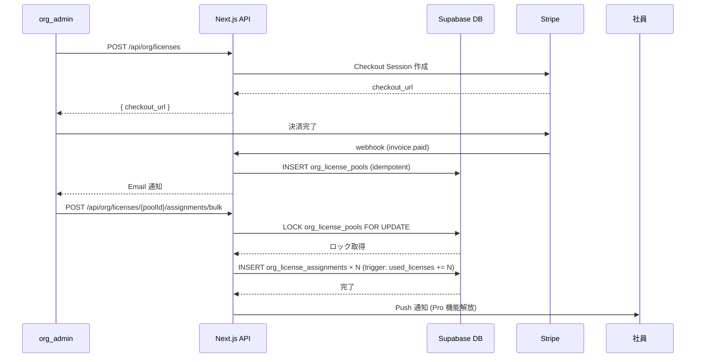
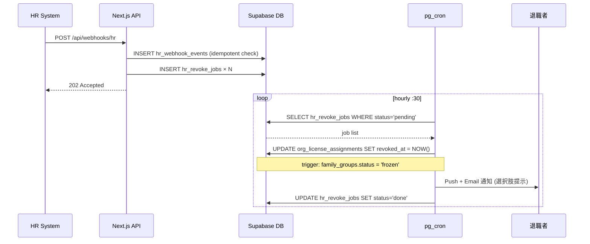

# org/ API 仕様

## 1. 目的・スコープ

組織管理ドメインの全 REST API エンドポイントのリクエスト・レスポンス・エラーコードを定義する。

共通規約は `cross/04-api-conventions.md` に従う。主な前提:
- 全エンドポイントは `/api/` プレフィックス、Next.js App Router Route Handler
- レスポンス body は snake_case JSON
- 認証: Supabase Auth セッション Cookie (+ Bearer token for webhook)
- ロール検証: `requireOrgRole(uid, orgId, [...])` ヘルパー使用
- `organization_id` は body から信頼せず `resolveOrganizationId(user, body.organization_id)` で server-side 解決 (canonical シグネチャは cross/01-auth-session.md §14.3 参照)

## 2. 関連要件

- 要件定義 02 §8 (API 仕様)
- 要件定義 02 §5.11-5.13 (ライセンス管理)
- 要件定義 02 §15.5 (bulk-revoke)

## 3. 共通エラーコード

| コード | HTTP | 意味 |
|--------|------|------|
| `ORG_NOT_FOUND` | 404 | 組織が存在しない |
| `ORG_PERMISSION_DENIED` | 403 | ロール不足 |
| `ORG_MEMBER_LIMIT_EXCEEDED` | 409 | プランのメンバー数上限超過 |
| `ORG_INVITE_DOMAIN_NOT_ALLOWED` | 422 | 招待 Email ドメインが allowlist 外 |
| `ORG_USER_ALREADY_IN_ORG` | 409 | 既に他組織に所属 |
| `ORG_DEPARTMENT_HAS_MEMBERS` | 409 | 部署にメンバーが残っている |
| `ORG_SUBSCRIPTION_SUSPENDED` | 402 | 契約一時停止中 |
| `ORG_PLAN_FEATURE_REQUIRED` | 402 | 上位プランが必要 |
| `CONFLICT_LICENSE_POOL_EXHAUSTED` | 409 | ライセンスプール枯渇 |
| `ORG_INVITE_EXPIRED` | 410 | 招待トークンが期限切れ |
| `ORG_INVITE_ALREADY_ACCEPTED` | 409 | 招待は既に使用済み |

## 4. 組織情報

### `GET /api/org/me`

**説明**: 呼び出し元が所属する組織情報とロール
**認証**: 必須 (任意の org ロール)

**レスポンス 200**:
```json
{
  "organization": {
    "id": "uuid",
    "name": "株式会社 ABC",
    "industry": "IT",
    "employee_count": 80,
    "plan_key": "org_pro",
    "subscription_status": "active",
    "logo_url": "https://...",
    "primary_color": "#FF6B6B",
    "settings": {
      "auto_assign_on_invite_accept": true,
      "freeze_grace_days": 30
    }
  },
  "my_roles": ["org_admin"],
  "member_count": 80,
  "department": {
    "id": "uuid",
    "name": "開発部"
  }
}
```

**エラー**:
- `403 ORG_PERMISSION_DENIED`: 組織未所属

---

### `PATCH /api/org/me`

**説明**: 組織基本情報更新
**認証**: `org_admin`

**リクエスト**:
```json
{
  "name": "株式会社 ABC 改名",
  "billing_email": "billing@example.com",
  "primary_color": "#336699",
  "settings": {
    "freeze_grace_days": 14
  }
}
```

**レスポンス 200**: 更新後の organization オブジェクト

**エラー**:
- `403 ORG_PERMISSION_DENIED`: org_admin 以外

---

### `GET /api/org/{id}`

**説明**: 組織詳細 (運営 admin / 自組織 org_admin)
**認証**: `super_admin` or 同組織 `org_admin`

**レスポンス 200**: organization オブジェクト (billing 情報含む)

---

## 5. メンバー管理

### `GET /api/org/members`

**認証**: `org_admin` | `org_manager` | `org_viewer`

**クエリパラメータ**:
| パラメータ | 型 | 説明 |
|-----------|-----|------|
| `q` | string | 名前 / Email / 社員番号 全文検索 |
| `department_id` | UUID | 部署フィルタ |
| `role` | string | ロールフィルタ |
| `is_active` | boolean | 在籍中のみ (デフォルト true) |
| `has_license` | boolean | ライセンス割当済のみ |
| `limit` | int | デフォルト 50、最大 200 |
| `offset` | int | ページング |

**レスポンス 200**:
```json
{
  "members": [
    {
      "user_id": "uuid",
      "display_name": "田中太郎",
      "email": "tanaka@example.com",
      "employee_id": "EMP001",
      "department": { "id": "uuid", "name": "営業部" },
      "roles": ["org_member"],
      "is_active_in_org": true,
      "joined_org_at": "2024-04-01",
      "last_sign_in_at": "2026-05-06T10:00:00Z",
      "license": {
        "pool_id": "uuid",
        "plan_key": "org_pro",
        "status": "active"
      }
    }
  ],
  "total": 80,
  "limit": 50,
  "offset": 0
}
```

---

### `POST /api/org/members`

**説明**: 直接アカウント作成 (Admin API 経由、招待不要)
**認証**: `org_admin`

**リクエスト**:
```json
{
  "email": "newuser@example.com",
  "display_name": "新入社員",
  "role": "org_member",
  "department_id": "uuid",
  "employee_id": "EMP100",
  "joined_org_at": "2026-06-01"
}
```

**レスポンス 201**:
```json
{
  "user_id": "uuid",
  "temporary_password": "Tmp@12345"
}
```

**エラー**:
- `409 ORG_USER_ALREADY_IN_ORG`: Email が既存

---

### `PATCH /api/org/members/{userId}`

**認証**: `org_admin` | `org_manager` (ロール変更は `org_admin` のみ)

**リクエスト**:
```json
{
  "department_id": "uuid",
  "role": "org_manager",
  "employee_id": "EMP002",
  "is_active_in_org": true
}
```

**レスポンス 200**: 更新後のメンバーオブジェクト

---

### `DELETE /api/org/members/{userId}`

**説明**: メンバー除名
**認証**: `org_admin` | `org_manager`

**リクエスト**:
```json
{
  "data_policy": "keep_personal",
  "reason": "退職",
  "notify_user": true
}
```

`data_policy`:
- `"keep_personal"`: organization_id = null にして個人アカウントとして残す (デフォルト)
- `"delete_account"`: auth.users から削除

**レスポンス 200**:
```json
{ "revoked_license_id": "uuid", "user_id": "uuid" }
```

**エラー**:
- `403`: 自分自身は除名不可

---

### `POST /api/org/members/bulk-import`

**説明**: CSV 一括招待
**認証**: `org_admin` | `org_manager`
**Content-Type**: `multipart/form-data`

**フォームフィールド**:
- `file`: CSV ファイル (UTF-8 or Shift-JIS 自動判定)
- `send_invite_email`: boolean (デフォルト true)
- `auto_assign_license`: boolean

**CSV 仕様**:
```
email,role,department,nickname,employee_id,joined_org_at
yamada@example.com,org_member,営業部,山田太郎,EMP001,2024-04-01
```

**レスポンス 202**:
```json
{
  "import_id": "uuid",
  "total_rows": 100,
  "status": "processing"
}
```

**エラー**:
- `422`: CSV フォーマット不正

---

### `GET /api/org/members/bulk-import/{importId}`

**説明**: 一括インポート進捗確認
**認証**: `org_admin` | `org_manager`

**レスポンス 200**:
```json
{
  "import_id": "uuid",
  "status": "processing",
  "total": 100,
  "processed": 85,
  "succeeded": 80,
  "failed": 5,
  "errors": [
    { "row": 12, "email": "bad@", "error": "INVALID_EMAIL_FORMAT" }
  ],
  "error_csv_url": "https://..."
}
```

---

## 6. 部署管理

### `GET /api/org/departments`

**説明**: 階層ツリー取得
**認証**: 任意の org ロール

**レスポンス 200**:
```json
{
  "departments": [
    {
      "id": "uuid",
      "name": "営業本部",
      "parent_id": null,
      "manager": { "user_id": "uuid", "display_name": "田中部長" },
      "member_count": 50,
      "children": [
        {
          "id": "uuid",
          "name": "関東支社",
          "parent_id": "uuid",
          "member_count": 20,
          "children": []
        }
      ]
    }
  ]
}
```

---

### `POST /api/org/departments`

**認証**: `org_admin` | `org_manager`

**リクエスト**:
```json
{
  "name": "営業 1 課",
  "parent_id": "uuid",
  "manager_id": "uuid",
  "display_order": 1
}
```

**レスポンス 201**: 作成後の department オブジェクト

**エラー**:
- `422`: 3 階層超過

---

### `PATCH /api/org/departments/{id}`

**認証**: `org_admin` | `org_manager`

---

### `DELETE /api/org/departments/{id}`

**認証**: `org_admin`

**エラー**:
- `409 ORG_DEPARTMENT_HAS_MEMBERS`: 配下メンバーあり (移動先必須)
- `409`: サブ部署あり

---

### `POST /api/org/departments/{id}/move-members`

**説明**: 一括メンバー移動
**認証**: `org_admin` | `org_manager`

**リクエスト**:
```json
{
  "user_ids": ["uuid", "uuid"],
  "to_department_id": "uuid",
  "reason": "組織改編"
}
```

**レスポンス 200**:
```json
{ "moved": 15, "failed": 0 }
```

---

## 7. 招待

### `GET /api/org/invites`

**認証**: `org_admin` | `org_manager`

**クエリパラメータ**: `status` (pending|accepted|expired|cancelled), `limit`, `offset`

**レスポンス 200**:
```json
{
  "invites": [
    {
      "id": "uuid",
      "email": "new@example.com",
      "role": "org_member",
      "department": { "name": "営業部" },
      "status": "pending",
      "expires_at": "2026-05-20T12:00:00Z",
      "invited_by": { "display_name": "田中太郎" },
      "created_at": "2026-05-06T10:00:00Z"
    }
  ],
  "total": 25
}
```

---

### `POST /api/org/invites`

**説明**: 個別招待
**認証**: `org_admin` | `org_manager`

**リクエスト**:
```json
{
  "email": "newmember@example.com",
  "role": "org_member",
  "department_id": "uuid",
  "nickname": "山田花子",
  "employee_id": "EMP050",
  "custom_message": "ご参加お待ちしています"
}
```

**レスポンス 201**:
```json
{
  "invite_id": "uuid",
  "invite_url": "https://homegohan.app/invite/org/{token}",
  "expires_at": "2026-05-20T12:00:00Z"
}
```

**エラー**:
- `422 ORG_INVITE_DOMAIN_NOT_ALLOWED`
- `409 ORG_MEMBER_LIMIT_EXCEEDED`

---

### `POST /api/org/invites/bulk`

**説明**: CSV 一括招待
**認証**: `org_admin` | `org_manager`
**Content-Type**: `multipart/form-data`

同形式 → `POST /api/org/members/bulk-import` と同じ形式で CSV 受取

---

### `POST /api/org/invites/{id}/resend`

**説明**: 招待メール再送
**認証**: `org_admin` | `org_manager`

**レート制限**: 1 招待あたり 1 日 3 回

**レスポンス 200**:
```json
{ "resent": true, "expires_at": "2026-05-21T10:00:00Z" }
```

---

### `GET /api/org/invites/{token}`

**説明**: 招待トークン検証 (認証不要、受諾画面用)
**認証**: 不要

**レスポンス 200**:
```json
{
  "organization": { "id": "uuid", "name": "株式会社 ABC", "logo_url": "https://..." },
  "role": "org_member",
  "department": { "name": "営業部" },
  "invited_by_name": "田中太郎",
  "expires_at": "2026-05-20T12:00:00Z"
}
```

**エラー**:
- `410 ORG_INVITE_EXPIRED`
- `409 ORG_INVITE_ALREADY_ACCEPTED`
- `404 ORG_NOT_FOUND`

---

### `POST /api/org/invites/{token}/accept`

**説明**: 組織招待受諾
**認証**: 必須 (受諾するユーザー)

**レスポンス 200**:
```json
{
  "organization_id": "uuid",
  "role": "org_member",
  "redirect_to": "/org/dashboard"
}
```

**エラー**:
- `410 ORG_INVITE_EXPIRED`
- `409 ORG_INVITE_ALREADY_ACCEPTED`
- `409 ORG_USER_ALREADY_IN_ORG`: 既に別組織所属 (複数組織所属は許可、ただしプライマリ設定の確認を求める)

---

## 8. チャレンジ

### `GET /api/org/challenges`

**認証**: 任意の org ロール

**クエリ**: `status` (draft|active|completed|cancelled), `limit`, `offset`

**レスポンス 200**:
```json
{
  "challenges": [
    {
      "id": "uuid",
      "title": "みんなで朝食習慣チャレンジ",
      "challenge_type": "breakfast_rate",
      "status": "active",
      "starts_at": "2026-06-01T00:00:00Z",
      "ends_at": "2026-06-30T23:59:59Z",
      "participant_count": 65,
      "achievement_rate": 0.42
    }
  ]
}
```

---

### `POST /api/org/challenges`

**認証**: `org_admin` | `org_manager`

**リクエスト**:
```json
{
  "title": "朝食習慣チャレンジ",
  "description": "1 ヶ月で朝食を毎日食べよう！",
  "challenge_type": "breakfast_rate",
  "target_scope": "organization",
  "goal_value": 80,
  "goal_unit": "%",
  "starts_at": "2026-06-01T00:00:00Z",
  "ends_at": "2026-06-30T23:59:59Z",
  "reward_text": "達成者には 1,000 ポイント",
  "auto_join": false
}
```

**レスポンス 201**: 作成後の challenge オブジェクト

---

### `PATCH /api/org/challenges/{id}`

**認証**: `org_admin` | `org_manager`

ステータス遷移: `draft → active`, `active → completed | cancelled`

---

### `DELETE /api/org/challenges/{id}`

**認証**: `org_admin`

`status = 'draft'` のみ削除可

---

### `POST /api/org/challenges/{id}/join`

**説明**: チャレンジ参加 (org_member 自身)
**認証**: `org_member` 以上

---

### `GET /api/org/challenges/{id}/participants`

**認証**: `org_admin` | `org_manager`

---

### `GET /api/org/challenges/{id}/results`

**説明**: 達成者リスト CSV ダウンロード
**認証**: `org_admin` | `org_manager`

**レスポンス**: `text/csv` ストリーム

---

## 9. ダッシュボード

### `GET /api/org/dashboard`

**認証**: `org_admin` | `org_manager` | `org_viewer`

**クエリ**: `period` (7d|30d|90d|1y), `department_id`

**レスポンス 200**:
```json
{
  "summary": {
    "member_count": 80,
    "active_member_count": 65,
    "participation_rate": 0.81,
    "avg_health_score": 72.5,
    "breakfast_rate": 0.65,
    "homecook_rate": 0.45,
    "challenge_achievement_rate": 0.42
  },
  "trends": [
    { "date": "2026-04-01", "avg_health_score": 70.2, "breakfast_rate": 0.60 }
  ],
  "department_heatmap": [
    { "department_id": "uuid", "name": "営業部", "avg_score": 68.0, "status": "alert" }
  ],
  "recent_activities": []
}
```

---

## 10. 産業医

### `GET /api/org/health/patients`

**説明**: 同意済メンバー一覧
**認証**: `org_industrial_doctor` (同組織)

**レスポンス 200**:
```json
{
  "patients": [
    {
      "user_id": "uuid",
      "display_name": "田中太郎",
      "department": { "name": "営業部" },
      "consent_at": "2026-04-01T12:00:00Z",
      "last_health_score": 68.5,
      "last_checkup_date": "2025-11-15",
      "has_unread_notes": false
    }
  ]
}
```

---

### `GET /api/org/health/patients/{userId}`

**認証**: `org_industrial_doctor` (同組織)

**server-side 検証** (必須):
1. `caller.roles.includes('org_industrial_doctor')`
2. `target.organization_id === caller.organization_id`
3. `target.consent_org_health_data === true`
4. `target.is_active_in_org === true`
5. 組織プランが `org_pro` or `org_enterprise`

**レスポンス 200**:
```json
{
  "user_id": "uuid",
  "display_name": "田中太郎",
  "nutrition_trends": {
    "weekly": [{ "week": "2026-W17", "calories": 1850, "protein": 72, "salt": 9.2 }]
  },
  "health_scores": [{ "date": "2026-05-01", "score": 68 }],
  "checkups": [{ "date": "2025-11-15", "bmi": 24.1, "hba1c": 6.2 }],
  "notes": [{ "id": "uuid", "category": "consultation", "created_at": "..." }]
}
```

---

### `POST /api/org/health/patients/{userId}/notes`

**認証**: `org_industrial_doctor` (同組織)

**リクエスト**:
```json
{
  "note": "塩分摂取が多い傾向。来月の健診前に改善指導を行った。",
  "category": "guidance"
}
```

**レスポンス 201**: 作成後の note オブジェクト

---

### `POST /api/org/health/patients/{userId}/ai-advice`

**説明**: Claude Sonnet による個別アドバイス生成 (Org Pro 以上)
**認証**: `org_industrial_doctor` (同組織)

**リクエスト**:
```json
{
  "period_start": "2026-04-01",
  "period_end": "2026-04-30",
  "focus_areas": ["nutrition", "lifestyle"]
}
```

**処理フロー**:
1. server-side 検証 (上記 5 項目)
2. `org_health_access_logs` に `access_type='ai_advice'` 記録
3. Edge Function `industrial-doctor-advice` へ委譲
4. 結果を `org_health_notes` に `is_ai_generated=true` で保存

**レスポンス 200**:
```json
{
  "advice": "今月は塩分摂取量が目標を上回っています...",
  "note_id": "uuid",
  "model": "claude-3-5-sonnet-20241022",
  "token_usage": { "input": 1200, "output": 450 }
}
```

**エラー**:
- `402 ORG_PLAN_FEATURE_REQUIRED`: Pro 未満
- `403`: 退職者 / 未同意 / 別組織

---

## 11. 課金

### `GET /api/org/subscription`

**認証**: `org_admin`

**レスポンス 200**: 現在の org_subscriptions 行 + Stripe Customer Portal URL

---

### `POST /api/org/subscription/upgrade`

**認証**: `org_admin`

**リクエスト**:
```json
{ "plan_key": "org_pro", "billing_cycle": "yearly" }
```

→ Stripe Checkout セッション生成

**レスポンス 200**:
```json
{ "checkout_url": "https://checkout.stripe.com/..." }
```

---

### `POST /api/org/subscription/cancel`

**認証**: `org_admin`

**レスポンス 200**:
```json
{ "cancelled_at": "2026-05-06T12:00:00Z", "effective_end": "2026-05-31T23:59:59Z" }
```

---

### `GET /api/org/invoices`

**認証**: `org_admin`

---

## 12. ライセンス管理 (P0)

### `GET /api/org/licenses`

**認証**: `org_admin` | `org_manager` | `org_viewer`

**レスポンス 200**:
```json
{
  "pools": [
    {
      "id": "uuid",
      "plan_key": "org_pro",
      "total_licenses": 100,
      "used_licenses": 67,
      "available_licenses": 33,
      "family_addon_seats": 4,
      "starts_at": "2026-01-01T00:00:00Z",
      "ends_at": "2026-12-31T23:59:59Z",
      "billing_cycle": "yearly"
    }
  ],
  "total_active_members": 67,
  "unassigned_members": 13
}
```

---

### `POST /api/org/licenses`

**説明**: ライセンス購入 (Stripe Checkout 起動)
**認証**: `org_admin`

**リクエスト**:
```json
{
  "plan_key": "org_pro",
  "quantity": 100,
  "billing_cycle": "monthly",
  "include_family_addon": true,
  "family_seats_per_member": 4
}
```

**レスポンス 200**:
```json
{ "checkout_url": "https://checkout.stripe.com/..." }
```

---

### `GET /api/org/licenses/{poolId}/assignments`

**認証**: `org_admin` | `org_manager` | `org_viewer`

**クエリ**: `status` (active|revoked|expired), `user_id`, `limit`, `offset`

---

### `POST /api/org/licenses/{poolId}/assignments`

**説明**: 個別割当
**認証**: `org_admin` | `org_manager`

**リクエスト**:
```json
{
  "user_id": "uuid",
  "notes": "優先割当"
}
```

**レスポンス 201**: 作成後の assignment オブジェクト

**エラー**:
- `409 CONFLICT_LICENSE_POOL_EXHAUSTED`: 空きなし

---

### `POST /api/org/licenses/{poolId}/assignments/bulk`

**説明**: CSV 一括割当
**認証**: `org_admin` | `org_manager`

**リクエスト**: `multipart/form-data`, CSV: `email,assignment_note`

**レスポンス 202**:
```json
{ "job_id": "uuid", "total": 50, "status": "processing" }
```

---

### `POST /api/org/licenses/assignments/bulk-revoke`

**説明**: 緊急 bulk-revoke (§15.5)
**認証**: `org_admin`

**リクエスト**:
```json
{
  "user_ids": ["uuid", "uuid"],
  "reason": "hr_webhook",
  "notify_users": true
}
```

**処理**:
1. `acquire_advisory_lock('bulk-revoke:' || org_id)` 取得 (cross/02-rls-patterns.md §6.3 ラッパー経由)
2. `org_license_assignments SET status='revoked', revoked_at=NOW()` (batch UPDATE)
3. `sync_org_license_pool_usage` トリガーで used_licenses 減算
4. `org_license_audit_log` に記録
5. 非同期で通知送信

**レスポンス 200**:
```json
{
  "revoked": 5,
  "failed": 0,
  "audit_log_ids": ["uuid"]
}
```

---

## 13. 家族同梱

### `POST /api/org/family-addon/distribute`

**説明**: 組織が家族プランを対象社員に一括配布
**認証**: `org_admin`

**リクエスト**:
```json
{
  "user_ids": ["uuid"],
  "family_seats": 4,
  "notify_users": true
}
```

**レスポンス 200**:
```json
{ "distributed": 30, "failed": 0 }
```

---

## 14. HR Webhook (受信)

### `POST /api/webhooks/hr`

**説明**: 外部 HR システムからの退職・入社イベント受信
**認証**: Bearer token (organizations.scim_token_hash で検証)

**リクエスト**:
```json
{
  "event_type": "employee_terminated",
  "external_id": "hr-event-2026050601",
  "organization_id": "uuid",
  "employees": [
    {
      "employee_id": "EMP001",
      "email": "tanaka@example.com",
      "termination_date": "2026-05-31"
    }
  ]
}
```

**冪等化**:
- `(organization_id, external_id)` をユニーク制約でチェック
- 重複受信時は 200 を返し処理しない

**処理フロー**:
1. Bearer token 検証
2. `hr_webhook_events` に raw 保存
3. `hr_revoke_jobs` を `employees` 件数分 INSERT (status=pending)
4. 即座に 202 を返す (非同期処理)

**レスポンス 202**:
```json
{
  "event_id": "uuid",
  "jobs_queued": 3,
  "idempotent": false
}
```

重複時: `{ "idempotent": true, "event_id": "uuid" }`

**エラー**:
- `401`: token 不正
- `422`: payload スキーマ不正

---

## 15. シーケンス (Mermaid)

### ライセンス購入 → 配布フロー



### HR Webhook 退職フロー



## 16. エラーハンドリング

- `CONFLICT_LICENSE_POOL_EXHAUSTED`: PostgreSQL RAISE EXCEPTION を API 層で catch → 409 返却
- HR Webhook 処理中の失敗: `hr_revoke_jobs.attempts += 1`、exponential backoff (`2^attempts * 60s`)、5 回失敗で `dead_letter` に遷移
- Stripe Checkout タイムアウト: `org_license_pools` への INSERT はなし、冪等キーで再試行可

## 17. テスト方針

主要テストケース:

1. `it('returns 403 when org_member calls PATCH /api/org/members')`
2. `it('returns 409 when 6th license assignment is attempted with total=5 pool')`
3. `it('returns idempotent=true on second POST /api/webhooks/hr with same external_id')`
4. `it('returns 403 when industrial doctor accesses other org patient')`
5. `it('returns 200 with paginated members list for org_admin')`
6. `it('returns 422 when CSV contains duplicate email addresses')`
7. `it('returns 200 and triggers freeze when HR revoke webhook is received')`

```typescript
// tests/integration/org/api-permissions.integration.test.ts
import { describe, it, expect } from 'vitest';

describe('GET /api/org/members - 権限テスト', () => {
  it('returns 200 with paginated member list for org_admin', async () => {
    const res = await fetch(`${BASE_URL}/api/org/members`, {
      headers: { Authorization: `Bearer ${orgAdminToken}` },
    });
    expect(res.status).toBe(200);
    const body = await res.json();
    expect(body.data).toBeInstanceOf(Array);
    expect(body.pagination).toBeDefined();
  });

  it('returns 403 when org_member calls PATCH /api/org/members', async () => {
    const res = await fetch(
      `${BASE_URL}/api/org/members/${faker.string.uuid()}`,
      {
        method: 'PATCH',
        headers: {
          Authorization: `Bearer ${orgMemberToken}`,
          'Content-Type': 'application/json',
        },
        body: JSON.stringify({ role: 'org_admin' }),
      },
    );
    expect(res.status).toBe(403);
    const body = await res.json();
    expect(body.error.code).toBe('ORG_FORBIDDEN');
  });

  it('returns 403 when industrial doctor accesses other org patient', async () => {
    // doctor@test.local は orgs[0] 所属
    // other-org-patient は orgs[1] のメンバー
    const res = await fetch(
      `${BASE_URL}/api/org/industrial-doctor/patients/${otherOrgPatientId}`,
      { headers: { Authorization: `Bearer ${doctorToken}` } },
    );
    expect(res.status).toBe(403);
    const body = await res.json();
    expect(body.error.code).toBe('ORG_CROSS_ACCESS_DENIED');
  });
});

describe('POST /api/org/licenses - ライセンス枯渇テスト', () => {
  it('returns 409 when 6th license assignment is attempted with total=5 pool', async () => {
    const pool = await createOrgLicensePoolInDB(supabaseAdmin, {
      total_licenses: 5,
      used_licenses: 5,
    });

    const res = await fetch(`${BASE_URL}/api/org/licenses`, {
      method: 'POST',
      headers: {
        Authorization: `Bearer ${orgAdminToken}`,
        'Content-Type': 'application/json',
      },
      body: JSON.stringify({
        license_pool_id: pool.id,
        user_id: faker.string.uuid(),
      }),
    });
    expect(res.status).toBe(409);
    const body = await res.json();
    expect(body.error.code).toBe('ORG_LICENSE_POOL_EXHAUSTED');
  });
});

describe('POST /api/webhooks/hr - 冪等テスト', () => {
  it('returns idempotent=true on second POST with same external_id', async () => {
    const payload = {
      external_id: `hr-revoke-${faker.string.uuid()}`,
      action: 'revoke',
      user_id: orgMemberId,
      timestamp: new Date().toISOString(),
    };

    const sign = (body: string) => ({
      'X-HR-Signature': `sha256=${createHmac('sha256', process.env.HR_WEBHOOK_SECRET!)
        .update(body)
        .digest('hex')}`,
    });

    const body1 = JSON.stringify(payload);
    const res1 = await fetch(`${BASE_URL}/api/webhooks/hr`, {
      method: 'POST',
      headers: { 'Content-Type': 'application/json', ...sign(body1) },
      body: body1,
    });
    expect(res1.status).toBe(200);

    const res2 = await fetch(`${BASE_URL}/api/webhooks/hr`, {
      method: 'POST',
      headers: { 'Content-Type': 'application/json', ...sign(body1) },
      body: body1,
    });
    expect(res2.status).toBe(200);
    const body2 = await res2.json();
    expect(body2.idempotent).toBe(true);
  });
});

describe('POST /api/org/members/bulk-csv - バリデーション', () => {
  it('returns 422 when CSV contains duplicate email addresses', async () => {
    const csvContent = [
      'email,name,department',
      'dup@example.com,田中,営業部',
      'dup@example.com,田中2,開発部', // 重複
    ].join('\n');

    const formData = new FormData();
    formData.append(
      'file',
      new Blob([csvContent], { type: 'text/csv' }),
      'members.csv',
    );

    const res = await fetch(`${BASE_URL}/api/org/members/bulk-csv`, {
      method: 'POST',
      headers: { Authorization: `Bearer ${orgAdminToken}` },
      body: formData,
    });
    expect(res.status).toBe(422);
    const body = await res.json();
    expect(body.error.code).toBe('ORG_CSV_DUPLICATE_EMAIL');
  });
});
```

## 18. 既存実装との関連

- `GET /api/org/me`, `GET /api/org/dashboard`: 保持・拡張
- 旧 `/api/org/users`, `/api/org/stats`, `/api/org/departments` (旧形式): 削除済み (commit 32d13e1)
- 全エンドポイントは `cross/04-api-conventions.md` のエラーコード体系に準拠

## 19. 未解決事項

- `POST /api/org/licenses` の Stripe Price ID と `plan_key` のマッピング: `operator/05-stripe-integration.md` で確定後に参照
- CSV 一括処理の並行実行制御: Redis job queue (Upstash) vs pg_cron の選択 → アーキテクチャ決定待ち
- HR Webhook の HMAC 検証形式: HR ベンダーごとに異なる可能性あり → Enterprise 契約時に個別対応
