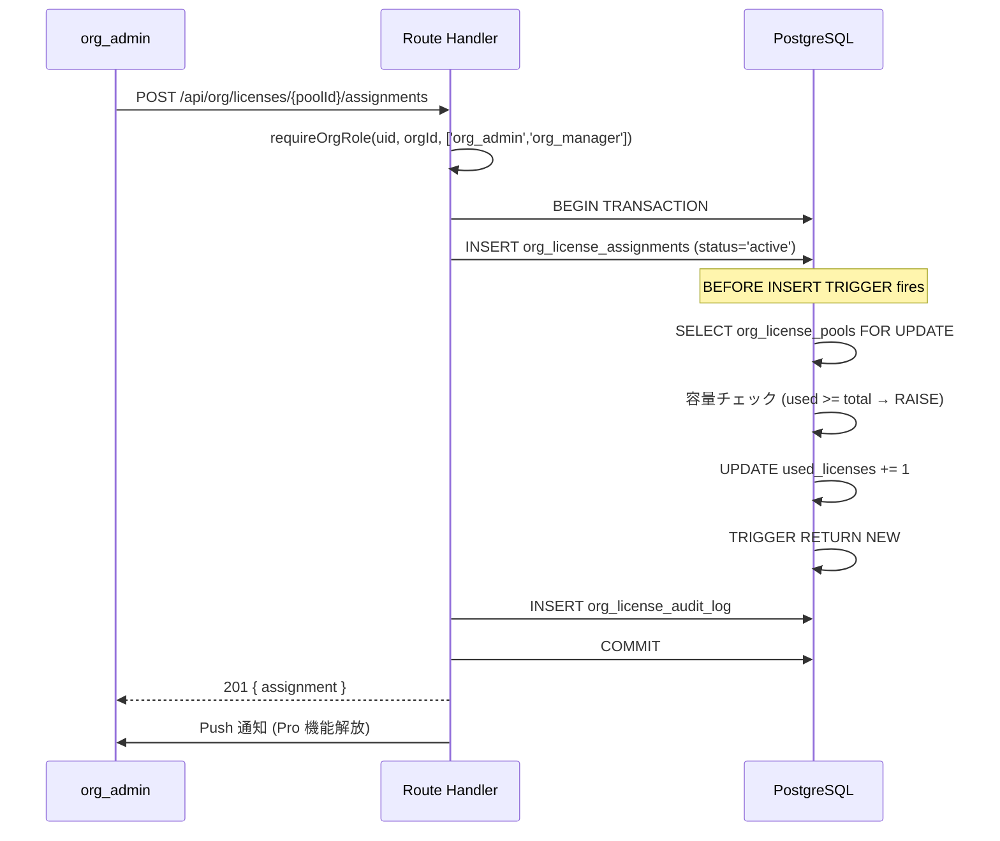
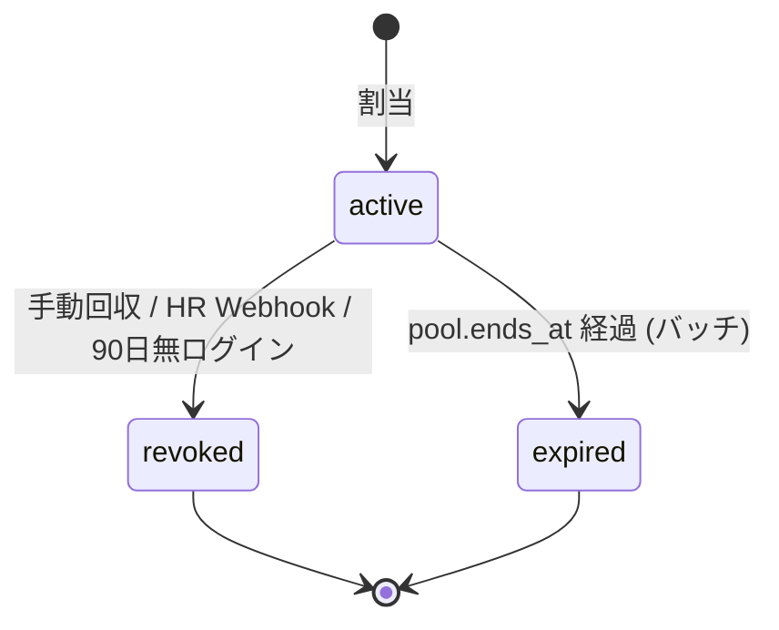

# org/ ライセンス管理

## 1. 目的・スコープ

F-ORG-011〜013 で定義されるライセンスプール・配布・家族同梱・利用分析の詳細設計。

対象:
- F-ORG-011: ライセンスプール / 個別 + CSV 配布 / 解除再配布 / 上下プラン / 個人プラン共存
- F-ORG-012: 家族プラン同梱配布 (人数管理 / 退職時オプション)
- F-ORG-013: ライセンス利用分析 (使用率 / ROI / 監査出力)
- §15.5: 緊急 bulk-revoke 手順
- §5.11.7: `getUserActivePlan()` の複数組織対応

## 2. 関連要件

- 要件定義 02 §5.11 (F-ORG-011)
- 要件定義 02 §5.12 (F-ORG-012)
- 要件定義 02 §5.13 (F-ORG-013)
- 要件定義 02 §15.5 (緊急 bulk-revoke)

## 3. ライセンスプール設計 (F-ORG-011)

### 3.1 プール構造

```
組織 (organizations)
  └── org_license_pools × N
        ├── plan_key = 'org_starter'   (50 枚)
        ├── plan_key = 'org_pro'       (100 枚)
        └── plan_key = 'family_addon'  (30 枚)
              └── org_license_assignments × M
                    ├── user_id = 社員 A (status=active)
                    ├── user_id = 社員 B (status=active)
                    └── user_id = 社員 C (status=revoked) -- 回収済
```

1 組織が複数プールを所持可能 (プラン混在対応)。

### 3.2 available_licenses GENERATED ALWAYS 列

```sql
available_licenses INT GENERATED ALWAYS AS (total_licenses - used_licenses) STORED
```

- `available_licenses` への直接 UPDATE は PostgreSQL が `ERROR: column is a generated column` で拒否する
- `used_licenses` の増減は `sync_org_license_pool_usage` トリガーのみ担当
- `CHECK (total_licenses >= used_licenses)` で負値防止

### 3.3 同時 INSERT 競合防御

`sync_org_license_pool_usage` トリガーが `SELECT ... FOR UPDATE` で `org_license_pools` 行を排他ロックする。
同一プールへの同時 INSERT は PostgreSQL のトランザクションキューで直列化される。

```sql
CREATE OR REPLACE FUNCTION sync_org_license_pool_usage()
RETURNS TRIGGER LANGUAGE plpgsql SECURITY DEFINER
SET search_path = public AS $$
DECLARE
  v_pool RECORD;
BEGIN
  IF (TG_OP = 'INSERT' AND NEW.status = 'active') THEN
    -- 排他ロック: 同一プールへの並行 INSERT を直列化
    SELECT id, total_licenses, used_licenses, organization_id
      INTO v_pool
      FROM org_license_pools
      WHERE id = NEW.license_pool_id
      FOR UPDATE;

    IF NOT FOUND THEN
      RAISE EXCEPTION 'license_pool_not_found' USING ERRCODE = 'P0002';
    END IF;

    -- 容量超過チェック (CHECK 制約より明示的に先に検出)
    IF v_pool.used_licenses >= v_pool.total_licenses THEN
      RAISE EXCEPTION 'license_pool_exhausted'
        USING HINT = 'Pool full: ' || v_pool.used_licenses || '/' || v_pool.total_licenses,
              ERRCODE = 'P0001';
    END IF;

    -- denormalize organization_id
    NEW.organization_id := v_pool.organization_id;

    -- 加算 (FOR UPDATE 中なので race condition なし)
    UPDATE org_license_pools
      SET used_licenses = used_licenses + 1, updated_at = NOW()
      WHERE id = NEW.license_pool_id;

  ELSIF (TG_OP = 'UPDATE'
         AND OLD.status = 'active'
         AND NEW.status IN ('revoked', 'expired')) THEN
    -- 減算 (回収時)
    PERFORM 1 FROM org_license_pools WHERE id = NEW.license_pool_id FOR UPDATE;
    UPDATE org_license_pools
      SET used_licenses = GREATEST(used_licenses - 1, 0), updated_at = NOW()
      WHERE id = NEW.license_pool_id;
  END IF;

  RETURN NEW;
END;
$$;
```

### 3.4 容量超過時のエラーハンドリング

| レイヤー | 処理 |
|---------|------|
| DB (トリガー) | `RAISE EXCEPTION 'license_pool_exhausted' ERRCODE='P0001'` |
| API (Route Handler) | PostgreSQL error code `P0001` を catch → `409 CONFLICT_LICENSE_POOL_EXHAUSTED` |
| UI | `ConflictModal` で「ライセンスが不足しています」+ 追加購入リンク |

```typescript
// API Route Handler での catch 例
try {
  await supabase.from('org_license_assignments').insert({ ... });
} catch (err: unknown) {
  // PostgreSQL エラーは PostgrestError を継承、code/message/hint を持つ
  const pgErr = err as { code?: string; message?: string; hint?: string };
  if (pgErr.code === 'P0001' && pgErr.message?.includes('license_pool_exhausted')) {
    return Response.json(
      { error: 'CONFLICT_LICENSE_POOL_EXHAUSTED', hint: pgErr.hint },
      { status: 409 }
    );
  }
  throw err;
}
```

### 3.5 個別割当フロー



### 3.6 CSV 一括割当フロー

```typescript
// bulk assign の実装概要
async function bulkAssignLicenses(
  poolId: string,
  rows: { email: string; notes?: string }[]
): Promise<BulkAssignResult> {
  const results: AssignResult[] = [];

  // バッチを 10 件ずつに分割してトランザクション負荷を分散
  for (const batch of chunk(rows, 10)) {
    const { data: users } = await supabase
      .from('user_profiles')
      .select('id, email')
      .in('email', batch.map(r => r.email));

    for (const row of batch) {
      const user = users?.find(u => u.email === row.email);
      if (!user) {
        results.push({ email: row.email, success: false, error: 'USER_NOT_FOUND' });
        continue;
      }

      try {
        await supabase.from('org_license_assignments').insert({
          license_pool_id: poolId,
          user_id: user.id,
          assigned_by: authUid,
          notes: row.notes,
        });
        results.push({ email: row.email, success: true });
      } catch (err: unknown) {
        const pgErr = err as { code?: string; message?: string };
        if (pgErr.code === 'P0001') {
          // プール枯渇: 残り割当を中断
          return { ...results, exhausted: true };
        }
        results.push({ email: row.email, success: false, error: pgErr.message ?? 'unknown' });
      }
    }
  }
  return { results, exhausted: false };
}
```

### 3.7 ライセンス回収・再割当

**手動回収**:
```sql
UPDATE org_license_assignments
  SET status = 'revoked',
      revoked_at = NOW(),
      revoked_by = $actor_id,
      revoke_reason = 'manual',
      updated_at = NOW()
  WHERE id = $assignment_id
    AND status = 'active';
-- TRIGGER: sync_org_license_pool_usage で used_licenses -= 1
```

**自動回収 (90 日無ログイン)**:
```sql
-- pg_cron 日次バッチ
UPDATE org_license_assignments ola
  SET status = 'revoked',
      revoked_at = NOW(),
      revoke_reason = 'inactive_90d',
      updated_at = NOW()
  FROM auth.users au
  WHERE ola.user_id = au.id
    AND ola.status = 'active'
    AND au.last_sign_in_at < NOW() - INTERVAL '90 days';
```

### 3.8 アップグレード・ダウングレード

**全員一括アップグレード (Standard → Pro)**:
```
1. POST /api/org/licenses (新規 Pro プール購入, quantity=現在 Standard 人数)
2. POST /api/org/licenses/{newPoolId}/assignments/bulk (全 Standard 割当ユーザーを対象に CSV)
3. 古い Standard assignments を revoke (revoke_reason='plan_change')
4. Stripe で Standard サブスク解約 + Pro サブスク開始 (日割り精算)
```

**個別プラン変更**: 同じフロー、対象 user_id を指定

## 4. 家族プラン同梱配布 (F-ORG-012)

### 4.1 ライセンス紐付け構造

```
Org License Pool (org_pro)
  org_license_assignments
    id = asm_001 (user_id = 社員 A, family_addon_seats=4, family_seats_used=3)
      ↓ (family_groups.source_org_assignment_id = asm_001)
    Family Group (社員 A + 配偶者 + 子供 2 名)
      family_members (4 名全員が Pro 機能)
```

### 4.2 家族メンバー数管理

```sql
-- 家族シート使用数を org_license_assignments に反映するトリガー関数
-- family/07-lifecycle.md と連携 (family ドメインからの更新)
CREATE OR REPLACE FUNCTION update_family_seats_used()
RETURNS TRIGGER LANGUAGE plpgsql
SECURITY DEFINER
SET search_path = public
AS $$
BEGIN
  -- AFTER トリガーのため RETURN 値は無視されるが、慣習で COALESCE(NEW, OLD) を返す
  -- INSERT/UPDATE 時は NEW、DELETE 時は OLD を使用して対象グループを特定する
  UPDATE org_license_assignments
    SET family_seats_used = (
      SELECT COUNT(*) FROM family_members fm
        JOIN family_groups fg ON fm.family_group_id = fg.id
        WHERE fg.source_org_assignment_id = org_license_assignments.id
          AND fm.is_active = TRUE
    ),
    updated_at = NOW()
    WHERE id = (
      SELECT source_org_assignment_id FROM family_groups
        WHERE id = COALESCE(NEW.family_group_id, OLD.family_group_id)
    );
  RETURN COALESCE(NEW, OLD);
END;
$$;

-- トリガー登録: AFTER INSERT OR UPDATE OR DELETE ON family_members
CREATE TRIGGER trg_update_family_seats_used
  AFTER INSERT OR UPDATE OR DELETE ON family_members
  FOR EACH ROW
  EXECUTE FUNCTION update_family_seats_used();
```

### 4.3 退職時の家族グループ処理

退職時オプション (退職者が 30 日以内に選択):

| オプション | 処理 |
|-----------|------|
| **個人プランへ移行** | `family_groups.source_org_assignment_id = NULL`、`status = 'active'` に戻す + Stripe 個人プラン開始 |
| **オーナー譲渡** | `family_groups.owner_id` を変更 (譲渡先が個人プランで課金) |
| **解散** | `family_groups.status = 'archived'` + 全メンバーへ通知 + 90 日後物理削除 (dissolved は archived に統一) |

30 日猶予期間中は:
- 食事記録の新規作成: 不可
- 既存データ閲覧: 可
- 新規招待: 不可

詳細は `05-offboarding-flow.md` を参照。

## 5. ライセンス利用分析 (F-ORG-013)

### 5.1 使用率レポートクエリ

```sql
-- 月別使用率
SELECT
  DATE_TRUNC('month', ola.assigned_at) AS month,
  olp.plan_key,
  COUNT(*) FILTER (WHERE ola.status = 'active') AS active_count,
  olp.total_licenses,
  ROUND(COUNT(*) FILTER (WHERE ola.status = 'active')::NUMERIC
        / NULLIF(olp.total_licenses, 0) * 100, 1) AS usage_rate_pct
FROM org_license_assignments ola
  JOIN org_license_pools olp ON ola.license_pool_id = olp.id
WHERE olp.organization_id = $org_id
GROUP BY 1, 2, olp.id, olp.total_licenses
ORDER BY 1 DESC;
```

### 5.2 未使用ライセンス候補リスト

```sql
-- 90 日無ログイン候補
SELECT
  ola.id AS assignment_id,
  up.display_name,
  up.email,
  au.last_sign_in_at,
  olp.plan_key,
  AGE(NOW(), au.last_sign_in_at) AS inactive_duration
FROM org_license_assignments ola
  JOIN user_profiles up ON ola.user_id = up.id
  JOIN auth.users au ON up.id = au.id
  JOIN org_license_pools olp ON ola.license_pool_id = olp.id
WHERE ola.organization_id = $org_id
  AND ola.status = 'active'
  AND au.last_sign_in_at < NOW() - INTERVAL '90 days'
ORDER BY au.last_sign_in_at ASC;
```

### 5.3 ROI レポート (Pro 以上)

```typescript
interface RoiReport {
  period: { start: string; end: string };
  total_cost_jpy: number;
  active_users: number;
  cost_per_active_user_jpy: number;
  avg_health_score_before: number;
  avg_health_score_after: number;
  health_score_improvement: number;
  // 健康スコア 1 点改善 = 約 X 円の医療費削減 (モデル値)
  estimated_medical_cost_saving_jpy: number;
}
```

### 5.4 監査出力

```sql
-- 監査ログ CSV 出力用クエリ
SELECT
  olal.created_at,
  olal.action_type,
  up.email AS actor_email,
  olal.details,
  olp.plan_key
FROM org_license_audit_log olal
  LEFT JOIN user_profiles up ON olal.actor_id = up.id
  LEFT JOIN org_license_pools olp ON olal.license_pool_id = olp.id
WHERE olal.organization_id = $org_id
  AND olal.created_at BETWEEN $start AND $end
ORDER BY olal.created_at DESC;
```

## 6. 緊急 bulk-revoke 手順 (§15.5)

### 6.1 トリガー条件

- 組織契約解除時 (即時全員 revoke)
- セキュリティインシデント発生時
- HR Webhook で大量退職者リスト受信時

### 6.2 bulk-revoke API

`POST /api/org/licenses/assignments/bulk-revoke`

```typescript
async function bulkRevoke(
  orgId: string,
  userIds: string[],
  reason: string,
  actorId: string
): Promise<BulkRevokeResult> {
  // advisory lock: 同一 org への並行 bulk-revoke を防ぐ (cross/02-rls-patterns.md §ラッパー経由必須)
  await supabase.rpc('acquire_advisory_lock', { lock_key: 'bulk-revoke:' + orgId });

  const { data, error } = await supabase
    .from('org_license_assignments')
    .update({
      status: 'revoked',
      revoked_at: new Date().toISOString(),
      revoked_by: actorId,
      revoke_reason: reason,
    })
    .eq('organization_id', orgId)
    .in('user_id', userIds)
    .eq('status', 'active')
    .select('id, user_id, license_pool_id');

  // TRIGGER sync_org_license_pool_usage が自動的に used_licenses を減算

  // 監査ログ一括書き込み
  await supabase.from('org_license_audit_log').insert(
    data.map(a => ({
      organization_id: orgId,
      license_pool_id: a.license_pool_id,
      assignment_id: a.id,
      actor_id: actorId,
      action_type: 'bulk_revoke',
      details: { reason, user_id: a.user_id },
    }))
  );

  return { revoked: data.length };
}
```

### 6.3 bulk-revoke 後の家族グループ処理

bulk-revoke 後、`family_groups.source_org_assignment_id` が今回 revoke された assignment を参照するグループを凍結する。詳細は `05-offboarding-flow.md`。

## 7. getUserActivePlan() — 複数組織対応

```typescript
interface PlanInfo {
  plan_key: string;                // 表示用 (最上位プラン)
  source: 'organization' | 'personal' | 'default';
  organization_ids: string[];      // active な組織ライセンスの org_id リスト
  features: string[];              // 機能の和集合
  expires_at: Date | null;
}

async function getUserActivePlan(userId: string): Promise<PlanInfo> {
  // 1. 全 active 組織ライセンスを取得 (複数組織所属対応)
  const { data: orgLicenses } = await supabase
    .from('org_license_assignments')
    .select(`
      id, organization_id, expires_at,
      org_license_pools!inner(plan_key, ends_at,
        subscription_plans!inner(plan_key, display_order, feature_packages)
      )
    `)
    .eq('user_id', userId)
    .eq('status', 'active')
    .gt('org_license_pools.ends_at', new Date().toISOString());

  // 2. 個人プラン
  const { data: personalSub } = await supabase
    .from('personal_subscriptions')
    .select('plan_key, current_period_end, subscription_plans(feature_packages, display_order)')
    .eq('user_id', userId)
    .eq('status', 'active')
    .single();

  if (!orgLicenses?.length && !personalSub) {
    return {
      plan_key: 'free',
      source: 'default',
      organization_ids: [],
      features: getFreeFeatures(),
      expires_at: null,
    };
  }

  // 3. 機能の和集合
  const featureSet = new Set<string>(getFreeFeatures());
  for (const lic of orgLicenses ?? []) {
    const pkg = lic.org_license_pools.subscription_plans.feature_packages;
    getPackageFeatures(pkg).forEach(f => featureSet.add(f));
  }
  if (personalSub) {
    getPackageFeatures(personalSub.subscription_plans.feature_packages)
      .forEach(f => featureSet.add(f));
  }

  // 4. 表示用プラン: display_order 最大を採用
  const allPlans = [
    ...(orgLicenses ?? []).map(l => l.org_license_pools.subscription_plans),
    ...(personalSub ? [personalSub.subscription_plans] : []),
  ];
  const displayPlan = allPlans.sort((a, b) => b.display_order - a.display_order)[0];

  // 5. 期限: 最も早い期限 (どれか切れたら再評価)
  const allExpiries = [
    ...(orgLicenses ?? []).map(l => l.org_license_pools.ends_at),
    personalSub?.current_period_end,  // personal_subscriptions の期限列 (DDL)
  ].filter(Boolean).map(d => new Date(d));
  const earliestExpiry = allExpiries.length > 0
    ? new Date(Math.min(...allExpiries.map(d => +d)))
    : null;

  return {
    plan_key: displayPlan.plan_key,
    source: (orgLicenses?.length ?? 0) > 0 ? 'organization' : 'personal',
    organization_ids: (orgLicenses ?? []).map(l => l.organization_id),
    features: Array.from(featureSet),
    expires_at: earliestExpiry,
  };
}
```

**重複請求防止**:
組織から Org Pro ライセンスを受領した場合、個人 Pro サブスクが active なら `personal_subscriptions.paused_until = org_license.ends_at` にセットし、Stripe Subscription を pause する。組織ライセンス失効時に自動 resume。

### パフォーマンス最適化

- `getUserActivePlan()` p95 < 100ms 目標
- Upstash Redis にキャッシュ (TTL 5 分、key: `user:plan:{userId}`)
- `org_license_assignments` の `idx_org_license_user (user_id, status)` インデックスが効くこと

## 8. 監査ログ (org_license_audit_log)

全ライセンス操作で audit log を必ず記録:

| action_type | 記録タイミング |
|------------|--------------|
| `pool_purchased` | Stripe webhook 受信後、pool INSERT 完了時 |
| `pool_extended` | 期間延長時 |
| `pool_expired` | バッチで ended_at 経過を検出時 |
| `license_assigned` | 個別割当時 |
| `license_revoked` | 個別回収時 |
| `bulk_assign` | CSV 一括割当完了時 |
| `bulk_revoke` | 緊急 bulk-revoke 時 |
| `auto_revoke_inactive` | 90 日無ログイン自動回収時 |
| `plan_upgrade` | プラン変更時 |
| `plan_downgrade` | プラン変更時 |

- `actor_id = auth.uid()` は WITH CHECK ポリシーで強制
- UPDATE / DELETE は RLS で `USING (false)` として禁止 (immutable)

## 9. シーケンス (Mermaid)



## 10. エラーハンドリング

| 状況 | 処理 |
|------|------|
| プール枯渇 | `409 CONFLICT_LICENSE_POOL_EXHAUSTED` + 追加購入 UI |
| プール未発見 | `404 ORG_NOT_FOUND` |
| 権限不足 | `403 ORG_PERMISSION_DENIED` |
| 既に revoked な assignment への revoke | `410 ORG_LICENSE_ALREADY_REVOKED` |
| プールの ends_at 経過済みへの割当 | `422 ORG_LICENSE_POOL_EXPIRED` |

## 11. テスト方針

主要テストケース:

1. `it('returns highest-tier plan when user has both pro and org_standard')`
2. `it('includes family_addon features when org includes family license')`
3. `it('used_licenses is consistent after 100 concurrent INSERT attempts')`
4. `it('rejects UPDATE on available_licenses generated column')`
5. `it('decrements used_licenses after bulk-revoke operation')`
6. `it('distributes 100 licenses via CSV and records audit log')`
7. `it('auto-revokes license when user has 90 days inactivity')`

```typescript
// tests/unit/org/license-feature-union.test.ts
import { describe, it, expect } from 'vitest';
import { getUserActivePlan } from '@/lib/org/license-management';

describe('getUserActivePlan - フィーチャー和集合ロジック', () => {
  it('returns highest-tier plan when user has both pro and org_standard', () => {
    const plans = [
      { plan_key: 'pro', source: 'personal' },
      { plan_key: 'org_standard', source: 'org_license' },
    ];
    const activePlan = getUserActivePlan(plans);
    // org_standard は pro より上位のため org_standard が優先
    expect(activePlan.effective_plan_key).toBe('org_standard');
  });

  it('includes family_addon features when org includes family license', () => {
    const plans = [
      { plan_key: 'org_standard', source: 'org_license' },
      { plan_key: 'family_addon', source: 'org_family_license' },
    ];
    const activePlan = getUserActivePlan(plans);
    expect(activePlan.features.family_sharing).toBe(true);
    expect(activePlan.features.ai_analysis).toBe(true);
  });

  it('returns free plan when user has no active subscriptions', () => {
    const activePlan = getUserActivePlan([]);
    expect(activePlan.effective_plan_key).toBe('free');
    expect(activePlan.features.ai_analysis).toBe(false);
  });
});

// tests/integration/org/license-pool-operations.integration.test.ts
describe('ライセンスプール操作', () => {
  it('decrements used_licenses after bulk-revoke operation', async () => {
    const pool = await createOrgLicensePoolInDB(supabaseAdmin, {
      total_licenses: 5,
      used_licenses: 3,
    });

    // 3 件のアクティブな割当を作成
    const assignmentIds: string[] = [];
    for (let i = 0; i < 3; i++) {
      const { data } = await supabaseAdmin
        .from('org_license_assignments')
        .insert({
          license_pool_id: pool.id,
          organization_id: pool.organization_id,
          user_id: faker.string.uuid(),
        })
        .select()
        .single();
      if (data) assignmentIds.push(data.id);
    }

    // bulk-revoke
    await fetch(`${BASE_URL}/api/org/licenses/bulk-revoke`, {
      method: 'POST',
      headers: {
        Authorization: `Bearer ${orgAdminToken}`,
        'Content-Type': 'application/json',
      },
      body: JSON.stringify({ assignment_ids: assignmentIds }),
    });

    const { data: updatedPool } = await supabaseAdmin
      .from('org_license_pools')
      .select('used_licenses')
      .eq('id', pool.id)
      .single();

    expect(updatedPool?.used_licenses).toBe(0); // 全件回収後は 0
  });
});

// tests/e2e/org/org-03-license-csv.spec.ts
test('distributes 100 licenses via CSV and records audit log', async ({
  page,
}) => {
  const orgAdminPage = new OrgAdminPage(page);
  await page.goto('/org/licenses/distribute');

  const csvPath = './tests/e2e/fixtures/100-members.csv';
  await orgAdminPage.uploadMemberCsv(csvPath);

  // 処理完了を待つ
  await expect(
    page.locator('[data-testid=import-success-message]'),
  ).toBeVisible({ timeout: 30_000 });

  // 監査ログに記録されていることを確認
  await page.goto('/org/audit-logs');
  await expect(
    page.locator('[data-testid=audit-log-entry]').first(),
  ).toContainText('bulk_assign');
});

## 12. 既存実装との関連

- `org_license_pools`, `org_license_assignments`, `org_license_audit_log`: clean-build で新規作成
- 既存 `organization_id` での権限チェックは `org_license_assignments.organization_id` denormalize 列を活用

## 13. 未解決事項

- 一括割当中のプール枯渇時の処理: 途中で止めるか、空き分だけ割当か → デフォルト「途中停止」、オプションで「空き分のみ」
- 90 日無ログイン自動回収のアラート送信タイミング: 90 日前に警告 or 30 日前に警告 → 要件では確定せず
- family_addon の家族シート上限超過時の対応: 上限を超えた招待を拒否するか、警告のみか
