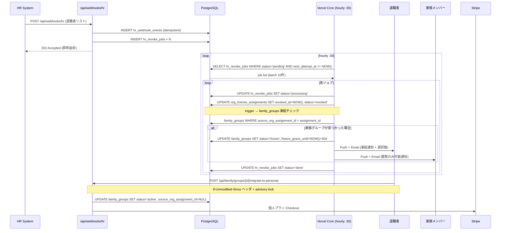
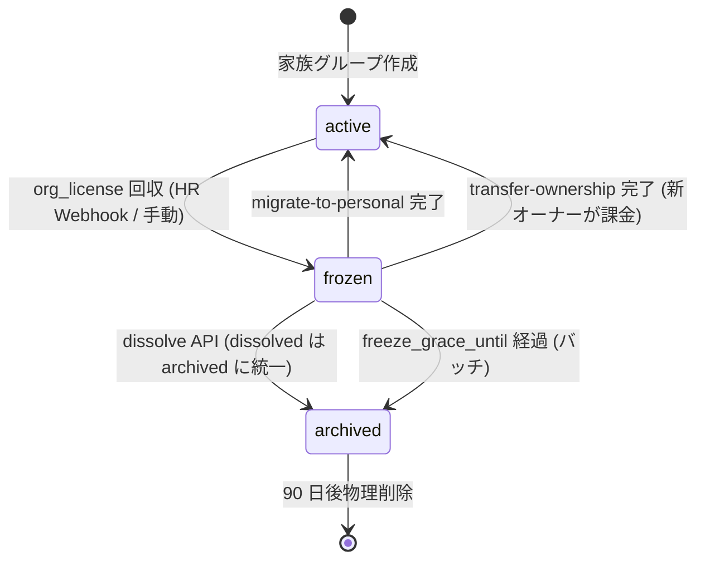

# org/ オフボーディングフロー (UC-ORG-17)

## 1. 目的・スコープ

退職者の組織ライセンス自動回収と、退職者が家族グループオーナーだった場合の凍結・選択肢提示フローを定義する。

対象:
- UC-ORG-17: 退職時の家族グループ owner 処理
- HR Webhook 受信の冪等化設計
- `hr_webhook_events` / `hr_revoke_jobs` のキュー処理
- Vercel Cron + TypeScript (hourly :30 処理)
- 30 日 grace period
- 楽観的ロック (`If-Unmodified-Since` + advisory lock)

## 2. 関連要件

- 要件定義 02 §4.17 (UC-ORG-17)
- 要件定義 02 §15.2 (保持する DB テーブル)
- 100-scenarios.md D7 / D8

## 3. フロー全体図



## 4. HR Webhook 受信 (冪等化)

### 4.1 受信エンドポイント

`POST /api/webhooks/hr`

```typescript
export async function POST(req: Request) {
  // 1. Bearer token 検証
  const token = req.headers.get('Authorization')?.replace('Bearer ', '');
  const org = await verifyHrWebhookToken(token);  // organizations.scim_token_hash
  if (!org) return Response.json({ error: 'UNAUTHORIZED' }, { status: 401 });

  const body = await req.json();
  const { external_id, event_type, employees } = body;

  // 2. 冪等チェック (organization_id + external_id の unique 制約)
  const { data: existing } = await supabase
    .from('hr_webhook_events')
    .select('id')
    .eq('organization_id', org.id)
    .eq('external_id', external_id)
    .single();

  if (existing) {
    return Response.json({ idempotent: true, event_id: existing.id });
  }

  // 3. hr_webhook_events に raw 保存
  const { data: event } = await supabase
    .from('hr_webhook_events')
    .insert({
      organization_id: org.id,
      external_id,
      payload: body,
      processed: false,
    })
    .select('id')
    .single();

  // 4. hr_revoke_jobs を employees 件数分 INSERT (status=pending)
  const now = new Date().toISOString();
  const jobs = employees.map((emp: HrEmployee) => ({
    webhook_event_id: event.id,
    organization_id: org.id,
    user_id_or_email: emp.email,   // user_id 解決は worker で行う
    status: 'pending',
    next_attempt_at: now,
  }));

  await supabase.from('hr_revoke_jobs').insert(jobs);

  return Response.json(
    { event_id: event.id, jobs_queued: jobs.length, idempotent: false },
    { status: 202 }
  );
}
```

### 4.2 冪等保証の仕組み

```sql
-- hr_webhook_events の unique 制約で重複受信を防ぐ
UNIQUE (organization_id, external_id)
```

HR システムが同じ `external_id` で再送した場合:
- `INSERT` が `unique_violation` → 既存レコードを返して 200
- `hr_revoke_jobs` への INSERT は行われない
- 処理の二重実行なし

## 5. HR Revoke Worker

<!-- pg_cron 登録・process_hr_revoke_jobs() 関数定義は削除済み。
     cron 登録は operator/08-cron-batches.md §3 で集約 (Vercel Cron + TypeScript)。
     Worker の実装詳細は operator/08-cron-batches.md §5.6 `hr_revoke_jobs_processor` を参照。 -->

### 5.3 Exponential Backoff

| attempts | 次回実行までの待機 |
|---------|----------------|
| 1 | 2 分 |
| 2 | 4 分 |
| 3 | 8 分 |
| 4 | 16 分 |
| 5 (最終) | dead_letter 遷移 |

`dead_letter` になったジョブは Sentry アラート + org_admin へ通知。

## 6. 家族グループ凍結 (status = 'frozen')

### 6.1 凍結後の制限

| 機能 | 凍結中 |
|------|--------|
| 食事記録の新規作成・AI 解析 | **不可** |
| 既存データ閲覧 | 可 |
| 家族メンバー招待 | **不可** |
| 共有買い物リスト閲覧 | 可 |
| チャレンジ参加 | **不可** |

### 6.2 凍結時の通知

**退職者本人への通知**:
```
件名: 【ほめゴハン】家族グループが一時凍結されました

{org_name} を退職されたため、家族グループ「{family_group_name}」が一時凍結されました。
30 日以内 ({grace_until} まで) に以下から選択してください:

1. 個人プランへ移行 → {migrate_url}
   (Family Basic 1,480 円/月 または Family Pro 2,480 円/月)

2. オーナー権限を譲渡 → {transfer_url}
   (グループ内の他のメンバーへ)

3. グループを解散 → {dissolve_url}
   (データは 90 日後に削除)

ご不明な点はサポートまでお問い合わせください。
```

**家族メンバーへの通知**:
```
件名: 【ほめゴハン】家族グループが一時凍結中です

{owner_name} さんの事情により、家族グループ「{family_group_name}」が凍結中です。
現在は既存データの閲覧のみ可能です。

{grace_until} までにオーナーから対応予定です。
```

## 7. 退職者の選択肢 API

### 7.1 `POST /api/family/groups/{id}/migrate-to-personal`

**楽観的ロック**:
```
POST /api/family/groups/{id}/migrate-to-personal
If-Unmodified-Since: 2026-05-07T12:34:56Z   # 直前 GET の updated_at
```

**処理**:
```typescript
async function migrateToPersonal(groupId: string, actorId: string, ifUnmodifiedSince: string) {
  // 1. advisory lock (同一 family_group への並行操作を直列化)
  await supabase.rpc('acquire_family_group_lock', { family_group_id: groupId });

  // 2. 最新状態取得
  const { data: group } = await supabase
    .from('family_groups')
    .select('id, status, updated_at, owner_id, source_org_assignment_id')
    .eq('id', groupId)
    .single();

  // 3. 楽観的ロック確認
  if (new Date(group.updated_at) > new Date(ifUnmodifiedSince)) {
    return Response.json(
      { error: 'PRECONDITION_FAILED', current_updated_at: group.updated_at },
      { status: 412 }
    );
  }

  // 4. 事前条件確認
  if (group.status !== 'frozen') {
    return Response.json({ error: 'ORG_OFFBOARD_INVALID_STATUS' }, { status: 409 });
  }
  if (group.owner_id !== actorId) {
    return Response.json({ error: 'ORG_PERMISSION_DENIED' }, { status: 403 });
  }

  // 5. 個人プラン Stripe Checkout 起動
  const checkoutUrl = await createPersonalPlanCheckout(actorId, groupId);

  // Stripe 決済完了 webhook で以下を実行:
  // UPDATE family_groups SET status='active', source_org_assignment_id=NULL
  // INSERT personal_subscriptions (family_basic or family_pro)

  return Response.json({ checkout_url: checkoutUrl });
}
```

### 7.2 `POST /api/family/groups/{id}/transfer-ownership`

**追加制約**: 譲渡先は同グループの `family_members.role = 'admin'` のみ

```typescript
// 譲渡先が個人プランで課金済みの場合 → 即時譲渡
// 課金未済の場合 → Stripe Checkout 後に譲渡完了
```

### 7.3 `POST /api/family/groups/{id}/dissolve`

- パスワード再認証必須
- `status = 'archived'` に変更 (dissolved は archived に統一)
- さらに 90 日後に物理削除 (pg_cron)

### 7.4 advisory lock の実装

ロック取得には `cross/02-rls-patterns.md §6.2.1` で定義した共通ヘルパーを使用する。
ロックキーは `'family-group:{UUID}'` 形式で統一。

```typescript
// org/05 でのロック使用例
await supabase.rpc('acquire_family_group_lock', {
  family_group_id: groupId,
});
```

## 8. Grace Period 期限経過後のバッチ処理

cron 登録および `process_family_freeze_grace_to_archive()` 関数の実装は
**operator/08-cron-batches.md §4.3** に集約されています。

以下の処理は operator/08 の canonical 実装に統合済みです:
- frozen → archived 遷移
- owner の個人プラン確認 → auto-migrate (カード登録済なら個人プランへ自動移行)
- カード未登録の場合は Free に降格
- pg_notify 経由での通知送信 (Edge Function がメール/Push を処理)

90 日後の物理削除:
```sql
-- 別の日次バッチで archived から 90 日経過したグループを削除
DELETE FROM family_groups
  WHERE status = 'archived'
    AND archived_at < NOW() - INTERVAL '90 days';
```

## 9. 状態遷移図



## 10. エラーハンドリング

| 状況 | 処理 |
|------|------|
| HR Webhook の user_id 解決失敗 | `hr_revoke_jobs.status='failed'`、exponential backoff |
| 5 回失敗 | `dead_letter`、Sentry アラート、org_admin 通知 |
| advisory lock タイムアウト | 503 を返してクライアントにリトライさせる (デフォルト 30s) |
| `If-Unmodified-Since` 不一致 | 412 Precondition Failed + 最新 `updated_at` を返却 |
| grace period 内に複数 API を同時呼び出し | advisory lock で 1 つだけ成功、残りは 409 |

## 11. テスト方針

主要テストケース:

1. `it('returns idempotent=true on second HR webhook with same external_id')`
2. `it('sets revoked_at on org_license_assignments when hr_revoke_jobs is processed')`
3. `it('sets family_groups.status=frozen when assignment is revoked')`
4. `it('one of two concurrent migrate-to-personal requests succeeds, other returns 412')`
5. `it('restores family_group to active after successful migrate-to-personal')`
6. `it('sends freeze notification email when group is frozen')`

```typescript
// tests/integration/org/offboarding-flow.integration.test.ts
import { describe, it, expect } from 'vitest';

describe('HR Webhook 冪等テスト', () => {
  it('returns idempotent=true on second POST with same external_id', async () => {
    const externalId = `hr-${faker.string.uuid()}`;
    const member = await getOrgMember('org-member@test.local');

    const body = JSON.stringify({
      external_id: externalId,
      action: 'revoke',
      user_id: member.id,
    });
    const signature = computeHrWebhookSignature(body);
    const headers = {
      'Content-Type': 'application/json',
      'X-HR-Signature': signature,
    };

    const res1 = await fetch(`${BASE_URL}/api/webhooks/hr`, {
      method: 'POST',
      headers,
      body,
    });
    expect(res1.status).toBe(200);

    const res2 = await fetch(`${BASE_URL}/api/webhooks/hr`, {
      method: 'POST',
      headers,
      body,
    });
    expect(res2.status).toBe(200);
    const result2 = await res2.json();
    expect(result2.idempotent).toBe(true);
  });

  it('sets revoked_at on org_license_assignments when hr_revoke_jobs is processed', async () => {
    const member = await getOrgMember('org-member@test.local');
    const assignment = await getActiveLicenseAssignment(member.id);

    // hr_revoke_jobs に pending ジョブを直接 INSERT
    const { data: job } = await supabaseAdmin
      .from('hr_revoke_jobs')
      .insert({
        organization_id: assignment.organization_id,
        user_id: member.id,
        assignment_id: assignment.id,
        status: 'pending',
        scheduled_at: new Date().toISOString(),
      })
      .select()
      .single();

    // バッチ処理を直接呼び出し
    const { processHrRevokeJobs } = await import('@/lib/org/hr-revoke-processor');
    await processHrRevokeJobs(supabaseAdmin);

    const { data: updatedAssignment } = await supabaseAdmin
      .from('org_license_assignments')
      .select('revoked_at')
      .eq('id', assignment.id)
      .single();

    expect(updatedAssignment?.revoked_at).not.toBeNull();
  });

  it('freezes family_group when org_license_assignment is revoked', async () => {
    const owner = await createTestUser('user');
    const assignment = await createLicenseAssignmentWithFamilyGroup(owner.id);

    // アサインメントを revoke
    await supabaseAdmin
      .from('org_license_assignments')
      .update({ revoked_at: new Date().toISOString() })
      .eq('id', assignment.id);

    // トリガーまたはバッチが実行されることを想定
    const { triggerFamilyFreeze } = await import('@/lib/org/offboarding-trigger');
    await triggerFamilyFreeze(supabaseAdmin, assignment.id);

    const { data: group } = await supabaseAdmin
      .from('family_groups')
      .select('status, frozen_at, freeze_grace_until')
      .eq('owner_id', owner.id)
      .single();

    expect(group?.status).toBe('frozen');
    expect(group?.frozen_at).not.toBeNull();
    expect(group?.freeze_grace_until).not.toBeNull();
  });
});

describe('advisory lock: concurrent migrate-to-personal', () => {
  it('one of two concurrent requests succeeds, other returns 412', async () => {
    const owner = await createTestUser('user');
    const frozenGroup = await createFamilyGroupInDB(supabaseAdmin, {
      owner_id: owner.id,
      status: 'frozen',
    });
    const ownerToken = await signInAsUser(owner.email);

    const headers = {
      Authorization: `Bearer ${ownerToken}`,
      'Content-Type': 'application/json',
      'If-Unmodified-Since': frozenGroup.updated_at,
    };
    const body = JSON.stringify({
      target_plan_key: 'family_basic',
      stripe_payment_method_id: 'pm_test_xxx',
    });

    const [res1, res2] = await Promise.all([
      fetch(
        `${BASE_URL}/api/family/groups/${frozenGroup.id}/migrate-to-personal`,
        { method: 'POST', headers, body },
      ),
      fetch(
        `${BASE_URL}/api/family/groups/${frozenGroup.id}/migrate-to-personal`,
        { method: 'POST', headers, body },
      ),
    ]);

    const statuses = [res1.status, res2.status].sort();
    expect(statuses).toContain(200);
    expect(statuses).toContain(412);
  });
});
```

## 12. 既存実装との関連

- `hr_webhook_events`, `hr_revoke_jobs`: 新規作成
- `family_groups.status`, `frozen_at`, `freeze_grace_until`: family ドメインで定義される列を参照
- `org_license_assignments.revoked_at`: org ドメインの主要な状態変更点

## 13. 未解決事項

- HR Webhook の HMAC 検証形式: ベンダーによって異なるため、Enterprise 個別対応
- `freeze_grace_days` の組織カスタマイズ: `organizations.settings.freeze_grace_days` で設定可能だが、デフォルト 30 日を変更できる範囲 (7〜90 日) の UI 設計が必要
- pg_notify → Edge Function の通知送信: Supabase Realtime channel 経由か、Edge Function を直接呼ぶか
