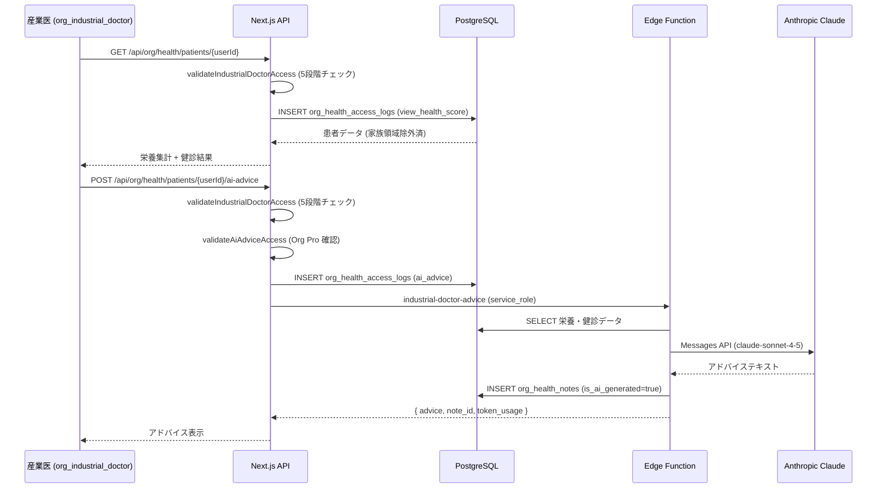

# org/ 産業医・保健師連携

## 1. 目的・スコープ

F-ORG-010 に基づく産業医・保健師連携機能の詳細設計。

対象:
- `org_industrial_doctor` ロールのアクセス制御
- 閲覧範囲の明示 (家族領域・退職者・別組織・写真原寸 不可)
- `POST /api/org/health/patients/{userId}/ai-advice` (Claude Sonnet)
- `org_health_access_logs` (10 年保管)
- `org_health_notes` (5 年保管、AI 提案フラグ)

対象外:
- 産業医の予約管理システム連携 (Phase 2)
- 保健師ロール (`org_health_nurse`) 実装 (Phase 2)

## 2. 関連要件

- 要件定義 02 §5.10 (F-ORG-010)
- 要件定義 02 §8.8 (産業医 API)
- 100-scenarios.md E6/E7/E8/E9/E10

## 3. アクセス制御設計

### 3.1 server-side 検証ロジック (5 段階)

全ての産業医 API エンドポイントで以下を実行する。RLS だけでなく **アプリ層での明示的検証が必須**。

```typescript
import { requireIndustrialDoctorAccess } from '@/lib/auth/industrial-doctor';

// Route Handler 冒頭で呼び出す
async function validateIndustrialDoctorAccess(
  doctorId: string,
  patientId: string,
  orgId: string
): Promise<ValidationResult> {

  // Step 1: 呼び出し元のロール確認
  const caller = await getUserProfile(doctorId);
  if (!caller.roles.includes('org_industrial_doctor')) {
    return { allowed: false, reason: 'NOT_INDUSTRIAL_DOCTOR', status: 403 };
  }

  // Step 2: 同組織チェック (organization_id 一致)
  // ※ caller.organization_id は user_profiles.organization_id (プライマリ所属)
  const targetOrg = caller.organization_id;
  if (!targetOrg || targetOrg !== orgId) {
    return { allowed: false, reason: 'DIFFERENT_ORGANIZATION', status: 403 };
  }

  // Step 3: 対象ユーザーの取得 + 同組織確認
  const patient = await getUserProfile(patientId);
  if (!patient) {
    return { allowed: false, reason: 'PATIENT_NOT_FOUND', status: 404 };
  }
  if (patient.organization_id !== targetOrg) {
    return { allowed: false, reason: 'PATIENT_DIFFERENT_ORG', status: 403 };
  }

  // Step 4: 同意確認 (consent_org_health_data = TRUE 必須)
  if (!patient.consent_org_health_data) {
    return { allowed: false, reason: 'CONSENT_NOT_GIVEN', status: 403 };
  }

  // Step 5: 在籍確認 (退職者は閲覧不可)
  if (!patient.is_active_in_org) {
    return { allowed: false, reason: 'PATIENT_INACTIVE', status: 403 };
  }

  return { allowed: true };
}

// AI advice は追加でプラン確認
async function validateAiAdviceAccess(orgId: string): Promise<ValidationResult> {
  const plan = await getOrgActivePlan(orgId);
  if (!['org_pro', 'org_enterprise'].includes(plan.plan_key)) {
    return { allowed: false, reason: 'PLAN_UPGRADE_REQUIRED', status: 402 };
  }
  return { allowed: true };
}
```

### 3.2 閲覧範囲の明示

**閲覧可能な情報** (同一組織の同意済・在籍中メンバーに限る):

| データ | 閲覧可否 | 備考 |
|--------|---------|------|
| 食事記録の集計値 (週次・月次) | ✅ | 個別の食事写真コンテンツは不可 |
| 栄養素サマリ (カロリー/PFC/塩分) | ✅ | AI 解析結果テキストのみ |
| 健康スコア (アプリ算出値) | ✅ | 時系列推移 |
| 健診結果 (アップロード数値) | ✅ | HbA1c / BMI / 血圧 等 |
| 食事写真サムネイル | ✅ | 幅 200px 以下のみ |
| 産業医メモ (`org_health_notes`) | ✅ | 本人は参照不可 |

**閲覧不可の情報**:

| データ | 閲覧不可の理由 |
|--------|--------------|
| 家族グループ内の食事記録 | 組織同梱ライセンスでも不可。個人の食事記録のみ対象 |
| 食事写真の原寸画像 | プライバシー保護 (サムネイルのみ) |
| 個別レシピの詳細 | 健康指導に関係しない嗜好情報 |
| 未同意メンバーのデータ | オプトインのみ |
| 別組織メンバーのデータ | 複数組織所属者でも産業医の所属組織のみ |
| 退職済みメンバーのデータ | `is_active_in_org = FALSE` で制限 |

### 3.3 家族領域の完全分離

```sql
-- 産業医が閲覧できる食事記録: user_daily_meals から直接取得
-- family_groups 配下の family_shared_menus は除外
SELECT udm.*
  FROM user_daily_meals udm
  WHERE udm.user_id = $patient_id
    -- 家族グループ共有食事は除外
    AND udm.source_family_group_id IS NULL
    -- 本人の直接記録のみ
    AND udm.recorded_by = $patient_id;
```

RLS でも同様のフィルタを適用 (`09-rls-policies.md` 参照)。

## 4. 産業医向けデータ取得クエリ

### 4.1 栄養集計 (週次)

```sql
SELECT
  DATE_TRUNC('week', udm.meal_date) AS week,
  AVG(udm.total_calories) AS avg_calories,
  AVG(udm.total_protein_g) AS avg_protein,
  AVG(udm.total_fat_g) AS avg_fat,
  AVG(udm.total_carbs_g) AS avg_carbs,
  AVG(udm.total_salt_g) AS avg_salt,
  COUNT(*) AS meal_days
FROM user_daily_meals udm
WHERE udm.user_id = $patient_id
  AND udm.source_family_group_id IS NULL  -- 家族共有除外
  AND udm.meal_date BETWEEN $start AND $end
GROUP BY 1
ORDER BY 1 DESC;
```

### 4.2 健診結果取得

```sql
SELECT
  hc.checkup_date,
  hc.bmi,
  hc.hba1c,
  hc.systolic_bp,
  hc.diastolic_bp,
  hc.total_cholesterol,
  hc.triglycerides
FROM health_checkups hc
WHERE hc.user_id = $patient_id
ORDER BY hc.checkup_date DESC
LIMIT 5;
```

## 5. AI アドバイス生成 (Claude Sonnet)

### 5.1 Edge Function: `industrial-doctor-advice`

```typescript
// supabase/functions/industrial-doctor-advice/index.ts

import Anthropic from 'npm:@anthropic-ai/sdk';

interface RequestBody {
  user_id: string;
  organization_id: string;
  doctor_id: string;
  period_start: string;
  period_end: string;
  focus_areas: ('nutrition' | 'sleep' | 'stress' | 'weight' | 'lifestyle')[];
}

Deno.serve(async (req) => {
  // 認証: service_role JWT で呼ばれる (API Route Handler から委譲)
  const authHeader = req.headers.get('Authorization');
  if (!isValidServiceRoleToken(authHeader)) {
    return new Response('Unauthorized', { status: 401 });
  }

  const body: RequestBody = await req.json();

  // データ収集
  const [nutritionData, checkupData, healthScores] = await Promise.all([
    fetchNutritionSummary(body.user_id, body.period_start, body.period_end),
    fetchCheckupData(body.user_id),
    fetchHealthScores(body.user_id, body.period_start, body.period_end),
  ]);

  // Claude Sonnet へプロンプト送信
  const anthropic = new Anthropic({ apiKey: Deno.env.get('ANTHROPIC_API_KEY') });

  const message = await anthropic.messages.create({
    model: 'claude-sonnet-4-5',
    max_tokens: 1024,
    messages: [
      {
        role: 'user',
        content: buildAdvicePrompt({
          nutritionData,
          checkupData,
          healthScores,
          focus_areas: body.focus_areas,
          period: { start: body.period_start, end: body.period_end },
        }),
      },
    ],
    system: INDUSTRIAL_DOCTOR_SYSTEM_PROMPT,
  });

  const adviceText = message.content[0].type === 'text'
    ? message.content[0].text
    : '';

  // org_health_notes に AI 提案として保存
  const { data: note } = await supabase
    .from('org_health_notes')
    .insert({
      organization_id: body.organization_id,
      patient_id: body.user_id,
      doctor_id: body.doctor_id,
      note: adviceText,
      category: 'ai_advice',
      is_ai_generated: true,
      ai_model: 'claude-sonnet-4-5',
    })
    .select()
    .single();

  return Response.json({
    advice: adviceText,
    note_id: note.id,
    model: 'claude-sonnet-4-5',
    token_usage: {
      input: message.usage.input_tokens,
      output: message.usage.output_tokens,
    },
  });
});

const INDUSTRIAL_DOCTOR_SYSTEM_PROMPT = `
あなたは産業医・保健師向けの健康管理AIアシスタントです。
提供されたデータを基に、科学的根拠のある健康指導アドバイスを生成します。

重要な制約:
- 診断は行いません。医療的判断を示唆する表現は避けてください
- 個人を特定できる情報は含めないでください
- 食事写真や個人の嗜好情報には言及しないでください
- 家族構成や家庭環境には言及しないでください
- アドバイスは産業医が参考にするための情報提供に留めてください
`;
```

### 5.2 LLM 使用量計測

```typescript
// 組織 quota の消費を記録
await supabase.from('llm_usage_logs').insert({
  organization_id: body.organization_id,
  user_id: body.doctor_id,
  model: 'claude-sonnet-4-5',
  feature: 'industrial_doctor_ai',
  input_tokens: message.usage.input_tokens,
  output_tokens: message.usage.output_tokens,
  created_at: new Date().toISOString(),
});
```

## 6. アクセスログ (org_health_access_logs)

### 6.1 記録タイミング

全ての産業医 API 呼び出しで必ずログを記録する。

```typescript
async function logHealthAccess(params: {
  organization_id: string;
  doctor_id: string;
  patient_id: string;
  access_type: HealthAccessType;
  details?: Record<string, unknown>;
}) {
  await supabase.from('org_health_access_logs').insert({
    ...params,
    accessed_at: new Date().toISOString(),
  });
}
```

`access_type` の一覧:

| access_type | 説明 |
|------------|------|
| `view_meals` | 食事記録集計閲覧 |
| `view_health_score` | 健康スコア閲覧 |
| `view_checkup` | 健診結果閲覧 |
| `add_note` | 産業医メモ追加 |
| `view_history` | 過去のメモ閲覧 |
| `ai_advice` | AI アドバイス生成 |
| `export` | データエクスポート |

### 6.2 10 年保管の実装

```sql
-- org_health_access_logs は UPDATE / DELETE 不可 (RLS + Row Security)
-- 10 年後に pg_cron でアーカイブ (Cold Storage へ移行)

-- テーブルパーティション (年次) を検討 (大規模組織向け Phase 2)
```

## 7. 産業医メモ (org_health_notes)

### 7.1 メモのカテゴリ

| category | 説明 |
|---------|------|
| `consultation` | 個別面談記録 |
| `guidance` | 保健指導の内容 |
| `follow_up` | フォローアップ |
| `ai_advice` | AI 生成アドバイス |

### 7.2 5 年保管

```sql
-- 5 年後に pg_cron で soft delete (deleted_at をセット)
-- 物理削除はさらに 1 年後 (合計 6 年)

ALTER TABLE org_health_notes ADD COLUMN IF NOT EXISTS deleted_at TIMESTAMPTZ;

-- 5 年経過したメモを soft delete
UPDATE org_health_notes
  SET deleted_at = NOW()
  WHERE created_at < NOW() - INTERVAL '5 years'
    AND deleted_at IS NULL;
```

**本人への非公開**: `org_health_notes` は産業医のみ閲覧可。患者本人は参照不可 (RLS で強制)。

## 8. シーケンス (産業医の健康指導フロー)



## 9. エラーハンドリング

| エラー | HTTP | 理由 |
|--------|------|------|
| `NOT_INDUSTRIAL_DOCTOR` | 403 | ロール不足 |
| `DIFFERENT_ORGANIZATION` | 403 | 別組織 (E7: 産業医が他組織データ閲覧試行) |
| `CONSENT_NOT_GIVEN` | 403 | 未同意 (E10) |
| `PATIENT_INACTIVE` | 403 | 退職者 (E9) |
| `PLAN_UPGRADE_REQUIRED` | 402 | Org Pro 未満 |
| `PATIENT_NOT_FOUND` | 404 | 存在しない患者 |
| LLM API エラー | 503 | Claude API タイムアウト → リトライ案内 |

## 10. テスト方針

- **Unit**:
  - `validateIndustrialDoctorAccess()` の 5 段階チェック (各 step で拒否されること)
  - 家族グループデータが食事集計から除外されること
- **Integration**:
  - 産業医が別組織のデータを GET → 403 を確認 (E7)
  - 同意撤回後に GET → 403 を確認 (E10)
  - `org_health_access_logs` に毎回記録されることを確認
- **E2E (Playwright)**:
  - 産業医として patients 一覧表示 → 個別データ閲覧 → メモ追加 → AI アドバイス生成

## 11. 既存実装との関連

- `org_health_access_logs`, `org_health_notes`: 新規作成
- `industrial-doctor-advice` Edge Function: 新規作成
- 既存 `health_checkups`, `user_daily_meals`: 保持 (参照のみ)

## 12. 未解決事項

- `user_performance_checkins` (睡眠・疲労・心拍) の産業医への開示範囲: §8.8.4 で「将来」とあるが Phase 2 以降で判断
- AI アドバイスの医療行為境界: 産業医 + 法務レビューが必要。プロンプトの `system` 部分の最終文言は法務確認後に確定
- 10 年保管の Cold Storage: 現在は Supabase PostgreSQL に保持、将来は S3/Glacier へのアーカイブを検討
