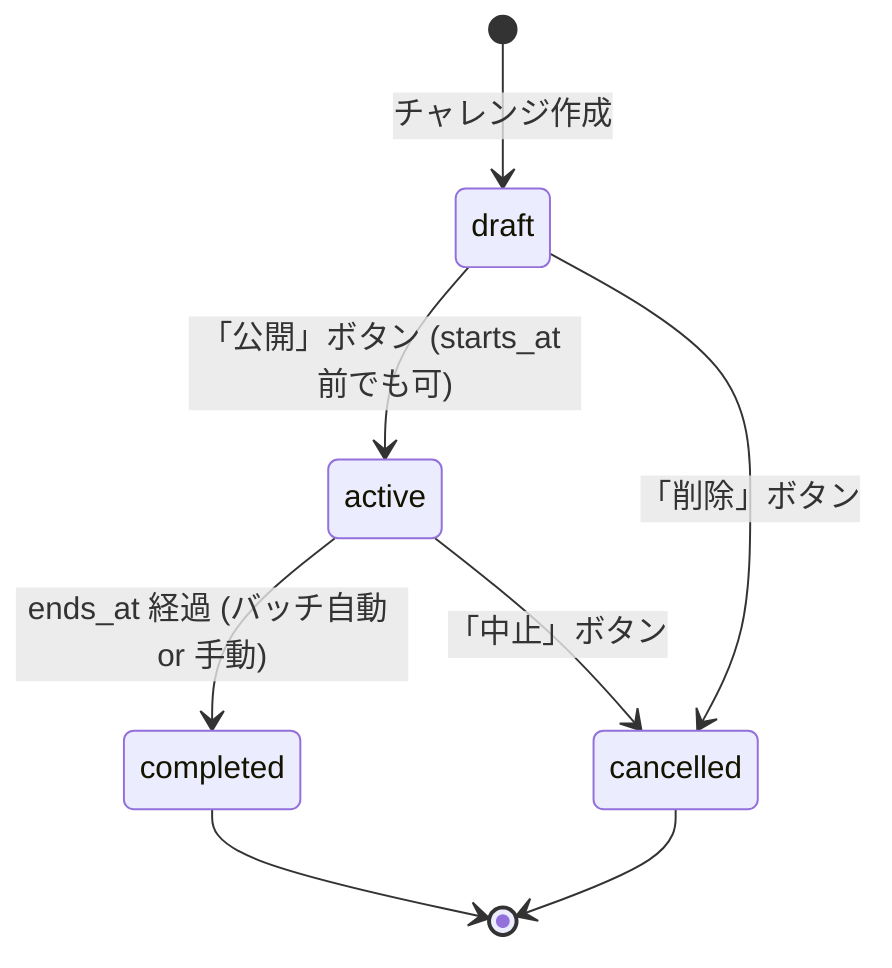
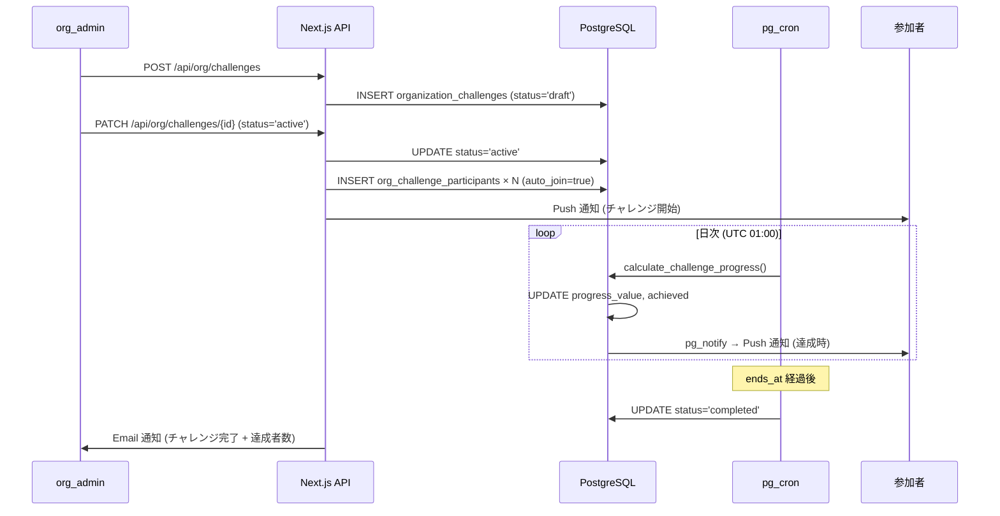

# org/ チャレンジ機能

## 1. 目的・スコープ

F-ORG-006 に基づく組織チャレンジ機能の詳細設計。

対象:
- チャレンジ種類 (期間 / 個人 vs 部署 vs 組織全体)
- ライフサイクル (draft → active → completed)
- 参加・進捗計測
- 報酬 (バッジ / クーポン)

## 2. 関連要件

- 要件定義 02 §5.6 (F-ORG-006)
- 要件定義 02 §4.6 (UC-ORG-06)
- 100-scenarios.md D13

## 3. チャレンジ種類

| `challenge_type` | 説明 | 目標値例 | 計測方法 |
|-----------------|------|---------|---------|
| `breakfast_rate` | 朝食率 | 80 (%) | 朝食記録数 / 期間日数 |
| `veggie_score` | 野菜スコア | 70 (点) | 期間平均野菜スコア |
| `homecook_rate` | 自炊率 | 60 (%) | 自炊記録 / 全食事 |
| `steps` | 歩数 | 8000 (歩/日) | HealthKit 等の歩数連携 |
| `weight_loss` | 減量 | -2 (kg) | 体重記録の差分 |
| `custom` | カスタム | 自由 | 手動評価 |

### 3.1 対象スコープ

| `target_scope` | 対象 | 進捗集計 |
|---------------|------|---------|
| `organization` | 全メンバー | 組織全体の達成率 |
| `department` | 特定部署 | 部署内の達成率 |
| `individual` | 個人 (選択制) | 個人ごとの達成 |

## 4. データモデル

### 4.1 `organization_challenges` (再掲)

```sql
CREATE TABLE organization_challenges (
  id              UUID PRIMARY KEY DEFAULT gen_random_uuid(),
  organization_id UUID NOT NULL REFERENCES organizations(id) ON DELETE CASCADE,
  title           VARCHAR(200) NOT NULL,
  description     TEXT,
  challenge_type  VARCHAR(50) NOT NULL
    CHECK (challenge_type IN ('breakfast_rate','veggie_score','homecook_rate','steps','weight_loss','custom')),
  target_scope    VARCHAR(30) NOT NULL DEFAULT 'organization'
    CHECK (target_scope IN ('organization','department','individual')),
  target_dept_id  UUID REFERENCES departments(id) ON DELETE SET NULL,
  goal_value      NUMERIC,
  goal_unit       VARCHAR(30),
  starts_at       TIMESTAMPTZ NOT NULL,
  ends_at         TIMESTAMPTZ NOT NULL,
  status          VARCHAR(20) NOT NULL DEFAULT 'draft'
    CHECK (status IN ('draft','active','completed','cancelled')),
  reward_text     TEXT,
  auto_join       BOOLEAN NOT NULL DEFAULT FALSE,
  created_by      UUID NOT NULL REFERENCES auth.users(id),
  created_at      TIMESTAMPTZ NOT NULL DEFAULT NOW(),
  updated_at      TIMESTAMPTZ NOT NULL DEFAULT NOW(),
  CHECK (ends_at > starts_at),
  CHECK (DATE_PART('day', ends_at - starts_at) BETWEEN 1 AND 180)
);
```

### 4.2 `org_challenge_participants`

```sql
CREATE TABLE org_challenge_participants (
  challenge_id    UUID NOT NULL REFERENCES organization_challenges(id) ON DELETE CASCADE,
  user_id         UUID NOT NULL REFERENCES auth.users(id) ON DELETE CASCADE,
  joined_at       TIMESTAMPTZ NOT NULL DEFAULT NOW(),
  progress_value  NUMERIC,            -- 最新の達成値 (バッチ更新)
  achieved        BOOLEAN NOT NULL DEFAULT FALSE,
  achieved_at     TIMESTAMPTZ,
  PRIMARY KEY (challenge_id, user_id)
);

CREATE INDEX idx_challenge_part_challenge ON org_challenge_participants(challenge_id, achieved);
CREATE INDEX idx_challenge_part_user      ON org_challenge_participants(user_id, joined_at DESC);
```

### 4.3 `org_challenge_progress_snapshots` (日次スナップショット)

```sql
CREATE TABLE org_challenge_progress_snapshots (
  id           UUID PRIMARY KEY DEFAULT gen_random_uuid(),
  challenge_id UUID NOT NULL REFERENCES organization_challenges(id) ON DELETE CASCADE,
  user_id      UUID NOT NULL REFERENCES auth.users(id) ON DELETE CASCADE,
  snapshot_date DATE NOT NULL,
  value        NUMERIC NOT NULL,
  created_at   TIMESTAMPTZ NOT NULL DEFAULT NOW(),
  UNIQUE (challenge_id, user_id, snapshot_date)
);

CREATE INDEX idx_challenge_snapshot ON org_challenge_progress_snapshots(challenge_id, snapshot_date DESC);
```

## 5. ライフサイクル



### 5.1 ステータス遷移ルール

| 遷移 | 条件 | 実行者 |
|------|------|--------|
| `draft → active` | 必須項目が全て入力済み | `org_admin` / `org_manager` |
| `active → completed` | `ends_at` 経過後 (バッチ) | System or 手動 |
| `active → cancelled` | いつでも可 | `org_admin` / `org_manager` |
| `draft → cancelled` | いつでも可 (DELETE と同義) | `org_admin` / `org_manager` |

`active` になると:
1. `auto_join = TRUE` の場合: 対象メンバー全員を `org_challenge_participants` に INSERT
2. 対象メンバーに Push 通知 (チャレンジ開始)

## 6. 参加フロー

### 6.1 自動参加 (auto_join = TRUE)

`active` 遷移時に一括 INSERT:

```sql
-- active 遷移時のバッチ (trigger or API)
INSERT INTO org_challenge_participants (challenge_id, user_id)
SELECT $challenge_id, up.id
  FROM user_profiles up
  WHERE up.organization_id = $org_id
    AND up.is_active_in_org = TRUE
    AND (
      $target_scope = 'organization'
      OR ($target_scope = 'department' AND up.department_id = $target_dept_id)
    )
  ON CONFLICT (challenge_id, user_id) DO NOTHING;
```

### 6.2 オプトイン参加 (auto_join = FALSE)

```
POST /api/org/challenges/{id}/join
```

条件:
- チャレンジが `active` であること
- 対象スコープに自分が含まれること (dept チャレンジなら同部署)
- `org_member` 以上のロール

## 7. 進捗計測

### 7.1 日次バッチ (pg_cron)

```sql
SELECT cron.schedule(
  'challenge_progress_update',
  '0 1 * * *',   -- UTC 01:00 (JST 10:00)
  $$SELECT calculate_challenge_progress()$$
);
```

```sql
CREATE OR REPLACE FUNCTION calculate_challenge_progress()
RETURNS void LANGUAGE plpgsql AS $$
DECLARE
  v_challenge RECORD;
  v_participant RECORD;
  v_progress NUMERIC;
BEGIN
  FOR v_challenge IN
    SELECT * FROM organization_challenges
    WHERE status = 'active'
      AND starts_at <= NOW()
      AND ends_at >= NOW()
  LOOP
    FOR v_participant IN
      SELECT user_id FROM org_challenge_participants
        WHERE challenge_id = v_challenge.id AND NOT achieved
    LOOP
      v_progress := calculate_user_progress(
        v_challenge.challenge_type,
        v_participant.user_id,
        v_challenge.starts_at,
        NOW()
      );

      -- 日次スナップショット保存
      INSERT INTO org_challenge_progress_snapshots
        (challenge_id, user_id, snapshot_date, value)
      VALUES
        (v_challenge.id, v_participant.user_id, CURRENT_DATE, v_progress)
      ON CONFLICT (challenge_id, user_id, snapshot_date)
      DO UPDATE SET value = EXCLUDED.value;

      -- 達成判定
      IF v_progress >= v_challenge.goal_value THEN
        UPDATE org_challenge_participants
          SET progress_value = v_progress,
              achieved = TRUE,
              achieved_at = NOW()
          WHERE challenge_id = v_challenge.id
            AND user_id = v_participant.user_id;

        -- 達成通知 (pg_notify)
        PERFORM pg_notify('challenge_achieved',
          json_build_object(
            'challenge_id', v_challenge.id,
            'user_id', v_participant.user_id
          )::TEXT
        );
      ELSE
        UPDATE org_challenge_participants
          SET progress_value = v_progress
          WHERE challenge_id = v_challenge.id
            AND user_id = v_participant.user_id;
      END IF;
    END LOOP;
  END LOOP;
END;
$$;
```

### 7.2 チャレンジ種別の進捗計算ロジック

```sql
CREATE OR REPLACE FUNCTION calculate_user_progress(
  p_type VARCHAR,
  p_user_id UUID,
  p_start TIMESTAMPTZ,
  p_end TIMESTAMPTZ
) RETURNS NUMERIC LANGUAGE plpgsql AS $$
DECLARE
  v_result NUMERIC := 0;
  v_total_days INT;
BEGIN
  v_total_days := GREATEST(DATE_PART('day', p_end - p_start)::INT, 1);

  CASE p_type
    WHEN 'breakfast_rate' THEN
      SELECT COUNT(*) FILTER (WHERE meal_type = 'breakfast') * 100.0 / v_total_days
        INTO v_result
        FROM user_daily_meals
        WHERE user_id = p_user_id
          AND meal_date BETWEEN p_start::DATE AND p_end::DATE
          AND source_family_group_id IS NULL;

    WHEN 'veggie_score' THEN
      SELECT AVG(veggie_score)
        INTO v_result
        FROM user_daily_meals
        WHERE user_id = p_user_id
          AND meal_date BETWEEN p_start::DATE AND p_end::DATE;

    WHEN 'homecook_rate' THEN
      SELECT COUNT(*) FILTER (WHERE is_homecook) * 100.0 / NULLIF(COUNT(*), 0)
        INTO v_result
        FROM user_daily_meals
        WHERE user_id = p_user_id
          AND meal_date BETWEEN p_start::DATE AND p_end::DATE;

    WHEN 'steps' THEN
      SELECT AVG(step_count)
        INTO v_result
        FROM user_daily_steps  -- Phase 2: HealthKit 連携前は NULL
        WHERE user_id = p_user_id
          AND step_date BETWEEN p_start::DATE AND p_end::DATE;

    WHEN 'weight_loss' THEN
      -- 開始時の体重 - 最新の体重
      SELECT (start_weight.weight_kg - end_weight.weight_kg)
        INTO v_result
        FROM (
          SELECT weight_kg FROM user_body_records
          WHERE user_id = p_user_id AND recorded_at >= p_start
          ORDER BY recorded_at ASC LIMIT 1
        ) start_weight,
        (
          SELECT weight_kg FROM user_body_records
          WHERE user_id = p_user_id AND recorded_at <= p_end
          ORDER BY recorded_at DESC LIMIT 1
        ) end_weight;

    WHEN 'custom' THEN
      -- 手動評価のため NULL を返す (管理者が手動で achieved フラグを立てる)
      v_result := NULL;
  END CASE;

  RETURN COALESCE(v_result, 0);
END;
$$;
```

## 8. 報酬

### 8.1 Phase 1: テキスト報酬

```
reward_text: "達成者には Amazon ギフト 1,000 円"
```

管理者が達成者リスト CSV を DL → 手動で配布。

### 8.2 Phase 2: バッジ (将来)

```sql
-- user_badges テーブルへの INSERT (Phase 2)
INSERT INTO user_badges (user_id, badge_type, challenge_id, earned_at)
VALUES ($user_id, 'challenge_achiever', $challenge_id, NOW());
```

### 8.3 達成者リスト CSV

```
GET /api/org/challenges/{id}/results
→ Content-Type: text/csv; charset=UTF-8

employee_id,display_name,email,department,achieved_at,progress_value
EMP001,田中太郎,tanaka@example.com,営業部,2026-06-28T09:15:00Z,85.3
```

## 9. ダッシュボード表示

```typescript
interface ChallengeDashboard {
  challenge: OrganizationChallenge;
  stats: {
    participant_count: number;
    achieved_count: number;
    achievement_rate: number;       // achieved / participant
    avg_progress: number;
    top_performers: { user_id: string; display_name: string; progress: number }[];
  };
  daily_trend: {
    date: string;
    avg_progress: number;
    achieved_count: number;
  }[];
}
```

## 10. シーケンス (チャレンジ作成 → 完了)



## 11. エラーハンドリング

| 状況 | 処理 |
|------|------|
| 参加 API で `target_scope='department'` だが自分が別部署 | `403 ORG_PERMISSION_DENIED` |
| チャレンジが `draft` 状態での参加 | `409 CHALLENGE_NOT_ACTIVE` |
| `custom` 型で達成値が NULL | 手動達成フラグ API: `PATCH /api/org/challenges/{id}/participants/{userId}` |
| `steps` 型で HealthKit 連携なし | 進捗 0 として扱い、UI に「歩数データ未連携」を表示 |

## 12. テスト方針

- **Unit**: `calculate_user_progress()` の各 challenge_type で期待値が返ること
- **Integration**:
  - `active` 遷移時に `auto_join=true` で全メンバーが participants に INSERT されること
  - `ends_at` 経過後のバッチで `status='completed'` になること
  - 達成者が `achieved=true` に更新されること
- **E2E (Playwright)**:
  - チャレンジ作成 → 公開 → メンバー参加 → 進捗確認 → CSV ダウンロード

## 13. 既存実装との関連

- `organization_challenges`: clean-build で再作成
- `org_challenge_participants`: 新規作成
- `org_challenge_progress_snapshots`: 新規作成

## 14. 未解決事項

- `steps` タイプ: HealthKit/Google Fit 連携は Phase 2 (02 §22.11)。Phase 1 では steps チャレンジを作成可能にするが進捗計測は N/A 表示
- Pro でのリアルタイム進捗: Supabase Realtime で `org_challenge_participants` を Subscribe → 進捗が即時反映される実装は Phase 2
- カスタム型の手動評価: 管理者 UI でのフラグ立て操作の画面設計が未定
