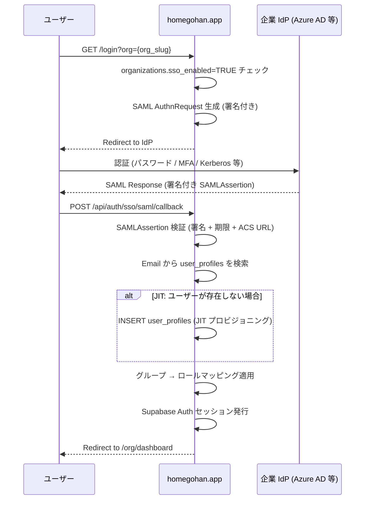
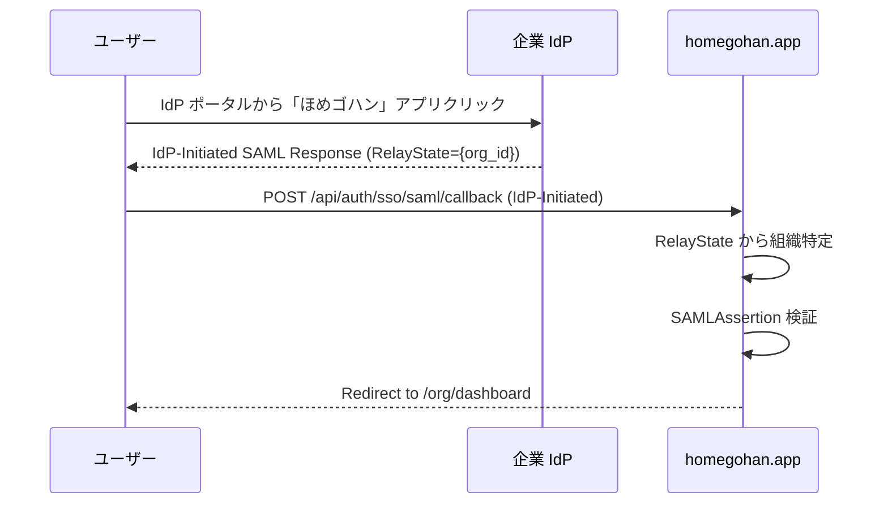
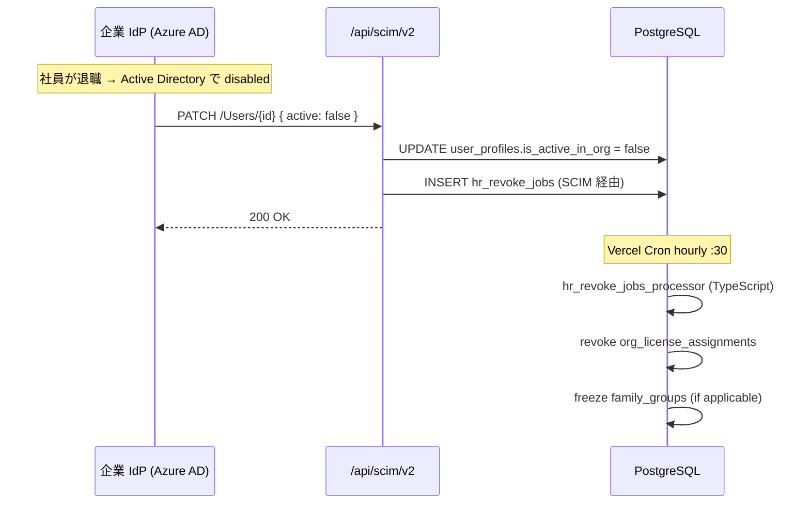

# org/ SSO / SAML / SCIM

## 1. 目的・スコープ

Phase 2 (Enterprise) で提供する SSO・SCIM 機能の詳細設計。

対象:
- 対応 IdP: Azure AD / Google Workspace / Okta / 汎用 OIDC
- IdP 主導 / SP 主導ログイン
- JIT プロビジョニング (user_profiles 自動作成)
- SCIM 2.0 同期 (新規追加 / 属性更新 / 削除)
- グループ → ロールマッピング
- `organizations` への列追加

## 2. 関連要件

- 要件定義 03 §17.3 (SSO)
- 要件定義 02 §6.4 (プライバシー)

## 3. IdP 対応マトリクス

| IdP | SAML 2.0 | OIDC | SCIM 2.0 | JIT |
|-----|---------|------|---------|-----|
| Azure AD / Entra ID | ✅ | ✅ | ✅ | ✅ |
| Google Workspace | ✅ | ✅ | ✅ (Directory API) | ✅ |
| Okta | ✅ | ✅ | ✅ | ✅ |
| 汎用 OIDC | ❌ | ✅ | ❌ | ✅ |

## 4. organizations テーブル拡張 (SSO 用列)

```sql
-- 01-data-model.md の ALTER TABLE organizations に追加
ALTER TABLE organizations ADD COLUMN IF NOT EXISTS sso_enabled       BOOLEAN NOT NULL DEFAULT FALSE;
ALTER TABLE organizations ADD COLUMN IF NOT EXISTS sso_provider      VARCHAR(50);
  -- CHECK: sso_provider IN ('azure_ad','google_workspace','okta','generic_oidc')

ALTER TABLE organizations ADD COLUMN IF NOT EXISTS sso_metadata_url TEXT;
  -- SAML: IdP metadata URL (自動更新)
  -- OIDC: /.well-known/openid-configuration URL

ALTER TABLE organizations ADD COLUMN IF NOT EXISTS sso_metadata_xml TEXT;
  -- SAML: IdP metadata XML (手動アップロード用フォールバック)

ALTER TABLE organizations ADD COLUMN IF NOT EXISTS scim_token_hash  TEXT;
  -- SCIM Bearer token の bcrypt hash (Argon2id 推奨 Phase 2)
  -- token 自体は初回発行時のみ表示

-- SSO 専用設定 (JSONB)
-- sso_config JSONB はすでに settings JSONB に含める:
-- {
--   "saml": {
--     "sp_entity_id": "https://homegohan.app/saml/{org_id}",
--     "acs_url": "https://homegohan.app/api/auth/sso/saml/callback",
--     "x509_cert": "...",       -- SP の署名証明書
--     "sign_requests": true,
--     "name_id_format": "urn:oasis:names:tc:SAML:1.1:nameid-format:emailAddress"
--   },
--   "oidc": {
--     "client_id": "...",
--     "client_secret_cipher": "...",  -- AES-256-GCM 暗号化済み
--     "scopes": ["openid","email","profile"]
--   },
--   "group_role_mappings": [
--     { "group": "homegohan-admins", "role": "org_admin" },
--     { "group": "homegohan-users",  "role": "org_member" }
--   ]
-- }
```

## 5. SP 主導ログインフロー (SAML)



## 6. IdP 主導ログインフロー



**セキュリティ注意**: IdP-Initiated は CSRF のリスクあり → `RelayState` に HMAC 署名を付与して検証。

## 7. JIT プロビジョニング

SAMLAssertion / OIDC IDToken から属性を抽出してアカウントを自動作成:

```typescript
async function jitProvisionUser(
  orgId: string,
  samlAttributes: Record<string, string>
): Promise<UserProfile> {
  const email = samlAttributes['email'] || samlAttributes['http://schemas.xmlsoap.org/ws/2005/05/identity/claims/emailaddress'];
  const displayName = samlAttributes['displayName'] || samlAttributes['name'];
  const department = samlAttributes['department'];
  const employeeId = samlAttributes['employeeId'];

  // 既存ユーザー検索
  const existing = await getUserByEmail(email);
  if (existing) {
    // 既存ユーザーの organization_id を更新 (別組織 → 新組織に移動したケース)
    await updateUserOrg(existing.id, orgId, department, employeeId);
    return existing;
  }

  // Supabase Admin API でユーザー作成 (email confirmed=true)
  const { data: authUser } = await supabase.auth.admin.createUser({
    email,
    email_confirm: true,
    user_metadata: { display_name: displayName },
  });

  // user_profiles INSERT
  const { data: profile } = await supabase.from('user_profiles').insert({
    id: authUser.user.id,
    email,
    display_name: displayName,
    organization_id: orgId,
    employee_id: employeeId,
    roles: ['user', 'org_member'],  // デフォルトロール
  }).select().single();

  // グループ → ロールマッピング適用
  await applyGroupRoleMappings(profile.id, orgId, samlAttributes['groups']);

  return profile;
}
```

### 7.1 属性マッピング設定

管理者が `/org/settings` の SSO タブで設定:

| 属性 | SAML AttributeName | OIDC Claim |
|------|-------------------|------------|
| email | emailAddress | email |
| 表示名 | displayName | name |
| 部署 | department | department |
| 社員番号 | employeeId | employee_id |
| グループ | groups | groups |

## 8. SCIM 2.0 同期

### 8.1 エンドポイント

```
Base URL: https://homegohan.app/api/scim/v2
Authorization: Bearer {scim_token}

GET    /Users                     ユーザー一覧
POST   /Users                     ユーザー作成 (JIT 代替)
GET    /Users/{id}                ユーザー取得
PUT    /Users/{id}                ユーザー完全更新
PATCH  /Users/{id}                ユーザー部分更新 (active=false → 除名)
DELETE /Users/{id}                ユーザー削除

GET    /Groups                    グループ一覧
POST   /Groups                    グループ作成 (→ department 作成)
PATCH  /Groups/{id}               グループ更新 (メンバー追加/削除)
DELETE /Groups/{id}               グループ削除
```

### 8.2 SCIM User → user_profiles マッピング

| SCIM attribute | DB column |
|---------------|-----------|
| `userName` | `email` |
| `displayName` | `display_name` |
| `active` | `is_active_in_org` |
| `externalId` | `employee_id` |
| `urn:ietf:params:scim:schemas:extension:enterprise:2.0:User.department` | `department_id` (名前で解決) |

### 8.3 SCIM PATCH による退職処理

```json
PATCH /api/scim/v2/Users/{scimId}
{
  "schemas": ["urn:ietf:params:scim:api:messages:2.0:PatchOp"],
  "Operations": [
    { "op": "replace", "path": "active", "value": false }
  ]
}
```

処理:
1. `user_profiles.is_active_in_org = false` に更新
2. `org_license_assignments` を revoke (→ family_groups 凍結フローへ)
3. `hr_revoke_jobs` に INSERT して非同期処理

## 9. グループ → ロールマッピング

```typescript
interface GroupRoleMapping {
  group: string;   // IdP グループ名 (例: "homegohan-admins")
  role: OrgRole;   // org_admin / org_manager / org_member / org_viewer / org_industrial_doctor
}

async function applyGroupRoleMappings(
  userId: string,
  orgId: string,
  idpGroups: string[]
): Promise<void> {
  const org = await getOrganization(orgId);
  const mappings: GroupRoleMapping[] = org.settings.group_role_mappings ?? [];

  // 最上位マッチングを採用
  const matchedRoles = new Set<string>(['user', 'org_member']); // デフォルト
  for (const mapping of mappings) {
    if (idpGroups.includes(mapping.group)) {
      matchedRoles.add(mapping.role);
    }
  }

  await supabase
    .from('user_profiles')
    .update({ roles: Array.from(matchedRoles) })
    .eq('id', userId);
}
```

## 10. SP メタデータ

`GET /api/auth/sso/saml/{orgId}/metadata` でSP メタデータ XML を返す:

```xml
<?xml version="1.0" encoding="UTF-8"?>
<EntityDescriptor
  xmlns="urn:oasis:names:tc:SAML:2.0:metadata"
  entityID="https://homegohan.app/saml/{orgId}">
  <SPSSODescriptor
    protocolSupportEnumeration="urn:oasis:names:tc:SAML:2.0:protocol"
    AuthnRequestsSigned="true"
    WantAssertionsSigned="true">
    <AssertionConsumerService
      Binding="urn:oasis:names:tc:SAML:2.0:bindings:HTTP-POST"
      Location="https://homegohan.app/api/auth/sso/saml/callback"
      index="1"/>
  </SPSSODescriptor>
</EntityDescriptor>
```

## 11. シーケンス (SCIM 同期)



## 12. セキュリティ考慮

### 12.1 SCIM token 管理

```typescript
// トークン生成 (初回のみ平文を表示)
function generateScimToken(): { plain: string; hash: string } {
  const plain = crypto.randomBytes(32).toString('hex');
  const hash = bcrypt.hashSync(plain, 12);
  return { plain, hash };
}

// 検証
function verifyScimToken(plain: string, hash: string): boolean {
  return bcrypt.compareSync(plain, hash);
}
```

### 12.2 SAML セキュリティ

- AssertionConsumerService URL の厳密一致チェック
- SubjectConfirmationData の NotOnOrAfter 確認 (5 分)
- IdP X.509 証明書のピン留め (metadata 自動更新時は admin 承認後に反映)
- IdP-Initiated の CSRF: RelayState に HMAC 署名を付与

## 13. エラーハンドリング

| 状況 | 処理 |
|------|------|
| SAML 署名検証失敗 | `401 SSO_SAML_INVALID_SIGNATURE` |
| SAMLAssertion 期限切れ | `401 SSO_SAML_EXPIRED` |
| JIT で email が既存 (別組織) | `409 ORG_USER_ALREADY_IN_ORG` |
| SCIM token 不正 | `401 SCIM_UNAUTHORIZED` |
| IdP metadata URL 到達不能 | 最後に取得した XML を使用し、Sentry アラート |

## 14. テスト方針

- **Unit**: JIT プロビジョニング (新規 / 既存ユーザー)、グループロールマッピング
- **Integration**: SCIM PATCH → `is_active_in_org=false` → `hr_revoke_jobs` への INSERT 確認
- **E2E**: Okta テナントでの SP-Initiated ログイン (本番前に staging で検証)

## 15. 既存実装との関連

- Supabase Auth: SAML IdP はまず Supabase Auth で設定 (Supabase が SAML プロキシを担当)。独自実装は不要な部分が多い → Supabase Auth SSO の制約を先に確認
- `organizations` テーブル: `sso_enabled`, `sso_provider`, `sso_metadata_url`, `sso_metadata_xml`, `scim_token_hash` を追加

## 16. 未解決事項

- Supabase Auth が Enterprise SAML SSO をサポートしているか確認 → 独自実装が必要な範囲の切り分け
- SCIM の `externalId` と `employee_id` のマッピング: IdP ベンダーによって `externalId` の意味が異なる
- 汎用 OIDC の `client_secret` の暗号化保管: `organizations.settings` JSONB に AES-256-GCM で保管するか、Supabase Vault を利用するか
